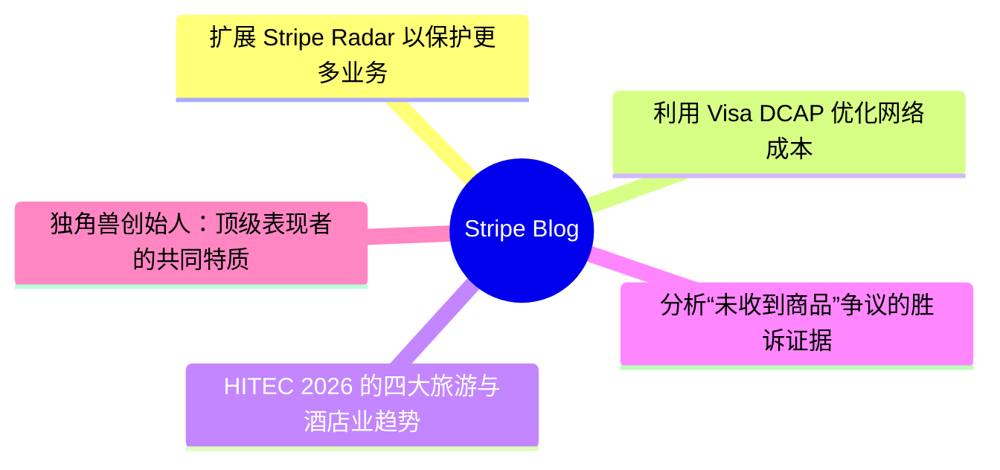
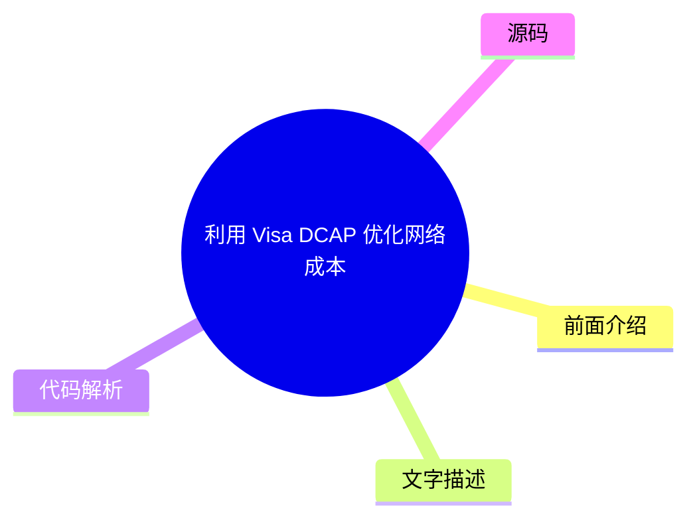
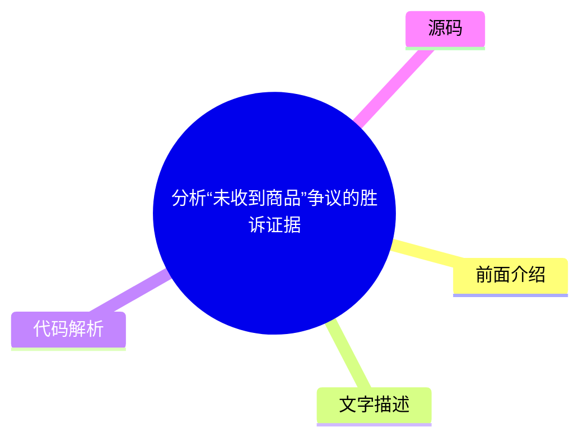
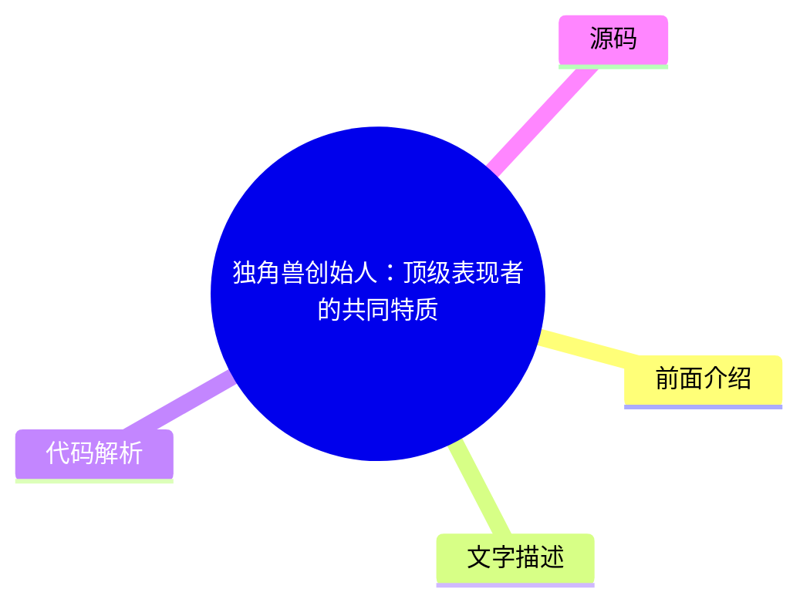

# 💳 Stripe Blog Top 5 (2026-07-28)

## 前面介绍

- 数据源：Stripe Blog
- 抓取日期：2026-07-28
- 条目数：5
- 含完整正文：5
- 含代码片段：0
- 组织方式：前面介绍 / 树状图 / 文字描述 / 代码解析 / 源码

## 思维导图

## 详细整理（5 条，5 条含全文，0 条含代码）

### 1. 扩展 Stripe Radar 以保护更多业务
- **链接**: [https://stripe.com/blog/expanding-stripe-radar-to-protect-more-of-your-business](https://stripe.com/blog/expanding-stripe-radar-to-protect-more-of-your-business)
- **发布**: Wed, 27 May 2026 00:00:00 +0000

#### 前面介绍

- Radar 现在可拦截所有支持支付方式的高风险交易
- 无论使用哪个支付处理器，都能防御多账户滥用等新型欺诈
- 为平台提供新的工具来评估和缓解商户风险

#### 树状图

#### 文字描述

- Radar 现在支持全球所有主要支付方式，包括银行借记、先买后付(BNPL)、加密货币、数字钱包等。当检测到欺诈模式时，相关信息会在整个网络中共享，例如通过 IP 地址和设备指纹来标记欺诈行为
- 引入了多处理器信号，Stripe 可以识别支付是否可能触发卡组织的早期欺诈警告或导致欺诈性拒付，帮助企业提前采取退款或收集证据等措施
- 推出了企业级自定义欺诈模型，允许企业传入产品目录、忠诚度状态、行为指标等独特信号，结合全球网络数据进行定制化部署，早期采用者显示欺诈检测率至少提高了 15%

#### 代码解析

- 本文未提供源码，以下为实现思路或结构解析

#### 源码

#### 中文节选

Last month at Stripe Sessions, we shared the biggest expansion we’ve ever made to [Stripe Radar](https://stripe.com/radar), our AI-powered fraud prevention tool. Radar now blocks high-risk transactions across all supported payment methods; defends against new fraud types like multi-account abuse and pay-as-you-go abuse, regardless of which payment processor you use; and gives platforms new tools to evaluate and mitigate merchant risk on and off Stripe. We also launched additional ways to fight disputes with smarter evidence and automated evidence libraries.

Here’s a closer look at what we announced.

## Protect more transactions with global payment coverage, new multiprocessor signals, and custom models

Fraud protection is getting more complex. Businesses need to defend across a range of payment methods, and they need more precision in the signals they use to catch fraud before it happens—on and off Stripe. Radar now addresses both, along with the ability to use custom fraud models.

**Block high-risk transactions across all supported global payment methods
**

Radar now protects [all supported payment volume globally](https://docs.stripe.com/radar/local-payment-methods), including bank debits, buy now, pay later (BNPL) options, crypto, digital wallets, real-time payments, and cash vouchers. When Radar detects a fraudulent pattern on a transaction, that information becomes available to protect transactions across all payment methods. For example, if a fraudulent actor uses a stolen credit card at one business on Stripe, and we detect and block it, that same IP address and device fingerprint are now flagged across bank debits, wallets, and BNPL transactions network-wide. We found that Radar reduced suspected fraud by 71% during a five-month period for businesses using Affirm, Cash App, Klarna, and PayPal. 

**Improve your fraud decisioning with new multiprocessor signals
**

Businesses use Radar’s risk signals for off-Stripe transactions to complement their in-house fraud models and make more precise fraud decisions across payment processors. Now, you can further improve your fraud decisioning with additional signals for off-Stripe transactions to help you prevent fraud before it happens.

Stripe can now identify whether a payment is [likely to trigger an early fraud warning](https://docs.stripe.com/radar/multiprocessor#early-fraud-warning) from the card network. You can then choose to proactively refund the transaction and protect your dispute rate. 

Stripe can also predict whether a payment is [likely to result in a fraudulent dispute](https://docs.stripe.com/radar/multiprocessor#fraudulent-dispute). You can use this signal to issue refunds, gather evidence, or adjust your dispute strategy. 

We plan to add new signals that can be used across your entire payments stack.

**Access enterprise-grade custom fraud models
**

For businesses with more complex risk profiles, Radar now offers [custom fraud models](https://docs.stripe.com/radar/custom-

#### 完整正文（中文）

上个月在 Stripe Sessions 上，我们分享了迄今为止对 [Stripe Radar](https://stripe.com/radar)（我们的人工智能驱动的欺诈防护工具）最大的一次扩展。Radar 现在可以阻止所有支持的支付方式下的高风险交易；无论您使用哪家支付处理器，都能防御多账户滥用和按需付费滥用等新型欺诈；并为平台提供了新的工具，用于评估和缓解 Stripe 内外商户的风险。我们还推出了更多方式，利用更智能的证据和自动化的证据库来处理争议。

以下是我们要宣布内容的详细情况。

## 利用全球支付覆盖、新的多处理器信号和自定义模型保护更多交易

欺诈防护正变得越来越复杂。企业需要在多种支付方式下进行防御，并且需要更精确的信号来在欺诈发生前将其捕获——无论是在 Stripe 上还是 Stripe 外。Radar 现在同时解决了这两个问题，并增加了使用自定义欺诈模型的能力。

**阻止所有支持的全球支付方式下的高风险交易**

Radar 现在可以保护 [全球所有支持的交易量](https://docs.stripe.com/radar/local-payment-methods)，包括银行借记、先买后付 (BNPL) 选项、加密货币、数字钱包、实时支付和现金代金券。当 Radar 在交易中检测到欺诈模式时，该信息将可用于保护所有支付方式下的交易。例如，如果欺诈行为者在 Stripe 上的某家企业使用被盗信用卡，而我们检测并阻止了该行为，那么该 IP 地址和设备指纹现在会在银行借记、钱包和 BNPL 交易中全网标记。我们发现，对于使用 Affirm、Cash App、Klarna 和 PayPal 的企业，Radar 在五个月内将可疑欺诈减少了 71%。

**利用新的多处理器信号改进您的欺诈决策**

Businesses use Radar’s risk signals for off-Stripe transactions to complement their in-house fraud models and make more precise fraud decisions across payment processors. Now, you can further improve your fraud decisioning with additional signals for off-Stripe transactions to help you prevent fraud before it happens.

Stripe can now identify whether a payment is [likely to trigger an early fraud warning](https://docs.stripe.com/radar/multiprocessor#early-fraud-warning) from the card network. You can then choose to proactively refund the transaction and protect your dispute rate. 

Stripe can also predict whether a payment is [likely to result in a fraudulent dispute](https://docs.stripe.com/radar/multiprocessor#fraudulent-dispute). You can use this signal to issue refunds, gather evidence, or adjust your dispute strategy. 

We plan to add new signals that can be used across your entire payments stack.

**Access enterprise-grade custom fraud models
**

For businesses with more complex risk profiles, Radar now offers [custom fraud models](https://docs.stripe.com/radar/custom-fraud-models). You can pass signals unique to your business to Stripe, such as product catalog data, loyalty status, behavioral metrics, or any structured metadata relevant to your risk profile. Stripe then combines this information with our global network data to deploy a model customized specifically to your business. For early adopters, custom models are detecting at least 15% more fraud with no increase in false positives.

## Defend against new types of fraud

Fraudulent actors have become as sophisticated at stealing compute as they are at stealing money. They abuse policies by cycling through free trials, setting up multiple accounts, or intentionally not paying their next invoice. As businesses scale AI products, token abuse has become an expensive fraud vector.

Last month, we shared how Radar addresses one of these fraud vectors with [free trial abuse prevention](https://stripe.com/blog/how-stripe-radar-helps-prevent-free-trial-abuse). At Sessions, we highlighted new ways to protect your business against multi-account abuse, pay-as-you-go fraud, and fraudulent bot-driven payments.

**Block multi-account abuse
**

Multi-account abuse is when a single fraudulent actor creates several accounts to reuse promotional coupons or spread stolen card activity across multiple accounts to avoid detection for longer. Across the Stripe network, more than one in six sign-ups at AI companies are linked to multi-account abuse.

Now, Radar can [evaluate each new account in real time](https://docs.stripe.com/radar/multi-account-and-account-sharing-abuse#multi-account-abuse), so you can block suspicious accounts before abuse happens—on and off Stripe. Our solution draws on information from prior abuse across the entire Stripe network, including device fingerprints, IP addresses, email domains, and more. In the past two months, ElevenLabs has been able to block 2,000 users a day from abusing its free tier. 

**Predict pay-as-you-go abuse
**

Pay-as-you-go abuse occurs when customers abuse your service by racking up usage costs with no intention of paying when the bill comes due. These bad actors exploit the structure of consumption-based pricing, where charges accumulate throughout a billing cycle, but payment happens later. For example, a customer could consume thousands of dollars of compute over the course of a month, get billed at the end, and never pay.

Radar now helps [predict nonpayment abuse as usage accumulates](https://docs.stripe.com/radar/pay-as-you-go-abuse), allowing you to intervene before a customer is billed. This allows you to require a top-up, cut off service, or take whatever action fits your risk tolerance.  

**Detect and prevent fraudulent bot-driven payments
**

As agentic commerce scales, distinguishing between legitimate agents acting on behalf of customers and malicious bots becomes increasingly important. Both are nonhuman traffic making purchases, but one is a customer’s authorized agent, and the other might exploit your checkout to buy limited-availability inventory, abuse promotional pricing, or bypass purchase limits.

Radar now assigns a bot score to payments made on Stripe Checkout, evaluating the likelihood that [they were made by a malicious bot](https://docs.stripe.com/radar/bot-abuse). You can use this score to enforce anti-scripting or anti-bot policies. For example, you could block automated purchases of limited-edition items or flag high-velocity orders for review.

## Protect your platform from account fraud

Fraudulent actors are using generative AI to create fake identities, documents, and websites convincing enough to bypass many platforms’ verification systems. Platforms face a trade-off: request additional information during onboarding and increase friction, or keep the onboarding flow lightweight and take on potentially significant risk.

[Platforms can now mitigate risk](https://docs.stripe.com/radar/radar-for-platforms) across their business with Radar, featuring 0-to-100 fraud scores for every business and transaction; AI-powered insights that explain why accounts are flagged; note taking and account history to help your team understand account context; and account-level metrics for disputes, declines, refunds, and payments. 

We also introduced three new ways platforms can monitor and evaluate merchant risk—on and off Stripe.

- The [fraudulent website](https://docs.stripe.com/radar/fraudulent-website)signal analyzes a business’s website the way a human fraud analyst would, looking for red flags like luxury items sold at unrealistically low prices, AI-generated copy, misspelled brand URLs, or other indicators that suggest the site is fraudulent. Platforms can use this signal during onboarding to automate verifications, flag accounts for manual review, or as an input to their own risk scoring before approving a business.
- The [fraudulent merchant](https://docs.stripe.com/radar/fraudulent-merchant)signal identifies whether a new or existing account poses a fraud risk, based on analyzing patterns across the Stripe network, including bank account information, business details, transaction activity, and disputes. Platforms can then raise a review, pause payouts, pause payments, reject the account, set reserves, or request identity verification.

- [商户拖欠风险](https://docs.stripe.com/radar/merchant-delinquency-risk)信号预测企业是否面临产生负余额的风险；具体而言，它预测该余额是否可能持续为负 60 天或更长时间。平台可利用此信号来决定是否主动调整结算计划，对高风险账户要求预留金，或在损失累积之前标记商户以进行更密切的审查。

## 利用更智能的证据和自动证据库更有效地应对争议

[智能争议](https://docs.stripe.com/disputes/smart-disputes)是我们基于 AI 的争议管理产品，它一直代表您整理并提交证据。现在，智能争议可以制定更定制化的策略，以提高您赢得每起争议的几率。

智能争议会分析每起争议，并为特定证据字段（如追踪号码或客户使用日志）提供 [AI 驱动的建议](https://docs.stripe.com/disputes/set-up-smart-disputes#provide-more-data-at-dispute-time)。通过智能争议添加我们 AI 推荐证据的企业，其胜诉频率比未添加任何证据的企业高出 3 倍。

我们还在减少提交证据所需的人工工作量。许多争议需要相同的支持材料：条款和条件、退货政策和服务协议。借助证据库，您只需上传并存储这些文档一次，智能争议便会根据争议的原因代码、网络要求和持卡人主张，自动选择并将它们包含在您的证据包中——无需手动重新提交。

## 接下来是什么

在 Sessions 上，我们还发布了 [我们的公开路线图](https://stripe.com/roadmap)：一份包含 2027 年第一季度数百个详细条目的明细清单，其中包括 [Radar 中的产品、功能和改进](https://stripe.com/roadmap?product=Radar)。

To learn more about how Radar can protect your business, join us in major global cities for [Stripe Tour 2026](https://stripetour.com/). You can also [read our docs](https://docs.stripe.com/radar) or [get in touch](https://stripe.com/contact/sales) with an expert from our team.

### 2. 利用 Visa DCAP 优化网络成本
- **链接**: [https://stripe.com/blog/helping-businesses-optimize-network-costs-with-visa-digital-commerce-authentication-program](https://stripe.com/blog/helping-businesses-optimize-network-costs-with-visa-digital-commerce-authentication-program)
- **发布**: Wed, 03 Jun 2026 00:00:00 +0000

#### 前面介绍

- DCAP 奖励在认证时分享丰富交易数据的企业
- 通过 Stripe Authorization Boost 智能选择交易以捕获节省
- 在保护授权率的同时实现 8 倍的 DCAP 合格交易增长

#### 树状图

#### 文字描述

- Visa 的数字商务认证计划(DCAP)旨在减少欺诈并提高卡不在场交易的授权率，符合条件的交易可享受 5 个基点的净交换费减免
- Stripe Authorization Boost 智能评估每笔交易的成本节省、转化影响和欺诈风险，决定何时应用仅发送风险数据的 Data Only 3DS，从而在不牺牲客户体验的情况下捕获 DCAP 节省
- 自 4 月 18 日起，已帮助 Stripe 商户从 DCAP 中捕获了 1840 万美元的年度化网络成本节省，并确保了授权率不受影响

#### 代码解析

- 本文未提供源码，以下为实现思路或结构解析

#### 源码

#### 中文节选

Visa recently launched the [Digital Commerce Authentication Program (DCAP)](https://support.stripe.com/questions/understand-the-visa-digital-commerce-authentication-program-%28dcap%29-on-stripe), a new global framework designed to reduce fraud and increase authorization rates for card-not-present transactions. The program rewards businesses in the US for sharing richer transaction data with issuers during authentication, such as device ID, billing address, IP address, and customer email. Qualifying transactions receive a net interchange reduction of five basis points.

New network programs create opportunity, but they also introduce complexity. Businesses need to understand which transactions qualify, ensure their integration passes the required data, and determine whether participating will improve their end-to-end transaction economics or have unintended consequences, such as hurting authorization rates.

To participate in DCAP, businesses need to share required cardholder data with issuers via frictionless authentication in their checkout. This might introduce latency and uncertainty around how issuers interpret these newer signals.

We moved quickly to help Stripe businesses take advantage of DCAP and capture interchange savings while protecting authorization rates. Here’s what we did.

### Optimizing DCAP savings without sacrificing conversion

Before rolling out DCAP, we worked with Visa to run readiness testing and identify the right implementation approach. This collaborative testing underscored the need for transaction-level intelligence.

With [Stripe Authorization Boost](https://stripe.com/authorization-boost), we intelligently select which transactions should go through [Data Only 3DS](https://docs.stripe.com/payments/3d-secure/strong-customer-authentication-exemptions#data-only), which sends additional risk data from the card network to the issuer for authorization. Rather than applying static rules, Authorization Boost evaluates cost savings, conversion impact, and fraud risk at the individual transaction level to determine when to apply Data Only 3DS. This allows businesses to capture DCAP savings while limiting the impact to the customer experience and optimizing authorization rates.

Since April 18, we’ve helped Stripe businesses capture $18.4 million in annualized network cost savings from DCAP. By helping businesses collect and pass the required data, we saw an 8x increase in the number of DCAP-eligible transactions. We’re continuing to work with Visa to optimize eligibility, so more transactions can benefit from DCAP.

## Automatically benefit from DCAP optimizations

If you use Authorization Boost and are collecting the required data points, you’re already automatically benefiting from DCAP optimizations. For businesses using [standalone 3DS](https://docs.stripe.com/payments/3d-secure/standalone-3d-secure), you can participate by setting **flow_preference[type]** to `data_share` on authentication requests and ensuring require

#### 完整正文（中文）

Visa recently launched the [Digital Commerce Authentication Program (DCAP)](https://support.stripe.com/questions/understand-the-visa-digital-commerce-authentication-program-%28dcap%29-on-stripe), a new global framework designed to reduce fraud and increase authorization rates for card-not-present transactions. The program rewards businesses in the US for sharing richer transaction data with issuers during authentication, such as device ID, billing address, IP address, and customer email. Qualifying transactions receive a net interchange reduction of five basis points.

New network programs create opportunity, but they also introduce complexity. Businesses need to understand which transactions qualify, ensure their integration passes the required data, and determine whether participating will improve their end-to-end transaction economics or have unintended consequences, such as hurting authorization rates.

To participate in DCAP, businesses need to share required cardholder data with issuers via frictionless authentication in their checkout. This might introduce latency and uncertainty around how issuers interpret these newer signals.

We moved quickly to help Stripe businesses take advantage of DCAP and capture interchange savings while protecting authorization rates. Here’s what we did.

### Optimizing DCAP savings without sacrificing conversion

Before rolling out DCAP, we worked with Visa to run readiness testing and identify the right implementation approach. This collaborative testing underscored the need for transaction-level intelligence.

With [Stripe Authorization Boost](https://stripe.com/authorization-boost), we intelligently select which transactions should go through [Data Only 3DS](https://docs.stripe.com/payments/3d-secure/strong-customer-authentication-exemptions#data-only), which sends additional risk data from the card network to the issuer for authorization. Rather than applying static rules, Authorization Boost evaluates cost savings, conversion impact, and fraud risk at the individual transaction level to determine when to apply Data Only 3DS. This allows businesses to capture DCAP savings while limiting the impact to the customer experience and optimizing authorization rates.

Since April 18, we’ve helped Stripe businesses capture $18.4 million in annualized network cost savings from DCAP. By helping businesses collect and pass the required data, we saw an 8x increase in the number of DCAP-eligible transactions. We’re continuing to work with Visa to optimize eligibility, so more transactions can benefit from DCAP.

## Automatically benefit from DCAP optimizations

If you use Authorization Boost and are collecting the required data points, you’re already automatically benefiting from DCAP optimizations. For businesses using [standalone 3DS](https://docs.stripe.com/payments/3d-secure/standalone-3d-secure), you can participate by setting **flow_preference[type]** to `data_share` on authentication requests and ensuring required fields are populated.

Learn more about how [Authorization Boost](https://docs.stripe.com/payments/analytics/optimization) can help optimize your payments performance.

### 3. HITEC 2026 的四大旅游与酒店业趋势
- **链接**: [https://stripe.com/blog/trends-from-hitec](https://stripe.com/blog/trends-from-hitec)
- **发布**: Tue, 23 Jun 2026 00:00:00 +0000

#### 前面介绍

- AI 投资的实际效果与行业预期存在巨大差距
- 直接预订竞争已从搜索引擎排名转向 AI 回答
- 大多数酒店 AI 缺乏可持续运营的数据基础和架构

#### 树状图

#### 文字描述

- IDC 预测到 2030 年，30% 的旅行预订将由 AI 代理完成，但行业目前缺乏相应的数据基础设施来支持这种转变
- 传统的 SEO 策略正在失效，65% 的 Google 搜索因 AI 概览而未产生点击，酒店需要提供结构化数据以被 AI 模型识别，目前 90% 的住宿网站对 AI 不可见
- 许多酒店仍在使用过时的支付系统，导致收入损失，且 AI 的成功依赖于整合的财务基础设施，包括实时库存和现代化的结账体验

#### 代码解析

- 本文未提供源码，以下为实现思路或结构解析

#### 源码

#### 中文节选

超过 6,000 名酒店业高管和经营者上周齐聚圣安东尼奥，参加年度 HITEC 酒店科技会议，其中包括万豪度假酒店、凯悦、洲际酒店集团、万豪酒店以及数百家独立物业的领导者。

主要议题：行业的人工智能投资是否真的奏效。IDC 预测，到 2030 年，30% 的所有旅行预订将由人工智能代理完成。但行业的发展方向与当前具备的支持能力之间存在巨大差距。

根据 BCG 的数据，虽然 25% 的酒店企业报告目前正在积极扩展人工智能，但不到 10% 的企业被认为是“AI 未来构建型”——这意味着它们在核心运营中植入了人工智能，拥有支持性的数据基础，并取得了可衡量的回报。“许多公司只是在盲目尝试，看能不能行得通，”佛罗里达国际大学酒店技术副教授 Dale Gomez 说。“他们想要看到投资回报率。”

其他变革正在推进中。许多酒店企业仍然缺乏现代金融基础设施，无法充分受益于人工智能预计带来的自动化、速度和互操作性。曾经被认为“足够好”的支付系统现在正在造成可衡量的收入损失，而不断上升的客人期望已将低效的技术从一个小麻烦变成了不再光顾的理由。

在四天的时间里，举行了 50 多次会议，四个趋势脱颖而出。

## 直接预订的竞争已从搜索排名转向 AI 回答

多年来，酒店业应对在线旅行社 (OTA) 依赖症的方法是 SEO：投资内容，提高搜索排名，并在客人最终出现在 Expedia 或 Booking.com 之前将其转化。这种方法正变得越来越无效。

Jack Wang, principal solution engineer at Salesforce, offered data that spotlights a shift: 65% of Google searches that trigger an AI Overview now end without the user clicking any website. On mobile, that number climbs to 78%. Traditional search traffic is declining roughly 25% across the industry, as AI-generated summaries replace the ranked link lists that SEO was designed to win.

Inclusion in an AI-generated answer requires something different from what SEO rewards. SEO responds to keyword density, backlinks, and page authority. AI inclusion responds to the accuracy and machine-readability of structured property data, like room types, amenity details, policies, local context, or cancellation terms. A hotel can rank well in traditional search and be invisible to an LLM: over [90%](https://www.nokumo.net/en/ai-visibility-in-hospitality-what-3-600-ai-responses-and-1-337-website-audits-reveal?utm_campaign=ennismore-proves-tech-investment-pays-off-and-94-of-hotels-are-invisible-to-ai) of accommodatio

#### 完整正文（中文）

超过 6,000 名酒店业高管和经营者上周齐聚圣安东尼奥，参加年度 HITEC 酒店科技会议，其中包括万豪度假酒店、凯悦、洲际酒店集团、万豪酒店以及数百家独立物业的领导者。

主要议题：行业的人工智能投资是否真的奏效。IDC 预测，到 2030 年，30% 的所有旅行预订将由人工智能代理完成。但行业的发展方向与当前具备的支持能力之间存在巨大差距。

根据 BCG 的数据，虽然 25% 的酒店企业报告目前正在积极扩展人工智能，但不到 10% 的企业被认为是“AI 未来构建型”——这意味着它们在核心运营中植入了人工智能，拥有支持性的数据基础，并取得了可衡量的回报。“许多公司只是在盲目尝试，看能不能行得通，”佛罗里达国际大学酒店技术副教授 Dale Gomez 说。“他们想要看到投资回报率。”

其他变革正在推进中。许多酒店企业仍然缺乏现代金融基础设施，无法充分受益于人工智能预计带来的自动化、速度和互操作性。曾经被认为“足够好”的支付系统现在正在造成可衡量的收入损失，而不断上升的客人期望已将低效的技术从一个小麻烦变成了不再光顾的理由。

在四天的时间里，举行了 50 多次会议，四个趋势脱颖而出。

## 直接预订的竞争已从搜索排名转向 AI 回答

多年来，酒店业应对在线旅行社 (OTA) 依赖症的方法是 SEO：投资内容，提高搜索排名，并在客人最终出现在 Expedia 或 Booking.com 之前将其转化。这种方法正变得越来越无效。

Salesforce 的首席解决方案工程师 Jack Wang 提供的数据凸显了这一转变：现在，65% 触发 AI 概览的 Google 搜索最终都没有用户点击任何网站。在移动端，这一数字上升至 78%。随着 AI 生成的摘要取代了 SEO 旨在赢得的排名链接列表，传统搜索流量在整个行业范围内下降了约 25%。

被纳入 AI 生成的答案需要与 SEO 奖励的内容有所不同。SEO 响应的是关键词密度、反向链接和页面权威性。AI 纳入则响应的是结构化属性数据的准确性和机器可读性，如房型、设施详情、政策、本地背景或取消条款。一家酒店可能在传统搜索中排名靠前，但对 LLM 来说却是不可见的：超过 [90%](https://www.nokumo.net/en/ai-visibility-in-hospitality-what-3-600-ai-responses-and-1-337-website-audits-reveal?utm_campaign=ennismore-proves-tech-investment-pays-off-and-94-of-hotels-are-invisible-to-ai) 的住宿网站仍被 AI 模型未检测到。

我们已经看到了下游效应。根据 Phocuswright 的研究，[56%](https://www.phocuswire.com/news/online/shift-travel-behavior-ai-surge-phocuswright-research) 的旅行者在过去 12 个月中曾使用 AI 进行行程规划、预订或在目的地协助。对于运营商来说，第一步是审计，而不是投资。您潜在客人使用的 LLM 能否准确描述您酒店的房型、设施、政策和本地背景？如果答案是否定的，这个差距很可能会让您损失预订。

如今，酒店集团可以访问与 OTA 相同的结账和支付工具，包括本地支付方式和货币、一键结账以及全球欺诈保护。捕捉代理需求的旅游品牌正在将 AI 驱动的可发现性与准确的实时库存以及能高效转化需求的现代化结账体验相结合。

## 大多数酒店业 AI 在一个可预测的方式上表现不足

在 HITEC 期间，一个令人不安的事实反复出现：酒店业正在发生的许多 AI 扩展都是脆弱的。大多数企业都在采用 AI，却缺乏维持其发展的战略清晰度、数据基础和运营架构。

根本原因通常是数据碎片化。孤立的物业管理系统、CRM、忠诚度、餐饮和支付系统各自只持有关于同一客人的部分信息——而 AI 推荐的准确性仅取决于其调用的内容。同样导致 AI 个性化失效的数据问题，在财务上表现为过长的对账时间，在运营上表现为不完整的客人档案，在客人体验上则表现为摩擦。

Salesforce 首席解决方案工程师 Amanda Sharp 将这一问题重新定义为 AI 运营化而非采用，并呼吁进行“氛围运营”：这是酒店业对氛围编码的回应。如今，许多酒店品牌构建 AI 功能已成为可能。但在生产环境中可靠地运行它们，并将其集成到触发实际操作的真正工作流程中，则要困难得多。

在这方面做得好的企业拥有干净、连接的数据，能够在采取行动的时机内，将有用的情报直接传递到工作流程中。例如，达美航空在其移动应用中内置了实时 AI 礼宾，利用 SkyMiles 档案和运营数据，作为客户关怀体验的一部分提供上下文感知的支持。在永利拉斯维加斯，收益经理在业绩低于目标时，会收到预测性警报以及附带的建议行动。

对于大多数旅游运营商来说，瓶颈在于数据连接，而非模型质量。

## 支付摩擦具有可衡量的成本，但大多数酒店仍不知道其具体数额

The hospitality industry has historically treated payments as a cost and commodity: something to keep running, minimize fees on, and keep out of the way. Many of the payments-specific conversations we had at HITEC revolved around how that approach is changing, along with a growing recognition that payments have become a key factor in how hospitality brands compete. Our own data supports this: in a Stripe-commissioned [survey](https://go.stripe.global/rs/072-MDK-283/images/Skift_x_Stripe_How_Payment_Systems_Are_Changing_in_Travel_and_Hospitality.pdf) of nearly 400 hospitality executives, 90% said payments are important to growth, and 37% said that a lack of payment options has the greatest negative impact on the guest experience. In addition, 58% said their fraud systems block legitimate transactions, and 74% reported that fragmented systems cause their teams to spend excessive time on reconciliation.

Those figures highlight why payments have become a structural advantage. OTAs can afford to staff payments at scale because their revenue justifies the head count. Independent hotels and smaller operators can’t match that investment directly, but a lean team on the right infrastructure can now support payment methods across dozens of countries at a fraction of the cost of a large in-house operation.

A coverage gap translates directly to lost bookings. “The moment we don’t support [a payment method] is the moment this guest goes elsewhere, to a platform or channel that supports their preferred way to pay,” said Sebastien Leitner, VP of strategic partnerships at Cloudbeds. Guests book where their preferred payment method works. A property that doesn’t support the dominant method in a target market isn’t just creating friction—it’s routing that booking to an OTA that does.

## The best hospitality technology is the kind that goes unnoticed

“There is zero empathy for technology that doesn’t work,” said Tanya Pratt, global VP of strategy and product management at Oracle Hospitality. “If it’s not working, it’s going to cause more frustration than if there’s a line at the front desk, because people are used to that.” When technology fails, guests don’t always complain. They just don’t come back.

The real gauge of success is when technology works well enough that guests don’t think about it at all. Denise Walker, CIO of Starwood Hotels, described the vision: a returning guest arrives to a room at the right temperature, with their preferred channels on the TV, and pillows of their preferred firmness on the bed. No one announces how they knew. “It doesn’t have to be delivered in a way that says, ‘How did you know that?’”

Shannon McCallum, VP of hotel operations at Resorts World Las Vegas, went further. “We’re moving from ‘I told you this, so you know it about me’ to ‘I didn’t tell you anything, and now you’re predicting it.’”

Both the invisible personalization and the human moments it enables require a foundation of connected data—tech that integrates across your existing stack, consolidating guest information into a single system. That infrastructure allows businesses to recognize the same guest whether they’re browsing your website or standing at the front desk.

## How Stripe can help

Increasingly, guests will find your property through AI assistants rather than search engines. The bookings they make might be completed by agents. And the revenue that distinguishes high-performing operators will come from payment experiences that convert, payment methods that cover every market, and financial systems that work together. Stripe Data Pipeline connects payments data with your booking and customer systems, giving operators a unified view of revenue without stitched-together reporting.

Stripe’s payments infrastructure helps hospitality operators protect revenue, boost guest spend on-property, and simplify operations.

**Drive direct bookings.** Across the payment methods guests actually use and in every market you serve, payment experiences that convert help keep bookings on your direct channel. As agentic commerce scales, that means fraud detection that runs on every Stripe transaction by default and payment tokens that allow agents to transact without exposing guest credentials. 

**Increase trip spend.** Ancillary revenue from dining, experiences, and partnerships requires payments infrastructure that works across the property, supports new business models, and connects with external partners. Stripe Billing handles the recurring payment logic behind membership and loyalty programs, including automatic renewals, tiered pricing, and failed payment recovery—without requiring operators to maintain that infrastructure themselves. [Cloudbeds](https://stripe.com/customers/cloudbeds), for example, saw 15% revenue growth for businesses using Cloudbeds Payments and a 14.8% average increase in revenue for businesses expanding payment methods by directly removing payment friction through its Stripe partnership.

**Cut costs.** More efficient B2B money movement and fraud protection reduce reconciliation work and limit losses, freeing up margin without adding staff.

[Learn more](https://stripe.com/industries/travel) about how Stripe supports hospitality businesses, or [get in touch](https://stripe.com/contact/sales).

### 4. 分析“未收到商品”争议的胜诉证据
- **链接**: [https://stripe.com/blog/analyzing-the-evidence-that-helps-businesses-win-product-not-received-disputes](https://stripe.com/blog/analyzing-the-evidence-that-helps-businesses-win-product-not-received-disputes)
- **发布**: Tue, 21 Jul 2026 00:00:00 +0000

#### 前面介绍

- 提交交付确认信息可提高 44 个百分点的胜诉率
- 在交付确认后提交证据比在运输中提交胜率更高
- 数字商品提交使用日志可提高 10 个百分点的胜诉率

#### 树状图

#### 文字描述

- 对于销售实物商品的企业，包含交付确认、GPS 地图和签名的证据包，其胜诉率比没有这些证据高出 44 个百分点
- 分析显示，在交付确认后提交证据的争议胜诉率比未确认时高出 27 个百分点，而在运输中提交证据仅高出 2 个百分点，建议在争议窗口允许的情况下等待确认后再提交
- 对于数字商品，提交数字活动和使用日志（如流媒体、下载记录）比仅提供服务文档（如配置记录）的胜率更高，这证明了具体性在证据中的重要性

#### 代码解析

- 本文未提供源码，以下为实现思路或结构解析

#### 源码

#### 中文节选

“[未收到商品](https://docs.stripe.com/disputes/categories)” 纠纷——即持卡人声称他们未收到所付款项——是 Stripe 上最常见的非欺诈纠纷类别。很难判断哪些索赔是合理的，哪些不是：有些客户确实从未收到他们所付款项的商品，而另一些人则错误地声称他们没有收到订单。

为了了解哪些因素会影响胜诉率，我们在 16 周的时间内分析了 100 万起纠纷的证据包。我们将包含各种类型证据（如投递确认或内容消费日志）的包的胜诉率与不包含这些证据的包进行了比较，从而确定了哪些特征与更高的胜诉率相关。

以下是数据对各类企业的普遍情况、销售数字商品的企业有何不同，以及这对您如何缓解纠纷意味着什么。

**提交投递信息的企业胜诉率高出 44 个百分点**

对于销售实物商品的企业，有投递确认作为证据的纠纷的胜诉率比没有投递确认的纠纷高出 27 个百分点。添加 GPS 投递地图作为证据（显示承运人扫描包裹的位置）在仅有投递确认的基础上又提高了 15 个百分点的胜诉率。而包含收件人签名作为证据则进一步提高了 2 个百分点。因此，包含投递确认、GPS 地图和签名的纠纷的胜诉率比没有这些证据的纠纷高出 44 个百分点。

然而，许多企业仍然没有在纠纷回复中包含投递确认。这种差距的一部分是由于意识不足，但更大的障碍在于运营。对于大多数企业来说，发货数据和纠纷工作流位于不同的系统中。将特定的纠纷与正确的订单以及已确认的投递状态进行匹配通常需要人工操作，且难以扩展。

## 在投递确认后提交证据的企业胜诉率高出 27 个百分点

许多企业会提交运输跟踪 ID 作为交付证明。然而，根据您提交证据时包裹的状态，该跟踪号可能仅能确认包裹已离开您的设施。

我们的分析发现，企业提交跟踪 ID 时显示的内容会影响胜诉率——具体而言，即是否已确认送达。在确认送达后提交证据的争议，其胜诉率比未确认送达的争议高出 27 个百分点。另一方面，在包裹仍在运输途中时提交证据的争议，其胜诉率仅比未确认送达的争议高出 2 个百分点。

这表明您提交证据的时机很重要。客户可能会在订单到达之前就提起“未收到商品”的争议，尤其是当发货延迟或仍在运输途中时。因为大多数企业

#### 完整正文（中文）

“[未收到商品](https://docs.stripe.com/disputes/categories)” 纠纷——即持卡人声称他们未收到所付款项——是 Stripe 上最常见的非欺诈纠纷类别。很难判断哪些索赔是合理的，哪些不是：有些客户确实从未收到他们所付款项的商品，而另一些人则错误地声称他们没有收到订单。

为了了解哪些因素会影响胜诉率，我们在 16 周的时间内分析了 100 万起纠纷的证据包。我们将包含各种类型证据（如投递确认或内容消费日志）的包的胜诉率与不包含这些证据的包进行了比较，从而确定了哪些特征与更高的胜诉率相关。

以下是数据对各类企业的普遍情况、销售数字商品的企业有何不同，以及这对您如何缓解纠纷意味着什么。

**提交投递信息的企业胜诉率高出 44 个百分点**

对于销售实物商品的企业，有投递确认作为证据的纠纷的胜诉率比没有投递确认的纠纷高出 27 个百分点。添加 GPS 投递地图作为证据（显示承运人扫描包裹的位置）在仅有投递确认的基础上又提高了 15 个百分点的胜诉率。而包含收件人签名作为证据则进一步提高了 2 个百分点。因此，包含投递确认、GPS 地图和签名的纠纷的胜诉率比没有这些证据的纠纷高出 44 个百分点。

然而，许多企业仍然没有在纠纷回复中包含投递确认。这种差距的一部分是由于意识不足，但更大的障碍在于运营。对于大多数企业来说，发货数据和纠纷工作流位于不同的系统中。将特定的纠纷与正确的订单以及已确认的投递状态进行匹配通常需要人工操作，且难以扩展。

## 在投递确认后提交证据的企业胜诉率高出 27 个百分点

Many businesses submit a shipping tracking ID as proof of delivery. However, depending on the status of the package at the time you submit the evidence, the tracking number might only confirm that the package left your facility.

Our analysis found that win rates increased based on what the tracking ID showed when a business submitted it—specifically, whether delivery had been confirmed. Disputes with evidence submitted after delivery was confirmed had a 27 percentage point higher win rate than disputes with no delivery confirmation. On the other hand, disputes with evidence submitted when the package was still in transit had only a two percentage point higher win rate than disputes with no delivery confirmation.

This suggests that the timing of your evidence submission matters. Customers might file a “product not received” dispute before an order arrives, especially if a shipment is delayed or still in transit. Because most businesses have 20 or more days to respond, consider holding your submission until the carrier confirms arrival if your dispute window allows it. If you do need to submit before delivery is confirmed, consider including documentation showing that the order is still within the delivery time frame the customer agreed to at checkout.

## Businesses that submitted digital activity and usage logs saw a 10 percentage point higher win rate

Businesses selling digital goods also need to provide proof of fulfillment, though the supporting evidence looks different.

Disputes with digital activity and usage logs—such as JSON telemetry logs from common analytics platforms showing that a user streamed, downloaded, or accessed the specific product they purchased—had a 10 percentage point higher win rate than disputes without them. And disputes with service documentation, such as provisioning records, had an eight percentage point higher win rate than disputes without them.

这种模式与我们发现的企业销售实物商品的情况如出一辙：具体细节总是更好。服务文档可能只能证明客户有权访问。另一方面，内容消费日志可以证明客户流式传输、下载或访问了他们付费购买的具体产品。

## 包含通过 Stripe 发放退款证据的企业，胜诉率高出 63 个百分点

持卡人仍可能在退款处理后发起[争议](https://support.stripe.com/questions/disputes-on-a-refunded-transaction-faq)，这通常是因为退款和争议是在同一时间提交的，或者是发卡行在提交争议前未检查退款状态。当发生这种情况时，许多企业会在争议回复中包含退款证据，以证明他们已经让客户满意。但我们的分析显示，对于销售数字商品的企业，“退款证明”对胜诉率的影响取决于退款的处理方式。

通过 Stripe 发放的全额退款是销售数字商品的企业高胜诉率的最强预测因素。包含此类证据的争议，其胜诉率比不包含此类证据的争议高出 63 个百分点。另一方面，通过其他渠道（如商店积分）发放的退款，其争议的胜诉率仅比不包含此类证据的争议高出 6 个百分点。

这可能是因为发卡行只能对它们能够验证的信息采取行动。当退款通过支付处理商处理时，发卡行可以验证卡网络上的信用额度。发卡行无法以同样的方式验证通过支付处理商之外渠道发放的退款；因为没有记录。

## Stripe 如何提供帮助

[智能争议](https://docs.stripe.com/disputes/smart-disputes) 旨在为您应用这些最佳实践，帮助您节省时间并挽回收入。它使用人工智能为符合条件的卡争议自动组装量身定制的证据包，应用本分析中确定的数据驱动型最佳实践，因此您无需逐笔争议地手动实施这些实践。

You can increase your win rates by providing Smart Disputes with a shipping carrier and tracking number when you receive a dispute. Stripe supports more than 12 shipping providers and automatically works with them to pull the entire fulfillment history, such as delivery status, time stamps, and location data. You can also add any additional evidence, such as customer communications or supplementary documentation, and Stripe will merge it with the auto-generated packet to create the strongest possible response.

Stripe then assembles that information into a compelling evidence packet for you, optimizing packet content and structure based on the specific dispute, down to the network, region, issuer, and reason code. If you don’t take any action before the dispute deadline, Smart Disputes submits the evidence on your behalf to ensure disputes are not lost due to missed deadlines.

No additional integration is required if you already use Stripe. To learn more about Smart Disputes, [read our docs](https://docs.stripe.com/disputes/smart-disputes). 

*The insights, projections, and forward-looking statements contained here are for informational purposes only and should not be relied upon. These are based on assumptions and information currently available, but actual results may differ materially.*

### 5. 独角兽创始人：顶级表现者的共同特质
- **链接**: [https://stripe.com/blog/top-solo-founder-traits](https://stripe.com/blog/top-solo-founder-traits)
- **发布**: Thu, 28 May 2026 00:00:00 +0000

#### 前面介绍

- 顶级独角兽创始人构建 AI 原生产品
- 从启动之初就面向全球市场销售
- 专注于构建 B2B 业务并拥有更高的早期留存率

#### 树状图

#### 文字描述

- 2025 年，顶级独角兽创始人在前六个月的收入是中位数的 61 倍，而四年前这一比例为 34 倍
- AI 工具使得单人构建和迭代产品成为可能，顶级创始人更倾向于构建 B2B 业务，其收入是 B2C 创始人的两倍以上
- 顶级独角兽创始人在第一个月就平均进入 10 个国家销售，到第 24 个月平均进入 40 个非美国国家，且国际销售占总收入的 51%

#### 代码解析

- 本文未提供源码，以下为实现思路或结构解析

#### 源码

#### 中文节选

Solo startup founders，在此定义为通过 Stripe Atlas 独自创办公司且没有联合创始人的个人，占 2026 年第二季度迄今为止成立的 C 型公司的 63%——创历史新高。

随着更多创始人独自创办公司，典型公司与顶尖表现者之间的差距正在拉大。在通过 Atlas 成立的独立创始初创公司中，2025 年的中位初始六个月收入同比下降了 23%，而收入处于顶层十分位的公司则增长了 19%。

四年前，顶层十分位的独立创始人在前六个月收入约为中位独立创始人的 34 倍。到 2025 年，这一数字已增长到 61 倍。自 2022 年以来，年收入超过 10 万美元的自由职业者数量增加了 [三分之一](https://x.com/emilygsands/status/2049943675485253640)。

随着 AI 工具让一个人能够更轻松地构建、发布、支持客户和迭代，值得思考的是，是什么将那些脱颖而出与未能脱颖而出的公司区分开来。为了了解这一差距，我们分析了 2022 年和 2023 年成立的数千家 Atlas 独立创始初创公司，每家至少拥有两年的收入数据。在该群体中，我们将中位十分位的独立创始人与前两年总收入处于顶层十分位的人进行了比较，以了解是什么区分了最强的异常值。顶层十分位中出现了几种模式。

## 1. 他们构建 AI 原生产品

最成功的独立创始人在构建 AI 原生产品，这意味着产品的核心功能依赖于 AI 模型。顶层十分位的独立创始人构建 AI 原生公司的可能性约为中位创始人的两倍。“下一代独立创始人将不再由技术背景定义，而是由速度定义，”[Marc Lou](https://marclou.com/) 说，他独自创办了 34 家初创公司。“他们将是无代码人员，专注于解决问题，利用 AI 极速发布，并在社交媒体上破解分发渠道。”

到两年时，AI 原生独立创业公司的收入几乎是其他独立创业公司的两倍。起初，我们预期这一结果是由少数几家表现突出的公司拉高了平均值，但事实并非如此：99 分位数的收入对于 AI 原生和其他创业公司来说几乎相同。差异来自于更广泛的分布，AI 原生创业公司在大约第 50 到第 95 个百分位的表现优于其他创业公司。

## 2. 它们在启动时就进行全球销售

在第一个月，前十分位数的独立创始人平均销售到 10 个国家，而中位数独立创始人仅为 3 个。随着时间的推移，这一差距持续扩大。到第 24 个月时，前十分位数的独立创始人平均销售到 40 个非美国国家，而中位数独立创始人仅为 6 个。

顶尖独立创始人从本国市场以外的收入占比也大得多。国际销售占前十分位数独立创始人收入的 51%，而中位数独立创始人仅为 2%。其中的大部分差异

#### 完整正文（中文）

Solo startup founders，在此定义为通过 Stripe Atlas 独自创办公司且没有联合创始人的个人，占 2026 年第二季度迄今为止成立的 C 型公司的 63%——创历史新高。

随着更多创始人独自创办公司，典型公司与顶尖表现者之间的差距正在拉大。在通过 Atlas 成立的独立创始初创公司中，2025 年的中位初始六个月收入同比下降了 23%，而收入处于顶层十分位的公司则增长了 19%。

四年前，顶层十分位的独立创始人在前六个月收入约为中位独立创始人的 34 倍。到 2025 年，这一数字已增长到 61 倍。自 2022 年以来，年收入超过 10 万美元的自由职业者数量增加了 [三分之一](https://x.com/emilygsands/status/2049943675485253640)。

随着 AI 工具让一个人能够更轻松地构建、发布、支持客户和迭代，值得思考的是，是什么将那些脱颖而出与未能脱颖而出的公司区分开来。为了了解这一差距，我们分析了 2022 年和 2023 年成立的数千家 Atlas 独立创始初创公司，每家至少拥有两年的收入数据。在该群体中，我们将中位十分位的独立创始人与前两年总收入处于顶层十分位的人进行了比较，以了解是什么区分了最强的异常值。顶层十分位中出现了几种模式。

## 1. 他们构建 AI 原生产品

最成功的独立创始人在构建 AI 原生产品，这意味着产品的核心功能依赖于 AI 模型。顶层十分位的独立创始人构建 AI 原生公司的可能性约为中位创始人的两倍。“下一代独立创始人将不再由技术背景定义，而是由速度定义，”[Marc Lou](https://marclou.com/) 说，他独自创办了 34 家初创公司。“他们将是无代码人员，专注于解决问题，利用 AI 极速发布，并在社交媒体上破解分发渠道。”

By the two-year mark, AI-native solo startups generated almost twice the revenue of other solo-founded startups. Initially, we expected that result to be driven by a small handful of breakout companies inflating the average, but that’s not the case: revenue at the 99th percentile was nearly the same for AI-native and other startups. The difference comes from the broader distribution, with AI-native startups outperforming from roughly the 50th to the 95th percentile.

## 2. They sell globally from launch

In the first month, top-decile solo founders sold into an average of 10 countries, versus just three for median solo founders. That gap continued to widen over time. By month 24, top-decile solo founders were selling into 40 non-US countries, on average, compared to six for median solo founders.

Top solo founders also generated a much larger share of revenue from outside their home market. International sales accounted for 51% of revenue for top-decile solo founders, compared with 2% for median solo founders. Much of that difference came down to where founders were based: top-decile solo founders were slightly more likely to be located outside the US, so many sold into the US early. Since the US is often the largest and highest-spending market for software, selling there early can accelerate growth.

## 3. They build for businesses

Top solo founders were nearly 30% more likely than middle-decile founders to build B2B businesses. “I grew my SaaS to €10K MRR without ads by talking to users every day, only building features that multiple customers asked for, and focusing on being the best service in my specific niche,” says [Pauline Clavelloux](https://x.com/Pauline_Cx), who solo-founded four companies, including [Refindie](https://www.refindie.com/).

B2B solo founders performed better across the board. By month 24, revenue for the median solo B2B founder was more than four times that of the median solo B2C founder.

That pattern held among top performers. Solo B2B founders in the top decile earned nearly twice as much revenue as their B2C peers.

一个常见的假设是，这主要是由资金驱动的，因为 B2B 创始人往往更容易筹集资金。但数据表明情况并非如此。即使在自力更生的初创公司中，单人 B2B 创始人产生的收入也高于单人 B2C 创始人，无论是在中位数还是顶层十分位。

## 4. 早期拥有更高的客户留存率

顶尖的个人创始人比中间层创始人保留了更大比例的首月客户，这表明他们更早实现了产品市场契合。“在投入太多时间或金钱之前，先用付费用户进行验证，”Clavelloux 说。“追求进步胜过追求完美：快速发布并频繁迭代。”

顶层十分位个人初创公司的近 30% 的客户在次月回归，而中间层初创公司仅为 8%。到第六个月时，顶层十分位的个人创始人也开始赢回流失的客户——比中间层创始人早了大约三个月。

这种早期的留存优势随着时间的推移得到了回报。在第二年伊始，在顶层十分位初创公司中，首月获取的客户花费比最初多 47%——这大约是中间层初创公司看到的两倍增幅。

这种差异在 B2B 业务中尤为明显。在单人创立的 B2B 初创公司中，顶层十分位的创始人保留首月客户的速度是中位数创始人的六倍。

顶层个人创始人保留更多客户的部分原因可能是他们更有可能使用循环计费。根据 Stripe 的数据，顶层十分位的 B2B 和 B2C 创始人比他们的中间层同行更有可能使用循环计费模式，分别高出 26 和 20 个百分点。

虽然这些模式突显了许多顶尖个人创始人的共同点，但它们并没有显示单人创立的公司与多创始人团队相比如何。

## 5. 多创始人初创公司往往会随着时间的推移领先，但顶尖的个人创始人正在追赶

早期，单人创立的初创公司带来的收入高于多创始人初创公司，但在第 24 个月时情况发生了逆转：顶层十分位的多创始人初创公司产生的收入比顶层十分位的个人创始人多 53%。即使考虑到投资者的资金投入，这一情况依然成立。

然而，在对比最顶尖的自力更生初创公司时，多创始人优势几乎消失。在 99 分位数的水平上，自力更生的单人创始人在两年后的收入仅比自力更生的多创始人初创公司低 5%，两者非常接近。“最强的单人创始人往往极具足智多谋和高能动性：他们既能构建、撰写和发布产品，也知道如何通过招募优秀员工、顾问和创始人网络来拓展自身能力，”[Fatima Rizwan](https://www.linkedin.com/in/frizwan/) 说道，她曾单人创立了 [Okara](https://okara.ai/) 和 [TechJuice](https://www.techjuice.pk/)。

## 作为单人创始人起步

借助 Stripe Atlas，单人创始人可以在两天内从世界任何地方完成公司注册、开设银行账户、接受付款和筹集资金。

- **公司注册与股权：**注册公司，获取其 EIN，设置创始人股权归属，并提交 83(b) 税务选举。
- **投资者就绪文档：**您的公司法律文件由 Cooley 开发，这是一家领先的初创公司律师事务所。
- **增长资源：**访问价值 50,000 美元的合作伙伴优惠、2,500 美元的 Stripe 信用额度，并能够通过仪表板使用 SAFEs 进行融资。

了解更多关于 [Stripe Atlas](https://stripe.com/atlas) 的信息。

