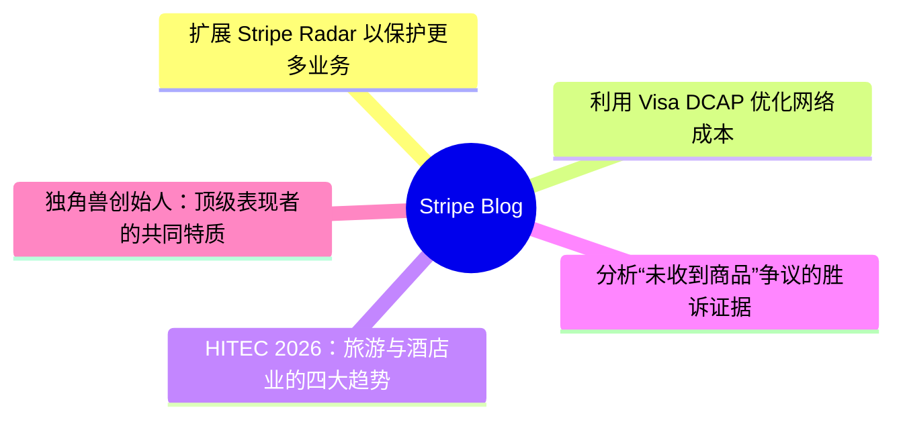
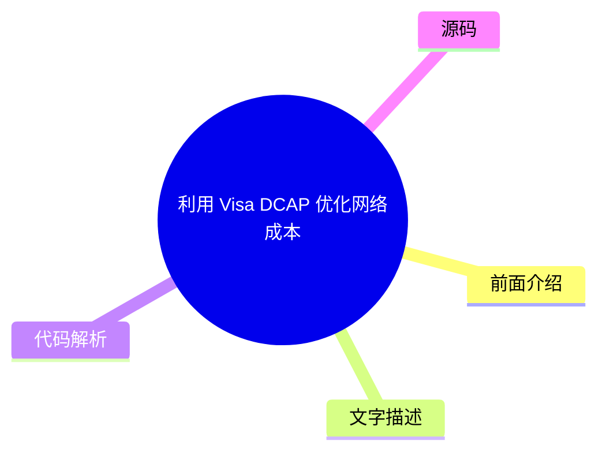
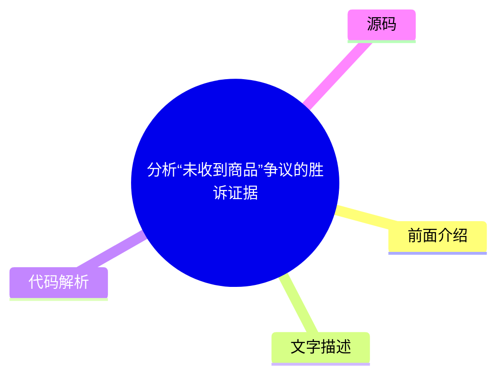
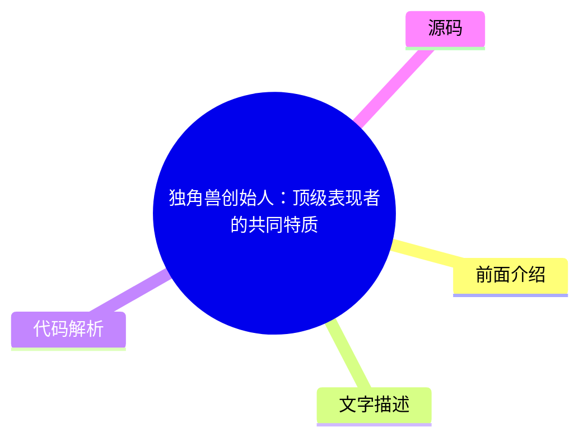

# 💳 Stripe Blog Top 5 (2026-07-29)

## 前面介绍

- 数据源：Stripe Blog
- 抓取日期：2026-07-29
- 条目数：5
- 含完整正文：5
- 含代码片段：0
- 组织方式：前面介绍 / 树状图 / 文字描述 / 代码解析 / 源码

## 思维导图

## 详细整理（5 条，5 条含全文，0 条含代码）

### 1. 扩展 Stripe Radar 以保护更多业务
- **链接**: [https://stripe.com/blog/expanding-stripe-radar-to-protect-more-of-your-business](https://stripe.com/blog/expanding-stripe-radar-to-protect-more-of-your-business)
- **发布**: Wed, 27 May 2026 00:00:00 +0000

#### 前面介绍

- Radar 现可拦截所有支持支付方式的高风险交易
- 支持防御多账户滥用和按量付费滥用等新型欺诈
- 为平台提供新的工具来评估和缓解商户风险

#### 树状图

#### 文字描述

- Radar 现在保护所有支持的全球支付方式，包括银行借记、先买后付（BNPL）、加密货币、数字钱包、实时支付和现金券。当检测到欺诈模式时，该信息可用于保护所有支付方式。
- 通过新的多处理器信号，企业可以改善欺诈决策。Stripe 可以识别支付是否可能触发卡组织的早期欺诈警告，或可能导致欺诈性争议，帮助企业主动退款或调整争议策略。
- Radar 现在提供企业级的自定义欺诈模型。企业可以将产品目录数据、忠诚度状态、行为指标等独特信号传递给 Stripe，结合全球网络数据部署专门定制的模型。
- 针对多账户滥用，Radar 可以实时评估每个新账户，利用设备指纹、IP 地址、电子邮件域等跨网络信息，在滥用发生前阻止可疑账户。
- 针对按量付费滥用，Radar 能够预测并拦截滥用行为，防止恶意用户通过循环使用免费试用或故意不支付下一张发票来滥用政策。

#### 代码解析

- 本文未提供源码，以下为实现思路或结构解析

#### 源码

#### 中文节选

上个月在 Stripe Sessions 上，我们分享了迄今为止对 [Stripe Radar](https://stripe.com/radar)（我们的人工智能驱动的欺诈防护工具）进行的最大规模扩展。Radar 现在可以阻止所有支持的支付方式下的高风险交易；无论您使用哪个支付处理器，都能防御多账户滥用和按量付费滥用等新型欺诈；并为平台提供了新的工具，用于评估和缓解 Stripe 内外商户的风险。我们还推出了更多方式，利用更智能的证据和自动化证据库来应对争议。

以下是我们要宣布内容的详细情况。

## 利用全球支付覆盖范围、新的多处理器信号和自定义模型保护更多交易

欺诈防护正变得越来越复杂。企业需要在多种支付方式下进行防御，并且需要更精确的信号来在欺诈发生前将其捕获——无论是在 Stripe 上还是 Stripe 外。Radar 现在解决了这两个问题，并增加了使用自定义欺诈模型的能力。

**阻止所有支持的全球支付方式下的高风险交易**

Radar 现在保护[全球所有支持的交易量](https://docs.stripe.com/radar/local-payment-methods)，包括银行借记、先买后付（BNPL）选项、加密货币、数字钱包、实时支付和现金代金券。当 Radar 检测到交易中的欺诈模式时，该信息将可用于保护所有支付方式下的交易。例如，如果欺诈行为者在 Stripe 上的某家企业使用被盗信用卡，而我们检测并阻止了该行为，那么相同的 IP 地址和设备指纹现在会在银行借记、钱包和 BNPL 交易中全网标记。我们发现，在使用 Affirm、Cash App、Klarna 和 PayPal 的企业中，Radar 在五个月内将可疑欺诈减少了 71%。

**利用新的多处理器信号改进您的欺诈决策**

Businesses use Radar’s risk signals for off-Stripe transactions to complement their in-house fraud models and make more precise fraud decisions across payment processors. Now, you can further improve your fraud decisioning with additional signals for off-Stripe transactions to help you prevent fraud before it happens.

Stripe can now identify whether a payment is [likely to trigger an early fraud warning](https://docs.stripe.com/radar/multiprocessor#early-fraud-warning) from the card network. You can then choose to proactively refund the transaction and protect your dispute rate. 

Stripe can also predict whether a payment is [likely to result in a fraudulent dispute](https://docs.stripe.com/radar/multiprocessor#fraudulent-dispute). You can use this signal to issue refunds, gather evidence, or adjust your dispute strategy. 

We plan to add new signals that can be used across your entire payments stack.

**Access enterprise-grade custom fraud models
**

For businesses with more complex risk profiles, Radar now offers [custom fraud models](https://docs.stripe.com/radar/custom-

#### 完整正文（中文）

上个月在 Stripe Sessions 上，我们分享了迄今为止对 [Stripe Radar](https://stripe.com/radar)（我们的人工智能驱动的欺诈防护工具）进行的最大规模扩展。Radar 现在可以阻止所有支持的支付方式下的高风险交易；无论您使用哪个支付处理器，都能防御多账户滥用和按量付费滥用等新型欺诈；并为平台提供了新的工具，用于评估和缓解 Stripe 内外商户的风险。我们还推出了更多方式，利用更智能的证据和自动化证据库来应对争议。

以下是我们要宣布内容的详细情况。

## 利用全球支付覆盖范围、新的多处理器信号和自定义模型保护更多交易

欺诈防护正变得越来越复杂。企业需要在多种支付方式下进行防御，并且需要更精确的信号来在欺诈发生前将其捕获——无论是在 Stripe 上还是 Stripe 外。Radar 现在解决了这两个问题，并增加了使用自定义欺诈模型的能力。

**阻止所有支持的全球支付方式下的高风险交易**

Radar 现在保护[全球所有支持的交易量](https://docs.stripe.com/radar/local-payment-methods)，包括银行借记、先买后付（BNPL）选项、加密货币、数字钱包、实时支付和现金代金券。当 Radar 检测到交易中的欺诈模式时，该信息将可用于保护所有支付方式下的交易。例如，如果欺诈行为者在 Stripe 上的某家企业使用被盗信用卡，而我们检测并阻止了该行为，那么相同的 IP 地址和设备指纹现在会在银行借记、钱包和 BNPL 交易中全网标记。我们发现，在使用 Affirm、Cash App、Klarna 和 PayPal 的企业中，Radar 在五个月内将可疑欺诈减少了 71%。

**利用新的多处理器信号改进您的欺诈决策**

企业使用 Radar 的风险信号来处理 Stripe 以外的交易，以补充其内部欺诈模型，并在所有支付处理商处做出更精确的欺诈决策。现在，您可以通过为 Stripe 以外的交易提供额外的信号，进一步改善您的欺诈决策，从而帮助您在欺诈发生前进行预防。

Stripe 现在可以识别支付是否可能触发卡组织的[早期欺诈警告](https://docs.stripe.com/radar/multiprocessor#early-fraud-warning)。然后，您可以选择主动退款交易，以保护您的拒付率。

Stripe 还可以预测支付是否可能导致[欺诈性拒付](https://docs.stripe.com/radar/multiprocessor#fraudulent-dispute)。您可以使用此信号来发起退款、收集证据或调整您的拒付策略。

我们计划添加可在您整个支付体系中使用的新信号。

**访问企业级自定义欺诈模型**

对于风险概况更复杂的企业，Radar 现在提供[自定义欺诈模型](https://docs.stripe.com/radar/custom-fraud-models)。您可以将业务独有的信号传递给 Stripe，例如产品目录数据、忠诚度状态、行为指标或与您的风险概况相关的任何结构化元数据。Stripe 然后将此信息与我们的全球网络数据相结合，部署专门针对您业务定制的模型。对于早期采用者，自定义模型在不增加误报的情况下，检测到的欺诈至少增加了 15%。

## 防范新型欺诈

欺诈行为者在窃取资金方面的手段与窃取计算资源一样老练。他们通过循环使用免费试用、开设多个账户或故意不支付下一张账单来滥用政策。随着企业扩展 AI 产品，令牌滥用已成为一种昂贵的欺诈手段。

上个月，我们分享了 Radar 如何通过[防止免费试用滥用](https://stripe.com/blog/how-stripe-radar-helps-prevent-free-trial-abuse)来解决这些欺诈手段之一。在 Sessions 上，我们强调了保护您的企业免受多账户滥用、按量付费欺诈和欺诈机器人驱动支付侵害的新方法。

**阻止多账户滥用**

多账户滥用是指单个欺诈行为人创建多个账户，以重复使用促销优惠券，或将被盗卡交易分散到多个账户中，从而延长逃避检测的时间。在整个 Stripe 网络中，AI 公司的注册用户中超过六分之一与多账户滥用有关。

现在，Radar 可以[实时评估每个新账户](https://docs.stripe.com/radar/multi-account-and-account-sharing-abuse#multi-account-abuse)，以便您在滥用行为发生之前（无论是在 Stripe 内部还是外部）阻止可疑账户。我们的解决方案利用了整个 Stripe 网络中过往滥用的信息，包括设备指纹、IP 地址、电子邮件域名等。在过去的两个月里，ElevenLabs 每天成功阻止了 2,000 名用户滥用其免费层级。

**预测按量付费滥用**

按量付费滥用是指客户通过累积使用量来滥用您的服务，但并不打算在账单到期时付款。这些不良行为者利用了基于消费的定价结构，即费用在计费周期内累积，但付款发生在之后。例如，客户可能在一个月内消耗数千美元的计算资源，在月底被计费，然后永远不予支付。

Radar 现在可以帮助[在用量累积时预测未付款滥用](https://docs.stripe.com/radar/pay-as-you-go-abuse)，使您能够在向客户计费之前进行干预。这允许您要求充值、切断服务，或采取任何符合您风险承受能力的措施。

**检测并防止欺诈机器人驱动的支付**

随着代理商业务的扩展，区分代表客户行事的合法代理和恶意机器人变得越来越重要。两者都是进行购买的非人类流量，但一个是客户授权的代理，另一个可能会利用您的结账流程购买库存有限的商品、滥用促销定价或绕过购买限制。

Radar 现在为 Stripe Checkout 上的支付分配机器人评分，评估其是否由[恶意机器人发起](https://docs.stripe.com/radar/bot-abuse)的可能性。您可以使用此评分来执行反脚本或反机器人策略。例如，您可以阻止限量版商品的自动购买，或将高频率订单标记为待审核。

## 保护您的平台免受账户欺诈

欺诈行为者正在使用生成式 AI 创建虚假身份、文件和网站，这些网站极具说服力，足以绕过许多平台的验证系统。平台面临一个权衡：在入职流程中要求提供更多信息并增加摩擦，还是保持入职流程轻量级并承担潜在的重大风险。

[平台现在可以利用 Radar 降低风险](https://docs.stripe.com/radar/radar-for-platforms)，其功能包括为每个业务和交易提供 0 到 100 的欺诈评分；解释为何账户被标记的 AI 驱动洞察；用于帮助团队了解账户背景的备注和账户历史记录；以及用于争议、拒付、退款和支付的账户级指标。

我们还引入了三种新方法，供平台监控和评估商户风险——无论是在 Stripe 内部还是外部。

- [欺诈网站](https://docs.stripe.com/radar/fraudulent-website)信号会像人类欺诈分析师一样分析企业的网站，寻找诸如以不切实际的价格出售奢侈品、AI 生成的文案、拼写错误的品牌网址或其他表明网站存在欺诈的迹象等危险信号。平台可以在入职流程中使用此信号来自动验证、标记账户以供人工审核，或在批准业务前将其作为自身风险评分的输入。
- [欺诈商户](https://docs.stripe.com/radar/fraudulent-merchant)信号根据分析 Stripe 网络中的模式（包括银行账户信息、业务详情、交易活动和争议）来确定新账户或现有账户是否存在欺诈风险。然后，平台可以发起审核、暂停付款、暂停提现、拒绝账户、设置预留金或要求身份验证。

- [商家逾期风险](https://docs.stripe.com/radar/merchant-delinquency-risk)信号预测企业是否面临产生负余额的风险；具体而言，它预测该余额是否可能持续为负 60 天或更长时间。平台可利用此信号来决定是否主动调整付款计划，对高风险账户要求预留金，或在损失累积之前将商家标记为需要更密切审查的对象。

## 利用更智能的证据和自动化证据库更有效地应对争议

[智能争议](https://docs.stripe.com/disputes/smart-disputes)是我们基于 AI 的争议管理产品，一直以来都会代表您整理并提交证据。现在，智能争议可以制定更定制化的策略，以提高您赢得每起争议的几率。

智能争议会分析每起争议，并为特定证据字段（如追踪号码或客户使用日志）提供 [AI 驱动的建议](https://docs.stripe.com/disputes/set-up-smart-disputes#provide-more-data-at-dispute-time)。通过智能争议添加我们 AI 推荐证据的企业，其胜诉率比未添加任何证据的企业高出 3 倍。

我们还在减少提交证据所需的人工操作。许多争议需要相同的支持材料：条款与条件、退货政策和服务协议。通过证据库，您只需上传并存储这些文档一次，智能争议便会根据争议原因代码、网络要求和持卡人主张，自动选择并将它们包含在您的证据包中——无需手动重新提交。

## 接下来是什么

在 Sessions 上，我们还发布了[我们的公开路线图](https://stripe.com/roadmap)：一份包含数百个详细条目的清单，涵盖截至 2027 年第一季度，包括 [Radar 中的产品、功能和改进](https://stripe.com/roadmap?product=Radar)。

想了解更多 Radar 如何保护您的业务，请加入我们在全球主要城市的 [Stripe Tour 2026](https://stripetour.com/)。您也可以 [阅读我们的文档](https://docs.stripe.com/radar) 或 [联系我们的专家团队](https://stripe.com/contact/sales)。

### 2. 利用 Visa DCAP 优化网络成本
- **链接**: [https://stripe.com/blog/helping-businesses-optimize-network-costs-with-visa-digital-commerce-authentication-program](https://stripe.com/blog/helping-businesses-optimize-network-costs-with-visa-digital-commerce-authentication-program)
- **发布**: Wed, 03 Jun 2026 00:00:00 +0000

#### 前面介绍

- Visa 推出数字商务认证计划（DCAP）以减少欺诈并提高授权率
- 通过 Stripe Authorization Boost 智能选择交易以捕获 DCAP 节省
- 自动参与 DCAP 优化，无需手动干预

#### 树状图

#### 文字描述

- DCAP 是 Visa 的新全球框架，旨在减少卡不存在交易的欺诈并提高授权率。符合条件的企业通过在认证期间与发卡行共享更丰富的交易数据（如设备 ID、账单地址、IP 地址）可获得 5 个基点的净交换费减免。
- 为了在不牺牲转化率的情况下优化 DCAP 节省，Stripe 使用 Authorization Boost 在交易级别评估成本节省、转化影响和欺诈风险，决定何时应用仅数据 3DS（Data Only 3DS）。
- 自 4 月 18 日起，Stripe 帮助企业从 DCAP 中捕获了 1840 万美元的年度化网络成本节省。通过帮助收集和传递所需数据，DCAP 合格交易数量增加了 8 倍。
- 对于使用独立 3DS 的企业，只需在认证请求中将 flow_preference[type] 设置为 data_share 并确保必填字段已填充，即可自动参与 DCAP 优化。

#### 代码解析

- 本文未提供源码，以下为实现思路或结构解析

#### 源码

#### 中文节选

Visa recently launched the [Digital Commerce Authentication Program (DCAP)](https://support.stripe.com/questions/understand-the-visa-digital-commerce-authentication-program-%28dcap%29-on-stripe), a new global framework designed to reduce fraud and increase authorization rates for card-not-present transactions. The program rewards businesses in the US for sharing richer transaction data with issuers during authentication, such as device ID, billing address, IP address, and customer email. Qualifying transactions receive a net interchange reduction of five basis points.

New network programs create opportunity, but they also introduce complexity. Businesses need to understand which transactions qualify, ensure their integration passes the required data, and determine whether participating will improve their end-to-end transaction economics or have unintended consequences, such as hurting authorization rates.

To participate in DCAP, businesses need to share required cardholder data with issuers via frictionless authentication in their checkout. This might introduce latency and uncertainty around how issuers interpret these newer signals.

We moved quickly to help Stripe businesses take advantage of DCAP and capture interchange savings while protecting authorization rates. Here’s what we did.

### Optimizing DCAP savings without sacrificing conversion

Before rolling out DCAP, we worked with Visa to run readiness testing and identify the right implementation approach. This collaborative testing underscored the need for transaction-level intelligence.

使用 [Stripe 授权增强](https://stripe.com/authorization-boost)，我们会智能选择哪些交易应通过 [仅数据 3DS](https://docs.stripe.com/payments/3d-secure/strong-customer-authentication-exemptions#data-only)，该流程会从卡网络向发卡行发送额外的风险数据。授权增强并非应用静态规则，而是在单个交易层面评估成本节约、转化影响和欺诈风险，以确定何时应用仅数据 3DS。这使企业能够在限制对客户体验的影响的同时，捕获 DCAP 节省，并优化授权率。

自 4 月 18 日以来，我们已帮助 Stripe 企业从 DCAP 中获得了 1840 万美元的年度化网络成本节约。通过帮助企业收集和传递所需数据，我们观察到符合 DCAP 资格的交易数量增加了 8 倍。我们正在继续与 Visa 合作优化资格条件，以便更多交易能够受益于 DCAP。

## 自动受益于 DCAP 优化

如果您使用授权增强并正在收集所需的数据点，您已经自动受益于 DCAP 优化。对于使用 [独立 3DS](https://docs.stripe.com/payments/3d-secure/standalone-3d-secure) 的企业，您可以通过在认证请求上将 **flow_preference[type]** 设置为 `data_share` 并确保要求来参与。

#### 完整正文（中文）

Visa 最近推出了 [数字商业认证计划 (DCAP)](https://support.stripe.com/questions/understand-the-visa-digital-commerce-authentication-program-%28dcap%29-on-stripe)，这是一个旨在降低欺诈率并提高非接触式交易授权率的新全球框架。该计划奖励美国企业在与发卡行进行认证时分享更丰富的交易数据，例如设备 ID、账单地址、IP 地址和客户电子邮件。符合条件的交易可获得 5 个基点的净交换费减免。

新的网络计划带来了机遇，但也引入了复杂性。企业需要了解哪些交易符合资格，确保其集成传递了所需数据，并确定参与是否有助于改善其端到端交易经济状况，或者是否会产生意外后果，例如损害授权率。

要参与 DCAP，企业需要在结账流程中通过无摩擦认证与发卡行分享所需的持卡人数据。这可能会引入延迟，并使发卡行如何解读这些较新的信号存在不确定性。

我们迅速采取行动，帮助 Stripe 商家利用 DCAP 并在保护授权率的同时获取交换费节省。以下是我们的做法。

### 在不牺牲转化率的情况下优化 DCAP 节省

在推出 DCAP 之前，我们与 Visa 合作进行了就绪度测试，并确定了正确的实施方法。这种协作测试强调了交易级智能的必要性。

通过 [Stripe 授权提升](https://stripe.com/authorization-boost)，我们可以智能选择哪些交易应通过 [仅数据 3DS](https://docs.stripe.com/payments/3d-secure/strong-customer-authentication-exemptions#data-only)，该模式会从卡网络向发卡行发送额外的风险数据。我们不会应用静态规则，而是授权提升会在单个交易层面评估成本节约、转化影响和欺诈风险，以确定何时应用仅数据 3DS。这使企业能够在限制对客户体验的影响并优化授权率的同时，捕获 DCAP 节省。

自 4 月 18 日以来，我们已帮助 Stripe 企业从 DCAP 中捕获了 1840 万美元的年度化网络成本节约。通过帮助企业收集和传递所需数据，我们观察到符合 DCAP 条件的交易数量增加了 8 倍。我们正在继续与 Visa 合作优化资格条件，以便更多交易能够受益于 DCAP。

## 自动受益于 DCAP 优化

如果您使用授权提升并正在收集所需的数据点，您已经自动受益于 DCAP 优化。对于使用 [独立 3DS](https://docs.stripe.com/payments/3d-secure/standalone-3d-secure) 的企业，您可以通过在认证请求上将 **flow_preference[type]** 设置为 `data_share` 并确保填写了必填字段来参与其中。

了解更多关于 [授权提升](https://docs.stripe.com/payments/analytics/optimization) 如何帮助优化您的支付表现。

### 3. HITEC 2026：旅游与酒店业的四大趋势
- **链接**: [https://stripe.com/blog/trends-from-hitec](https://stripe.com/blog/trends-from-hitec)
- **发布**: Tue, 23 Jun 2026 00:00:00 +0000

#### 前面介绍

- 直接预订的竞争已从搜索排名转向 AI 回答
- 大多数酒店 AI 投资因缺乏数据基础而表现不佳
- 需要现代化的财务基础设施来支持 AI 自动化

#### 树状图

#### 文字描述

- IDC 预测到 2030 年，30% 的旅行预订将由 AI 代理完成。然而，目前只有 25% 的酒店业务正在积极扩展 AI，且不到 10% 被视为“AI 未来构建”，即已将 AI 嵌入核心运营并拥有可衡量的回报。
- 传统 SEO 策略正在失效，因为 65% 的 Google 搜索触发 AI 概览后用户不会点击任何网站。AI 包含要求结构化数据（如房型、设施、政策）的准确性和机器可读性，而非关键词密度。
- 大多数酒店 AI 投资因数据碎片化而脆弱。酒店需要整合分散的 PMS、CRM、忠诚度、餐饮和支付系统，以提供准确的 AI 推荐，避免财务对账时间过长和运营摩擦。
- 酒店品牌需要结合 AI 驱动的可发现性、准确的实时库存和现代化的结账体验来捕获代理需求。支付系统必须支持本地支付方式、一键结账和全球欺诈保护。

#### 代码解析

- 本文未提供源码，以下为实现思路或结构解析

#### 源码

#### 中文节选

超过 6,000 名酒店高管和经营者上周齐聚圣安东尼奥，参加年度 HITEC 酒店技术会议，其中包括万豪酒店及度假村、凯悦、洲际酒店及度假村、喜达屋酒店以及数百家独立物业的领导者。

主要议题：行业的人工智能投资是否真的奏效。IDC 预测，到 2030 年，30% 的所有旅行预订将由人工智能代理完成。但行业的发展方向与当前具备的支持能力之间存在巨大差距。

根据 BCG 的数据，25% 的酒店企业报告称目前正在积极扩展人工智能，但不到 10% 的企业被认为是“AI 未来构建型”——这意味着它们在核心运营中嵌入了人工智能，拥有支持性的数据基础，并取得了可衡量的回报。“许多公司只是在盲目尝试，看看能不能行得通，”佛罗里达国际大学酒店技术副教授 Dale Gomez 说。“他们想要看到投资回报率。”

其他变革正在展开。许多酒店企业仍然缺乏现代金融基础设施，无法充分受益于人工智能预期带来的自动化、速度和互操作性。曾经被认为是“足够好”的支付系统现在正在造成可衡量的收入损失，而不断上升的客人期望已经将低效的技术从一个小麻烦变成了不再回头的原因。

在四天的时间里，举行了 50 多次会议，四个趋势脱颖而出。

## 直接预订的竞争已从搜索排名转向 AI 回答

多年来，酒店业应对在线旅行社（OTA）依赖症的办法是 SEO：投资内容，提高搜索排名，并在客人最终出现在 Expedia 或 Booking.com 之前将其转化。这种方法正变得越来越无效。

Jack Wang，Salesforce 的首席解决方案工程师，提供了一组凸显转变的数据：现在，触发 AI 概览的 65% 的谷歌搜索最终都没有用户点击任何网站。在移动端，这一数字上升至 78%。随着 AI 生成的摘要取代了 SEO 旨在赢得的排名链接列表，传统搜索流量在整个行业下降了约 25%。

被 AI 生成的答案收录需要与 SEO 奖励的内容不同。SEO 响应的是关键词密度、反向链接和页面权威性。AI 收录响应的是结构化属性数据的准确性和机器可读性，如房间类型、设施详情、政策、本地背景或取消条款。一家酒店可能在传统搜索中排名靠前，但对 LLM 来说却是不可见的：超过 [90%](https://www.nokumo.net/en/ai-visibility-in-hospitality-what-3-600-ai-responses-and-1-337-website-audits-reveal?utm_campaign=ennismore-proves-tech-investment-pays-off-and-94-of-hotels-are-invisible-to-ai) 的住宿

#### 完整正文（中文）

超过 6,000 名酒店高管和经营者上周齐聚圣安东尼奥，参加年度 HITEC 酒店技术会议，其中包括万豪酒店及度假村、凯悦、洲际酒店及度假村、喜达屋酒店以及数百家独立物业的领导者。

主要议题：行业的人工智能投资是否真的奏效。IDC 预测，到 2030 年，30% 的所有旅行预订将由人工智能代理完成。但行业的发展方向与当前具备的支持能力之间存在巨大差距。

根据 BCG 的数据，25% 的酒店企业报告称目前正在积极扩展人工智能，但不到 10% 的企业被认为是“AI 未来构建型”——这意味着它们在核心运营中嵌入了人工智能，拥有支持性的数据基础，并取得了可衡量的回报。“许多公司只是在盲目尝试，看看能不能行得通，”佛罗里达国际大学酒店技术副教授 Dale Gomez 说。“他们想要看到投资回报率。”

其他变革正在展开。许多酒店企业仍然缺乏现代金融基础设施，无法充分受益于人工智能预期带来的自动化、速度和互操作性。曾经被认为是“足够好”的支付系统现在正在造成可衡量的收入损失，而不断上升的客人期望已经将低效的技术从一个小麻烦变成了不再回头的原因。

在四天的时间里，举行了 50 多次会议，四个趋势脱颖而出。

## 直接预订的竞争已从搜索排名转向 AI 回答

多年来，酒店业应对在线旅行社（OTA）依赖症的办法是 SEO：投资内容，提高搜索排名，并在客人最终出现在 Expedia 或 Booking.com 之前将其转化。这种方法正变得越来越无效。

Jack Wang, principal solution engineer at Salesforce, offered data that spotlights a shift: 65% of Google searches that trigger an AI Overview now end without the user clicking any website. On mobile, that number climbs to 78%. Traditional search traffic is declining roughly 25% across the industry, as AI-generated summaries replace the ranked link lists that SEO was designed to win.

Inclusion in an AI-generated answer requires something different from what SEO rewards. SEO responds to keyword density, backlinks, and page authority. AI inclusion responds to the accuracy and machine-readability of structured property data, like room types, amenity details, policies, local context, or cancellation terms. A hotel can rank well in traditional search and be invisible to an LLM: over [90%](https://www.nokumo.net/en/ai-visibility-in-hospitality-what-3-600-ai-responses-and-1-337-website-audits-reveal?utm_campaign=ennismore-proves-tech-investment-pays-off-and-94-of-hotels-are-invisible-to-ai) of accommodation sites are still undetected by AI models.

We’re already seeing a downstream effect. According to Phocuswright research, [56%](https://www.phocuswire.com/news/online/shift-travel-behavior-ai-surge-phocuswright-research) of travelers have used AI for trip planning, booking, or in-destination assistance in the past 12 months. For operators, the first step is an audit, not an investment. Can the LLMs your prospective guests are using accurately describe your property’s room categories, amenities, policies, and local context? If the answer is no, that gap is likely costing you bookings.

Today, hotel chains have access to the same checkout and payment tools as OTAs, including local payment methods and currencies, one-click checkout, and global fraud protection. The travel brands capturing agentic demand are combining AI-driven discoverability with accurate real-time inventory and a modern checkout experience that converts demand efficiently.

## Most hospitality AI is falling short in a predictable way

在整个 HITEC 期间，一个令人不适的真相反复出现：酒店业正在发生的许多 AI 扩展都是脆弱的。大多数企业采用 AI 时缺乏维持其发展的战略清晰度、数据基础和运营架构。

根本原因通常是数据碎片化。孤立的物业管理系统、CRM、忠诚度、餐饮和支付系统各自只持有关于同一客人的部分视图——而 AI 推荐的准确性仅取决于其调用的内容。同样导致 AI 个性化失效的数据问题，在财务上表现为过度的对账时间，在运营上表现为不完整的客人档案，在客人体验上表现为摩擦。

Salesforce 首席解决方案工程师 Amanda Sharp 将这一问题重构为 AI 运营化而非采用，并呼吁进行“氛围运营”：这是酒店业对“氛围编码”的回应。为许多酒店品牌构建 AI 功能现在已成为可能。但在生产环境中可靠地运行它们，并将其集成到触发实际操作的现有工作流程中，则要困难得多。

在这方面做得好的企业拥有干净、连接的数据，能够在采取行动的时机内将有用的情报直接传递到工作流程中。例如，达美航空在移动应用中内置了实时 AI 礼宾，利用 SkyMiles 档案和运营数据，在客户关怀体验中提供情境感知支持。在 Wynn 拉斯维加斯，当业绩低于目标时，收益经理会收到预测性警报以及附带的建议行动。

对于大多数旅游运营商来说，瓶颈在于数据连接，而非模型质量。

## 支付摩擦具有可衡量的成本，但大多数酒店仍不知道其具体数额

酒店业历史上一直将支付视为一种成本和商品：一种需要维持运转、尽量减少费用并避免干扰的东西。我们在 HITEC 会议上进行的许多支付相关讨论都围绕着这种方法的转变，以及人们日益认识到支付已成为酒店品牌竞争的关键因素。我们的数据也支持这一观点：在 Stripe 委托进行的一项针对近 400 名酒店高管的研究中，90% 的人表示支付对增长很重要，37% 的人表示缺乏支付选项对客人体验产生最大的负面影响。此外，58% 的人表示他们的欺诈系统阻断了合法交易，74% 的人报告称，碎片化的系统导致他们的团队花费过多时间进行对账。

这些数据凸显了为什么支付已成为一种结构性优势。OTA 能够负担得起大规模的支付人员配置，因为它们的收入证明了这种人员配置的合理性。独立酒店和较小的运营商无法直接匹配这种投资，但在正确的基础设施上配备精简的团队，现在可以以大型内部运营成本的一小部分，支持数十个国家的支付方式。

覆盖缺口直接导致预订流失。“一旦我们不支持 [某种支付方式]，就意味着这位客人会去其他地方，去支持他们首选支付方式的平台或渠道，”Cloudbeds 战略合作伙伴副总裁 Sebastien Leitner 说。客人在其首选支付方式适用的地方预订。一家不支持目标市场主流支付方式的酒店，不仅是在制造摩擦——它实际上是将这笔预订引向了支持该方式的 OTA。

## 最好的酒店技术是那种不起眼的技术

“对于那些无法正常工作的技术，人们没有任何同理心，”Oracle Hospitality 全球战略与产品管理副总裁 Tanya Pratt 说道。“如果技术无法运行，它造成的挫败感将比前台排长队更严重，因为人们对后者已经习以为常。”当技术失效时，客人并不总是会投诉。他们只是不再回头。

真正的成功衡量标准在于，技术运行得足够好，以至于客人根本不会去想它。万豪酒店的首席信息官 Denise Walker 描述了这一愿景：一位回头客入住时，房间温度适宜，电视上播放着他们偏好的频道，床上的枕头也符合他们喜欢的硬度。没有人会告知他们系统是如何知道的。“不需要以‘你怎么知道这些的？’这种方式来呈现。”

拉斯维加斯凯撒宫度假村酒店酒店运营副总裁 Shannon McCallum 进一步阐述道：“我们正在从‘我告诉了你这些，所以你知道关于我的事’向‘我什么都没告诉你，而现在你在预测它’转变。”

这两种隐形个性化以及它所支持的人际互动时刻，都需要一个连接数据的基础——即能够整合现有技术栈、将客人信息整合到单一系统中的技术。这种基础设施使企业能够在客人浏览网站或站在前台时识别出同一位客人。

## Stripe 如何提供帮助

越来越多的客人将通过 AI 助手而不是搜索引擎找到您的物业。他们预订的行程可能由代理完成。而区分高绩效运营商的收入将来自于能够实现转化的支付体验、覆盖所有市场的支付方式以及协同工作的财务系统。Stripe 数据管道将支付数据与您的预订和客户系统连接起来，为运营商提供统一的收入视图，而无需依赖拼凑在一起的报告。

Stripe 的支付基础设施帮助酒店运营商保护收入、提升客人在店内的消费，并简化运营。

**直接获取预订。** 在客人实际使用的各种支付方式以及您服务的每个市场中，能够促进转化的支付体验有助于将预订保留在您的直接渠道上。随着代理商务务的扩展，这意味着默认在每笔 Stripe 交易上运行的欺诈检测，以及允许代理在不暴露客人凭证的情况下进行交易的支付令牌。

**增加行程消费。** 来自餐饮、体验和合作伙伴的辅助收入需要能够在整个物业范围内运作的支付基础设施，支持新的商业模式，并与外部合作伙伴连接。Stripe Billing 处理会员和忠诚度计划背后的定期支付逻辑，包括自动续费、分级定价和失败支付恢复——无需运营商自行维护该基础设施。例如，[Cloudbeds](https://stripe.com/customers/cloudbeds) 发现，使用 Cloudbeds Payments 的企业收入增长了 15%，而通过其 Stripe 合作伙伴关系直接消除支付摩擦并扩展支付方式的企业，平均收入增加了 14.8%。

**降低成本。** 更高效的 B2B 资金流动和欺诈保护减少了对账工作并限制了损失，从而在不增加人员的情况下释放利润空间。

[了解更多](https://stripe.com/industries/travel) 关于 Stripe 如何支持酒店业务，或 [联系我们](https://stripe.com/contact/sales)。

### 4. 分析“未收到商品”争议的胜诉证据
- **链接**: [https://stripe.com/blog/analyzing-the-evidence-that-helps-businesses-win-product-not-received-disputes](https://stripe.com/blog/analyzing-the-evidence-that-helps-businesses-win-product-not-received-disputes)
- **发布**: Tue, 21 Jul 2026 00:00:00 +0000

#### 前面介绍

- 提交交付信息可提高 44 个百分点的胜诉率
- 在交付确认后提交证据比在运输中提交胜率更高
- 数字商品需提交使用日志和服务文档以证明履行

#### 树状图

#### 文字描述

- 分析显示，提交交付确认的实体商品争议胜率比未提交的高 27 个百分点。添加 GPS 交付地图可额外提高 15 个百分点，加上签名可再提高 2 个百分点。
- 在交付确认后提交证据的争议胜率比未提交的高 27 个百分点，而在运输中提交仅比未提交高 2 个百分点。这表明提交时机很重要，应尽量等待承运商确认到达。
- 对于数字商品，提交数字活动和使用日志（如流媒体、下载记录）的争议胜率比未提交的高 10 个百分点。服务文档（如配置记录）可提高 8 个百分点。
- 在 Stripe 上处理退款后提交退款证据的争议胜率比未提交的高 63 个百分点。这表明即使退款已处理，及时提交证据仍能显著提高胜诉率。

#### 代码解析

- 本文未提供源码，以下为实现思路或结构解析

#### 源码

#### 中文节选

“[未收到商品](https://docs.stripe.com/disputes/categories)” 纠纷——即持卡人声称未收到所付款项——是 Stripe 上最常见的非欺诈纠纷类别。很难判断哪些索赔是合理的，哪些不是：有些客户确实从未收到他们所付款项的商品，而另一些人则错误地声称未收到订单。

为了了解哪些因素会影响胜诉率，我们在 16 周的时间内分析了来自一百万起纠纷的证据包。我们将包含各种类型证据（如投递确认或内容消费日志）的包的胜诉率与不包含这些证据的包进行了比较，从而确定了哪些特征与更高的胜诉率相关。

以下是数据对各类企业显示的结果，销售数字商品的企业有何不同，以及这对您如何减轻纠纷意味着什么。

**提交投递信息的企业胜诉率高出 44 个百分点**

对于销售实物商品的企业，包含投递确认证据的纠纷的胜诉率比不包含该证据的纠纷高出 27 个百分点。添加显示承运人扫描包裹位置的 GPS 投递地图作为证据，在仅凭投递确认的基础上又提升了 15 个百分点的胜诉率。而包含收件人签名作为证据则进一步提升了 2 个百分点。因此，包含投递确认、GPS 地图和签名的纠纷的胜诉率比不包含这些证据的纠纷高出 44 个百分点。

然而，许多企业仍然没有在纠纷响应中包含投递确认。部分差距在于意识，但更大的障碍在于运营。对于大多数企业来说，发货数据和纠纷工作流位于不同的系统中。将特定的纠纷与正确的订单以及已确认的投递状态进行匹配通常需要手动工作，且难以扩展。

## 在投递确认后提交证据的企业胜诉率高出 27 个百分点

许多企业会提交运输跟踪 ID 作为交付证明。然而，取决于您提交证据时包裹的状态，该跟踪号可能仅能确认包裹已离开您的设施。

我们的分析发现，企业提交跟踪 ID 时显示的内容会影响胜诉率——具体而言，即是否已确认交付。在确认交付后提交证据的争议，其胜诉率比未提供交付确认的争议高出 27 个百分点。另一方面，在包裹仍在运输途中时提交证据的争议，其胜诉率仅比未提供交付确认的争议高出 2 个百分点。

这表明您提交证据的时机很重要。客户可能会在订单到达之前就提交“未收到商品”的争议，尤其是当发货延迟或仍在运输途中时。由于大多数企业

#### 完整正文（中文）

“[未收到商品](https://docs.stripe.com/disputes/categories)” 纠纷——即持卡人声称未收到所付款项——是 Stripe 上最常见的非欺诈纠纷类别。很难判断哪些索赔是合理的，哪些不是：有些客户确实从未收到他们所付款项的商品，而另一些人则错误地声称未收到订单。

为了了解哪些因素会影响胜诉率，我们在 16 周的时间内分析了来自一百万起纠纷的证据包。我们将包含各种类型证据（如投递确认或内容消费日志）的包的胜诉率与不包含这些证据的包进行了比较，从而确定了哪些特征与更高的胜诉率相关。

以下是数据对各类企业显示的结果，销售数字商品的企业有何不同，以及这对您如何减轻纠纷意味着什么。

**提交投递信息的企业胜诉率高出 44 个百分点**

对于销售实物商品的企业，包含投递确认证据的纠纷的胜诉率比不包含该证据的纠纷高出 27 个百分点。添加显示承运人扫描包裹位置的 GPS 投递地图作为证据，在仅凭投递确认的基础上又提升了 15 个百分点的胜诉率。而包含收件人签名作为证据则进一步提升了 2 个百分点。因此，包含投递确认、GPS 地图和签名的纠纷的胜诉率比不包含这些证据的纠纷高出 44 个百分点。

然而，许多企业仍然没有在纠纷响应中包含投递确认。部分差距在于意识，但更大的障碍在于运营。对于大多数企业来说，发货数据和纠纷工作流位于不同的系统中。将特定的纠纷与正确的订单以及已确认的投递状态进行匹配通常需要手动工作，且难以扩展。

## 在投递确认后提交证据的企业胜诉率高出 27 个百分点

许多企业会提交运输跟踪 ID 作为交付证明。然而，根据您提交证据时包裹的状态，该跟踪号可能仅能确认包裹已离开您的设施。

我们的分析发现，企业提交跟踪 ID 时显示的内容会影响胜诉率——具体而言，即是否已确认送达。在确认送达后提交证据的纠纷，其胜诉率比未确认送达的纠纷高出 27 个百分点。另一方面，在包裹仍在运输途中时提交证据的纠纷，其胜诉率仅比未确认送达的纠纷高出 2 个百分点。

这表明您提交证据的时机很重要。客户可能会在订单到达之前就提起“未收到商品”的纠纷，尤其是当发货延迟或仍在运输途中时。由于大多数企业有 20 天或更长的回复时间，如果您的纠纷处理窗口允许，请考虑等到承运商确认送达后再提交。如果您必须在确认送达前提交，请考虑包含证明订单仍在客户在结账时同意的交付时间范围内的文件。

## 提交数字活动和使用日志的企业胜诉率高出 10 个百分点

销售数字商品的企业也需要提供履行证明，尽管支持证据的形式有所不同。

包含数字活动和使用日志（例如来自常见分析平台的 JSON 遥测日志，显示用户流式传输、下载或访问了其购买的具体产品）的纠纷，其胜诉率比没有这些日志的纠纷高出 10 个百分点。而包含服务文档（如配置记录）的纠纷，其胜诉率比没有这些文档的纠纷高出 8 个百分点。

这种模式与我们发现的企业销售实物商品的情况如出一辙：具体细节总是更好的。服务文档可能只能证明客户有权访问。另一方面，内容消费日志可以证明客户流媒体播放、下载或访问了他们付费购买的具体产品。

## 包含通过 Stripe 发放退款证据的企业，胜诉率高出 63 个百分点

持卡人仍可能在退款处理完成后发起[争议](https://support.stripe.com/questions/disputes-on-a-refunded-transaction-faq)，通常是因为退款和争议是在同一时间提交的，或者是发卡行在提交争议前未检查退款状态。当这种情况发生时，许多企业会在争议回复中包含退款证据，以证明他们已经让客户满意。但我们的分析显示，对于销售数字商品的企业，“退款证明”对胜诉率的影响取决于退款的处理方式。

通过 Stripe 发放的全额退款是销售数字商品的企业高胜诉率的最强预测指标。包含此类证据的争议，其胜诉率比不包含此类证据的争议高出 63 个百分点。另一方面，通过其他渠道（如商店积分）发放的退款，其争议的胜诉率仅比不包含此类证据的争议高出 6 个百分点。

这可能是因为发卡行只能对可以验证的信息采取行动。当退款通过你的支付处理商处理时，发卡行可以验证卡网络上的信用记录。发卡行无法以同样的方式验证通过支付处理商之外渠道发放的退款；因为没有记录。

## Stripe 如何提供帮助

[智能争议](https://docs.stripe.com/disputes/smart-disputes) 旨在为你应用这些最佳实践，帮助你节省时间并挽回收入。它使用人工智能为符合条件的卡争议自动组装量身定制的证据包，应用本分析中确定的基于数据的最佳实践，因此你无需逐笔争议地手动实施这些实践。

当您收到争议时，通过向 Smart Disputes 提供承运商和运单号，可以提高您的胜诉率。Stripe 支持超过 12 家承运商，并会自动与它们合作，拉取完整的履约历史记录，例如投递状态、时间戳和位置数据。您还可以添加任何额外的证据，例如客户沟通记录或补充文件，Stripe 会将其与自动生成的证据包合并，以创建最强有力的回复。

随后，Stripe 会将这些信息为您组装成一份有力的证据包，并根据具体的争议（包括网络、地区、发卡行和原因代码）优化证据包的内容和结构。如果您在争议截止日期前未采取任何行动，Smart Disputes 将代表您提交证据，以确保不会因错过截止日期而导致争议失败。

如果您已经使用 Stripe，则无需进行额外的集成。要了解更多关于 Smart Disputes 的信息，请阅读我们的文档。

*此处包含的见解、预测和前瞻性陈述仅供参考，不应依赖。这些内容基于假设和目前可获得的信息，但实际结果可能会有重大差异。*

### 5. 独角兽创始人：顶级表现者的共同特质
- **链接**: [https://stripe.com/blog/top-solo-founder-traits](https://stripe.com/blog/top-solo-founder-traits)
- **发布**: Thu, 28 May 2026 00:00:00 +0000

#### 前面介绍

- 顶级独角兽创始人构建 AI 原生产品
- 从启动即开始全球销售，国际收入占比高
- 专注于 B2B 业务并保持高早期客户留存

#### 树状图

#### 文字描述

- 2025 年，顶级独角兽创始人在前六个月产生的收入是中位数的 61 倍。AI 工具使得一个人能够构建、发布、支持客户和迭代，但成功的关键在于产品选择和执行。
- 顶级独角兽创始人是 AI 原生产品的构建者，其核心功能依赖 AI 模型。到两年时，AI 原生初创公司的收入几乎是其他独角兽的两倍。
- 顶级独角兽创始人在第一个月平均向 10 个国家销售，而中位数仅为 3 个。到第 24 个月，前者平均向 40 个非美国国家销售，后者仅为 6 个。国际销售占顶级创始人收入的 51%。
- 顶级独角兽创始人几乎 30% 更可能构建 B2B 业务。到第 24 个月，中位数独角兽 B2B 创始人的收入是 B2C 创始人的四倍以上。即使在自筹资金的情况下，B2B 创始人的表现也优于 B2C。
- 顶级独角兽创始人在早期拥有更高的客户留存率，近 30% 的客户在第二个月返回，而中位数仅为 8%。这表明他们更早达到产品市场契合，并倾向于快速发布和迭代。

#### 代码解析

- 本文未提供源码，以下为实现思路或结构解析

#### 源码

#### 中文节选

独自创业的创始人，在此定义为通过 Stripe Atlas 创立公司且没有联合创始人的个人，占 2026 年第二季度迄今成立的 C 公司的 63%——创历史新高。

随着越来越多的创始人独自创办公司，典型公司与顶尖表现者之间的差距正在拉大。在通过 Atlas 成立的独自创业公司中，2025 年的中位初始六个月收入同比下降了 23%，而收入处于前十分位的公司则增长了 19%。

四年前，前十分位的独自创业创始人在前六个月创造的收入约为中位独自创业创始人的 34 倍。到 2025 年，这一数字已增长到 61 倍。自 2022 年以来，年收入超过 10 万美元的独立创业者数量增加了 [三分之一](https://x.com/emilygsands/status/2049943675485253640)。

随着 AI 工具让一个人能够更轻松地构建、发布、支持客户和迭代，值得思考的是，是什么将那些脱颖而出与未能脱颖而出的公司区分开来。为了了解这种差异，我们分析了 2022 年和 2023 年成立的数千家 Atlas 独自创业公司，每家公司至少拥有两年的收入数据。在该群体中，我们将收入处于中十分位的独自创业创始人与前两年总收入处于前十分位的创始人进行了比较，以了解是什么区分了最强的异常值。前十分位中出现了几个明显的模式。

## 1. 他们构建 AI 原生产品

最成功的独自创业创始人正在构建 AI 原生产品，这意味着产品的核心功能依赖于 AI 模型。前十分位的独自创业创始人构建 AI 原生公司的可能性约为中位创始人的两倍。“下一代独自创业创始人将不再由技术背景来定义，而是由速度定义，”[Marc Lou](https://marclou.com/) 说道，他独自创立了 34 家初创公司。“他们将是无代码人员，专注于解决问题，利用 AI 极速发布，并在社交媒体上破解分发渠道。”

到两年节点时，AI 原生个人创业公司的收入几乎是其他个人创业公司的两倍。起初，我们预期这一结果是由少数几家表现突出的公司拉高了平均值，但事实并非如此：99 分位数的收入对于 AI 原生和其他创业公司来说几乎相同。差异来自于更广泛的分布，AI 原生创业公司在第 50 到 95 个百分位之间表现更好。

## 2. 它们在启动时就进行全球销售

在第一个月，前十分位数的个人创始人平均销售到 10 个国家，而中位数个人创始人仅为 3 个。随着时间的推移，这一差距持续扩大。到第 24 个月，前十分位数的个人创始人平均销售到 40 个非美国国家，而中位数个人创始人仅为 6 个。

顶尖的个人创始人也从非本土市场获得了更大比例的收入。国际销售占前十分位数个人创始人收入的 51%，而中位数个人创始人仅为 2%。这种差异的很大一部分……

#### 完整正文（中文）

独自创业的创始人，在此定义为通过 Stripe Atlas 创立公司且没有联合创始人的个人，占 2026 年第二季度迄今成立的 C 公司的 63%——创历史新高。

随着越来越多的创始人独自创办公司，典型公司与顶尖表现者之间的差距正在拉大。在通过 Atlas 成立的独自创业公司中，2025 年的中位初始六个月收入同比下降了 23%，而收入处于前十分位的公司则增长了 19%。

四年前，前十分位的独自创业创始人在前六个月创造的收入约为中位独自创业创始人的 34 倍。到 2025 年，这一数字已增长到 61 倍。自 2022 年以来，年收入超过 10 万美元的独立创业者数量增加了 [三分之一](https://x.com/emilygsands/status/2049943675485253640)。

随着 AI 工具让一个人能够更轻松地构建、发布、支持客户和迭代，值得思考的是，是什么将那些脱颖而出与未能脱颖而出的公司区分开来。为了了解这种差异，我们分析了 2022 年和 2023 年成立的数千家 Atlas 独自创业公司，每家公司至少拥有两年的收入数据。在该群体中，我们将收入处于中十分位的独自创业创始人与前两年总收入处于前十分位的创始人进行了比较，以了解是什么区分了最强的异常值。前十分位中出现了几个明显的模式。

## 1. 他们构建 AI 原生产品

最成功的独自创业创始人正在构建 AI 原生产品，这意味着产品的核心功能依赖于 AI 模型。前十分位的独自创业创始人构建 AI 原生公司的可能性约为中位创始人的两倍。“下一代独自创业创始人将不再由技术背景来定义，而是由速度定义，”[Marc Lou](https://marclou.com/) 说道，他独自创立了 34 家初创公司。“他们将是无代码人员，专注于解决问题，利用 AI 极速发布，并在社交媒体上破解分发渠道。”

到两年这个节点，AI 原生个人初创公司的收入几乎是其他个人创立初创公司的两倍。起初，我们预计这一结果是由少数几家表现突出的公司拉高了平均值，但事实并非如此：99 分位数的收入对于 AI 原生和其他初创公司来说几乎相同。差异来自于更广泛的分布，AI 原生初创公司在大约第 50 到第 95 个百分位的表现优于其他初创公司。

## 2. 从启动之初就进行全球销售

在第一个月，前十分位数的个人创始人平均向 10 个国家销售，而中位数个人创始人仅为 3 个。随着时间的推移，这一差距持续扩大。到第 24 个月，前十分位数的个人创始人平均向 40 个非美国国家销售，而中位数个人创始人为 6 个。

顶尖的个人创始人也从非本土市场获得了更大比例的收入。国际销售占前十分位数个人创始人收入的 51%，而中位数个人创始人为 2%。这种差异很大程度上归结于创始人的所在地：前十分位数的个人创始人略有可能位于美国以外，因此许多人早期就向美国销售。由于美国通常是软件最大的且消费最高的市场，早期在那里销售可以加速增长。

## 3. 他们为商业客户构建产品

前十分位数的个人创始人比中十分位数的创始人建立 B2B 业务的概率高出近 30%。“我通过每天与用户交谈，只构建多位客户要求的功能，并专注于成为我特定细分领域的最佳服务，将我的 SaaS 增长到 1 万欧元 MRR，且没有使用广告，”[Pauline Clavelloux](https://x.com/Pauline_Cx) 说道，她独自创立了四家公司，包括 [Refindie](https://www.refindie.com/)。

B2B 个人创始人在各方面表现都更好。到第 24 个月，中位数个人 B2B 创始人的收入是中位数个人 B2C 创始人的四倍多。

这一模式在顶尖表现者中依然成立。前十分位数的个人 B2B 创始人的收入几乎是他们的 B2C 同行的两倍。

一个常见的假设是，这主要是由资金驱动的，因为 B2B 创始人往往更容易筹集资金。但数据表明情况并非如此。即使在自力更生的初创公司中，单人 B2B 创始人产生的收入也高于单人 B2C 创始人，无论是在中位数还是前十分位。

## 4. 早期拥有更高的客户留存率

顶尖的个人创始人比中位数的创始人保留了更大比例的首月客户，这表明他们更早实现了产品市场契合。“在投入太多时间或金钱之前，先用付费用户进行验证，”Clavelloux 说。“追求进步胜过完美：快速发布并频繁迭代。”

顶尖十分位个人初创公司的近 30% 的客户在次月回归，而中位数初创公司仅为 8%。到第六个月时，顶尖十分位的个人创始人也开始赢回流失的客户——比中位数创始人早了大约三个月。

这种早期的留存优势随着时间的推移得到了回报。在第二年开始时，在顶尖十分位初创公司中，首月获取的客户花费比最初增加了 47%——这大约是中位数初创公司看到的两倍增长。

这种差异在 B2B 业务中尤为明显。在个人创立的 B2B 初创公司中，顶尖十分位的创始人在首月客户留存率上是中位数创始人的六倍。

顶尖个人创始人保留更多客户的部分原因可能是他们更有可能使用循环计费。根据 Stripe 的数据，顶尖十分位的 B2B 和 B2C 创始人使用循环计费模式的概率分别比他们的中位数同行高出 26 和 20 个百分点。

虽然这些模式突出了许多顶尖个人创始人的共同点，但它们并没有显示个人创立的公司与多创始人团队相比如何。

## 5. 多创始人初创公司往往会随着时间的推移领先，但顶尖的个人创始人正在追赶

早期，个人创立的初创公司产生的收入多于多创始人初创公司，但在第 24 个月时情况发生了逆转：顶尖十分位的多创始人初创公司产生的收入比顶尖十分位的个人创始人多 53%。即使考虑到投资者的资金，这一情况依然成立。

然而，在比较最顶尖的自主创业公司时，多创始人优势几乎消失了。在99百分位上，自主创业的独立创始人在两年后与自主创业的多创始人公司非常接近，收入差距仅为5%。“最优秀的独立创始人往往极具足智多谋和高能动性：他们能构建、撰写和发布产品，但也知道如何通过优秀的招聘、顾问和创始人网络来拓展自己，”[Fatima Rizwan](https://www.linkedin.com/in/frizwan/) 说道，她独自创立了 [Okara](https://okara.ai/) 和 [TechJuice](https://www.techjuice.pk/)。

## 作为独立创始人起步

借助 Stripe Atlas，独立创始人可以在两天内从世界任何地方完成公司注册、开设银行账户、接受付款和筹集资金。

- **公司注册与股权：**注册公司，获取其 EIN，设置创始人股权归属，并提交 83(b) 税务选举。
- **投资者就绪文件：**您的公司法律文件由 Cooley 开发，这是一家领先的初创企业律师事务所。
- **增长资源：**访问价值 5 万美元的合作伙伴福利、2,500 美元的 Stripe 信用额度，并能够通过仪表盘使用 SAFEs 进行融资。

了解更多关于 [Stripe Atlas](https://stripe.com/atlas) 的信息。

