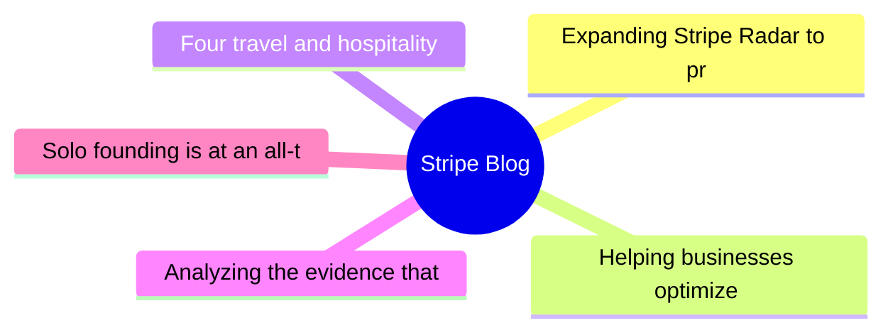
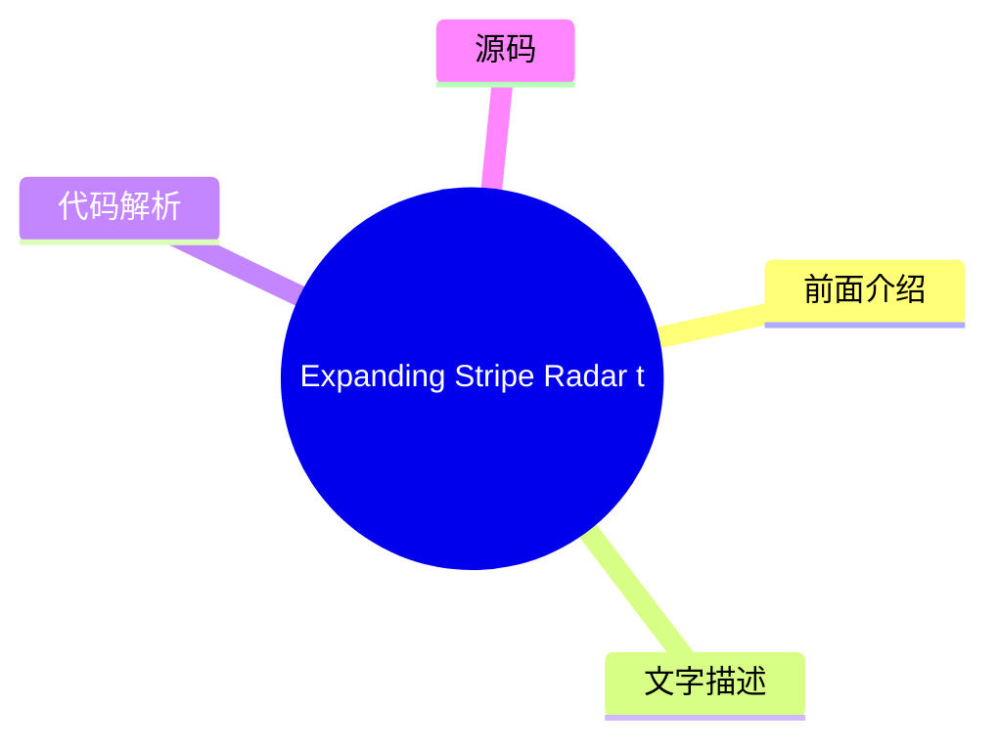
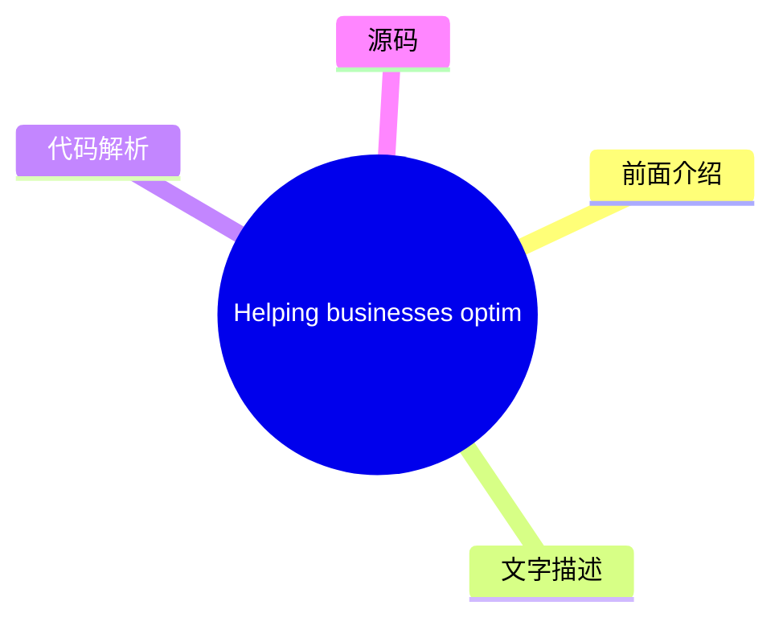
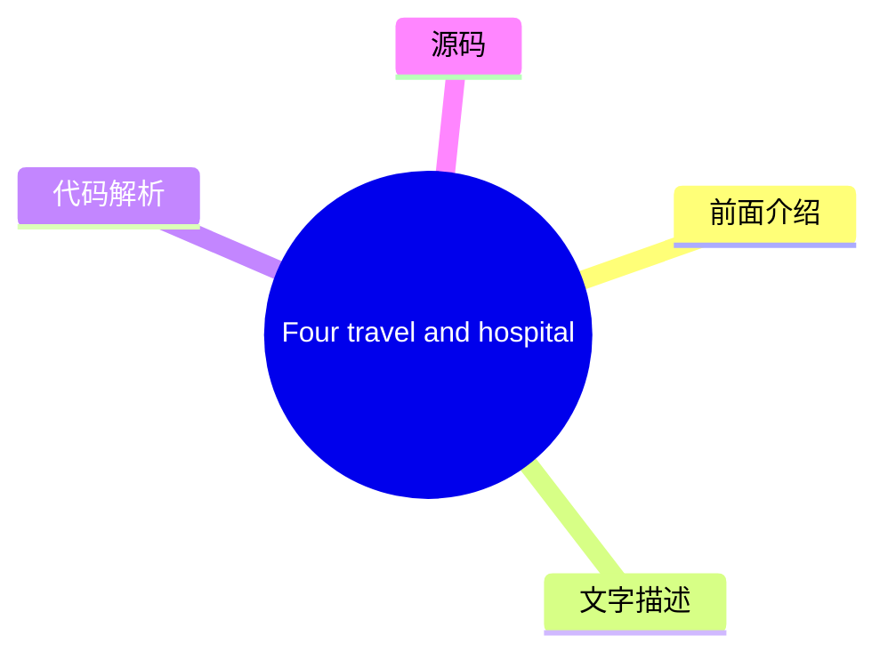
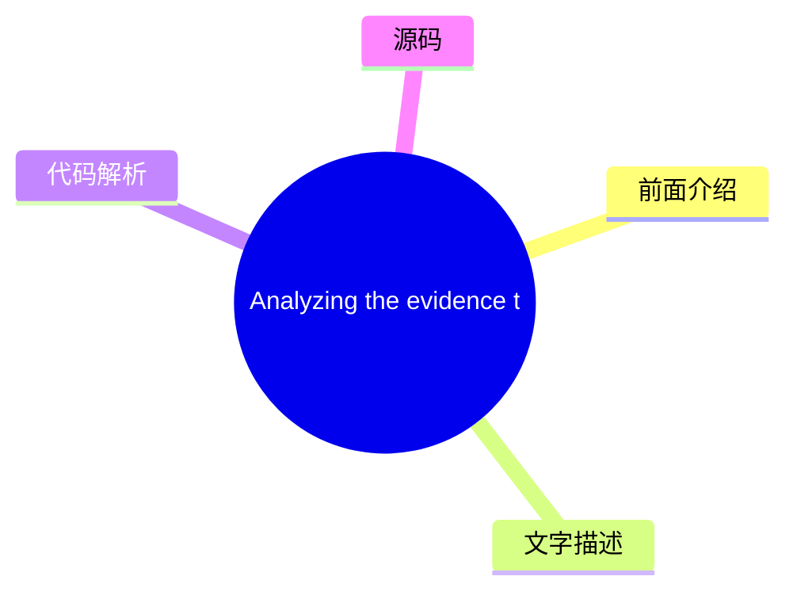
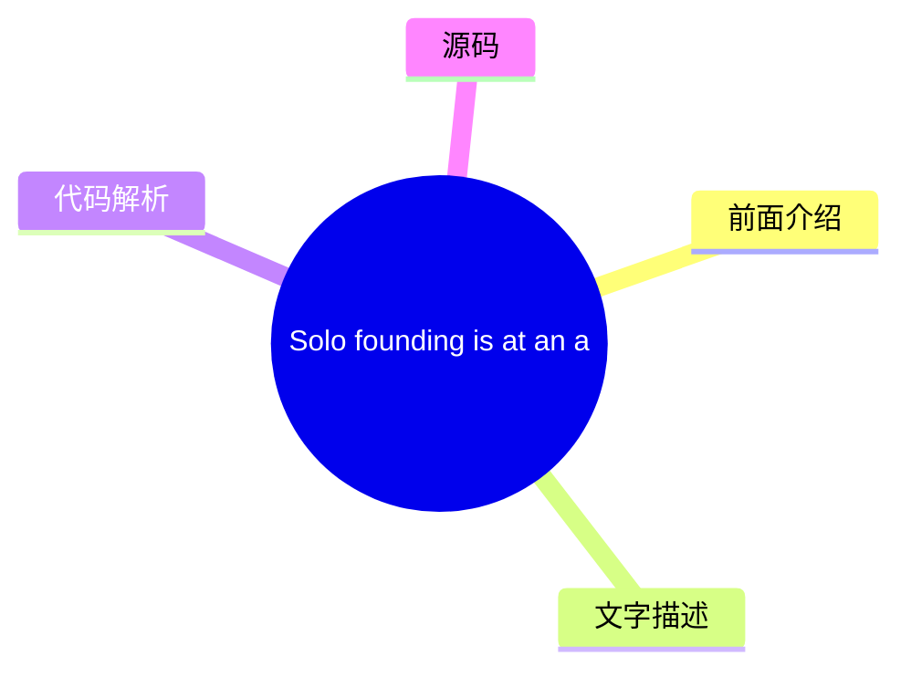

# 💳 Stripe Blog Top 5 (2026-07-30)

## 前面介绍

- 数据源：Stripe Blog
- 抓取日期：2026-07-30
- 条目数：5
- 含完整正文：5
- 含代码片段：0
- 组织方式：前面介绍 / 树状图 / 文字描述 / 代码解析 / 源码

## 思维导图

## 详细整理（5 条，5 条含全文，0 条含代码）

### 1. Expanding Stripe Radar to protect more of your business
- **链接**: [https://stripe.com/blog/expanding-stripe-radar-to-protect-more-of-your-business](https://stripe.com/blog/expanding-stripe-radar-to-protect-more-of-your-business)
- **发布**: Wed, 27 May 2026 00:00:00 +0000

#### 前面介绍

- Radar now blocks high-risk transactions across all supported payment methods; defends against new fraud types like multi-account abuse and pay-as-you-go abuse, regardless of which payment processor you use; and gives platforms new tools to evaluate a
- 发布时间：Wed, 27 May 2026 00:00:00 +0000

#### 树状图

#### 文字描述

- Last month at Stripe Sessions, we shared the biggest expansion we’ve ever made to [Stripe Radar](https://stripe.com/radar), our AI-powered fraud prevention tool. Radar now blocks high-risk transactions across all supported payment methods; defends against new fraud types like multi-account abuse and pay-as-you-go abuse, regardless of which payment processor you use; and gives p
- ## Protect more transactions with global payment coverage, new multiprocessor signals, and custom models Fraud protection is getting more complex. Businesses need to defend across a range of payment methods, and they need more precision in the signals they use to catch fraud before it happens—on and off Stripe. Radar now addresses both, along with the ability to use custom frau
- ## Defend against new types of fraud Fraudulent actors have become as sophisticated at stealing compute as they are at stealing money. They abuse policies by cycling through free trials, setting up multiple accounts, or intentionally not paying their next invoice. As businesses scale AI products, token abuse has become an expensive fraud vector. Last month, we shared how Radar 
- ## Protect your platform from account fraud Fraudulent actors are using generative AI to create fake identities, documents, and websites convincing enough to bypass many platforms’ verification systems. Platforms face a trade-off: request additional information during onboarding and increase friction, or keep the onboarding flow lightweight and take on potentially significant r

#### 代码解析

- 本文未检测到明确代码块，内容更偏新闻、观点或方法论。

#### 源码

#### 中文节选

Last month at Stripe Sessions, we shared the biggest expansion we’ve ever made to [Stripe Radar](https://stripe.com/radar), our AI-powered fraud prevention tool. Radar now blocks high-risk transactions across all supported payment methods; defends against new fraud types like multi-account abuse and pay-as-you-go abuse, regardless of which payment processor you use; and gives platforms new tools to evaluate and mitigate merchant risk on and off Stripe. We also launched additional ways to fight disputes with smarter evidence and automated evidence libraries.

Here’s a closer look at what we announced.

## Protect more transactions with global payment coverage, new multiprocessor signals, and custom models

Fraud protection is getting more complex. Businesses need to defend across a range of payment methods, and they need more precision in the signals they use to catch fraud before it happens—on and off Stripe. Radar now addresses both, along with the ability to use custom fraud models.

**Block high-risk transactions across all supported global payment methods
**

Radar now protects [all supported payment volume globally](https://docs.stripe.com/radar/local-payment-methods), including bank debits, buy now, pay later (BNPL) options, crypto, digital wallets, real-time payments, and cash vouchers. When Radar detects a fraudulent pattern on a transaction, that information becomes available to protect transactions across all payment methods. For example, if a fraudulent actor uses a stolen credit card at one business on Stripe, and we detect and block it, that same IP address and device fingerprint are now flagged across bank debits, wallets, and BNPL transactions network-wide. We found that Radar reduced suspected fraud by 71% during a five-month period for businesses using Affirm, Cash App, Klarna, and PayPal. 

**Improve your fraud decisioning with new multiprocessor signals
**

Businesses use Radar’s risk signals for off-Stripe transactions to complement their in-house fraud models and make more precise fraud decisions across payment processors. Now, you can further improve your fraud decisioning with additional signals for off-Stripe transactions to help you prevent fraud before it happens.

Stripe can now identify whether a payment is [likely to trigger an early fraud warning](https://docs.stripe.com/radar/multiprocessor#early-fraud-warning) from the card network. You can then choose to proactively refund the transaction and protect your dispute rate. 

Stripe can also predict whether a payment is [likely to result in a fraudulent dispute](https://docs.stripe.com/radar/multiprocessor#fraudulent-dispute). You can use this signal to issue refunds, gather evidence, or adjust your dispute strategy. 

We plan to add new signals that can be used across your entire payments stack.

**Access enterprise-grade custom fraud models
**

For businesses with more complex risk profiles, Radar now offers [custom fraud models](https://docs.stripe.com/radar/custom-

#### 完整正文（中文）

Last month at Stripe Sessions, we shared the biggest expansion we’ve ever made to [Stripe Radar](https://stripe.com/radar), our AI-powered fraud prevention tool. Radar now blocks high-risk transactions across all supported payment methods; defends against new fraud types like multi-account abuse and pay-as-you-go abuse, regardless of which payment processor you use; and gives platforms new tools to evaluate and mitigate merchant risk on and off Stripe. We also launched additional ways to fight disputes with smarter evidence and automated evidence libraries.

Here’s a closer look at what we announced.

## Protect more transactions with global payment coverage, new multiprocessor signals, and custom models

Fraud protection is getting more complex. Businesses need to defend across a range of payment methods, and they need more precision in the signals they use to catch fraud before it happens—on and off Stripe. Radar now addresses both, along with the ability to use custom fraud models.

**Block high-risk transactions across all supported global payment methods
**

Radar now protects [all supported payment volume globally](https://docs.stripe.com/radar/local-payment-methods), including bank debits, buy now, pay later (BNPL) options, crypto, digital wallets, real-time payments, and cash vouchers. When Radar detects a fraudulent pattern on a transaction, that information becomes available to protect transactions across all payment methods. For example, if a fraudulent actor uses a stolen credit card at one business on Stripe, and we detect and block it, that same IP address and device fingerprint are now flagged across bank debits, wallets, and BNPL transactions network-wide. We found that Radar reduced suspected fraud by 71% during a five-month period for businesses using Affirm, Cash App, Klarna, and PayPal. 

**Improve your fraud decisioning with new multiprocessor signals
**

企业使用 Radar 的风险信号来处理 Stripe 以外的交易，以补充其内部欺诈模型，并在所有支付处理商处做出更精准的欺诈决策。现在，您可以通过针对 Stripe 以外交易的额外信号进一步改进欺诈决策，帮助您在欺诈发生前进行预防。

Stripe 现在可以识别支付是否可能触发卡组织的[早期欺诈警告](https://docs.stripe.com/radar/multiprocessor#early-fraud-warning)。然后，您可以选择主动退款交易，以保护您的拒付率。

Stripe 还可以预测支付是否可能导致[欺诈性拒付](https://docs.stripe.com/radar/multiprocessor#fraudulent-dispute)。您可以使用此信号来发起退款、收集证据或调整您的拒付策略。

我们计划添加可在您的整个支付栈中使用的全新信号。

**访问企业级自定义欺诈模型**

对于风险概况更复杂的企业，Radar 现在提供[自定义欺诈模型](https://docs.stripe.com/radar/custom-fraud-models)。您可以将您业务独有的信号传递给 Stripe，例如产品目录数据、忠诚度状态、行为指标或任何与您的风险概况相关的结构化元数据。Stripe 然后将此信息与我们全球网络数据相结合，部署专门针对您业务定制的模型。对于早期采用者，自定义模型在误报率没有增加的情况下，检测到的欺诈至少增加了 15%。

## 防范新型欺诈

欺诈行为者在窃取资金方面的手段与窃取计算能力一样老练。他们通过循环使用免费试用、开设多个账户或故意不支付下一张账单来滥用政策。随着企业扩展 AI 产品，令牌滥用已成为一种昂贵的欺诈手段。

上个月，我们分享了 Radar 如何通过[防止免费试用滥用](https://stripe.com/blog/how-stripe-radar-helps-prevent-free-trial-abuse)来解决其中一种欺诈手段。在 Sessions 上，我们强调了保护您的企业免受多账户滥用、按量付费欺诈和欺诈机器人驱动支付侵害的新方法。

**Block multi-account abuse
**

Multi-account abuse is when a single fraudulent actor creates several accounts to reuse promotional coupons or spread stolen card activity across multiple accounts to avoid detection for longer. Across the Stripe network, more than one in six sign-ups at AI companies are linked to multi-account abuse.

Now, Radar can [evaluate each new account in real time](https://docs.stripe.com/radar/multi-account-and-account-sharing-abuse#multi-account-abuse), so you can block suspicious accounts before abuse happens—on and off Stripe. Our solution draws on information from prior abuse across the entire Stripe network, including device fingerprints, IP addresses, email domains, and more. In the past two months, ElevenLabs has been able to block 2,000 users a day from abusing its free tier. 

**Predict pay-as-you-go abuse
**

Pay-as-you-go abuse occurs when customers abuse your service by racking up usage costs with no intention of paying when the bill comes due. These bad actors exploit the structure of consumption-based pricing, where charges accumulate throughout a billing cycle, but payment happens later. For example, a customer could consume thousands of dollars of compute over the course of a month, get billed at the end, and never pay.

Radar now helps [predict nonpayment abuse as usage accumulates](https://docs.stripe.com/radar/pay-as-you-go-abuse), allowing you to intervene before a customer is billed. This allows you to require a top-up, cut off service, or take whatever action fits your risk tolerance.  

**Detect and prevent fraudulent bot-driven payments
**

As agentic commerce scales, distinguishing between legitimate agents acting on behalf of customers and malicious bots becomes increasingly important. Both are nonhuman traffic making purchases, but one is a customer’s authorized agent, and the other might exploit your checkout to buy limited-availability inventory, abuse promotional pricing, or bypass purchase limits.

Radar now assigns a bot score to payments made on Stripe Checkout, evaluating the likelihood that [they were made by a malicious bot](https://docs.stripe.com/radar/bot-abuse). You can use this score to enforce anti-scripting or anti-bot policies. For example, you could block automated purchases of limited-edition items or flag high-velocity orders for review.

## Protect your platform from account fraud

Fraudulent actors are using generative AI to create fake identities, documents, and websites convincing enough to bypass many platforms’ verification systems. Platforms face a trade-off: request additional information during onboarding and increase friction, or keep the onboarding flow lightweight and take on potentially significant risk.

[Platforms can now mitigate risk](https://docs.stripe.com/radar/radar-for-platforms) across their business with Radar, featuring 0-to-100 fraud scores for every business and transaction; AI-powered insights that explain why accounts are flagged; note taking and account history to help your team understand account context; and account-level metrics for disputes, declines, refunds, and payments. 

We also introduced three new ways platforms can monitor and evaluate merchant risk—on and off Stripe.

- The [fraudulent website](https://docs.stripe.com/radar/fraudulent-website)signal analyzes a business’s website the way a human fraud analyst would, looking for red flags like luxury items sold at unrealistically low prices, AI-generated copy, misspelled brand URLs, or other indicators that suggest the site is fraudulent. Platforms can use this signal during onboarding to automate verifications, flag accounts for manual review, or as an input to their own risk scoring before approving a business.
- The [fraudulent merchant](https://docs.stripe.com/radar/fraudulent-merchant)signal identifies whether a new or existing account poses a fraud risk, based on analyzing patterns across the Stripe network, including bank account information, business details, transaction activity, and disputes. Platforms can then raise a review, pause payouts, pause payments, reject the account, set reserves, or request identity verification.

- [商户拖欠风险](https://docs.stripe.com/radar/merchant-delinquency-risk)信号预测企业是否面临累积负余额的风险；具体而言，它预测该余额是否可能持续为负 60 天或更长时间。平台可利用此信号来决定是否主动调整结算时间表，对高风险账户要求预留金，或在损失累积之前标记商户以进行更深入的审查。

## 利用更智能的证据和自动化证据库更有效地应对争议

[智能争议](https://docs.stripe.com/disputes/smart-disputes)是我们基于 AI 的争议管理产品，它一直代表您整理并提交证据。现在，智能争议可以制定更定制化的策略，以提高您赢得每起争议的几率。

智能争议会分析每起争议，并为特定证据字段（如追踪号码或客户使用日志）提供 [AI 驱动的建议](https://docs.stripe.com/disputes/set-up-smart-disputes#provide-more-data-at-dispute-time)。通过智能争议添加我们 AI 推荐证据的企业，其胜诉频率比未添加任何证据的企业高出 3 倍。

我们还在减少提交证据所需的人工工作量。许多争议需要相同的支持材料：条款和条件、退货政策和协议。借助证据库，您只需上传并存储这些文档一次，智能争议便会根据争议原因代码、网络要求和持卡人主张，自动选择并将它们包含在您的证据包中——无需手动重新提交。

## 接下来是什么

在 Sessions 上，我们还发布了 [我们的公开路线图](https://stripe.com/roadmap)：一份包含 2027 年第一季度之前数百个详细条目的明细清单，其中包括 [Radar 中的产品、功能和改进](https://stripe.com/roadmap?product=Radar)。

想了解更多 Radar 如何保护您的业务，欢迎加入我们在全球主要城市的 [Stripe Tour 2026](https://stripetour.com/)。您也可以 [阅读我们的文档](https://docs.stripe.com/radar) 或 [联系我们的专家团队](https://stripe.com/contact/sales)。

### 2. Helping businesses optimize network costs with the Visa Digital Commerce Authentication Program (DCAP)
- **链接**: [https://stripe.com/blog/helping-businesses-optimize-network-costs-with-visa-digital-commerce-authentication-program](https://stripe.com/blog/helping-businesses-optimize-network-costs-with-visa-digital-commerce-authentication-program)
- **发布**: Wed, 03 Jun 2026 00:00:00 +0000

#### 前面介绍

- We moved quickly to help Stripe businesses take advantage of DCAP and capture interchange savings while protecting authorization rates. Here’s what we did.
- 发布时间：Wed, 03 Jun 2026 00:00:00 +0000

#### 树状图

#### 文字描述

- Visa recently launched the [Digital Commerce Authentication Program (DCAP)](https://support.stripe.com/questions/understand-the-visa-digital-commerce-authentication-program-%28dcap%29-on-stripe), a new global framework designed to reduce fraud and increase authorization rates for card-not-present transactions. The program rewards businesses in the US for sharing richer transact
- ### Optimizing DCAP savings without sacrificing conversion Before rolling out DCAP, we worked with Visa to run readiness testing and identify the right implementation approach. This collaborative testing underscored the need for transaction-level intelligence. With [Stripe Authorization Boost](https://stripe.com/authorization-boost), we intelligently select which transactions s
- ## Automatically benefit from DCAP optimizations If you use Authorization Boost and are collecting the required data points, you’re already automatically benefiting from DCAP optimizations. For businesses using [standalone 3DS](https://docs.stripe.com/payments/3d-secure/standalone-3d-secure), you can participate by setting **flow_preference[type]** to `data_share` on authentica

#### 代码解析

- 本文未检测到明确代码块，内容更偏新闻、观点或方法论。

#### 源码

#### 中文节选

Visa recently launched the [Digital Commerce Authentication Program (DCAP)](https://support.stripe.com/questions/understand-the-visa-digital-commerce-authentication-program-%28dcap%29-on-stripe), a new global framework designed to reduce fraud and increase authorization rates for card-not-present transactions. The program rewards businesses in the US for sharing richer transaction data with issuers during authentication, such as device ID, billing address, IP address, and customer email. Qualifying transactions receive a net interchange reduction of five basis points.

New network programs create opportunity, but they also introduce complexity. Businesses need to understand which transactions qualify, ensure their integration passes the required data, and determine whether participating will improve their end-to-end transaction economics or have unintended consequences, such as hurting authorization rates.

To participate in DCAP, businesses need to share required cardholder data with issuers via frictionless authentication in their checkout. This might introduce latency and uncertainty around how issuers interpret these newer signals.

We moved quickly to help Stripe businesses take advantage of DCAP and capture interchange savings while protecting authorization rates. Here’s what we did.

### Optimizing DCAP savings without sacrificing conversion

Before rolling out DCAP, we worked with Visa to run readiness testing and identify the right implementation approach. This collaborative testing underscored the need for transaction-level intelligence.

With [Stripe Authorization Boost](https://stripe.com/authorization-boost), we intelligently select which transactions should go through [Data Only 3DS](https://docs.stripe.com/payments/3d-secure/strong-customer-authentication-exemptions#data-only), which sends additional risk data from the card network to the issuer for authorization. Rather than applying static rules, Authorization Boost evaluates cost savings, conversion impact, and fraud risk at the individual transaction level to determine when to apply Data Only 3DS. This allows businesses to capture DCAP savings while limiting the impact to the customer experience and optimizing authorization rates.

Since April 18, we’ve helped Stripe businesses capture $18.4 million in annualized network cost savings from DCAP. By helping businesses collect and pass the required data, we saw an 8x increase in the number of DCAP-eligible transactions. We’re continuing to work with Visa to optimize eligibility, so more transactions can benefit from DCAP.

## Automatically benefit from DCAP optimizations

If you use Authorization Boost and are collecting the required data points, you’re already automatically benefiting from DCAP optimizations. For businesses using [standalone 3DS](https://docs.stripe.com/payments/3d-secure/standalone-3d-secure), you can participate by setting **flow_preference[type]** to `data_share` on authentication requests and ensuring require

#### 完整正文（中文）

Visa recently launched the [Digital Commerce Authentication Program (DCAP)](https://support.stripe.com/questions/understand-the-visa-digital-commerce-authentication-program-%28dcap%29-on-stripe), a new global framework designed to reduce fraud and increase authorization rates for card-not-present transactions. The program rewards businesses in the US for sharing richer transaction data with issuers during authentication, such as device ID, billing address, IP address, and customer email. Qualifying transactions receive a net interchange reduction of five basis points.

New network programs create opportunity, but they also introduce complexity. Businesses need to understand which transactions qualify, ensure their integration passes the required data, and determine whether participating will improve their end-to-end transaction economics or have unintended consequences, such as hurting authorization rates.

To participate in DCAP, businesses need to share required cardholder data with issuers via frictionless authentication in their checkout. This might introduce latency and uncertainty around how issuers interpret these newer signals.

We moved quickly to help Stripe businesses take advantage of DCAP and capture interchange savings while protecting authorization rates. Here’s what we did.

### Optimizing DCAP savings without sacrificing conversion

Before rolling out DCAP, we worked with Visa to run readiness testing and identify the right implementation approach. This collaborative testing underscored the need for transaction-level intelligence.

借助 [Stripe Authorization Boost](https://stripe.com/authorization-boost)，我们可以智能选择哪些交易应通过 [Data Only 3DS](https://docs.stripe.com/payments/3d-secure/strong-customer-authentication-exemptions#data-only)，该流程会从卡组织向发卡行发送额外的风险数据。与使用静态规则不同，Authorization Boost 会在单个交易层面评估成本节约、转化影响和欺诈风险，以确定何时应用 Data Only 3DS。这使企业能够在限制对客户体验的影响的同时，捕获 DCAP 节省，并优化授权率。

自 4 月 18 日以来，我们已帮助 Stripe 企业从 DCAP 中获得了 1840 万美元的年度化网络成本节约。通过帮助企业收集和传递所需数据，我们观察到 DCAP 合格交易的数量增加了 8 倍。我们正在继续与 Visa 合作优化资格条件，以便更多交易能够受益于 DCAP。

## 自动受益于 DCAP 优化

如果您使用 Authorization Boost 并正在收集所需的数据点，您已经自动受益于 DCAP 优化。对于使用 [standalone 3DS](https://docs.stripe.com/payments/3d-secure/standalone-3d-secure) 的企业，您可以通过在身份验证请求上将 **flow_preference[type]** 设置为 `data_share` 并确保填写了必填字段来参与其中。

了解更多关于 [Authorization Boost](https://docs.stripe.com/payments/analytics/optimization) 如何帮助优化您的支付表现的信息。

### 3. Four travel and hospitality trends from HITEC 2026
- **链接**: [https://stripe.com/blog/trends-from-hitec](https://stripe.com/blog/trends-from-hitec)
- **发布**: Tue, 23 Jun 2026 00:00:00 +0000

#### 前面介绍

- More than 6,000 hospitality executives and operators gathered in San Antonio last week for the HITEC conference. The big topic: whether the industry’s AI investment is actually working. Across four days and over 50 meetings, four trends stood out.
- 发布时间：Tue, 23 Jun 2026 00:00:00 +0000

#### 树状图

#### 文字描述

- More than 6,000 hospitality executives and operators gathered in San Antonio last week for the annual HITEC hospitality technology conference, including leaders from Wyndham Hotels & Resorts, Hyatt, IHG Hotels & Resorts, Starwood Hotels, and hundreds of independent properties. The big topic: whether the industry’s AI investment is actually working. IDC forecasts that [30%](http
- ## The race for direct bookings has moved from search rankings to AI answers For years, the hospitality industry’s answer to online travel agency (OTA) dependency was SEO: invest in content, improve search rankings, and convert guests before they end up on Expedia or Booking.com. That approach is becoming less effective. Jack Wang, principal solution engineer at Salesforce, off
- ## Most hospitality AI is falling short in a predictable way An uncomfortable truth surfaced repeatedly throughout HITEC: much of the AI scaling happening across hospitality is fragile. The majority of businesses are adopting AI without the strategic clarity, data foundation, and operational architecture to sustain it. The root cause is often fragmented data. Siloed property ma
- ## Payments friction has a measurable cost, but most hotels still don’t know what it is The hospitality industry has historically treated payments as a cost and commodity: something to keep running, minimize fees on, and keep out of the way. Many of the payments-specific conversations we had at HITEC revolved around how that approach is changing, along with a growing recognitio

#### 代码解析

- 本文未检测到明确代码块，内容更偏新闻、观点或方法论。

#### 源码

#### 中文节选

超过 6,000 名酒店高管和经营者上周齐聚圣安东尼奥，参加年度 HITEC 酒店技术会议，其中包括万豪酒店度假村、凯悦、洲际酒店及度假村、喜达屋酒店以及数百家独立物业的领导者。

主要议题：行业的人工智能投资是否真的奏效。IDC 预测，到 2030 年，30% 的所有旅行预订将由人工智能代理完成。但行业的发展方向与当前具备的支持能力之间存在巨大差距。

根据 BCG 的数据，虽然 25% 的酒店企业报告称目前正在积极扩展人工智能，但不到 10% 的企业被认为是“AI 未来构建型”——这意味着它们在核心运营中植入了人工智能，拥有支持性的数据基础，并能展示可衡量的回报。“许多公司只是在盲目尝试，看能不能行得通，”佛罗里达国际大学酒店技术副教授 Dale Gomez 说。“他们想看到投资回报率。”

其他变革已经展开。许多酒店企业仍然缺乏现代金融基础设施，无法充分受益于人工智能预计将带来的自动化、速度和互操作性。曾经被认为“足够好”的支付系统现在正在造成可衡量的收入损失，而不断上升的客人期望已将低效的技术从一个小麻烦变成了不再回头的原因。

在四天的时间里，举行了 50 多次会议，四个趋势脱颖而出。

## 直接预订的竞争已从搜索排名转向 AI 回答

多年来，酒店行业应对在线旅行社 (OTA) 依赖症的办法是 SEO：投资内容，提高搜索排名，并在客人最终出现在 Expedia 或 Booking.com 之前将其转化。这种方法正变得越来越无效。

Salesforce 的首席解决方案工程师 Jack Wang 提供的数据凸显了一种转变：现在，65% 触发 AI 概览的 Google 搜索最终都没有用户点击任何网站。在移动端，这一数字上升到 78%。随着 AI 生成的摘要取代了 SEO 旨在赢得的排名链接列表，传统搜索流量在整个行业下降了约 25%。

被包含在 AI 生成的答案中需要与 SEO 奖励的内容不同。SEO 响应关键词密度、反向链接和页面权重。AI 包含则响应结构化属性数据的准确性和机器可读性，如房型、设施详情、政策、本地背景或取消条款。一家酒店可能在传统搜索中排名良好，但对 LLM 来说却不可见：超过 [90%](https://www.nokumo.net/en/ai-visibility-in-hospitality-what-3-600-ai-responses-and-1-337-website-audits-reveal?utm_campaign=ennismore-proves-tech-investment-pays-off-and-94-of-hotels-are-invisible-to-ai) 的住宿

#### 完整正文（中文）

超过 6,000 名酒店高管和经营者上周齐聚圣安东尼奥，参加年度 HITEC 酒店技术会议，其中包括万豪酒店度假村、凯悦、洲际酒店及度假村、喜达屋酒店以及数百家独立物业的领导者。

主要议题：行业的人工智能投资是否真的奏效。IDC 预测，到 2030 年，30% 的所有旅行预订将由人工智能代理完成。但行业的发展方向与当前具备的支持能力之间存在巨大差距。

根据 BCG 的数据，虽然 25% 的酒店企业报告称目前正在积极扩展人工智能，但不到 10% 的企业被认为是“AI 未来构建型”——这意味着它们在核心运营中植入了人工智能，拥有支持性的数据基础，并能展示可衡量的回报。“许多公司只是在盲目尝试，看能不能行得通，”佛罗里达国际大学酒店技术副教授 Dale Gomez 说。“他们想看到投资回报率。”

其他变革已经展开。许多酒店企业仍然缺乏现代金融基础设施，无法充分受益于人工智能预计将带来的自动化、速度和互操作性。曾经被认为“足够好”的支付系统现在正在造成可衡量的收入损失，而不断上升的客人期望已将低效的技术从一个小麻烦变成了不再回头的原因。

在四天的时间里，举行了 50 多次会议，四个趋势脱颖而出。

## 直接预订的竞争已从搜索排名转向 AI 回答

多年来，酒店行业应对在线旅行社 (OTA) 依赖症的办法是 SEO：投资内容，提高搜索排名，并在客人最终出现在 Expedia 或 Booking.com 之前将其转化。这种方法正变得越来越无效。

Jack Wang, principal solution engineer at Salesforce, offered data that spotlights a shift: 65% of Google searches that trigger an AI Overview now end without the user clicking any website. On mobile, that number climbs to 78%. Traditional search traffic is declining roughly 25% across the industry, as AI-generated summaries replace the ranked link lists that SEO was designed to win.

Inclusion in an AI-generated answer requires something different from what SEO rewards. SEO responds to keyword density, backlinks, and page authority. AI inclusion responds to the accuracy and machine-readability of structured property data, like room types, amenity details, policies, local context, or cancellation terms. A hotel can rank well in traditional search and be invisible to an LLM: over [90%](https://www.nokumo.net/en/ai-visibility-in-hospitality-what-3-600-ai-responses-and-1-337-website-audits-reveal?utm_campaign=ennismore-proves-tech-investment-pays-off-and-94-of-hotels-are-invisible-to-ai) of accommodation sites are still undetected by AI models.

We’re already seeing a downstream effect. According to Phocuswright research, [56%](https://www.phocuswire.com/news/online/shift-travel-behavior-ai-surge-phocuswright-research) of travelers have used AI for trip planning, booking, or in-destination assistance in the past 12 months. For operators, the first step is an audit, not an investment. Can the LLMs your prospective guests are using accurately describe your property’s room categories, amenities, policies, and local context? If the answer is no, that gap is likely costing you bookings.

Today, hotel chains have access to the same checkout and payment tools as OTAs, including local payment methods and currencies, one-click checkout, and global fraud protection. The travel brands capturing agentic demand are combining AI-driven discoverability with accurate real-time inventory and a modern checkout experience that converts demand efficiently.

## Most hospitality AI is falling short in a predictable way

An uncomfortable truth surfaced repeatedly throughout HITEC: much of the AI scaling happening across hospitality is fragile. The majority of businesses are adopting AI without the strategic clarity, data foundation, and operational architecture to sustain it.

The root cause is often fragmented data. Siloed property management, CRM, loyalty, food and beverage, and payment systems each hold partial views of the same guest—and AI recommendations are only as accurate as the content they draw on. The same data problem that breaks AI personalization shows up in finance as excessive reconciliation time, in operations as incomplete guest profiles, and in the guest experience as friction.

Amanda Sharp, Salesforce lead solution engineer, reframed the problem as AI operationalization rather than adoption, calling for “vibe operating”: hospitality’s answer to vibe coding. Building AI features is now feasible for many hotel brands. Running them reliably in production, integrated into actual workflows that trigger real actions, is harder.

The businesses doing this well have clean, connected data that delivers useful intelligence directly into the workflow while there’s still time to act. At Delta Air Lines, for example, a live AI concierge is built into the mobile app and uses SkyMiles profile and operational data to provide context-aware support as part of the customer care experience. At Wynn Las Vegas, revenue managers receive predictive alerts when performance is trending below target, along with recommended actions attached.

For most travel operators, the bottleneck is data connectivity rather than model quality.

## Payments friction has a measurable cost, but most hotels still don’t know what it is

酒店业长期以来一直将支付视为一种成本和商品：一种需要维持运转、尽量减少费用并尽量不干扰业务的东西。我们在 HITEC 会议上进行的许多支付相关讨论都围绕着这种做法的改变展开，以及人们日益认识到支付已成为酒店品牌竞争的关键因素。我们自己的数据也支持这一观点：在 Stripe 委托的一份针对近 400 名酒店业高管进行的 [调查](https://go.stripe.global/rs/072-MDK-283/images/Skift_x_Stripe_How_Payment_Systems_Are_Changing_in_Travel_and_Hospitality.pdf) 中，90% 的人表示支付对增长很重要，37% 的人表示缺乏支付选项对客人体验产生最大的负面影响。此外，58% 的人表示他们的欺诈系统会拦截合法交易，74% 的人报告称，系统分散导致团队在对账上花费过多时间。

这些数据凸显了支付为何已成为一种结构性优势。在线旅行社（OTA）之所以能够负担得起大规模的支付团队，是因为其收入证明了招聘人员的合理性。独立酒店和较小的运营商无法直接匹配这种投资，但在正确的基础设施支持下，一个精简的团队现在可以以大型内部运营成本的一小部分，支持数十个国家的支付方式。

覆盖范围的缺失直接导致预订流失。“一旦我们不支持 [某种支付方式]，客人就会去其他支持其首选支付方式的平台或渠道，”Cloudbeds 战略合作伙伴副总裁 Sebastien Leitner 说。客人在其首选支付方式适用的地方预订。一家不支持目标市场主流支付方式的酒店不仅是在制造摩擦——它实际上是将预订引导给了支持该方式的 OTA。

## 最好的酒店技术是那种不易被察觉的技术

“There is zero empathy for technology that doesn’t work,” said Tanya Pratt, global VP of strategy and product management at Oracle Hospitality. “If it’s not working, it’s going to cause more frustration than if there’s a line at the front desk, because people are used to that.” When technology fails, guests don’t always complain. They just don’t come back.

The real gauge of success is when technology works well enough that guests don’t think about it at all. Denise Walker, CIO of Starwood Hotels, described the vision: a returning guest arrives to a room at the right temperature, with their preferred channels on the TV, and pillows of their preferred firmness on the bed. No one announces how they knew. “It doesn’t have to be delivered in a way that says, ‘How did you know that?’”

Shannon McCallum, VP of hotel operations at Resorts World Las Vegas, went further. “We’re moving from ‘I told you this, so you know it about me’ to ‘I didn’t tell you anything, and now you’re predicting it.’”

Both the invisible personalization and the human moments it enables require a foundation of connected data—tech that integrates across your existing stack, consolidating guest information into a single system. That infrastructure allows businesses to recognize the same guest whether they’re browsing your website or standing at the front desk.

## How Stripe can help

Increasingly, guests will find your property through AI assistants rather than search engines. The bookings they make might be completed by agents. And the revenue that distinguishes high-performing operators will come from payment experiences that convert, payment methods that cover every market, and financial systems that work together. Stripe Data Pipeline connects payments data with your booking and customer systems, giving operators a unified view of revenue without stitched-together reporting.

Stripe’s payments infrastructure helps hospitality operators protect revenue, boost guest spend on-property, and simplify operations.

**驱动直接预订。** 在客人实际使用的各种支付方式上，以及在您服务的每个市场中，能够促进转化的支付体验有助于保持预订量留在您的直接渠道。随着代理商务务的扩展，这意味着默认在每笔 Stripe 交易上运行的欺诈检测，以及允许代理在不暴露客人凭证的情况下进行交易的支付令牌。

**增加行程消费。** 来自餐饮、体验和合作伙伴的辅助收入需要能够在整个物业范围内运作的支付基础设施，支持新的商业模式，并与外部合作伙伴连接。Stripe Billing 处理会员和忠诚度计划背后的 recurring payment logic（循环支付逻辑），包括自动续费、分级定价和失败支付恢复——而无需运营商自行维护该基础设施。例如，[Cloudbeds](https://stripe.com/customers/cloudbeds) 发现，使用 Cloudbeds Payments 的企业收入增长了 15%，而通过其 Stripe 合作伙伴关系直接消除支付摩擦、扩展支付方式的企业，平均收入增加了 14.8%。

**降低成本。** 更高效的 B2B 资金流动和欺诈保护减少了对账工作并限制了损失，从而在不增加人员的情况下释放利润空间。

[了解更多](https://stripe.com/industries/travel) 关于 Stripe 如何支持酒店业务，或 [联系我们](https://stripe.com/contact/sales)。

### 4. Analyzing the evidence that helps businesses win “product not received” disputes
- **链接**: [https://stripe.com/blog/analyzing-the-evidence-that-helps-businesses-win-product-not-received-disputes](https://stripe.com/blog/analyzing-the-evidence-that-helps-businesses-win-product-not-received-disputes)
- **发布**: Tue, 21 Jul 2026 00:00:00 +0000

#### 前面介绍

- To understand what can influence win rates, we analyzed evidence packets from one million disputes over a 16-week period. Here’s what the data shows and what it means for how you mitigate disputes.
- 发布时间：Tue, 21 Jul 2026 00:00:00 +0000

#### 树状图

#### 文字描述

- “[Product not received](https://docs.stripe.com/disputes/categories)” disputes—where a cardholder claims they didn’t receive what they paid for—are the most common nonfraud dispute category on Stripe. It can be challenging to know which claims are legitimate and which are not: some customers genuinely never received what they paid for, while others incorrectly claim they didn’t
- ## Businesses that submitted evidence after the delivery was confirmed saw a 27 percentage point higher win rate Many businesses submit a shipping tracking ID as proof of delivery. However, depending on the status of the package at the time you submit the evidence, the tracking number might only confirm that the package left your facility. Our analysis found that win rates incr
- ## Businesses that submitted digital activity and usage logs saw a 10 percentage point higher win rate Businesses selling digital goods also need to provide proof of fulfillment, though the supporting evidence looks different. Disputes with digital activity and usage logs—such as JSON telemetry logs from common analytics platforms showing that a user streamed, downloaded, or ac
- ## Businesses that included evidence of a refund issued through Stripe saw a 63 percentage point higher win rate Cardholders can still initiate [a dispute even after a refund has been processed](https://support.stripe.com/questions/disputes-on-a-refunded-transaction-faq), often because the refund and dispute were filed around the same time or because the issuing bank didn’t che

#### 代码解析

- 本文未检测到明确代码块，内容更偏新闻、观点或方法论。

#### 源码

#### 中文节选

“[未收到商品](https://docs.stripe.com/disputes/categories)”争议——即持卡人声称他们未收到所付款项——是 Stripe 上最常见的非欺诈争议类别。很难判断哪些索赔是合理的，哪些不是：有些客户确实从未收到他们所付款项的商品，而其他人则错误地声称未收到订单。

为了了解哪些因素会影响胜诉率，我们在 16 周的时间内分析了 100 万起争议的证据包。我们将包含各种类型证据（如投递确认或内容消费日志）的包的胜诉率与不包含这些证据的包进行了比较，从而确定了哪些特征与更高的胜诉率相关。

以下是数据对业务总体情况的显示，销售数字商品的业务有何不同，以及这对您如何降低争议意味着什么。

**提交投递信息的业务胜诉率高出 44 个百分点**

对于销售实物商品的业务，带有投递确认证据的争议的胜诉率比没有投递确认的争议高出 27 个百分点。添加显示承运商扫描包裹位置的 GPS 投递地图作为证据，在仅有投递确认的基础上又提升了 15 个百分点的胜诉率。而包含收件人签名作为证据则进一步提升了 2 个百分点。因此，包含投递确认、GPS 地图和签名的争议，其胜诉率比没有这些证据的争议高出 44 个百分点。

然而，许多业务仍然未在争议回复中包含投递确认。这种差距的一部分是由于意识不足，但更大的障碍在于运营。对于大多数业务而言，发货数据和争议工作流位于不同的系统中。将特定的争议与正确的订单以及已确认的投递状态进行匹配通常需要手动工作，且难以扩展。

## 在投递确认后提交证据的业务胜诉率高出 27 个百分点

Many businesses submit a shipping tracking ID as proof of delivery. However, depending on the status of the package at the time you submit the evidence, the tracking number might only confirm that the package left your facility.

Our analysis found that win rates increased based on what the tracking ID showed when a business submitted it—specifically, whether delivery had been confirmed. Disputes with evidence submitted after delivery was confirmed had a 27 percentage point higher win rate than disputes with no delivery confirmation. On the other hand, disputes with evidence submitted when the package was still in transit had only a two percentage point higher win rate than disputes with no delivery confirmation.

This suggests that the timing of your evidence submission matters. Customers might file a “product not received” dispute before an order arrives, especially if a shipment is delayed or still in transit. Because most business

#### 完整正文（中文）

“[未收到商品](https://docs.stripe.com/disputes/categories)”争议——即持卡人声称他们未收到所付款项——是 Stripe 上最常见的非欺诈争议类别。很难判断哪些索赔是合理的，哪些不是：有些客户确实从未收到他们所付款项的商品，而其他人则错误地声称未收到订单。

为了了解哪些因素会影响胜诉率，我们在 16 周的时间内分析了 100 万起争议的证据包。我们将包含各种类型证据（如投递确认或内容消费日志）的包的胜诉率与不包含这些证据的包进行了比较，从而确定了哪些特征与更高的胜诉率相关。

以下是数据对业务总体情况的显示，销售数字商品的业务有何不同，以及这对您如何降低争议意味着什么。

**提交投递信息的业务胜诉率高出 44 个百分点**

对于销售实物商品的业务，带有投递确认证据的争议的胜诉率比没有投递确认的争议高出 27 个百分点。添加显示承运商扫描包裹位置的 GPS 投递地图作为证据，在仅有投递确认的基础上又提升了 15 个百分点的胜诉率。而包含收件人签名作为证据则进一步提升了 2 个百分点。因此，包含投递确认、GPS 地图和签名的争议，其胜诉率比没有这些证据的争议高出 44 个百分点。

然而，许多业务仍然未在争议回复中包含投递确认。这种差距的一部分是由于意识不足，但更大的障碍在于运营。对于大多数业务而言，发货数据和争议工作流位于不同的系统中。将特定的争议与正确的订单以及已确认的投递状态进行匹配通常需要手动工作，且难以扩展。

## 在投递确认后提交证据的业务胜诉率高出 27 个百分点

许多企业会提交运输跟踪 ID 作为交付证明。然而，根据您提交证据时包裹的状态，该跟踪号可能仅能确认包裹已离开您的设施。

我们的分析发现，企业提交跟踪 ID 时显示的内容会影响胜诉率——具体而言，即是否已确认交付。在确认交付后提交证据的争议，其胜诉率比未确认交付的争议高出 27 个百分点。另一方面，在包裹仍在运输途中提交证据的争议，其胜诉率仅比未确认交付的争议高出 2 个百分点。

这表明证据提交的时机很重要。客户可能会在订单到达之前就提起“未收到商品”的争议，尤其是当发货延迟或仍在运输途中时。由于大多数企业有 20 天或更长的回复时间，如果您的争议处理窗口允许，请考虑等到承运商确认到达后再提交。如果您确实需要在确认交付之前提交，请考虑包含显示订单仍在客户在结账时同意的交付时间范围内的文档。

## 提交数字活动和使用日志的企业胜诉率高出 10 个百分点

销售数字商品的企业也需要提供履行证明，尽管支持证据的形式有所不同。

包含数字活动和使用日志（例如来自常见分析平台的 JSON 遥测日志，显示用户流式传输、下载或访问了其购买的具体产品）的争议，其胜诉率比没有这些证据的争议高出 10 个百分点。而包含服务文档（如配置记录）的争议，其胜诉率比没有这些证据的争议高出 8 个百分点。

The pattern mirrors what we found with businesses selling physical goods: specificity is always better. Service documentation might only prove that a customer had access. On the other hand, content consumption logs might prove customers streamed, downloaded, or accessed the specific product they paid for.

## Businesses that included evidence of a refund issued through Stripe saw a 63 percentage point higher win rate

Cardholders can still initiate [a dispute even after a refund has been processed](https://support.stripe.com/questions/disputes-on-a-refunded-transaction-faq), often because the refund and dispute were filed around the same time or because the issuing bank didn’t check the refund status before filing the dispute. When this happens, many businesses include refund evidence in their dispute responses as proof they’ve already made the customer whole. But our analysis showed that the impact of “proof of refund” on win rates for businesses selling digital goods depended on how the refund was processed.

A full refund issued through Stripe was the strongest predictor of high win rates for businesses selling digital goods. Disputes that included this type of evidence had a 63 percentage point higher win rate than disputes that didn’t include it. On the other hand, disputes with refunds issued via other channels, such as store credit, saw only a six percentage point lift compared to disputes that didn’t include it.

This might be because issuers can only act on information they can verify. When a refund is processed through your payment processor, the issuing bank can verify that credit on the card network. A refund issued outside of your payment processor can’t be verified in the same way by the issuer; there is no record.

## How Stripe can help

[Smart Disputes](https://docs.stripe.com/disputes/smart-disputes) is designed to apply these best practices for you, helping you save time and recover revenue. It uses AI to automatically assemble tailored evidence packets for eligible card disputes, applying the same data-backed best practices identified in this analysis, so you don’t have to manually implement them dispute by dispute.

当您收到争议时，通过向 Smart Disputes 提供承运商和运单号，可以提高您的胜诉率。Stripe 支持超过 12 家承运商，并会自动与它们合作，获取完整的履行历史记录，例如投递状态、时间戳和位置数据。您还可以添加任何额外的证据，例如客户沟通记录或补充文件，Stripe 会将其与自动生成的证据包合并，以创建最强有力的回复。

随后，Stripe 会将这些信息为您组装成一份有力的证据包，并根据具体的争议（包括网络、地区、发卡行和原因代码）优化证据包的内容和结构。如果您在争议截止日期前未采取任何行动，Smart Disputes 将代表您提交证据，以确保不会因错过截止日期而导致争议失败。

如果您已经使用 Stripe，则无需进行额外的集成。要了解更多关于 Smart Disputes 的信息，请阅读我们的文档。

*此处包含的见解、预测和前瞻性陈述仅供参考，不应依赖。这些内容基于假设和目前可获得的信息，但实际结果可能会有重大差异。*

### 5. Solo founding is at an all-time high: Top performers have these traits in common
- **链接**: [https://stripe.com/blog/top-solo-founder-traits](https://stripe.com/blog/top-solo-founder-traits)
- **发布**: Thu, 28 May 2026 00:00:00 +0000

#### 前面介绍

- In 2025, solo founders in the top decile generated 61 times the revenue of the median solo founder in their first six months. We analyzed the data to understand what drives that gap.
- 发布时间：Thu, 28 May 2026 00:00:00 +0000

#### 树状图

#### 文字描述

- Solo startup founders, defined here as people who launched a startup through Stripe Atlas without any cofounders, account for 63% of C corps formed so far in the second quarter of 2026—an all-time high. As more founders start companies on their own, the gap between typical companies and top performers is widening. Among solo-founded startups incorporated through Atlas, median i
- ## 1. They build AI-native products The most successful solo founders are building AI-native products, meaning the product’s core functionality depends on AI models. Top-decile solo founders were about twice as likely as median founders to be building AI-native companies. The next generation of solo founders will be less defined by technical pedigree and more by speed,” says [M
- ## 2. They sell globally from launch In the first month, top-decile solo founders sold into an average of 10 countries, versus just three for median solo founders. That gap continued to widen over time. By month 24, top-decile solo founders were selling into 40 non-US countries, on average, compared to six for median solo founders. Top solo founders also generated a much larger
- ## 3. They build for businesses Top solo founders were nearly 30% more likely than middle-decile founders to build B2B businesses. “I grew my SaaS to €10K MRR without ads by talking to users every day, only building features that multiple customers asked for, and focusing on being the best service in my specific niche,” says [Pauline Clavelloux](https://x.com/Pauline_Cx), who s

#### 代码解析

- 本文未检测到明确代码块，内容更偏新闻、观点或方法论。

#### 源码

#### 中文节选

Solo startup founders, defined here as people who launched a startup through Stripe Atlas without any cofounders, account for 63% of C corps formed so far in the second quarter of 2026—an all-time high.

As more founders start companies on their own, the gap between typical companies and top performers is widening. Among solo-founded startups incorporated through Atlas, median initial six-month revenue in 2025 was down 23% year over year, while revenue at the top decile was up 19%.

Four years ago, top-decile solo founders made about 34 times the revenue of the median solo founder in their first six months. In 2025, that figure had grown to 61 times. The number of solopreneurs earning over $100,000 per year has [increased a third](https://x.com/emilygsands/status/2049943675485253640) since 2022. 

As AI tools make it easier for one person to build, ship, support customers, and iterate, it’s worth asking what separates the companies that break out from those that don’t. To understand this divide, we analyzed thousands of solo-founded Atlas startups incorporated in 2022 and 2023, each with at least two years of revenue data. Within that group, we compared middle-decile solo founders with those in the top decile by total revenue in their first two years to understand what differentiates the strongest outliers. A few patterns among the top decile stood out.

## 1. They build AI-native products

The most successful solo founders are building AI-native products, meaning the product’s core functionality depends on AI models. Top-decile solo founders were about twice as likely as median founders to be building AI-native companies. The next generation of solo founders will be less defined by technical pedigree and more by speed,” says [Marc Lou](https://marclou.com/), who has founded 34 startups solo. “They’ll be no-code people focused on solving a problem, shipping crazy fast with AI, and cracking distribution on social media.”

By the two-year mark, AI-native solo startups generated almost twice the revenue of other solo-founded startups. Initially, we expected that result to be driven by a small handful of breakout companies inflating the average, but that’s not the case: revenue at the 99th percentile was nearly the same for AI-native and other startups. The difference comes from the broader distribution, with AI-native startups outperforming from roughly the 50th to the 95th percentile.

## 2. They sell globally from launch

In the first month, top-decile solo founders sold into an average of 10 countries, versus just three for median solo founders. That gap continued to widen over time. By month 24, top-decile solo founders were selling into 40 non-US countries, on average, compared to six for median solo founders.

Top solo founders also generated a much larger share of revenue from outside their home market. International sales accounted for 51% of revenue for top-decile solo founders, compared with 2% for median solo founders. Much of that diffe

#### 完整正文（中文）

Solo startup founders, defined here as people who launched a startup through Stripe Atlas without any cofounders, account for 63% of C corps formed so far in the second quarter of 2026—an all-time high.

As more founders start companies on their own, the gap between typical companies and top performers is widening. Among solo-founded startups incorporated through Atlas, median initial six-month revenue in 2025 was down 23% year over year, while revenue at the top decile was up 19%.

Four years ago, top-decile solo founders made about 34 times the revenue of the median solo founder in their first six months. In 2025, that figure had grown to 61 times. The number of solopreneurs earning over $100,000 per year has [increased a third](https://x.com/emilygsands/status/2049943675485253640) since 2022. 

As AI tools make it easier for one person to build, ship, support customers, and iterate, it’s worth asking what separates the companies that break out from those that don’t. To understand this divide, we analyzed thousands of solo-founded Atlas startups incorporated in 2022 and 2023, each with at least two years of revenue data. Within that group, we compared middle-decile solo founders with those in the top decile by total revenue in their first two years to understand what differentiates the strongest outliers. A few patterns among the top decile stood out.

## 1. They build AI-native products

The most successful solo founders are building AI-native products, meaning the product’s core functionality depends on AI models. Top-decile solo founders were about twice as likely as median founders to be building AI-native companies. The next generation of solo founders will be less defined by technical pedigree and more by speed,” says [Marc Lou](https://marclou.com/), who has founded 34 startups solo. “They’ll be no-code people focused on solving a problem, shipping crazy fast with AI, and cracking distribution on social media.”

By the two-year mark, AI-native solo startups generated almost twice the revenue of other solo-founded startups. Initially, we expected that result to be driven by a small handful of breakout companies inflating the average, but that’s not the case: revenue at the 99th percentile was nearly the same for AI-native and other startups. The difference comes from the broader distribution, with AI-native startups outperforming from roughly the 50th to the 95th percentile.

## 2. They sell globally from launch

In the first month, top-decile solo founders sold into an average of 10 countries, versus just three for median solo founders. That gap continued to widen over time. By month 24, top-decile solo founders were selling into 40 non-US countries, on average, compared to six for median solo founders.

Top solo founders also generated a much larger share of revenue from outside their home market. International sales accounted for 51% of revenue for top-decile solo founders, compared with 2% for median solo founders. Much of that difference came down to where founders were based: top-decile solo founders were slightly more likely to be located outside the US, so many sold into the US early. Since the US is often the largest and highest-spending market for software, selling there early can accelerate growth.

## 3. They build for businesses

Top solo founders were nearly 30% more likely than middle-decile founders to build B2B businesses. “I grew my SaaS to €10K MRR without ads by talking to users every day, only building features that multiple customers asked for, and focusing on being the best service in my specific niche,” says [Pauline Clavelloux](https://x.com/Pauline_Cx), who solo-founded four companies, including [Refindie](https://www.refindie.com/).

B2B solo founders performed better across the board. By month 24, revenue for the median solo B2B founder was more than four times that of the median solo B2C founder.

That pattern held among top performers. Solo B2B founders in the top decile earned nearly twice as much revenue as their B2C peers.

一个常见的假设是，这主要是由资金驱动的，因为 B2B 创始人往往更容易筹集资金。但数据表明情况并非如此。即使在自力更生的初创公司中，单人 B2B 创始人产生的收入也高于单人 B2C 创始人，无论是在中位数还是前十分位。

## 4. 早期拥有更高的客户留存率

顶尖的个人创始人比中位十分位创始人保留了更大比例的首月客户，这表明他们更早地实现了产品市场契合。“在投入太多时间或金钱之前，先用付费用户进行验证，”Clavelloux 说。“追求进步胜过完美：快速发布并频繁迭代。”

顶尖十分位个人初创公司的近 30% 的客户在次月回流，而中位十分位初创公司仅为 8%。到了第六个月，顶尖十分位的个人创始人也开始赢回流失的客户——比中位十分位的创始人早了大约三个月。

这种早期的留存优势随着时间的推移得到了回报。在第二年伊始，在顶尖十分位初创公司中，首月获取的客户支出比最初增加了 47%——这大约是中位十分位初创公司看到的两倍增幅。

这种差异在 B2B 业务中尤为明显。在个人创立的 B2B 初创公司中，顶尖十分位的创始人保留首月客户的速度是中位创始人的六倍。

顶尖个人创始人保留更多客户的部分原因可能是他们更有可能使用循环计费。根据 Stripe 的数据，顶尖十分位的 B2B 和 B2C 创始人比他们的中位十分位同行更有可能使用循环计费模式，分别高出 26 和 20 个百分点。

虽然这些模式突出了许多顶尖个人创始人的共同点，但它们并没有显示个人创立的公司与多创始人团队相比如何。

## 5. 多创始人初创公司往往会随着时间的推移领先，但顶尖的个人创始人正在追赶

早期，个人创立的初创公司带来的收入多于多创始人初创公司，但在第 24 个月时情况发生了逆转：顶尖十分位的多创始人初创公司产生的收入比顶尖十分位的个人创始人多 53%。即使考虑到投资者的资金，这一情况依然成立。

However, the multifounder advantage almost evaporates when comparing the very best bootstrapped startups. At the 99th percentile, bootstrapped solo founders came close to bootstrapped multifounder startups after two years, with only a 5% difference in revenue. “The strongest solo founders tend to be incredibly resourceful and high-agency: they can build, write, and ship, but they also know how to extend themselves through great hires, advisors, and founder networks,” says [Fatima Rizwan](https://www.linkedin.com/in/frizwan/), who solo-founded [Okara](https://okara.ai/) and [TechJuice](https://www.techjuice.pk/).

## Get started as a solo founder

With Stripe Atlas, solo founders can set up a company, open a bank account, accept payments, and fundraise within two business days from anywhere in the world.

- **Incorporation and equity:**Incorporate your company, retrieve its EIN, set up founder equity vesting, and file 83(b) tax elections.
- **Investor-ready documents:**Your company’s legal documents are developed with Cooley, a leading law firm for startups.
- **Resources to grow:**Access $50,000 in partner perks, $2,500 in Stripe credits, and the ability to fundraise with SAFEs from the Dashboard.

Learn more about [Stripe Atlas](https://stripe.com/atlas).

