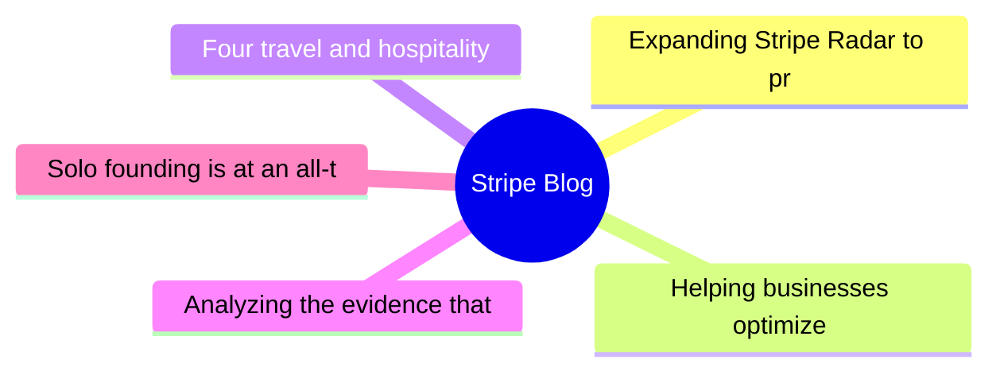
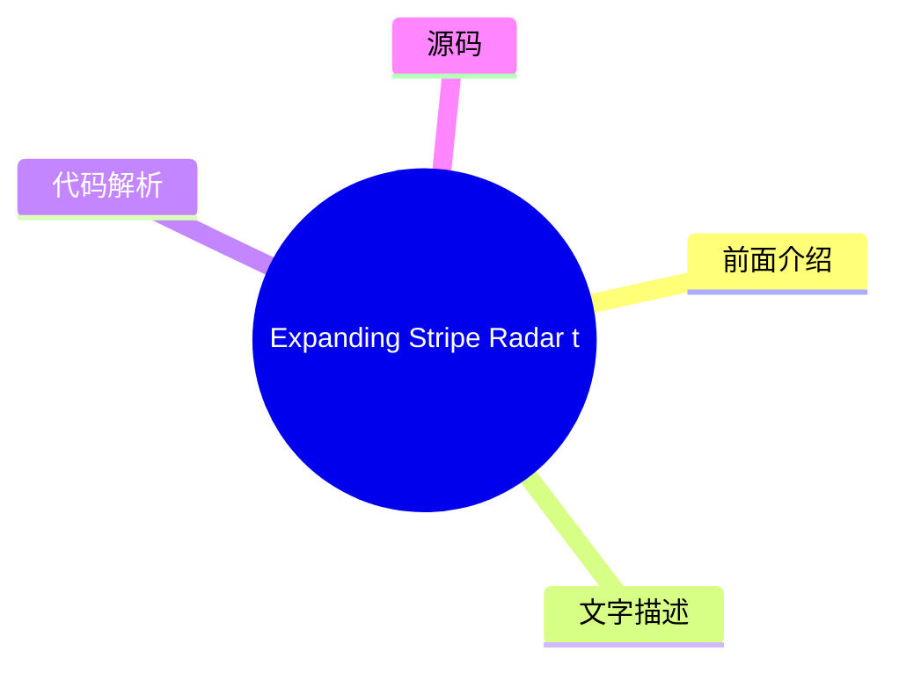
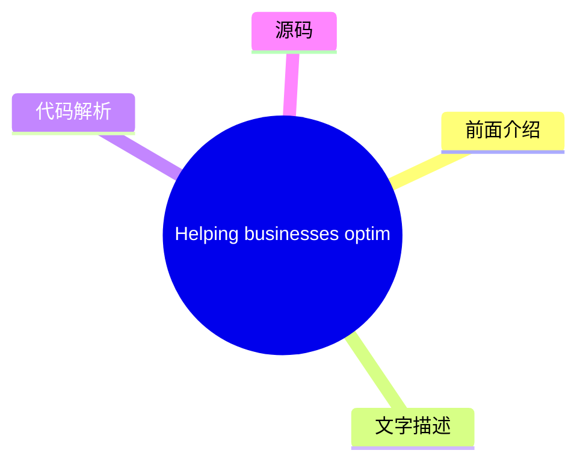
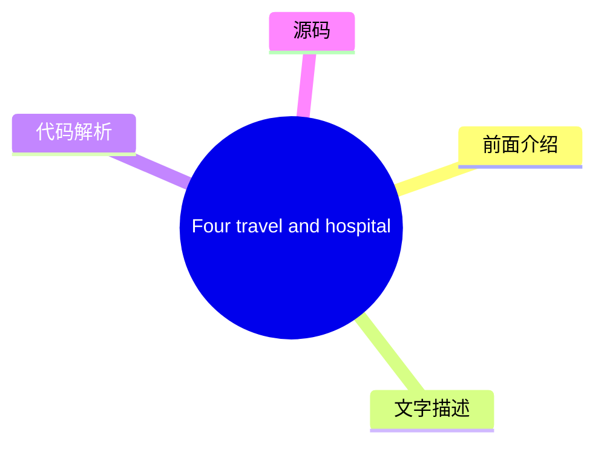
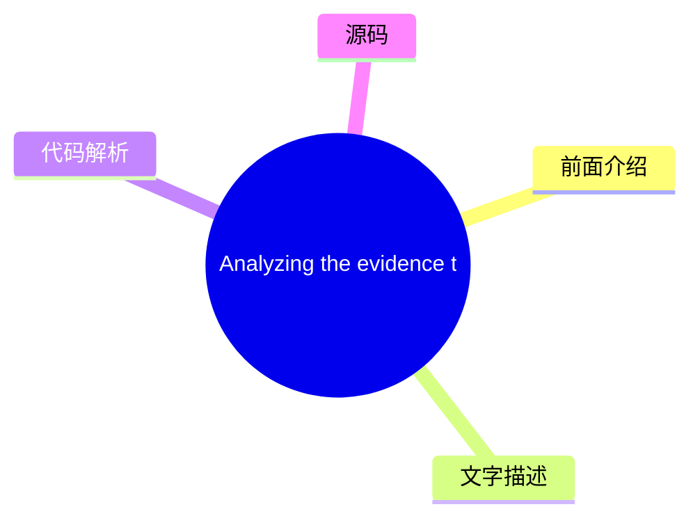
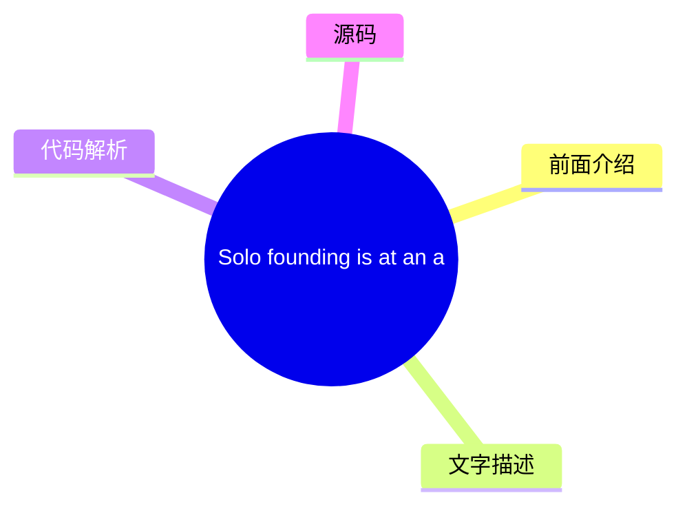

# 💳 Stripe Blog Top 5 (2026-07-31)

## 前面介绍

- 数据源：Stripe Blog
- 抓取日期：2026-07-31
- 条目数：5
- 含完整正文：5
- 含代码片段：0
- 组织方式：前面介绍 / 树状图 / 文字描述 / 代码解析 / 源码

## 思维导图

## 详细整理（5 条，5 条含全文，0 条含代码）

### 1. Expanding Stripe Radar to protect more of your business
- **链接**: [https://stripe.com/blog/expanding-stripe-radar-to-protect-more-of-your-business](https://stripe.com/blog/expanding-stripe-radar-to-protect-more-of-your-business)
- **发布**: Wed, 27 May 2026 00:00:00 +0000

#### 前面介绍

- Radar now blocks high-risk transactions across all supported payment methods; defends against new fraud types like multi-account abuse and pay-as-you-go abuse, regardless of which payment processor you use; and gives platforms new tools to evaluate a
- 发布时间：Wed, 27 May 2026 00:00:00 +0000

#### 树状图

#### 文字描述

- Last month at Stripe Sessions, we shared the biggest expansion we’ve ever made to [Stripe Radar](https://stripe.com/radar), our AI-powered fraud prevention tool. Radar now blocks high-risk transactions across all supported payment methods; defends against new fraud types like multi-account abuse and pay-as-you-go abuse, regardless of which payment processor you use; and gives p
- ## Protect more transactions with global payment coverage, new multiprocessor signals, and custom models Fraud protection is getting more complex. Businesses need to defend across a range of payment methods, and they need more precision in the signals they use to catch fraud before it happens—on and off Stripe. Radar now addresses both, along with the ability to use custom frau
- ## Defend against new types of fraud Fraudulent actors have become as sophisticated at stealing compute as they are at stealing money. They abuse policies by cycling through free trials, setting up multiple accounts, or intentionally not paying their next invoice. As businesses scale AI products, token abuse has become an expensive fraud vector. Last month, we shared how Radar 
- ## Protect your platform from account fraud Fraudulent actors are using generative AI to create fake identities, documents, and websites convincing enough to bypass many platforms’ verification systems. Platforms face a trade-off: request additional information during onboarding and increase friction, or keep the onboarding flow lightweight and take on potentially significant r

#### 代码解析

- 本文未检测到明确代码块，内容更偏新闻、观点或方法论。

#### 源码

#### 中文节选

Last month at Stripe Sessions, we shared the biggest expansion we’ve ever made to [Stripe Radar](https://stripe.com/radar), our AI-powered fraud prevention tool. Radar now blocks high-risk transactions across all supported payment methods; defends against new fraud types like multi-account abuse and pay-as-you-go abuse, regardless of which payment processor you use; and gives platforms new tools to evaluate and mitigate merchant risk on and off Stripe. We also launched additional ways to fight disputes with smarter evidence and automated evidence libraries.

Here’s a closer look at what we announced.

## Protect more transactions with global payment coverage, new multiprocessor signals, and custom models

Fraud protection is getting more complex. Businesses need to defend across a range of payment methods, and they need more precision in the signals they use to catch fraud before it happens—on and off Stripe. Radar now addresses both, along with the ability to use custom fraud models.

**Block high-risk transactions across all supported global payment methods
**

Radar now protects [all supported payment volume globally](https://docs.stripe.com/radar/local-payment-methods), including bank debits, buy now, pay later (BNPL) options, crypto, digital wallets, real-time payments, and cash vouchers. When Radar detects a fraudulent pattern on a transaction, that information becomes available to protect transactions across all payment methods. For example, if a fraudulent actor uses a stolen credit card at one business on Stripe, and we detect and block it, that same IP address and device fingerprint are now flagged across bank debits, wallets, and BNPL transactions network-wide. We found that Radar reduced suspected fraud by 71% during a five-month period for businesses using Affirm, Cash App, Klarna, and PayPal. 

**Improve your fraud decisioning with new multiprocessor signals
**

Businesses use Radar’s risk signals for off-Stripe transactions to complement their in-house fraud models and make more precise fraud decisions across payment processors. Now, you can further improve your fraud decisioning with additional signals for off-Stripe transactions to help you prevent fraud before it happens.

Stripe can now identify whether a payment is [likely to trigger an early fraud warning](https://docs.stripe.com/radar/multiprocessor#early-fraud-warning) from the card network. You can then choose to proactively refund the transaction and protect your dispute rate. 

Stripe can also predict whether a payment is [likely to result in a fraudulent dispute](https://docs.stripe.com/radar/multiprocessor#fraudulent-dispute). You can use this signal to issue refunds, gather evidence, or adjust your dispute strategy. 

We plan to add new signals that can be used across your entire payments stack.

**Access enterprise-grade custom fraud models
**

For businesses with more complex risk profiles, Radar now offers [custom fraud models](https://docs.stripe.com/radar/custom-

#### 完整正文（中文）

上个月在 Stripe Sessions 上，我们分享了针对 [Stripe Radar](https://stripe.com/radar)（我们的人工智能驱动的欺诈防护工具）所做出的迄今为止最大的扩展。Radar 现在可以阻止所有支持的支付方式下的高风险交易；无论您使用哪个支付处理器，都能防御多账户滥用和先买后付滥用等新型欺诈；并为平台提供了新的工具，用于评估和缓解 Stripe 内外商户的风险。我们还推出了更多方式，利用更智能的证据和自动证据库来应对争议。

以下是我们要宣布内容的详细情况。

## 利用全球支付覆盖范围、新的多处理器信号和自定义模型保护更多交易

欺诈防护正变得越来越复杂。企业需要在多种支付方式下进行防御，并且需要在交易发生前（无论是在 Stripe 上还是 Stripe 外）使用更精确的信号来识别欺诈。Radar 现在解决了这两个问题，并增加了使用自定义欺诈模型的能力。

**阻止所有支持的全球支付方式下的高风险交易**

Radar 现在保护[全球所有支持的交易量](https://docs.stripe.com/radar/local-payment-methods)，包括银行借记、先买后付 (BNPL) 选项、加密货币、数字钱包、实时支付和现金代金券。当 Radar 检测到交易中的欺诈模式时，该信息将可用于保护所有支付方式下的交易。例如，如果欺诈行为者在 Stripe 上的某家企业使用被盗信用卡，而我们检测并阻止了该行为，那么该相同的 IP 地址和设备指纹现在会在银行借记、钱包和 BNPL 交易网络范围内被标记。我们发现，对于使用 Affirm、Cash App、Klarna 和 PayPal 的企业，Radar 在五个月内将可疑欺诈减少了 71%。

**利用新的多处理器信号改进您的欺诈决策**

企业使用 Radar 的风险信号来处理 Stripe 以外的交易，以补充其内部欺诈模型，并在各个支付处理商处做出更精准的欺诈决策。现在，您可以通过为 Stripe 以外的交易添加更多信号来进一步改进欺诈决策，从而帮助您在欺诈发生前加以防范。

Stripe 现在可以识别付款是否可能触发卡组织的[早期欺诈警告](https://docs.stripe.com/radar/multiprocessor#early-fraud-warning)。然后，您可以选择主动退款交易，以保护您的拒付率。

Stripe 还可以预测付款是否可能导致[欺诈性拒付](https://docs.stripe.com/radar/multiprocessor#fraudulent-dispute)。您可以使用此信号来发起退款、收集证据或调整您的拒付策略。

我们计划添加可在您的整个支付体系中使用的新信号。

**访问企业级自定义欺诈模型**

对于风险概况更复杂的企业，Radar 现在提供[自定义欺诈模型](https://docs.stripe.com/radar/custom-fraud-models)。您可以将业务独有的信号传递给 Stripe，例如产品目录数据、忠诚度状态、行为指标或与您的风险概况相关的任何结构化元数据。Stripe 然后将此信息与我们的全球网络数据结合，部署专门针对您的业务定制的模型。对于早期采用者，自定义模型在误报率没有增加的情况下，能检测出至少 15% 的更多欺诈。

## 防范新型欺诈

欺诈行为者在窃取资金方面的手段与窃取计算资源一样老练。他们通过循环使用免费试用、开设多个账户或故意不支付下一张账单来滥用政策。随着企业扩展 AI 产品，令牌滥用已成为一种昂贵的欺诈手段。

上个月，我们分享了 Radar 如何通过[免费试用滥用防护](https://stripe.com/blog/how-stripe-radar-helps-prevent-free-trial-abuse)来应对其中一种欺诈手段。在 Sessions 上，我们强调了保护您的业务免受多账户滥用、按量付费欺诈和欺诈机器人驱动付款侵害的新方法。

**阻止多账户滥用**

多账户滥用是指单个欺诈行为者创建多个账户，以重复使用促销优惠券，或将被盗卡交易分散到多个账户中，从而延长逃避检测的时间。在整个 Stripe 网络中，AI 公司的注册用户中有超过六分之一与多账户滥用有关。

现在，Radar 可以[实时评估每个新账户](https://docs.stripe.com/radar/multi-account-and-account-sharing-abuse#multi-account-abuse)，以便您在滥用行为发生之前（无论是在 Stripe 内部还是外部）阻止可疑账户。我们的解决方案利用了整个 Stripe 网络中过往滥用的信息，包括设备指纹、IP 地址、电子邮件域名等。在过去的两个月里，ElevenLabs 每天成功阻止了 2,000 名用户滥用其免费层级。

**预测按量付费滥用**

按量付费滥用是指客户通过累积使用量来滥用您的服务，且在账单到期时没有付款的意图。这些不良行为者利用了基于消费的定价结构，即费用在计费周期内累积，但付款发生在之后。例如，客户可能在一个月内消耗数千美元的计算资源，在月底被计费，然后永远不予支付。

Radar 现在可以帮助[在用量累积时预测非支付滥用](https://docs.stripe.com/radar/pay-as-you-go-abuse)，让您能够在向客户计费之前进行干预。这使您能够要求充值、切断服务，或采取任何符合您风险承受能力的措施。

**检测并防止欺诈机器人驱动的支付**

随着代理商务的扩展，区分代表客户行事的合法代理和恶意机器人变得越来越重要。两者都是进行购买的非人类流量，但一个是客户授权的代理，另一个可能会利用您的结账系统购买库存有限的商品、滥用促销定价或绕过购买限制。

Radar now assigns a bot score to payments made on Stripe Checkout, evaluating the likelihood that [they were made by a malicious bot](https://docs.stripe.com/radar/bot-abuse). You can use this score to enforce anti-scripting or anti-bot policies. For example, you could block automated purchases of limited-edition items or flag high-velocity orders for review.

## Protect your platform from account fraud

Fraudulent actors are using generative AI to create fake identities, documents, and websites convincing enough to bypass many platforms’ verification systems. Platforms face a trade-off: request additional information during onboarding and increase friction, or keep the onboarding flow lightweight and take on potentially significant risk.

[Platforms can now mitigate risk](https://docs.stripe.com/radar/radar-for-platforms) across their business with Radar, featuring 0-to-100 fraud scores for every business and transaction; AI-powered insights that explain why accounts are flagged; note taking and account history to help your team understand account context; and account-level metrics for disputes, declines, refunds, and payments. 

We also introduced three new ways platforms can monitor and evaluate merchant risk—on and off Stripe.

- The [fraudulent website](https://docs.stripe.com/radar/fraudulent-website)signal analyzes a business’s website the way a human fraud analyst would, looking for red flags like luxury items sold at unrealistically low prices, AI-generated copy, misspelled brand URLs, or other indicators that suggest the site is fraudulent. Platforms can use this signal during onboarding to automate verifications, flag accounts for manual review, or as an input to their own risk scoring before approving a business.
- The [fraudulent merchant](https://docs.stripe.com/radar/fraudulent-merchant)signal identifies whether a new or existing account poses a fraud risk, based on analyzing patterns across the Stripe network, including bank account information, business details, transaction activity, and disputes. Platforms can then raise a review, pause payouts, pause payments, reject the account, set reserves, or request identity verification.

- [商户逾期风险](https://docs.stripe.com/radar/merchant-delinquency-risk)信号预测企业是否面临累积负余额的风险；具体而言，它预测该余额是否可能持续为负 60 天或更长时间。平台可利用此信号来决定是否主动调整结算时间表，对高风险账户要求预留金，或在损失累积之前将商户标记为需要更密切审查的对象。

## 利用更智能的证据和自动化证据库更有效地应对争议

[智能争议](https://docs.stripe.com/disputes/smart-disputes)是我们基于 AI 的争议管理产品，一直以来都会代表您整理并提交证据。现在，智能争议可以制定更定制化的策略，以提高您赢得每起争议的几率。

智能争议会分析每起争议，并针对特定证据字段（如追踪号码或客户使用日志）提供 [AI 驱动的建议](https://docs.stripe.com/disputes/set-up-smart-disputes#provide-more-data-at-dispute-time)。通过智能争议添加我们 AI 推荐证据的企业，其胜诉频率比未添加任何证据的企业高出 3 倍。

我们还在减少提交证据所需的人工操作。许多争议需要相同的支持材料：条款和条件、退货政策和服务协议。借助证据库，您只需上传并存储这些文档一次，智能争议便会根据争议原因代码、网络要求和持卡人主张，自动选择并将它们包含在您的证据包中——无需手动重新提交。

## 接下来是什么

在 Sessions 上，我们还发布了 [我们的公开路线图](https://stripe.com/roadmap)：一份包含数百个详细条目的清单，涵盖 2027 年第一季度，其中包括 [Radar 中的产品、功能和改进](https://stripe.com/roadmap?product=Radar)。

想了解更多 Radar 如何保护您的业务，请加入我们在全球主要城市举办的 [Stripe Tour 2026](https://stripetour.com/)。您也可以 [阅读我们的文档](https://docs.stripe.com/radar) 或 [联系我们的专家团队](https://stripe.com/contact/sales)。

### 2. Helping businesses optimize network costs with the Visa Digital Commerce Authentication Program (DCAP)
- **链接**: [https://stripe.com/blog/helping-businesses-optimize-network-costs-with-visa-digital-commerce-authentication-program](https://stripe.com/blog/helping-businesses-optimize-network-costs-with-visa-digital-commerce-authentication-program)
- **发布**: Wed, 03 Jun 2026 00:00:00 +0000

#### 前面介绍

- We moved quickly to help Stripe businesses take advantage of DCAP and capture interchange savings while protecting authorization rates. Here’s what we did.
- 发布时间：Wed, 03 Jun 2026 00:00:00 +0000

#### 树状图

#### 文字描述

- Visa recently launched the [Digital Commerce Authentication Program (DCAP)](https://support.stripe.com/questions/understand-the-visa-digital-commerce-authentication-program-%28dcap%29-on-stripe), a new global framework designed to reduce fraud and increase authorization rates for card-not-present transactions. The program rewards businesses in the US for sharing richer transact
- ### Optimizing DCAP savings without sacrificing conversion Before rolling out DCAP, we worked with Visa to run readiness testing and identify the right implementation approach. This collaborative testing underscored the need for transaction-level intelligence. With [Stripe Authorization Boost](https://stripe.com/authorization-boost), we intelligently select which transactions s
- ## Automatically benefit from DCAP optimizations If you use Authorization Boost and are collecting the required data points, you’re already automatically benefiting from DCAP optimizations. For businesses using [standalone 3DS](https://docs.stripe.com/payments/3d-secure/standalone-3d-secure), you can participate by setting **flow_preference[type]** to `data_share` on authentica

#### 代码解析

- 本文未检测到明确代码块，内容更偏新闻、观点或方法论。

#### 源码

#### 中文节选

Visa 最近推出了 [数字商务认证计划 (DCAP)](https://support.stripe.com/questions/understand-the-visa-digital-commerce-authentication-program-%28dcap%29-on-stripe)，这是一个旨在减少欺诈并提高非接触式交易授权率的新全球框架。该计划奖励美国企业，要求其在认证期间与发卡行共享更丰富的交易数据，例如设备 ID、账单地址、IP 地址和客户电子邮件。符合条件的交易可获得 5 个基点的净交换费减免。

新的网络计划创造了机会，但也引入了复杂性。企业需要了解哪些交易符合资格，确保其集成传递了所需数据，并确定参与是否有助于改善其端到端交易经济状况，或是否会产生意外后果，例如损害授权率。

要参与 DCAP，企业需要在结账流程中通过无摩擦认证与发卡行共享所需的持卡人数据。这可能会引入延迟，并导致发卡行对这些较新的信号产生不同的解读。

我们迅速采取行动，帮助 Stripe 企业利用 DCAP 并在保护授权率的同时捕获交换费节省。以下是我们所做的工作。

### 在不牺牲转化率的情况下优化 DCAP 节省

在推出 DCAP 之前，我们与 Visa 合作进行了就绪性测试，并确定了正确的实施方法。这种协作测试强调了交易级智能的必要性。

使用 [Stripe 授权提升](https://stripe.com/authorization-boost)，我们会智能选择哪些交易应通过 [仅数据 3DS](https://docs.stripe.com/payments/3d-secure/strong-customer-authentication-exemptions#data-only)，该流程会从卡组织向发卡行发送额外的风险数据以进行授权。我们不会应用静态规则，而是会在交易级别评估成本节约、转化影响和欺诈风险，以确定何时应用仅数据 3DS。这使企业能够在限制对客户体验的影响并优化授权率的同时，捕获 DCAP 节省。

自 4 月 18 日以来，我们已帮助 Stripe 企业从 DCAP 中获得了 1840 万美元的年度化网络成本节约。通过帮助企业收集和传递所需数据，我们观察到符合 DCAP 条件的交易数量增加了 8 倍。我们正在继续与 Visa 合作优化资格条件，以便更多交易能够受益于 DCAP。

## 自动受益于 DCAP 优化

如果您使用授权提升并正在收集所需的数据点，您已经自动受益于 DCAP 优化。对于使用 [独立 3DS](https://docs.stripe.com/payments/3d-secure/standalone-3d-secure) 的企业，您可以通过在身份验证请求上将 **flow_preference[type]** 设置为 `data_share` 并确保要求来参与。

#### 完整正文（中文）

Visa 最近推出了 [数字商务认证计划 (DCAP)](https://support.stripe.com/questions/understand-the-visa-digital-commerce-authentication-program-%28dcap%29-on-stripe)，这是一个旨在减少欺诈并提高非接触式交易授权率的新全球框架。该计划奖励美国企业，要求其在认证期间与发卡行共享更丰富的交易数据，例如设备 ID、账单地址、IP 地址和客户电子邮件。符合条件的交易可获得 5 个基点的净交换费减免。

新的网络计划创造了机会，但也引入了复杂性。企业需要了解哪些交易符合资格，确保其集成传递了所需数据，并确定参与是否有助于改善其端到端交易经济状况，或是否会产生意外后果，例如损害授权率。

要参与 DCAP，企业需要在结账流程中通过无摩擦认证与发卡行共享所需的持卡人数据。这可能会引入延迟，并导致发卡行对这些较新的信号产生不同的解读。

我们迅速采取行动，帮助 Stripe 企业利用 DCAP 并在保护授权率的同时捕获交换费节省。以下是我们所做的工作。

### 在不牺牲转化率的情况下优化 DCAP 节省

在推出 DCAP 之前，我们与 Visa 合作进行了就绪性测试，并确定了正确的实施方法。这种协作测试强调了交易级智能的必要性。

With [Stripe Authorization Boost](https://stripe.com/authorization-boost), we intelligently select which transactions should go through [Data Only 3DS](https://docs.stripe.com/payments/3d-secure/strong-customer-authentication-exemptions#data-only), which sends additional risk data from the card network to the issuer for authorization. Rather than applying static rules, Authorization Boost evaluates cost savings, conversion impact, and fraud risk at the individual transaction level to determine when to apply Data Only 3DS. This allows businesses to capture DCAP savings while limiting the impact to the customer experience and optimizing authorization rates.

Since April 18, we’ve helped Stripe businesses capture $18.4 million in annualized network cost savings from DCAP. By helping businesses collect and pass the required data, we saw an 8x increase in the number of DCAP-eligible transactions. We’re continuing to work with Visa to optimize eligibility, so more transactions can benefit from DCAP.

## Automatically benefit from DCAP optimizations

If you use Authorization Boost and are collecting the required data points, you’re already automatically benefiting from DCAP optimizations. For businesses using [standalone 3DS](https://docs.stripe.com/payments/3d-secure/standalone-3d-secure), you can participate by setting **flow_preference[type]** to `data_share` on authentication requests and ensuring required fields are populated.

Learn more about how [Authorization Boost](https://docs.stripe.com/payments/analytics/optimization) can help optimize your payments performance.

### 3. Four travel and hospitality trends from HITEC 2026
- **链接**: [https://stripe.com/blog/trends-from-hitec](https://stripe.com/blog/trends-from-hitec)
- **发布**: Tue, 23 Jun 2026 00:00:00 +0000

#### 前面介绍

- More than 6,000 hospitality executives and operators gathered in San Antonio last week for the HITEC conference. The big topic: whether the industry’s AI investment is actually working. Across four days and over 50 meetings, four trends stood out.
- 发布时间：Tue, 23 Jun 2026 00:00:00 +0000

#### 树状图

#### 文字描述

- More than 6,000 hospitality executives and operators gathered in San Antonio last week for the annual HITEC hospitality technology conference, including leaders from Wyndham Hotels & Resorts, Hyatt, IHG Hotels & Resorts, Starwood Hotels, and hundreds of independent properties. The big topic: whether the industry’s AI investment is actually working. IDC forecasts that [30%](http
- ## The race for direct bookings has moved from search rankings to AI answers For years, the hospitality industry’s answer to online travel agency (OTA) dependency was SEO: invest in content, improve search rankings, and convert guests before they end up on Expedia or Booking.com. That approach is becoming less effective. Jack Wang, principal solution engineer at Salesforce, off
- ## Most hospitality AI is falling short in a predictable way An uncomfortable truth surfaced repeatedly throughout HITEC: much of the AI scaling happening across hospitality is fragile. The majority of businesses are adopting AI without the strategic clarity, data foundation, and operational architecture to sustain it. The root cause is often fragmented data. Siloed property ma
- ## Payments friction has a measurable cost, but most hotels still don’t know what it is The hospitality industry has historically treated payments as a cost and commodity: something to keep running, minimize fees on, and keep out of the way. Many of the payments-specific conversations we had at HITEC revolved around how that approach is changing, along with a growing recognitio

#### 代码解析

- 本文未检测到明确代码块，内容更偏新闻、观点或方法论。

#### 源码

#### 中文节选

超过 6,000 名酒店高管和经营者上周齐聚圣安东尼奥，参加年度 HITEC 酒店技术会议，其中包括万豪酒店及度假村、凯悦、洲际酒店集团、喜达屋酒店以及数百家独立物业的领导者。

核心议题：行业的人工智能投资是否真的奏效。IDC 预测，到 2030 年，30% 的所有旅行预订将由人工智能代理完成。但行业的发展方向与当前具备的支持能力之间存在巨大差距。

根据 BCG 的数据，25% 的酒店企业报告称目前正在积极扩展人工智能，但不到 10% 的企业被认为是“AI 未来构建型”——这意味着它们在核心运营中植入了人工智能，拥有支持性的数据基础，并且有可衡量的回报。佛罗里达国际大学酒店技术副教授 Dale Gomez 表示：“许多公司只是在盲目尝试，看能不能行得通。”“他们想要看到投资回报率。”

其他变革正在推进中。许多酒店企业仍然缺乏现代金融基础设施，无法充分受益于人工智能预计带来的自动化、速度和互操作性。曾经被认为“足够好”的支付系统现在正在造成可衡量的收入损失，而不断上升的客人期望已将低效的技术从一个小麻烦变成了不再光顾的理由。

在四天的时间里，举行了 50 多次会议，以下四个趋势尤为突出。

## 直接预订的竞争已从搜索排名转向 AI 回答

多年来，酒店行业应对在线旅行社（OTA）依赖症的方案是 SEO：投资内容，提高搜索排名，并在客人最终出现在 Expedia 或 Booking.com 之前将其转化。这种方法正变得越来越无效。

Jack Wang, Salesforce 的首席解决方案工程师，提供了一组突显这一转变的数据：现在，65% 触发 AI 概览的 Google 搜索最终都没有用户点击任何网站。在移动端，这一数字上升至 78%。随着 AI 生成的摘要取代了 SEO 旨在赢得的排名链接列表，传统搜索流量在整个行业下降了约 25%。

被 AI 生成的答案收录需要与 SEO 奖励的内容不同。SEO 响应关键词密度、反向链接和页面权威性。AI 收录响应的是结构化属性数据的准确性和机器可读性，如房型、设施详情、政策、本地背景或取消条款。一家酒店可能在传统搜索中排名很高，但对 LLM 来说却是不可见的：超过 [90%](https://www.nokumo.net/en/ai-visibility-in-hospitality-what-3-600-ai-responses-and-1-337-website-audits-reveal?utm_campaign=ennismore-proves-tech-investment-pays-off-and-94-of-hotels-are-invisible-to-ai) 的住宿

#### 完整正文（中文）

超过 6,000 名酒店高管和经营者上周齐聚圣安东尼奥，参加年度 HITEC 酒店技术会议，其中包括万豪酒店及度假村、凯悦、洲际酒店集团、喜达屋酒店以及数百家独立物业的领导者。

核心议题：行业的人工智能投资是否真的奏效。IDC 预测，到 2030 年，30% 的所有旅行预订将由人工智能代理完成。但行业的发展方向与当前具备的支持能力之间存在巨大差距。

根据 BCG 的数据，25% 的酒店企业报告称目前正在积极扩展人工智能，但不到 10% 的企业被认为是“AI 未来构建型”——这意味着它们在核心运营中植入了人工智能，拥有支持性的数据基础，并且有可衡量的回报。佛罗里达国际大学酒店技术副教授 Dale Gomez 表示：“许多公司只是在盲目尝试，看能不能行得通。”“他们想要看到投资回报率。”

其他变革正在推进中。许多酒店企业仍然缺乏现代金融基础设施，无法充分受益于人工智能预计带来的自动化、速度和互操作性。曾经被认为“足够好”的支付系统现在正在造成可衡量的收入损失，而不断上升的客人期望已将低效的技术从一个小麻烦变成了不再光顾的理由。

在四天的时间里，举行了 50 多次会议，以下四个趋势尤为突出。

## 直接预订的竞争已从搜索排名转向 AI 回答

多年来，酒店行业应对在线旅行社（OTA）依赖症的方案是 SEO：投资内容，提高搜索排名，并在客人最终出现在 Expedia 或 Booking.com 之前将其转化。这种方法正变得越来越无效。

Jack Wang, principal solution engineer at Salesforce, offered data that spotlights a shift: 65% of Google searches that trigger an AI Overview now end without the user clicking any website. On mobile, that number climbs to 78%. Traditional search traffic is declining roughly 25% across the industry, as AI-generated summaries replace the ranked link lists that SEO was designed to win.

Inclusion in an AI-generated answer requires something different from what SEO rewards. SEO responds to keyword density, backlinks, and page authority. AI inclusion responds to the accuracy and machine-readability of structured property data, like room types, amenity details, policies, local context, or cancellation terms. A hotel can rank well in traditional search and be invisible to an LLM: over [90%](https://www.nokumo.net/en/ai-visibility-in-hospitality-what-3-600-ai-responses-and-1-337-website-audits-reveal?utm_campaign=ennismore-proves-tech-investment-pays-off-and-94-of-hotels-are-invisible-to-ai) of accommodation sites are still undetected by AI models.

We’re already seeing a downstream effect. According to Phocuswright research, [56%](https://www.phocuswire.com/news/online/shift-travel-behavior-ai-surge-phocuswright-research) of travelers have used AI for trip planning, booking, or in-destination assistance in the past 12 months. For operators, the first step is an audit, not an investment. Can the LLMs your prospective guests are using accurately describe your property’s room categories, amenities, policies, and local context? If the answer is no, that gap is likely costing you bookings.

Today, hotel chains have access to the same checkout and payment tools as OTAs, including local payment methods and currencies, one-click checkout, and global fraud protection. The travel brands capturing agentic demand are combining AI-driven discoverability with accurate real-time inventory and a modern checkout experience that converts demand efficiently.

## Most hospitality AI is falling short in a predictable way

HITEC 期间反复出现一个令人不安的事实：酒店业正在发生的许多 AI 扩展都是脆弱的。大多数企业都在采用 AI，但缺乏维持其发展的战略清晰度、数据基础和运营架构。

根本原因通常是数据碎片化。孤立的物业管理系统、CRM、忠诚度、餐饮和支付系统各自只持有关于同一客人的部分视图——而 AI 推荐的准确性仅取决于它们所使用的内容。在 AI 个性化中出现的相同数据问题，在财务上表现为过长的对账时间，在运营上表现为不完整的客人档案，在客人体验上则表现为摩擦。

Salesforce 首席解决方案工程师 Amanda Sharp 将问题重新定义为 AI 运营化而非采用，并呼吁“氛围运营”：这是酒店业对“氛围编码”的回应。如今，许多酒店品牌构建 AI 功能已成为可能。但在生产环境中可靠地运行它们，并将其集成到触发实际操作的现有工作流程中，则要困难得多。

在这方面做得好的企业拥有干净、连接的数据，能够在采取行动的时机内将有用的情报直接交付到工作流程中。例如，达美航空在其移动应用中内置了实时 AI 礼宾，利用 SkyMiles 档案和运营数据，作为客户关怀体验的一部分提供情境感知支持。在 Wynn 拉斯维加斯，当业绩低于目标时，收益经理会收到预测性警报以及附带的建议行动。

对于大多数旅游运营商来说，瓶颈在于数据连接性，而非模型质量。

## 支付摩擦具有可衡量的成本，但大多数酒店仍不知道其具体数额

酒店业历来将支付视为成本和商品：一种需要维持运转、最小化费用并尽量不碍事的东西。我们在 HITEC 会议上进行的许多支付相关讨论，都围绕着这种做法如何改变，以及人们日益认识到支付已成为酒店品牌竞争的关键因素展开。我们的数据也支持这一观点：在 Stripe 委托的一项针对近 400 名酒店高管进行的调查中，90% 的人表示支付对增长很重要，37% 的人表示缺乏支付选项对客人体验产生最大的负面影响。此外，58% 的人表示他们的欺诈系统阻断了合法交易，74% 的人报告称，碎片化的系统导致团队花费过多时间进行对账。

这些数据凸显了支付为何已成为一种结构性优势。OTA 能够负担得起大规模的支付人员配置，因为它们的收入证明了人员编制的合理性。独立酒店和较小的运营商无法直接匹配这种投资，但在正确的基础设施支持下，一个精简的团队现在可以以远低于大型内部运营的成本，支持数十个国家的支付方式。

覆盖缺口直接导致预订流失。“一旦我们不支持 [某种支付方式]，客人就会去其他平台或渠道，那里支持他们偏好的支付方式，”Cloudbeds 战略合作伙伴副总裁 Sebastien Leitner 说。客人在其偏好的支付方式适用的地方预订。一家不支持目标市场主流支付方式的酒店，不仅是在制造摩擦——它实际上是将预订引导给了支持该方式的 OTA。

## 最好的酒店技术是那种不起眼的技术

“对于那些无法正常运行的科技，人们毫无同情心，”Oracle Hospitality全球战略与产品管理副总裁Tanya Pratt说道。“如果它无法工作，造成的挫败感将比前台排长队更严重，因为人们已经习惯了排队。”当科技失效时，客人并不总是会投诉。他们只是不再回来。

成功的真正衡量标准是，科技运作得足够好，以至于客人根本不会去想它。万豪酒店的首席信息官Denise Walker描述了这一愿景：一位回头客入住时，房间温度适宜，电视上播放着他们偏好的频道，床上的枕头也符合他们喜欢的硬度。没有人会说明他们是如何知道的。“它不需要以一种‘你怎么知道这些？’的方式呈现。”

拉斯维加斯永利度假村的酒店运营副总裁Shannon McCallum走得更远。“我们正从‘我告诉了你这些，所以你知道关于我的事’转变为‘我什么都没告诉你，而现在你在预测它’。”

这两种隐形的个性化以及它所支持的人性化时刻，都需要一个连接数据的基础——即能够整合现有技术栈、将客人信息整合到单一系统中的科技。这种基础设施使企业能够在客人浏览网站或站在前台时识别出同一位客人。

## Stripe 如何提供帮助

越来越多的客人将通过AI助手而非搜索引擎找到您的物业。他们预订的行程可能由代理完成。而区分高绩效运营商的营收将来自于能够转化的支付体验、覆盖每个市场的支付方式以及协同运作的财务系统。Stripe 数据管道将支付数据与您的预订和客户系统连接起来，为运营商提供营收的统一视图，而无需拼接式的报告。

Stripe 的支付基础设施帮助酒店运营商保护营收、提升客人在店内的消费，并简化运营。

**推动直接预订。** 在客人实际使用的各种支付方式以及您服务的每个市场中，能够促进转化的支付体验有助于将预订保留在您的直接渠道上。随着代理商业务的扩展，这意味着默认在每笔 Stripe 交易上运行的欺诈检测，以及允许代理在不暴露客人凭证的情况下进行交易的支付令牌。

**增加行程消费。** 来自餐饮、体验和合作伙伴的辅助收入需要能够在整个物业范围内运作的支付基础设施，支持新的商业模式，并与外部合作伙伴连接。Stripe Billing 处理会员和忠诚度计划背后的定期支付逻辑，包括自动续费、分级定价和失败付款恢复——无需运营商自行维护该基础设施。例如，[Cloudbeds](https://stripe.com/customers/cloudbeds) 发现，使用 Cloudbeds Payments 的企业收入增长了 15%，而通过其 Stripe 合作伙伴关系直接消除支付摩擦、扩展支付方式的企业，平均收入增加了 14.8%。

**降低成本。** 更高效的 B2B 资金流动和欺诈保护减少了对账工作并限制了损失，从而在不增加人员的情况下释放利润空间。

[了解更多](https://stripe.com/industries/travel) 关于 Stripe 如何支持酒店业务，或 [联系我们](https://stripe.com/contact/sales)。

### 4. Analyzing the evidence that helps businesses win “product not received” disputes
- **链接**: [https://stripe.com/blog/analyzing-the-evidence-that-helps-businesses-win-product-not-received-disputes](https://stripe.com/blog/analyzing-the-evidence-that-helps-businesses-win-product-not-received-disputes)
- **发布**: Tue, 21 Jul 2026 00:00:00 +0000

#### 前面介绍

- To understand what can influence win rates, we analyzed evidence packets from one million disputes over a 16-week period. Here’s what the data shows and what it means for how you mitigate disputes.
- 发布时间：Tue, 21 Jul 2026 00:00:00 +0000

#### 树状图

#### 文字描述

- “[Product not received](https://docs.stripe.com/disputes/categories)” disputes—where a cardholder claims they didn’t receive what they paid for—are the most common nonfraud dispute category on Stripe. It can be challenging to know which claims are legitimate and which are not: some customers genuinely never received what they paid for, while others incorrectly claim they didn’t
- ## Businesses that submitted evidence after the delivery was confirmed saw a 27 percentage point higher win rate Many businesses submit a shipping tracking ID as proof of delivery. However, depending on the status of the package at the time you submit the evidence, the tracking number might only confirm that the package left your facility. Our analysis found that win rates incr
- ## Businesses that submitted digital activity and usage logs saw a 10 percentage point higher win rate Businesses selling digital goods also need to provide proof of fulfillment, though the supporting evidence looks different. Disputes with digital activity and usage logs—such as JSON telemetry logs from common analytics platforms showing that a user streamed, downloaded, or ac
- ## Businesses that included evidence of a refund issued through Stripe saw a 63 percentage point higher win rate Cardholders can still initiate [a dispute even after a refund has been processed](https://support.stripe.com/questions/disputes-on-a-refunded-transaction-faq), often because the refund and dispute were filed around the same time or because the issuing bank didn’t che

#### 代码解析

- 本文未检测到明确代码块，内容更偏新闻、观点或方法论。

#### 源码

#### 中文节选

“[Product not received](https://docs.stripe.com/disputes/categories)” disputes—where a cardholder claims they didn’t receive what they paid for—are the most common nonfraud dispute category on Stripe. It can be challenging to know which claims are legitimate and which are not: some customers genuinely never received what they paid for, while others incorrectly claim they didn’t receive the order. 

To understand what can influence win rates, we analyzed evidence packets from one million disputes over a 16-week period. We compared win rates for packets that included various types of evidence—such as delivery confirmation or content consumption logs—against those that didn’t, isolating which features correlated with higher win rates.

Here’s what the data shows for businesses broadly, what’s different for businesses selling digital goods, and what it means for how you mitigate disputes.

**Businesses that submitted delivery information saw a 44 percentage point higher win rate**

For businesses selling physical goods, disputes with delivery confirmation as evidence had a 27 percentage point higher win rate than disputes without it. Adding a GPS delivery map as evidence, which shows where the carrier scanned the package, lifted win rates by an additional 15 percentage points on top of delivery confirmation alone. And including a recipient signature as evidence added a further two percentage point lift. Together, disputes with delivery confirmation, a GPS map, and a signature had a 44 percentage point higher win rate than disputes without them.

Yet many businesses still don’t include delivery confirmation in their dispute responses. Part of this gap is awareness, but the bigger barrier is operational. For most businesses, shipping data and dispute workflows live in separate systems. Matching a specific dispute to the right order and confirmed delivery status often requires manual work and is hard to scale.

## Businesses that submitted evidence after the delivery was confirmed saw a 27 percentage point higher win rate

Many businesses submit a shipping tracking ID as proof of delivery. However, depending on the status of the package at the time you submit the evidence, the tracking number might only confirm that the package left your facility.

Our analysis found that win rates increased based on what the tracking ID showed when a business submitted it—specifically, whether delivery had been confirmed. Disputes with evidence submitted after delivery was confirmed had a 27 percentage point higher win rate than disputes with no delivery confirmation. On the other hand, disputes with evidence submitted when the package was still in transit had only a two percentage point higher win rate than disputes with no delivery confirmation.

This suggests that the timing of your evidence submission matters. Customers might file a “product not received” dispute before an order arrives, especially if a shipment is delayed or still in transit. Because most business

#### 完整正文（中文）

“[未收到商品](https://docs.stripe.com/disputes/categories)” 纠纷——即持卡人声称他们未收到所付款项——是 Stripe 上最常见的非欺诈纠纷类别。很难判断哪些索赔是合理的，哪些不是：有些客户确实从未收到他们付款购买的商品，而另一些人则错误地声称未收到订单。

为了了解哪些因素会影响胜诉率，我们在 16 周的时间内分析了 100 万起纠纷的证据包。我们将包含各种类型证据（如投递确认或内容消费日志）的证据包的胜诉率与不包含这些证据的证据包进行了比较，从而确定了哪些特征与更高的胜诉率相关。

以下是数据对各类企业的普遍情况、销售数字商品的企业有何不同，以及这对您如何减轻纠纷意味着什么。

**提交投递信息的企业胜诉率高出 44 个百分点**

对于销售实物商品的企业，包含投递确认作为证据的纠纷胜诉率比不包含该证据的纠纷高出 27 个百分点。添加 GPS 投递地图作为证据（显示承运商扫描包裹的位置）在仅凭投递确认的基础上又提升了 15 个百分点的胜诉率。而包含收件人签名作为证据则进一步提升了 2 个百分点。因此，包含投递确认、GPS 地图和签名的纠纷，其胜诉率比不包含这些证据的纠纷高出 44 个百分点。

然而，许多企业仍未在纠纷响应中包含投递确认。这种差距的一部分源于意识，但更大的障碍在于运营。对于大多数企业来说，发货数据和纠纷工作流位于不同的系统中。将特定的纠纷与正确的订单以及已确认的投递状态进行匹配通常需要人工操作，且难以扩展。

## 在投递确认后提交证据的企业胜诉率高出 27 个百分点

许多企业会提交运输跟踪 ID 作为交付证明。然而，根据您提交证据时包裹的状态，该跟踪号可能仅能确认包裹已离开您的设施。

我们的分析发现，企业提交跟踪 ID 时显示的内容会影响胜诉率——具体来说，就是是否已确认送达。在确认送达后提交证据的争议，其胜诉率比未确认送达的争议高出 27 个百分点。另一方面，在包裹仍在运输途中时提交证据的争议，其胜诉率仅比未确认送达的争议高出 2 个百分点。

这表明证据提交的时机很重要。客户可能会在订单到达之前就提交“未收到商品”的争议，尤其是当发货延迟或仍在运输途中时。由于大多数企业有 20 天或更长的回复时间，如果您的争议处理窗口允许，请考虑等到承运商确认到达后再提交。如果您必须在确认送达之前提交，请考虑包含显示订单仍在客户结账时商定的交付时间范围内的文档。

## 提交数字活动和使用日志的企业胜诉率高出 10 个百分点

销售数字商品的企业也需要提供履行证明，尽管支持证据的形式不同。

包含数字活动和使用日志（例如来自常见分析平台的 JSON 遥测日志，显示用户流媒体播放、下载或访问了其购买的具体产品）的争议，其胜诉率比没有这些证据的争议高出 10 个百分点。而包含服务文档（如配置记录）的争议，其胜诉率比没有这些证据的争议高出 8 个百分点。

这种模式与我们在销售实物商品的企业中发现的规律一致：具体细节总是更好的。服务文档可能只能证明客户有权访问。而内容消费日志则可以证明客户流式传输、下载或访问了他们付费购买的具体产品。

## 包含通过 Stripe 发放退款证据的企业，胜诉率高出 63 个百分点

持卡人仍可能在退款处理完成后发起[争议](https://support.stripe.com/questions/disputes-on-a-refunded-transaction-faq)，这通常是因为退款和争议是在同一时间提出的，或者是发卡行在提出争议前未检查退款状态。当这种情况发生时，许多企业会在争议回复中包含退款证据，以证明他们已经让客户满意。但我们的分析显示，对于销售数字商品的企业，“退款证明”对胜诉率的影响取决于退款的处理方式。

通过 Stripe 发放的全额退款是销售数字商品的企业高胜诉率的最强预测因素。包含此类证据的争议，其胜诉率比不包含此类证据的争议高出 63 个百分点。另一方面，通过其他渠道（如商店积分）发放的退款，其争议的胜诉率仅比不包含此类证据的争议高出 6 个百分点。

这可能是因为发卡行只能对可以验证的信息采取行动。当退款通过支付处理商处理时，发卡行可以验证卡网络上的信用额度。发卡行无法以同样的方式验证在支付处理商之外发放的退款；因为没有记录。

## Stripe 如何提供帮助

[智能争议](https://docs.stripe.com/disputes/smart-disputes) 旨在为您应用这些最佳实践，帮助您节省时间并挽回收入。它使用人工智能为符合条件的卡争议自动组装量身定制的证据包，应用本分析中确定的数据驱动的最佳实践，因此您无需逐笔争议手动实施这些实践。

当您收到争议时，通过向 Smart Disputes 提供承运商和运单号，可以提高您的胜诉率。Stripe 支持超过 12 家承运商，并会自动与它们合作，拉取完整的履行历史记录，例如投递状态、时间戳和位置数据。您还可以添加任何额外的证据，例如客户沟通记录或补充文件，Stripe 会将其与自动生成的证据包合并，以创建最强有力的回复。

随后，Stripe 会将这些信息为您组装成一份有说服力的证据包，并根据具体的争议（包括网络、地区、发卡行和原因代码）优化证据包的内容和结构。如果您在争议截止日期前未采取任何行动，Smart Disputes 将代表您提交证据，以确保因错过截止日期而丢失争议。

如果您已经使用 Stripe，则无需进行额外的集成。要了解更多关于 Smart Disputes 的信息，请阅读我们的文档。

*此处包含的见解、预测和前瞻性陈述仅供信息参考，不应依赖。这些内容基于假设和目前可获得的信息，但实际结果可能会有重大差异。*

### 5. Solo founding is at an all-time high: Top performers have these traits in common
- **链接**: [https://stripe.com/blog/top-solo-founder-traits](https://stripe.com/blog/top-solo-founder-traits)
- **发布**: Thu, 28 May 2026 00:00:00 +0000

#### 前面介绍

- In 2025, solo founders in the top decile generated 61 times the revenue of the median solo founder in their first six months. We analyzed the data to understand what drives that gap.
- 发布时间：Thu, 28 May 2026 00:00:00 +0000

#### 树状图

#### 文字描述

- Solo startup founders, defined here as people who launched a startup through Stripe Atlas without any cofounders, account for 63% of C corps formed so far in the second quarter of 2026—an all-time high. As more founders start companies on their own, the gap between typical companies and top performers is widening. Among solo-founded startups incorporated through Atlas, median i
- ## 1. They build AI-native products The most successful solo founders are building AI-native products, meaning the product’s core functionality depends on AI models. Top-decile solo founders were about twice as likely as median founders to be building AI-native companies. The next generation of solo founders will be less defined by technical pedigree and more by speed,” says [M
- ## 2. They sell globally from launch In the first month, top-decile solo founders sold into an average of 10 countries, versus just three for median solo founders. That gap continued to widen over time. By month 24, top-decile solo founders were selling into 40 non-US countries, on average, compared to six for median solo founders. Top solo founders also generated a much larger
- ## 3. They build for businesses Top solo founders were nearly 30% more likely than middle-decile founders to build B2B businesses. “I grew my SaaS to €10K MRR without ads by talking to users every day, only building features that multiple customers asked for, and focusing on being the best service in my specific niche,” says [Pauline Clavelloux](https://x.com/Pauline_Cx), who s

#### 代码解析

- 本文未检测到明确代码块，内容更偏新闻、观点或方法论。

#### 源码

#### 中文节选

Solo startup founders, defined here as people who launched a startup through Stripe Atlas without any cofounders, account for 63% of C corps formed so far in the second quarter of 2026—an all-time high.

As more founders start companies on their own, the gap between typical companies and top performers is widening. Among solo-founded startups incorporated through Atlas, median initial six-month revenue in 2025 was down 23% year over year, while revenue at the top decile was up 19%.

Four years ago, top-decile solo founders made about 34 times the revenue of the median solo founder in their first six months. In 2025, that figure had grown to 61 times. The number of solopreneurs earning over $100,000 per year has [increased a third](https://x.com/emilygsands/status/2049943675485253640) since 2022. 

As AI tools make it easier for one person to build, ship, support customers, and iterate, it’s worth asking what separates the companies that break out from those that don’t. To understand this divide, we analyzed thousands of solo-founded Atlas startups incorporated in 2022 and 2023, each with at least two years of revenue data. Within that group, we compared middle-decile solo founders with those in the top decile by total revenue in their first two years to understand what differentiates the strongest outliers. A few patterns among the top decile stood out.

## 1. They build AI-native products

The most successful solo founders are building AI-native products, meaning the product’s core functionality depends on AI models. Top-decile solo founders were about twice as likely as median founders to be building AI-native companies. The next generation of solo founders will be less defined by technical pedigree and more by speed,” says [Marc Lou](https://marclou.com/), who has founded 34 startups solo. “They’ll be no-code people focused on solving a problem, shipping crazy fast with AI, and cracking distribution on social media.” 

到两年节点时，AI 原生独立初创公司的收入几乎是其他独立创立初创公司的两倍。起初，我们预期这一结果是由少数几家表现突出的公司拉高了平均值，但事实并非如此：99 分位数的收入对于 AI 原生和其他初创公司来说几乎相同。差异来自于更广泛的分布，AI 原生初创公司在大约 50 到 95 分位数的范围内表现更佳。

## 2. 它们在启动时即进行全球销售

在第一个月，前十分位数的独立创始人平均销售到 10 个国家，而中位数独立创始人仅为 3 个。随着时间的推移，这一差距持续扩大。到第 24 个月，前十分位数的独立创始人平均销售到 40 个非美国国家，而中位数独立创始人仅为 6 个。

顶尖独立创始人从非本土市场产生的收入份额也大得多。国际销售占前十分位数独立创始人收入的 51%，而中位数独立创始人仅为 2%。这种差异的很大一部分……

#### 完整正文（中文）

Solo startup founders, defined here as people who launched a startup through Stripe Atlas without any cofounders, account for 63% of C corps formed so far in the second quarter of 2026—an all-time high.

As more founders start companies on their own, the gap between typical companies and top performers is widening. Among solo-founded startups incorporated through Atlas, median initial six-month revenue in 2025 was down 23% year over year, while revenue at the top decile was up 19%.

Four years ago, top-decile solo founders made about 34 times the revenue of the median solo founder in their first six months. In 2025, that figure had grown to 61 times. The number of solopreneurs earning over $100,000 per year has [increased a third](https://x.com/emilygsands/status/2049943675485253640) since 2022. 

As AI tools make it easier for one person to build, ship, support customers, and iterate, it’s worth asking what separates the companies that break out from those that don’t. To understand this divide, we analyzed thousands of solo-founded Atlas startups incorporated in 2022 and 2023, each with at least two years of revenue data. Within that group, we compared middle-decile solo founders with those in the top decile by total revenue in their first two years to understand what differentiates the strongest outliers. A few patterns among the top decile stood out.

## 1. They build AI-native products

The most successful solo founders are building AI-native products, meaning the product’s core functionality depends on AI models. Top-decile solo founders were about twice as likely as median founders to be building AI-native companies. The next generation of solo founders will be less defined by technical pedigree and more by speed,” says [Marc Lou](https://marclou.com/), who has founded 34 startups solo. “They’ll be no-code people focused on solving a problem, shipping crazy fast with AI, and cracking distribution on social media.”

到了两年这个节点，原生 AI 独立创业公司的收入几乎是其他独立创业公司的两倍。起初，我们预期这一结果是由少数几家爆发式增长的公司拉高了平均值，但事实并非如此：99 分位数的收入对于原生 AI 和其他创业公司来说几乎相同。差异来自于更广泛的分布，原生 AI 创业公司在大约第 50 到第 95 个百分位的表现优于其他公司。

## 2. 它们在启动时就进行全球销售

在第一个月，处于前十分位的独立创始人平均销售到 10 个国家，而中位数独立创始人仅为 3 个。随着时间的推移，这一差距持续扩大。到第 24 个月，处于前十分位的独立创始人平均销售到 40 个非美国国家，而中位数独立创始人仅为 6 个。

处于顶尖水平的独立创始人也从非本土市场获得了更大比例的收入。国际销售占处于前十分位独立创始人收入的 51%，而中位数独立创始人仅为 2%。这种差异很大程度上归结于创始人的所在地：处于前十分位的独立创始人略有可能位于美国以外，因此许多人早期就销售到了美国。由于美国通常是软件最大的且消费最高的市场，早期在那里销售可以加速增长。

## 3. 它们为商业客户构建产品

处于顶尖水平的独立创始人构建 B2B 业务的概率比处于中十分位的创始人高出近 30%。“我通过每天与用户交谈，只构建多位客户要求的功能，并专注于成为我特定细分领域的最佳服务，将我的 SaaS 增长到 1 万欧元 MRR，且没有使用广告，”[Pauline Clavelloux](https://x.com/Pauline_Cx) 说道，她独立创立了四家公司，包括 [Refindie](https://www.refindie.com/)。

B2B 独立创始人在各方面表现都更好。到第 24 个月，中位数独立 B2B 创始人的收入是中位数独立 B2C 创始人的四倍多。

这一模式在顶尖表现者中同样适用。处于前十分位的独立 B2B 创始人的收入几乎是他们的 B2C 同行的两倍。

一个常见的假设是，这主要是由资金驱动的，因为 B2B 创始人往往更容易筹集资金。但数据表明情况并非如此。即使在自力更生的初创公司中，单人 B2B 创始人产生的收入也高于单人 B2C 创始人，无论是在中位数还是顶层十分位。

## 4. 早期拥有更高的客户留存率

顶尖的个人创始人比中间十分位的创始人保留了更大比例的首月客户，这表明他们更早实现了产品市场契合。“在投入太多时间或金钱之前，先用付费用户进行验证，”Clavelloux 说。“追求进步胜过完美：快速发布并频繁迭代。”

顶层十分位个人初创公司的近 30% 的客户在次月回归，而中间十分位初创公司为 8%。到了第六个月，顶层十分位的个人创始人也开始赢回流失的客户——比中间十分位的创始人早了大约三个月。

这种早期的留存优势随着时间的推移得到了回报。在第二年伊始，在顶层十分位初创公司中，首月获取的客户比最初多花费了 47%——这大约是中间十分位初创公司看到的增幅的两倍。

这种差异在 B2B 业务中尤为明显。在个人创立的 B2B 初创公司中，顶层十分位的创始人在首月客户留存率上是中位数创始人的六倍。

顶层个人创始人保留更多客户的部分原因可能是他们更有可能使用循环计费。根据 Stripe 的数据，顶层十分位的 B2B 和 B2C 创始人比他们的中间十分位同行更有可能使用循环计费模式，分别高出 26 和 20 个百分点。

虽然这些模式突出了许多顶尖个人创始人的共同点，但它们并没有显示个人创立的公司与多创始人团队相比如何。

## 5. 多创始人初创公司往往会随着时间的推移领先，但顶尖的个人创始人正在追赶

早期，个人创立的初创公司带来的收入多于多创始人初创公司，但在第 24 个月时情况发生了逆转：顶层十分位的多创始人初创公司产生的收入比顶层十分位的个人创始人多 53%。即使考虑到投资者的资金，这一情况依然存在。

然而，在比较最顶尖的自力更生初创公司时，多创始人优势几乎消失了。在99百分位上，自力更生的单人创始人在两年后与自力更生的多创始人初创公司非常接近，收入差距仅为5%。“最强大的单人创始人往往极具足智多谋和高能动性：他们能构建、撰写和发布产品，但也知道如何通过优秀的招聘、顾问和创始人网络来拓展自己，”[Fatima Rizwan](https://www.linkedin.com/in/frizwan/) 说道，她独自创立了 [Okara](https://okara.ai/) 和 [TechJuice](https://www.techjuice.pk/)。

## 作为单人创始人起步

借助 Stripe Atlas，单人创始人可以在两天内从世界任何地方完成公司注册、开设银行账户、接受付款和筹集资金。

- **注册和股权：**注册公司，获取其 EIN，设置创始人股权归属，并提交 83(b) 税务选举。
- **投资者就绪文档：**您的公司法律文件由 Cooley 开发，这是一家领先的初创公司律师事务所。
- **增长资源：**访问价值 5 万美元的合作伙伴福利、2,500 美元的 Stripe 信用额度，并能够通过仪表板使用 SAFEs 进行融资。

了解更多关于 [Stripe Atlas](https://stripe.com/atlas) 的信息。

