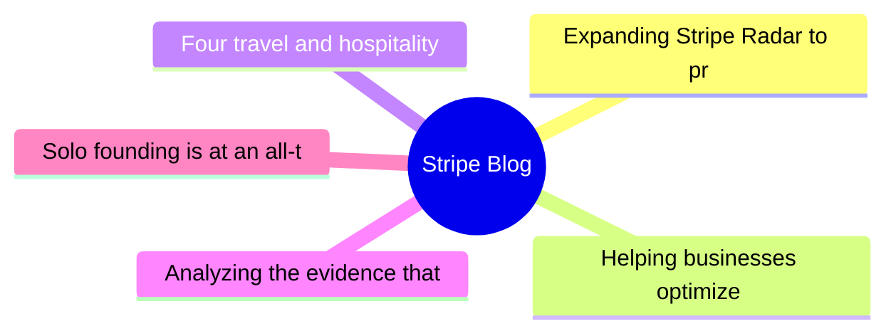
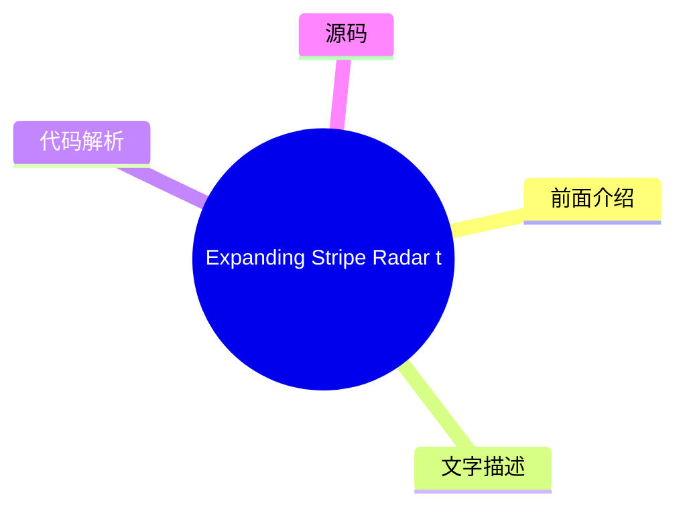
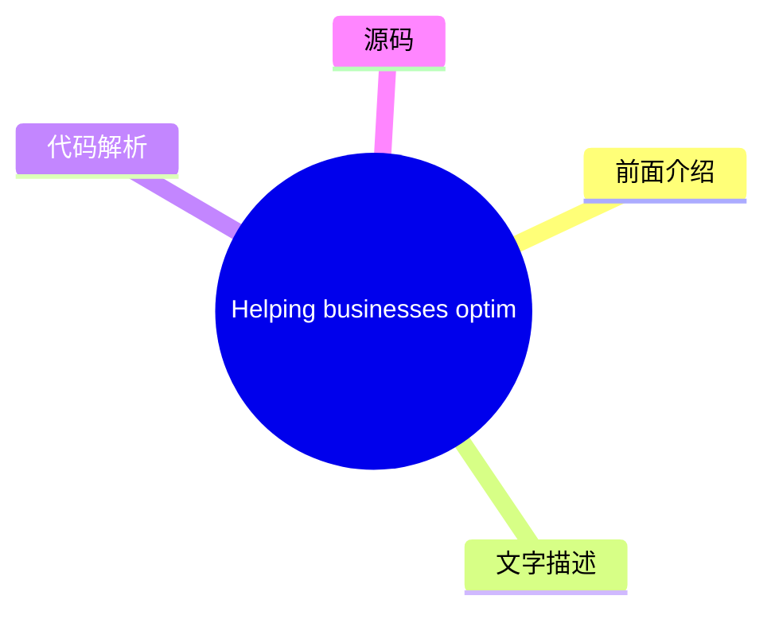
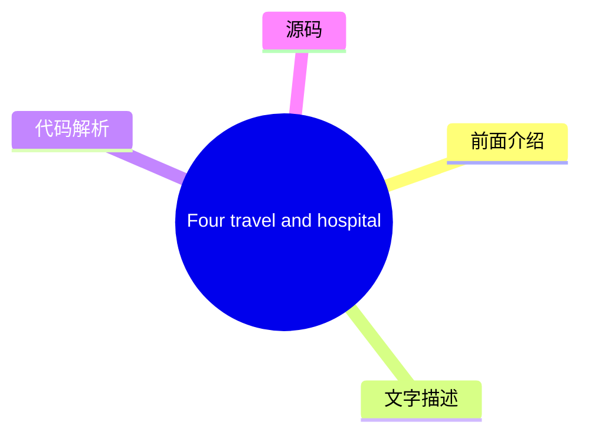
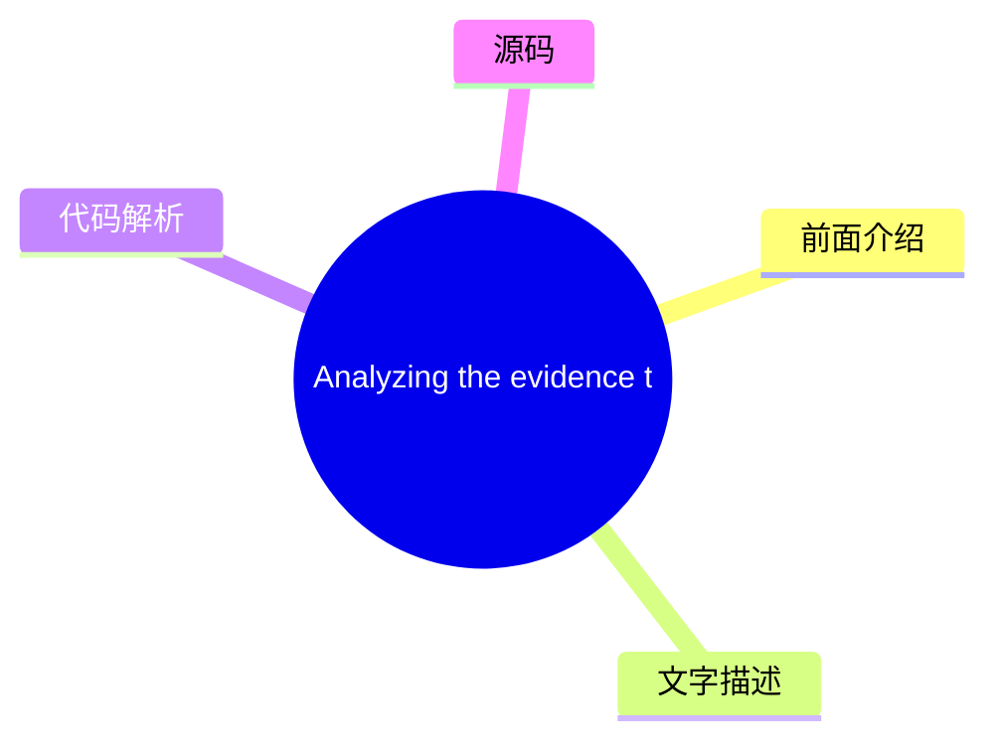
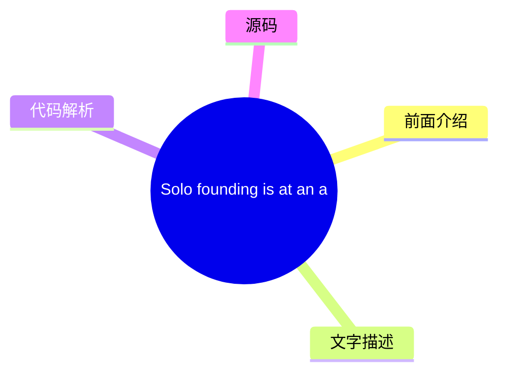

# 💳 Stripe Blog Top 5 (2026-08-03)

## 前面介绍

- 数据源：Stripe Blog
- 抓取日期：2026-08-03
- 条目数：5
- 含完整正文：5
- 含代码片段：0
- 组织方式：前面介绍 / 树状图 / 文字描述 / 代码解析 / 源码

## 思维导图

## 详细整理（5 条，5 条含全文，0 条含代码）

### 1. Expanding Stripe Radar to protect more of your business
- **链接**: [https://stripe.com/blog/expanding-stripe-radar-to-protect-more-of-your-business](https://stripe.com/blog/expanding-stripe-radar-to-protect-more-of-your-business)
- **发布**: Wed, 27 May 2026 00:00:00 +0000

#### 前面介绍

- Radar now blocks high-risk transactions across all supported payment methods; defends against new fraud types like multi-account abuse and pay-as-you-go abuse, regardless of which payment processor you use; and gives platforms new tools to evaluate a
- 发布时间：Wed, 27 May 2026 00:00:00 +0000

#### 树状图

#### 文字描述

- Last month at Stripe Sessions, we shared the biggest expansion we’ve ever made to [Stripe Radar](https://stripe.com/radar), our AI-powered fraud prevention tool. Radar now blocks high-risk transactions across all supported payment methods; defends against new fraud types like multi-account abuse and pay-as-you-go abuse, regardless of which payment processor you use; and gives p
- ## Protect more transactions with global payment coverage, new multiprocessor signals, and custom models Fraud protection is getting more complex. Businesses need to defend across a range of payment methods, and they need more precision in the signals they use to catch fraud before it happens—on and off Stripe. Radar now addresses both, along with the ability to use custom frau
- ## Defend against new types of fraud Fraudulent actors have become as sophisticated at stealing compute as they are at stealing money. They abuse policies by cycling through free trials, setting up multiple accounts, or intentionally not paying their next invoice. As businesses scale AI products, token abuse has become an expensive fraud vector. Last month, we shared how Radar 
- ## Protect your platform from account fraud Fraudulent actors are using generative AI to create fake identities, documents, and websites convincing enough to bypass many platforms’ verification systems. Platforms face a trade-off: request additional information during onboarding and increase friction, or keep the onboarding flow lightweight and take on potentially significant r

#### 代码解析

- 本文未检测到明确代码块，内容更偏新闻、观点或方法论。

#### 源码

#### 中文节选

上个月在 Stripe Sessions 上，我们分享了有史以来对 [Stripe Radar](https://stripe.com/radar) 最大的扩展，这是一款由 AI 驱动的欺诈防范工具。Radar 现在可以阻止所有支持支付方式下的高风险交易；无论您使用哪个支付处理器，都能防御多账户滥用和先买后付滥用等新型欺诈；并为平台提供了新的工具，用于评估和缓解 Stripe 内外商户的风险。我们还推出了更多方式，利用更智能的证据和自动证据库来应对争议。

以下是我们要宣布内容的详细情况。

## 利用全球支付覆盖范围、新的多处理器信号和自定义模型保护更多交易

欺诈防范正变得越来越复杂。企业需要在多种支付方式下进行防御，并且需要在交易发生前——无论是在 Stripe 上还是 Stripe 外——使用更精确的信号来识别欺诈。Radar 现在同时解决了这两个问题，并增加了使用自定义欺诈模型的能力。

**阻止所有支持的全球支付方式下的高风险交易**

Radar 现在保护 [全球所有支持的交易量](https://docs.stripe.com/radar/local-payment-methods)，包括银行借记、先买后付 (BNPL) 选项、加密货币、数字钱包、实时支付和现金代金券。当 Radar 在交易中检测到欺诈模式时，该信息将可用于保护所有支付方式下的交易。例如，如果欺诈行为者在 Stripe 上的某家企业使用被盗信用卡，而我们检测并阻止了该行为，那么该 IP 地址和设备指纹现在会在银行借记、钱包和 BNPL 交易网络范围内被标记。我们发现，对于使用 Affirm、Cash App、Klarna 和 PayPal 的企业，Radar 在五个月内将可疑欺诈减少了 71%。

**利用新的多处理器信号改进欺诈决策**

企业使用 Radar 的风险信号来处理 Stripe 以外的交易，以补充其内部欺诈模型，并在所有支付处理商上做出更精确的欺诈决策。现在，您可以通过为 Stripe 以外的交易添加额外的信号来进一步改进欺诈决策，从而帮助您在欺诈发生前加以防范。

Stripe 现在可以识别支付是否可能触发来自卡组织的[早期欺诈警告](https://docs.stripe.com/radar/multiprocessor#early-fraud-warning)。然后，您可以选择主动退款交易，以保护您的拒付率。

Stripe 还可以预测支付是否可能导致[欺诈性拒付](https://docs.stripe.com/radar/multiprocessor#fraudulent-dispute)。您可以使用此信号来发起退款、收集证据或调整您的拒付策略。

我们计划添加可在您的整个支付栈中使用的全新信号。

**访问企业级自定义欺诈模型**

对于风险概况更复杂的企业，Radar 现在提供[自定义欺诈模型](https://docs.stripe.com/radar/custom-

#### 完整正文（中文）

上个月在 Stripe Sessions 上，我们分享了有史以来对 [Stripe Radar](https://stripe.com/radar) 最大的扩展，这是一款由 AI 驱动的欺诈防范工具。Radar 现在可以阻止所有支持支付方式下的高风险交易；无论您使用哪个支付处理器，都能防御多账户滥用和先买后付滥用等新型欺诈；并为平台提供了新的工具，用于评估和缓解 Stripe 内外商户的风险。我们还推出了更多方式，利用更智能的证据和自动证据库来应对争议。

以下是我们要宣布内容的详细情况。

## 利用全球支付覆盖范围、新的多处理器信号和自定义模型保护更多交易

欺诈防范正变得越来越复杂。企业需要在多种支付方式下进行防御，并且需要在交易发生前——无论是在 Stripe 上还是 Stripe 外——使用更精确的信号来识别欺诈。Radar 现在同时解决了这两个问题，并增加了使用自定义欺诈模型的能力。

**阻止所有支持的全球支付方式下的高风险交易**

Radar 现在保护 [全球所有支持的交易量](https://docs.stripe.com/radar/local-payment-methods)，包括银行借记、先买后付 (BNPL) 选项、加密货币、数字钱包、实时支付和现金代金券。当 Radar 在交易中检测到欺诈模式时，该信息将可用于保护所有支付方式下的交易。例如，如果欺诈行为者在 Stripe 上的某家企业使用被盗信用卡，而我们检测并阻止了该行为，那么该 IP 地址和设备指纹现在会在银行借记、钱包和 BNPL 交易网络范围内被标记。我们发现，对于使用 Affirm、Cash App、Klarna 和 PayPal 的企业，Radar 在五个月内将可疑欺诈减少了 71%。

**利用新的多处理器信号改进欺诈决策**

企业使用 Radar 的风险信号来补充其内部欺诈模型，并在不同的支付处理商上做出更精确的欺诈决策。现在，您可以通过针对非 Stripe 交易的额外信号进一步改善欺诈决策，帮助您在欺诈发生前加以防范。

Stripe 现在可以识别支付是否可能触发卡组织的[早期欺诈警告](https://docs.stripe.com/radar/multiprocessor#early-fraud-warning)。然后，您可以选择主动退还该笔交易，以保护您的拒付率。

Stripe 还可以预测支付是否可能导致[欺诈性拒付](https://docs.stripe.com/radar/multiprocessor#fraudulent-dispute)。您可以使用此信号来发起退款、收集证据或调整您的拒付策略。

我们计划添加可在您整个支付系统中使用的新信号。

**访问企业级自定义欺诈模型**

对于风险概况更复杂的企业，Radar 现在提供[自定义欺诈模型](https://docs.stripe.com/radar/custom-fraud-models)。您可以将您业务独有的信号传递给 Stripe，例如产品目录数据、忠诚度状态、行为指标或与您风险概况相关的任何结构化元数据。Stripe 然后将此信息与我们全球网络数据相结合，部署专门针对您业务定制的模型。对于早期采用者，自定义模型在不增加误报的情况下，能检测出至少 15% 的更多欺诈。

## 防范新型欺诈

欺诈行为者窃取资金的能力与窃取计算资源的能力一样娴熟。他们通过循环使用免费试用、开设多个账户或故意不支付下一张账单来滥用政策。随着企业扩展 AI 产品，令牌滥用已成为一种昂贵的欺诈手段。

上个月，我们分享了 Radar 如何通过[防止免费试用滥用](https://stripe.com/blog/how-stripe-radar-helps-prevent-free-trial-abuse)来解决这些欺诈手段之一。在 Sessions 上，我们强调了保护您的企业免受多账户滥用、按量付费欺诈和欺诈机器人驱动支付侵害的新方法。

**阻止多账户滥用**

多账户滥用是指单个欺诈行为人创建多个账户，以重复使用促销优惠券或将被盗卡交易分散到多个账户中，从而延长逃避检测的时间。在整个 Stripe 网络中，AI 公司的注册用户中有超过六分之一与多账户滥用有关。

现在，Radar 可以[实时评估每个新账户](https://docs.stripe.com/radar/multi-account-and-account-sharing-abuse#multi-account-abuse)，以便您在滥用行为发生之前（无论是在 Stripe 内部还是外部）阻止可疑账户。我们的解决方案利用了整个 Stripe 网络中过往滥用行为的信息，包括设备指纹、IP 地址、电子邮件域名等。在过去的两个月里，ElevenLabs 每天能够阻止 2,000 名用户滥用其免费层级。

**预测按量付费滥用**

按量付费滥用是指客户滥用您的服务，在账单到期时没有付款意图，却累积了使用费用。这些不良行为者利用基于消费的定价结构，即费用在计费周期内累积，但付款发生在之后。例如，客户可能在一个月内消耗数千美元的计算资源，月底被计费，然后永远不付款。

Radar 现在可以帮助[在用量累积时预测未付款滥用](https://docs.stripe.com/radar/pay-as-you-go-abuse)，让您能够在向客户计费之前进行干预。这使您能够要求充值、切断服务，或采取任何符合您风险承受能力的措施。

**检测并防止欺诈机器人驱动的支付**

随着代理商业的扩展，区分代表客户行事的合法代理和恶意机器人变得越来越重要。两者都是进行购买的非人类流量，但一个是客户授权的代理，另一个可能会利用您的结账流程购买库存有限的商品、滥用促销定价或绕过购买限制。

Radar 现在为 Stripe Checkout 上的支付分配机器人评分，评估其是否由[恶意机器人发起](https://docs.stripe.com/radar/bot-abuse)的可能性。您可以使用此评分来执行反脚本或反机器人策略。例如，您可以阻止限量版商品的自动购买，或将高频率订单标记为待审核。

## 保护您的平台免受账户欺诈

欺诈行为者正在使用生成式 AI 创建虚假身份、文件和网站，这些内容足以绕过许多平台的验证系统。平台面临一个权衡：在入职流程中要求提供额外信息并增加摩擦，还是保持入职流程轻量级并承担潜在的重大风险。

[平台现在可以利用 Radar 降低风险](https://docs.stripe.com/radar/radar-for-platforms)，其功能包括为每个业务和交易提供 0 到 100 的欺诈评分；解释为何账户被标记的 AI 驱动洞察；用于帮助您的团队了解账户背景的备注和账户历史记录；以及针对争议、拒付、退款和支付的账户级指标。

我们还引入了三种新方法，供平台在 Stripe 内外监控和评估商户风险。

- [欺诈网站](https://docs.stripe.com/radar/fraudulent-website)信号会像人类欺诈分析师那样分析企业的网站，寻找奢侈品以不切实际的价格出售、AI 生成的文案、拼写错误的品牌 URL 或其他表明网站存在欺诈的迹象等危险信号。平台可以在入职流程中使用此信号来自动验证、标记账户以进行人工审核，或在批准业务前将其作为自身风险评分的输入。
- [欺诈商户](https://docs.stripe.com/radar/fraudulent-merchant)信号根据分析 Stripe 网络中的模式（包括银行账户信息、业务详情、交易活动和争议）来确定新账户或现有账户是否存在欺诈风险。平台随后可以发起审核、暂停付款、暂停提现、拒绝账户、设置预留金或要求身份验证。

- [商户拖欠风险](https://docs.stripe.com/radar/merchant-delinquency-risk)信号预测企业是否面临产生负余额的风险；具体而言，它预测该余额是否可能持续为负 60 天或更长时间。平台可利用此信号来决定是否主动调整结算时间表，对高风险账户要求预留金，或在损失累积之前标记商户以进行更仔细的审查。

## 利用更智能的证据和自动化的证据库更有效地应对争议

[智能争议](https://docs.stripe.com/disputes/smart-disputes)是我们基于 AI 的争议管理产品，它一直代表您整理并提交证据。现在，智能争议可以制定更定制化的策略，以提高您赢得每起争议的几率。

智能争议会分析每起争议，并针对特定证据字段（如追踪号码或客户使用日志）提供 [AI 驱动的建议](https://docs.stripe.com/disputes/set-up-smart-disputes#provide-more-data-at-dispute-time)。通过智能争议添加我们 AI 推荐证据的企业，其胜诉频率是不添加任何证据企业的 3 倍。

我们还减少了提交证据所需的人工工作量。许多争议需要相同的支持材料：条款和条件、退货政策和服务协议。有了证据库，您只需上传并存储这些文档一次，智能争议便会根据争议原因代码、网络要求和持卡人主张，自动选择并将它们包含在您的证据包中——无需手动重新提交。

## 接下来是什么

在 Sessions 上，我们还发布了[我们的公开路线图](https://stripe.com/roadmap)：一份包含数百个详细条目的清单，涵盖截至 2027 年第一季度，包括 [Radar 中的产品、功能和改进](https://stripe.com/roadmap?product=Radar)。

想了解更多 Radar 如何保护您的业务，请加入我们在全球主要城市的 [Stripe Tour 2026](https://stripetour.com/)。您也可以 [阅读我们的文档](https://docs.stripe.com/radar) 或 [联系我们的专家团队](https://stripe.com/contact/sales)。

### 2. Helping businesses optimize network costs with the Visa Digital Commerce Authentication Program (DCAP)
- **链接**: [https://stripe.com/blog/helping-businesses-optimize-network-costs-with-visa-digital-commerce-authentication-program](https://stripe.com/blog/helping-businesses-optimize-network-costs-with-visa-digital-commerce-authentication-program)
- **发布**: Wed, 03 Jun 2026 00:00:00 +0000

#### 前面介绍

- We moved quickly to help Stripe businesses take advantage of DCAP and capture interchange savings while protecting authorization rates. Here’s what we did.
- 发布时间：Wed, 03 Jun 2026 00:00:00 +0000

#### 树状图

#### 文字描述

- Visa recently launched the [Digital Commerce Authentication Program (DCAP)](https://support.stripe.com/questions/understand-the-visa-digital-commerce-authentication-program-%28dcap%29-on-stripe), a new global framework designed to reduce fraud and increase authorization rates for card-not-present transactions. The program rewards businesses in the US for sharing richer transact
- ### Optimizing DCAP savings without sacrificing conversion Before rolling out DCAP, we worked with Visa to run readiness testing and identify the right implementation approach. This collaborative testing underscored the need for transaction-level intelligence. With [Stripe Authorization Boost](https://stripe.com/authorization-boost), we intelligently select which transactions s
- ## Automatically benefit from DCAP optimizations If you use Authorization Boost and are collecting the required data points, you’re already automatically benefiting from DCAP optimizations. For businesses using [standalone 3DS](https://docs.stripe.com/payments/3d-secure/standalone-3d-secure), you can participate by setting **flow_preference[type]** to `data_share` on authentica

#### 代码解析

- 本文未检测到明确代码块，内容更偏新闻、观点或方法论。

#### 源码

#### 中文节选

Visa 最近推出了 [数字商务认证计划 (DCAP)](https://support.stripe.com/questions/understand-the-visa-digital-commerce-authentication-program-%28dcap%29-on-stripe)，这是一个旨在减少欺诈并提高无卡交易授权率的新全球框架。该计划奖励美国企业在与发卡行进行认证时分享更丰富的交易数据，例如设备 ID、账单地址、IP 地址和客户电子邮件。符合条件的交易可获得 5 个基点的净交换费减免。

新的网络计划带来了机遇，但也引入了复杂性。企业需要了解哪些交易符合资格，确保其集成传递了所需数据，并确定参与是否有助于改善其端到端交易经济状况，或者是否会产生意想不到的后果，例如损害授权率。

要参与 DCAP，企业需要在结账流程中通过无摩擦认证与发卡行共享所需的持卡人数据。这可能会引入延迟，并导致发卡行在解读这些较新的信号时存在不确定性。

我们迅速采取行动，帮助 Stripe 企业利用 DCAP 并在保护授权率的同时捕获交换费节省。以下是我们的做法。

### 优化 DCAP 节省，不牺牲转化率

在推出 DCAP 之前，我们与 Visa 合作进行了就绪性测试，并确定了正确的实施方法。这种协作测试强调了交易级智能的必要性。

使用 [Stripe 授权提升](https://stripe.com/authorization-boost)，我们会智能选择哪些交易应通过 [仅数据 3DS](https://docs.stripe.com/payments/3d-secure/strong-customer-authentication-exemptions#data-only)，该流程会从卡组织向发卡行发送额外的风险数据。与使用静态规则不同，授权提升会在交易级别评估成本节约、转化影响和欺诈风险，以确定何时应用仅数据 3DS。这使企业能够在限制对客户体验的影响并优化授权率的同时，捕获 DCAP 节省。

自 4 月 18 日以来，我们已帮助 Stripe 企业从 DCAP 中捕获了 1840 万美元的年度化网络成本节约。通过帮助企业收集和传递所需数据，我们观察到符合 DCAP 条件的交易数量增加了 8 倍。我们正在继续与 Visa 合作优化资格条件，以便更多交易能够受益于 DCAP。

## 自动受益于 DCAP 优化

如果您使用授权提升并正在收集所需的数据点，您已经自动受益于 DCAP 优化。对于使用 [独立 3DS](https://docs.stripe.com/payments/3d-secure/standalone-3d-secure) 的企业，您可以通过在认证请求上将 **flow_preference[type]** 设置为 `data_share` 并确保要求来参与。

#### 完整正文（中文）

Visa 最近推出了 [数字商务认证计划 (DCAP)](https://support.stripe.com/questions/understand-the-visa-digital-commerce-authentication-program-%28dcap%29-on-stripe)，这是一个旨在减少欺诈并提高无卡交易授权率的新全球框架。该计划奖励美国企业在与发卡行进行认证时分享更丰富的交易数据，例如设备 ID、账单地址、IP 地址和客户电子邮件。符合条件的交易可获得 5 个基点的净交换费减免。

新的网络计划带来了机遇，但也引入了复杂性。企业需要了解哪些交易符合资格，确保其集成传递了所需数据，并确定参与是否有助于改善其端到端交易经济状况，或者是否会产生意想不到的后果，例如损害授权率。

要参与 DCAP，企业需要在结账流程中通过无摩擦认证与发卡行共享所需的持卡人数据。这可能会引入延迟，并导致发卡行在解读这些较新的信号时存在不确定性。

我们迅速采取行动，帮助 Stripe 企业利用 DCAP 并在保护授权率的同时捕获交换费节省。以下是我们的做法。

### 优化 DCAP 节省，不牺牲转化率

在推出 DCAP 之前，我们与 Visa 合作进行了就绪性测试，并确定了正确的实施方法。这种协作测试强调了交易级智能的必要性。

With [Stripe Authorization Boost](https://stripe.com/authorization-boost), we intelligently select which transactions should go through [Data Only 3DS](https://docs.stripe.com/payments/3d-secure/strong-customer-authentication-exemptions#data-only), which sends additional risk data from the card network to the issuer for authorization. Rather than applying static rules, Authorization Boost evaluates cost savings, conversion impact, and fraud risk at the individual transaction level to determine when to apply Data Only 3DS. This allows businesses to capture DCAP savings while limiting the impact to the customer experience and optimizing authorization rates.

Since April 18, we’ve helped Stripe businesses capture $18.4 million in annualized network cost savings from DCAP. By helping businesses collect and pass the required data, we saw an 8x increase in the number of DCAP-eligible transactions. We’re continuing to work with Visa to optimize eligibility, so more transactions can benefit from DCAP.

## Automatically benefit from DCAP optimizations

If you use Authorization Boost and are collecting the required data points, you’re already automatically benefiting from DCAP optimizations. For businesses using [standalone 3DS](https://docs.stripe.com/payments/3d-secure/standalone-3d-secure), you can participate by setting **flow_preference[type]** to `data_share` on authentication requests and ensuring required fields are populated.

Learn more about how [Authorization Boost](https://docs.stripe.com/payments/analytics/optimization) can help optimize your payments performance.

### 3. Four travel and hospitality trends from HITEC 2026
- **链接**: [https://stripe.com/blog/trends-from-hitec](https://stripe.com/blog/trends-from-hitec)
- **发布**: Tue, 23 Jun 2026 00:00:00 +0000

#### 前面介绍

- More than 6,000 hospitality executives and operators gathered in San Antonio last week for the HITEC conference. The big topic: whether the industry’s AI investment is actually working. Across four days and over 50 meetings, four trends stood out.
- 发布时间：Tue, 23 Jun 2026 00:00:00 +0000

#### 树状图

#### 文字描述

- More than 6,000 hospitality executives and operators gathered in San Antonio last week for the annual HITEC hospitality technology conference, including leaders from Wyndham Hotels & Resorts, Hyatt, IHG Hotels & Resorts, Starwood Hotels, and hundreds of independent properties. The big topic: whether the industry’s AI investment is actually working. IDC forecasts that [30%](http
- ## The race for direct bookings has moved from search rankings to AI answers For years, the hospitality industry’s answer to online travel agency (OTA) dependency was SEO: invest in content, improve search rankings, and convert guests before they end up on Expedia or Booking.com. That approach is becoming less effective. Jack Wang, principal solution engineer at Salesforce, off
- ## Most hospitality AI is falling short in a predictable way An uncomfortable truth surfaced repeatedly throughout HITEC: much of the AI scaling happening across hospitality is fragile. The majority of businesses are adopting AI without the strategic clarity, data foundation, and operational architecture to sustain it. The root cause is often fragmented data. Siloed property ma
- ## Payments friction has a measurable cost, but most hotels still don’t know what it is The hospitality industry has historically treated payments as a cost and commodity: something to keep running, minimize fees on, and keep out of the way. Many of the payments-specific conversations we had at HITEC revolved around how that approach is changing, along with a growing recognitio

#### 代码解析

- 本文未检测到明确代码块，内容更偏新闻、观点或方法论。

#### 源码

#### 中文节选

超过 6,000 名酒店高管和经营者上周齐聚圣安东尼奥，参加年度 HITEC 酒店技术会议，其中包括万豪度假酒店、凯悦、洲际酒店集团、喜达屋酒店以及数百家独立物业的领导者。

核心议题：行业的人工智能投资是否真的奏效。IDC 预测，到 2030 年，30% 的所有旅行预订将由人工智能代理完成。但行业的发展方向与当前具备的支持能力之间存在巨大差距。

根据 BCG 的数据，25% 的酒店企业报告目前正在积极扩大人工智能的应用，但不到 10% 的企业被视为“AI 未来构建型”——这意味着它们在核心运营中植入了人工智能，拥有支持性的数据基础，并取得了可衡量的回报。“许多公司只是在盲目尝试，看能否奏效，”佛罗里达国际大学酒店技术副教授 Dale Gomez 表示。“他们想要看到投资回报率。”

其他变革正在推进中。许多酒店企业仍缺乏现代金融基础设施，无法充分受益于人工智能预期带来的自动化、速度和互操作性。曾经被认为“足够好”的支付系统如今正在造成可衡量的收入损失，而不断上升的客人期望已将低效的技术从一个小麻烦变成了不再回头的原因。

在四天的时间里，举行了 50 多次会议，四个趋势尤为突出。

## 直接预订的竞争已从搜索排名转向 AI 回答

多年来，酒店业应对在线旅行社（OTA）依赖症的答案是 SEO：投资内容，提高搜索排名，并在客人最终出现在 Expedia 或 Booking.com 之前将其转化。这种方法正变得越来越无效。

Salesforce 的首席解决方案工程师 Jack Wang 提供的数据凸显了这一转变：现在，65% 触发 AI 概览的 Google 搜索最终都没有用户点击任何网站。在移动端，这一数字上升至 78%。随着 AI 生成的摘要取代了 SEO 旨在赢得的排名链接列表，传统搜索流量在整个行业下降了约 25%。

被 AI 生成的答案收录需要与 SEO 奖励的内容不同。SEO 响应的是关键词密度、反向链接和页面权威性。AI 收录响应的是结构化属性数据的准确性和机器可读性，如房型、设施详情、政策、本地背景或取消条款。一家酒店可能在传统搜索中排名靠前，但对 LLM 来说却不可见：超过 [90%](https://www.nokumo.net/en/ai-visibility-in-hospitality-what-3-600-ai-responses-and-1-337-website-audits-reveal?utm_campaign=ennismore-proves-tech-investment-pays-off-and-94-of-hotels-are-invisible-to-ai) 的住宿

#### 完整正文（中文）

超过 6,000 名酒店高管和经营者上周齐聚圣安东尼奥，参加年度 HITEC 酒店技术会议，其中包括万豪度假酒店、凯悦、洲际酒店集团、喜达屋酒店以及数百家独立物业的领导者。

核心议题：行业的人工智能投资是否真的奏效。IDC 预测，到 2030 年，30% 的所有旅行预订将由人工智能代理完成。但行业的发展方向与当前具备的支持能力之间存在巨大差距。

根据 BCG 的数据，25% 的酒店企业报告目前正在积极扩大人工智能的应用，但不到 10% 的企业被视为“AI 未来构建型”——这意味着它们在核心运营中植入了人工智能，拥有支持性的数据基础，并取得了可衡量的回报。“许多公司只是在盲目尝试，看能否奏效，”佛罗里达国际大学酒店技术副教授 Dale Gomez 表示。“他们想要看到投资回报率。”

其他变革正在推进中。许多酒店企业仍缺乏现代金融基础设施，无法充分受益于人工智能预期带来的自动化、速度和互操作性。曾经被认为“足够好”的支付系统如今正在造成可衡量的收入损失，而不断上升的客人期望已将低效的技术从一个小麻烦变成了不再回头的原因。

在四天的时间里，举行了 50 多次会议，四个趋势尤为突出。

## 直接预订的竞争已从搜索排名转向 AI 回答

多年来，酒店业应对在线旅行社（OTA）依赖症的答案是 SEO：投资内容，提高搜索排名，并在客人最终出现在 Expedia 或 Booking.com 之前将其转化。这种方法正变得越来越无效。

Salesforce 的首席解决方案工程师 Jack Wang 提供的数据凸显了一种转变：现在，65% 触发 AI 概览的谷歌搜索最终都没有用户点击任何网站。在移动端，这一数字上升到 78%。随着 AI 生成的摘要取代了 SEO 旨在赢得的排名链接列表，传统搜索流量在整个行业下降了约 25%。

被纳入 AI 生成的答案需要与 SEO 奖励的内容不同。SEO 响应的是关键词密度、反向链接和页面权重。AI 纳入则响应结构化属性数据的准确性和机器可读性，如房型、设施详情、政策、本地背景或取消条款。一家酒店可能在传统搜索中排名良好，但对 LLM 来说却是隐形的：超过 [90%](https://www.nokumo.net/en/ai-visibility-in-hospitality-what-3-600-ai-responses-and-1-337-website-audits-reveal?utm_campaign=ennismore-proves-tech-investment-pays-off-and-94-of-hotels-are-invisible-to-ai) 的住宿网站仍被 AI 模型检测不到。

我们已经看到了这种下游效应。根据 Phocuswright 的研究，[56%](https://www.phocuswire.com/news/online/shift-travel-behavior-ai-surge-phocuswright-research) 的旅行者在过去 12 个月中曾使用 AI 进行行程规划、预订或在目的地协助。对于运营商来说，第一步是审计，而不是投资。您潜在客人使用的 LLM 能否准确描述您酒店的房型、设施、政策和本地背景？如果答案是否定的，这个差距很可能会让您损失预订。

如今，酒店集团可以像 OTA 一样使用结账和支付工具，包括本地支付方式和货币、一键结账以及全球欺诈保护。捕捉代理需求的旅游品牌正在将 AI 驱动的可发现性与准确的实时库存以及高效的现代结账体验相结合。

## 大多数酒店 AI 都以可预测的方式未能达标

HITEC 期间反复浮现出一个令人不安的事实：酒店业正在发生的许多 AI 扩展都是脆弱的。大多数企业采用 AI 时缺乏战略清晰度、数据基础和运营架构来维持其运行。

根本原因通常是数据碎片化。孤立的物业管理系统、CRM、忠诚度、餐饮和支付系统各自只持有关于同一客人的部分信息——而 AI 推荐的准确性仅取决于它们所使用的内容。在 AI 个性化中出现的相同数据问题，在财务上表现为过长的对账时间，在运营上表现为不完整的客人档案，在客人体验上则表现为摩擦。

Salesforce 首席解决方案工程师 Amanda Sharp 将这一问题重新定义为 AI 的运营化，而非采用，并呼吁进行“氛围运营”：这是酒店业对氛围编码的回应。如今，许多酒店品牌构建 AI 功能已成为可能。但在生产环境中可靠地运行它们，并将其集成到触发实际操作的现有工作流程中，则要困难得多。

在这方面做得好的企业拥有干净、连接的数据，能够将有用的情报直接在工作流程中传递，从而在采取行动的时机尚存时发挥作用。例如，达美航空在移动应用中内置了实时 AI 礼宾，利用 SkyMiles 档案和运营数据，作为客户关怀体验的一部分提供上下文感知支持。在永利拉斯维加斯，当业绩低于目标时，收益经理会收到预测性警报以及附带的建议行动。

对于大多数旅游运营商来说，瓶颈在于数据连接，而非模型质量。

## 支付摩擦具有可衡量的成本，但大多数酒店仍不知道其具体数额

酒店行业长期以来一直将支付视为一种成本和商品：一种需要维持运转、尽量减少费用以及避免其干扰的事物。我们在 HITEC 会议上进行的许多支付相关讨论，都围绕着这种做法正在发生的变化，以及人们日益认识到支付已成为酒店品牌竞争的关键因素展开。我们的数据也支持这一观点：在 Stripe 委托的一份针对近 400 名酒店高管进行的调查中，90% 的人表示支付对增长很重要，37% 的人表示缺乏支付选项对客人体验产生最大的负面影响。此外，58% 的人表示他们的欺诈系统会拦截合法交易，74% 的人报告称，碎片化的系统导致他们的团队在对账上花费了过多的时间。

这些数据凸显了为何支付已成为一种结构性优势。在线旅行社（OTA）之所以能够负担得起大规模的支付团队，是因为其收入证明了雇佣这些人员的合理性。独立酒店和较小的运营商无法直接匹配这种投资，但在正确的基础设施支持下，一个精简的团队现在可以以大型内部运营成本的一小部分，支持数十个国家的支付方式。

覆盖范围的缺失直接导致预订流失。“一旦我们不支持[某种支付方式]，就意味着这位客人会去其他地方，去支持他们首选支付方式的平台或渠道，”Cloudbeds 战略合作伙伴关系副总裁 Sebastien Leitner 说。客人在其首选支付方式适用的地方预订。一家不支持目标市场主流支付方式的酒店，不仅是在制造摩擦——它实际上是将该预订分流到了支持该方式的 OTA。

## 最好的酒店技术是那种不被注意到的技术

“对于那些无法正常工作的技术，人们毫无同情心，”Oracle Hospitality 全球战略与产品管理副总裁 Tanya Pratt 说道。“如果技术无法运行，它带来的挫败感将比在前台排长队更甚，因为人们已经习惯了排队。”当技术失效时，客人并不总是会投诉。他们只是不再回头。

真正的成功衡量标准是，当技术运行得足够好，以至于客人根本不会去想它。万豪酒店的首席信息官 Denise Walker 描述了这一愿景：一位回头客抵达房间时，温度适宜，电视上播放着他们偏好的频道，床上的枕头硬度也正合心意。没有人会解释他们是如何知道的。“它不需要以一种‘你怎么知道这些的？’的方式呈现出来。”

拉斯维加斯 Resorts World 酒店副总裁 Shannon McCallum 进一步阐述道：“我们正从‘我告诉了你这些，所以你知道关于我的事’转变为‘我什么都没告诉你，而现在你却预测到了’。”

无论是这种无形的个性化服务，还是它所支持的人性化时刻，都需要一个连接数据的基础——即能够整合现有技术栈、将客人信息整合到单一系统中的技术。这种基础设施使企业能够在客人浏览网站或站在前台时识别出同一位客人。

## Stripe 如何提供帮助

越来越多的客人将通过 AI 助手而非搜索引擎找到您的物业。他们预订的行程可能由代理人完成。而区分高绩效运营商的营收将来自于能够促成转化的支付体验、覆盖所有市场的支付方式，以及协同运作的财务系统。Stripe 数据管道将支付数据与您的预订和客户系统连接起来，为运营商提供统一的营收视图，而无需依赖拼凑在一起的报告。

Stripe 的支付基础设施帮助酒店运营商保护营收、提升客人在店内的消费，并简化运营。

**推动直接预订。** 在客人实际使用的各种支付方式以及您服务的每个市场中，能够促进转化的支付体验有助于保持预订量在您的直接渠道上。随着智能商业的普及，这意味着默认在每笔 Stripe 交易上运行的欺诈检测，以及允许代理在不暴露客人凭证的情况下进行交易的支付令牌。

**增加行程消费。** 来自餐饮、体验和合作伙伴的附属收入需要能够在整个物业范围内运作的支付基础设施，支持新的商业模式，并与外部合作伙伴连接。Stripe Billing 处理会员和忠诚度计划背后的定期支付逻辑，包括自动续费、分级定价和失败付款恢复——无需运营商自行维护该基础设施。例如，[Cloudbeds](https://stripe.com/customers/cloudbeds) 发现，使用 Cloudbeds Payments 的企业收入增长了 15%，而通过其 Stripe 合作伙伴关系直接消除支付摩擦并扩展支付方式的企业，收入平均增长了 14.8%。

**降低成本。** 更高效的 B2B 资金流动和欺诈保护减少了对账工作并限制了损失，从而在不增加人员的情况下释放利润空间。

[了解更多](https://stripe.com/industries/travel) 关于 Stripe 如何支持酒店业务，或 [联系我们](https://stripe.com/contact/sales)。

### 4. Analyzing the evidence that helps businesses win “product not received” disputes
- **链接**: [https://stripe.com/blog/analyzing-the-evidence-that-helps-businesses-win-product-not-received-disputes](https://stripe.com/blog/analyzing-the-evidence-that-helps-businesses-win-product-not-received-disputes)
- **发布**: Tue, 21 Jul 2026 00:00:00 +0000

#### 前面介绍

- To understand what can influence win rates, we analyzed evidence packets from one million disputes over a 16-week period. Here’s what the data shows and what it means for how you mitigate disputes.
- 发布时间：Tue, 21 Jul 2026 00:00:00 +0000

#### 树状图

#### 文字描述

- “[Product not received](https://docs.stripe.com/disputes/categories)” disputes—where a cardholder claims they didn’t receive what they paid for—are the most common nonfraud dispute category on Stripe. It can be challenging to know which claims are legitimate and which are not: some customers genuinely never received what they paid for, while others incorrectly claim they didn’t
- ## Businesses that submitted evidence after the delivery was confirmed saw a 27 percentage point higher win rate Many businesses submit a shipping tracking ID as proof of delivery. However, depending on the status of the package at the time you submit the evidence, the tracking number might only confirm that the package left your facility. Our analysis found that win rates incr
- ## Businesses that submitted digital activity and usage logs saw a 10 percentage point higher win rate Businesses selling digital goods also need to provide proof of fulfillment, though the supporting evidence looks different. Disputes with digital activity and usage logs—such as JSON telemetry logs from common analytics platforms showing that a user streamed, downloaded, or ac
- ## Businesses that included evidence of a refund issued through Stripe saw a 63 percentage point higher win rate Cardholders can still initiate [a dispute even after a refund has been processed](https://support.stripe.com/questions/disputes-on-a-refunded-transaction-faq), often because the refund and dispute were filed around the same time or because the issuing bank didn’t che

#### 代码解析

- 本文未检测到明确代码块，内容更偏新闻、观点或方法论。

#### 源码

#### 中文节选

“[未收到商品](https://docs.stripe.com/disputes/categories)” 争议——即持卡人声称他们没有收到所付款项——是 Stripe 上最常见的非欺诈争议类别。很难判断哪些索赔是合理的，哪些不是：有些客户确实从未收到他们付款购买的商品，而另一些人则错误地声称他们没有收到订单。

为了了解什么会影响胜诉率，我们在 16 周的时间内分析了来自一百万起争议的证据包。我们将包含各种类型证据（如投递确认或内容消费日志）的包的胜诉率与不包含这些证据的包进行了比较，从而确定了哪些特征与更高的胜诉率相关。

以下是数据对业务总体情况的显示，销售数字商品的业务有何不同，以及这对您如何减轻争议意味着什么。

**提交投递信息的业务胜诉率高出 44 个百分点**

对于销售实物商品的业务，有投递确认作为证据的争议，其胜诉率比没有投递确认的争议高出 27 个百分点。添加 GPS 投递地图作为证据（显示承运商扫描包裹的位置），在仅有投递确认的基础上又提高了 15 个百分点的胜诉率。而包含收件人签名作为证据则进一步提高了 2 个百分点。因此，包含投递确认、GPS 地图和签名的争议，其胜诉率比没有这些证据的争议高出 44 个百分点。

然而，许多业务在争议回复中仍然不包含投递确认。这种差距的一部分在于意识，但更大的障碍在于运营。对于大多数业务来说，运输数据和争议工作流位于不同的系统中。将特定的争议与正确的订单以及已确认的投递状态相匹配，通常需要手动工作，且难以扩展。

## 在投递确认后提交证据的业务胜诉率高出 27 个百分点

Many businesses submit a shipping tracking ID as proof of delivery. However, depending on the status of the package at the time you submit the evidence, the tracking number might only confirm that the package left your facility.

Our analysis found that win rates increased based on what the tracking ID showed when a business submitted it—specifically, whether delivery had been confirmed. Disputes with evidence submitted after delivery was confirmed had a 27 percentage point higher win rate than disputes with no delivery confirmation. On the other hand, disputes with evidence submitted when the package was still in transit had only a two percentage point higher win rate than disputes with no delivery confirmation.

This suggests that the timing of your evidence submission matters. Customers might file a “product not received” dispute before an order arrives, especially if a shipment is delayed or still in transit. Because most business

#### 完整正文（中文）

“[未收到商品](https://docs.stripe.com/disputes/categories)” 争议——即持卡人声称他们没有收到所付款项——是 Stripe 上最常见的非欺诈争议类别。很难判断哪些索赔是合理的，哪些不是：有些客户确实从未收到他们付款购买的商品，而另一些人则错误地声称他们没有收到订单。

为了了解什么会影响胜诉率，我们在 16 周的时间内分析了来自一百万起争议的证据包。我们将包含各种类型证据（如投递确认或内容消费日志）的包的胜诉率与不包含这些证据的包进行了比较，从而确定了哪些特征与更高的胜诉率相关。

以下是数据对业务总体情况的显示，销售数字商品的业务有何不同，以及这对您如何减轻争议意味着什么。

**提交投递信息的业务胜诉率高出 44 个百分点**

对于销售实物商品的业务，有投递确认作为证据的争议，其胜诉率比没有投递确认的争议高出 27 个百分点。添加 GPS 投递地图作为证据（显示承运商扫描包裹的位置），在仅有投递确认的基础上又提高了 15 个百分点的胜诉率。而包含收件人签名作为证据则进一步提高了 2 个百分点。因此，包含投递确认、GPS 地图和签名的争议，其胜诉率比没有这些证据的争议高出 44 个百分点。

然而，许多业务在争议回复中仍然不包含投递确认。这种差距的一部分在于意识，但更大的障碍在于运营。对于大多数业务来说，运输数据和争议工作流位于不同的系统中。将特定的争议与正确的订单以及已确认的投递状态相匹配，通常需要手动工作，且难以扩展。

## 在投递确认后提交证据的业务胜诉率高出 27 个百分点

许多企业会提交运输追踪 ID 作为交付证明。然而，根据您提交证据时包裹的状态，该追踪号可能仅能确认包裹已离开您的设施。

我们的分析发现，企业提交追踪 ID 时显示的内容会影响胜诉率——具体而言，即是否已确认送达。在确认送达后提交证据的争议，其胜诉率比未提供送达确认的争议高出 27 个百分点。另一方面，在包裹仍在运输途中时提交证据的争议，其胜诉率仅比未提供送达确认的争议高出 2 个百分点。

这表明您提交证据的时机很重要。客户可能会在订单到达之前就提交“未收到商品”的争议，尤其是当发货延迟或仍在运输途中时。由于大多数企业有 20 天或更长的回复时间，如果您的争议处理窗口允许，请考虑等到承运商确认到达后再提交。如果您确实需要在送达确认之前提交，请考虑包含显示订单仍在客户结账时同意的配送时间范围内的文档。

## 提交数字活动和使用日志的企业胜诉率高出 10 个百分点

销售数字商品的企业也需要提供履行证明，尽管支持证据的形式有所不同。

包含数字活动和使用日志（例如来自常见分析平台的 JSON 遥测日志，显示用户流式传输、下载或访问了其购买的具体产品）的争议，其胜诉率比没有这些证据的争议高出 10 个百分点。而包含服务文档（如配置记录）的争议，其胜诉率比没有这些证据的争议高出 8 个百分点。

这种模式与我们在销售实物商品的企业中发现的情况如出一辙：具体细节总是更有利。服务文档可能只能证明客户有权访问。而内容消费日志则可以证明客户流媒体播放、下载或访问了他们付费购买的具体产品。

## 包含通过 Stripe 发放退款证据的企业，胜诉率高出 63 个百分点

持卡人仍可能在退款处理完成后发起[争议](https://support.stripe.com/questions/disputes-on-a-refunded-transaction-faq)，这通常是因为退款和争议是在同一时间提交的，或者是发卡行在提交争议前未检查退款状态。当这种情况发生时，许多企业会在争议回复中包含退款证据，以证明他们已经让客户满意。但我们的分析显示，对于销售数字商品的企业而言，“退款证明”对胜诉率的影响取决于退款的处理方式。

通过 Stripe 发放的全额退款是销售数字商品的企业高胜诉率的最强预测指标。包含此类证据的争议，其胜诉率比不包含此类证据的争议高出 63 个百分点。另一方面，通过其他渠道（如商店积分）发放的退款，其争议的胜诉率仅比不包含此类证据的争议高出 6 个百分点。

这可能是因为发卡行只能对可以验证的信息采取行动。当退款通过你的支付处理商处理时，发卡行可以验证卡网络上的该笔信用记录。通过支付处理商以外的渠道发放的退款，发卡行无法以同样的方式进行验证；因为没有记录。

## Stripe 如何提供帮助

[智能争议](https://docs.stripe.com/disputes/smart-disputes) 旨在为你应用这些最佳实践，帮助你节省时间并挽回收入。它使用人工智能为符合条件的卡争议自动组装量身定制的证据包，应用本分析中确定的数据支持型最佳实践，因此你无需逐笔争议地手动实施这些措施。

当您收到争议时，通过向 Smart Disputes 提供承运商和运单号，可以提高您的胜诉率。Stripe 支持超过 12 家承运商，并会自动与它们合作，获取完整的履行历史记录，例如投递状态、时间戳和位置数据。您还可以添加任何额外的证据，例如客户沟通记录或补充文件，Stripe 会将其与自动生成的证据包合并，以创建最强有力的回复。

随后，Stripe 会将这些信息为您组装成一份有力的证据包，并根据具体的争议（包括网络、地区、发卡行和原因代码）优化证据包的内容和结构。如果您在争议截止日期前未采取任何行动，Smart Disputes 将代表您提交证据，以确保不会因错过截止日期而导致争议失败。

如果您已经使用 Stripe，则无需进行额外的集成。要了解更多关于 Smart Disputes 的信息，请阅读我们的文档。

*此处包含的见解、预测和前瞻性陈述仅供参考，不应依赖。这些内容基于假设和目前可获得的信息，但实际结果可能会有重大差异。*

### 5. Solo founding is at an all-time high: Top performers have these traits in common
- **链接**: [https://stripe.com/blog/top-solo-founder-traits](https://stripe.com/blog/top-solo-founder-traits)
- **发布**: Thu, 28 May 2026 00:00:00 +0000

#### 前面介绍

- In 2025, solo founders in the top decile generated 61 times the revenue of the median solo founder in their first six months. We analyzed the data to understand what drives that gap.
- 发布时间：Thu, 28 May 2026 00:00:00 +0000

#### 树状图

#### 文字描述

- Solo startup founders, defined here as people who launched a startup through Stripe Atlas without any cofounders, account for 63% of C corps formed so far in the second quarter of 2026—an all-time high. As more founders start companies on their own, the gap between typical companies and top performers is widening. Among solo-founded startups incorporated through Atlas, median i
- ## 1. They build AI-native products The most successful solo founders are building AI-native products, meaning the product’s core functionality depends on AI models. Top-decile solo founders were about twice as likely as median founders to be building AI-native companies. The next generation of solo founders will be less defined by technical pedigree and more by speed,” says [M
- ## 2. They sell globally from launch In the first month, top-decile solo founders sold into an average of 10 countries, versus just three for median solo founders. That gap continued to widen over time. By month 24, top-decile solo founders were selling into 40 non-US countries, on average, compared to six for median solo founders. Top solo founders also generated a much larger
- ## 3. They build for businesses Top solo founders were nearly 30% more likely than middle-decile founders to build B2B businesses. “I grew my SaaS to €10K MRR without ads by talking to users every day, only building features that multiple customers asked for, and focusing on being the best service in my specific niche,” says [Pauline Clavelloux](https://x.com/Pauline_Cx), who s

#### 代码解析

- 本文未检测到明确代码块，内容更偏新闻、观点或方法论。

#### 源码

#### 中文节选

Solo startup founders，在此定义为通过 Stripe Atlas 独自创办公司且没有联合创始人的个人，占 2026 年第二季度迄今成立的 C 型公司的 63%——这是一个历史新高。

随着更多创始人独自创办公司，典型公司与顶尖表现者之间的差距正在扩大。在通过 Atlas 注册的独角兽初创公司中，2025 年的中位初始六个月收入同比下降了 23%，而收入处于前十分位的公司则增长了 19%。

四年前，顶尖十分位的独角兽创始人在前六个月创造的收入约为中位独角兽创始人的 34 倍。到 2025 年，这一数字已增长到 61 倍。自 2022 年以来，年收入超过 10 万美元的自由职业者数量增加了 [三分之一](https://x.com/emilygsands/status/2049943675485253640)。

随着 AI 工具让一个人能够更轻松地构建、发布、支持客户和迭代，值得思考的是，是什么将那些脱颖而出的公司与那些没有脱颖而出的公司区分开来。为了了解这种差异，我们分析了 2022 年和 2023 年注册的数千家独角兽初创公司，每家公司至少都有两年的收入数据。在该群体中，我们将中位十分位的独角兽创始人与前两年总收入处于顶尖十分位的创始人进行了比较，以了解是什么区分了最强的异常值。顶尖十分位中出现了几个明显的模式。

## 1. 他们构建 AI 原生产品

最成功的独角兽创始人在构建 AI 原生产品，这意味着产品的核心功能依赖于 AI 模型。顶尖十分位的独角兽创始人构建 AI 原生公司的可能性约为中位创始人的两倍。“下一代独角兽创始人将不再由技术背景定义，而是由速度定义，”[Marc Lou](https://marclou.com/) 说，他独自创办了 34 家初创公司。“他们将是无代码人员，专注于解决问题，利用 AI 极速发布，并在社交媒体上破解分发渠道。”

By the two-year mark, AI-native solo startups generated almost twice the revenue of other solo-founded startups. Initially, we expected that result to be driven by a small handful of breakout companies inflating the average, but that’s not the case: revenue at the 99th percentile was nearly the same for AI-native and other startups. The difference comes from the broader distribution, with AI-native startups outperforming from roughly the 50th to the 95th percentile.

## 2. They sell globally from launch

In the first month, top-decile solo founders sold into an average of 10 countries, versus just three for median solo founders. That gap continued to widen over time. By month 24, top-decile solo founders were selling into 40 non-US countries, on average, compared to six for median solo founders.

Top solo founders also generated a much larger share of revenue from outside their home market. International sales accounted for 51% of revenue for top-decile solo founders, compared with 2% for median solo founders. Much of that diffe

#### 完整正文（中文）

Solo startup founders，在此定义为通过 Stripe Atlas 独自创办公司且没有联合创始人的个人，占 2026 年第二季度迄今成立的 C 型公司的 63%——这是一个历史新高。

随着更多创始人独自创办公司，典型公司与顶尖表现者之间的差距正在扩大。在通过 Atlas 注册的独角兽初创公司中，2025 年的中位初始六个月收入同比下降了 23%，而收入处于前十分位的公司则增长了 19%。

四年前，顶尖十分位的独角兽创始人在前六个月创造的收入约为中位独角兽创始人的 34 倍。到 2025 年，这一数字已增长到 61 倍。自 2022 年以来，年收入超过 10 万美元的自由职业者数量增加了 [三分之一](https://x.com/emilygsands/status/2049943675485253640)。

随着 AI 工具让一个人能够更轻松地构建、发布、支持客户和迭代，值得思考的是，是什么将那些脱颖而出的公司与那些没有脱颖而出的公司区分开来。为了了解这种差异，我们分析了 2022 年和 2023 年注册的数千家独角兽初创公司，每家公司至少都有两年的收入数据。在该群体中，我们将中位十分位的独角兽创始人与前两年总收入处于顶尖十分位的创始人进行了比较，以了解是什么区分了最强的异常值。顶尖十分位中出现了几个明显的模式。

## 1. 他们构建 AI 原生产品

最成功的独角兽创始人在构建 AI 原生产品，这意味着产品的核心功能依赖于 AI 模型。顶尖十分位的独角兽创始人构建 AI 原生公司的可能性约为中位创始人的两倍。“下一代独角兽创始人将不再由技术背景定义，而是由速度定义，”[Marc Lou](https://marclou.com/) 说，他独自创办了 34 家初创公司。“他们将是无代码人员，专注于解决问题，利用 AI 极速发布，并在社交媒体上破解分发渠道。”

到两年这个节点，AI 原生个人初创公司的收入几乎是其他个人创立初创公司的两倍。起初，我们预期这个结果是由少数几家爆发式增长的公司拉高了平均值，但事实并非如此：99 分位数的收入对于 AI 原生和其他初创公司几乎相同。差异来自于更广泛的分布，AI 原生初创公司在大约第 50 到第 95 个百分位的表现优于其他初创公司。

## 2. 从启动之初就进行全球销售

在第一个月，顶尖十分位数的个人创始人平均销售到 10 个国家，而中位数个人创始人仅为 3 个。随着时间的推移，这一差距持续扩大。到第 24 个月，顶尖十分位数的个人创始人平均销售到 40 个非美国国家，而中位数个人创始人为 6 个。

顶尖个人创始人从非本土市场获得的收入份额也大得多。国际销售占顶尖十分位数个人创始人收入的 51%，而中位数个人创始人为 2%。这种差异很大程度上归结于创始人的所在地：顶尖十分位数的个人创始人略有可能位于美国以外，因此许多人早期就销售到了美国。由于美国通常是软件最大的且消费最高的市场，早期在那里销售可以加速增长。

## 3. 他们为商业客户构建产品

顶尖个人创始人构建 B2B 业务的概率比中十分位数的创始人高出近 30%。“我通过每天与用户交谈，只构建多位客户要求的功能，并专注于成为我特定细分领域最好的服务，将我的 SaaS 增长到 1 万欧元 MRR，且没有使用广告，”[Pauline Clavelloux](https://x.com/Pauline_Cx) 说道，她独自创立了四家公司，包括 [Refindie](https://www.refindie.com/)。

B2B 个人创始人在各方面表现都更好。到第 24 个月，中位数个人 B2B 创始人的收入是中位数个人 B2C 创始人的四倍多。

这一模式在顶尖表现者中依然成立。顶尖十分位数的个人 B2B 创始人赚取的收入几乎是他们的 B2C 同行的两倍。

A common assumption is that this is mainly driven by funding, since B2B founders tend to raise capital more easily. The data suggests otherwise. Even among bootstrapped startups, solo B2B founders generated more revenue than solo B2C founders at both the median and the top decile.

## 4. They have higher customer retention early on

Top solo founders retained a much larger share of their first-month customers than middle-decile founders, suggesting they reach product-market fit earlier. “Validate with paying users before you invest too much time or money,” says Clavelloux. “Progress over perfection: launch fast and iterate often.”

Nearly 30% of customers at top-decile solo startups returned the following month, compared with 8% at middle-decile startups. By the sixth month, top-decile solo founders also began winning back churned customers—roughly three months sooner than middle-decile founders.

That early retention advantage pays off over time. By the start of the second year, customers acquired in the company’s first month were spending 47% more at top-decile startups than they were initially—about twice the increase seen at middle-decile startups.

This contrast was especially pronounced in B2B businesses. Among solo-founded B2B startups, top-decile founders retained first-month customers at six times the rate of median founders.

Part of the reason top solo founders retained more customers might be that they were much more likely to use recurring billing. Based on Stripe data, top-decile B2B and B2C founders were 26 and 20 percentage points more likely to use a recurring billing model than their middle-decile peers, respectively.

While these patterns highlight what many top solo founders have in common, they don’t show how solo-founded companies stack up against multifounder teams.

## 5. Multifounder startups tend to pull ahead over time, but the top solo founders are catching up

Early on, solo-founded startups brought in more revenue than multifounder startups, but that flipped by month 24: top-decile multifounder startups generated 53% more revenue than top-decile solo founders. That remained true even after accounting for investor funding.

然而，在对比最顶尖的自力更生初创公司时，多创始人优势几乎消失了。在 99% 分位数的水平上，自力更生的单人创始人在两年后与自力更生的多创始人初创公司相差无几，收入差距仅为 5%。“最强的单人创始人往往极具足智多谋和高能动性：他们能构建、撰写和发布产品，但也知道如何通过优秀的招聘、顾问和创始人网络来拓展自己，”[Fatima Rizwan](https://www.linkedin.com/in/frizwan/) 说道，她曾单人创立了 [Okara](https://okara.ai/) 和 [TechJuice](https://www.techjuice.pk/)。

## 以单人创始人身份起步

借助 Stripe Atlas，单人创始人可以在两天内从世界任何地方完成公司注册、开设银行账户、接受付款和筹集资金。

- **注册与股权：**注册公司，获取其 EIN，设置创始人股权归属，并提交 83(b) 税务选举。
- **投资者就绪文档：**您的公司法律文档将由 Cooley（一家领先的初创公司律师事务所）协助制定。
- **增长资源：**访问价值 50,000 美元的合作伙伴福利、2,500 美元的 Stripe 信用额度，并能够通过仪表盘使用 SAFEs 进行融资。

了解更多关于 [Stripe Atlas](https://stripe.com/atlas) 的信息。

