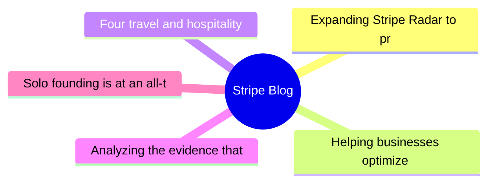
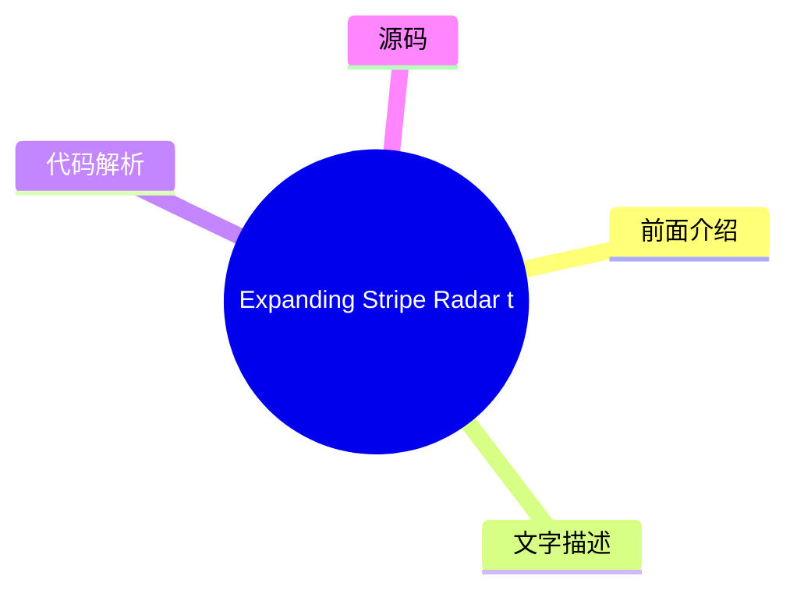
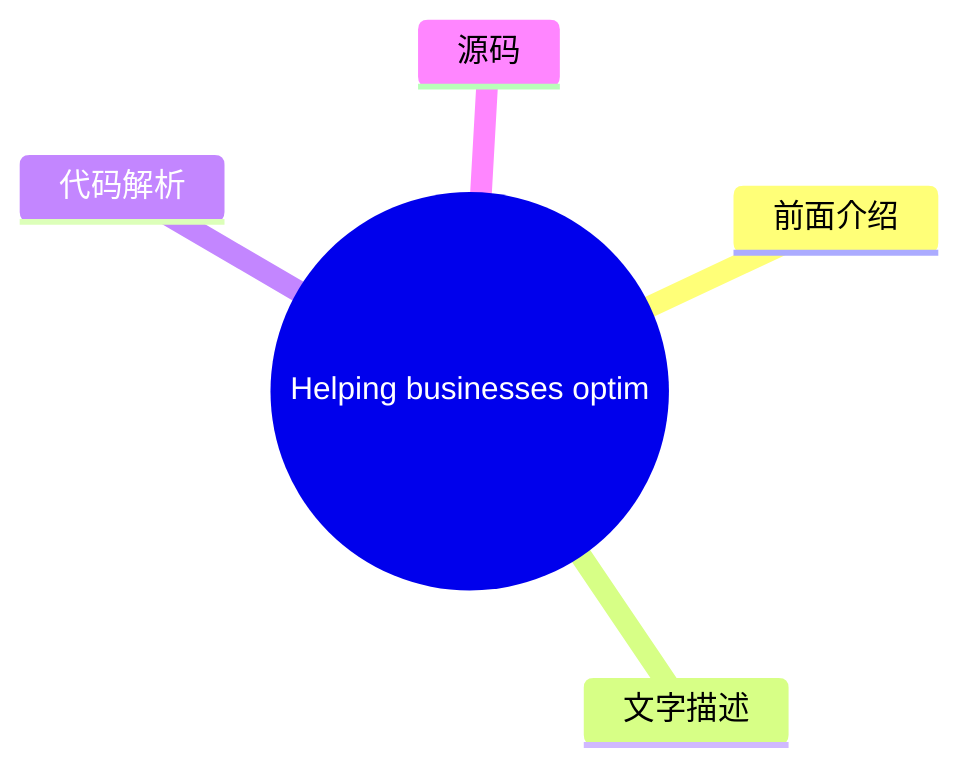
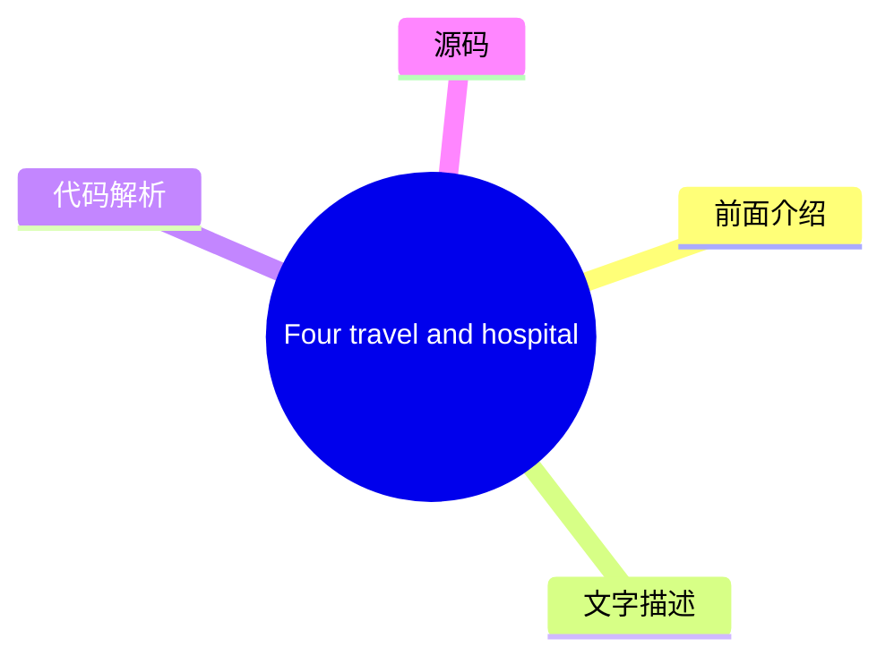
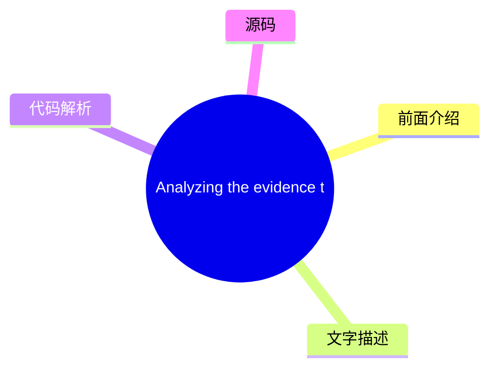
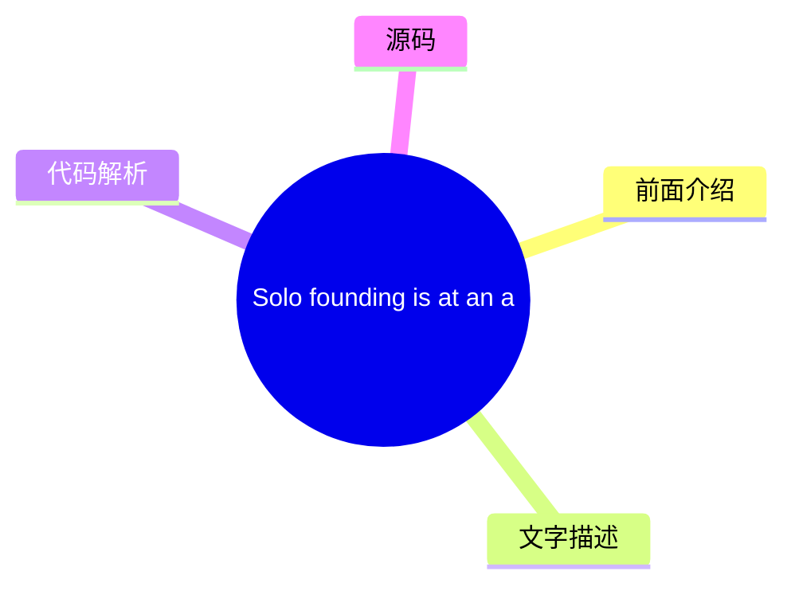

# 💳 Stripe Blog Top 5 (2026-08-04)

## 前面介绍

- 数据源：Stripe Blog
- 抓取日期：2026-08-04
- 条目数：5
- 含完整正文：5
- 含代码片段：0
- 组织方式：前面介绍 / 树状图 / 文字描述 / 代码解析 / 源码

## 思维导图

## 详细整理（5 条，5 条含全文，0 条含代码）

### 1. Expanding Stripe Radar to protect more of your business
- **链接**: [https://stripe.com/blog/expanding-stripe-radar-to-protect-more-of-your-business](https://stripe.com/blog/expanding-stripe-radar-to-protect-more-of-your-business)
- **发布**: Wed, 27 May 2026 00:00:00 +0000

#### 前面介绍

- Radar now blocks high-risk transactions across all supported payment methods; defends against new fraud types like multi-account abuse and pay-as-you-go abuse, regardless of which payment processor you use; and gives platforms new tools to evaluate a
- 发布时间：Wed, 27 May 2026 00:00:00 +0000

#### 树状图

#### 文字描述

- Last month at Stripe Sessions, we shared the biggest expansion we’ve ever made to [Stripe Radar](https://stripe.com/radar), our AI-powered fraud prevention tool. Radar now blocks high-risk transactions across all supported payment methods; defends against new fraud types like multi-account abuse and pay-as-you-go abuse, regardless of which payment processor you use; and gives p
- ## Protect more transactions with global payment coverage, new multiprocessor signals, and custom models Fraud protection is getting more complex. Businesses need to defend across a range of payment methods, and they need more precision in the signals they use to catch fraud before it happens—on and off Stripe. Radar now addresses both, along with the ability to use custom frau
- ## Defend against new types of fraud Fraudulent actors have become as sophisticated at stealing compute as they are at stealing money. They abuse policies by cycling through free trials, setting up multiple accounts, or intentionally not paying their next invoice. As businesses scale AI products, token abuse has become an expensive fraud vector. Last month, we shared how Radar 
- ## Protect your platform from account fraud Fraudulent actors are using generative AI to create fake identities, documents, and websites convincing enough to bypass many platforms’ verification systems. Platforms face a trade-off: request additional information during onboarding and increase friction, or keep the onboarding flow lightweight and take on potentially significant r

#### 代码解析

- 本文未检测到明确代码块，内容更偏新闻、观点或方法论。

#### 源码

#### 中文节选

Last month at Stripe Sessions, we shared the biggest expansion we’ve ever made to [Stripe Radar](https://stripe.com/radar), our AI-powered fraud prevention tool. Radar now blocks high-risk transactions across all supported payment methods; defends against new fraud types like multi-account abuse and pay-as-you-go abuse, regardless of which payment processor you use; and gives platforms new tools to evaluate and mitigate merchant risk on and off Stripe. We also launched additional ways to fight disputes with smarter evidence and automated evidence libraries.

Here’s a closer look at what we announced.

## Protect more transactions with global payment coverage, new multiprocessor signals, and custom models

Fraud protection is getting more complex. Businesses need to defend across a range of payment methods, and they need more precision in the signals they use to catch fraud before it happens—on and off Stripe. Radar now addresses both, along with the ability to use custom fraud models.

**Block high-risk transactions across all supported global payment methods
**

Radar now protects [all supported payment volume globally](https://docs.stripe.com/radar/local-payment-methods), including bank debits, buy now, pay later (BNPL) options, crypto, digital wallets, real-time payments, and cash vouchers. When Radar detects a fraudulent pattern on a transaction, that information becomes available to protect transactions across all payment methods. For example, if a fraudulent actor uses a stolen credit card at one business on Stripe, and we detect and block it, that same IP address and device fingerprint are now flagged across bank debits, wallets, and BNPL transactions network-wide. We found that Radar reduced suspected fraud by 71% during a five-month period for businesses using Affirm, Cash App, Klarna, and PayPal. 

**Improve your fraud decisioning with new multiprocessor signals
**

企业使用 Radar 的风险信号来处理 Stripe 以外的交易，以补充其内部欺诈模型，并在各个支付处理商处做出更精准的欺诈决策。现在，您可以通过针对 Stripe 以外交易的额外信号进一步改进欺诈决策，从而帮助您在欺诈发生前进行预防。

Stripe 现在可以识别支付是否可能触发卡组织的[早期欺诈警告](https://docs.stripe.com/radar/multiprocessor#early-fraud-warning)。然后，您可以选择主动退款该交易，以保护您的拒付率。

Stripe 还可以预测支付是否可能导致[欺诈性拒付](https://docs.stripe.com/radar/multiprocessor#fraudulent-dispute)。您可以使用此信号来发起退款、收集证据或调整您的拒付策略。

我们计划添加可在您整个支付体系中使用的新信号。

**访问企业级自定义欺诈模型**

对于风险概况更复杂的企业，Radar 现在提供[自定义欺诈模型](https://docs.stripe.com/radar/custom-

#### 完整正文（中文）

Last month at Stripe Sessions, we shared the biggest expansion we’ve ever made to [Stripe Radar](https://stripe.com/radar), our AI-powered fraud prevention tool. Radar now blocks high-risk transactions across all supported payment methods; defends against new fraud types like multi-account abuse and pay-as-you-go abuse, regardless of which payment processor you use; and gives platforms new tools to evaluate and mitigate merchant risk on and off Stripe. We also launched additional ways to fight disputes with smarter evidence and automated evidence libraries.

Here’s a closer look at what we announced.

## Protect more transactions with global payment coverage, new multiprocessor signals, and custom models

Fraud protection is getting more complex. Businesses need to defend across a range of payment methods, and they need more precision in the signals they use to catch fraud before it happens—on and off Stripe. Radar now addresses both, along with the ability to use custom fraud models.

**Block high-risk transactions across all supported global payment methods
**

Radar now protects [all supported payment volume globally](https://docs.stripe.com/radar/local-payment-methods), including bank debits, buy now, pay later (BNPL) options, crypto, digital wallets, real-time payments, and cash vouchers. When Radar detects a fraudulent pattern on a transaction, that information becomes available to protect transactions across all payment methods. For example, if a fraudulent actor uses a stolen credit card at one business on Stripe, and we detect and block it, that same IP address and device fingerprint are now flagged across bank debits, wallets, and BNPL transactions network-wide. We found that Radar reduced suspected fraud by 71% during a five-month period for businesses using Affirm, Cash App, Klarna, and PayPal. 

**Improve your fraud decisioning with new multiprocessor signals
**

Businesses use Radar’s risk signals for off-Stripe transactions to complement their in-house fraud models and make more precise fraud decisions across payment processors. Now, you can further improve your fraud decisioning with additional signals for off-Stripe transactions to help you prevent fraud before it happens.

Stripe can now identify whether a payment is [likely to trigger an early fraud warning](https://docs.stripe.com/radar/multiprocessor#early-fraud-warning) from the card network. You can then choose to proactively refund the transaction and protect your dispute rate. 

Stripe can also predict whether a payment is [likely to result in a fraudulent dispute](https://docs.stripe.com/radar/multiprocessor#fraudulent-dispute). You can use this signal to issue refunds, gather evidence, or adjust your dispute strategy. 

We plan to add new signals that can be used across your entire payments stack.

**Access enterprise-grade custom fraud models
**

For businesses with more complex risk profiles, Radar now offers [custom fraud models](https://docs.stripe.com/radar/custom-fraud-models). You can pass signals unique to your business to Stripe, such as product catalog data, loyalty status, behavioral metrics, or any structured metadata relevant to your risk profile. Stripe then combines this information with our global network data to deploy a model customized specifically to your business. For early adopters, custom models are detecting at least 15% more fraud with no increase in false positives.

## Defend against new types of fraud

Fraudulent actors have become as sophisticated at stealing compute as they are at stealing money. They abuse policies by cycling through free trials, setting up multiple accounts, or intentionally not paying their next invoice. As businesses scale AI products, token abuse has become an expensive fraud vector.

Last month, we shared how Radar addresses one of these fraud vectors with [free trial abuse prevention](https://stripe.com/blog/how-stripe-radar-helps-prevent-free-trial-abuse). At Sessions, we highlighted new ways to protect your business against multi-account abuse, pay-as-you-go fraud, and fraudulent bot-driven payments.

**阻止多账户滥用**

多账户滥用是指单个欺诈行为人创建多个账户，以重复使用促销优惠券，或将盗刷的卡交易分散到多个账户中，从而延长逃避检测的时间。在整个 Stripe 网络中，超过六分之一的 AI 公司注册用户与多账户滥用有关。

现在，Radar 可以[实时评估每个新账户](https://docs.stripe.com/radar/multi-account-and-account-sharing-abuse#multi-account-abuse)，以便您在滥用行为发生之前（无论是在 Stripe 内部还是外部）阻止可疑账户。我们的解决方案利用了整个 Stripe 网络中过往滥用行为的信息，包括设备指纹、IP 地址、电子邮件域名等。在过去的两个月里，ElevenLabs 每天成功阻止了 2,000 名用户滥用其免费层级。

**预测按量付费滥用**

按量付费滥用是指客户滥用您的服务，在账单到期时没有付款意图，却累积了使用费用。这些不良行为者利用了基于消费的定价结构，即费用在整个计费周期内累积，但付款发生在之后。例如，客户可能在一个月内消耗数千美元的计算资源，月底被计费，然后永远不付款。

Radar 现在可以帮助[在用量累积时预测未付款滥用](https://docs.stripe.com/radar/pay-as-you-go-abuse)，让您能够在客户被计费之前进行干预。这使您能够要求充值、切断服务，或采取任何符合您风险承受能力的措施。

**检测并防止欺诈机器人驱动的支付**

随着代理式商业的扩展，区分代表客户行事的合法代理和恶意机器人变得越来越重要。两者都是进行购买的非人类流量，但一个是客户授权的代理，另一个可能会利用您的结账流程购买库存有限商品、滥用促销定价或绕过购买限制。

Radar 现在为 Stripe Checkout 上的支付分配机器人评分，评估其是否由[恶意机器人完成](https://docs.stripe.com/radar/bot-abuse)的可能性。您可以使用此评分来执行反脚本或反机器人策略。例如，您可以阻止限量商品的自动购买，或将高频率订单标记为待审核。

## 保护您的平台免受账户欺诈

欺诈行为者正在使用生成式 AI 创建虚假身份、文件和网站，这些内容足以绕过许多平台的验证系统。平台面临一个权衡：在入职流程中要求提供额外信息并增加摩擦，还是保持入职流程轻量级并承担潜在的重大风险。

[平台现在可以利用 Radar 降低风险](https://docs.stripe.com/radar/radar-for-platforms)，其功能包括为每个业务和交易提供 0 到 100 的欺诈评分；解释为何账户被标记的 AI 驱动洞察；用于帮助您的团队了解账户背景的备注和账户历史记录；以及用于争议、拒付、退款和支付的账户级指标。

我们还引入了平台监控和评估商户风险的另外三种方式——在 Stripe 内部和外部。

- [欺诈网站](https://docs.stripe.com/radar/fraudulent-website)信号会像人类欺诈分析师那样分析企业的网站，寻找诸如以不切实际的价格出售奢侈品、AI 生成的文案、拼写错误的品牌网址或其他表明网站存在欺诈行为的迹象等危险信号。平台可以在入职流程期间使用此信号来自动验证、标记账户以进行人工审核，或在批准业务前将其作为自身风险评分的输入。
- [欺诈商户](https://docs.stripe.com/radar/fraudulent-merchant)信号根据对 Stripe 网络内模式的分析（包括银行账户信息、业务详情、交易活动和争议）来确定新账户或现有账户是否存在欺诈风险。然后，平台可以发起审核、暂停付款、暂停付款、拒绝账户、设置准备金或请求身份验证。

- [商家拖欠风险](https://docs.stripe.com/radar/merchant-delinquency-risk)信号预测企业是否面临产生负余额的风险；具体而言，它预测该余额是否可能持续为负 60 天或更长时间。平台可利用此信号来决定是否主动调整结算计划，对高风险账户要求预留金，或在损失累积之前标记商家以进行更深入的审查。

## 利用更智能的证据和自动证据库更有效地应对争议

[智能争议](https://docs.stripe.com/disputes/smart-disputes)是我们基于 AI 的争议管理产品，一直以来都会代表您整理并提交证据。现在，智能争议可以制定更定制化的策略，以提高您赢得每起争议的几率。

智能争议会分析每起争议，并为特定证据字段（如追踪号码或客户使用日志）提供 [AI 驱动的建议](https://docs.stripe.com/disputes/set-up-smart-disputes#provide-more-data-at-dispute-time)。通过智能争议添加我们 AI 推荐证据的企业，其胜诉频率比未添加任何证据的企业高出 3 倍。

我们还在减少提交证据所需的人工工作量。许多争议需要相同的支持材料：条款与条件、退货政策和服务协议。借助证据库，您只需上传并存储这些文档一次，智能争议便会根据争议原因代码、网络要求和持卡人主张，自动选择并将它们包含在您的证据包中——无需手动重新提交。

## 接下来是什么

在 Sessions 上，我们还发布了[我们的公开路线图](https://stripe.com/roadmap)：一份包含数百个详细条目的清单，涵盖 2027 年第一季度，其中包括 [Radar 产品、功能和改进](https://stripe.com/roadmap?product=Radar)。

To learn more about how Radar can protect your business, join us in major global cities for [Stripe Tour 2026](https://stripetour.com/). You can also [read our docs](https://docs.stripe.com/radar) or [get in touch](https://stripe.com/contact/sales) with an expert from our team.

### 2. Helping businesses optimize network costs with the Visa Digital Commerce Authentication Program (DCAP)
- **链接**: [https://stripe.com/blog/helping-businesses-optimize-network-costs-with-visa-digital-commerce-authentication-program](https://stripe.com/blog/helping-businesses-optimize-network-costs-with-visa-digital-commerce-authentication-program)
- **发布**: Wed, 03 Jun 2026 00:00:00 +0000

#### 前面介绍

- We moved quickly to help Stripe businesses take advantage of DCAP and capture interchange savings while protecting authorization rates. Here’s what we did.
- 发布时间：Wed, 03 Jun 2026 00:00:00 +0000

#### 树状图

#### 文字描述

- Visa recently launched the [Digital Commerce Authentication Program (DCAP)](https://support.stripe.com/questions/understand-the-visa-digital-commerce-authentication-program-%28dcap%29-on-stripe), a new global framework designed to reduce fraud and increase authorization rates for card-not-present transactions. The program rewards businesses in the US for sharing richer transact
- ### Optimizing DCAP savings without sacrificing conversion Before rolling out DCAP, we worked with Visa to run readiness testing and identify the right implementation approach. This collaborative testing underscored the need for transaction-level intelligence. With [Stripe Authorization Boost](https://stripe.com/authorization-boost), we intelligently select which transactions s
- ## Automatically benefit from DCAP optimizations If you use Authorization Boost and are collecting the required data points, you’re already automatically benefiting from DCAP optimizations. For businesses using [standalone 3DS](https://docs.stripe.com/payments/3d-secure/standalone-3d-secure), you can participate by setting **flow_preference[type]** to `data_share` on authentica

#### 代码解析

- 本文未检测到明确代码块，内容更偏新闻、观点或方法论。

#### 源码

#### 中文节选

Visa recently launched the [Digital Commerce Authentication Program (DCAP)](https://support.stripe.com/questions/understand-the-visa-digital-commerce-authentication-program-%28dcap%29-on-stripe), a new global framework designed to reduce fraud and increase authorization rates for card-not-present transactions. The program rewards businesses in the US for sharing richer transaction data with issuers during authentication, such as device ID, billing address, IP address, and customer email. Qualifying transactions receive a net interchange reduction of five basis points.

New network programs create opportunity, but they also introduce complexity. Businesses need to understand which transactions qualify, ensure their integration passes the required data, and determine whether participating will improve their end-to-end transaction economics or have unintended consequences, such as hurting authorization rates.

To participate in DCAP, businesses need to share required cardholder data with issuers via frictionless authentication in their checkout. This might introduce latency and uncertainty around how issuers interpret these newer signals.

We moved quickly to help Stripe businesses take advantage of DCAP and capture interchange savings while protecting authorization rates. Here’s what we did.

### Optimizing DCAP savings without sacrificing conversion

Before rolling out DCAP, we worked with Visa to run readiness testing and identify the right implementation approach. This collaborative testing underscored the need for transaction-level intelligence.

使用 [Stripe 授权增强](https://stripe.com/authorization-boost)，我们会智能选择哪些交易应该通过 [仅数据 3DS](https://docs.stripe.com/payments/3d-secure/strong-customer-authentication-exemptions#data-only)，该流程会从卡组织向发卡行发送额外的风险数据。与使用静态规则不同，授权增强会在交易级别评估成本节约、转化影响和欺诈风险，以确定何时应用仅数据 3DS。这使企业能够在限制对客户体验的影响并优化授权率的同时，捕获 DCAP 节省。

自 4 月 18 日以来，我们已帮助 Stripe 企业从 DCAP 中捕获了 1840 万美元的年度化网络成本节约。通过帮助企业收集和传递所需数据，我们观察到 DCAP 合格交易的数量增加了 8 倍。我们正在继续与 Visa 合作优化合格条件，以便更多交易能够受益于 DCAP。

## 自动受益于 DCAP 优化

如果您使用授权增强并正在收集所需的数据点，您已经自动受益于 DCAP 优化。对于使用 [独立 3DS](https://docs.stripe.com/payments/3d-secure/standalone-3d-secure) 的企业，您可以通过在认证请求上将 **flow_preference[type]** 设置为 `data_share` 并确保需要

#### 完整正文（中文）

Visa recently launched the [Digital Commerce Authentication Program (DCAP)](https://support.stripe.com/questions/understand-the-visa-digital-commerce-authentication-program-%28dcap%29-on-stripe), a new global framework designed to reduce fraud and increase authorization rates for card-not-present transactions. The program rewards businesses in the US for sharing richer transaction data with issuers during authentication, such as device ID, billing address, IP address, and customer email. Qualifying transactions receive a net interchange reduction of five basis points.

New network programs create opportunity, but they also introduce complexity. Businesses need to understand which transactions qualify, ensure their integration passes the required data, and determine whether participating will improve their end-to-end transaction economics or have unintended consequences, such as hurting authorization rates.

To participate in DCAP, businesses need to share required cardholder data with issuers via frictionless authentication in their checkout. This might introduce latency and uncertainty around how issuers interpret these newer signals.

We moved quickly to help Stripe businesses take advantage of DCAP and capture interchange savings while protecting authorization rates. Here’s what we did.

### Optimizing DCAP savings without sacrificing conversion

Before rolling out DCAP, we worked with Visa to run readiness testing and identify the right implementation approach. This collaborative testing underscored the need for transaction-level intelligence.

通过 [Stripe Authorization Boost](https://stripe.com/authorization-boost)，我们会智能选择哪些交易应通过 [Data Only 3DS](https://docs.stripe.com/payments/3d-secure/strong-customer-authentication-exemptions#data-only) 进行处理，该处理会从卡网络向发卡行发送额外的风险数据。与使用静态规则不同，Authorization Boost 会在交易层面评估成本节约、转化影响和欺诈风险，以确定何时应用 Data Only 3DS。这使企业能够在限制对客户体验的影响并优化授权率的同时，捕获 DCAP 节省。

自 4 月 18 日以来，我们已帮助 Stripe 企业从 DCAP 中捕获了 1840 万美元的年度化网络成本节约。通过帮助企业收集和传递所需数据，我们观察到符合 DCAP 条件的交易数量增加了 8 倍。我们正在继续与 Visa 合作优化资格条件，以便更多交易能够受益于 DCAP。

## 自动受益于 DCAP 优化

如果您使用 Authorization Boost 并正在收集所需的数据点，您已经自动受益于 DCAP 优化。对于使用 [standalone 3DS](https://docs.stripe.com/payments/3d-secure/standalone-3d-secure) 的企业，您可以通过在身份验证请求上将 **flow_preference[type]** 设置为 `data_share` 并确保填写了必填字段来参与其中。

了解更多关于 [Authorization Boost](https://docs.stripe.com/payments/analytics/optimization) 如何帮助优化您的支付绩效的信息。

### 3. Four travel and hospitality trends from HITEC 2026
- **链接**: [https://stripe.com/blog/trends-from-hitec](https://stripe.com/blog/trends-from-hitec)
- **发布**: Tue, 23 Jun 2026 00:00:00 +0000

#### 前面介绍

- More than 6,000 hospitality executives and operators gathered in San Antonio last week for the HITEC conference. The big topic: whether the industry’s AI investment is actually working. Across four days and over 50 meetings, four trends stood out.
- 发布时间：Tue, 23 Jun 2026 00:00:00 +0000

#### 树状图

#### 文字描述

- More than 6,000 hospitality executives and operators gathered in San Antonio last week for the annual HITEC hospitality technology conference, including leaders from Wyndham Hotels & Resorts, Hyatt, IHG Hotels & Resorts, Starwood Hotels, and hundreds of independent properties. The big topic: whether the industry’s AI investment is actually working. IDC forecasts that [30%](http
- ## The race for direct bookings has moved from search rankings to AI answers For years, the hospitality industry’s answer to online travel agency (OTA) dependency was SEO: invest in content, improve search rankings, and convert guests before they end up on Expedia or Booking.com. That approach is becoming less effective. Jack Wang, principal solution engineer at Salesforce, off
- ## Most hospitality AI is falling short in a predictable way An uncomfortable truth surfaced repeatedly throughout HITEC: much of the AI scaling happening across hospitality is fragile. The majority of businesses are adopting AI without the strategic clarity, data foundation, and operational architecture to sustain it. The root cause is often fragmented data. Siloed property ma
- ## Payments friction has a measurable cost, but most hotels still don’t know what it is The hospitality industry has historically treated payments as a cost and commodity: something to keep running, minimize fees on, and keep out of the way. Many of the payments-specific conversations we had at HITEC revolved around how that approach is changing, along with a growing recognitio

#### 代码解析

- 本文未检测到明确代码块，内容更偏新闻、观点或方法论。

#### 源码

#### 中文节选

More than 6,000 hospitality executives and operators gathered in San Antonio last week for the annual HITEC hospitality technology conference, including leaders from Wyndham Hotels & Resorts, Hyatt, IHG Hotels & Resorts, Starwood Hotels, and hundreds of independent properties.

The big topic: whether the industry’s AI investment is actually working. IDC forecasts that [30%](https://www.idc.com/resource-center/blog/agentic-ai-will-redefine-travel-and-hospitality-in-2026/) of all travel bookings will be made by AI agents by 2030. But the gap between where the industry is headed and what it’s currently equipped to support is wide.

While 25% of hospitality businesses report actively scaling AI today, fewer than 10% are considered “AI future-built,” according to [BCG](https://www.bcg.com/publications/2026/ai-first-hotels-leaner-faster-smarter)—meaning they have AI embedded across core operations, a supporting data foundation, and measurable returns to show for it. “A lot of companies are throwing spaghetti at the wall to see if it sticks,” said Dale Gomez, associate teaching professor in hospitality technology at Florida International University. “They want to see ROI.” 

Other shifts are already underway. Many hospitality businesses still lack the modern financial infrastructure needed to fully benefit from the automation, speed, and interoperability AI is expected to drive. Payment systems once considered “good enough” are now costing measurable revenue, and rising guest expectations have turned inefficient technology from a minor inconvenience to a reason not to return.

Across four days and over 50 meetings, four trends stood out.

## The race for direct bookings has moved from search rankings to AI answers

For years, the hospitality industry’s answer to online travel agency (OTA) dependency was SEO: invest in content, improve search rankings, and convert guests before they end up on Expedia or Booking.com. That approach is becoming less effective.

Jack Wang, principal solution engineer at Salesforce, offered data that spotlights a shift: 65% of Google searches that trigger an AI Overview now end without the user clicking any website. On mobile, that number climbs to 78%. Traditional search traffic is declining roughly 25% across the industry, as AI-generated summaries replace the ranked link lists that SEO was designed to win.

Inclusion in an AI-generated answer requires something different from what SEO rewards. SEO responds to keyword density, backlinks, and page authority. AI inclusion responds to the accuracy and machine-readability of structured property data, like room types, amenity details, policies, local context, or cancellation terms. A hotel can rank well in traditional search and be invisible to an LLM: over [90%](https://www.nokumo.net/en/ai-visibility-in-hospitality-what-3-600-ai-responses-and-1-337-website-audits-reveal?utm_campaign=ennismore-proves-tech-investment-pays-off-and-94-of-hotels-are-invisible-to-ai) of accommodatio

#### 完整正文（中文）

More than 6,000 hospitality executives and operators gathered in San Antonio last week for the annual HITEC hospitality technology conference, including leaders from Wyndham Hotels & Resorts, Hyatt, IHG Hotels & Resorts, Starwood Hotels, and hundreds of independent properties.

The big topic: whether the industry’s AI investment is actually working. IDC forecasts that [30%](https://www.idc.com/resource-center/blog/agentic-ai-will-redefine-travel-and-hospitality-in-2026/) of all travel bookings will be made by AI agents by 2030. But the gap between where the industry is headed and what it’s currently equipped to support is wide.

While 25% of hospitality businesses report actively scaling AI today, fewer than 10% are considered “AI future-built,” according to [BCG](https://www.bcg.com/publications/2026/ai-first-hotels-leaner-faster-smarter)—meaning they have AI embedded across core operations, a supporting data foundation, and measurable returns to show for it. “A lot of companies are throwing spaghetti at the wall to see if it sticks,” said Dale Gomez, associate teaching professor in hospitality technology at Florida International University. “They want to see ROI.” 

Other shifts are already underway. Many hospitality businesses still lack the modern financial infrastructure needed to fully benefit from the automation, speed, and interoperability AI is expected to drive. Payment systems once considered “good enough” are now costing measurable revenue, and rising guest expectations have turned inefficient technology from a minor inconvenience to a reason not to return.

Across four days and over 50 meetings, four trends stood out.

## The race for direct bookings has moved from search rankings to AI answers

For years, the hospitality industry’s answer to online travel agency (OTA) dependency was SEO: invest in content, improve search rankings, and convert guests before they end up on Expedia or Booking.com. That approach is becoming less effective.

Salesforce 的首席解决方案工程师 Jack Wang 提供的数据凸显了一种转变：现在，有 65% 的触发 AI 概览的 Google 搜索最终都没有用户点击任何网站。在移动端，这一数字上升至 78%。随着 AI 生成的摘要取代了 SEO 旨在赢得的排名链接列表，传统搜索流量在整个行业下降了约 25%。

被 AI 生成的答案收录需要与 SEO 奖励的内容不同。SEO 响应的是关键词密度、反向链接和页面权威性。AI 收录响应的是结构化属性数据的准确性和机器可读性，如房型、设施详情、政策、本地背景或取消条款。一家酒店可能在传统搜索中排名很高，但在 LLM 中却不可见：超过 [90%](https://www.nokumo.net/en/ai-visibility-in-hospitality-what-3-600-ai-responses-and-1-337-website-audits-reveal?utm_campaign=ennismore-proves-tech-investment-pays-off-and-94-of-hotels-are-invisible-to-ai) 的住宿网站仍被 AI 模型遗漏。

我们已经看到了下游效应。根据 Phocuswright 的研究，[56%](https://www.phocuswire.com/news/online/shift-travel-behavior-ai-surge-phocuswright-research) 的旅行者在过去 12 个月中曾使用 AI 进行行程规划、预订或在目的地协助。对于运营商来说，第一步是审计，而不是投资。您潜在客人使用的 LLM 能准确描述您酒店的房型、设施、政策和本地背景吗？如果答案是否定的，这个差距很可能会让您损失预订。

今天，酒店集团可以访问与 OTA 相同的结账和支付工具，包括本地支付方式和货币、一键结账以及全球欺诈保护。捕捉代理需求的旅游品牌正在将 AI 驱动的可发现性与准确的实时库存以及高效的现代结账体验相结合。

## 大多数酒店 AI 都以可预测的方式未能达标

HITEC 上反复出现了一个令人不安的事实：酒店业正在发生的许多 AI 扩展都是脆弱的。大多数企业都在采用 AI，但缺乏维持其发展的战略清晰度、数据基础和运营架构。

根本原因通常是数据碎片化。孤立的物业管理系统、CRM、忠诚度、餐饮和支付系统各自只持有关于同一客人的部分视图——而 AI 推荐的准确性仅取决于它们所调用的内容。同样的数据问题在 AI 个性化失效时，在财务上表现为过度的对账时间，在运营上表现为不完整的客人档案，在客人体验上表现为摩擦。

Salesforce 首席解决方案工程师 Amanda Sharp 将这一问题重构为 AI 运营化，而非采用，并呼吁“氛围运营”：这是酒店业对“氛围编码”的回应。如今，许多酒店品牌构建 AI 功能已成为可能。但在生产环境中可靠地运行它们，并将其集成到触发实际操作的现有工作流程中，则要困难得多。

在这方面做得好的企业拥有干净、连接的数据，能够在采取行动的时机内，将有用的情报直接传递到工作流程中。例如，达美航空在其移动应用中内置了实时 AI 礼宾，并使用 SkyMiles 档案和运营数据，在客户关怀体验中提供上下文感知的支持。在 Wynn Las Vegas，当业绩低于目标时，收益经理会收到预测性警报以及附带的建议行动。

对于大多数旅游运营商来说，瓶颈在于数据连接，而非模型质量。

## 支付摩擦具有可衡量的成本，但大多数酒店仍不知道其具体数值

The hospitality industry has historically treated payments as a cost and commodity: something to keep running, minimize fees on, and keep out of the way. Many of the payments-specific conversations we had at HITEC revolved around how that approach is changing, along with a growing recognition that payments have become a key factor in how hospitality brands compete. Our own data supports this: in a Stripe-commissioned [survey](https://go.stripe.global/rs/072-MDK-283/images/Skift_x_Stripe_How_Payment_Systems_Are_Changing_in_Travel_and_Hospitality.pdf) of nearly 400 hospitality executives, 90% said payments are important to growth, and 37% said that a lack of payment options has the greatest negative impact on the guest experience. In addition, 58% said their fraud systems block legitimate transactions, and 74% reported that fragmented systems cause their teams to spend excessive time on reconciliation.

Those figures highlight why payments have become a structural advantage. OTAs can afford to staff payments at scale because their revenue justifies the head count. Independent hotels and smaller operators can’t match that investment directly, but a lean team on the right infrastructure can now support payment methods across dozens of countries at a fraction of the cost of a large in-house operation.

A coverage gap translates directly to lost bookings. “The moment we don’t support [a payment method] is the moment this guest goes elsewhere, to a platform or channel that supports their preferred way to pay,” said Sebastien Leitner, VP of strategic partnerships at Cloudbeds. Guests book where their preferred payment method works. A property that doesn’t support the dominant method in a target market isn’t just creating friction—it’s routing that booking to an OTA that does.

## The best hospitality technology is the kind that goes unnoticed

“对于那些无法正常工作的技术，人们毫无同情心，”Oracle Hospitality 全球战略与产品管理副总裁 Tanya Pratt 说道。“如果它无法运行，它造成的挫败感将比在前台排长队更严重，因为人们已经习惯了排长队。”当技术失效时，客人并不总是会投诉。他们只是不再回来。

成功的真正衡量标准在于，技术运作得足够好，以至于客人根本不会去想它。喜达屋酒店（Starwood Hotels）的首席信息官 Denise Walker 描述了这一愿景：一位回头客抵达时，房间温度适宜，电视上播放着他们偏好的频道，床上的枕头硬度也符合他们的偏好。没有人会宣布他们是如何知道的。“它不需要以一种‘你怎么知道这些的？’的方式来呈现。”

拉斯维加斯永利度假村酒店运营副总裁 Shannon McCallum 进一步说道：“我们正在从‘我告诉了你这些，所以你知道关于我的事’向‘我什么都没告诉你，而现在你却在预测它’转变。”

无论是这种无形的个性化服务，还是它所支持的人性化时刻，都需要一个连接数据的基石——即能够整合现有技术栈、将客人信息整合到单一系统中的技术。这种基础设施使企业能够在客人浏览网站或站在前台时识别出同一位客人。

## Stripe 如何提供帮助

越来越多的客人将通过 AI 助手而不是搜索引擎找到您的物业。他们预订的行程可能由代理完成。而区分高绩效运营商的营收将来自于能够实现转化的支付体验、覆盖每个市场的支付方式以及协同运作的财务系统。Stripe 数据管道将支付数据与您的预订和客户系统连接起来，为运营商提供统一的营收视图，而无需依赖拼接在一起的报告。

Stripe 的支付基础设施帮助酒店运营商保护营收、提升客人在店内的消费，并简化运营。

**Drive direct bookings.** Across the payment methods guests actually use and in every market you serve, payment experiences that convert help keep bookings on your direct channel. As agentic commerce scales, that means fraud detection that runs on every Stripe transaction by default and payment tokens that allow agents to transact without exposing guest credentials. 

**Increase trip spend.** Ancillary revenue from dining, experiences, and partnerships requires payments infrastructure that works across the property, supports new business models, and connects with external partners. Stripe Billing handles the recurring payment logic behind membership and loyalty programs, including automatic renewals, tiered pricing, and failed payment recovery—without requiring operators to maintain that infrastructure themselves. [Cloudbeds](https://stripe.com/customers/cloudbeds), for example, saw 15% revenue growth for businesses using Cloudbeds Payments and a 14.8% average increase in revenue for businesses expanding payment methods by directly removing payment friction through its Stripe partnership.

**Cut costs.** More efficient B2B money movement and fraud protection reduce reconciliation work and limit losses, freeing up margin without adding staff.

[Learn more](https://stripe.com/industries/travel) about how Stripe supports hospitality businesses, or [get in touch](https://stripe.com/contact/sales).

### 4. Analyzing the evidence that helps businesses win “product not received” disputes
- **链接**: [https://stripe.com/blog/analyzing-the-evidence-that-helps-businesses-win-product-not-received-disputes](https://stripe.com/blog/analyzing-the-evidence-that-helps-businesses-win-product-not-received-disputes)
- **发布**: Tue, 21 Jul 2026 00:00:00 +0000

#### 前面介绍

- To understand what can influence win rates, we analyzed evidence packets from one million disputes over a 16-week period. Here’s what the data shows and what it means for how you mitigate disputes.
- 发布时间：Tue, 21 Jul 2026 00:00:00 +0000

#### 树状图

#### 文字描述

- “[Product not received](https://docs.stripe.com/disputes/categories)” disputes—where a cardholder claims they didn’t receive what they paid for—are the most common nonfraud dispute category on Stripe. It can be challenging to know which claims are legitimate and which are not: some customers genuinely never received what they paid for, while others incorrectly claim they didn’t
- ## Businesses that submitted evidence after the delivery was confirmed saw a 27 percentage point higher win rate Many businesses submit a shipping tracking ID as proof of delivery. However, depending on the status of the package at the time you submit the evidence, the tracking number might only confirm that the package left your facility. Our analysis found that win rates incr
- ## Businesses that submitted digital activity and usage logs saw a 10 percentage point higher win rate Businesses selling digital goods also need to provide proof of fulfillment, though the supporting evidence looks different. Disputes with digital activity and usage logs—such as JSON telemetry logs from common analytics platforms showing that a user streamed, downloaded, or ac
- ## Businesses that included evidence of a refund issued through Stripe saw a 63 percentage point higher win rate Cardholders can still initiate [a dispute even after a refund has been processed](https://support.stripe.com/questions/disputes-on-a-refunded-transaction-faq), often because the refund and dispute were filed around the same time or because the issuing bank didn’t che

#### 代码解析

- 本文未检测到明确代码块，内容更偏新闻、观点或方法论。

#### 源码

#### 中文节选

“[未收到商品](https://docs.stripe.com/disputes/categories)” 争议——即持卡人声称他们没有收到所付款项——是 Stripe 上最常见的非欺诈争议类别。很难判断哪些索赔是合理的，哪些不是：有些客户确实从未收到他们所付款项，而另一些人则错误地声称没有收到订单。

为了了解什么会影响胜诉率，我们在 16 周的时间内分析了 100 万起争议的证据包。我们将包含各种类型证据（如投递确认或内容消费日志）的争议的胜诉率与不包含这些证据的争议进行了比较，从而确定了哪些特征与更高的胜诉率相关。

以下是数据对广大企业的普遍情况、销售数字商品的企业有何不同，以及这对您如何缓解争议意味着什么。

**提交了投递信息的企业胜诉率高出 44 个百分点**

对于销售实物商品的企业，有投递确认作为证据的争议的胜诉率比没有投递确认的争议高出 27 个百分点。添加 GPS 投递地图作为证据（显示承运商扫描包裹的位置）在仅有投递确认的基础上又提高了 15 个百分点的胜诉率。而包含收件人签名作为证据则进一步提高了 2 个百分点的胜诉率。综合来看，包含投递确认、GPS 地图和签名的争议的胜诉率比没有这些证据的争议高出 44 个百分点。

然而，许多企业仍然没有在争议回应中包含投递确认。这种差距的一部分是由于意识不足，但更大的障碍在于运营。对于大多数企业来说，运输数据和争议工作流位于不同的系统中。将特定争议与正确的订单及已确认的投递状态进行匹配通常需要手动操作，且难以扩展。

## 在投递确认后提交证据的企业胜诉率高出 27 个百分点

许多企业会提交运输跟踪 ID 作为交付证明。然而，取决于您提交证据时包裹的状态，该跟踪号可能仅能确认包裹已离开您的设施。

我们的分析发现，企业提交跟踪 ID 时显示的内容会影响胜诉率——具体而言，即是否已确认交付。在确认交付后提交证据的纠纷，其胜诉率比未确认交付的纠纷高出 27 个百分点。另一方面，在包裹仍在运输途中时提交证据的纠纷，其胜诉率仅比未确认交付的纠纷高出 2 个百分点。

这表明证据提交的时机很重要。客户可能会在订单到达之前就提起“未收到商品”的纠纷，尤其是当发货延迟或仍在运输途中时。因为大多数企业

#### 完整正文（中文）

“[未收到商品](https://docs.stripe.com/disputes/categories)” 争议——即持卡人声称他们没有收到所付款项——是 Stripe 上最常见的非欺诈争议类别。很难判断哪些索赔是合理的，哪些不是：有些客户确实从未收到他们所付款项，而另一些人则错误地声称没有收到订单。

为了了解什么会影响胜诉率，我们在 16 周的时间内分析了 100 万起争议的证据包。我们将包含各种类型证据（如投递确认或内容消费日志）的争议的胜诉率与不包含这些证据的争议进行了比较，从而确定了哪些特征与更高的胜诉率相关。

以下是数据对广大企业的普遍情况、销售数字商品的企业有何不同，以及这对您如何缓解争议意味着什么。

**提交了投递信息的企业胜诉率高出 44 个百分点**

对于销售实物商品的企业，有投递确认作为证据的争议的胜诉率比没有投递确认的争议高出 27 个百分点。添加 GPS 投递地图作为证据（显示承运商扫描包裹的位置）在仅有投递确认的基础上又提高了 15 个百分点的胜诉率。而包含收件人签名作为证据则进一步提高了 2 个百分点的胜诉率。综合来看，包含投递确认、GPS 地图和签名的争议的胜诉率比没有这些证据的争议高出 44 个百分点。

然而，许多企业仍然没有在争议回应中包含投递确认。这种差距的一部分是由于意识不足，但更大的障碍在于运营。对于大多数企业来说，运输数据和争议工作流位于不同的系统中。将特定争议与正确的订单及已确认的投递状态进行匹配通常需要手动操作，且难以扩展。

## 在投递确认后提交证据的企业胜诉率高出 27 个百分点

许多企业会提交运输追踪 ID 作为交付证明。然而，取决于您提交证据时包裹的状态，该追踪号可能仅能确认包裹已离开您的设施。

我们的分析发现，企业提交追踪 ID 时显示的内容会影响胜诉率——具体而言，即是否已确认交付。在确认交付后提交证据的争议，其胜诉率比未确认交付的争议高出 27 个百分点。另一方面，在包裹仍在运输途中时提交证据的争议，其胜诉率仅比未确认交付的争议高出 2 个百分点。

这表明证据提交的时机很重要。客户可能会在订单到达之前就提起“未收到商品”的争议，尤其是当发货延迟或仍在运输途中时。由于大多数企业有 20 天或更长的回复时间，如果您的争议处理窗口允许，请考虑等到承运商确认到达后再提交。如果您确实需要在确认交付之前提交，请考虑包含显示订单仍在客户在结账时同意的交付时间范围内的文档。

## 提交数字活动和使用日志的企业胜诉率高出 10 个百分点

销售数字商品的企业也需要提供履行证明，尽管支持证据的形式不同。

包含数字活动和使用日志（例如来自常见分析平台的显示用户流媒体播放、下载或访问其购买的具体产品的 JSON 遥测日志）的争议，其胜诉率比没有这些证据的争议高出 10 个百分点。而包含服务文档（如配置记录）的争议，其胜诉率比没有这些证据的争议高出 8 个百分点。

这种模式反映了我们在销售实物商品的企业中发现的情况：具体细节总是更好的。服务文档可能只能证明客户有权访问。另一方面，内容消费日志可以证明客户流式传输、下载或访问了他们付费购买的具体产品。

## 包含通过 Stripe 发放的退款证据的企业，胜诉率高出 63 个百分点

持卡人仍可能在退款已处理完毕后发起[争议](https://support.stripe.com/questions/disputes-on-a-refunded-transaction-faq)，这通常是因为退款和争议是在同一时间提出的，或者是发卡行在提出争议前未检查退款状态。当这种情况发生时，许多企业会在争议回复中包含退款证据，以证明他们已经让客户满意。但我们的分析显示，对于销售数字商品的企业，“退款证明”对胜诉率的影响取决于退款是如何处理的。

通过 Stripe 发放的全额退款是销售数字商品的企业高胜诉率的最强预测指标。包含此类证据的争议，其胜诉率比不包含此类证据的争议高出 63 个百分点。另一方面，通过其他渠道（如商店积分）发放的退款，其争议的胜诉率仅比不包含此类证据的争议高出 6 个百分点。

这可能是因为发卡行只能对它们能够验证的信息采取行动。当退款通过支付处理商处理时，发卡行可以验证卡网络上的信用额度。发卡行无法以同样的方式验证在支付处理商之外发放的退款；因为没有记录。

## Stripe 如何提供帮助

[智能争议](https://docs.stripe.com/disputes/smart-disputes)旨在为您应用这些最佳实践，帮助您节省时间并挽回收入。它使用人工智能为符合条件的卡争议自动组装量身定制的证据包，应用本分析中确定的基于数据的最佳实践，因此您无需逐笔争议手动实施这些实践。

通过在收到争议时向 Smart Disputes 提供承运商和追踪号码，您可以提高胜诉率。Stripe 支持超过 12 家承运商，并会自动与它们合作，拉取完整的履约历史记录，例如投递状态、时间戳和位置数据。您还可以添加任何其他证据，例如客户沟通记录或补充文件，Stripe 会将其与自动生成的证据包合并，以创建最强有力的回复。

随后，Stripe 会将这些信息为您组装成一份引人注目的证据包，并根据具体的争议（包括网络、地区、发卡行和原因代码）优化证据包的内容和结构。如果您在争议截止日期前未采取任何行动，Smart Disputes 将代表您提交证据，以确保不会因错过截止日期而导致争议失败。

如果您已经使用 Stripe，则无需进行额外的集成。要了解更多关于 Smart Disputes 的信息，请阅读我们的文档。

*此处包含的见解、预测和前瞻性陈述仅供参考，不应依赖。这些内容基于假设和目前可获得的信息，但实际结果可能会有重大差异。*

### 5. Solo founding is at an all-time high: Top performers have these traits in common
- **链接**: [https://stripe.com/blog/top-solo-founder-traits](https://stripe.com/blog/top-solo-founder-traits)
- **发布**: Thu, 28 May 2026 00:00:00 +0000

#### 前面介绍

- In 2025, solo founders in the top decile generated 61 times the revenue of the median solo founder in their first six months. We analyzed the data to understand what drives that gap.
- 发布时间：Thu, 28 May 2026 00:00:00 +0000

#### 树状图

#### 文字描述

- Solo startup founders, defined here as people who launched a startup through Stripe Atlas without any cofounders, account for 63% of C corps formed so far in the second quarter of 2026—an all-time high. As more founders start companies on their own, the gap between typical companies and top performers is widening. Among solo-founded startups incorporated through Atlas, median i
- ## 1. They build AI-native products The most successful solo founders are building AI-native products, meaning the product’s core functionality depends on AI models. Top-decile solo founders were about twice as likely as median founders to be building AI-native companies. The next generation of solo founders will be less defined by technical pedigree and more by speed,” says [M
- ## 2. They sell globally from launch In the first month, top-decile solo founders sold into an average of 10 countries, versus just three for median solo founders. That gap continued to widen over time. By month 24, top-decile solo founders were selling into 40 non-US countries, on average, compared to six for median solo founders. Top solo founders also generated a much larger
- ## 3. They build for businesses Top solo founders were nearly 30% more likely than middle-decile founders to build B2B businesses. “I grew my SaaS to €10K MRR without ads by talking to users every day, only building features that multiple customers asked for, and focusing on being the best service in my specific niche,” says [Pauline Clavelloux](https://x.com/Pauline_Cx), who s

#### 代码解析

- 本文未检测到明确代码块，内容更偏新闻、观点或方法论。

#### 源码

#### 中文节选

Solo startup founders，在此定义为通过 Stripe Atlas 独自创办公司且没有联合创始人的个人，占 2026 年第二季度迄今成立的 C corps 的 63%——创历史新高。

随着更多创始人独自创办公司，典型公司与顶尖表现者之间的差距正在拉大。在通过 Atlas 成立的 solo-founded startups 中，2025 年的中位初始六个月收入同比下降 23%，而顶层十分位（top decile）的收入则增长了 19%。

四年前，顶层十分位的 solo founders 在前六个月的收入约为中位 solo founders 的 34 倍。到 2025 年，这一数字已增长至 61 倍。自 2022 年以来，年收入超过 10 万美元的 solopreneurs 数量增加了 [三分之一](https://x.com/emilygsands/status/2049943675485253640)。

随着 AI 工具让一个人能够更轻松地构建、发布、支持客户和迭代，值得思考的是，是什么将那些爆发的公司与那些没有爆发的公司区分开来。为了了解这种差异，我们分析了 2022 年和 2023 年成立的数千家 solo-founded Atlas startups，每家至少都有两年的收入数据。在该群体中，我们将中位十分位的 solo founders 与前两年总收入处于顶层十分位的人进行了比较，以了解是什么区分了最强的异常值。顶层十分位中出现了几种模式。

## 1. 他们构建 AI 原生产品

最成功的 solo founders 正在构建 AI 原生产品，这意味着产品的核心功能依赖于 AI 模型。顶层十分位的 solo founders 构建原生 AI 公司的可能性约为中位 founders 的两倍。“下一代 solo founders 将不再由技术背景定义，而是由速度定义，”[Marc Lou](https://marclou.com/) 说，他独自创办了 34 家初创公司。“他们将是无代码人员，专注于解决问题，利用 AI 极速发布，并在社交媒体上破解分发渠道。”

到两年节点时，AI原生个人创业公司的收入几乎是其他个人创立创业公司的两倍。起初，我们预期这一结果是由少数几家表现突出的公司拉高了平均值，但事实并非如此：99百分位数的收入在AI原生和其他创业公司之间几乎相同。差异来自于更广泛的分布，AI原生创业公司在大约第50到第95百分位的表现优于其他公司。

## 2. 它们在启动时就进行全球销售

在第一个月，前十分位数的个人创始人平均销售到10个国家，而中位数个人创始人仅为3个。随着时间的推移，这一差距持续扩大。到第24个月，前十分位数的个人创始人平均销售到40个非美国国家，而中位数个人创始人仅为6个。

顶尖的个人创始人也从其本土市场之外获得了更大比例的收入。国际销售占前十分位数个人创始人收入的51%，而中位数个人创始人仅为2%。其中的大部分差异

#### 完整正文（中文）

Solo startup founders，在此定义为通过 Stripe Atlas 独自创办公司且没有联合创始人的个人，占 2026 年第二季度迄今成立的 C corps 的 63%——创历史新高。

随着更多创始人独自创办公司，典型公司与顶尖表现者之间的差距正在拉大。在通过 Atlas 成立的 solo-founded startups 中，2025 年的中位初始六个月收入同比下降 23%，而顶层十分位（top decile）的收入则增长了 19%。

四年前，顶层十分位的 solo founders 在前六个月的收入约为中位 solo founders 的 34 倍。到 2025 年，这一数字已增长至 61 倍。自 2022 年以来，年收入超过 10 万美元的 solopreneurs 数量增加了 [三分之一](https://x.com/emilygsands/status/2049943675485253640)。

随着 AI 工具让一个人能够更轻松地构建、发布、支持客户和迭代，值得思考的是，是什么将那些爆发的公司与那些没有爆发的公司区分开来。为了了解这种差异，我们分析了 2022 年和 2023 年成立的数千家 solo-founded Atlas startups，每家至少都有两年的收入数据。在该群体中，我们将中位十分位的 solo founders 与前两年总收入处于顶层十分位的人进行了比较，以了解是什么区分了最强的异常值。顶层十分位中出现了几种模式。

## 1. 他们构建 AI 原生产品

最成功的 solo founders 正在构建 AI 原生产品，这意味着产品的核心功能依赖于 AI 模型。顶层十分位的 solo founders 构建原生 AI 公司的可能性约为中位 founders 的两倍。“下一代 solo founders 将不再由技术背景定义，而是由速度定义，”[Marc Lou](https://marclou.com/) 说，他独自创办了 34 家初创公司。“他们将是无代码人员，专注于解决问题，利用 AI 极速发布，并在社交媒体上破解分发渠道。”

到两年节点时，AI 原生个人初创公司的营收几乎是其他个人创立初创公司的两倍。起初，我们预计这一结果是由少数几家爆发式增长的公司拉高了平均值，但事实并非如此：99 分位数的营收对于 AI 原生和其他初创公司来说几乎相同。差异来自于更广泛的分布，AI 原生初创公司在大约第 50 到第 95 个百分位的表现优于其他初创公司。

## 2. 它们在启动时就面向全球销售

在第一个月，前十分位数的个人创始人平均销售到 10 个国家，而中位数个人创始人仅为 3 个。随着时间的推移，这一差距持续扩大。到第 24 个月，前十分位数的个人创始人平均销售到 40 个非美国国家，而中位数个人创始人仅为 6 个。

顶尖的个人创始人也从非本土市场获得了更大比例的营收。国际销售占前十分位数个人创始人营收的 51%，而中位数个人创始人仅为 2%。这种差异很大程度上取决于创始人的所在地：前十分位数的个人创始人略微更有可能位于美国以外，因此许多人很早就开始向美国销售。由于美国通常是软件最大的且消费最高的市场，尽早在那里销售可以加速增长。

## 3. 它们面向企业客户构建产品

顶尖的个人创始人构建 B2B 业务的概率比中十分位数的创始人高出近 30%。“我通过每天与用户交谈，只构建多位客户要求的功能，并专注于成为我特定细分领域最好的服务，将我的 SaaS 营收增长到了 1 万欧元 MRR，且没有使用广告，”[Pauline Clavelloux](https://x.com/Pauline_Cx) 说道，她独自创立了四家公司，包括 [Refindie](https://www.refindie.com/)。

B2B 个人创始人在各方面表现都更好。到第 24 个月，中位数个人 B2B 创始人的营收是中位数个人 B2C 创始人的四倍多。

这一模式在顶尖表现者中依然成立。前十分位数的个人 B2B 创始人的营收几乎是他们的 B2C 同行的两倍。

A common assumption is that this is mainly driven by funding, since B2B founders tend to raise capital more easily. The data suggests otherwise. Even among bootstrapped startups, solo B2B founders generated more revenue than solo B2C founders at both the median and the top decile.

## 4. They have higher customer retention early on

Top solo founders retained a much larger share of their first-month customers than middle-decile founders, suggesting they reach product-market fit earlier. “Validate with paying users before you invest too much time or money,” says Clavelloux. “Progress over perfection: launch fast and iterate often.”

Nearly 30% of customers at top-decile solo startups returned the following month, compared with 8% at middle-decile startups. By the sixth month, top-decile solo founders also began winning back churned customers—roughly three months sooner than middle-decile founders.

That early retention advantage pays off over time. By the start of the second year, customers acquired in the company’s first month were spending 47% more at top-decile startups than they were initially—about twice the increase seen at middle-decile startups.

This contrast was especially pronounced in B2B businesses. Among solo-founded B2B startups, top-decile founders retained first-month customers at six times the rate of median founders.

Part of the reason top solo founders retained more customers might be that they were much more likely to use recurring billing. Based on Stripe data, top-decile B2B and B2C founders were 26 and 20 percentage points more likely to use a recurring billing model than their middle-decile peers, respectively.

While these patterns highlight what many top solo founders have in common, they don’t show how solo-founded companies stack up against multifounder teams.

## 5. Multifounder startups tend to pull ahead over time, but the top solo founders are catching up

Early on, solo-founded startups brought in more revenue than multifounder startups, but that flipped by month 24: top-decile multifounder startups generated 53% more revenue than top-decile solo founders. That remained true even after accounting for investor funding.

However, the multifounder advantage almost evaporates when comparing the very best bootstrapped startups. At the 99th percentile, bootstrapped solo founders came close to bootstrapped multifounder startups after two years, with only a 5% difference in revenue. “The strongest solo founders tend to be incredibly resourceful and high-agency: they can build, write, and ship, but they also know how to extend themselves through great hires, advisors, and founder networks,” says [Fatima Rizwan](https://www.linkedin.com/in/frizwan/), who solo-founded [Okara](https://okara.ai/) and [TechJuice](https://www.techjuice.pk/).

## Get started as a solo founder

With Stripe Atlas, solo founders can set up a company, open a bank account, accept payments, and fundraise within two business days from anywhere in the world.

- **Incorporation and equity:**Incorporate your company, retrieve its EIN, set up founder equity vesting, and file 83(b) tax elections.
- **Investor-ready documents:**Your company’s legal documents are developed with Cooley, a leading law firm for startups.
- **Resources to grow:**Access $50,000 in partner perks, $2,500 in Stripe credits, and the ability to fundraise with SAFEs from the Dashboard.

Learn more about [Stripe Atlas](https://stripe.com/atlas).

