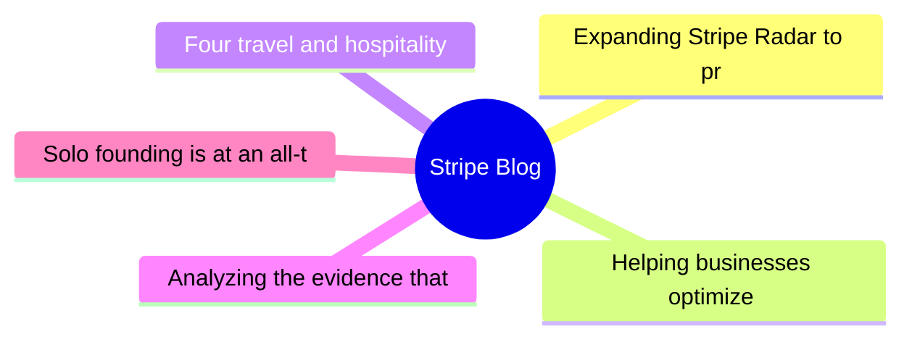
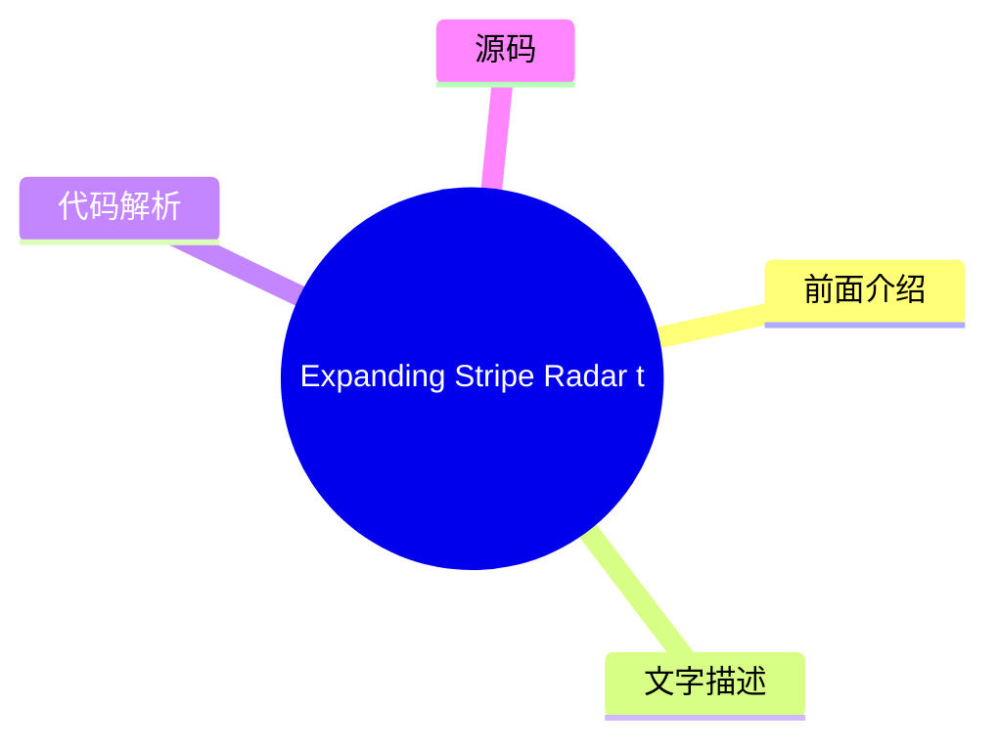
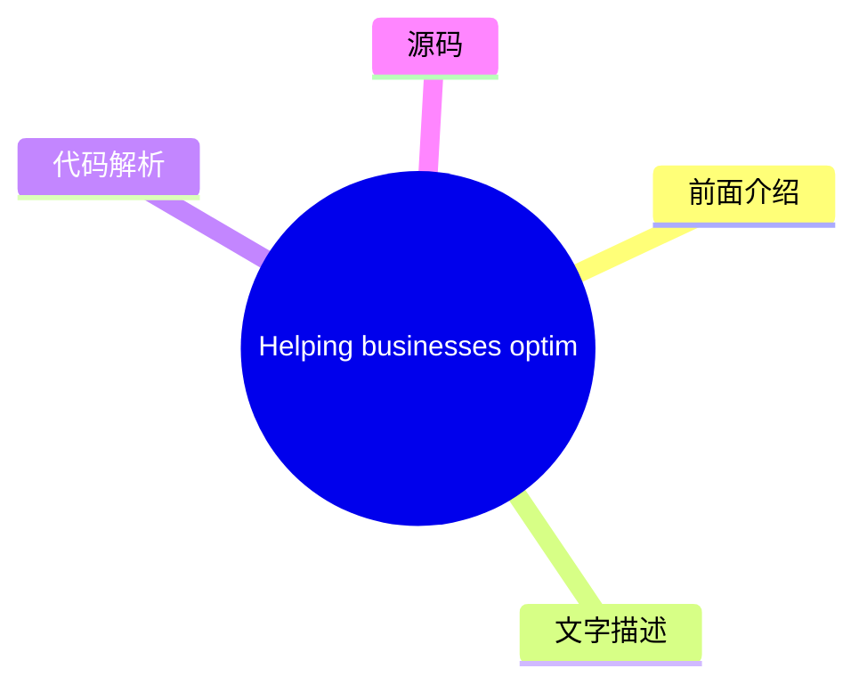
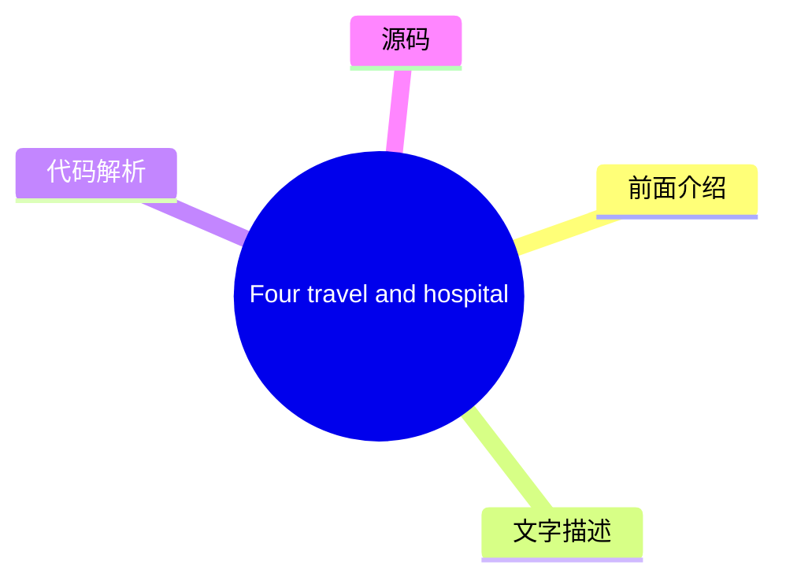
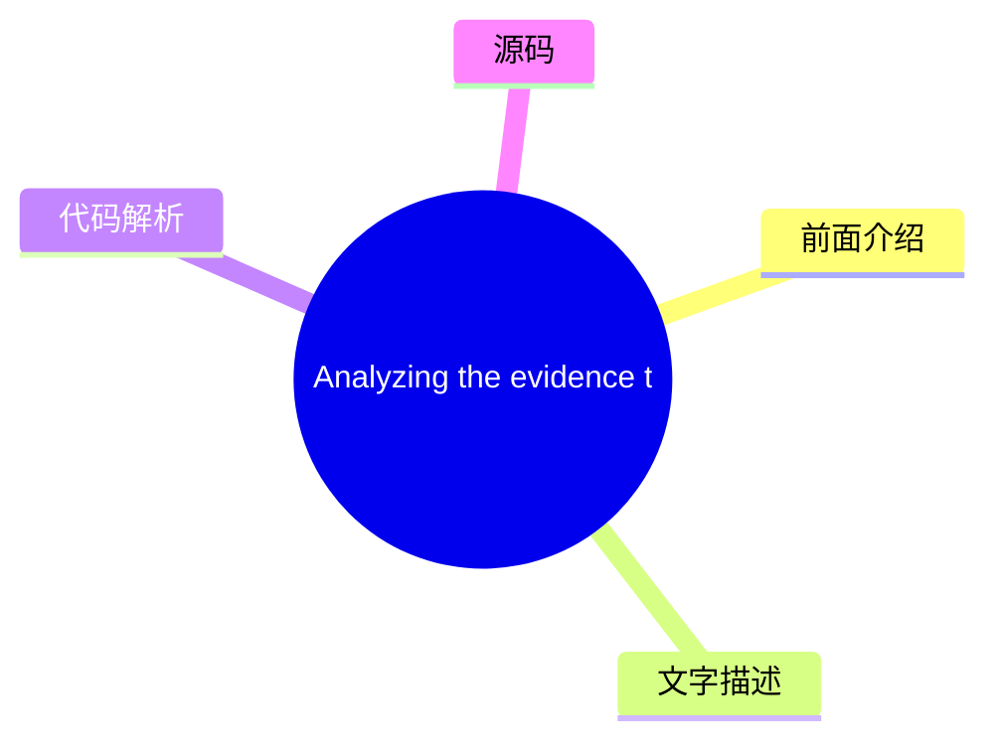
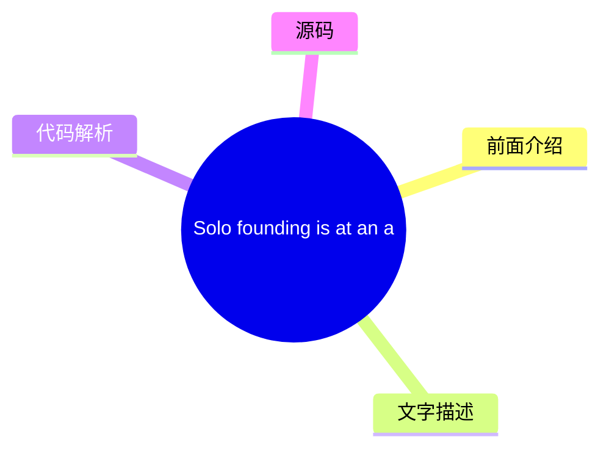

# 💳 Stripe Blog Top 5 (2026-08-06)

## 前面介绍

- 数据源：Stripe Blog
- 抓取日期：2026-08-06
- 条目数：5
- 含完整正文：5
- 含代码片段：0
- 组织方式：前面介绍 / 树状图 / 文字描述 / 代码解析 / 源码

## 思维导图

## 详细整理（5 条，5 条含全文，0 条含代码）

### 1. Expanding Stripe Radar to protect more of your business
- **链接**: [https://stripe.com/blog/expanding-stripe-radar-to-protect-more-of-your-business](https://stripe.com/blog/expanding-stripe-radar-to-protect-more-of-your-business)
- **发布**: Wed, 27 May 2026 00:00:00 +0000

#### 前面介绍

- Radar now blocks high-risk transactions across all supported payment methods; defends against new fraud types like multi-account abuse and pay-as-you-go abuse, regardless of which payment processor you use; and gives platforms new tools to evaluate a
- 发布时间：Wed, 27 May 2026 00:00:00 +0000

#### 树状图

#### 文字描述

- Last month at Stripe Sessions, we shared the biggest expansion we’ve ever made to [Stripe Radar](https://stripe.com/radar), our AI-powered fraud prevention tool. Radar now blocks high-risk transactions across all supported payment methods; defends against new fraud types like multi-account abuse and pay-as-you-go abuse, regardless of which payment processor you use; and gives p
- ## Protect more transactions with global payment coverage, new multiprocessor signals, and custom models Fraud protection is getting more complex. Businesses need to defend across a range of payment methods, and they need more precision in the signals they use to catch fraud before it happens—on and off Stripe. Radar now addresses both, along with the ability to use custom frau
- ## Defend against new types of fraud Fraudulent actors have become as sophisticated at stealing compute as they are at stealing money. They abuse policies by cycling through free trials, setting up multiple accounts, or intentionally not paying their next invoice. As businesses scale AI products, token abuse has become an expensive fraud vector. Last month, we shared how Radar 
- ## Protect your platform from account fraud Fraudulent actors are using generative AI to create fake identities, documents, and websites convincing enough to bypass many platforms’ verification systems. Platforms face a trade-off: request additional information during onboarding and increase friction, or keep the onboarding flow lightweight and take on potentially significant r

#### 代码解析

- 本文未检测到明确代码块，内容更偏新闻、观点或方法论。

#### 源码

#### 中文节选

Last month at Stripe Sessions, we shared the biggest expansion we’ve ever made to [Stripe Radar](https://stripe.com/radar), our AI-powered fraud prevention tool. Radar now blocks high-risk transactions across all supported payment methods; defends against new fraud types like multi-account abuse and pay-as-you-go abuse, regardless of which payment processor you use; and gives platforms new tools to evaluate and mitigate merchant risk on and off Stripe. We also launched additional ways to fight disputes with smarter evidence and automated evidence libraries.

Here’s a closer look at what we announced.

## Protect more transactions with global payment coverage, new multiprocessor signals, and custom models

Fraud protection is getting more complex. Businesses need to defend across a range of payment methods, and they need more precision in the signals they use to catch fraud before it happens—on and off Stripe. Radar now addresses both, along with the ability to use custom fraud models.

**Block high-risk transactions across all supported global payment methods
**

Radar now protects [all supported payment volume globally](https://docs.stripe.com/radar/local-payment-methods), including bank debits, buy now, pay later (BNPL) options, crypto, digital wallets, real-time payments, and cash vouchers. When Radar detects a fraudulent pattern on a transaction, that information becomes available to protect transactions across all payment methods. For example, if a fraudulent actor uses a stolen credit card at one business on Stripe, and we detect and block it, that same IP address and device fingerprint are now flagged across bank debits, wallets, and BNPL transactions network-wide. We found that Radar reduced suspected fraud by 71% during a five-month period for businesses using Affirm, Cash App, Klarna, and PayPal. 

**Improve your fraud decisioning with new multiprocessor signals
**

Businesses use Radar’s risk signals for off-Stripe transactions to complement their in-house fraud models and make more precise fraud decisions across payment processors. Now, you can further improve your fraud decisioning with additional signals for off-Stripe transactions to help you prevent fraud before it happens.

Stripe can now identify whether a payment is [likely to trigger an early fraud warning](https://docs.stripe.com/radar/multiprocessor#early-fraud-warning) from the card network. You can then choose to proactively refund the transaction and protect your dispute rate. 

Stripe can also predict whether a payment is [likely to result in a fraudulent dispute](https://docs.stripe.com/radar/multiprocessor#fraudulent-dispute). You can use this signal to issue refunds, gather evidence, or adjust your dispute strategy. 

We plan to add new signals that can be used across your entire payments stack.

**Access enterprise-grade custom fraud models
**

For businesses with more complex risk profiles, Radar now offers [custom fraud models](https://docs.stripe.com/radar/custom-

#### 完整正文（中文）

Last month at Stripe Sessions, we shared the biggest expansion we’ve ever made to [Stripe Radar](https://stripe.com/radar), our AI-powered fraud prevention tool. Radar now blocks high-risk transactions across all supported payment methods; defends against new fraud types like multi-account abuse and pay-as-you-go abuse, regardless of which payment processor you use; and gives platforms new tools to evaluate and mitigate merchant risk on and off Stripe. We also launched additional ways to fight disputes with smarter evidence and automated evidence libraries.

Here’s a closer look at what we announced.

## Protect more transactions with global payment coverage, new multiprocessor signals, and custom models

Fraud protection is getting more complex. Businesses need to defend across a range of payment methods, and they need more precision in the signals they use to catch fraud before it happens—on and off Stripe. Radar now addresses both, along with the ability to use custom fraud models.

**Block high-risk transactions across all supported global payment methods
**

Radar now protects [all supported payment volume globally](https://docs.stripe.com/radar/local-payment-methods), including bank debits, buy now, pay later (BNPL) options, crypto, digital wallets, real-time payments, and cash vouchers. When Radar detects a fraudulent pattern on a transaction, that information becomes available to protect transactions across all payment methods. For example, if a fraudulent actor uses a stolen credit card at one business on Stripe, and we detect and block it, that same IP address and device fingerprint are now flagged across bank debits, wallets, and BNPL transactions network-wide. We found that Radar reduced suspected fraud by 71% during a five-month period for businesses using Affirm, Cash App, Klarna, and PayPal. 

**Improve your fraud decisioning with new multiprocessor signals
**

Businesses use Radar’s risk signals for off-Stripe transactions to complement their in-house fraud models and make more precise fraud decisions across payment processors. Now, you can further improve your fraud decisioning with additional signals for off-Stripe transactions to help you prevent fraud before it happens.

Stripe can now identify whether a payment is [likely to trigger an early fraud warning](https://docs.stripe.com/radar/multiprocessor#early-fraud-warning) from the card network. You can then choose to proactively refund the transaction and protect your dispute rate. 

Stripe can also predict whether a payment is [likely to result in a fraudulent dispute](https://docs.stripe.com/radar/multiprocessor#fraudulent-dispute). You can use this signal to issue refunds, gather evidence, or adjust your dispute strategy. 

We plan to add new signals that can be used across your entire payments stack.

**Access enterprise-grade custom fraud models
**

For businesses with more complex risk profiles, Radar now offers [custom fraud models](https://docs.stripe.com/radar/custom-fraud-models). You can pass signals unique to your business to Stripe, such as product catalog data, loyalty status, behavioral metrics, or any structured metadata relevant to your risk profile. Stripe then combines this information with our global network data to deploy a model customized specifically to your business. For early adopters, custom models are detecting at least 15% more fraud with no increase in false positives.

## Defend against new types of fraud

Fraudulent actors have become as sophisticated at stealing compute as they are at stealing money. They abuse policies by cycling through free trials, setting up multiple accounts, or intentionally not paying their next invoice. As businesses scale AI products, token abuse has become an expensive fraud vector.

Last month, we shared how Radar addresses one of these fraud vectors with [free trial abuse prevention](https://stripe.com/blog/how-stripe-radar-helps-prevent-free-trial-abuse). At Sessions, we highlighted new ways to protect your business against multi-account abuse, pay-as-you-go fraud, and fraudulent bot-driven payments.

**Block multi-account abuse
**

Multi-account abuse is when a single fraudulent actor creates several accounts to reuse promotional coupons or spread stolen card activity across multiple accounts to avoid detection for longer. Across the Stripe network, more than one in six sign-ups at AI companies are linked to multi-account abuse.

Now, Radar can [evaluate each new account in real time](https://docs.stripe.com/radar/multi-account-and-account-sharing-abuse#multi-account-abuse), so you can block suspicious accounts before abuse happens—on and off Stripe. Our solution draws on information from prior abuse across the entire Stripe network, including device fingerprints, IP addresses, email domains, and more. In the past two months, ElevenLabs has been able to block 2,000 users a day from abusing its free tier. 

**Predict pay-as-you-go abuse
**

Pay-as-you-go abuse occurs when customers abuse your service by racking up usage costs with no intention of paying when the bill comes due. These bad actors exploit the structure of consumption-based pricing, where charges accumulate throughout a billing cycle, but payment happens later. For example, a customer could consume thousands of dollars of compute over the course of a month, get billed at the end, and never pay.

Radar now helps [predict nonpayment abuse as usage accumulates](https://docs.stripe.com/radar/pay-as-you-go-abuse), allowing you to intervene before a customer is billed. This allows you to require a top-up, cut off service, or take whatever action fits your risk tolerance.  

**Detect and prevent fraudulent bot-driven payments
**

As agentic commerce scales, distinguishing between legitimate agents acting on behalf of customers and malicious bots becomes increasingly important. Both are nonhuman traffic making purchases, but one is a customer’s authorized agent, and the other might exploit your checkout to buy limited-availability inventory, abuse promotional pricing, or bypass purchase limits.

Radar 现在为 Stripe Checkout 上的支付分配机器人评分，评估其是否由[恶意机器人发起](https://docs.stripe.com/radar/bot-abuse)的可能性。您可以使用此评分来执行反脚本或反机器人策略。例如，您可以阻止限量版商品的自动购买，或将高频率订单标记为待审核。

## 保护您的平台免受账户欺诈

欺诈行为者正在使用生成式 AI 创建虚假身份、文件和网站，这些内容足以绕过许多平台的验证系统。平台面临一个权衡：在入职流程中要求提供更多信息以增加摩擦，还是保持入职流程轻量级并承担潜在的重大风险。

[平台现在可以使用 Radar 降低风险](https://docs.stripe.com/radar/radar-for-platforms)，其功能包括为每个业务和交易提供 0 到 100 的欺诈评分；解释账户被标记原因的 AI 驱动洞察；用于帮助团队了解账户背景的备注和账户历史记录；以及用于争议、拒付、退款和支付的账户级指标。

我们还引入了三种新方法，供平台在 Stripe 内外监控和评估商户风险。

- [欺诈网站](https://docs.stripe.com/radar/fraudulent-website)信号会像人类欺诈分析师一样分析企业的网站，寻找诸如以不切实际的价格出售奢侈品、AI 生成的文案、拼写错误的品牌 URL 或其他表明网站存在欺诈行为的迹象等危险信号。平台可以在入职流程中使用此信号来自动验证、标记账户以进行人工审核，或在批准业务前将其作为自身风险评分的输入。
- [欺诈商户](https://docs.stripe.com/radar/fraudulent-merchant)信号根据对 Stripe 网络内模式的分析（包括银行账户信息、业务详情、交易活动和争议）来确定新账户或现有账户是否存在欺诈风险。然后，平台可以发起审核、暂停付款、暂停提现、拒绝账户、设置预留金或要求身份验证。

- The [merchant delinquency risk](https://docs.stripe.com/radar/merchant-delinquency-risk)signal predicts whether a business is at risk of accruing a negative balance; specifically, it predicts whether that balance is likely to remain negative for 60 days or more. Platforms can use this signal to decide whether to proactively adjust payout schedules, require reserves on high-risk accounts, or flag merchants for closer review before losses accumulate.

## Fight disputes more effectively with smarter evidence and automated evidence libraries

[Smart Disputes](https://docs.stripe.com/disputes/smart-disputes), our AI-powered dispute management product, has always compiled and submitted evidence on your behalf. Now, Smart Disputes can develop a more customized strategy to improve your chances of winning each dispute. 

Smart Disputes analyzes each dispute and surfaces [AI-powered recommendations](https://docs.stripe.com/disputes/set-up-smart-disputes#provide-more-data-at-dispute-time) for specific evidence fields, such as tracking numbers or customer usage logs. Businesses that add our AI-recommended evidence through Smart Disputes are winning 3x more often than those that don’t add any evidence. 

We’re also reducing the manual effort involved in submitting evidence. Many disputes require the same supporting materials: terms and conditions, return policies, and service agreements. With the evidence library, you upload and store these documents once, and Smart Disputes automatically selects and includes them in your evidence packet based on the dispute’s reason code, network requirements, and cardholder claims—no manual resubmission needed.

## What’s next

At Sessions, we also launched [our public roadmap](https://stripe.com/roadmap): an itemized list with hundreds of detailed entries through the first quarter of 2027, including [products, features, and improvements across Radar](https://stripe.com/roadmap?product=Radar). 

To learn more about how Radar can protect your business, join us in major global cities for [Stripe Tour 2026](https://stripetour.com/). You can also [read our docs](https://docs.stripe.com/radar) or [get in touch](https://stripe.com/contact/sales) with an expert from our team.

### 2. Helping businesses optimize network costs with the Visa Digital Commerce Authentication Program (DCAP)
- **链接**: [https://stripe.com/blog/helping-businesses-optimize-network-costs-with-visa-digital-commerce-authentication-program](https://stripe.com/blog/helping-businesses-optimize-network-costs-with-visa-digital-commerce-authentication-program)
- **发布**: Wed, 03 Jun 2026 00:00:00 +0000

#### 前面介绍

- We moved quickly to help Stripe businesses take advantage of DCAP and capture interchange savings while protecting authorization rates. Here’s what we did.
- 发布时间：Wed, 03 Jun 2026 00:00:00 +0000

#### 树状图

#### 文字描述

- Visa recently launched the [Digital Commerce Authentication Program (DCAP)](https://support.stripe.com/questions/understand-the-visa-digital-commerce-authentication-program-%28dcap%29-on-stripe), a new global framework designed to reduce fraud and increase authorization rates for card-not-present transactions. The program rewards businesses in the US for sharing richer transact
- ### Optimizing DCAP savings without sacrificing conversion Before rolling out DCAP, we worked with Visa to run readiness testing and identify the right implementation approach. This collaborative testing underscored the need for transaction-level intelligence. With [Stripe Authorization Boost](https://stripe.com/authorization-boost), we intelligently select which transactions s
- ## Automatically benefit from DCAP optimizations If you use Authorization Boost and are collecting the required data points, you’re already automatically benefiting from DCAP optimizations. For businesses using [standalone 3DS](https://docs.stripe.com/payments/3d-secure/standalone-3d-secure), you can participate by setting **flow_preference[type]** to `data_share` on authentica

#### 代码解析

- 本文未检测到明确代码块，内容更偏新闻、观点或方法论。

#### 源码

#### 中文节选

Visa recently launched the [Digital Commerce Authentication Program (DCAP)](https://support.stripe.com/questions/understand-the-visa-digital-commerce-authentication-program-%28dcap%29-on-stripe), a new global framework designed to reduce fraud and increase authorization rates for card-not-present transactions. The program rewards businesses in the US for sharing richer transaction data with issuers during authentication, such as device ID, billing address, IP address, and customer email. Qualifying transactions receive a net interchange reduction of five basis points.

New network programs create opportunity, but they also introduce complexity. Businesses need to understand which transactions qualify, ensure their integration passes the required data, and determine whether participating will improve their end-to-end transaction economics or have unintended consequences, such as hurting authorization rates.

To participate in DCAP, businesses need to share required cardholder data with issuers via frictionless authentication in their checkout. This might introduce latency and uncertainty around how issuers interpret these newer signals.

We moved quickly to help Stripe businesses take advantage of DCAP and capture interchange savings while protecting authorization rates. Here’s what we did.

### Optimizing DCAP savings without sacrificing conversion

Before rolling out DCAP, we worked with Visa to run readiness testing and identify the right implementation approach. This collaborative testing underscored the need for transaction-level intelligence.

With [Stripe Authorization Boost](https://stripe.com/authorization-boost), we intelligently select which transactions should go through [Data Only 3DS](https://docs.stripe.com/payments/3d-secure/strong-customer-authentication-exemptions#data-only), which sends additional risk data from the card network to the issuer for authorization. Rather than applying static rules, Authorization Boost evaluates cost savings, conversion impact, and fraud risk at the individual transaction level to determine when to apply Data Only 3DS. This allows businesses to capture DCAP savings while limiting the impact to the customer experience and optimizing authorization rates.

Since April 18, we’ve helped Stripe businesses capture $18.4 million in annualized network cost savings from DCAP. By helping businesses collect and pass the required data, we saw an 8x increase in the number of DCAP-eligible transactions. We’re continuing to work with Visa to optimize eligibility, so more transactions can benefit from DCAP.

## Automatically benefit from DCAP optimizations

If you use Authorization Boost and are collecting the required data points, you’re already automatically benefiting from DCAP optimizations. For businesses using [standalone 3DS](https://docs.stripe.com/payments/3d-secure/standalone-3d-secure), you can participate by setting **flow_preference[type]** to `data_share` on authentication requests and ensuring require

#### 完整正文（中文）

Visa recently launched the [Digital Commerce Authentication Program (DCAP)](https://support.stripe.com/questions/understand-the-visa-digital-commerce-authentication-program-%28dcap%29-on-stripe), a new global framework designed to reduce fraud and increase authorization rates for card-not-present transactions. The program rewards businesses in the US for sharing richer transaction data with issuers during authentication, such as device ID, billing address, IP address, and customer email. Qualifying transactions receive a net interchange reduction of five basis points.

New network programs create opportunity, but they also introduce complexity. Businesses need to understand which transactions qualify, ensure their integration passes the required data, and determine whether participating will improve their end-to-end transaction economics or have unintended consequences, such as hurting authorization rates.

To participate in DCAP, businesses need to share required cardholder data with issuers via frictionless authentication in their checkout. This might introduce latency and uncertainty around how issuers interpret these newer signals.

We moved quickly to help Stripe businesses take advantage of DCAP and capture interchange savings while protecting authorization rates. Here’s what we did.

### Optimizing DCAP savings without sacrificing conversion

Before rolling out DCAP, we worked with Visa to run readiness testing and identify the right implementation approach. This collaborative testing underscored the need for transaction-level intelligence.

With [Stripe Authorization Boost](https://stripe.com/authorization-boost), we intelligently select which transactions should go through [Data Only 3DS](https://docs.stripe.com/payments/3d-secure/strong-customer-authentication-exemptions#data-only), which sends additional risk data from the card network to the issuer for authorization. Rather than applying static rules, Authorization Boost evaluates cost savings, conversion impact, and fraud risk at the individual transaction level to determine when to apply Data Only 3DS. This allows businesses to capture DCAP savings while limiting the impact to the customer experience and optimizing authorization rates.

Since April 18, we’ve helped Stripe businesses capture $18.4 million in annualized network cost savings from DCAP. By helping businesses collect and pass the required data, we saw an 8x increase in the number of DCAP-eligible transactions. We’re continuing to work with Visa to optimize eligibility, so more transactions can benefit from DCAP.

## Automatically benefit from DCAP optimizations

If you use Authorization Boost and are collecting the required data points, you’re already automatically benefiting from DCAP optimizations. For businesses using [standalone 3DS](https://docs.stripe.com/payments/3d-secure/standalone-3d-secure), you can participate by setting **flow_preference[type]** to `data_share` on authentication requests and ensuring required fields are populated.

Learn more about how [Authorization Boost](https://docs.stripe.com/payments/analytics/optimization) can help optimize your payments performance.

### 3. Four travel and hospitality trends from HITEC 2026
- **链接**: [https://stripe.com/blog/trends-from-hitec](https://stripe.com/blog/trends-from-hitec)
- **发布**: Tue, 23 Jun 2026 00:00:00 +0000

#### 前面介绍

- More than 6,000 hospitality executives and operators gathered in San Antonio last week for the HITEC conference. The big topic: whether the industry’s AI investment is actually working. Across four days and over 50 meetings, four trends stood out.
- 发布时间：Tue, 23 Jun 2026 00:00:00 +0000

#### 树状图

#### 文字描述

- More than 6,000 hospitality executives and operators gathered in San Antonio last week for the annual HITEC hospitality technology conference, including leaders from Wyndham Hotels & Resorts, Hyatt, IHG Hotels & Resorts, Starwood Hotels, and hundreds of independent properties. The big topic: whether the industry’s AI investment is actually working. IDC forecasts that [30%](http
- ## The race for direct bookings has moved from search rankings to AI answers For years, the hospitality industry’s answer to online travel agency (OTA) dependency was SEO: invest in content, improve search rankings, and convert guests before they end up on Expedia or Booking.com. That approach is becoming less effective. Jack Wang, principal solution engineer at Salesforce, off
- ## Most hospitality AI is falling short in a predictable way An uncomfortable truth surfaced repeatedly throughout HITEC: much of the AI scaling happening across hospitality is fragile. The majority of businesses are adopting AI without the strategic clarity, data foundation, and operational architecture to sustain it. The root cause is often fragmented data. Siloed property ma
- ## Payments friction has a measurable cost, but most hotels still don’t know what it is The hospitality industry has historically treated payments as a cost and commodity: something to keep running, minimize fees on, and keep out of the way. Many of the payments-specific conversations we had at HITEC revolved around how that approach is changing, along with a growing recognitio

#### 代码解析

- 本文未检测到明确代码块，内容更偏新闻、观点或方法论。

#### 源码

#### 中文节选

More than 6,000 hospitality executives and operators gathered in San Antonio last week for the annual HITEC hospitality technology conference, including leaders from Wyndham Hotels & Resorts, Hyatt, IHG Hotels & Resorts, Starwood Hotels, and hundreds of independent properties.

The big topic: whether the industry’s AI investment is actually working. IDC forecasts that [30%](https://www.idc.com/resource-center/blog/agentic-ai-will-redefine-travel-and-hospitality-in-2026/) of all travel bookings will be made by AI agents by 2030. But the gap between where the industry is headed and what it’s currently equipped to support is wide.

While 25% of hospitality businesses report actively scaling AI today, fewer than 10% are considered “AI future-built,” according to [BCG](https://www.bcg.com/publications/2026/ai-first-hotels-leaner-faster-smarter)—meaning they have AI embedded across core operations, a supporting data foundation, and measurable returns to show for it. “A lot of companies are throwing spaghetti at the wall to see if it sticks,” said Dale Gomez, associate teaching professor in hospitality technology at Florida International University. “They want to see ROI.” 

Other shifts are already underway. Many hospitality businesses still lack the modern financial infrastructure needed to fully benefit from the automation, speed, and interoperability AI is expected to drive. Payment systems once considered “good enough” are now costing measurable revenue, and rising guest expectations have turned inefficient technology from a minor inconvenience to a reason not to return.

Across four days and over 50 meetings, four trends stood out.

## The race for direct bookings has moved from search rankings to AI answers

For years, the hospitality industry’s answer to online travel agency (OTA) dependency was SEO: invest in content, improve search rankings, and convert guests before they end up on Expedia or Booking.com. That approach is becoming less effective.

Salesforce 的首席解决方案工程师 Jack Wang 提供的数据凸显了一种转变：现在，65% 触发 AI 概览的 Google 搜索最终都不会导致用户点击任何网站。在移动端，这一数字上升至 78%。由于 AI 生成的摘要取代了 SEO 旨在赢得的排名链接列表，传统搜索流量在整个行业范围内下降了约 25%。

被纳入 AI 生成的答案需要与 SEO 奖励的内容有所不同。SEO 响应的是关键词密度、反向链接和页面权重。AI 纳入则响应的是结构化属性数据的准确性和机器可读性，如房型、设施详情、政策、本地背景或取消条款。一家酒店可能在传统搜索中排名良好，但对 LLM 来说却不可见：超过 [90%](https://www.nokumo.net/en/ai-visibility-in-hospitality-what-3-600-ai-responses-and-1-337-website-audits-reveal?utm_campaign=ennismore-proves-tech-investment-pays-off-and-94-of-hotels-are-invisible-to-ai) 的住宿

#### 完整正文（中文）

More than 6,000 hospitality executives and operators gathered in San Antonio last week for the annual HITEC hospitality technology conference, including leaders from Wyndham Hotels & Resorts, Hyatt, IHG Hotels & Resorts, Starwood Hotels, and hundreds of independent properties.

The big topic: whether the industry’s AI investment is actually working. IDC forecasts that [30%](https://www.idc.com/resource-center/blog/agentic-ai-will-redefine-travel-and-hospitality-in-2026/) of all travel bookings will be made by AI agents by 2030. But the gap between where the industry is headed and what it’s currently equipped to support is wide.

While 25% of hospitality businesses report actively scaling AI today, fewer than 10% are considered “AI future-built,” according to [BCG](https://www.bcg.com/publications/2026/ai-first-hotels-leaner-faster-smarter)—meaning they have AI embedded across core operations, a supporting data foundation, and measurable returns to show for it. “A lot of companies are throwing spaghetti at the wall to see if it sticks,” said Dale Gomez, associate teaching professor in hospitality technology at Florida International University. “They want to see ROI.” 

Other shifts are already underway. Many hospitality businesses still lack the modern financial infrastructure needed to fully benefit from the automation, speed, and interoperability AI is expected to drive. Payment systems once considered “good enough” are now costing measurable revenue, and rising guest expectations have turned inefficient technology from a minor inconvenience to a reason not to return.

Across four days and over 50 meetings, four trends stood out.

## The race for direct bookings has moved from search rankings to AI answers

For years, the hospitality industry’s answer to online travel agency (OTA) dependency was SEO: invest in content, improve search rankings, and convert guests before they end up on Expedia or Booking.com. That approach is becoming less effective.

Salesforce 的首席解决方案工程师 Jack Wang 提供的数据凸显了这一转变：现在，有 65% 的触发 AI 概览的 Google 搜索最终都没有用户点击任何网站。在移动端，这一数字上升至 78%。随着 AI 生成的摘要取代了 SEO 旨在赢得的排名链接列表，传统搜索流量在整个行业下降了约 25%。

被纳入 AI 生成的答案需要与 SEO 奖励的内容有所不同。SEO 响应的是关键词密度、反向链接和页面权威性。AI 纳入则响应的是结构化属性数据的准确性和机器可读性，如房型、设施详情、政策、本地背景或取消条款。一家酒店可能在传统搜索中排名靠前，但对 LLM 来说却是不可见的：超过 [90%](https://www.nokumo.net/en/ai-visibility-in-hospitality-what-3-600-ai-responses-and-1-337-website-audits-reveal?utm_campaign=ennismore-proves-tech-investment-pays-off-and-94-of-hotels-are-invisible-to-ai) 的住宿网站仍被 AI 模型遗漏。

我们已经看到了这种下游效应。根据 Phocuswright 的研究，[56%](https://www.phocuswire.com/news/online/shift-travel-behavior-ai-surge-phocuswright-research) 的旅行者在过去 12 个月中曾使用 AI 进行行程规划、预订或在目的地提供协助。对于运营商而言，第一步是审计，而不是投资。您潜在客人使用的 LLM 能否准确描述您酒店的房型、设施、政策和本地背景？如果答案是否定的，这个差距很可能会让您损失预订。

如今，酒店集团可以像 OTA 一样使用相同的结账和支付工具，包括本地支付方式和货币、一键结账以及全球欺诈保护。捕捉代理需求的旅游品牌正在将 AI 驱动的可发现性与准确的实时库存以及高效的现代结账体验相结合。

## 大多数酒店业 AI 都以可预测的方式未能达标

An uncomfortable truth surfaced repeatedly throughout HITEC: much of the AI scaling happening across hospitality is fragile. The majority of businesses are adopting AI without the strategic clarity, data foundation, and operational architecture to sustain it.

The root cause is often fragmented data. Siloed property management, CRM, loyalty, food and beverage, and payment systems each hold partial views of the same guest—and AI recommendations are only as accurate as the content they draw on. The same data problem that breaks AI personalization shows up in finance as excessive reconciliation time, in operations as incomplete guest profiles, and in the guest experience as friction.

Amanda Sharp, Salesforce lead solution engineer, reframed the problem as AI operationalization rather than adoption, calling for “vibe operating”: hospitality’s answer to vibe coding. Building AI features is now feasible for many hotel brands. Running them reliably in production, integrated into actual workflows that trigger real actions, is harder.

The businesses doing this well have clean, connected data that delivers useful intelligence directly into the workflow while there’s still time to act. At Delta Air Lines, for example, a live AI concierge is built into the mobile app and uses SkyMiles profile and operational data to provide context-aware support as part of the customer care experience. At Wynn Las Vegas, revenue managers receive predictive alerts when performance is trending below target, along with recommended actions attached.

For most travel operators, the bottleneck is data connectivity rather than model quality.

## Payments friction has a measurable cost, but most hotels still don’t know what it is

The hospitality industry has historically treated payments as a cost and commodity: something to keep running, minimize fees on, and keep out of the way. Many of the payments-specific conversations we had at HITEC revolved around how that approach is changing, along with a growing recognition that payments have become a key factor in how hospitality brands compete. Our own data supports this: in a Stripe-commissioned [survey](https://go.stripe.global/rs/072-MDK-283/images/Skift_x_Stripe_How_Payment_Systems_Are_Changing_in_Travel_and_Hospitality.pdf) of nearly 400 hospitality executives, 90% said payments are important to growth, and 37% said that a lack of payment options has the greatest negative impact on the guest experience. In addition, 58% said their fraud systems block legitimate transactions, and 74% reported that fragmented systems cause their teams to spend excessive time on reconciliation.

Those figures highlight why payments have become a structural advantage. OTAs can afford to staff payments at scale because their revenue justifies the head count. Independent hotels and smaller operators can’t match that investment directly, but a lean team on the right infrastructure can now support payment methods across dozens of countries at a fraction of the cost of a large in-house operation.

A coverage gap translates directly to lost bookings. “The moment we don’t support [a payment method] is the moment this guest goes elsewhere, to a platform or channel that supports their preferred way to pay,” said Sebastien Leitner, VP of strategic partnerships at Cloudbeds. Guests book where their preferred payment method works. A property that doesn’t support the dominant method in a target market isn’t just creating friction—it’s routing that booking to an OTA that does.

## The best hospitality technology is the kind that goes unnoticed

“There is zero empathy for technology that doesn’t work,” said Tanya Pratt, global VP of strategy and product management at Oracle Hospitality. “If it’s not working, it’s going to cause more frustration than if there’s a line at the front desk, because people are used to that.” When technology fails, guests don’t always complain. They just don’t come back.

The real gauge of success is when technology works well enough that guests don’t think about it at all. Denise Walker, CIO of Starwood Hotels, described the vision: a returning guest arrives to a room at the right temperature, with their preferred channels on the TV, and pillows of their preferred firmness on the bed. No one announces how they knew. “It doesn’t have to be delivered in a way that says, ‘How did you know that?’”

Shannon McCallum, VP of hotel operations at Resorts World Las Vegas, went further. “We’re moving from ‘I told you this, so you know it about me’ to ‘I didn’t tell you anything, and now you’re predicting it.’”

Both the invisible personalization and the human moments it enables require a foundation of connected data—tech that integrates across your existing stack, consolidating guest information into a single system. That infrastructure allows businesses to recognize the same guest whether they’re browsing your website or standing at the front desk.

## How Stripe can help

Increasingly, guests will find your property through AI assistants rather than search engines. The bookings they make might be completed by agents. And the revenue that distinguishes high-performing operators will come from payment experiences that convert, payment methods that cover every market, and financial systems that work together. Stripe Data Pipeline connects payments data with your booking and customer systems, giving operators a unified view of revenue without stitched-together reporting.

Stripe’s payments infrastructure helps hospitality operators protect revenue, boost guest spend on-property, and simplify operations.

**Drive direct bookings.** Across the payment methods guests actually use and in every market you serve, payment experiences that convert help keep bookings on your direct channel. As agentic commerce scales, that means fraud detection that runs on every Stripe transaction by default and payment tokens that allow agents to transact without exposing guest credentials. 

**Increase trip spend.** Ancillary revenue from dining, experiences, and partnerships requires payments infrastructure that works across the property, supports new business models, and connects with external partners. Stripe Billing handles the recurring payment logic behind membership and loyalty programs, including automatic renewals, tiered pricing, and failed payment recovery—without requiring operators to maintain that infrastructure themselves. [Cloudbeds](https://stripe.com/customers/cloudbeds), for example, saw 15% revenue growth for businesses using Cloudbeds Payments and a 14.8% average increase in revenue for businesses expanding payment methods by directly removing payment friction through its Stripe partnership.

**Cut costs.** More efficient B2B money movement and fraud protection reduce reconciliation work and limit losses, freeing up margin without adding staff.

[Learn more](https://stripe.com/industries/travel) about how Stripe supports hospitality businesses, or [get in touch](https://stripe.com/contact/sales).

### 4. Analyzing the evidence that helps businesses win “product not received” disputes
- **链接**: [https://stripe.com/blog/analyzing-the-evidence-that-helps-businesses-win-product-not-received-disputes](https://stripe.com/blog/analyzing-the-evidence-that-helps-businesses-win-product-not-received-disputes)
- **发布**: Tue, 21 Jul 2026 00:00:00 +0000

#### 前面介绍

- To understand what can influence win rates, we analyzed evidence packets from one million disputes over a 16-week period. Here’s what the data shows and what it means for how you mitigate disputes.
- 发布时间：Tue, 21 Jul 2026 00:00:00 +0000

#### 树状图

#### 文字描述

- “[Product not received](https://docs.stripe.com/disputes/categories)” disputes—where a cardholder claims they didn’t receive what they paid for—are the most common nonfraud dispute category on Stripe. It can be challenging to know which claims are legitimate and which are not: some customers genuinely never received what they paid for, while others incorrectly claim they didn’t
- ## Businesses that submitted evidence after the delivery was confirmed saw a 27 percentage point higher win rate Many businesses submit a shipping tracking ID as proof of delivery. However, depending on the status of the package at the time you submit the evidence, the tracking number might only confirm that the package left your facility. Our analysis found that win rates incr
- ## Businesses that submitted digital activity and usage logs saw a 10 percentage point higher win rate Businesses selling digital goods also need to provide proof of fulfillment, though the supporting evidence looks different. Disputes with digital activity and usage logs—such as JSON telemetry logs from common analytics platforms showing that a user streamed, downloaded, or ac
- ## Businesses that included evidence of a refund issued through Stripe saw a 63 percentage point higher win rate Cardholders can still initiate [a dispute even after a refund has been processed](https://support.stripe.com/questions/disputes-on-a-refunded-transaction-faq), often because the refund and dispute were filed around the same time or because the issuing bank didn’t che

#### 代码解析

- 本文未检测到明确代码块，内容更偏新闻、观点或方法论。

#### 源码

#### 中文节选

“[Product not received](https://docs.stripe.com/disputes/categories)” disputes—where a cardholder claims they didn’t receive what they paid for—are the most common nonfraud dispute category on Stripe. It can be challenging to know which claims are legitimate and which are not: some customers genuinely never received what they paid for, while others incorrectly claim they didn’t receive the order. 

To understand what can influence win rates, we analyzed evidence packets from one million disputes over a 16-week period. We compared win rates for packets that included various types of evidence—such as delivery confirmation or content consumption logs—against those that didn’t, isolating which features correlated with higher win rates.

Here’s what the data shows for businesses broadly, what’s different for businesses selling digital goods, and what it means for how you mitigate disputes.

**Businesses that submitted delivery information saw a 44 percentage point higher win rate**

For businesses selling physical goods, disputes with delivery confirmation as evidence had a 27 percentage point higher win rate than disputes without it. Adding a GPS delivery map as evidence, which shows where the carrier scanned the package, lifted win rates by an additional 15 percentage points on top of delivery confirmation alone. And including a recipient signature as evidence added a further two percentage point lift. Together, disputes with delivery confirmation, a GPS map, and a signature had a 44 percentage point higher win rate than disputes without them.

Yet many businesses still don’t include delivery confirmation in their dispute responses. Part of this gap is awareness, but the bigger barrier is operational. For most businesses, shipping data and dispute workflows live in separate systems. Matching a specific dispute to the right order and confirmed delivery status often requires manual work and is hard to scale.

## Businesses that submitted evidence after the delivery was confirmed saw a 27 percentage point higher win rate

Many businesses submit a shipping tracking ID as proof of delivery. However, depending on the status of the package at the time you submit the evidence, the tracking number might only confirm that the package left your facility.

Our analysis found that win rates increased based on what the tracking ID showed when a business submitted it—specifically, whether delivery had been confirmed. Disputes with evidence submitted after delivery was confirmed had a 27 percentage point higher win rate than disputes with no delivery confirmation. On the other hand, disputes with evidence submitted when the package was still in transit had only a two percentage point higher win rate than disputes with no delivery confirmation.

This suggests that the timing of your evidence submission matters. Customers might file a “product not received” dispute before an order arrives, especially if a shipment is delayed or still in transit. Because most business

#### 完整正文（中文）

“[Product not received](https://docs.stripe.com/disputes/categories)” disputes—where a cardholder claims they didn’t receive what they paid for—are the most common nonfraud dispute category on Stripe. It can be challenging to know which claims are legitimate and which are not: some customers genuinely never received what they paid for, while others incorrectly claim they didn’t receive the order. 

To understand what can influence win rates, we analyzed evidence packets from one million disputes over a 16-week period. We compared win rates for packets that included various types of evidence—such as delivery confirmation or content consumption logs—against those that didn’t, isolating which features correlated with higher win rates.

Here’s what the data shows for businesses broadly, what’s different for businesses selling digital goods, and what it means for how you mitigate disputes.

**Businesses that submitted delivery information saw a 44 percentage point higher win rate**

For businesses selling physical goods, disputes with delivery confirmation as evidence had a 27 percentage point higher win rate than disputes without it. Adding a GPS delivery map as evidence, which shows where the carrier scanned the package, lifted win rates by an additional 15 percentage points on top of delivery confirmation alone. And including a recipient signature as evidence added a further two percentage point lift. Together, disputes with delivery confirmation, a GPS map, and a signature had a 44 percentage point higher win rate than disputes without them.

Yet many businesses still don’t include delivery confirmation in their dispute responses. Part of this gap is awareness, but the bigger barrier is operational. For most businesses, shipping data and dispute workflows live in separate systems. Matching a specific dispute to the right order and confirmed delivery status often requires manual work and is hard to scale.

## Businesses that submitted evidence after the delivery was confirmed saw a 27 percentage point higher win rate

Many businesses submit a shipping tracking ID as proof of delivery. However, depending on the status of the package at the time you submit the evidence, the tracking number might only confirm that the package left your facility.

Our analysis found that win rates increased based on what the tracking ID showed when a business submitted it—specifically, whether delivery had been confirmed. Disputes with evidence submitted after delivery was confirmed had a 27 percentage point higher win rate than disputes with no delivery confirmation. On the other hand, disputes with evidence submitted when the package was still in transit had only a two percentage point higher win rate than disputes with no delivery confirmation.

This suggests that the timing of your evidence submission matters. Customers might file a “product not received” dispute before an order arrives, especially if a shipment is delayed or still in transit. Because most businesses have 20 or more days to respond, consider holding your submission until the carrier confirms arrival if your dispute window allows it. If you do need to submit before delivery is confirmed, consider including documentation showing that the order is still within the delivery time frame the customer agreed to at checkout.

## Businesses that submitted digital activity and usage logs saw a 10 percentage point higher win rate

Businesses selling digital goods also need to provide proof of fulfillment, though the supporting evidence looks different.

Disputes with digital activity and usage logs—such as JSON telemetry logs from common analytics platforms showing that a user streamed, downloaded, or accessed the specific product they purchased—had a 10 percentage point higher win rate than disputes without them. And disputes with service documentation, such as provisioning records, had an eight percentage point higher win rate than disputes without them.

The pattern mirrors what we found with businesses selling physical goods: specificity is always better. Service documentation might only prove that a customer had access. On the other hand, content consumption logs might prove customers streamed, downloaded, or accessed the specific product they paid for.

## Businesses that included evidence of a refund issued through Stripe saw a 63 percentage point higher win rate

Cardholders can still initiate [a dispute even after a refund has been processed](https://support.stripe.com/questions/disputes-on-a-refunded-transaction-faq), often because the refund and dispute were filed around the same time or because the issuing bank didn’t check the refund status before filing the dispute. When this happens, many businesses include refund evidence in their dispute responses as proof they’ve already made the customer whole. But our analysis showed that the impact of “proof of refund” on win rates for businesses selling digital goods depended on how the refund was processed.

A full refund issued through Stripe was the strongest predictor of high win rates for businesses selling digital goods. Disputes that included this type of evidence had a 63 percentage point higher win rate than disputes that didn’t include it. On the other hand, disputes with refunds issued via other channels, such as store credit, saw only a six percentage point lift compared to disputes that didn’t include it.

This might be because issuers can only act on information they can verify. When a refund is processed through your payment processor, the issuing bank can verify that credit on the card network. A refund issued outside of your payment processor can’t be verified in the same way by the issuer; there is no record.

## How Stripe can help

[Smart Disputes](https://docs.stripe.com/disputes/smart-disputes) is designed to apply these best practices for you, helping you save time and recover revenue. It uses AI to automatically assemble tailored evidence packets for eligible card disputes, applying the same data-backed best practices identified in this analysis, so you don’t have to manually implement them dispute by dispute.

You can increase your win rates by providing Smart Disputes with a shipping carrier and tracking number when you receive a dispute. Stripe supports more than 12 shipping providers and automatically works with them to pull the entire fulfillment history, such as delivery status, time stamps, and location data. You can also add any additional evidence, such as customer communications or supplementary documentation, and Stripe will merge it with the auto-generated packet to create the strongest possible response.

Stripe then assembles that information into a compelling evidence packet for you, optimizing packet content and structure based on the specific dispute, down to the network, region, issuer, and reason code. If you don’t take any action before the dispute deadline, Smart Disputes submits the evidence on your behalf to ensure disputes are not lost due to missed deadlines.

No additional integration is required if you already use Stripe. To learn more about Smart Disputes, [read our docs](https://docs.stripe.com/disputes/smart-disputes). 

*The insights, projections, and forward-looking statements contained here are for informational purposes only and should not be relied upon. These are based on assumptions and information currently available, but actual results may differ materially.*

### 5. Solo founding is at an all-time high: Top performers have these traits in common
- **链接**: [https://stripe.com/blog/top-solo-founder-traits](https://stripe.com/blog/top-solo-founder-traits)
- **发布**: Thu, 28 May 2026 00:00:00 +0000

#### 前面介绍

- In 2025, solo founders in the top decile generated 61 times the revenue of the median solo founder in their first six months. We analyzed the data to understand what drives that gap.
- 发布时间：Thu, 28 May 2026 00:00:00 +0000

#### 树状图

#### 文字描述

- Solo startup founders, defined here as people who launched a startup through Stripe Atlas without any cofounders, account for 63% of C corps formed so far in the second quarter of 2026—an all-time high. As more founders start companies on their own, the gap between typical companies and top performers is widening. Among solo-founded startups incorporated through Atlas, median i
- ## 1. They build AI-native products The most successful solo founders are building AI-native products, meaning the product’s core functionality depends on AI models. Top-decile solo founders were about twice as likely as median founders to be building AI-native companies. The next generation of solo founders will be less defined by technical pedigree and more by speed,” says [M
- ## 2. They sell globally from launch In the first month, top-decile solo founders sold into an average of 10 countries, versus just three for median solo founders. That gap continued to widen over time. By month 24, top-decile solo founders were selling into 40 non-US countries, on average, compared to six for median solo founders. Top solo founders also generated a much larger
- ## 3. They build for businesses Top solo founders were nearly 30% more likely than middle-decile founders to build B2B businesses. “I grew my SaaS to €10K MRR without ads by talking to users every day, only building features that multiple customers asked for, and focusing on being the best service in my specific niche,” says [Pauline Clavelloux](https://x.com/Pauline_Cx), who s

#### 代码解析

- 本文未检测到明确代码块，内容更偏新闻、观点或方法论。

#### 源码

#### 中文节选

Solo startup founders, defined here as people who launched a startup through Stripe Atlas without any cofounders, account for 63% of C corps formed so far in the second quarter of 2026—an all-time high.

As more founders start companies on their own, the gap between typical companies and top performers is widening. Among solo-founded startups incorporated through Atlas, median initial six-month revenue in 2025 was down 23% year over year, while revenue at the top decile was up 19%.

Four years ago, top-decile solo founders made about 34 times the revenue of the median solo founder in their first six months. In 2025, that figure had grown to 61 times. The number of solopreneurs earning over $100,000 per year has [increased a third](https://x.com/emilygsands/status/2049943675485253640) since 2022. 

As AI tools make it easier for one person to build, ship, support customers, and iterate, it’s worth asking what separates the companies that break out from those that don’t. To understand this divide, we analyzed thousands of solo-founded Atlas startups incorporated in 2022 and 2023, each with at least two years of revenue data. Within that group, we compared middle-decile solo founders with those in the top decile by total revenue in their first two years to understand what differentiates the strongest outliers. A few patterns among the top decile stood out.

## 1. They build AI-native products

The most successful solo founders are building AI-native products, meaning the product’s core functionality depends on AI models. Top-decile solo founders were about twice as likely as median founders to be building AI-native companies. The next generation of solo founders will be less defined by technical pedigree and more by speed,” says [Marc Lou](https://marclou.com/), who has founded 34 startups solo. “They’ll be no-code people focused on solving a problem, shipping crazy fast with AI, and cracking distribution on social media.” 

By the two-year mark, AI-native solo startups generated almost twice the revenue of other solo-founded startups. Initially, we expected that result to be driven by a small handful of breakout companies inflating the average, but that’s not the case: revenue at the 99th percentile was nearly the same for AI-native and other startups. The difference comes from the broader distribution, with AI-native startups outperforming from roughly the 50th to the 95th percentile.

## 2. They sell globally from launch

In the first month, top-decile solo founders sold into an average of 10 countries, versus just three for median solo founders. That gap continued to widen over time. By month 24, top-decile solo founders were selling into 40 non-US countries, on average, compared to six for median solo founders.

Top solo founders also generated a much larger share of revenue from outside their home market. International sales accounted for 51% of revenue for top-decile solo founders, compared with 2% for median solo founders. Much of that diffe

#### 完整正文（中文）

Solo startup founders, defined here as people who launched a startup through Stripe Atlas without any cofounders, account for 63% of C corps formed so far in the second quarter of 2026—an all-time high.

As more founders start companies on their own, the gap between typical companies and top performers is widening. Among solo-founded startups incorporated through Atlas, median initial six-month revenue in 2025 was down 23% year over year, while revenue at the top decile was up 19%.

Four years ago, top-decile solo founders made about 34 times the revenue of the median solo founder in their first six months. In 2025, that figure had grown to 61 times. The number of solopreneurs earning over $100,000 per year has [increased a third](https://x.com/emilygsands/status/2049943675485253640) since 2022. 

As AI tools make it easier for one person to build, ship, support customers, and iterate, it’s worth asking what separates the companies that break out from those that don’t. To understand this divide, we analyzed thousands of solo-founded Atlas startups incorporated in 2022 and 2023, each with at least two years of revenue data. Within that group, we compared middle-decile solo founders with those in the top decile by total revenue in their first two years to understand what differentiates the strongest outliers. A few patterns among the top decile stood out.

## 1. They build AI-native products

The most successful solo founders are building AI-native products, meaning the product’s core functionality depends on AI models. Top-decile solo founders were about twice as likely as median founders to be building AI-native companies. The next generation of solo founders will be less defined by technical pedigree and more by speed,” says [Marc Lou](https://marclou.com/), who has founded 34 startups solo. “They’ll be no-code people focused on solving a problem, shipping crazy fast with AI, and cracking distribution on social media.” 

By the two-year mark, AI-native solo startups generated almost twice the revenue of other solo-founded startups. Initially, we expected that result to be driven by a small handful of breakout companies inflating the average, but that’s not the case: revenue at the 99th percentile was nearly the same for AI-native and other startups. The difference comes from the broader distribution, with AI-native startups outperforming from roughly the 50th to the 95th percentile.

## 2. They sell globally from launch

In the first month, top-decile solo founders sold into an average of 10 countries, versus just three for median solo founders. That gap continued to widen over time. By month 24, top-decile solo founders were selling into 40 non-US countries, on average, compared to six for median solo founders.

Top solo founders also generated a much larger share of revenue from outside their home market. International sales accounted for 51% of revenue for top-decile solo founders, compared with 2% for median solo founders. Much of that difference came down to where founders were based: top-decile solo founders were slightly more likely to be located outside the US, so many sold into the US early. Since the US is often the largest and highest-spending market for software, selling there early can accelerate growth.

## 3. They build for businesses

Top solo founders were nearly 30% more likely than middle-decile founders to build B2B businesses. “I grew my SaaS to €10K MRR without ads by talking to users every day, only building features that multiple customers asked for, and focusing on being the best service in my specific niche,” says [Pauline Clavelloux](https://x.com/Pauline_Cx), who solo-founded four companies, including [Refindie](https://www.refindie.com/).

B2B solo founders performed better across the board. By month 24, revenue for the median solo B2B founder was more than four times that of the median solo B2C founder.

That pattern held among top performers. Solo B2B founders in the top decile earned nearly twice as much revenue as their B2C peers.

A common assumption is that this is mainly driven by funding, since B2B founders tend to raise capital more easily. The data suggests otherwise. Even among bootstrapped startups, solo B2B founders generated more revenue than solo B2C founders at both the median and the top decile.

## 4. They have higher customer retention early on

Top solo founders retained a much larger share of their first-month customers than middle-decile founders, suggesting they reach product-market fit earlier. “Validate with paying users before you invest too much time or money,” says Clavelloux. “Progress over perfection: launch fast and iterate often.”

Nearly 30% of customers at top-decile solo startups returned the following month, compared with 8% at middle-decile startups. By the sixth month, top-decile solo founders also began winning back churned customers—roughly three months sooner than middle-decile founders.

That early retention advantage pays off over time. By the start of the second year, customers acquired in the company’s first month were spending 47% more at top-decile startups than they were initially—about twice the increase seen at middle-decile startups.

This contrast was especially pronounced in B2B businesses. Among solo-founded B2B startups, top-decile founders retained first-month customers at six times the rate of median founders.

Part of the reason top solo founders retained more customers might be that they were much more likely to use recurring billing. Based on Stripe data, top-decile B2B and B2C founders were 26 and 20 percentage points more likely to use a recurring billing model than their middle-decile peers, respectively.

While these patterns highlight what many top solo founders have in common, they don’t show how solo-founded companies stack up against multifounder teams.

## 5. Multifounder startups tend to pull ahead over time, but the top solo founders are catching up

Early on, solo-founded startups brought in more revenue than multifounder startups, but that flipped by month 24: top-decile multifounder startups generated 53% more revenue than top-decile solo founders. That remained true even after accounting for investor funding.

然而，在对比最顶尖的独立创业公司时，多创始人优势几乎消失。在 99 分位数的水平上，独立创始人创业公司在两年后的收入仅比多创始人创业公司低 5%，两者非常接近。“最优秀的独立创始人往往极具足智多谋和高能动性：他们能构建、撰写和交付产品，但也知道如何通过优秀的招聘、顾问和创始人网络来拓展自身能力，”[Fatima Rizwan](https://www.linkedin.com/in/frizwan/) 说道，她独立创立了 [Okara](https://okara.ai/) 和 [TechJuice](https://www.techjuice.pk/)。

## 以独立创始人身份起步

借助 Stripe Atlas，独立创始人可以在两天内从世界任何地方完成公司注册、开设银行账户、接受付款和筹集资金。

- **注册与股权：**注册公司，获取 EIN，设置创始人股权归属，并提交 83(b) 税务选举。
- **投资者就绪文档：**您的公司法律文件将由 Cooley（一家领先的初创企业律师事务所）协助起草。
- **增长资源：**访问价值 5 万美元的合作伙伴福利、2,500 美元的 Stripe 信用额度，并可通过仪表板使用 SAFEs 进行融资。

了解更多关于 [Stripe Atlas](https://stripe.com/atlas) 的信息。

