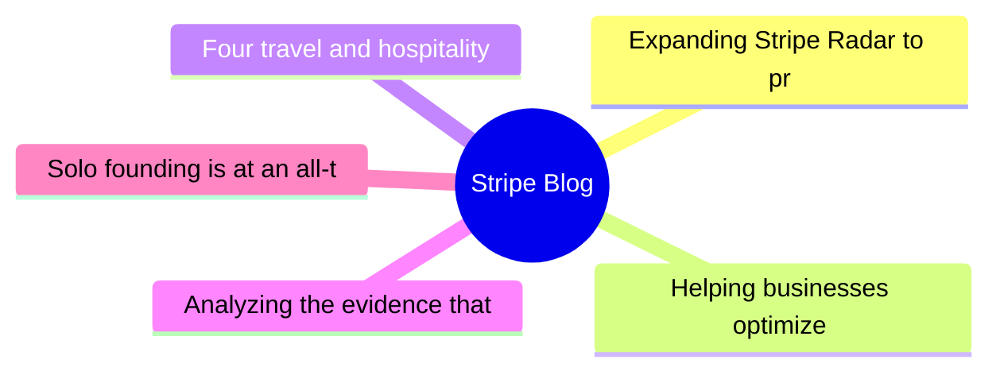
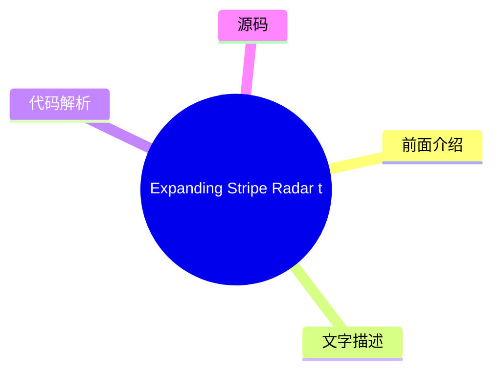
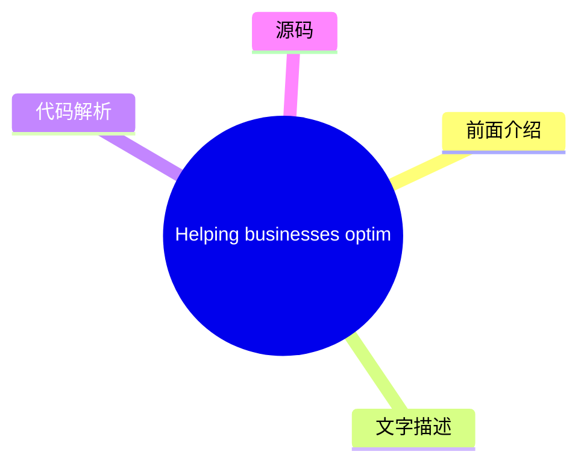
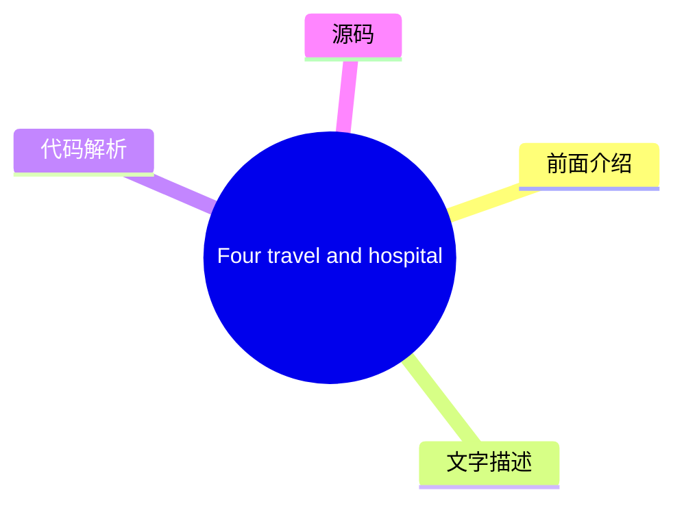
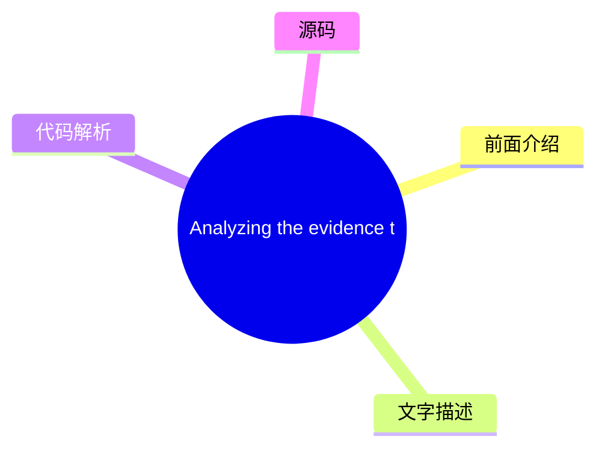
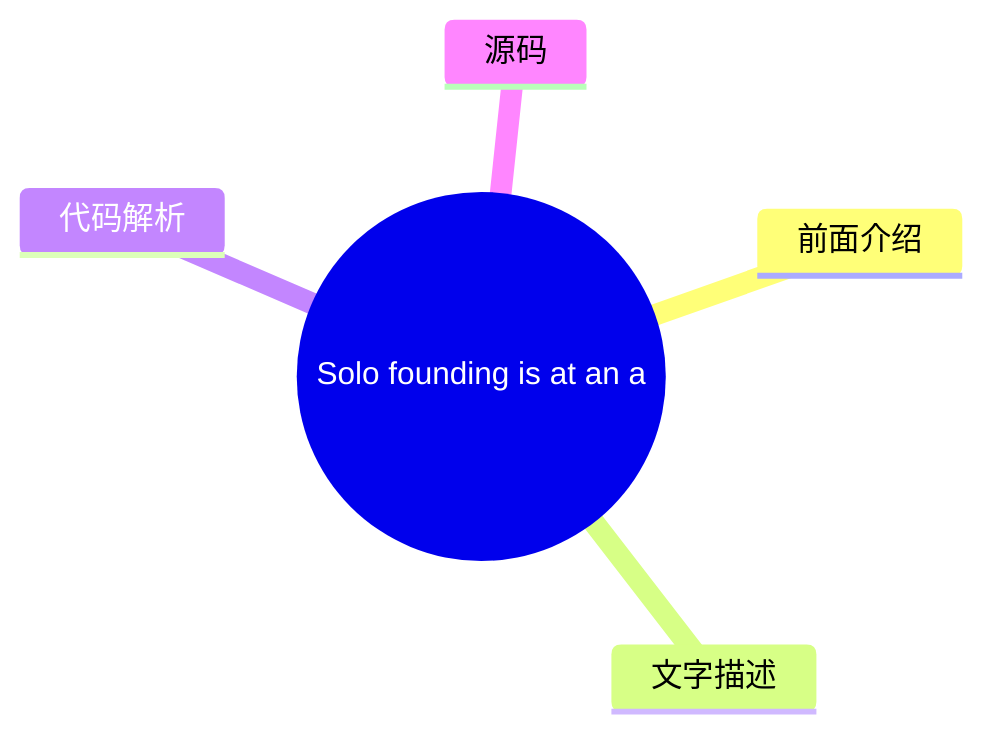

# 💳 Stripe Blog Top 5 (2026-08-07)

## 前面介绍

- 数据源：Stripe Blog
- 抓取日期：2026-08-07
- 条目数：5
- 含完整正文：5
- 含代码片段：0
- 组织方式：前面介绍 / 树状图 / 文字描述 / 代码解析 / 源码

## 思维导图

## 详细整理（5 条，5 条含全文，0 条含代码）

### 1. Expanding Stripe Radar to protect more of your business
- **链接**: [https://stripe.com/blog/expanding-stripe-radar-to-protect-more-of-your-business](https://stripe.com/blog/expanding-stripe-radar-to-protect-more-of-your-business)
- **发布**: Wed, 27 May 2026 00:00:00 +0000

#### 前面介绍

- Radar now blocks high-risk transactions across all supported payment methods; defends against new fraud types like multi-account abuse and pay-as-you-go abuse, regardless of which payment processor you use; and gives platforms new tools to evaluate a
- 发布时间：Wed, 27 May 2026 00:00:00 +0000

#### 树状图

#### 文字描述

- Last month at Stripe Sessions, we shared the biggest expansion we’ve ever made to [Stripe Radar](https://stripe.com/radar), our AI-powered fraud prevention tool. Radar now blocks high-risk transactions across all supported payment methods; defends against new fraud types like multi-account abuse and pay-as-you-go abuse, regardless of which payment processor you use; and gives p
- ## Protect more transactions with global payment coverage, new multiprocessor signals, and custom models Fraud protection is getting more complex. Businesses need to defend across a range of payment methods, and they need more precision in the signals they use to catch fraud before it happens—on and off Stripe. Radar now addresses both, along with the ability to use custom frau
- ## Defend against new types of fraud Fraudulent actors have become as sophisticated at stealing compute as they are at stealing money. They abuse policies by cycling through free trials, setting up multiple accounts, or intentionally not paying their next invoice. As businesses scale AI products, token abuse has become an expensive fraud vector. Last month, we shared how Radar 
- ## Protect your platform from account fraud Fraudulent actors are using generative AI to create fake identities, documents, and websites convincing enough to bypass many platforms’ verification systems. Platforms face a trade-off: request additional information during onboarding and increase friction, or keep the onboarding flow lightweight and take on potentially significant r

#### 代码解析

- 本文未检测到明确代码块，内容更偏新闻、观点或方法论。

#### 源码

#### 中文节选

上个月在 Stripe Sessions 上，我们分享了迄今为止对 [Stripe Radar](https://stripe.com/radar) 最大的扩展，这是我们的一款基于 AI 的欺诈防护工具。Radar 现在可以阻止所有支持的支付方式下的高风险交易；无论您使用哪家支付处理器，都能防御多账户滥用和先买后付滥用等新型欺诈；并为平台提供了新的工具，用于评估和缓解 Stripe 内外商户的风险。我们还推出了更多方式，利用更智能的证据和自动证据库来处理争议。

以下是我们要宣布内容的详细情况。

## 利用全球支付覆盖、新的多处理器信号和自定义模型保护更多交易

欺诈防护正变得日益复杂。企业需要在多种支付方式下进行防御，并且需要更精确的信号来在欺诈发生前将其捕获——无论是在 Stripe 上还是 Stripe 外。Radar 现在同时解决了这两个问题，并增加了使用自定义欺诈模型的能力。

**阻止所有支持的全球支付方式下的高风险交易
**

Radar 现在保护[全球所有支持的交易量](https://docs.stripe.com/radar/local-payment-methods)，包括银行借记、先买后付 (BNPL) 选项、加密货币、数字钱包、实时支付和现金代金券。当 Radar 检测到交易中的欺诈模式时，该信息将可用于保护所有支付方式的交易。例如，如果欺诈行为者在 Stripe 上的某家企业使用被盗信用卡，而我们检测并阻止了该行为，那么该相同的 IP 地址和设备指纹现在会在银行借记、钱包和 BNPL 交易网络范围内被标记。我们发现，对于使用 Affirm、Cash App、Klarna 和 PayPal 的企业，Radar 在五个月内将可疑欺诈减少了 71%。

**利用新的多处理器信号改进您的欺诈决策
**

Businesses use Radar’s risk signals for off-Stripe transactions to complement their in-house fraud models and make more precise fraud decisions across payment processors. Now, you can further improve your fraud decisioning with additional signals for off-Stripe transactions to help you prevent fraud before it happens.

Stripe can now identify whether a payment is [likely to trigger an early fraud warning](https://docs.stripe.com/radar/multiprocessor#early-fraud-warning) from the card network. You can then choose to proactively refund the transaction and protect your dispute rate. 

Stripe can also predict whether a payment is [likely to result in a fraudulent dispute](https://docs.stripe.com/radar/multiprocessor#fraudulent-dispute). You can use this signal to issue refunds, gather evidence, or adjust your dispute strategy. 

We plan to add new signals that can be used across your entire payments stack.

**Access enterprise-grade custom fraud models
**

For businesses with more complex risk profiles, Radar now offers [custom fraud models](https://docs.stripe.com/radar/custom-

#### 完整正文（中文）

上个月在 Stripe Sessions 上，我们分享了迄今为止对 [Stripe Radar](https://stripe.com/radar) 最大的扩展，这是我们的一款基于 AI 的欺诈防护工具。Radar 现在可以阻止所有支持的支付方式下的高风险交易；无论您使用哪家支付处理器，都能防御多账户滥用和先买后付滥用等新型欺诈；并为平台提供了新的工具，用于评估和缓解 Stripe 内外商户的风险。我们还推出了更多方式，利用更智能的证据和自动证据库来处理争议。

以下是我们要宣布内容的详细情况。

## 利用全球支付覆盖、新的多处理器信号和自定义模型保护更多交易

欺诈防护正变得日益复杂。企业需要在多种支付方式下进行防御，并且需要更精确的信号来在欺诈发生前将其捕获——无论是在 Stripe 上还是 Stripe 外。Radar 现在同时解决了这两个问题，并增加了使用自定义欺诈模型的能力。

**阻止所有支持的全球支付方式下的高风险交易
**

Radar 现在保护[全球所有支持的交易量](https://docs.stripe.com/radar/local-payment-methods)，包括银行借记、先买后付 (BNPL) 选项、加密货币、数字钱包、实时支付和现金代金券。当 Radar 检测到交易中的欺诈模式时，该信息将可用于保护所有支付方式的交易。例如，如果欺诈行为者在 Stripe 上的某家企业使用被盗信用卡，而我们检测并阻止了该行为，那么该相同的 IP 地址和设备指纹现在会在银行借记、钱包和 BNPL 交易网络范围内被标记。我们发现，对于使用 Affirm、Cash App、Klarna 和 PayPal 的企业，Radar 在五个月内将可疑欺诈减少了 71%。

**利用新的多处理器信号改进您的欺诈决策
**

企业使用 Radar 的风险信号来补充其内部欺诈模型，并在各个支付处理商处做出更精确的欺诈决策。现在，您可以通过针对非 Stripe 交易的其他信号进一步改进欺诈决策，从而帮助您在欺诈发生前加以预防。

Stripe 现在可以识别支付是否可能触发来自卡组织的[早期欺诈警告](https://docs.stripe.com/radar/multiprocessor#early-fraud-warning)。然后，您可以选择主动退款交易，以保护您的拒付率。

Stripe 还可以预测支付是否可能导致[欺诈性拒付](https://docs.stripe.com/radar/multiprocessor#fraudulent-dispute)。您可以使用此信号来发起退款、收集证据或调整您的拒付策略。

我们计划添加可在您整个支付体系中使用的新信号。

**访问企业级自定义欺诈模型**

对于风险概况更复杂的企业，Radar 现在提供[自定义欺诈模型](https://docs.stripe.com/radar/custom-fraud-models)。您可以将业务独有的信号传递给 Stripe，例如产品目录数据、忠诚度状态、行为指标或任何与您的风险概况相关的结构化元数据。Stripe 然后将此信息与我们全球网络数据相结合，部署专门针对您业务定制的模型。对于早期采用者，自定义模型在不增加误报的情况下，能检测出至少 15% 的更多欺诈。

## 防范新型欺诈

欺诈行为者窃取计算资源的能力与窃取资金的能力一样娴熟。他们通过反复使用免费试用、开设多个账户或故意不支付下一张账单来滥用政策。随着企业扩展 AI 产品，令牌滥用已成为一种昂贵的欺诈手段。

上个月，我们分享了 Radar 如何通过[防止免费试用滥用](https://stripe.com/blog/how-stripe-radar-helps-prevent-free-trial-abuse)来应对这些欺诈手段之一。在 Sessions 上，我们重点介绍了保护您的企业免受多账户滥用、按量付费欺诈和欺诈机器人驱动支付侵害的新方法。

**Block multi-account abuse
**

Multi-account abuse is when a single fraudulent actor creates several accounts to reuse promotional coupons or spread stolen card activity across multiple accounts to avoid detection for longer. Across the Stripe network, more than one in six sign-ups at AI companies are linked to multi-account abuse.

Now, Radar can [evaluate each new account in real time](https://docs.stripe.com/radar/multi-account-and-account-sharing-abuse#multi-account-abuse), so you can block suspicious accounts before abuse happens—on and off Stripe. Our solution draws on information from prior abuse across the entire Stripe network, including device fingerprints, IP addresses, email domains, and more. In the past two months, ElevenLabs has been able to block 2,000 users a day from abusing its free tier. 

**Predict pay-as-you-go abuse
**

Pay-as-you-go abuse occurs when customers abuse your service by racking up usage costs with no intention of paying when the bill comes due. These bad actors exploit the structure of consumption-based pricing, where charges accumulate throughout a billing cycle, but payment happens later. For example, a customer could consume thousands of dollars of compute over the course of a month, get billed at the end, and never pay.

Radar now helps [predict nonpayment abuse as usage accumulates](https://docs.stripe.com/radar/pay-as-you-go-abuse), allowing you to intervene before a customer is billed. This allows you to require a top-up, cut off service, or take whatever action fits your risk tolerance.  

**Detect and prevent fraudulent bot-driven payments
**

As agentic commerce scales, distinguishing between legitimate agents acting on behalf of customers and malicious bots becomes increasingly important. Both are nonhuman traffic making purchases, but one is a customer’s authorized agent, and the other might exploit your checkout to buy limited-availability inventory, abuse promotional pricing, or bypass purchase limits.

Radar now assigns a bot score to payments made on Stripe Checkout, evaluating the likelihood that [they were made by a malicious bot](https://docs.stripe.com/radar/bot-abuse). You can use this score to enforce anti-scripting or anti-bot policies. For example, you could block automated purchases of limited-edition items or flag high-velocity orders for review.

## Protect your platform from account fraud

Fraudulent actors are using generative AI to create fake identities, documents, and websites convincing enough to bypass many platforms’ verification systems. Platforms face a trade-off: request additional information during onboarding and increase friction, or keep the onboarding flow lightweight and take on potentially significant risk.

[Platforms can now mitigate risk](https://docs.stripe.com/radar/radar-for-platforms) across their business with Radar, featuring 0-to-100 fraud scores for every business and transaction; AI-powered insights that explain why accounts are flagged; note taking and account history to help your team understand account context; and account-level metrics for disputes, declines, refunds, and payments. 

We also introduced three new ways platforms can monitor and evaluate merchant risk—on and off Stripe.

- The [fraudulent website](https://docs.stripe.com/radar/fraudulent-website)signal analyzes a business’s website the way a human fraud analyst would, looking for red flags like luxury items sold at unrealistically low prices, AI-generated copy, misspelled brand URLs, or other indicators that suggest the site is fraudulent. Platforms can use this signal during onboarding to automate verifications, flag accounts for manual review, or as an input to their own risk scoring before approving a business.
- The [fraudulent merchant](https://docs.stripe.com/radar/fraudulent-merchant)signal identifies whether a new or existing account poses a fraud risk, based on analyzing patterns across the Stripe network, including bank account information, business details, transaction activity, and disputes. Platforms can then raise a review, pause payouts, pause payments, reject the account, set reserves, or request identity verification.

- [商户拖欠风险](https://docs.stripe.com/radar/merchant-delinquency-risk)信号预测企业是否面临产生负余额的风险；具体而言，它预测该余额是否可能持续保持负值 60 天或更长时间。平台可利用此信号来决定是否主动调整结算时间表，对高风险账户要求预留金，或在损失累积之前标记商户以进行更仔细的审查。

## 利用更智能的证据和自动化证据库更有效地应对争议

[智能争议](https://docs.stripe.com/disputes/smart-disputes)是我们基于 AI 的争议管理产品，一直以来都会代表您整理并提交证据。现在，智能争议可以制定更定制化的策略，以提高您赢得每起争议的几率。

智能争议会分析每起争议，并针对特定证据字段（如追踪号码或客户使用日志）提供 [AI 驱动的建议](https://docs.stripe.com/disputes/set-up-smart-disputes#provide-more-data-at-dispute-time)。通过智能争议添加我们 AI 推荐证据的企业，其胜诉频率是不添加任何证据企业的 3 倍。

我们还正在减少提交证据所需的人工工作量。许多争议需要相同的支持材料：条款和条件、退货政策和服务协议。借助证据库，您只需上传并存储这些文档一次，智能争议便会根据争议的原因代码、网络要求和持卡人主张，自动选择并将它们包含在您的证据包中——无需手动重新提交。

## 接下来是什么

在 Sessions 上，我们还发布了[我们的公开路线图](https://stripe.com/roadmap)：一份包含数百个详细条目的清单，涵盖截至 2027 年第一季度，包括 [Radar 产品、功能和改进](https://stripe.com/roadmap?product=Radar)。

想了解更多 Radar 如何保护您的业务，请加入我们在全球主要城市的 [Stripe Tour 2026](https://stripetour.com/)。您也可以 [阅读我们的文档](https://docs.stripe.com/radar) 或 [联系我们的专家团队](https://stripe.com/contact/sales)。

### 2. Helping businesses optimize network costs with the Visa Digital Commerce Authentication Program (DCAP)
- **链接**: [https://stripe.com/blog/helping-businesses-optimize-network-costs-with-visa-digital-commerce-authentication-program](https://stripe.com/blog/helping-businesses-optimize-network-costs-with-visa-digital-commerce-authentication-program)
- **发布**: Wed, 03 Jun 2026 00:00:00 +0000

#### 前面介绍

- We moved quickly to help Stripe businesses take advantage of DCAP and capture interchange savings while protecting authorization rates. Here’s what we did.
- 发布时间：Wed, 03 Jun 2026 00:00:00 +0000

#### 树状图

#### 文字描述

- Visa recently launched the [Digital Commerce Authentication Program (DCAP)](https://support.stripe.com/questions/understand-the-visa-digital-commerce-authentication-program-%28dcap%29-on-stripe), a new global framework designed to reduce fraud and increase authorization rates for card-not-present transactions. The program rewards businesses in the US for sharing richer transact
- ### Optimizing DCAP savings without sacrificing conversion Before rolling out DCAP, we worked with Visa to run readiness testing and identify the right implementation approach. This collaborative testing underscored the need for transaction-level intelligence. With [Stripe Authorization Boost](https://stripe.com/authorization-boost), we intelligently select which transactions s
- ## Automatically benefit from DCAP optimizations If you use Authorization Boost and are collecting the required data points, you’re already automatically benefiting from DCAP optimizations. For businesses using [standalone 3DS](https://docs.stripe.com/payments/3d-secure/standalone-3d-secure), you can participate by setting **flow_preference[type]** to `data_share` on authentica

#### 代码解析

- 本文未检测到明确代码块，内容更偏新闻、观点或方法论。

#### 源码

#### 中文节选

Visa 最近推出了 [数字商业认证计划 (DCAP)](https://support.stripe.com/questions/understand-the-visa-digital-commerce-authentication-program-%28dcap%29-on-stripe)，这是一个旨在减少欺诈并提高非接触式交易授权率的新全球框架。该计划奖励美国企业，要求其在认证过程中与发卡行分享更丰富的交易数据，例如设备 ID、账单地址、IP 地址和客户电子邮件。符合条件的交易可获得 5 个基点的净交换费减免。

新的网络计划带来了机遇，但也引入了复杂性。企业需要了解哪些交易符合资格，确保其集成传递了所需数据，并确定参与是否有助于改善其端到端交易经济状况，或者是否会产生意想不到的后果，例如损害授权率。

要参与 DCAP，企业需要在结账流程中通过无摩擦认证与发卡行分享所需的持卡人数据。这可能会引入延迟，并导致发卡行在解读这些较新的信号时存在不确定性。

我们迅速采取行动，帮助 Stripe 企业利用 DCAP 并在保护授权率的同时获取交换费节省。以下是我们的做法。

### 在不牺牲转化率的情况下优化 DCAP 节省

在推出 DCAP 之前，我们与 Visa 合作进行了就绪性测试，并确定了正确的实施方法。这种协作测试凸显了交易级智能的必要性。

With [Stripe Authorization Boost](https://stripe.com/authorization-boost), we intelligently select which transactions should go through [Data Only 3DS](https://docs.stripe.com/payments/3d-secure/strong-customer-authentication-exemptions#data-only), which sends additional risk data from the card network to the issuer for authorization. Rather than applying static rules, Authorization Boost evaluates cost savings, conversion impact, and fraud risk at the individual transaction level to determine when to apply Data Only 3DS. This allows businesses to capture DCAP savings while limiting the impact to the customer experience and optimizing authorization rates.

Since April 18, we’ve helped Stripe businesses capture $18.4 million in annualized network cost savings from DCAP. By helping businesses collect and pass the required data, we saw an 8x increase in the number of DCAP-eligible transactions. We’re continuing to work with Visa to optimize eligibility, so more transactions can benefit from DCAP.

## Automatically benefit from DCAP optimizations

If you use Authorization Boost and are collecting the required data points, you’re already automatically benefiting from DCAP optimizations. For businesses using [standalone 3DS](https://docs.stripe.com/payments/3d-secure/standalone-3d-secure), you can participate by setting **flow_preference[type]** to `data_share` on authentication requests and ensuring require

#### 完整正文（中文）

Visa 最近推出了 [数字商业认证计划 (DCAP)](https://support.stripe.com/questions/understand-the-visa-digital-commerce-authentication-program-%28dcap%29-on-stripe)，这是一个旨在减少欺诈并提高非接触式交易授权率的新全球框架。该计划奖励美国企业，要求其在认证过程中与发卡行分享更丰富的交易数据，例如设备 ID、账单地址、IP 地址和客户电子邮件。符合条件的交易可获得 5 个基点的净交换费减免。

新的网络计划带来了机遇，但也引入了复杂性。企业需要了解哪些交易符合资格，确保其集成传递了所需数据，并确定参与是否有助于改善其端到端交易经济状况，或者是否会产生意想不到的后果，例如损害授权率。

要参与 DCAP，企业需要在结账流程中通过无摩擦认证与发卡行分享所需的持卡人数据。这可能会引入延迟，并导致发卡行在解读这些较新的信号时存在不确定性。

我们迅速采取行动，帮助 Stripe 企业利用 DCAP 并在保护授权率的同时获取交换费节省。以下是我们的做法。

### 在不牺牲转化率的情况下优化 DCAP 节省

在推出 DCAP 之前，我们与 Visa 合作进行了就绪性测试，并确定了正确的实施方法。这种协作测试凸显了交易级智能的必要性。

使用 [Stripe Authorization Boost](https://stripe.com/authorization-boost)，我们可以智能选择哪些交易应通过 [Data Only 3DS](https://docs.stripe.com/payments/3d-secure/strong-customer-authentication-exemptions#data-only)，该流程会从卡网络向发卡行发送额外的风险数据。Authorization Boost 不会应用静态规则，而是在交易级别评估成本节约、转化影响和欺诈风险，以确定何时应用 Data Only 3DS。这使企业能够在限制对客户体验的影响并优化授权率的同时，捕获 DCAP 节省。

自 4 月 18 日以来，我们已帮助 Stripe 企业从 DCAP 中获得了 1840 万美元的年度化网络成本节约。通过帮助企业收集和传递所需数据，我们观察到符合 DCAP 条件的交易数量增加了 8 倍。我们正在继续与 Visa 合作优化资格条件，以便更多交易能够受益于 DCAP。

## 自动受益于 DCAP 优化

如果您使用 Authorization Boost 并正在收集所需的数据点，您已经自动受益于 DCAP 优化。对于使用 [standalone 3DS](https://docs.stripe.com/payments/3d-secure/standalone-3d-secure) 的企业，您可以通过在认证请求上将 **flow_preference[type]** 设置为 `data_share` 并确保填写了必填字段来参与。

了解更多关于 [Authorization Boost](https://docs.stripe.com/payments/analytics/optimization) 如何帮助优化您的支付表现。

### 3. Four travel and hospitality trends from HITEC 2026
- **链接**: [https://stripe.com/blog/trends-from-hitec](https://stripe.com/blog/trends-from-hitec)
- **发布**: Tue, 23 Jun 2026 00:00:00 +0000

#### 前面介绍

- More than 6,000 hospitality executives and operators gathered in San Antonio last week for the HITEC conference. The big topic: whether the industry’s AI investment is actually working. Across four days and over 50 meetings, four trends stood out.
- 发布时间：Tue, 23 Jun 2026 00:00:00 +0000

#### 树状图

#### 文字描述

- More than 6,000 hospitality executives and operators gathered in San Antonio last week for the annual HITEC hospitality technology conference, including leaders from Wyndham Hotels & Resorts, Hyatt, IHG Hotels & Resorts, Starwood Hotels, and hundreds of independent properties. The big topic: whether the industry’s AI investment is actually working. IDC forecasts that [30%](http
- ## The race for direct bookings has moved from search rankings to AI answers For years, the hospitality industry’s answer to online travel agency (OTA) dependency was SEO: invest in content, improve search rankings, and convert guests before they end up on Expedia or Booking.com. That approach is becoming less effective. Jack Wang, principal solution engineer at Salesforce, off
- ## Most hospitality AI is falling short in a predictable way An uncomfortable truth surfaced repeatedly throughout HITEC: much of the AI scaling happening across hospitality is fragile. The majority of businesses are adopting AI without the strategic clarity, data foundation, and operational architecture to sustain it. The root cause is often fragmented data. Siloed property ma
- ## Payments friction has a measurable cost, but most hotels still don’t know what it is The hospitality industry has historically treated payments as a cost and commodity: something to keep running, minimize fees on, and keep out of the way. Many of the payments-specific conversations we had at HITEC revolved around how that approach is changing, along with a growing recognitio

#### 代码解析

- 本文未检测到明确代码块，内容更偏新闻、观点或方法论。

#### 源码

#### 中文节选

超过 6,000 名酒店高管和经营者上周齐聚圣安东尼奥，参加年度 HITEC 酒店技术会议，其中包括万豪度假酒店、凯悦、洲际酒店集团、喜达屋酒店以及数百家独立物业的领导者。

主要议题：行业的人工智能投资是否真的奏效。IDC 预测，到 2030 年，30% 的所有旅行预订将由人工智能代理完成。但行业的发展方向与当前具备的支持能力之间存在巨大差距。

根据 BCG 的数据，25% 的酒店企业报告称目前正在积极扩大人工智能的应用，但不到 10% 的企业被视为“AI 未来构建型”——这意味着它们在核心运营中植入了人工智能，拥有支持性的数据基础，并且有可衡量的回报。“许多公司是在盲目尝试，看能不能行得通，”佛罗里达国际大学酒店技术副教授 Dale Gomez 说。“他们想要看到投资回报率。”

其他变革正在推进中。许多酒店企业仍然缺乏现代财务基础设施，无法充分受益于人工智能预计将带来的自动化、速度和互操作性。曾经被认为“足够好”的支付系统现在正在造成可衡量的收入损失，而不断上升的客人期望已将低效的技术从一个小麻烦变成了不再回头的理由。

在四天的时间里，举行了 50 多次会议，四个趋势脱颖而出。

## 直接预订的竞争已从搜索排名转向 AI 回答

多年来，酒店行业应对在线旅行社（OTA）依赖症的答案是 SEO：投资内容，提高搜索排名，并在客人最终出现在 Expedia 或 Booking.com 之前将其转化。这种方法正变得越来越无效。

Salesforce 的首席解决方案工程师 Jack Wang 提供的数据凸显了一种转变：现在，65% 触发 AI 概览的谷歌搜索最终都没有用户点击任何网站。在移动端，这一数字上升至 78%。随着 AI 生成的摘要取代了 SEO 旨在赢得的排名链接列表，传统搜索流量在整个行业下降了约 25%。

被纳入 AI 生成的答案需要与 SEO 奖励的内容不同。SEO 响应关键词密度、反向链接和页面权威性。AI 纳入响应的是结构化属性数据的准确性和机器可读性，如房间类型、设施详情、政策、本地背景或取消条款。一家酒店可能在传统搜索中排名良好，但对 LLM 来说却是不可见的：超过 [90%](https://www.nokumo.net/en/ai-visibility-in-hospitality-what-3-600-ai-responses-and-1-337-website-audits-reveal?utm_campaign=ennismore-proves-tech-investment-pays-off-and-94-of-hotels-are-invisible-to-ai) 的住宿

#### 完整正文（中文）

超过 6,000 名酒店高管和经营者上周齐聚圣安东尼奥，参加年度 HITEC 酒店技术会议，其中包括万豪度假酒店、凯悦、洲际酒店集团、喜达屋酒店以及数百家独立物业的领导者。

主要议题：行业的人工智能投资是否真的奏效。IDC 预测，到 2030 年，30% 的所有旅行预订将由人工智能代理完成。但行业的发展方向与当前具备的支持能力之间存在巨大差距。

根据 BCG 的数据，25% 的酒店企业报告称目前正在积极扩大人工智能的应用，但不到 10% 的企业被视为“AI 未来构建型”——这意味着它们在核心运营中植入了人工智能，拥有支持性的数据基础，并且有可衡量的回报。“许多公司是在盲目尝试，看能不能行得通，”佛罗里达国际大学酒店技术副教授 Dale Gomez 说。“他们想要看到投资回报率。”

其他变革正在推进中。许多酒店企业仍然缺乏现代财务基础设施，无法充分受益于人工智能预计将带来的自动化、速度和互操作性。曾经被认为“足够好”的支付系统现在正在造成可衡量的收入损失，而不断上升的客人期望已将低效的技术从一个小麻烦变成了不再回头的理由。

在四天的时间里，举行了 50 多次会议，四个趋势脱颖而出。

## 直接预订的竞争已从搜索排名转向 AI 回答

多年来，酒店行业应对在线旅行社（OTA）依赖症的答案是 SEO：投资内容，提高搜索排名，并在客人最终出现在 Expedia 或 Booking.com 之前将其转化。这种方法正变得越来越无效。

Salesforce 的首席解决方案工程师 Jack Wang 提供的数据凸显了一种转变：现在，65% 触发 AI 概览的 Google 搜索最终都没有用户点击任何网站。在移动端，这一数字上升至 78%。随着 AI 生成的摘要取代了 SEO 旨在赢得的排名链接列表，传统搜索流量在整个行业下降了约 25%。

被纳入 AI 生成的答案需要与 SEO 奖励的内容不同。SEO 响应的是关键词密度、反向链接和页面权威性。AI 纳入则响应结构化属性数据的准确性和机器可读性，如房型、设施详情、政策、本地背景或取消条款。一家酒店可能在传统搜索中排名靠前，但对 LLM 来说却是不可见的：超过 [90%](https://www.nokumo.net/en/ai-visibility-in-hospitality-what-3-600-ai-responses-and-1-337-website-audits-reveal?utm_campaign=ennismore-proves-tech-investment-pays-off-and-94-of-hotels-are-invisible-to-ai) 的住宿网站仍被 AI 模型遗漏。

我们已经看到了下游效应。根据 Phocuswright 的研究，[56%](https://www.phocuswire.com/news/online/shift-travel-behavior-ai-surge-phocuswright-research) 的旅行者在过去 12 个月中曾使用 AI 进行行程规划、预订或在目的地协助。对于运营商来说，第一步是审计，而不是投资。潜在客人使用的 LLM 能否准确描述您酒店的房型、设施、政策和本地背景？如果答案是否定的，这个差距很可能会让您错失预订。

今天，酒店连锁企业可以像 OTA 一样使用结账和支付工具，包括本地支付方式、货币、一键结账和全球欺诈保护。捕捉代理需求的旅游品牌正在将 AI 驱动的可发现性与准确的实时库存以及高效的转化现代结账体验相结合。

## 大多数酒店 AI 都以可预测的方式未能达标

在 HITEC 期间，一个令人不安的事实反复出现：酒店业正在发生的许多 AI 扩展都是脆弱的。大多数企业采用 AI 时缺乏维持其发展的战略清晰度、数据基础和运营架构。

根本原因通常是数据碎片化。孤立的物业管理系统、CRM、忠诚度、餐饮和支付系统各自只持有关于同一客人的部分视图——而 AI 推荐的准确性仅取决于它们所使用的内容。同样导致 AI 个性化失效的数据问题，在财务上表现为过度的对账时间，在运营上表现为不完整的客人档案，在客人体验上表现为摩擦。

Salesforce 首席解决方案工程师 Amanda Sharp 将这一问题重构为 AI 运营化而非采用，并呼吁“氛围运营”：这是酒店业对“氛围编码”的回应。如今，许多酒店品牌构建 AI 功能已成为可能。但在生产环境中可靠地运行它们，并将其集成到触发实际操作的真正工作流程中，则要困难得多。

在这方面做得好的企业拥有干净、连接的数据，能够将有用的情报直接在工作流程中传递，从而在采取行动的时机尚存时发挥作用。例如，达美航空在其移动应用中内置了实时 AI 礼宾，利用 SkyMiles 档案和运营数据，在客户关怀体验中提供上下文感知的支持。在永利拉斯维加斯，收益经理在业绩低于目标时，会收到预测性警报以及附带的建议行动。

对于大多数旅游运营商来说，瓶颈在于数据连接而非模型质量。

## 支付摩擦具有可衡量的成本，但大多数酒店仍不知道其具体金额

The hospitality industry has historically treated payments as a cost and commodity: something to keep running, minimize fees on, and keep out of the way. Many of the payments-specific conversations we had at HITEC revolved around how that approach is changing, along with a growing recognition that payments have become a key factor in how hospitality brands compete. Our own data supports this: in a Stripe-commissioned [survey](https://go.stripe.global/rs/072-MDK-283/images/Skift_x_Stripe_How_Payment_Systems_Are_Changing_in_Travel_and_Hospitality.pdf) of nearly 400 hospitality executives, 90% said payments are important to growth, and 37% said that a lack of payment options has the greatest negative impact on the guest experience. In addition, 58% said their fraud systems block legitimate transactions, and 74% reported that fragmented systems cause their teams to spend excessive time on reconciliation.

Those figures highlight why payments have become a structural advantage. OTAs can afford to staff payments at scale because their revenue justifies the head count. Independent hotels and smaller operators can’t match that investment directly, but a lean team on the right infrastructure can now support payment methods across dozens of countries at a fraction of the cost of a large in-house operation.

A coverage gap translates directly to lost bookings. “The moment we don’t support [a payment method] is the moment this guest goes elsewhere, to a platform or channel that supports their preferred way to pay,” said Sebastien Leitner, VP of strategic partnerships at Cloudbeds. Guests book where their preferred payment method works. A property that doesn’t support the dominant method in a target market isn’t just creating friction—it’s routing that booking to an OTA that does.

## The best hospitality technology is the kind that goes unnoticed

“There is zero empathy for technology that doesn’t work,” said Tanya Pratt, global VP of strategy and product management at Oracle Hospitality. “If it’s not working, it’s going to cause more frustration than if there’s a line at the front desk, because people are used to that.” When technology fails, guests don’t always complain. They just don’t come back.

The real gauge of success is when technology works well enough that guests don’t think about it at all. Denise Walker, CIO of Starwood Hotels, described the vision: a returning guest arrives to a room at the right temperature, with their preferred channels on the TV, and pillows of their preferred firmness on the bed. No one announces how they knew. “It doesn’t have to be delivered in a way that says, ‘How did you know that?’”

Shannon McCallum, VP of hotel operations at Resorts World Las Vegas, went further. “We’re moving from ‘I told you this, so you know it about me’ to ‘I didn’t tell you anything, and now you’re predicting it.’”

Both the invisible personalization and the human moments it enables require a foundation of connected data—tech that integrates across your existing stack, consolidating guest information into a single system. That infrastructure allows businesses to recognize the same guest whether they’re browsing your website or standing at the front desk.

## How Stripe can help

Increasingly, guests will find your property through AI assistants rather than search engines. The bookings they make might be completed by agents. And the revenue that distinguishes high-performing operators will come from payment experiences that convert, payment methods that cover every market, and financial systems that work together. Stripe Data Pipeline connects payments data with your booking and customer systems, giving operators a unified view of revenue without stitched-together reporting.

Stripe’s payments infrastructure helps hospitality operators protect revenue, boost guest spend on-property, and simplify operations.

**Drive direct bookings.** Across the payment methods guests actually use and in every market you serve, payment experiences that convert help keep bookings on your direct channel. As agentic commerce scales, that means fraud detection that runs on every Stripe transaction by default and payment tokens that allow agents to transact without exposing guest credentials. 

**Increase trip spend.** Ancillary revenue from dining, experiences, and partnerships requires payments infrastructure that works across the property, supports new business models, and connects with external partners. Stripe Billing handles the recurring payment logic behind membership and loyalty programs, including automatic renewals, tiered pricing, and failed payment recovery—without requiring operators to maintain that infrastructure themselves. [Cloudbeds](https://stripe.com/customers/cloudbeds), for example, saw 15% revenue growth for businesses using Cloudbeds Payments and a 14.8% average increase in revenue for businesses expanding payment methods by directly removing payment friction through its Stripe partnership.

**Cut costs.** More efficient B2B money movement and fraud protection reduce reconciliation work and limit losses, freeing up margin without adding staff.

[Learn more](https://stripe.com/industries/travel) about how Stripe supports hospitality businesses, or [get in touch](https://stripe.com/contact/sales).

### 4. Analyzing the evidence that helps businesses win “product not received” disputes
- **链接**: [https://stripe.com/blog/analyzing-the-evidence-that-helps-businesses-win-product-not-received-disputes](https://stripe.com/blog/analyzing-the-evidence-that-helps-businesses-win-product-not-received-disputes)
- **发布**: Tue, 21 Jul 2026 00:00:00 +0000

#### 前面介绍

- To understand what can influence win rates, we analyzed evidence packets from one million disputes over a 16-week period. Here’s what the data shows and what it means for how you mitigate disputes.
- 发布时间：Tue, 21 Jul 2026 00:00:00 +0000

#### 树状图

#### 文字描述

- “[Product not received](https://docs.stripe.com/disputes/categories)” disputes—where a cardholder claims they didn’t receive what they paid for—are the most common nonfraud dispute category on Stripe. It can be challenging to know which claims are legitimate and which are not: some customers genuinely never received what they paid for, while others incorrectly claim they didn’t
- ## Businesses that submitted evidence after the delivery was confirmed saw a 27 percentage point higher win rate Many businesses submit a shipping tracking ID as proof of delivery. However, depending on the status of the package at the time you submit the evidence, the tracking number might only confirm that the package left your facility. Our analysis found that win rates incr
- ## Businesses that submitted digital activity and usage logs saw a 10 percentage point higher win rate Businesses selling digital goods also need to provide proof of fulfillment, though the supporting evidence looks different. Disputes with digital activity and usage logs—such as JSON telemetry logs from common analytics platforms showing that a user streamed, downloaded, or ac
- ## Businesses that included evidence of a refund issued through Stripe saw a 63 percentage point higher win rate Cardholders can still initiate [a dispute even after a refund has been processed](https://support.stripe.com/questions/disputes-on-a-refunded-transaction-faq), often because the refund and dispute were filed around the same time or because the issuing bank didn’t che

#### 代码解析

- 本文未检测到明确代码块，内容更偏新闻、观点或方法论。

#### 源码

#### 中文节选

“[Product not received](https://docs.stripe.com/disputes/categories)” disputes—where a cardholder claims they didn’t receive what they paid for—are the most common nonfraud dispute category on Stripe. It can be challenging to know which claims are legitimate and which are not: some customers genuinely never received what they paid for, while others incorrectly claim they didn’t receive the order. 

To understand what can influence win rates, we analyzed evidence packets from one million disputes over a 16-week period. We compared win rates for packets that included various types of evidence—such as delivery confirmation or content consumption logs—against those that didn’t, isolating which features correlated with higher win rates.

Here’s what the data shows for businesses broadly, what’s different for businesses selling digital goods, and what it means for how you mitigate disputes.

**Businesses that submitted delivery information saw a 44 percentage point higher win rate**

For businesses selling physical goods, disputes with delivery confirmation as evidence had a 27 percentage point higher win rate than disputes without it. Adding a GPS delivery map as evidence, which shows where the carrier scanned the package, lifted win rates by an additional 15 percentage points on top of delivery confirmation alone. And including a recipient signature as evidence added a further two percentage point lift. Together, disputes with delivery confirmation, a GPS map, and a signature had a 44 percentage point higher win rate than disputes without them.

Yet many businesses still don’t include delivery confirmation in their dispute responses. Part of this gap is awareness, but the bigger barrier is operational. For most businesses, shipping data and dispute workflows live in separate systems. Matching a specific dispute to the right order and confirmed delivery status often requires manual work and is hard to scale.

## Businesses that submitted evidence after the delivery was confirmed saw a 27 percentage point higher win rate

Many businesses submit a shipping tracking ID as proof of delivery. However, depending on the status of the package at the time you submit the evidence, the tracking number might only confirm that the package left your facility.

Our analysis found that win rates increased based on what the tracking ID showed when a business submitted it—specifically, whether delivery had been confirmed. Disputes with evidence submitted after delivery was confirmed had a 27 percentage point higher win rate than disputes with no delivery confirmation. On the other hand, disputes with evidence submitted when the package was still in transit had only a two percentage point higher win rate than disputes with no delivery confirmation.

This suggests that the timing of your evidence submission matters. Customers might file a “product not received” dispute before an order arrives, especially if a shipment is delayed or still in transit. Because most business

#### 完整正文（中文）

“[未收到商品](https://docs.stripe.com/disputes/categories)” 争议——即持卡人声称未收到所付款项——是 Stripe 上最常见的非欺诈争议类别。要判断哪些索赔是合理的，哪些是不合理的，可能具有挑战性：有些客户确实从未收到他们所付款项的商品，而另一些人则错误地声称未收到订单。

为了了解哪些因素会影响胜诉率，我们在 16 周的时间内分析了来自一百万起争议的证据包。我们将包含各种类型证据（如投递确认或内容消费日志）的证据包的胜诉率与不包含这些证据的证据包进行了比较，从而确定了哪些特征与更高的胜诉率相关。

以下是数据对广泛业务情况的显示，销售数字商品的业务有何不同，以及这对您如何缓解争议意味着什么。

**提交投递信息的业务胜诉率高出 44 个百分点**

对于销售实物商品的业务，包含投递确认作为证据的争议，其胜诉率比不包含投递确认的争议高出 27 个百分点。添加显示承运商扫描包裹位置的 GPS 投递地图作为证据，在仅凭投递确认的基础上又提升了 15 个百分点的胜诉率。而包含收件人签名作为证据则进一步提升了 2 个百分点的胜诉率。综合来看，包含投递确认、GPS 地图和签名的争议，其胜诉率比不包含这些证据的争议高出 44 个百分点。

然而，许多业务在争议回应中仍然不包含投递确认。部分原因在于意识不足，但更大的障碍在于运营。对于大多数业务而言，发货数据和争议工作流位于不同的系统中。将特定的争议与正确的订单以及已确认的投递状态进行匹配，通常需要人工操作，且难以扩展。

## 在投递确认后提交证据的业务胜诉率高出 27 个百分点

许多企业会提交运输跟踪 ID 作为交付证明。然而，取决于您提交证据时包裹的状态，该跟踪号可能仅能确认包裹已离开您的设施。

我们的分析发现，企业提交跟踪 ID 时显示的内容会影响胜诉率——具体而言，即是否已确认交付。在确认交付后提交证据的争议，其胜诉率比未确认交付的争议高出 27 个百分点。另一方面，在包裹仍在运输途中时提交证据的争议，其胜诉率仅比未确认交付的争议高出 2 个百分点。

这表明您提交证据的时机很重要。客户可能会在订单到达之前就提交“未收到商品”的争议，尤其是当发货延迟或仍在运输途中时。由于大多数企业有 20 天或更长的回复时间，如果您的争议处理窗口允许，请考虑等到承运商确认到达后再提交。如果您确实需要在确认交付之前提交，请考虑包含显示订单仍在客户结账时商定的配送时间范围内的文档。

## 提交数字活动和使用日志的企业胜诉率高出 10 个百分点

销售数字商品的企业也需要提供履行证明，尽管支持证据的形式不同。

包含数字活动和使用日志（例如来自常见分析平台的 JSON 遥测日志，显示用户流式传输、下载或访问了其购买的具体产品）的争议，其胜诉率比没有这些证据的争议高出 10 个百分点。而包含服务文档（如配置记录）的争议，其胜诉率比没有这些证据的争议高出 8 个百分点。

这种模式与我们发现的企业销售实物商品的情况一致：具体细节总是更好。服务文档可能只能证明客户有权访问。另一方面，内容消费日志可以证明客户流式传输、下载或访问了他们付费购买的具体产品。

## 包含通过 Stripe 发放退款证据的企业，胜诉率高出 63 个百分点

持卡人仍可能在退款处理完成后发起[争议](https://support.stripe.com/questions/disputes-on-a-refunded-transaction-faq)，这通常是因为退款和争议是在同一时间提交的，或者是发卡行在提交争议前未检查退款状态。当这种情况发生时，许多企业会在争议回复中包含退款证据，以证明他们已经让客户满意。但我们的分析显示，“退款证明”对销售数字商品的企业胜诉率的影响取决于退款是如何处理的。

通过 Stripe 发放的全额退款是销售数字商品的企业高胜诉率的最强预测因素。包含此类证据的争议，其胜诉率比不包含此类证据的争议高出 63 个百分点。另一方面，通过其他渠道（如商店积分）发放的退款，其争议的胜诉率仅比不包含此类证据的争议高出 6 个百分点。

这可能是因为发卡行只能对可以验证的信息采取行动。当退款通过你的支付处理器处理时，发卡行可以验证卡网络上的信用额度。发卡行无法以同样的方式验证通过支付处理器之外发放的退款；因为没有记录。

## Stripe 如何提供帮助

[智能争议](https://docs.stripe.com/disputes/smart-disputes)旨在为你应用这些最佳实践，帮助你节省时间并挽回收入。它使用人工智能为符合条件的卡争议自动组装量身定制的证据包，应用本分析中确定的基于数据的最佳实践，因此你无需逐笔争议手动实施这些实践。

You can increase your win rates by providing Smart Disputes with a shipping carrier and tracking number when you receive a dispute. Stripe supports more than 12 shipping providers and automatically works with them to pull the entire fulfillment history, such as delivery status, time stamps, and location data. You can also add any additional evidence, such as customer communications or supplementary documentation, and Stripe will merge it with the auto-generated packet to create the strongest possible response.

Stripe then assembles that information into a compelling evidence packet for you, optimizing packet content and structure based on the specific dispute, down to the network, region, issuer, and reason code. If you don’t take any action before the dispute deadline, Smart Disputes submits the evidence on your behalf to ensure disputes are not lost due to missed deadlines.

No additional integration is required if you already use Stripe. To learn more about Smart Disputes, [read our docs](https://docs.stripe.com/disputes/smart-disputes). 

*The insights, projections, and forward-looking statements contained here are for informational purposes only and should not be relied upon. These are based on assumptions and information currently available, but actual results may differ materially.*

### 5. Solo founding is at an all-time high: Top performers have these traits in common
- **链接**: [https://stripe.com/blog/top-solo-founder-traits](https://stripe.com/blog/top-solo-founder-traits)
- **发布**: Thu, 28 May 2026 00:00:00 +0000

#### 前面介绍

- In 2025, solo founders in the top decile generated 61 times the revenue of the median solo founder in their first six months. We analyzed the data to understand what drives that gap.
- 发布时间：Thu, 28 May 2026 00:00:00 +0000

#### 树状图

#### 文字描述

- Solo startup founders, defined here as people who launched a startup through Stripe Atlas without any cofounders, account for 63% of C corps formed so far in the second quarter of 2026—an all-time high. As more founders start companies on their own, the gap between typical companies and top performers is widening. Among solo-founded startups incorporated through Atlas, median i
- ## 1. They build AI-native products The most successful solo founders are building AI-native products, meaning the product’s core functionality depends on AI models. Top-decile solo founders were about twice as likely as median founders to be building AI-native companies. The next generation of solo founders will be less defined by technical pedigree and more by speed,” says [M
- ## 2. They sell globally from launch In the first month, top-decile solo founders sold into an average of 10 countries, versus just three for median solo founders. That gap continued to widen over time. By month 24, top-decile solo founders were selling into 40 non-US countries, on average, compared to six for median solo founders. Top solo founders also generated a much larger
- ## 3. They build for businesses Top solo founders were nearly 30% more likely than middle-decile founders to build B2B businesses. “I grew my SaaS to €10K MRR without ads by talking to users every day, only building features that multiple customers asked for, and focusing on being the best service in my specific niche,” says [Pauline Clavelloux](https://x.com/Pauline_Cx), who s

#### 代码解析

- 本文未检测到明确代码块，内容更偏新闻、观点或方法论。

#### 源码

#### 中文节选

Solo startup founders, defined here as people who launched a startup through Stripe Atlas without any cofounders, account for 63% of C corps formed so far in the second quarter of 2026—an all-time high.

As more founders start companies on their own, the gap between typical companies and top performers is widening. Among solo-founded startups incorporated through Atlas, median initial six-month revenue in 2025 was down 23% year over year, while revenue at the top decile was up 19%.

Four years ago, top-decile solo founders made about 34 times the revenue of the median solo founder in their first six months. In 2025, that figure had grown to 61 times. The number of solopreneurs earning over $100,000 per year has [increased a third](https://x.com/emilygsands/status/2049943675485253640) since 2022. 

As AI tools make it easier for one person to build, ship, support customers, and iterate, it’s worth asking what separates the companies that break out from those that don’t. To understand this divide, we analyzed thousands of solo-founded Atlas startups incorporated in 2022 and 2023, each with at least two years of revenue data. Within that group, we compared middle-decile solo founders with those in the top decile by total revenue in their first two years to understand what differentiates the strongest outliers. A few patterns among the top decile stood out.

## 1. They build AI-native products

The most successful solo founders are building AI-native products, meaning the product’s core functionality depends on AI models. Top-decile solo founders were about twice as likely as median founders to be building AI-native companies. The next generation of solo founders will be less defined by technical pedigree and more by speed,” says [Marc Lou](https://marclou.com/), who has founded 34 startups solo. “They’ll be no-code people focused on solving a problem, shipping crazy fast with AI, and cracking distribution on social media.” 

By the two-year mark, AI-native solo startups generated almost twice the revenue of other solo-founded startups. Initially, we expected that result to be driven by a small handful of breakout companies inflating the average, but that’s not the case: revenue at the 99th percentile was nearly the same for AI-native and other startups. The difference comes from the broader distribution, with AI-native startups outperforming from roughly the 50th to the 95th percentile.

## 2. They sell globally from launch

In the first month, top-decile solo founders sold into an average of 10 countries, versus just three for median solo founders. That gap continued to widen over time. By month 24, top-decile solo founders were selling into 40 non-US countries, on average, compared to six for median solo founders.

Top solo founders also generated a much larger share of revenue from outside their home market. International sales accounted for 51% of revenue for top-decile solo founders, compared with 2% for median solo founders. Much of that diffe

#### 完整正文（中文）

独自创业的创始人，在此定义为通过 Stripe Atlas 启动公司且没有联合创始人的个人，占 2026 年第二季度迄今成立的 C 型公司的 63%——创历史新高。

随着更多创始人独自创办公司，典型公司与顶尖表现者之间的差距正在拉大。在通过 Atlas 成立的独自创业公司中，2025 年的中位数初始六个月收入同比下降 23%，而收入处于顶层十分位的公司则增长了 19%。

四年前，顶层十分位的独自创业创始人在前六个月创造的收入约为中位数独自创业创始人的 34 倍。到 2025 年，这一数字已增长到 61 倍。自 2022 年以来，年收入超过 10 万美元的自由职业者数量增加了三分之一。

随着 AI 工具让一个人能够更轻松地构建、发布、支持客户和迭代，值得思考的是，是什么将那些脱颖而出的公司与那些没有脱颖而出的公司区分开来。为了了解这种差异，我们分析了数千家在 2022 年和 2023 年通过 Atlas 成立的独自创业公司，每家公司都有至少两年的收入数据。在该群体中，我们将中位数十分位的独自创业创始人与前两年总收入处于顶层十分位的人进行了比较，以了解是什么区分了最强的异常值。顶层十分位中出现了几种模式。

## 1. 他们构建 AI 原生产品

最成功的独自创业创始人在构建 AI 原生产品，这意味着产品的核心功能依赖于 AI 模型。顶层十分位的独自创业创始人构建 AI 原生公司的可能性约为中位数创始人的两倍。“下一代独自创业创始人将不再由技术背景定义，而更多地由速度定义，”[Marc Lou](https://marclou.com/) 说道，他独自创办了 34 家初创公司。“他们将是无代码人员，专注于解决问题，利用 AI 极速发布，并在社交媒体上破解分发渠道。”

By the two-year mark, AI-native solo startups generated almost twice the revenue of other solo-founded startups. Initially, we expected that result to be driven by a small handful of breakout companies inflating the average, but that’s not the case: revenue at the 99th percentile was nearly the same for AI-native and other startups. The difference comes from the broader distribution, with AI-native startups outperforming from roughly the 50th to the 95th percentile.

## 2. They sell globally from launch

In the first month, top-decile solo founders sold into an average of 10 countries, versus just three for median solo founders. That gap continued to widen over time. By month 24, top-decile solo founders were selling into 40 non-US countries, on average, compared to six for median solo founders.

Top solo founders also generated a much larger share of revenue from outside their home market. International sales accounted for 51% of revenue for top-decile solo founders, compared with 2% for median solo founders. Much of that difference came down to where founders were based: top-decile solo founders were slightly more likely to be located outside the US, so many sold into the US early. Since the US is often the largest and highest-spending market for software, selling there early can accelerate growth.

## 3. They build for businesses

Top solo founders were nearly 30% more likely than middle-decile founders to build B2B businesses. “I grew my SaaS to €10K MRR without ads by talking to users every day, only building features that multiple customers asked for, and focusing on being the best service in my specific niche,” says [Pauline Clavelloux](https://x.com/Pauline_Cx), who solo-founded four companies, including [Refindie](https://www.refindie.com/).

B2B solo founders performed better across the board. By month 24, revenue for the median solo B2B founder was more than four times that of the median solo B2C founder.

That pattern held among top performers. Solo B2B founders in the top decile earned nearly twice as much revenue as their B2C peers.

A common assumption is that this is mainly driven by funding, since B2B founders tend to raise capital more easily. The data suggests otherwise. Even among bootstrapped startups, solo B2B founders generated more revenue than solo B2C founders at both the median and the top decile.

## 4. They have higher customer retention early on

Top solo founders retained a much larger share of their first-month customers than middle-decile founders, suggesting they reach product-market fit earlier. “Validate with paying users before you invest too much time or money,” says Clavelloux. “Progress over perfection: launch fast and iterate often.”

Nearly 30% of customers at top-decile solo startups returned the following month, compared with 8% at middle-decile startups. By the sixth month, top-decile solo founders also began winning back churned customers—roughly three months sooner than middle-decile founders.

That early retention advantage pays off over time. By the start of the second year, customers acquired in the company’s first month were spending 47% more at top-decile startups than they were initially—about twice the increase seen at middle-decile startups.

This contrast was especially pronounced in B2B businesses. Among solo-founded B2B startups, top-decile founders retained first-month customers at six times the rate of median founders.

Part of the reason top solo founders retained more customers might be that they were much more likely to use recurring billing. Based on Stripe data, top-decile B2B and B2C founders were 26 and 20 percentage points more likely to use a recurring billing model than their middle-decile peers, respectively.

While these patterns highlight what many top solo founders have in common, they don’t show how solo-founded companies stack up against multifounder teams.

## 5. Multifounder startups tend to pull ahead over time, but the top solo founders are catching up

Early on, solo-founded startups brought in more revenue than multifounder startups, but that flipped by month 24: top-decile multifounder startups generated 53% more revenue than top-decile solo founders. That remained true even after accounting for investor funding.

然而，在对比最顶尖的自力更生型初创企业时，多创始人优势几乎消失殆尽。在 99 分位数的水平上，自力更生的单人创始人在两年后与自力更生的多创始人初创企业相差无几，收入差距仅为 5%。“最强的单人创始人往往极具足智多谋和高能动性：他们能构建、撰写和发布产品，但也知道如何通过招募优秀人才、顾问和创始人网络来拓展自身能力，”[Fatima Rizwan](https://www.linkedin.com/in/frizwan/) 说道，她独自创立了 [Okara](https://okara.ai/) 和 [TechJuice](https://www.techjuice.pk/)。

## 以单人创始人身份起步

借助 Stripe Atlas，单人创始人可以在两天内从世界任何地方完成公司注册、开设银行账户、接受付款和筹集资金。

- **公司注册与股权：**注册公司、获取 EIN、设置创始人股权归属，并提交 83(b) 税务选举。
- **投资者就绪文档：**由 Cooley（一家领先的初创企业律师事务所）为您起草公司的法律文件。
- **成长资源：**获取价值 5 万美元的合作伙伴福利、2,500 美元的 Stripe 信用额度，并能够通过仪表盘使用 SAFEs 进行融资。

了解更多关于 [Stripe Atlas](https://stripe.com/atlas) 的信息。

