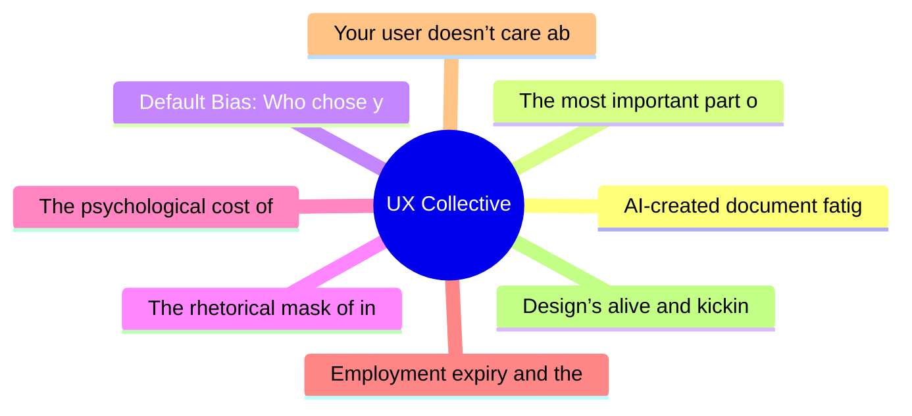

# ✏️ UX Collective Top 8 (2026-06-07)

## 思维导图

## 列表（8 条）

### 1. AI-created document fatigue: how I designed my way out of it
- **链接**: [https://uxdesign.cc/ai-created-document-fatigue-how-i-designed-my-way-out-of-it-1fcd4a565669?source=rss----138adf9c44c---4](https://uxdesign.cc/ai-created-document-fatigue-how-i-designed-my-way-out-of-it-1fcd4a565669?source=rss----138adf9c44c---4)
- **作者**: Heenesh Patel
- **发布**: Tue, 02 Jun 2026 21:53:50 GMT

### 2. The most important part of building your taste is to hand it off
- **链接**: [https://uxdesign.cc/the-most-important-part-of-building-your-taste-is-to-hand-it-off-be91aeac65d9?source=rss----138adf9c44c---4](https://uxdesign.cc/the-most-important-part-of-building-your-taste-is-to-hand-it-off-be91aeac65d9?source=rss----138adf9c44c---4)
- **作者**: Kai Wong
- **发布**: Tue, 02 Jun 2026 11:08:16 GMT
- **简介**: What having taste trapped in your head costs you and your teamContinue reading on UX Collective »

### 3. Default Bias: Who chose your settings?
- **链接**: [https://uxdesign.cc/default-bias-who-chose-your-settings-d2acde25551b?source=rss----138adf9c44c---4](https://uxdesign.cc/default-bias-who-chose-your-settings-d2acde25551b?source=rss----138adf9c44c---4)
- **作者**: Bora
- **发布**: Tue, 02 Jun 2026 11:07:25 GMT

### 4. The rhetorical mask of innovation
- **链接**: [https://uxdesign.cc/the-rhetorical-mask-of-innovation-12f3abcd6120?source=rss----138adf9c44c---4](https://uxdesign.cc/the-rhetorical-mask-of-innovation-12f3abcd6120?source=rss----138adf9c44c---4)
- **作者**: Michael Buckley
- **发布**: Thu, 04 Jun 2026 19:15:48 GMT

### 5. The psychological cost of moving too fast
- **链接**: [https://uxdesign.cc/the-psychological-cost-of-moving-too-fast-867fb3830722?source=rss----138adf9c44c---4](https://uxdesign.cc/the-psychological-cost-of-moving-too-fast-867fb3830722?source=rss----138adf9c44c---4)
- **作者**: Meg Kurdziolek
- **发布**: Sat, 06 Jun 2026 12:15:43 GMT

### 6. Employment expiry and the end of workplace loyalty
- **链接**: [https://uxdesign.cc/employment-expiry-and-the-end-of-workplace-loyalty-8d238865a6e9?source=rss----138adf9c44c---4](https://uxdesign.cc/employment-expiry-and-the-end-of-workplace-loyalty-8d238865a6e9?source=rss----138adf9c44c---4)
- **作者**: Raoul Flaminzeanu
- **发布**: Sat, 06 Jun 2026 12:15:08 GMT

### 7. Your user doesn’t care about your organization chart
- **链接**: [https://uxdesign.cc/your-user-doesnt-care-about-your-organization-chart-39bdde6b3b9c?source=rss----138adf9c44c---4](https://uxdesign.cc/your-user-doesnt-care-about-your-organization-chart-39bdde6b3b9c?source=rss----138adf9c44c---4)
- **作者**: Wira Indra Kusuma
- **发布**: Sat, 06 Jun 2026 12:13:33 GMT
- **简介**: Your user never sees the org chart you fight over. So when it cracks, who do you let pay for it?Continue reading on UX Collective »

### 8. Design’s alive and kicking. It just got some flashy new names.
- **链接**: [https://uxdesign.cc/designs-alive-and-kicking-it-just-got-some-flashy-new-names-779b4503c869?source=rss----138adf9c44c---4](https://uxdesign.cc/designs-alive-and-kicking-it-just-got-some-flashy-new-names-779b4503c869?source=rss----138adf9c44c---4)
- **作者**: Nicole Alexandra Michaelis
- **发布**: Fri, 05 Jun 2026 11:14:48 GMT
