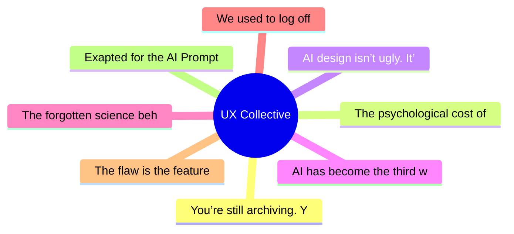

# ✏️ UX Collective Top 8 (2026-06-09)

## 思维导图

## 列表（8 条）

### 1. You’re still archiving. Your files have already become substrate.
- **链接**: [https://uxdesign.cc/youre-still-archiving-your-files-have-already-become-substrate-ce65f088b75a?source=rss----138adf9c44c---4](https://uxdesign.cc/youre-still-archiving-your-files-have-already-become-substrate-ce65f088b75a?source=rss----138adf9c44c---4)
- **作者**: Adrian Levy
- **发布**: Sun, 07 Jun 2026 19:19:29 GMT
- **简介**: Same files. Second function. Different architecture entirely.Continue reading on UX Collective »

### 2. The psychological cost of moving too fast
- **链接**: [https://uxdesign.cc/the-psychological-cost-of-moving-too-fast-867fb3830722?source=rss----138adf9c44c---4](https://uxdesign.cc/the-psychological-cost-of-moving-too-fast-867fb3830722?source=rss----138adf9c44c---4)
- **作者**: Meg Kurdziolek
- **发布**: Sat, 06 Jun 2026 12:15:43 GMT

### 3. AI design isn’t ugly. It’s fluent — and that’s the problem.
- **链接**: [https://uxdesign.cc/ai-design-isnt-ugly-it-s-fluent-and-that-s-the-problem-131b2f4eb78c?source=rss----138adf9c44c---4](https://uxdesign.cc/ai-design-isnt-ugly-it-s-fluent-and-that-s-the-problem-131b2f4eb78c?source=rss----138adf9c44c---4)
- **作者**: Takuma Kakehi
- **发布**: Mon, 08 Jun 2026 22:10:58 GMT
- **简介**: Why Claude Design, Lovable, and v0 all wear the same face&#x200A;&#x2014;&#x200A;and what a dynamited St. Louis housing project predicted about it.Continue reading on UX Collective »

### 4. AI has become the third wheel
- **链接**: [https://uxdesign.cc/ai-has-become-the-third-wheel-ee8e53e06b85?source=rss----138adf9c44c---4](https://uxdesign.cc/ai-has-become-the-third-wheel-ee8e53e06b85?source=rss----138adf9c44c---4)
- **作者**: Michael Buckley
- **发布**: Mon, 08 Jun 2026 22:10:54 GMT

### 5. The forgotten science behind self-improving companies
- **链接**: [https://uxdesign.cc/the-forgotten-science-behind-self-improving-companies-7af504269d52?source=rss----138adf9c44c---4](https://uxdesign.cc/the-forgotten-science-behind-self-improving-companies-7af504269d52?source=rss----138adf9c44c---4)
- **作者**: Jay Acutt
- **发布**: Mon, 08 Jun 2026 16:06:34 GMT

### 6. We used to log off
- **链接**: [https://uxdesign.cc/we-used-to-log-off-36771c18926b?source=rss----138adf9c44c---4](https://uxdesign.cc/we-used-to-log-off-36771c18926b?source=rss----138adf9c44c---4)
- **作者**: Wira Indra Kusuma
- **发布**: Mon, 08 Jun 2026 11:13:18 GMT
- **简介**: Online used to be a place you could leave. We designed the exit out of it because an exit reads as a leak. Here is why building it back is&#x2026;Continue reading on UX Collective »

### 7. The flaw is the feature
- **链接**: [https://uxdesign.cc/the-flaw-is-the-feature-e6769c5cf5b4?source=rss----138adf9c44c---4](https://uxdesign.cc/the-flaw-is-the-feature-e6769c5cf5b4?source=rss----138adf9c44c---4)
- **作者**: Dora Czerna
- **发布**: Mon, 08 Jun 2026 09:32:12 GMT

### 8. Exapted for the AI Prompt
- **链接**: [https://uxdesign.cc/exapted-for-the-ai-prompt-0870f0d8d6f1?source=rss----138adf9c44c---4](https://uxdesign.cc/exapted-for-the-ai-prompt-0870f0d8d6f1?source=rss----138adf9c44c---4)
- **作者**: Hiroshi Sato
- **发布**: Mon, 08 Jun 2026 09:31:39 GMT
- **简介**: On prompts, graphic design, and a craft that was quietly about reading the other mind all alongContinue reading on UX Collective »
