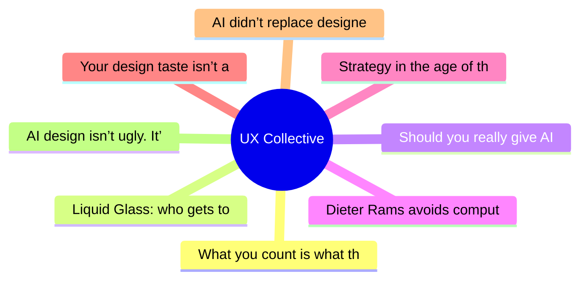

# ✏️ UX Collective Top 8 (2026-06-11)

## 思维导图

## 列表（8 条）

### 1. What you count is what they feel
- **链接**: [https://uxdesign.cc/what-you-count-is-what-they-feel-2455e76682e0?source=rss----138adf9c44c---4](https://uxdesign.cc/what-you-count-is-what-they-feel-2455e76682e0?source=rss----138adf9c44c---4)
- **作者**: Wira Indra Kusuma
- **发布**: Wed, 10 Jun 2026 23:01:29 GMT
- **简介**: What a Jakarta city bus taught me about where experience is really made, and why no designer drew it.Continue reading on UX Collective »

### 2. Liquid Glass: who gets to decide how an interface looks?
- **链接**: [https://uxdesign.cc/liquid-glass-who-gets-to-decide-how-an-interface-looks-a0abe75ae21e?source=rss----138adf9c44c---4](https://uxdesign.cc/liquid-glass-who-gets-to-decide-how-an-interface-looks-a0abe75ae21e?source=rss----138adf9c44c---4)
- **作者**: Fabrizia Ausiello
- **发布**: Wed, 10 Jun 2026 10:42:59 GMT
- **简介**: Notes from the 2026 WWDC keynoteContinue reading on UX Collective »

### 3. Should you really give AI your whole digital life?
- **链接**: [https://uxdesign.cc/should-you-really-give-ai-your-whole-digital-life-9b0c55df46e2?source=rss----138adf9c44c---4](https://uxdesign.cc/should-you-really-give-ai-your-whole-digital-life-9b0c55df46e2?source=rss----138adf9c44c---4)
- **作者**: Zeeshan Khalid
- **发布**: Tue, 09 Jun 2026 23:04:27 GMT
- **简介**: You&#x2019;ve felt it, haven&#x2019;t you? That tiny pause.Continue reading on UX Collective »

### 4. Dieter Rams avoids computers. His ten rules still fit designing for AI.
- **链接**: [https://uxdesign.cc/dieter-rams-avoids-computers-his-ten-rules-still-fit-designing-for-ai-499229fd049e?source=rss----138adf9c44c---4](https://uxdesign.cc/dieter-rams-avoids-computers-his-ten-rules-still-fit-designing-for-ai-499229fd049e?source=rss----138adf9c44c---4)
- **作者**: Patrick Neeman
- **发布**: Tue, 09 Jun 2026 23:00:33 GMT

### 5. Strategy in the age of the machine
- **链接**: [https://uxdesign.cc/strategy-in-the-age-of-the-machine-48ac5b0e5788?source=rss----138adf9c44c---4](https://uxdesign.cc/strategy-in-the-age-of-the-machine-48ac5b0e5788?source=rss----138adf9c44c---4)
- **作者**: Sam Belt
- **发布**: Tue, 09 Jun 2026 11:51:11 GMT

### 6. Your design taste isn’t a feeling. It’s a prediction about user behavior.
- **链接**: [https://uxdesign.cc/your-design-taste-isnt-a-feeling-it-s-a-prediction-about-user-behavior-7a4a63f5f622?source=rss----138adf9c44c---4](https://uxdesign.cc/your-design-taste-isnt-a-feeling-it-s-a-prediction-about-user-behavior-7a4a63f5f622?source=rss----138adf9c44c---4)
- **作者**: Kai Wong
- **发布**: Tue, 09 Jun 2026 11:46:27 GMT
- **简介**: What DataViz taught me about the importance of explaining designContinue reading on UX Collective »

### 7. AI didn’t replace designers-it promoted them
- **链接**: [https://uxdesign.cc/ai-didnt-replace-designers-it-promoted-them-5b6d24de4e26?source=rss----138adf9c44c---4](https://uxdesign.cc/ai-didnt-replace-designers-it-promoted-them-5b6d24de4e26?source=rss----138adf9c44c---4)
- **作者**: Lisa Demchenko
- **发布**: Tue, 09 Jun 2026 11:45:44 GMT
- **简介**: How AI is rewriting the product designer&#x2019;s role&#x200A;&#x2014;&#x200A;from spec-maker to system architectContinue reading on UX Collective »

### 8. AI design isn’t ugly. It’s fluent — and that’s the problem.
- **链接**: [https://uxdesign.cc/ai-design-isnt-ugly-it-s-fluent-and-that-s-the-problem-131b2f4eb78c?source=rss----138adf9c44c---4](https://uxdesign.cc/ai-design-isnt-ugly-it-s-fluent-and-that-s-the-problem-131b2f4eb78c?source=rss----138adf9c44c---4)
- **作者**: Takuma Kakehi
- **发布**: Mon, 08 Jun 2026 22:10:58 GMT
- **简介**: Why Claude Design, Lovable, and v0 all wear the same face&#x200A;&#x2014;&#x200A;and what a dynamited St. Louis housing project predicted about it.Continue reading on UX Collective »
