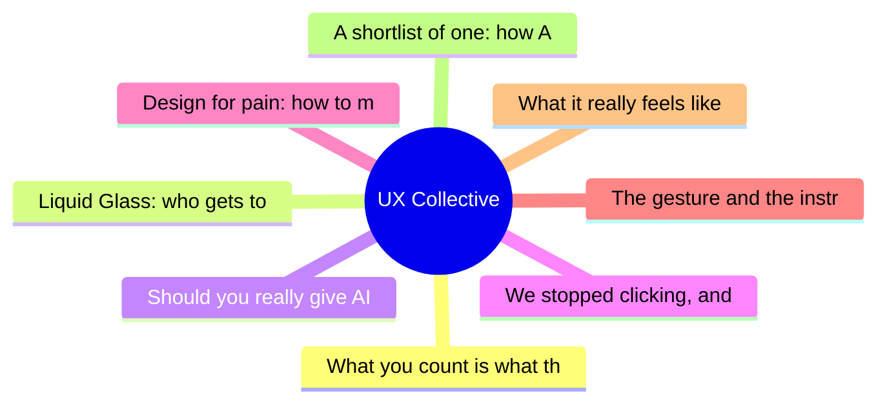

# ✏️ UX Collective Top 8 (2026-06-14)

## 思维导图

## 列表（8 条）

### 1. What you count is what they feel
- **链接**: [https://uxdesign.cc/what-you-count-is-what-they-feel-2455e76682e0?source=rss----138adf9c44c---4](https://uxdesign.cc/what-you-count-is-what-they-feel-2455e76682e0?source=rss----138adf9c44c---4)
- **作者**: Wira Indra Kusuma
- **发布**: Wed, 10 Jun 2026 23:01:29 GMT
- **简介**: What a Jakarta city bus taught me about where experience is really made, and why no designer drew it.Continue reading on UX Collective »

### 2. Liquid Glass: who gets to decide how an interface looks?
- **链接**: [https://uxdesign.cc/liquid-glass-who-gets-to-decide-how-an-interface-looks-a0abe75ae21e?source=rss----138adf9c44c---4](https://uxdesign.cc/liquid-glass-who-gets-to-decide-how-an-interface-looks-a0abe75ae21e?source=rss----138adf9c44c---4)
- **作者**: Fabrizia Ausiello
- **发布**: Wed, 10 Jun 2026 10:42:59 GMT
- **简介**: Notes from the 2026 WWDC keynoteContinue reading on UX Collective »

### 3. Should you really give AI your whole digital life?
- **链接**: [https://uxdesign.cc/should-you-really-give-ai-your-whole-digital-life-9b0c55df46e2?source=rss----138adf9c44c---4](https://uxdesign.cc/should-you-really-give-ai-your-whole-digital-life-9b0c55df46e2?source=rss----138adf9c44c---4)
- **作者**: Zeeshan Khalid
- **发布**: Tue, 09 Jun 2026 23:04:27 GMT
- **简介**: You&#x2019;ve felt it, haven&#x2019;t you? That tiny pause.Continue reading on UX Collective »

### 4. We stopped clicking, and AI became the Internet
- **链接**: [https://uxdesign.cc/we-stopped-clicking-and-ai-became-the-internet-df61a0c79d91?source=rss----138adf9c44c---4](https://uxdesign.cc/we-stopped-clicking-and-ai-became-the-internet-df61a0c79d91?source=rss----138adf9c44c---4)
- **作者**: Patrizia Bertini
- **发布**: Thu, 11 Jun 2026 21:46:16 GMT

### 5. Design for pain: how to make the worst moment better
- **链接**: [https://uxdesign.cc/design-for-pain-how-to-make-the-worst-moment-better-7b1a54a7dd7d?source=rss----138adf9c44c---4](https://uxdesign.cc/design-for-pain-how-to-make-the-worst-moment-better-7b1a54a7dd7d?source=rss----138adf9c44c---4)
- **作者**: Catherine Chu
- **发布**: Thu, 11 Jun 2026 21:45:59 GMT

### 6. The gesture and the instruction
- **链接**: [https://uxdesign.cc/the-gesture-and-the-instruction-4f90d5a6b8f5?source=rss----138adf9c44c---4](https://uxdesign.cc/the-gesture-and-the-instruction-4f90d5a6b8f5?source=rss----138adf9c44c---4)
- **作者**: Quinn Keast
- **发布**: Thu, 11 Jun 2026 21:45:37 GMT

### 7. What it really feels like to be a digital accessibility advocate
- **链接**: [https://uxdesign.cc/what-it-really-feels-like-to-be-a-digital-accessibility-advocate-07afc7e1d16f?source=rss----138adf9c44c---4](https://uxdesign.cc/what-it-really-feels-like-to-be-a-digital-accessibility-advocate-07afc7e1d16f?source=rss----138adf9c44c---4)
- **作者**: Zeeshan Khalid
- **发布**: Sat, 13 Jun 2026 22:16:52 GMT
- **简介**: Why the quietest voice in the room is the one that can save your company from a multimillion-dollar lawsuit, a shattered brand reputation&#x2026;Continue reading on UX Collective »

### 8. A shortlist of one: how AI became our shopping adviser
- **链接**: [https://uxdesign.cc/a-shortlist-of-one-how-ai-became-our-shopping-adviser-d55f43c411db?source=rss----138adf9c44c---4](https://uxdesign.cc/a-shortlist-of-one-how-ai-became-our-shopping-adviser-d55f43c411db?source=rss----138adf9c44c---4)
- **作者**: Dora Czerna
- **发布**: Sat, 13 Jun 2026 22:16:33 GMT
