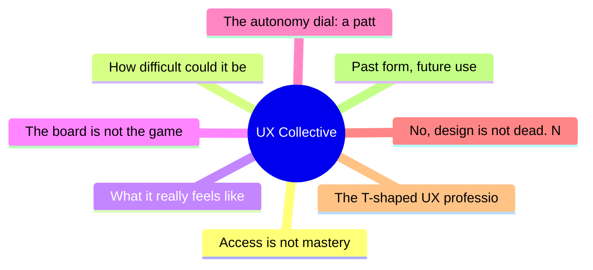

# ✏️ UX Collective Top 8 (2026-06-16)

## 思维导图

## 列表（8 条）

### 1. Access is not mastery
- **链接**: [https://uxdesign.cc/access-is-not-mastery-bd59e0610828?source=rss----138adf9c44c---4](https://uxdesign.cc/access-is-not-mastery-bd59e0610828?source=rss----138adf9c44c---4)
- **作者**: Takuma Kakehi
- **发布**: Sun, 14 Jun 2026 22:51:00 GMT
- **简介**: The GUI democratized computing. The prompt interface democratized the GUI.Continue reading on UX Collective »

### 2. How difficult could it be to design a chatbot?
- **链接**: [https://uxdesign.cc/how-difficult-could-it-be-to-design-a-chatbot-5967e39563cc?source=rss----138adf9c44c---4](https://uxdesign.cc/how-difficult-could-it-be-to-design-a-chatbot-5967e39563cc?source=rss----138adf9c44c---4)
- **作者**: Ellina Morits
- **发布**: Sun, 14 Jun 2026 12:18:02 GMT

### 3. What it really feels like to be a digital accessibility advocate
- **链接**: [https://uxdesign.cc/what-it-really-feels-like-to-be-a-digital-accessibility-advocate-07afc7e1d16f?source=rss----138adf9c44c---4](https://uxdesign.cc/what-it-really-feels-like-to-be-a-digital-accessibility-advocate-07afc7e1d16f?source=rss----138adf9c44c---4)
- **作者**: Zeeshan Khalid
- **发布**: Sat, 13 Jun 2026 22:16:52 GMT
- **简介**: Why the quietest voice in the room is the one that can save your company from a multimillion-dollar lawsuit, a shattered brand reputation&#x2026;Continue reading on UX Collective »

### 4. The board is not the game
- **链接**: [https://uxdesign.cc/the-board-is-not-the-game-fad30735adfe?source=rss----138adf9c44c---4](https://uxdesign.cc/the-board-is-not-the-game-fad30735adfe?source=rss----138adf9c44c---4)
- **作者**: Adrian Levy
- **发布**: Mon, 15 Jun 2026 22:18:47 GMT
- **简介**: Your AI product has pieces, cards, and screens. Nobody designed the game.Continue reading on UX Collective »

### 5. The autonomy dial: a pattern toolkit for designing human control over AI
- **链接**: [https://uxdesign.cc/the-autonomy-dial-a-pattern-toolkit-for-designing-human-control-over-ai-12bfbe23ca70?source=rss----138adf9c44c---4](https://uxdesign.cc/the-autonomy-dial-a-pattern-toolkit-for-designing-human-control-over-ai-12bfbe23ca70?source=rss----138adf9c44c---4)
- **作者**: Vadym Grin
- **发布**: Mon, 15 Jun 2026 22:18:24 GMT
- **简介**: A practical method for setting how much an AI does on its own, plus six control patterns for human oversight.Continue reading on UX Collective »

### 6. No, design is not dead. Neither is engineering or product.
- **链接**: [https://uxdesign.cc/no-design-is-not-dead-neither-is-engineering-or-product-bd6019410818?source=rss----138adf9c44c---4](https://uxdesign.cc/no-design-is-not-dead-neither-is-engineering-or-product-bd6019410818?source=rss----138adf9c44c---4)
- **作者**: Revanth Krishna
- **发布**: Mon, 15 Jun 2026 22:18:01 GMT

### 7. The T-shaped UX professional is giving way to the polymath architect
- **链接**: [https://uxdesign.cc/the-t-shaped-ux-professional-is-giving-way-to-the-polymath-architect-987008ada937?source=rss----138adf9c44c---4](https://uxdesign.cc/the-t-shaped-ux-professional-is-giving-way-to-the-polymath-architect-987008ada937?source=rss----138adf9c44c---4)
- **作者**: Patrick Neeman
- **发布**: Mon, 15 Jun 2026 11:19:19 GMT

### 8. Past form, future use
- **链接**: [https://uxdesign.cc/past-form-future-use-05b112952374?source=rss----138adf9c44c---4](https://uxdesign.cc/past-form-future-use-05b112952374?source=rss----138adf9c44c---4)
- **作者**: Hiroshi Sato
- **发布**: Mon, 15 Jun 2026 11:18:03 GMT
- **简介**: On letting fifty centimeters speak three hundred yearsContinue reading on UX Collective »
