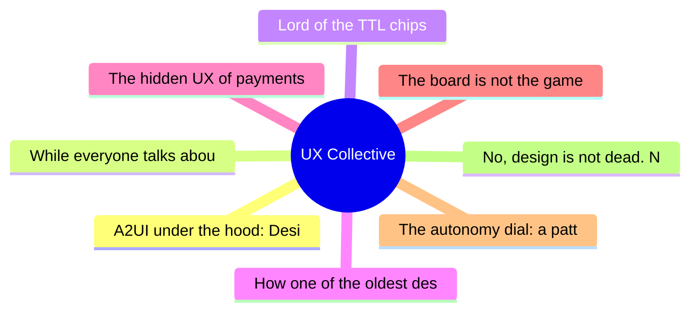

# ✏️ UX Collective Top 8 (2026-06-18)

## 思维导图

## 列表（8 条）

### 1. A2UI under the hood: Designing for the new era of radically adaptive UI
- **链接**: [https://uxdesign.cc/a2ui-under-the-hood-designing-for-the-new-era-of-radically-adaptive-ui-cebbf5f32fbe?source=rss----138adf9c44c---4](https://uxdesign.cc/a2ui-under-the-hood-designing-for-the-new-era-of-radically-adaptive-ui-cebbf5f32fbe?source=rss----138adf9c44c---4)
- **作者**: Christine Vallaure
- **发布**: Wed, 17 Jun 2026 22:59:32 GMT

### 2. While everyone talks about AI, design is gaining power
- **链接**: [https://uxdesign.cc/while-everyone-talks-about-ai-design-is-gaining-power-a6fd0db3f0a2?source=rss----138adf9c44c---4](https://uxdesign.cc/while-everyone-talks-about-ai-design-is-gaining-power-a6fd0db3f0a2?source=rss----138adf9c44c---4)
- **作者**: Karolina Rojek
- **发布**: Wed, 17 Jun 2026 22:55:11 GMT

### 3. Lord of the TTL chips
- **链接**: [https://uxdesign.cc/lord-of-the-ttl-chips-26657f628126?source=rss----138adf9c44c---4](https://uxdesign.cc/lord-of-the-ttl-chips-26657f628126?source=rss----138adf9c44c---4)
- **作者**: Neel Dozome
- **发布**: Tue, 16 Jun 2026 23:03:26 GMT
- **简介**: One Steve to rule them all, One Steve to find them, One Bill to bring them all, and in the darkness bind them (or, the role of the 7400&#x2026;Continue reading on UX Collective »

### 4. How one of the oldest design portfolio formats needs to change in 2026
- **链接**: [https://uxdesign.cc/how-one-of-the-oldest-design-portfolio-formats-needs-to-change-in-2026-b64137494f6a?source=rss----138adf9c44c---4](https://uxdesign.cc/how-one-of-the-oldest-design-portfolio-formats-needs-to-change-in-2026-b64137494f6a?source=rss----138adf9c44c---4)
- **作者**: Kai Wong
- **发布**: Tue, 16 Jun 2026 11:41:16 GMT
- **简介**: There&#x2019;s a better version of the before/after that shows what employers want.Continue reading on UX Collective »

### 5. The hidden UX of payments
- **链接**: [https://uxdesign.cc/the-hidden-ux-of-payments-22b97440be16?source=rss----138adf9c44c---4](https://uxdesign.cc/the-hidden-ux-of-payments-22b97440be16?source=rss----138adf9c44c---4)
- **作者**: Stephen Patterson
- **发布**: Tue, 16 Jun 2026 11:40:10 GMT

### 6. The board is not the game
- **链接**: [https://uxdesign.cc/the-board-is-not-the-game-fad30735adfe?source=rss----138adf9c44c---4](https://uxdesign.cc/the-board-is-not-the-game-fad30735adfe?source=rss----138adf9c44c---4)
- **作者**: Adrian Levy
- **发布**: Mon, 15 Jun 2026 22:18:47 GMT
- **简介**: Your AI product has pieces, cards, and screens. Nobody designed the game.Continue reading on UX Collective »

### 7. The autonomy dial: a pattern toolkit for designing human control over AI
- **链接**: [https://uxdesign.cc/the-autonomy-dial-a-pattern-toolkit-for-designing-human-control-over-ai-12bfbe23ca70?source=rss----138adf9c44c---4](https://uxdesign.cc/the-autonomy-dial-a-pattern-toolkit-for-designing-human-control-over-ai-12bfbe23ca70?source=rss----138adf9c44c---4)
- **作者**: Vadym Grin
- **发布**: Mon, 15 Jun 2026 22:18:24 GMT
- **简介**: A practical method for setting how much an AI does on its own, plus six control patterns for human oversight.Continue reading on UX Collective »

### 8. No, design is not dead. Neither is engineering or product.
- **链接**: [https://uxdesign.cc/no-design-is-not-dead-neither-is-engineering-or-product-bd6019410818?source=rss----138adf9c44c---4](https://uxdesign.cc/no-design-is-not-dead-neither-is-engineering-or-product-bd6019410818?source=rss----138adf9c44c---4)
- **作者**: Revanth Krishna
- **发布**: Mon, 15 Jun 2026 22:18:01 GMT
