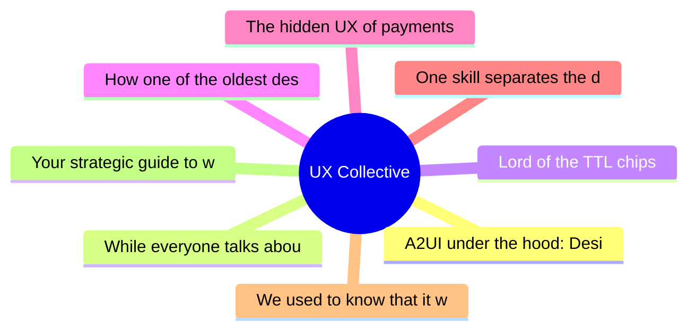

# ✏️ UX Collective Top 8 (2026-06-21)

## 思维导图

## 列表（8 条，0 条含全文）

### 1. A2UI under the hood: Designing for the new era of radically adaptive UI
- **链接**: [https://uxdesign.cc/a2ui-under-the-hood-designing-for-the-new-era-of-radically-adaptive-ui-cebbf5f32fbe?source=rss----138adf9c44c---4](https://uxdesign.cc/a2ui-under-the-hood-designing-for-the-new-era-of-radically-adaptive-ui-cebbf5f32fbe?source=rss----138adf9c44c---4)
- **作者**: Christine Vallaure
- **发布**: Wed, 17 Jun 2026 22:59:32 GMT

### 2. While everyone talks about AI, design is gaining power
- **链接**: [https://uxdesign.cc/while-everyone-talks-about-ai-design-is-gaining-power-a6fd0db3f0a2?source=rss----138adf9c44c---4](https://uxdesign.cc/while-everyone-talks-about-ai-design-is-gaining-power-a6fd0db3f0a2?source=rss----138adf9c44c---4)
- **作者**: Karolina Rojek
- **发布**: Wed, 17 Jun 2026 22:55:11 GMT

### 3. Lord of the TTL chips
- **链接**: [https://uxdesign.cc/lord-of-the-ttl-chips-26657f628126?source=rss----138adf9c44c---4](https://uxdesign.cc/lord-of-the-ttl-chips-26657f628126?source=rss----138adf9c44c---4)
- **作者**: Neel Dozome
- **发布**: Tue, 16 Jun 2026 23:03:26 GMT
- **简介**: One Steve to rule them all, One Steve to find them, One Bill to bring them all, and in the darkness bind them (or, the role of the 7400&#x2026;Continue reading on UX Collective »

### 4. How one of the oldest design portfolio formats needs to change in 2026
- **链接**: [https://uxdesign.cc/how-one-of-the-oldest-design-portfolio-formats-needs-to-change-in-2026-b64137494f6a?source=rss----138adf9c44c---4](https://uxdesign.cc/how-one-of-the-oldest-design-portfolio-formats-needs-to-change-in-2026-b64137494f6a?source=rss----138adf9c44c---4)
- **作者**: Kai Wong
- **发布**: Tue, 16 Jun 2026 11:41:16 GMT
- **简介**: There&#x2019;s a better version of the before/after that shows what employers want.Continue reading on UX Collective »

### 5. The hidden UX of payments
- **链接**: [https://uxdesign.cc/the-hidden-ux-of-payments-22b97440be16?source=rss----138adf9c44c---4](https://uxdesign.cc/the-hidden-ux-of-payments-22b97440be16?source=rss----138adf9c44c---4)
- **作者**: Stephen Patterson
- **发布**: Tue, 16 Jun 2026 11:40:10 GMT

### 6. One skill separates the designers who survive 2026 from the ones who don’t
- **链接**: [https://uxdesign.cc/one-skill-separates-the-designers-who-survive-2026-from-the-ones-who-dont-f4dec8c3ffe0?source=rss----138adf9c44c---4](https://uxdesign.cc/one-skill-separates-the-designers-who-survive-2026-from-the-ones-who-dont-f4dec8c3ffe0?source=rss----138adf9c44c---4)
- **作者**: Arin Bhowmick
- **发布**: Thu, 18 Jun 2026 22:05:51 GMT

### 7. We used to know that it was a person who wrote it
- **链接**: [https://uxdesign.cc/we-used-to-know-that-it-was-a-person-who-wrote-it-a321c970266f?source=rss----138adf9c44c---4](https://uxdesign.cc/we-used-to-know-that-it-was-a-person-who-wrote-it-a321c970266f?source=rss----138adf9c44c---4)
- **作者**: Wira Indra Kusuma
- **发布**: Thu, 18 Jun 2026 22:04:55 GMT
- **简介**: Reading used to come with a guarantee that a person was on the other end. We spent it down, and now you check everything.Continue reading on UX Collective »

### 8. Your strategic guide to winning design awards
- **链接**: [https://uxdesign.cc/your-strategic-guide-to-winning-design-awards-7afee3876ce4?source=rss----138adf9c44c---4](https://uxdesign.cc/your-strategic-guide-to-winning-design-awards-7afee3876ce4?source=rss----138adf9c44c---4)
- **作者**: Zeeshan Khalid
- **发布**: Thu, 18 Jun 2026 22:03:39 GMT
- **简介**: A roadmap to transform recognition into rocket fuel for your career and company.Continue reading on UX Collective »
