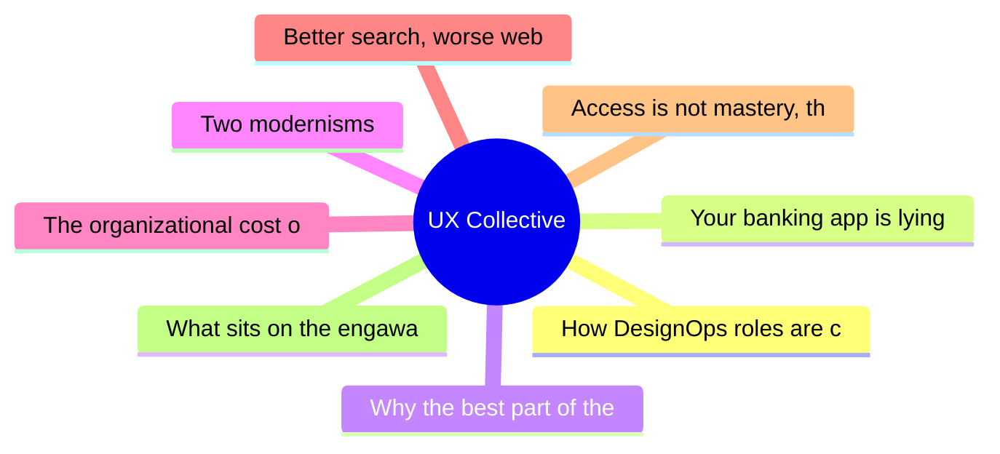

# ✏️ UX Collective Top 8 (2026-06-24)

## 思维导图

## 列表（8 条，0 条含全文）

### 1. How DesignOps roles are changing with new priorities
- **链接**: [https://uxdesign.cc/how-designops-roles-are-changing-with-new-priorities-c8db3a5bc1c3?source=rss----138adf9c44c---4](https://uxdesign.cc/how-designops-roles-are-changing-with-new-priorities-c8db3a5bc1c3?source=rss----138adf9c44c---4)
- **作者**: Kai Wong
- **发布**: Tue, 23 Jun 2026 11:11:43 GMT
- **简介**: Design Vision Matters More than Ever, When AI is Integrating with DesignContinue reading on UX Collective »

### 2. Your banking app is lying to you
- **链接**: [https://uxdesign.cc/your-banking-app-is-lying-to-you-52959b075823?source=rss----138adf9c44c---4](https://uxdesign.cc/your-banking-app-is-lying-to-you-52959b075823?source=rss----138adf9c44c---4)
- **作者**: Zeeshan Khalid
- **发布**: Tue, 23 Jun 2026 11:09:13 GMT
- **简介**: It shows you a balance. It doesn&#x2019;t show you the future. Here&#x2019;s what happens when AI starts telling the truth.Continue reading on UX Collective »

### 3. Why the best part of the flow isn't the end
- **链接**: [https://uxdesign.cc/why-the-best-part-of-the-flow-isnt-the-end-e9fef73f6bb3?source=rss----138adf9c44c---4](https://uxdesign.cc/why-the-best-part-of-the-flow-isnt-the-end-e9fef73f6bb3?source=rss----138adf9c44c---4)
- **作者**: Fabrizia Ausiello
- **发布**: Sun, 21 Jun 2026 18:23:01 GMT
- **简介**: South Korea&#x2019;s &#x201C;dopamine sites&#x201D; let you order food that never arrives. Strip out the transaction and what&#x2019;s left still works &#x2014; which should&#x2026;Continue reading on UX Collective »

### 4. Two modernisms
- **链接**: [https://uxdesign.cc/two-modernisms-ba94169b79dd?source=rss----138adf9c44c---4](https://uxdesign.cc/two-modernisms-ba94169b79dd?source=rss----138adf9c44c---4)
- **作者**: Takuma Kakehi
- **发布**: Sun, 21 Jun 2026 18:21:07 GMT
- **简介**: Mies hid the steel. Beck removed the geography. Radix stripped the styles. None of them were making a philosophical statement&#x200A;&#x2014;&#x200A;they were&#x2026;Continue reading on UX Collective »

### 5. The organizational cost of low taste
- **链接**: [https://uxdesign.cc/the-organizational-cost-of-low-taste-135cb8b10c34?source=rss----138adf9c44c---4](https://uxdesign.cc/the-organizational-cost-of-low-taste-135cb8b10c34?source=rss----138adf9c44c---4)
- **作者**: Aurélie Radom
- **发布**: Mon, 22 Jun 2026 16:46:04 GMT

### 6. Better search, worse web
- **链接**: [https://uxdesign.cc/better-search-worse-web-1ed2c43fe38f?source=rss----138adf9c44c---4](https://uxdesign.cc/better-search-worse-web-1ed2c43fe38f?source=rss----138adf9c44c---4)
- **作者**: Wira Indra Kusuma
- **发布**: Mon, 22 Jun 2026 16:45:25 GMT
- **简介**: Every number says Google AI Search is better. None of them can see the cost.Continue reading on UX Collective »

### 7. Access is not mastery, the polymath UX architect, A2UI under the hood
- **链接**: [https://uxdesign.cc/access-is-not-mastery-the-polymath-ux-architect-a2ui-under-the-hood-88edc2288979?source=rss----138adf9c44c---4](https://uxdesign.cc/access-is-not-mastery-the-polymath-ux-architect-a2ui-under-the-hood-88edc2288979?source=rss----138adf9c44c---4)
- **作者**: Fabricio Teixeira
- **发布**: Mon, 22 Jun 2026 11:14:54 GMT

### 8. What sits on the engawa
- **链接**: [https://uxdesign.cc/what-sits-on-the-engawa-46acaa876713?source=rss----138adf9c44c---4](https://uxdesign.cc/what-sits-on-the-engawa-46acaa876713?source=rss----138adf9c44c---4)
- **作者**: Hiroshi Sato
- **发布**: Mon, 22 Jun 2026 09:46:11 GMT
- **简介**: On designing for wishes we cannot yet wish alone.Continue reading on UX Collective »
