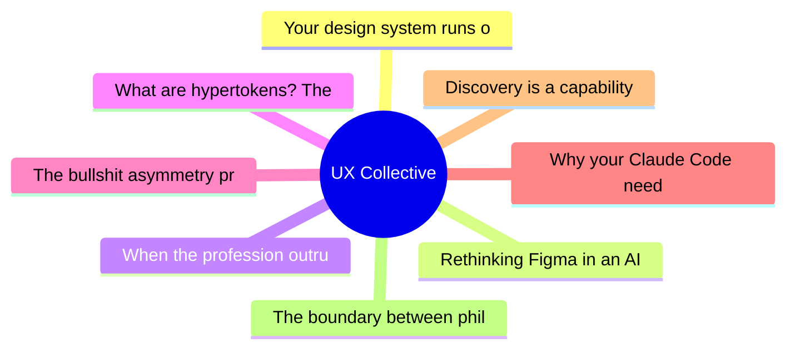

# ✏️ UX Collective Top 8 (2026-06-29)

## 思维导图

## 列表（8 条，0 条含全文）

### 1. Your design system runs on one person’s judgment-AI is about to prove it
- **链接**: [https://uxdesign.cc/your-design-system-runs-on-one-persons-judgment-ai-is-about-to-prove-it-4e969a862765?source=rss----138adf9c44c---4](https://uxdesign.cc/your-design-system-runs-on-one-persons-judgment-ai-is-about-to-prove-it-4e969a862765?source=rss----138adf9c44c---4)
- **作者**: Dolphia
- **发布**: Wed, 24 Jun 2026 22:38:19 GMT

### 2. Rethinking Figma in an AI world
- **链接**: [https://uxdesign.cc/rethinking-figma-in-an-ai-world-0facba587ba5?source=rss----138adf9c44c---4](https://uxdesign.cc/rethinking-figma-in-an-ai-world-0facba587ba5?source=rss----138adf9c44c---4)
- **作者**: Darren Yeo
- **发布**: Thu, 25 Jun 2026 22:50:53 GMT

### 3. When the profession outruns the mentor
- **链接**: [https://uxdesign.cc/when-the-profession-outruns-the-mentor-5f40596e17ca?source=rss----138adf9c44c---4](https://uxdesign.cc/when-the-profession-outruns-the-mentor-5f40596e17ca?source=rss----138adf9c44c---4)
- **作者**: Michael Buckley
- **发布**: Sun, 28 Jun 2026 22:00:11 GMT

### 4. What are hypertokens? The layer between tokens and components, rebuilt for agents
- **链接**: [https://uxdesign.cc/what-are-hypertokens-the-layer-between-tokens-and-components-rebuilt-for-agents-962dbe93e0c4?source=rss----138adf9c44c---4](https://uxdesign.cc/what-are-hypertokens-the-layer-between-tokens-and-components-rebuilt-for-agents-962dbe93e0c4?source=rss----138adf9c44c---4)
- **作者**: Christine Vallaure
- **发布**: Sun, 28 Jun 2026 14:48:13 GMT

### 5. The bullshit asymmetry principle was survivable. AI made production of slop almost free.
- **链接**: [https://uxdesign.cc/the-bullshit-asymmetry-principle-was-survivable-ai-made-production-of-slop-almost-free-2107dd4530b4?source=rss----138adf9c44c---4](https://uxdesign.cc/the-bullshit-asymmetry-principle-was-survivable-ai-made-production-of-slop-almost-free-2107dd4530b4?source=rss----138adf9c44c---4)
- **作者**: Patrick Neeman
- **发布**: Sun, 28 Jun 2026 09:17:35 GMT

### 6. Why your Claude Code needs a design stack
- **链接**: [https://uxdesign.cc/why-your-claude-code-needs-a-design-stack-46dccbced6e5?source=rss----138adf9c44c---4](https://uxdesign.cc/why-your-claude-code-needs-a-design-stack-46dccbced6e5?source=rss----138adf9c44c---4)
- **作者**: Sen Lin
- **发布**: Sat, 27 Jun 2026 16:45:31 GMT
- **简介**: The setup that makes Claude Code fit into your designer workflowContinue reading on UX Collective »

### 7. Discovery is a capability, not a phase
- **链接**: [https://uxdesign.cc/discovery-is-a-capability-not-a-phase-0fd6c1dab2f5?source=rss----138adf9c44c---4](https://uxdesign.cc/discovery-is-a-capability-not-a-phase-0fd6c1dab2f5?source=rss----138adf9c44c---4)
- **作者**: Gale Robins
- **发布**: Fri, 26 Jun 2026 21:58:55 GMT

### 8. The boundary between philosophy and design: Leveraging pure thought
- **链接**: [https://uxdesign.cc/the-boundary-between-philosophy-and-design-leveraging-pure-thought-72a903b05f57?source=rss----138adf9c44c---4](https://uxdesign.cc/the-boundary-between-philosophy-and-design-leveraging-pure-thought-72a903b05f57?source=rss----138adf9c44c---4)
- **作者**: Zacharia C.
- **发布**: Fri, 26 Jun 2026 21:58:37 GMT
- **简介**: Following the line from Plato&#x2019;s Forms to the iPod, and what it reveals about where great design actually begins.Continue reading on UX Collective »
