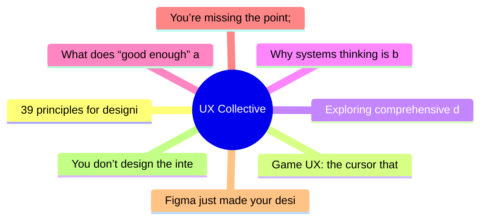

# ✏️ UX Collective Top 8 (2026-07-01)

## 思维导图

## 列表（8 条，0 条含全文）

### 1. 39 principles for designing human-AI interaction
- **链接**: [https://uxdesign.cc/39-principles-for-designing-human-ai-interaction-87be5fabdbbe?source=rss----138adf9c44c---4](https://uxdesign.cc/39-principles-for-designing-human-ai-interaction-87be5fabdbbe?source=rss----138adf9c44c---4)
- **作者**: Taras Bakusevych
- **发布**: Tue, 30 Jun 2026 22:04:22 GMT

### 2. Game UX: the cursor that wasn’t supposed to be there
- **链接**: [https://uxdesign.cc/game-ux-the-cursor-that-wasnt-supposed-to-be-there-f9369dafc451?source=rss----138adf9c44c---4](https://uxdesign.cc/game-ux-the-cursor-that-wasnt-supposed-to-be-there-f9369dafc451?source=rss----138adf9c44c---4)
- **作者**: Alisa Smelkova
- **发布**: Tue, 30 Jun 2026 22:02:49 GMT

### 3. Exploring comprehensive data color scheme design with GenAI
- **链接**: [https://uxdesign.cc/exploring-comprehensive-data-color-scheme-design-with-genai-099d543df4ba?source=rss----138adf9c44c---4](https://uxdesign.cc/exploring-comprehensive-data-color-scheme-design-with-genai-099d543df4ba?source=rss----138adf9c44c---4)
- **作者**: Theresa-Marie Rhyne
- **发布**: Tue, 30 Jun 2026 21:59:14 GMT
- **简介**: Using Google Gemini to completely build and evaluate a sequential data color schemeContinue reading on UX Collective »

### 4. Why systems thinking is becoming the most important UX skill
- **链接**: [https://uxdesign.cc/why-systems-thinking-is-becoming-the-most-important-ux-skill-688136ed1ce2?source=rss----138adf9c44c---4](https://uxdesign.cc/why-systems-thinking-is-becoming-the-most-important-ux-skill-688136ed1ce2?source=rss----138adf9c44c---4)
- **作者**: Heenesh Patel
- **发布**: Tue, 30 Jun 2026 21:57:45 GMT

### 5. What does “good enough” actually mean for designers now?
- **链接**: [https://uxdesign.cc/what-does-good-enough-actually-mean-for-designers-now-ee1604bf79b7?source=rss----138adf9c44c---4](https://uxdesign.cc/what-does-good-enough-actually-mean-for-designers-now-ee1604bf79b7?source=rss----138adf9c44c---4)
- **作者**: Kai Wong
- **发布**: Tue, 30 Jun 2026 11:09:07 GMT
- **简介**: Learning to say &#x201C;Good Enough&#x201D; is a design skill, not a compromise.Continue reading on UX Collective »

### 6. You’re missing the point; this is your real value in tech companies
- **链接**: [https://uxdesign.cc/youre-missing-the-point-this-is-your-real-value-in-tech-companies-f56d6d96b54b?source=rss----138adf9c44c---4](https://uxdesign.cc/youre-missing-the-point-this-is-your-real-value-in-tech-companies-f56d6d96b54b?source=rss----138adf9c44c---4)
- **作者**: Kike Peña
- **发布**: Mon, 29 Jun 2026 21:51:00 GMT

### 7. Figma just made your design system debt everyone’s problem. Now use it.
- **链接**: [https://uxdesign.cc/figma-just-made-your-design-system-debt-everyones-problem-now-use-it-2e9ecb6272bf?source=rss----138adf9c44c---4](https://uxdesign.cc/figma-just-made-your-design-system-debt-everyones-problem-now-use-it-2e9ecb6272bf?source=rss----138adf9c44c---4)
- **作者**: Dolphia
- **发布**: Mon, 29 Jun 2026 21:44:16 GMT

### 8. You don’t design the interface anymore. You design the deciding.
- **链接**: [https://uxdesign.cc/you-dont-design-the-interface-anymore-you-design-the-deciding-835c01982ead?source=rss----138adf9c44c---4](https://uxdesign.cc/you-dont-design-the-interface-anymore-you-design-the-deciding-835c01982ead?source=rss----138adf9c44c---4)
- **作者**: Adrian Levy
- **发布**: Mon, 29 Jun 2026 21:43:25 GMT
- **简介**: The agent is only the material. The discipline is what it&#x2019;s allowed to decide.Continue reading on UX Collective »
