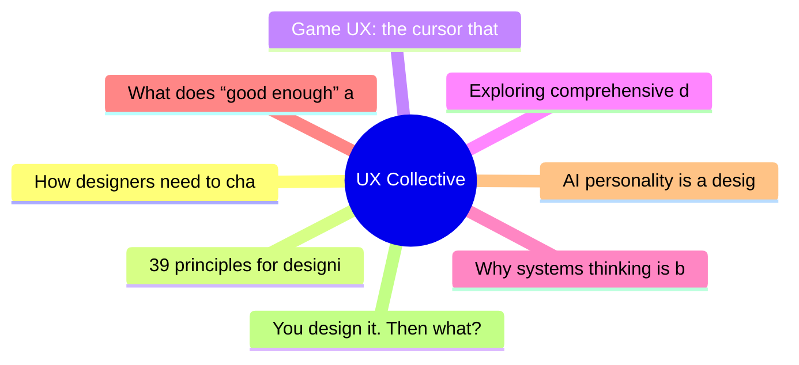

# ✏️ UX Collective Top 8 (2026-07-04)

## 思维导图

## 列表（8 条，0 条含全文）

### 1. How designers need to change for an AI-powered world
- **链接**: [https://uxdesign.cc/how-designers-need-to-change-for-an-ai-powered-world-b51c3c195954?source=rss----138adf9c44c---4](https://uxdesign.cc/how-designers-need-to-change-for-an-ai-powered-world-b51c3c195954?source=rss----138adf9c44c---4)
- **作者**: Cassie McDaniel
- **发布**: Wed, 01 Jul 2026 21:49:00 GMT
- **简介**: A recap of ideas from our panel discussion for a topic that&#x2019;s on everyone&#x2019;s mindContinue reading on UX Collective »

### 2. 39 principles for designing human-AI interaction
- **链接**: [https://uxdesign.cc/39-principles-for-designing-human-ai-interaction-87be5fabdbbe?source=rss----138adf9c44c---4](https://uxdesign.cc/39-principles-for-designing-human-ai-interaction-87be5fabdbbe?source=rss----138adf9c44c---4)
- **作者**: Taras Bakusevych
- **发布**: Tue, 30 Jun 2026 22:04:22 GMT

### 3. Game UX: the cursor that wasn’t supposed to be there
- **链接**: [https://uxdesign.cc/game-ux-the-cursor-that-wasnt-supposed-to-be-there-f9369dafc451?source=rss----138adf9c44c---4](https://uxdesign.cc/game-ux-the-cursor-that-wasnt-supposed-to-be-there-f9369dafc451?source=rss----138adf9c44c---4)
- **作者**: Alisa Smelkova
- **发布**: Tue, 30 Jun 2026 22:02:49 GMT

### 4. Exploring comprehensive data color scheme design with GenAI
- **链接**: [https://uxdesign.cc/exploring-comprehensive-data-color-scheme-design-with-genai-099d543df4ba?source=rss----138adf9c44c---4](https://uxdesign.cc/exploring-comprehensive-data-color-scheme-design-with-genai-099d543df4ba?source=rss----138adf9c44c---4)
- **作者**: Theresa-Marie Rhyne
- **发布**: Tue, 30 Jun 2026 21:59:14 GMT
- **简介**: Using Google Gemini to completely build and evaluate a sequential data color schemeContinue reading on UX Collective »

### 5. Why systems thinking is becoming the most important UX skill
- **链接**: [https://uxdesign.cc/why-systems-thinking-is-becoming-the-most-important-ux-skill-688136ed1ce2?source=rss----138adf9c44c---4](https://uxdesign.cc/why-systems-thinking-is-becoming-the-most-important-ux-skill-688136ed1ce2?source=rss----138adf9c44c---4)
- **作者**: Heenesh Patel
- **发布**: Tue, 30 Jun 2026 21:57:45 GMT

### 6. What does “good enough” actually mean for designers now?
- **链接**: [https://uxdesign.cc/what-does-good-enough-actually-mean-for-designers-now-ee1604bf79b7?source=rss----138adf9c44c---4](https://uxdesign.cc/what-does-good-enough-actually-mean-for-designers-now-ee1604bf79b7?source=rss----138adf9c44c---4)
- **作者**: Kai Wong
- **发布**: Tue, 30 Jun 2026 11:09:07 GMT
- **简介**: Learning to say &#x201C;Good Enough&#x201D; is a design skill, not a compromise.Continue reading on UX Collective »

### 7. AI personality is a design problem
- **链接**: [https://uxdesign.cc/ai-personality-is-a-design-problem-58fbc7926a3d?source=rss----138adf9c44c---4](https://uxdesign.cc/ai-personality-is-a-design-problem-58fbc7926a3d?source=rss----138adf9c44c---4)
- **作者**: Slava Polonski, PhD
- **发布**: Thu, 02 Jul 2026 05:09:06 GMT
- **简介**: Right now it&#x2019;s an accidental byproduct of AI alignment. It could be an interface we build deliberately.Continue reading on UX Collective »

### 8. You design it. Then what? A clear map of the Figma-to-code AI mess
- **链接**: [https://uxdesign.cc/you-design-it-then-what-a-clear-map-of-the-figma-to-code-ai-mess-954a4084175f?source=rss----138adf9c44c---4](https://uxdesign.cc/you-design-it-then-what-a-clear-map-of-the-figma-to-code-ai-mess-954a4084175f?source=rss----138adf9c44c---4)
- **作者**: Christine Vallaure
- **发布**: Fri, 03 Jul 2026 11:17:14 GMT
