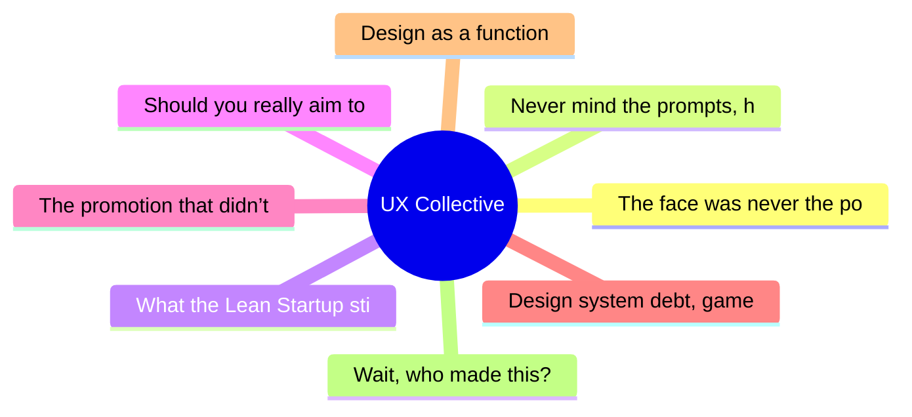

# ✏️ UX Collective Top 8 (2026-07-07)

## 思维导图

## 列表（8 条，0 条含全文）

### 1. The face was never the point
- **链接**: [https://uxdesign.cc/the-face-was-never-the-point-7f186f266e56?source=rss----138adf9c44c---4](https://uxdesign.cc/the-face-was-never-the-point-7f186f266e56?source=rss----138adf9c44c---4)
- **作者**: Takuma Kakehi
- **发布**: Sat, 04 Jul 2026 22:58:03 GMT
- **简介**: Animacy isn&#x2019;t something you design. It&#x2019;s something you trigger.Continue reading on UX Collective »

### 2. Never mind the prompts, here’s the thinking
- **链接**: [https://uxdesign.cc/never-mind-the-prompts-heres-the-thinking-f4af4b92155f?source=rss----138adf9c44c---4](https://uxdesign.cc/never-mind-the-prompts-heres-the-thinking-f4af4b92155f?source=rss----138adf9c44c---4)
- **作者**: Dan Maccarone
- **发布**: Sat, 04 Jul 2026 16:37:02 GMT

### 3. What the Lean Startup still teaches us about generative AI
- **链接**: [https://uxdesign.cc/what-the-lean-startup-still-teaches-us-about-generative-ai-2d1505fe1db1?source=rss----138adf9c44c---4](https://uxdesign.cc/what-the-lean-startup-still-teaches-us-about-generative-ai-2d1505fe1db1?source=rss----138adf9c44c---4)
- **作者**: Patrick Neeman
- **发布**: Mon, 06 Jul 2026 22:11:57 GMT

### 4. Should you really aim to be the best?
- **链接**: [https://uxdesign.cc/should-you-really-aim-to-be-the-best-a570d43fae37?source=rss----138adf9c44c---4](https://uxdesign.cc/should-you-really-aim-to-be-the-best-a570d43fae37?source=rss----138adf9c44c---4)
- **作者**: Dora Czerna
- **发布**: Mon, 06 Jul 2026 22:09:59 GMT

### 5. The promotion that didn’t take
- **链接**: [https://uxdesign.cc/the-promotion-that-didnt-take-adb678a7ec74?source=rss----138adf9c44c---4](https://uxdesign.cc/the-promotion-that-didnt-take-adb678a7ec74?source=rss----138adf9c44c---4)
- **作者**: Vlad Derdeicea
- **发布**: Mon, 06 Jul 2026 22:09:40 GMT

### 6. Design system debt, game UX, 39 principles for AI interaction
- **链接**: [https://uxdesign.cc/design-system-debt-game-ux-39-principles-for-ai-interaction-dab9500dc926?source=rss----138adf9c44c---4](https://uxdesign.cc/design-system-debt-game-ux-39-principles-for-ai-interaction-dab9500dc926?source=rss----138adf9c44c---4)
- **作者**: Fabricio Teixeira
- **发布**: Mon, 06 Jul 2026 11:25:19 GMT

### 7. Design as a function
- **链接**: [https://uxdesign.cc/design-as-a-function-5c236e28f353?source=rss----138adf9c44c---4](https://uxdesign.cc/design-as-a-function-5c236e28f353?source=rss----138adf9c44c---4)
- **作者**: Zeeshan Khalid
- **发布**: Mon, 06 Jul 2026 07:35:38 GMT
- **简介**: The future of design isn&#x2019;t about pixels. It&#x2019;s about function. And the organisations that figure that out first will be the ones that win.Continue reading on UX Collective »

### 8. Wait, who made this?
- **链接**: [https://uxdesign.cc/wait-who-made-this-705a30d74220?source=rss----138adf9c44c---4](https://uxdesign.cc/wait-who-made-this-705a30d74220?source=rss----138adf9c44c---4)
- **作者**: Allie Paschal
- **发布**: Mon, 06 Jul 2026 07:33:56 GMT
