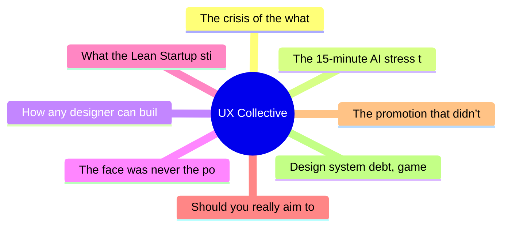

# ✏️ UX Collective Top 8 (2026-07-08)

## 思维导图

## 列表（8 条，0 条含全文）

### 1. The crisis of the what
- **链接**: [https://uxdesign.cc/the-crisis-of-the-what-d29135a8be59?source=rss----138adf9c44c---4](https://uxdesign.cc/the-crisis-of-the-what-d29135a8be59?source=rss----138adf9c44c---4)
- **作者**: Francisco Barrera Aros
- **发布**: Tue, 07 Jul 2026 22:51:18 GMT

### 2. The 15-minute AI stress test every designer can run
- **链接**: [https://uxdesign.cc/the-15-minute-ai-stress-test-every-designer-can-run-ce8de95ff5c9?source=rss----138adf9c44c---4](https://uxdesign.cc/the-15-minute-ai-stress-test-every-designer-can-run-ce8de95ff5c9?source=rss----138adf9c44c---4)
- **作者**: Peter (Zak) Zakrzewski
- **发布**: Tue, 07 Jul 2026 12:06:33 GMT

### 3. How any designer can build a more open design culture at work
- **链接**: [https://uxdesign.cc/how-any-designer-can-build-a-more-open-design-culture-at-work-e74e0925d781?source=rss----138adf9c44c---4](https://uxdesign.cc/how-any-designer-can-build-a-more-open-design-culture-at-work-e74e0925d781?source=rss----138adf9c44c---4)
- **作者**: Kai Wong
- **发布**: Tue, 07 Jul 2026 12:04:52 GMT
- **简介**: You don&#x2019;t need a &#x201C;leader&#x201D; title to build psychological safety at work.Continue reading on UX Collective »

### 4. The face was never the point
- **链接**: [https://uxdesign.cc/the-face-was-never-the-point-7f186f266e56?source=rss----138adf9c44c---4](https://uxdesign.cc/the-face-was-never-the-point-7f186f266e56?source=rss----138adf9c44c---4)
- **作者**: Takuma Kakehi
- **发布**: Sat, 04 Jul 2026 22:58:03 GMT
- **简介**: Animacy isn&#x2019;t something you design. It&#x2019;s something you trigger.Continue reading on UX Collective »

### 5. What the Lean Startup still teaches us about generative AI
- **链接**: [https://uxdesign.cc/what-the-lean-startup-still-teaches-us-about-generative-ai-2d1505fe1db1?source=rss----138adf9c44c---4](https://uxdesign.cc/what-the-lean-startup-still-teaches-us-about-generative-ai-2d1505fe1db1?source=rss----138adf9c44c---4)
- **作者**: Patrick Neeman
- **发布**: Mon, 06 Jul 2026 22:11:57 GMT

### 6. Should you really aim to be the best?
- **链接**: [https://uxdesign.cc/should-you-really-aim-to-be-the-best-a570d43fae37?source=rss----138adf9c44c---4](https://uxdesign.cc/should-you-really-aim-to-be-the-best-a570d43fae37?source=rss----138adf9c44c---4)
- **作者**: Dora Czerna
- **发布**: Mon, 06 Jul 2026 22:09:59 GMT

### 7. The promotion that didn’t take
- **链接**: [https://uxdesign.cc/the-promotion-that-didnt-take-adb678a7ec74?source=rss----138adf9c44c---4](https://uxdesign.cc/the-promotion-that-didnt-take-adb678a7ec74?source=rss----138adf9c44c---4)
- **作者**: Vlad Derdeicea
- **发布**: Mon, 06 Jul 2026 22:09:40 GMT

### 8. Design system debt, game UX, 39 principles for AI interaction
- **链接**: [https://uxdesign.cc/design-system-debt-game-ux-39-principles-for-ai-interaction-dab9500dc926?source=rss----138adf9c44c---4](https://uxdesign.cc/design-system-debt-game-ux-39-principles-for-ai-interaction-dab9500dc926?source=rss----138adf9c44c---4)
- **作者**: Fabricio Teixeira
- **发布**: Mon, 06 Jul 2026 11:25:19 GMT
