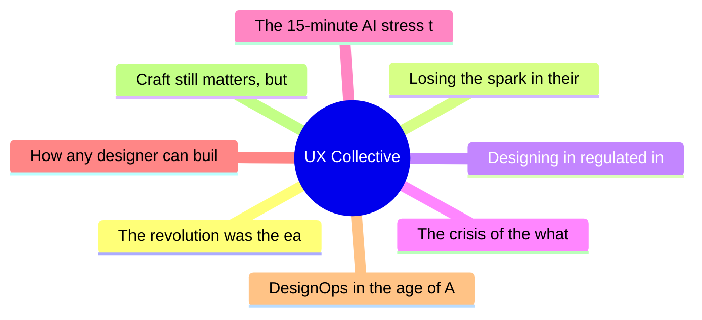

# ✏️ UX Collective Top 8 (2026-07-12)

## 思维导图

## 列表（8 条，0 条含全文）

### 1. The revolution was the easy part
- **链接**: [https://uxdesign.cc/the-revolution-was-the-easy-part-c753340e3e22?source=rss----138adf9c44c---4](https://uxdesign.cc/the-revolution-was-the-easy-part-c753340e3e22?source=rss----138adf9c44c---4)
- **作者**: Dan Maccarone
- **发布**: Wed, 08 Jul 2026 21:52:46 GMT

### 2. Losing the spark in their eyes
- **链接**: [https://uxdesign.cc/losing-the-spark-in-their-eyes-0ef198ab1499?source=rss----138adf9c44c---4](https://uxdesign.cc/losing-the-spark-in-their-eyes-0ef198ab1499?source=rss----138adf9c44c---4)
- **作者**: Frota
- **发布**: Wed, 08 Jul 2026 21:51:55 GMT

### 3. Designing in regulated industries
- **链接**: [https://uxdesign.cc/when-compliance-is-the-brief-a-creative-practitioners-survival-guide-to-designing-in-regulated-f0759cd3732c?source=rss----138adf9c44c---4](https://uxdesign.cc/when-compliance-is-the-brief-a-creative-practitioners-survival-guide-to-designing-in-regulated-f0759cd3732c?source=rss----138adf9c44c---4)
- **作者**: Andy Bhattacharyya
- **发布**: Wed, 08 Jul 2026 05:15:18 GMT

### 4. The crisis of the what
- **链接**: [https://uxdesign.cc/the-crisis-of-the-what-d29135a8be59?source=rss----138adf9c44c---4](https://uxdesign.cc/the-crisis-of-the-what-d29135a8be59?source=rss----138adf9c44c---4)
- **作者**: Francisco Barrera Aros
- **发布**: Tue, 07 Jul 2026 22:51:18 GMT

### 5. The 15-minute AI stress test every designer can run
- **链接**: [https://uxdesign.cc/the-15-minute-ai-stress-test-every-designer-can-run-ce8de95ff5c9?source=rss----138adf9c44c---4](https://uxdesign.cc/the-15-minute-ai-stress-test-every-designer-can-run-ce8de95ff5c9?source=rss----138adf9c44c---4)
- **作者**: Peter (Zak) Zakrzewski
- **发布**: Tue, 07 Jul 2026 12:06:33 GMT

### 6. How any designer can build a more open design culture at work
- **链接**: [https://uxdesign.cc/how-any-designer-can-build-a-more-open-design-culture-at-work-e74e0925d781?source=rss----138adf9c44c---4](https://uxdesign.cc/how-any-designer-can-build-a-more-open-design-culture-at-work-e74e0925d781?source=rss----138adf9c44c---4)
- **作者**: Kai Wong
- **发布**: Tue, 07 Jul 2026 12:04:52 GMT
- **简介**: You don&#x2019;t need a &#x201C;leader&#x201D; title to build psychological safety at work.Continue reading on UX Collective »

### 7. DesignOps in the age of AI: when governance becomes orchestration
- **链接**: [https://uxdesign.cc/designops-in-the-age-of-ai-when-governance-becomes-orchestration-7b946ceea70f?source=rss----138adf9c44c---4](https://uxdesign.cc/designops-in-the-age-of-ai-when-governance-becomes-orchestration-7b946ceea70f?source=rss----138adf9c44c---4)
- **作者**: Luis Hermosilla
- **发布**: Thu, 09 Jul 2026 16:23:55 GMT
- **简介**: DesignOps is shifting from governing human-led process to orchestrating human and AI technology towards ethical, meaningful outcomes.Continue reading on UX Collective »

### 8. Craft still matters, but it’s about outcomes
- **链接**: [https://uxdesign.cc/craft-still-matters-but-its-not-about-pixels-anymore-ai-can-help-you-keep-it-e542cac33d12?source=rss----138adf9c44c---4](https://uxdesign.cc/craft-still-matters-but-its-not-about-pixels-anymore-ai-can-help-you-keep-it-e542cac33d12?source=rss----138adf9c44c---4)
- **作者**: Patrick Neeman
- **发布**: Sat, 11 Jul 2026 13:29:41 GMT
