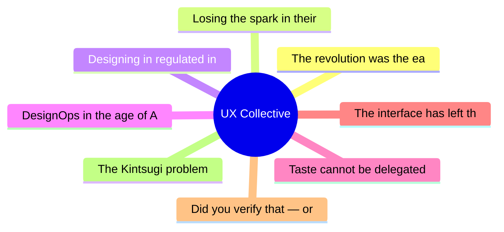

# ✏️ UX Collective Top 8 (2026-07-13)

## 思维导图

## 列表（8 条，0 条含全文）

### 1. The revolution was the easy part
- **链接**: [https://uxdesign.cc/the-revolution-was-the-easy-part-c753340e3e22?source=rss----138adf9c44c---4](https://uxdesign.cc/the-revolution-was-the-easy-part-c753340e3e22?source=rss----138adf9c44c---4)
- **作者**: Dan Maccarone
- **发布**: Wed, 08 Jul 2026 21:52:46 GMT

### 2. Losing the spark in their eyes
- **链接**: [https://uxdesign.cc/losing-the-spark-in-their-eyes-0ef198ab1499?source=rss----138adf9c44c---4](https://uxdesign.cc/losing-the-spark-in-their-eyes-0ef198ab1499?source=rss----138adf9c44c---4)
- **作者**: Frota
- **发布**: Wed, 08 Jul 2026 21:51:55 GMT

### 3. Designing in regulated industries
- **链接**: [https://uxdesign.cc/when-compliance-is-the-brief-a-creative-practitioners-survival-guide-to-designing-in-regulated-f0759cd3732c?source=rss----138adf9c44c---4](https://uxdesign.cc/when-compliance-is-the-brief-a-creative-practitioners-survival-guide-to-designing-in-regulated-f0759cd3732c?source=rss----138adf9c44c---4)
- **作者**: Andy Bhattacharyya
- **发布**: Wed, 08 Jul 2026 05:15:18 GMT

### 4. DesignOps in the age of AI: when governance becomes orchestration
- **链接**: [https://uxdesign.cc/designops-in-the-age-of-ai-when-governance-becomes-orchestration-7b946ceea70f?source=rss----138adf9c44c---4](https://uxdesign.cc/designops-in-the-age-of-ai-when-governance-becomes-orchestration-7b946ceea70f?source=rss----138adf9c44c---4)
- **作者**: Luis Hermosilla
- **发布**: Thu, 09 Jul 2026 16:23:55 GMT
- **简介**: DesignOps is shifting from governing human-led process to orchestrating human and AI technology towards ethical, meaningful outcomes.Continue reading on UX Collective »

### 5. Taste cannot be delegated
- **链接**: [https://uxdesign.cc/taste-cannot-be-delegated-1706847a0b4b?source=rss----138adf9c44c---4](https://uxdesign.cc/taste-cannot-be-delegated-1706847a0b4b?source=rss----138adf9c44c---4)
- **作者**: Aurélie Radom
- **发布**: Sun, 12 Jul 2026 21:32:06 GMT

### 6. The interface has left the building
- **链接**: [https://uxdesign.cc/the-interface-has-left-the-building-8fdb558d33a9?source=rss----138adf9c44c---4](https://uxdesign.cc/the-interface-has-left-the-building-8fdb558d33a9?source=rss----138adf9c44c---4)
- **作者**: Om Prakash
- **发布**: Sun, 12 Jul 2026 09:30:16 GMT

### 7. Did you verify that — or was it just too easy to believe?
- **链接**: [https://uxdesign.cc/did-you-verify-that-or-was-it-just-too-easy-to-believe-664ff017a1a1?source=rss----138adf9c44c---4](https://uxdesign.cc/did-you-verify-that-or-was-it-just-too-easy-to-believe-664ff017a1a1?source=rss----138adf9c44c---4)
- **作者**: Dora Czerna
- **发布**: Sun, 12 Jul 2026 09:28:48 GMT

### 8. The Kintsugi problem
- **链接**: [https://uxdesign.cc/the-kintsugi-problem-7f5e5cbfb442?source=rss----138adf9c44c---4](https://uxdesign.cc/the-kintsugi-problem-7f5e5cbfb442?source=rss----138adf9c44c---4)
- **作者**: Takuma Kakehi
- **发布**: Sun, 12 Jul 2026 09:28:24 GMT
- **简介**: The most important design decisions aren&#x2019;t made when everything works&#x200A;&#x2014;&#x200A;they&#x2019;re made when it doesn&#x2019;t.Continue reading on UX Collective »
