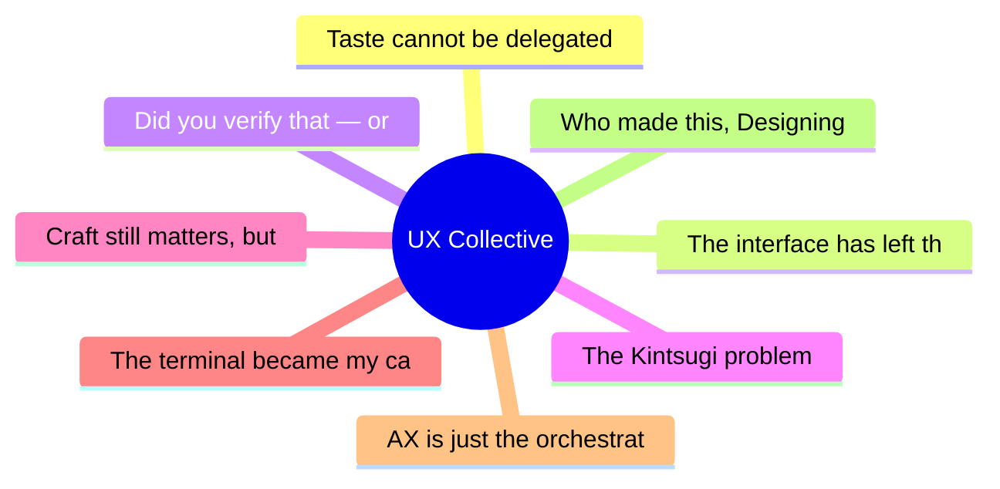

# ✏️ UX Collective Top 8 (2026-07-14)

## 思维导图

## 列表（8 条，0 条含全文）

### 1. Taste cannot be delegated
- **链接**: [https://uxdesign.cc/taste-cannot-be-delegated-1706847a0b4b?source=rss----138adf9c44c---4](https://uxdesign.cc/taste-cannot-be-delegated-1706847a0b4b?source=rss----138adf9c44c---4)
- **作者**: Aurélie Radom
- **发布**: Sun, 12 Jul 2026 21:32:06 GMT

### 2. The interface has left the building
- **链接**: [https://uxdesign.cc/the-interface-has-left-the-building-8fdb558d33a9?source=rss----138adf9c44c---4](https://uxdesign.cc/the-interface-has-left-the-building-8fdb558d33a9?source=rss----138adf9c44c---4)
- **作者**: Om Prakash
- **发布**: Sun, 12 Jul 2026 09:30:16 GMT

### 3. Did you verify that — or was it just too easy to believe?
- **链接**: [https://uxdesign.cc/did-you-verify-that-or-was-it-just-too-easy-to-believe-664ff017a1a1?source=rss----138adf9c44c---4](https://uxdesign.cc/did-you-verify-that-or-was-it-just-too-easy-to-believe-664ff017a1a1?source=rss----138adf9c44c---4)
- **作者**: Dora Czerna
- **发布**: Sun, 12 Jul 2026 09:28:48 GMT

### 4. The Kintsugi problem
- **链接**: [https://uxdesign.cc/the-kintsugi-problem-7f5e5cbfb442?source=rss----138adf9c44c---4](https://uxdesign.cc/the-kintsugi-problem-7f5e5cbfb442?source=rss----138adf9c44c---4)
- **作者**: Takuma Kakehi
- **发布**: Sun, 12 Jul 2026 09:28:24 GMT
- **简介**: The most important design decisions aren&#x2019;t made when everything works&#x200A;&#x2014;&#x200A;they&#x2019;re made when it doesn&#x2019;t.Continue reading on UX Collective »

### 5. Craft still matters, but it’s about outcomes
- **链接**: [https://uxdesign.cc/craft-still-matters-but-its-not-about-pixels-anymore-ai-can-help-you-keep-it-e542cac33d12?source=rss----138adf9c44c---4](https://uxdesign.cc/craft-still-matters-but-its-not-about-pixels-anymore-ai-can-help-you-keep-it-e542cac33d12?source=rss----138adf9c44c---4)
- **作者**: Patrick Neeman
- **发布**: Sat, 11 Jul 2026 13:29:41 GMT

### 6. The terminal became my canvas
- **链接**: [https://uxdesign.cc/the-terminal-became-my-canvas-18af0740f650?source=rss----138adf9c44c---4](https://uxdesign.cc/the-terminal-became-my-canvas-18af0740f650?source=rss----138adf9c44c---4)
- **作者**: Pablo Stanley
- **发布**: Mon, 13 Jul 2026 22:10:10 GMT
- **简介**: And it&#x2019;s great&#x2026; but horrible at the same timeContinue reading on UX Collective »

### 7. AX is just the orchestration layer
- **链接**: [https://uxdesign.cc/ax-is-just-the-orchestration-layer-cacb4ed4fe45?source=rss----138adf9c44c---4](https://uxdesign.cc/ax-is-just-the-orchestration-layer-cacb4ed4fe45?source=rss----138adf9c44c---4)
- **作者**: Adrian Levy
- **发布**: Mon, 13 Jul 2026 22:09:55 GMT
- **简介**: The work didn&#x2019;t vanish with the screen. It fell one layer down.Continue reading on UX Collective »

### 8. Who made this, Designing excuses, DesignOps in the age of AI
- **链接**: [https://uxdesign.cc/who-made-this-designing-excuses-designops-in-the-age-of-ai-e5ef0bb9093c?source=rss----138adf9c44c---4](https://uxdesign.cc/who-made-this-designing-excuses-designops-in-the-age-of-ai-e5ef0bb9093c?source=rss----138adf9c44c---4)
- **作者**: Fabricio Teixeira
- **发布**: Mon, 13 Jul 2026 11:11:11 GMT
