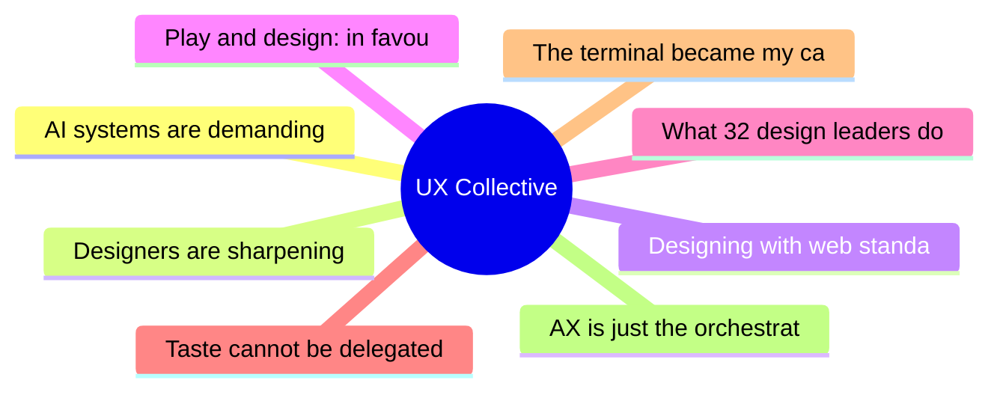

# ✏️ UX Collective Top 8 (2026-07-16)

## 思维导图

## 列表（8 条，0 条含全文）

### 1. AI systems are demanding new interaction models. Are designers ready?
- **链接**: [https://uxdesign.cc/ai-systems-are-demanding-new-interaction-models-are-designers-ready-d8a95f5e55a9?source=rss----138adf9c44c---4](https://uxdesign.cc/ai-systems-are-demanding-new-interaction-models-are-designers-ready-d8a95f5e55a9?source=rss----138adf9c44c---4)
- **作者**: Arin Bhowmick
- **发布**: Wed, 15 Jul 2026 19:48:50 GMT

### 2. Designers are sharpening knives for the wrong fight
- **链接**: [https://uxdesign.cc/everyones-sharpening-knives-for-the-wrong-fight-56844adad459?source=rss----138adf9c44c---4](https://uxdesign.cc/everyones-sharpening-knives-for-the-wrong-fight-56844adad459?source=rss----138adf9c44c---4)
- **作者**: Dan Maccarone
- **发布**: Wed, 15 Jul 2026 19:47:57 GMT

### 3. Designing with web standards: The playbook for this AI moment
- **链接**: [https://uxdesign.cc/designing-with-web-standards-the-playbook-for-this-ai-moment-92394884dc0d?source=rss----138adf9c44c---4](https://uxdesign.cc/designing-with-web-standards-the-playbook-for-this-ai-moment-92394884dc0d?source=rss----138adf9c44c---4)
- **作者**: Patrick Neeman
- **发布**: Wed, 15 Jul 2026 07:33:17 GMT

### 4. Play and design: in favour of the novel digital experience
- **链接**: [https://uxdesign.cc/play-and-design-in-favour-of-the-novel-digital-experience-ea4798a2f621?source=rss----138adf9c44c---4](https://uxdesign.cc/play-and-design-in-favour-of-the-novel-digital-experience-ea4798a2f621?source=rss----138adf9c44c---4)
- **作者**: Zacharia C.
- **发布**: Tue, 14 Jul 2026 11:02:36 GMT
- **简介**: Design used to let us wander; modernity replaced that wandering with efficiency &#x2014; now, every product decides where you&#x2019;ll end up before&#x2026;Continue reading on UX Collective »

### 5. What 32 design leaders do when told to move faster
- **链接**: [https://uxdesign.cc/what-32-design-leaders-do-when-told-to-move-faster-9c8d46c90319?source=rss----138adf9c44c---4](https://uxdesign.cc/what-32-design-leaders-do-when-told-to-move-faster-9c8d46c90319?source=rss----138adf9c44c---4)
- **作者**: Kai Wong
- **发布**: Tue, 14 Jul 2026 11:00:41 GMT
- **简介**: The Greeks knew the answer to this problem, 2300 years agoContinue reading on UX Collective »

### 6. Taste cannot be delegated
- **链接**: [https://uxdesign.cc/taste-cannot-be-delegated-1706847a0b4b?source=rss----138adf9c44c---4](https://uxdesign.cc/taste-cannot-be-delegated-1706847a0b4b?source=rss----138adf9c44c---4)
- **作者**: Aurélie Radom
- **发布**: Sun, 12 Jul 2026 21:32:06 GMT

### 7. The terminal became my canvas
- **链接**: [https://uxdesign.cc/the-terminal-became-my-canvas-18af0740f650?source=rss----138adf9c44c---4](https://uxdesign.cc/the-terminal-became-my-canvas-18af0740f650?source=rss----138adf9c44c---4)
- **作者**: Pablo Stanley
- **发布**: Mon, 13 Jul 2026 22:10:10 GMT
- **简介**: And it&#x2019;s great&#x2026; but horrible at the same timeContinue reading on UX Collective »

### 8. AX is just the orchestration layer
- **链接**: [https://uxdesign.cc/ax-is-just-the-orchestration-layer-cacb4ed4fe45?source=rss----138adf9c44c---4](https://uxdesign.cc/ax-is-just-the-orchestration-layer-cacb4ed4fe45?source=rss----138adf9c44c---4)
- **作者**: Adrian Levy
- **发布**: Mon, 13 Jul 2026 22:09:55 GMT
- **简介**: The work didn&#x2019;t vanish with the screen. It fell one layer down.Continue reading on UX Collective »
