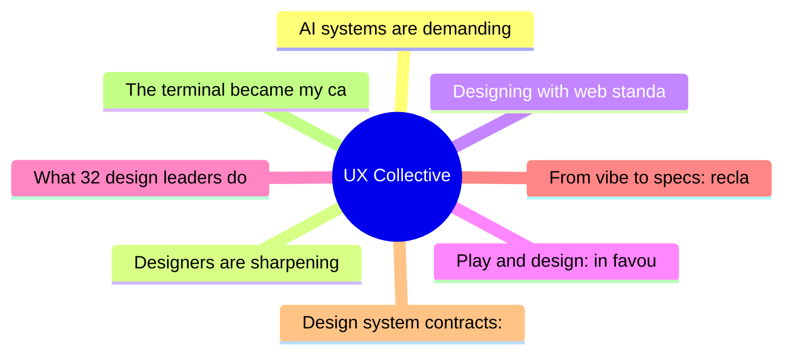

# ✏️ UX Collective Top 8 (2026-07-17)

## 思维导图

## 列表（8 条，2 条含全文）

### 1. AI systems are demanding new interaction models. Are designers ready?
- **链接**: [https://uxdesign.cc/ai-systems-are-demanding-new-interaction-models-are-designers-ready-d8a95f5e55a9?source=rss----138adf9c44c---4](https://uxdesign.cc/ai-systems-are-demanding-new-interaction-models-are-designers-ready-d8a95f5e55a9?source=rss----138adf9c44c---4)
- **作者**: Arin Bhowmick
- **发布**: Wed, 15 Jul 2026 19:48:50 GMT

📄 全文（4021 字符，点击展开）

# AI systems are demanding new interaction models. Are designers ready?

For decades, most software interactions have worked the same way. You open applications, close them, drag files into folders, click through menus, move between windows…

That’s the desktop metaphor, software designed to feel like a physical workspace. Mobile touch and the web brought their own interaction models, but the desktop set much of the grammar, and it still defines how people move through software even as interfaces evolve around it.

Now, AI systems are challenging that grammar.

Conversational interaction in software has been around for quite some time (we’ve all used Alexa, Siri, and chatbots), but only within scripted bounds, responding to user input. Recent models can interpret intent, take action on it, and build parts of the interface as they go.

We’re moving from task-driven interfaces, where you operate every step, to intent-driven interfaces, where the work starts after you’ve spoken or typed your intent.

Are there new interaction models on the table now? And if there are, where do designers come in?

## Past the back-and-forth

While writing this article, I read that Thinking Machines Lab , an AI startup founded by Mira Murati (the former CTO of OpenAI), released a research preview of [ Interaction Models](https://thinkingmachines.ai/blog/interaction-models/).

The company uses the term “interaction models” to name what they’ve been building. See the distinction:

Thinking Machine’s Interaction Models is a new kind of AI model with an architecture designed for real-time multimodal exchange (audio, video, and text simultaneously).

In design, an interaction model is the overarching framework that ties a product’s functions together.

What a coincidence… or is it?

Not quite. Both use the same word for two different layers of the same stack. The model layer concerns what the system can do internally: how it processes input, maintains context, and responds across modes. The design layer is about how a person experiences that work: what they see, what they click, and what mental model they form.

Design is the translation between what the model can do and how a person uses it. When the model gains new capabilities, such as holding a real-time conversation across audio, video, and text, the design layer above it has to translate them into something people can work with.

In the demo videos Thinking Machine Labs shared , Interaction Models takes in audio, video, and text at once and respond while you’re still talking. It can cut in when you say something wrong, react to what it sees on camera, and translate one language into another on the fly.

## Get Arin Bhowmick’s stories in your inbox

Join Medium for free to get updates from this writer.

In one clip, two people ask it to build a chart of Uber’s earnings and costs. The chart is a generative UI, built on the spot for that one question. While the model is still drawing it in the background, they ask what Uber has been up to for the business this year. The model keeps the conversation going and brings the chart in when it’s ready.

Underneath all the engineering, what’s changing is the rhythm of the interaction. The old setup made you wait for the machine, and made the machine wait for you. This one takes the waiting out, so the exchange runs without stopping.

That change in rhythm is what puts pressure on the interaction model. The framework we have been using assumes turn-taking. An AI model that listens, talks, and works in parallel doesn’t fit into that structure.

## What designers have to consider

Once interaction becomes continuous (rather than sequential), the role of design changes in a few specific ways:

- **The mental model has to be rebuilt.**The desktop metaphor gave users a picture they could navigate (files, folders, apps). With AI in the loop, that picture is incomplete. Users have to form a mental model of something invisible: a system that interprets intent, acts 

...（截断，原文 6416+ 字符）

### 2. Designers are sharpening knives for the wrong fight
- **链接**: [https://uxdesign.cc/everyones-sharpening-knives-for-the-wrong-fight-56844adad459?source=rss----138adf9c44c---4](https://uxdesign.cc/everyones-sharpening-knives-for-the-wrong-fight-56844adad459?source=rss----138adf9c44c---4)
- **作者**: Dan Maccarone
- **发布**: Wed, 15 Jul 2026 19:47:57 GMT

📄 全文（4022 字符，点击展开）

A few weeks ago I sat on a call with a company that had spent two and a half years and four design iterations building and re-building a product. About forty minutes in, one of their engineers chimed in and echoed a mantra I’ve [said many times](https://entrepreneur.nyu.edu/blog/2026/06/21/build-smarter-not-faster-lessons-from-dan-maccarone-on-ai-validation-and-knowing-what-to-build/) and one that plenty of people [smarter than me](https://amygottler.co.uk/ai/just-because-ai-can-doesnt-mean-it-should/) have shouted for decades because its the most important mantra in the world of creating products: just because you can build something doesn’t mean you should.

But he kept going and the part that stuck with me was what had actually gone wrong.

A startup used to get one real shot at an idea, he said, because building was slow enough and expensive enough that your budget only paid for one go at it. AI had cut that cost so much that they’d taken multiple shots instead and many iterations later they were no closer to having a product anyone wanted.

They still could not tell me who they were building it for because building it wasn’t the bottleneck. The decision process was, and there unfortunately hadn’t been much in terms of decisions or process.

To be clear, these were not clumsy or ignorant people. The engineering was, in a lot of places, genuinely beautiful. They had a working voice interface, a slick web app, and a problem-solving engine running underneath it that was smarter than most things I’ve seen after several years in the AI space.

The same engineer used a biotech analogy to describe where they’d landed: they’d invented a molecule that might really cure something, and they had no manufacturing, no distribution, and no earthly idea who was sick. They could build anything. They had built almost everything, but none of it had touched a single customer who cared.

I’ve thought about that call ever since, because that company represents so much of the AI industry as it stands today. We have made building products nearly free, and we have spent all our energy getting even better at it, while the one thing that actually decides whether a product succeeds, why it deserves to exist and for whom, gets almost none of the conversation.

That work has a name. It’s strategy, and it’s supposed to be our job. Product exists to decide what’s worth building.

[Roman Pichler](https://www.romanpichler.com/blog/romans-product-strategy-framework-v3/) frames the core of it as a handful of choices that sit above everything else: who the product is for, and why anyone would want it. Somewhere along the way, those questions just stopped getting asked. Not by us, not by anyone.

## Everyone is solving the wrong problem

Open any design publication this month, and you’ll find the same conversation dressed up in more costumes than Taylor Swift’s Eras Tour.

Some people say the role of design just leveled up. [Lisa Demchenko](/ai-didnt-replace-designers-it-promoted-them-5b6d24de4e26) has a sharp piece on the product designer becoming a system architect instead of a spec maker, and she’s right about the shape of the shift. Taste is the last thing AI can’t touch. [Andrea Grigsby](/ai-is-coming-for-our-design-jobs-but-it-cant-touch-taste-afd5c7a48184) made that case cleanly, and I’ve[ made a version of it myself.](https://medium.com/@danmaccarone/dan-maccarones-seven-rules-of-ai-hygiene-1d790eef5c96)

We need standards, real ones, to survive this moment. [Patrick Neeman](https://medium.com/@usabilitycounts/designing-with-web-standards-the-playbook-for-this-ai-moment-92394884dc0d) put together a good playbook arguing that the web-standards fight that ended the browser wars is the exact playbook for this AI moment, won by building a coalition to agree on how we could remove the incredible frustration we dealt with in dot-com 1.0. Neeman is a standards guy to his bones and when he tells you to take the work seriously, listen. He’s usually right.

Th

...（截断，原文 20578+ 字符）

### 3. Designing with web standards: The playbook for this AI moment
- **链接**: [https://uxdesign.cc/designing-with-web-standards-the-playbook-for-this-ai-moment-92394884dc0d?source=rss----138adf9c44c---4](https://uxdesign.cc/designing-with-web-standards-the-playbook-for-this-ai-moment-92394884dc0d?source=rss----138adf9c44c---4)
- **作者**: Patrick Neeman
- **发布**: Wed, 15 Jul 2026 07:33:17 GMT

### 4. Play and design: in favour of the novel digital experience
- **链接**: [https://uxdesign.cc/play-and-design-in-favour-of-the-novel-digital-experience-ea4798a2f621?source=rss----138adf9c44c---4](https://uxdesign.cc/play-and-design-in-favour-of-the-novel-digital-experience-ea4798a2f621?source=rss----138adf9c44c---4)
- **作者**: Zacharia C.
- **发布**: Tue, 14 Jul 2026 11:02:36 GMT
- **简介**: Design used to let us wander; modernity replaced that wandering with efficiency &#x2014; now, every product decides where you&#x2019;ll end up before&#x2026;Continue reading on UX Collective »

### 5. What 32 design leaders do when told to move faster
- **链接**: [https://uxdesign.cc/what-32-design-leaders-do-when-told-to-move-faster-9c8d46c90319?source=rss----138adf9c44c---4](https://uxdesign.cc/what-32-design-leaders-do-when-told-to-move-faster-9c8d46c90319?source=rss----138adf9c44c---4)
- **作者**: Kai Wong
- **发布**: Tue, 14 Jul 2026 11:00:41 GMT
- **简介**: The Greeks knew the answer to this problem, 2300 years agoContinue reading on UX Collective »

### 6. From vibe to specs: reclaiming the design process with SAID framework
- **链接**: [https://uxdesign.cc/from-vibe-to-specs-reclaiming-the-design-process-with-said-framework-477a5d0d8932?source=rss----138adf9c44c---4](https://uxdesign.cc/from-vibe-to-specs-reclaiming-the-design-process-with-said-framework-477a5d0d8932?source=rss----138adf9c44c---4)
- **作者**: Darren Yeo
- **发布**: Thu, 16 Jul 2026 22:20:29 GMT

### 7. Design system contracts: the component lives in neither Figma nor code
- **链接**: [https://uxdesign.cc/design-system-contracts-the-component-lives-in-neither-figma-nor-code-3032d94ca067?source=rss----138adf9c44c---4](https://uxdesign.cc/design-system-contracts-the-component-lives-in-neither-figma-nor-code-3032d94ca067?source=rss----138adf9c44c---4)
- **作者**: Christine Vallaure
- **发布**: Thu, 16 Jul 2026 22:17:35 GMT

### 8. The terminal became my canvas
- **链接**: [https://uxdesign.cc/the-terminal-became-my-canvas-18af0740f650?source=rss----138adf9c44c---4](https://uxdesign.cc/the-terminal-became-my-canvas-18af0740f650?source=rss----138adf9c44c---4)
- **作者**: Pablo Stanley
- **发布**: Mon, 13 Jul 2026 22:10:10 GMT
- **简介**: And it&#x2019;s great&#x2026; but horrible at the same timeContinue reading on UX Collective »
