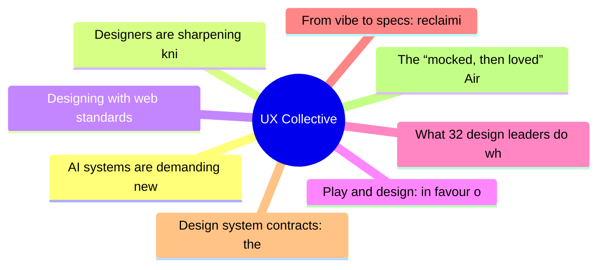
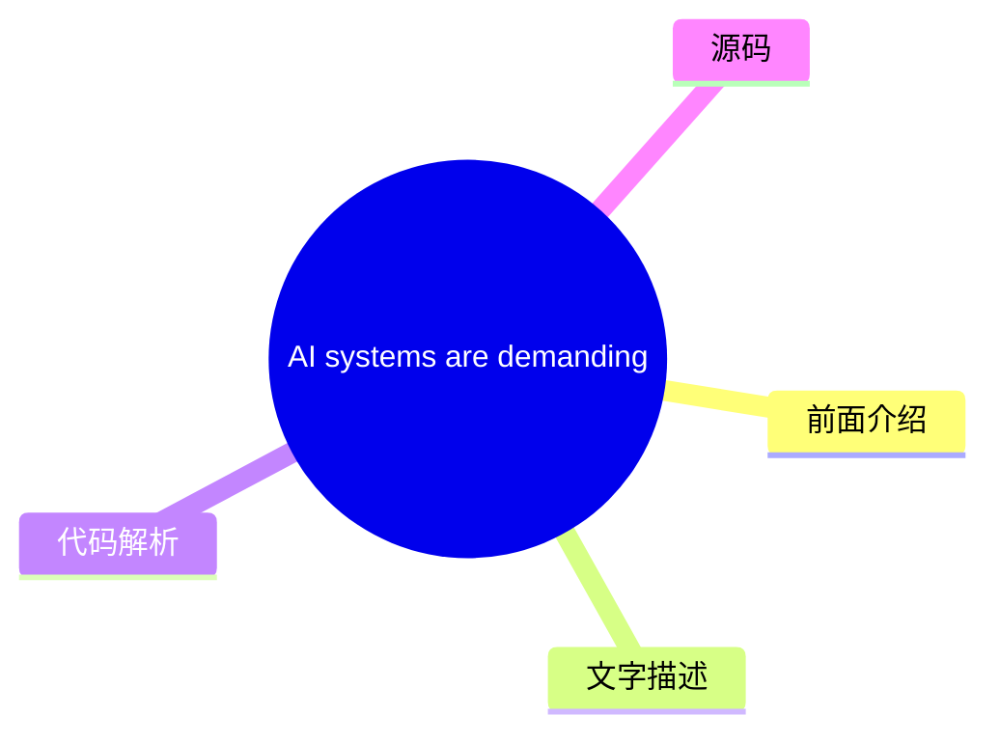
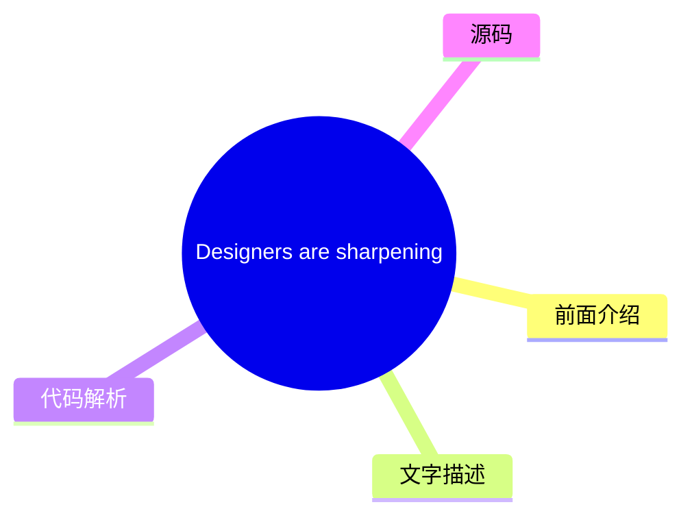
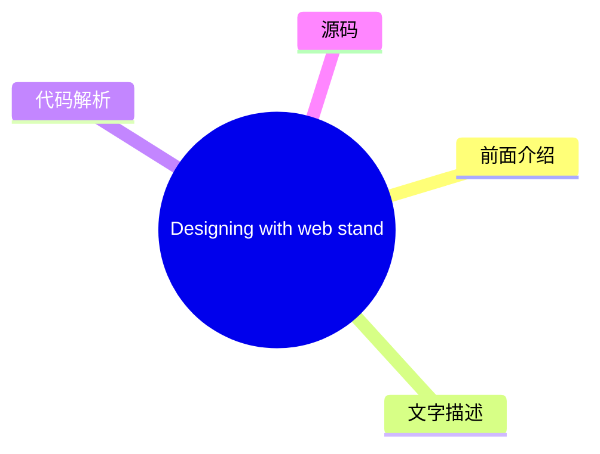
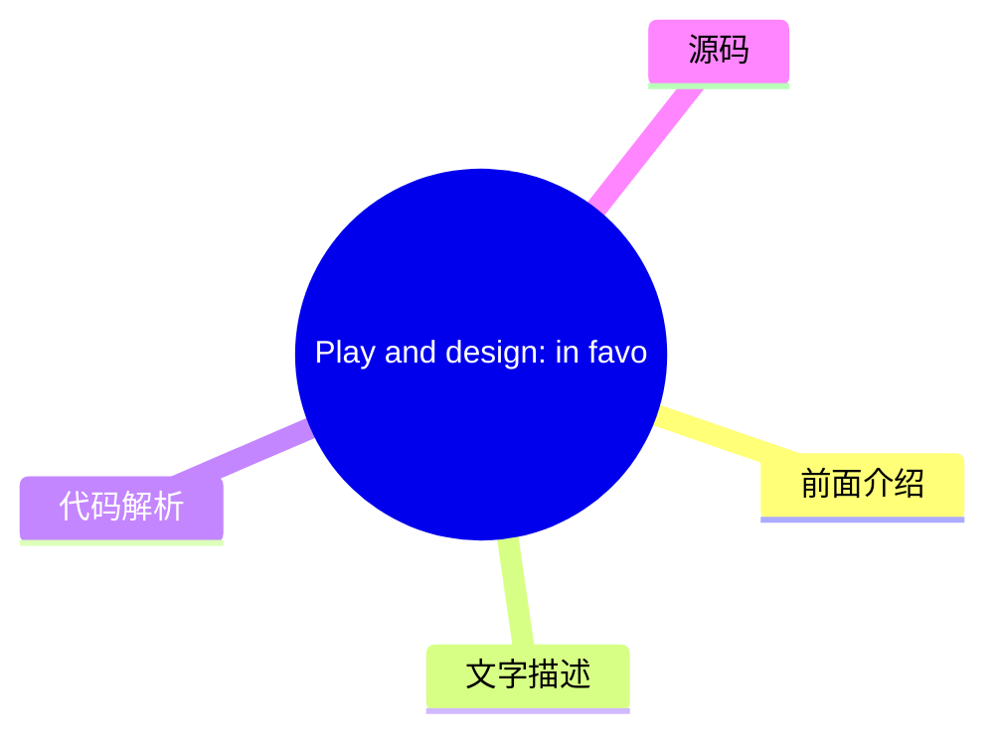
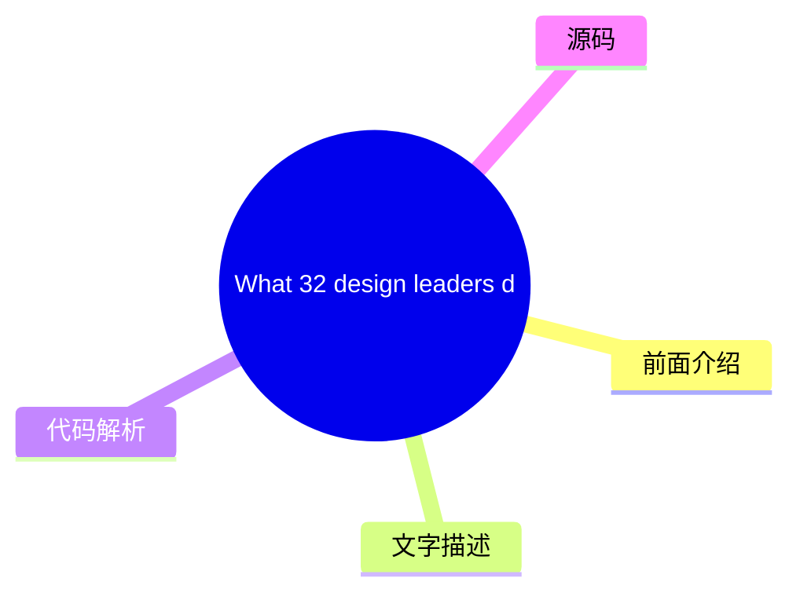
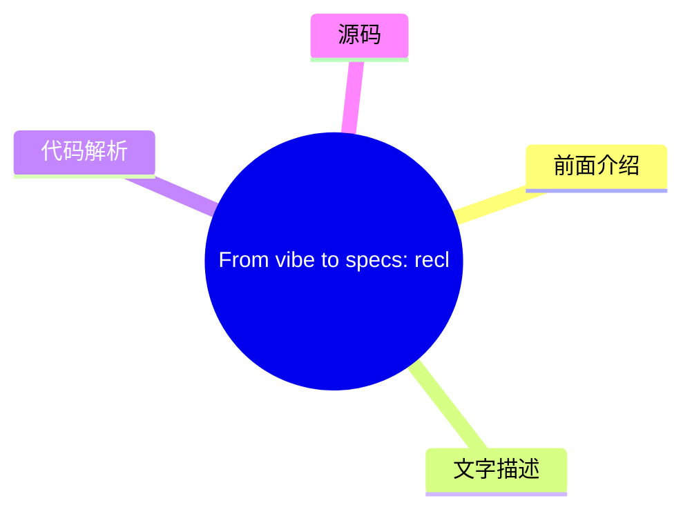
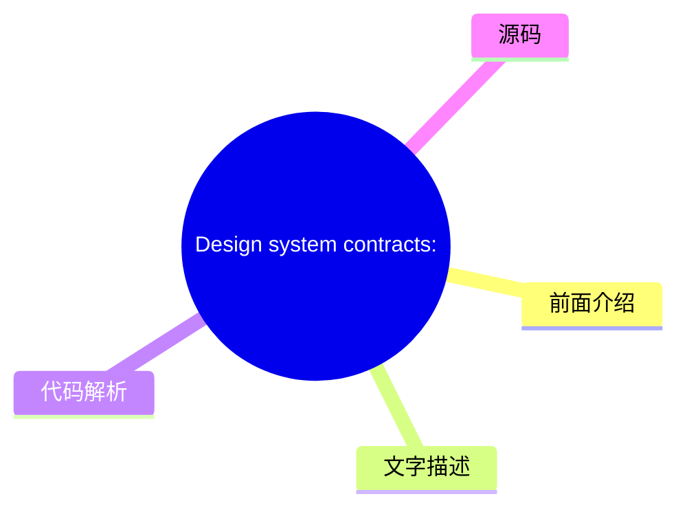
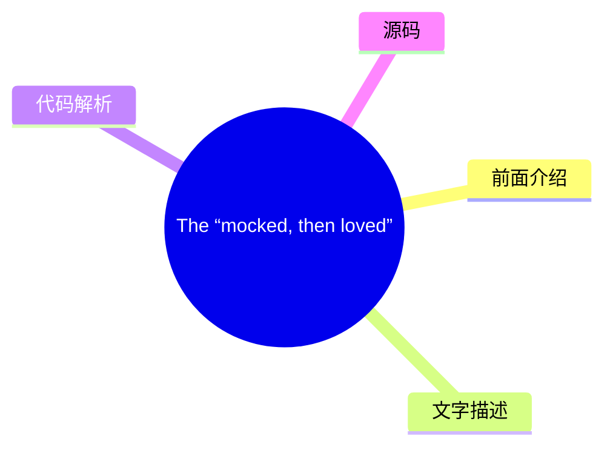

# ✏️ UX Collective Top 8 (2026-07-18)

## 前面介绍

- 数据源：UX Collective
- 抓取日期：2026-07-18
- 条目数：8
- 含完整正文：8
- 含代码片段：1
- 组织方式：前面介绍 / 树状图 / 文字描述 / 代码解析 / 源码

## 思维导图



## 详细整理（8 条，8 条含全文，1 条含代码）

### 1. AI systems are demanding new interaction models. Are designers ready?
- **链接**: [https://uxdesign.cc/ai-systems-are-demanding-new-interaction-models-are-designers-ready-d8a95f5e55a9?source=rss----138adf9c44c---4](https://uxdesign.cc/ai-systems-are-demanding-new-interaction-models-are-designers-ready-d8a95f5e55a9?source=rss----138adf9c44c---4)
- **作者**: Arin Bhowmick
- **发布**: Wed, 15 Jul 2026 19:48:50 GMT

#### 前面介绍

- 作者：Arin Bhowmick
- 发布时间：Wed, 15 Jul 2026 19:48:50 GMT

#### 树状图



#### 文字描述

- # AI systems are demanding new interaction models. Are designers ready? For decades, most software interactions have worked the same way. You open applications, close them, drag files into folders, click through menus, move between windows… That’s the desktop metaphor, software designed to feel like a physical workspace. Mobile touch and the web brought their own interaction mo
- ## Past the back-and-forth While writing this article, I read that Thinking Machines Lab , an AI startup founded by Mira Murati (the former CTO of OpenAI), released a research preview of [ Interaction Models](https://thinkingmachines.ai/blog/interaction-models/). The company uses the term “interaction models” to name what they’ve been building. See the distinction: Thinking Mac
- ## Get Arin Bhowmick’s stories in your inbox Join Medium for free to get updates from this writer. In one clip, two people ask it to build a chart of Uber’s earnings and costs. The chart is a generative UI, built on the spot for that one question. While the model is still drawing it in the background, they ask what Uber has been up to for the business this year. The model keeps
- ## What designers have to consider Once interaction becomes continuous (rather than sequential), the role of design changes in a few specific ways: - **The mental model has to be rebuilt.**The desktop metaphor gave users a picture they could navigate (files, folders, apps). With AI in the loop, that picture is incomplete. Users have to form a mental model of something invisible

#### 代码解析

- 本文未检测到明确代码块，内容更偏新闻、观点或方法论。

#### 源码

#### 中文节选

# AI 系统正在要求新的交互模型。设计师们准备好了吗？

几十年来，大多数软件交互一直以相同的方式运作。你打开应用程序，关闭它们，把文件拖进文件夹，点击菜单，在窗口之间切换……

这就是桌面隐喻，即设计得像物理工作空间一样的软件。移动触控和网络带来了它们自己的交互模型，但桌面奠定了大部分语法，即使界面围绕它演变，它仍然定义了人们在软件中移动的方式。

现在，AI 系统正在挑战这种语法。

软件中的对话式交互已经存在了一段时间（我们都用过 Alexa、Siri 和聊天机器人），但仅限于脚本范围内的响应式交互。最近的模型可以解读意图，对其采取行动，并在过程中构建部分界面。

我们正从任务驱动的界面（你操作每一步）转向意图驱动的界面（在你表达或输入意图后工作才开始）。

现在有新的交互模型出现吗？如果有，设计师在其中扮演什么角色？

## 超越来回对话

在撰写这篇文章时，我读到 Thinking Machines Lab 发布了一项关于 [交互模型](https://thinkingmachines.ai/blog/interaction-models/) 的研究预览，这是一家由 Mira Murati（OpenAI 前首席技术官）创立的 AI 初创公司。

该公司使用“交互模型”一词来命名他们正在构建的东西。请看这种区别：

Thinking Machines 的交互模型是一种新型 AI 模型，其架构旨在实现实时多模态交换（同时进行音频、视频和文本）。

在设计领域，交互模型是将产品的功能联系在一起的总体框架。

多么巧合……还是说并非如此？

并非如此。两者对同一堆栈的不同层级使用了相同的词。模型层关乎系统内部能做什么：它如何处理输入、保持上下文以及跨模式响应。设计层关乎人们如何体验这项工作：他们看到什么、点击什么以及形成什么样的心智模型。

设计是将模型能做的事情与人们如何使用它之间进行转换的桥梁。当模型获得了新的能力，例如跨越音频、视频和文本进行实时对话时，其上方的设计层必须将这些能力转化为人们可以使用的形式。

在 Thinking Machine Labs 分享的演示视频中，Interaction Models 可以同时接收音频、视频和文本，并在你说话的同时做出回应。当你说话出错时，它可以介入，对摄像头看到的内容做出反应，并实时将一种语言翻译成另一种语言。

## 在您的收件箱中获取 Arin Bhowmick 的故事

加入 Medium 免费获取该作者的更新。

在一个片段中，两个人要求它制作一张优步的收益和成本图表。该图表是一个生成式 UI，是专门为那个问题即时构建的。当模型仍在后台绘制图表时，他们问 wha

#### 完整正文（中文）

# AI 系统正在要求新的交互模型。设计师们准备好了吗？

几十年来，大多数软件交互一直以相同的方式运作。你打开应用程序，关闭它们，把文件拖进文件夹，点击菜单，在窗口之间切换……

这就是桌面隐喻，即设计得像物理工作空间一样的软件。移动触控和网络带来了它们自己的交互模型，但桌面奠定了大部分语法，即使界面围绕它演变，它仍然定义了人们在软件中移动的方式。

现在，AI 系统正在挑战这种语法。

软件中的对话式交互已经存在了一段时间（我们都用过 Alexa、Siri 和聊天机器人），但仅限于脚本范围内的响应式交互。最近的模型可以解读意图，对其采取行动，并在过程中构建部分界面。

我们正从任务驱动的界面（你操作每一步）转向意图驱动的界面（在你表达或输入意图后工作才开始）。

现在有新的交互模型出现吗？如果有，设计师在其中扮演什么角色？

## 超越来回对话

在撰写这篇文章时，我读到 Thinking Machines Lab 发布了一项关于 [交互模型](https://thinkingmachines.ai/blog/interaction-models/) 的研究预览，这是一家由 Mira Murati（OpenAI 前首席技术官）创立的 AI 初创公司。

该公司使用“交互模型”一词来命名他们正在构建的东西。请看这种区别：

Thinking Machines 的交互模型是一种新型 AI 模型，其架构旨在实现实时多模态交换（同时进行音频、视频和文本）。

在设计领域，交互模型是将产品的功能联系在一起的总体框架。

多么巧合……还是说并非如此？

并非如此。两者对同一堆栈的不同层级使用了相同的词。模型层关乎系统内部能做什么：它如何处理输入、保持上下文以及跨模式响应。设计层关乎人们如何体验这项工作：他们看到什么、点击什么以及形成什么样的心智模型。

设计是将模型能做的事情与人们如何使用它之间进行转化的过程。当模型获得了新的能力，例如跨越音频、视频和文本进行实时对话时，其上层的设计层必须将这些能力转化为人们可以使用的工具。

在 Thinking Machine Labs 分享的演示视频中，Interaction Models 能够同时接收音频、视频和文本，并在你说话的同时做出回应。当你说话出错时，它可以插话，对摄像头看到的内容做出反应，并实时将一种语言翻译成另一种语言。

## 在您的收件箱中获取 Arin Bhowmick 的故事

加入 Medium 免费获取该作者的更新。

在一个片段中，两个人要求它制作一张优步的收入和成本图表。该图表是一个生成式 UI，是针对那个特定问题即时构建的。当模型在后台绘制图表时，他们询问优步今年的业务情况。模型保持对话继续，并在准备就绪时呈现图表。

在所有工程工作之下，发生改变的是交互的节奏。旧的设置让你等待机器，也让机器等待你。新的设置消除了等待，使交换过程不间断地进行。

这种节奏的改变给交互模型带来了压力。我们一直使用的框架假设是轮流进行。一个能够同时倾听、说话和工作的 AI 模型并不适合这种结构。

## 设计师需要考虑的问题

一旦交互变得连续（而非顺序），设计的角色会在几个特定方面发生变化：

- **心理模型必须重建。** 桌面隐喻为用户提供了一个可以导航的图像（文件、文件夹、应用程序）。随着 AI 的介入，这个图像是不完整的。用户必须形成对某种看不见的事物的心理模型：一个解释意图、执行意图并产生输出的系统。设计师必须让这种思考过程变得可见。

- **入口和导航改变形态。** 用户可能始于聊天，最终进入生成的 UI，然后转入永久仪表盘。他们可能从任何上下文启动一个智能体。交互模型需要为事物的起始位置、如何返回以及如何找到之前完成的内容制定新的约定。
- **干预点成为深思熟虑的设计选择。** 旧界面在每次点击时都给予用户控制权。新界面的运行速度更快。设计师必须选择在哪里插入审查、撤销和确认，以及它们的外观。
- **将路由判断权交还给人类比以往任何时候都更重要。** AI 模型存在特定的缺陷。TCS 研究院最近的一篇论文 —— **“Can LLMs Perceive Time?”（LLM 能感知时间吗？）**

一些人认为传统界面正在消亡，被代表底层系统与用户对话的 AI 智能体所取代。

对于许多用例，他们可能是对的。当 AI 智能体能够端到端地处理工作时，传统屏幕可能会逐渐淡出。智能体不关心 UI。但人类关心。

当人类对结果负责时，UI 就是这种责任的工具。它是人们查看系统做了什么、理解结果，并在需要纠正时介入的方式。

这在企业软件中尤为相关，因为决策通常需要审查或审计。任何新的交互模型都必须让系统的操作在发生时可见。它需要给人们一个介入的地方，以及一个可以回溯的记录。

## 建立新的关系是终极挑战

设计师兼创意总监 **Frank Chimero**** **曾写道，人们会忽略那些忽略人的设计。这是任何交互模型都必须通过的测试。桌面隐喻在过去四十年里通过给人们一个清晰的心理模型而通过了测试：文件夹里的文件、屏幕上的应用，以及他们可以导航的层级关系。

我们开始构建的新交互模型——对话式、智能体式、多模态、生成式——尚不具备这种清晰度。我们正在步入人与系统之间一种不同类型的关系。一种我们仍在学习如何描述的关系。

*Arin Bhowmick** (**@arinbhowmick**) 是 SAP 的首席设计官，居住在加利福尼亚州旧金山。上述文章为个人观点，不一定代表 SAP 的立场、战略或观点。*


### 2. Designers are sharpening knives for the wrong fight
- **链接**: [https://uxdesign.cc/everyones-sharpening-knives-for-the-wrong-fight-56844adad459?source=rss----138adf9c44c---4](https://uxdesign.cc/everyones-sharpening-knives-for-the-wrong-fight-56844adad459?source=rss----138adf9c44c---4)
- **作者**: Dan Maccarone
- **发布**: Wed, 15 Jul 2026 19:47:57 GMT

#### 前面介绍

- 作者：Dan Maccarone
- 发布时间：Wed, 15 Jul 2026 19:47:57 GMT

#### 树状图



#### 文字描述

- A few weeks ago I sat on a call with a company that had spent two and a half years and four design iterations building and re-building a product. About forty minutes in, one of their engineers chimed in and echoed a mantra I’ve [said many times](https://entrepreneur.nyu.edu/blog/2026/06/21/build-smarter-not-faster-lessons-from-dan-maccarone-on-ai-validation-and-knowing-what-to-
- ## Everyone is solving the wrong problem Open any design publication this month, and you’ll find the same conversation dressed up in more costumes than Taylor Swift’s Eras Tour. Some people say the role of design just leveled up. [Lisa Demchenko](/ai-didnt-replace-designers-it-promoted-them-5b6d24de4e26) has a sharp piece on the product designer becoming a system architect inst
- ## When being wrong was expensive The quality of the work has almost never been what sends a product to the startup graveyard. In the decades I’ve worked in what we now call Product, I can count on one hand the times a product died because the buttons were the wrong shade of blue or the code had an anti-pattern in it. Products die because somebody built the wrong thing, with to
- ## A beautiful product nobody wants So here’s where I part ways with the whole lovely quality conversation, Neeman’s piece included, and I want to be careful, because I’m not saying any of them are wrong. They’re arming for a fight I’m not losing sleep over. Standards make sure the thing gets made well. Taste makes sure it’s good. Both matter more than they did a year ago, beca

#### 代码解析

- 本文未检测到明确代码块，内容更偏新闻、观点或方法论。

#### 源码

#### 中文节选

几周前，我参加了一次通话，对方是一家公司，他们花了两年半的时间，经过四次设计迭代，反复构建和重建了一个产品。通话进行到大约四十分钟时，其中一位工程师插话，重复了我多次提到过的一句格言，也是许多比我聪明的人几十年来一直强调的格言，因为这是产品创造领域最重要的格言：仅仅因为你能够构建某样东西，并不意味着你应该构建它。

但他继续说了下去，而让我印象深刻的是，实际上出了什么问题。

他说，过去一家初创公司对一个想法只有一次真正的机会，因为构建过程既缓慢又昂贵，预算只够尝试一次。AI 大幅削减了成本，导致他们进行了多次尝试，经过多次迭代后，他们仍然没有更接近拥有一个任何人想要的产品。

他们仍然无法告诉我他们是在为谁构建，因为构建本身并不是瓶颈。决策过程才是瓶颈，遗憾的是，在决策或流程方面几乎没有做太多工作。

需要明确的是，这些人并不笨拙或无知。在许多地方，工程实现确实非常出色。他们拥有一个可用的语音界面、一个流畅的 Web 应用程序，以及在其下运行的问题解决引擎，这比我多年来在 AI 领域见过的绝大多数东西都要智能。

同一位工程师用生物技术类比来描述他们所处的境地：他们发明了一种可能真正治愈某种疾病的分子，但他们没有制造能力，没有分销渠道，也不知道到底谁生病了。他们可以构建任何东西。他们几乎构建了所有东西，但没有一个产品触碰到一个在乎它的客户。

自那通电话之后，我一直都在思考，因为那家公司代表了当今 AI 行业的大部分现状。我们已经让构建产品变得近乎免费，并投入了全部精力去精进这一技能，而真正决定产品是否成功、它为何值得存在以及为谁而存在的那个关键因素，却几乎未能在讨论中占据一席之地。

这项工作有一个名字。它就是战略，本该是我们的职责所在。产品的存在是为了决定什么值得去构建。

[Roman Pichler](https://www.romanpichler.com/blog/romans-product-strategy-framework-v3/) 将其核心框架化为一系列凌驾于一切之上的选择：产品是给谁用的，以及为什么有人会想要它。不知从何时起，这些问题不再被问及了。不是我们，也不是任何人。

## 大家都在解决错误的问题

这个月打开任何设计出版物，你会发现同样的对话，其包装比泰勒·斯威夫特的“时代巡回演唱会”还要花哨。

有些人说设计角色的地位提升了。[Lisa Demchenko](/ai-didnt-replace-designers-it-promot

#### 完整正文（中文）

几周前，我参加了一次通话，对方是一家公司，他们花了两年半的时间，经过四次设计迭代，反复构建和重建了一个产品。通话进行到大约四十分钟时，其中一位工程师插话，重复了我多次提到过的一句格言，也是许多比我聪明的人几十年来一直强调的格言，因为这是产品创造领域最重要的格言：仅仅因为你能够构建某样东西，并不意味着你应该构建它。

但他继续说了下去，而让我印象深刻的是，实际上出了什么问题。

他说，过去一家初创公司对一个想法只有一次真正的机会，因为构建过程既缓慢又昂贵，预算只够尝试一次。AI 大幅削减了成本，导致他们进行了多次尝试，经过多次迭代后，他们仍然没有更接近拥有一个任何人想要的产品。

他们仍然无法告诉我他们是在为谁构建，因为构建本身并不是瓶颈。决策过程才是瓶颈，遗憾的是，在决策或流程方面几乎没有做太多工作。

需要明确的是，这些人并不笨拙或无知。在许多地方，工程实现确实非常出色。他们拥有一个可用的语音界面、一个流畅的 Web 应用程序，以及在其下运行的问题解决引擎，这比我多年来在 AI 领域见过的绝大多数东西都要智能。

同一位工程师用生物技术类比来描述他们所处的境地：他们发明了一种可能真正治愈某种疾病的分子，但他们没有制造能力，没有分销渠道，也不知道到底谁生病了。他们可以构建任何东西。他们几乎构建了所有东西，但没有一个产品触碰到一个在乎它的客户。

自那通电话之后，我一直都在思考，因为那家公司代表了当今 AI 行业的大部分面貌。我们让产品构建变得近乎免费，并投入了全部精力去精进这一技能，而那个真正决定产品成败、决定其存在的价值以及为谁而存在的东西，却几乎没有任何讨论。

这项工作有一个名字。它叫战略，本该是我们的职责。产品存在的意义在于决定什么值得去构建。

[Roman Pichler](https://www.romanpichler.com/blog/romans-product-strategy-framework-v3/) 将其核心框架化为一系列凌驾于一切之上的选择：产品是给谁用的，以及为什么有人会想要它。不知从何时起，这些问题不再被问及了。不是我们，也不是任何人。

## 每个人都在解决错误的问题

这个月打开任何设计出版物，你会发现同样的对话，只不过换了一身又一身比泰勒·斯威夫特时代巡演还要多的戏服。

有人说设计角色刚刚升级了。[Lisa Demchenko](/ai-didnt-replace-designers-it-promoted-them-5b6d24de4e26) 写了一篇犀利的文章，指出产品设计师正从规格制定者转变为系统架构师，她对这种转变的形态的看法是正确的。品味是 AI 无法触及的最后一道防线。[Andrea Grigsby](/ai-is-coming-for-our-design-jobs-but-it-cant-touch-taste-afd5c7a48184) 清晰地阐述了这一观点，我也[自己阐述过类似的观点。](https://medium.com/@danmaccarone/dan-maccarones-seven-rules-of-ai-hygiene-1d790eef5c96)

我们需要标准，真正的标准，才能度过这个时刻。[Patrick Neeman](https://medium.com/@usabilitycounts/designing-with-web-standards-the-playbook-for-this-ai-moment-92394884dc0d) 整理了一份不错的行动指南，主张结束浏览器大战的 Web 标准之战正是应对这一 AI 时刻的完美剧本，其获胜之道在于建立联盟，商定如何消除我们在 dot-com 1.0 时期所面临的巨大挫败感。Neeman 是个骨子里的标准派，当他告诉你认真对待这件事时，请务必听从。他通常是对的。

这些论点中浮现出的模式，而且作为设计师[我们喜欢一种模式](https://www.psychologytoday.com/us/basics/apophenia)，是显而易见的。每一部分都在讲**我们如何构建**。角色、技艺、品味、标准、系统。

我们在论证工作的质量方面已经变得极其擅长，但在询问这项工作是否应该存在这一点上，我们却很糟糕。

我们一直忘记的一件事是。**在这场斗争中有一个对手，它不是设计师、开发者或任何参与我们流程的人。** 它是市场。它是那个必须真正想要你所制作的东西的活生生的人。

市场是对手，因为它是这场斗争中唯一能扼杀你产品的一方，也是唯一从不谈判的一方。你的团队站在你这一边。你的技艺站在你这一边。你的标准、你的品味、你的路线图，所有这些都与你站在一起。市场是桌边唯一一个不在乎你工作有多努力的力量。

市场从不公平地战斗。它从不告诉你规则。它在你创作时改变规则，并且在不解释原因的情况下做出裁决。你发布了你确信它想要的东西，但它可以置之不理。没有反馈，没有第二次机会，没有上诉。

所以，当我说技艺是一把刀，策略是一把枪时，真正重要的是：市场手里没有更大的枪。

市场手里握着现实。冷漠、替代方案、转换成本，以及成千上万其他争夺同一个人注意力的因素。

你的刀甚至无法触及那个。技艺是近战，而市场永远无法靠近。策略是你拥有的唯一射程足以击中那个真正试图杀死你的东西的武器。

[David Mamet](https://www.hollywoodreporter.com/movies/movie-news/untouchables-screenwriter-david-mamet-shares-touching-sean-connery-story-4086197/) 写下了这条规则，正是为了这场战斗，显然，他当时并不知道他写的就是关于我们的。在《铁面无私》中，肖恩·康纳利饰演的警察向埃利奥特·内斯解释了如何在芝加哥[真正赢得一场战斗](https://www.youtube.com/watch?v=xPZ6eaL3S2E)。“他拔刀，你就拔枪。他送你一个进医院，你就送他一个进停尸房。”

技艺是那把刀。它是近距离的、个人的，需要数年才能掌握，当你握着它时，感觉就像整场战斗都在你手中。策略，即决定什么值得存在以及为谁而存在，是那把枪。它是唯一能与市场带来的东西相匹配的东西。

目前，整个行业正站在街上，深情地打磨着有史以来最漂亮的刀，走进一场它拒绝承认自己身处其中的枪战。

## 当犯错代价高昂时

作品的质量几乎从未是产品走向初创企业坟墓的原因。在我从事我们现在所称的“产品”工作的几十年里，我一只手就能数得过来产品因为按钮颜色不对或代码中存在反模式而死亡的情况。

产品之所以死亡，是因为有人满怀信心地构建了错误的东西，而且没有人及时阻止他们。

这在科技领域之外也是如此。2009年，我站在曼哈顿东村第13街和A大道的拐角处，看着那个后来成为 [Destination](https://www.audible.com/pd/The-Barstool-MBA-Audiobook/B07S2TJLHK) 的废弃空间——这是我开的第一家酒吧——我数了数，不转头至少能看到六家酒吧。隔壁是一家精酿啤酒店。街对面是一家体育酒吧和一家爱尔兰酒吧。拐角处是一家潜水酒吧、一家同性恋酒吧和一家小德国餐厅。站在二月的泥泞中，我当时的想法是，我们到底要如何与它们竞争。

所以在我们花掉一分钱无法收回之前，我走进每一个地方，弄清楚街区缺了什么，结果发现缺的是一个真正的社区客厅，一个你真的愿意度过整个周日的地方。这就成了整个策略。并不是因为我有自律性。而是因为我有一百五十万美金和六周时间，而且只有一次机会，如果建错了酒吧，生意还没机会开始就会毁掉。

那个限制条件替我和我的合伙人完成了战略工作。金钱、时间以及建造的纯粹体力劳动迫使我们诚实地面对这个想法，因为等到犯错变得昂贵时，就已经太晚了。

建造的成本是挡在我们和糟糕决定之间的最后一道障碍。它粗糙且偶然，但很有效，因为当犯错需要付出真金白银时，你会在还能负担得起的时候检查你的思路。

AI 消除了这一点。

当建造变得如此廉价和快速时，没有任何东西强迫你停下来问问这个想法是否真的不错。你只会继续下去。

以此为生的人们多年来就知道其中的机制：当实验很昂贵时，团队更愿意放弃糟糕的实验；而当实验变得廉价时，[那些记录这些内容的云原生模式专家](https://www.cnpatterns.org/strategy-risk-reduction/reduce-cost-of-experimentation) 指出，沉没成本效应会让一个注定失败的想法存活很久，远超你应该扼杀它的那个时间点。

我告诉你的那家公司失败并不是因为工具不好。它们失败是因为工具太好，以至于它们从未有过停止的机会。一系列的尝试，每一个都很快、很令人信服、看起来很完整，每一个都感觉像是在进步，直到两年半后你抬起头，意识到这一切都没有任何进展。

运营人员开始大声说出这一点。 [一位既是CIO又是CPO的人](https://www.responsive.io/blog/build-or-buy-software-in-the-age-of-ai) 今年直言不讳：当你能在一下午内构建出有意义的东西时，默认选项就会悄然转变为“为什么不直接自己构建”，而正是从这时起，热情开始转化为没人愿意承担的债务。

[Andrew Bosworth](https://www.figma.com/blog/andrew-boz-bosworths-10-rules-for-navigating-the-next-design-paradigm/)，Meta的首席技术官，在二十年的产品构建生涯后，他的北极星目标令人尴尬地简单：找到一个有问题的普通人，然后问自己能否做点什么来解决这个问题。简单，而且几乎没人是从这里开始的。

当你让一切都变快时，你不仅会更快到达目的地。你还会更快到达很多错误的地方，而且当你到达时，每一个地方看起来都像是完工状态。

当构建很昂贵时，成本会体现在预算上，而预算会迫使你做出决定。当构建是免费时，成本并不会消失。它只是转移到了你的团队身上。无休止的迭代、构建一切并看什么能行得通的模式，那不是策略。那是一场永远不会结束的消防演习，而人是这场演习的执行者。

你的产品可能稍微漂亮一点。它甚至可能稍微强壮一点。但问问那些构建它的人，这六个月付出了什么代价。问问有多少个夜晚被一场没人能解释原因的转型吞噬。问问是否有人告诉过他们原因。一个人可以在消防演习中冲刺。没有人能生活在其中。

如果你连续不断地进行太多这样的演习，且结束时没有任何决定作为成果，你不会得到一支更强大的团队。你会得到一支精疲力竭的团队，而优秀的人会最先离开，因为他们有其他去处。

## 一个没人想要的美妙产品

所以，这就是我与整个关于质量的美好讨论分道扬镳的地方，Neeman的文章也包括在内，我想小心行事，因为并不是说他们中的任何人是错的。他们是在为一场我不失眠的战斗做准备。

标准确保产品制作精良。品味确保产品优质。两者都比一年前更重要，因为 AI 让构建变得无限。 [Jakob Nielsen](https://jakobnielsenphd.substack.com/p/curating-ai) 说得很到位：生成式工具让构思变得几乎免费，这意味着稀缺且宝贵的技能不再是产生选项，而是筛选...


### 3. Designing with web standards: The playbook for this AI moment
- **链接**: [https://uxdesign.cc/designing-with-web-standards-the-playbook-for-this-ai-moment-92394884dc0d?source=rss----138adf9c44c---4](https://uxdesign.cc/designing-with-web-standards-the-playbook-for-this-ai-moment-92394884dc0d?source=rss----138adf9c44c---4)
- **作者**: Patrick Neeman
- **发布**: Wed, 15 Jul 2026 07:33:17 GMT

#### 前面介绍

- 作者：Patrick Neeman
- 发布时间：Wed, 15 Jul 2026 07:33:17 GMT

#### 树状图



#### 文字描述

- # Designing with web standards: The playbook for this AI moment
- ## Jeffrey Zeldman helped end the browser wars by making the case for standards. We are starting that journey again and we should follow his example. Every team building with artificial intelligence right now believes it is working on a blank frontier. New interface, new rules, no map. That belief is wrong, and it is expensive. The cost is not hypothetical, and it shows up as r
- ## What Happened Before: Zeldman and the Fight for Web Standards
- ### A Magazine and a Coalition Start with who he is, because a surprising number of designers working today have never had to learn the name. The gap is wider than one name. Most designers now arrive in the field with no working knowledge of how its standards were won— who fought for them, against what, and why it mattered. I ask designers and get a lot of blank stares. That ga

#### 代码解析

- 本文未检测到明确代码块，内容更偏新闻、观点或方法论。

#### 源码

#### 中文节选

# 使用 Web 标准进行设计：这一 AI 时刻的指南

## 杰弗里·泽尔德曼通过主张标准结束了浏览器大战。我们正在重新踏上这段旅程，我们应该效仿他的榜样。

目前，每一个使用人工智能构建的团队都相信他们正在开拓一片空白的前沿。新的界面，新的规则，没有地图。

这种信念是错误的，而且代价高昂。

这种代价并非假设性的，它表现为返工、从不信任该工具的用户，以及迅速老化的产品。这感觉非常像 1997 年，当时的网络几乎字面上就是狂野西部。这篇文章中的图片反映了这一点。

少数几个浏览器各自为政。[网景导航者](https://en.wikipedia.org/wiki/Netscape_Navigator)、[Internet Explorer](https://en.wikipedia.org/wiki/Internet_Explorer)、[Opera](https://en.wikipedia.org/wiki/Opera_(web_browser)) 以及 [Mosaic](https://en.wikipedia.org/wiki/NCSA_Mosaic) 的残存版本以不同的方式渲染同一页面，各自拥有专有的标签，自以为发明了“切片面包”：

- 网景，特别是 [Lou Montulli](https://en.wikipedia.org/wiki/Lou_Montulli)，给了你一个 blink 标签，但他声称这是由其他人实现的。
- 微软用滚动跑马灯作为回应。没人愿意居功。

两者都相当[诚实地很烂](https://thehistoryoftheweb.com/blink-marquis-tag/)，但那是早期，所以我不怪 Lou 或 （可能是错的那个，但谁在乎呢？）。

为一种浏览器构建的网站在另一种浏览器中会失效，所以设计师重建了三次同样的东西，称之为“活着”。

然后，一小群人决定这种混乱是一种选择，而不是自然规律，他们为标准进行了辩护。是带头的那位海盗。

在 [搏击俱乐部](https://en.wikipedia.org/wiki/Fight_Club) 的主题中，我们必须不断说出他的名字以纪念他对该领域的贡献。他的名字是杰弗里·泽尔德曼。

泽尔德曼并没有发明规范，他做了一件更难的事：他说服了整个行业，使其相信共享的惯例值得为之奋斗，并且他赢了。泽尔德曼凭借一种立场而非规范改变了世界，我们应该为此感谢他。

我们正再次经历那个时刻，这一次是关于我们围绕模型构建的接口、我们在其之上搭建的技能以及它们所代表的含义。

浏览器有了新的名称：ChatGPT、Claude、Gemini 和 Copilot 各自以自己的方式处理相同的任务，拥有各自解析内容、展示推理过程、引用来源以及在行动前征得许可的惯例。

没有共享的标准让它们保持一致，因此模式尚未定型，厂商们正在即兴演奏，而塑造这些惯例的窗口期依然敞开。

**我们正处于一场革命之中，正如 **** 正确指出的那样 ****。这个窗口期不会持续太久，因此值得研究 Zeldman 做了什么，并思考我们可以借鉴什么。我们真的必须把这件事做好。**

## 之前发生了什么：Zeldman 与 Web 标准之战

#### 完整正文（中文）

# 使用 Web 标准进行设计：这一 AI 时刻的指南

## 杰弗里·泽尔德曼通过主张标准结束了浏览器大战。我们正在重新踏上这段旅程，我们应该效仿他的榜样。

目前，每一个使用人工智能构建的团队都相信他们正在开拓一片空白的前沿。新的界面，新的规则，没有地图。

这种信念是错误的，而且代价高昂。

这种代价并非假设性的，它表现为返工、从不信任该工具的用户，以及迅速老化的产品。这感觉非常像 1997 年，当时的网络几乎字面上就是狂野西部。这篇文章中的图片反映了这一点。

少数几个浏览器各自为政。[网景导航者](https://en.wikipedia.org/wiki/Netscape_Navigator)、[Internet Explorer](https://en.wikipedia.org/wiki/Internet_Explorer)、[Opera](https://en.wikipedia.org/wiki/Opera_(web_browser)) 以及 [Mosaic](https://en.wikipedia.org/wiki/NCSA_Mosaic) 的残存版本以不同的方式渲染同一页面，各自拥有专有的标签，自以为发明了“切片面包”：

- 网景，特别是 [Lou Montulli](https://en.wikipedia.org/wiki/Lou_Montulli)，给了你一个 blink 标签，但他声称这是由其他人实现的。
- 微软用滚动跑马灯作为回应。没人愿意居功。

两者都相当[诚实地很烂](https://thehistoryoftheweb.com/blink-marquis-tag/)，但那是早期，所以我不怪 Lou 或 （可能是错的那个，但谁在乎呢？）。

为一种浏览器构建的网站在另一种浏览器中会失效，所以设计师重建了三次同样的东西，称之为“活着”。

然后，一小群人决定这种混乱是一种选择，而不是自然规律，他们为标准进行了辩护。是带头的那位海盗。

在 [搏击俱乐部](https://en.wikipedia.org/wiki/Fight_Club) 的主题中，我们必须不断说出他的名字以纪念他对该领域的贡献。他的名字是杰弗里·泽尔德曼。

泽尔德曼并没有发明规范，他做了一件更难的事：他说服了整个行业，使其相信共享的惯例值得为之奋斗，并且他赢了。泽尔德曼凭借一种立场而非规范改变了世界，我们应该为此感谢他。

我们正再次经历那个时刻，只不过这次是针对我们包裹在模型周围的接口、我们搭建在其之上的技能以及它们所代表的含义。

浏览器有了新的名字：ChatGPT、Claude、Gemini 和 Copilot 各自以自己的方式处理同样的任务，在解析内容、展示推理、引用来源以及采取行动前征求许可方面，都有各自的约定。

没有共享的标准让它们保持一致，因此模式尚未定型，厂商们正在即兴演奏（玩爵士），而塑造约定的窗口期依然敞开。

**我们正处于一场革命之中，正如 **** 正确指出的那样 ****。这个窗口期不会持续太久，因此值得研究 Zeldman 做了什么，并思考我们可以借鉴什么。我们真的必须把这件事做好。**

## 之前发生了什么：Zeldman 与 Web 标准之战

### 一本杂志与一个联盟

先从他是谁说起，因为今天许多设计师从未听说过这个名字。这个空白比仅仅一个名字要宽得多。

如今大多数设计师进入该领域时，并不具备关于其标准是如何赢得的——谁为之奋斗、对抗了什么、以及为什么这很重要——的工作知识。我问设计师们，得到的往往是茫然的眼神。

这个空白一直延伸到那些教授设计的人身上，其中许多人无法传授他们自己从未接受过的历史。一个忘记了如何走出上一次混乱的职业，很容易再次陷入其中。

所以，这里有一段值得恢复的历史。

[Jeffrey Zeldman](https://www.zeldman.com/) 正如《商业周刊》给他的称号那样，是 [Web 标准之王](https://zeldman.com/2007/08/07/businessweek-king-of-webstandards/)。自 20 世纪 90 年代中期以来，他一直经营着自己的网站。1998 年，他创立了 [A List Apart](https://alistapart.com/)，这本杂志是写给那些制作网站的人的，它成为了手艺人与自己争论并变得更好的地方。

同年，他共同创立了 [Web Standards Project](https://www.webstandards.org/)，这是一个由设计师和开发者组成的草根联盟，目标并不光鲜：让浏览器制造商以相同的方式支持相同的技术。

记住他组织了谁：那些一页页构建网络的工程师和开发者。除了[我与他的分歧](https://www.usabilitycounts.com/2011/10/18/how-to-get-started-in-user-experience-seven-tips/)——他喜欢用非常小的字号。

他的其他努力：

- [A List Apart](https://alistapart.com/)为他们提供了一个争论和学习的地方，Web 标准项目为他们提供了一面旗帜
- [An Event Apart](https://aneventapart.com/)，他于 2005 年联合创立，为他们提供了一个共同站立的空间
- [A Book Apart](https://abookapart.com/index.html)通过销售书籍，增长了该领域的知识

这在字面意义上是自下而上的。压力来自最接近标记语言的人——那些每天为混乱付出代价的人——而不是来自上方的命令。

### 浏览器大战

直到你记得它所对抗的对手，那个目标听起来才显得很小。浏览器制造商将网络视为需要征服的领土，而不是需要照料的公共资源。

微软和网景故意发布不兼容的功能，因为锁定用户是他们的策略。Zeldman 和他的合作者花费数年时间，在公开和私下里论证，从长远来看，这谁都没有好处——对用户没有好处，对设计师没有好处，甚至对浏览器制造商也没有好处。

浏览器制造商将网络视为需要征服的领土，而不是需要照料的公共资源，这体现在[他们产品的质量](https://www.kegel.com/jbug.html)上。

### 持久于工具的论点

他 2003 年的著作 [Designing with Web Standards](https://www.amazon.com/Designing-Web-Standards-Jeffrey-Zeldman/dp/0321616952)，是这种论点最持久的形态，而且前半部分根本不是面向开发者的。

它是面向那些签署支票的人的：这里解释了为什么将结构、表现和行为分离，能让你的网站更便宜地构建、更快地加载、更容易维护，并且能让更多人访问。

这本书被认为推动了行业摆脱标签汤和 Flash，转向语义标记和无障碍访问，并最终成为数十个大学课程中的教科书。

这就是我不断回看的部分。Zeldman 的真正成就从来不是一份规范，而是一种共同的信念，即网络应该以相同的方式为每个人工作，这种信念传播得足够广泛，以至于以其他方式构建开始让人感到尴尬。

**标准之所以获胜，是因为足够多的人决定它们应该获胜。**

## 为什么它很重要：标准运动赢得了什么

那么，标准运动赢得了什么，又是如何赢得的？有三件事值得借鉴。

### 一种作为标准的语义分离

核心举措是将结构、表现和行为分离到不同的层中，以便每一层都可以在不破坏其他层的情况下进行更改。这一理念比它所构建的任何具体技术都更长久。

这就是设计系统能够运作的原因。

当 [Brad Frost](https://bradfrost.com/blog/post/atomic-web-design/) 提出 [原子设计](https://bradfrost.com/blog/post/atomic-web-design/) 时，他延伸了同样的本能：停止交付页面，开始从小的、共享的、可重组的部分来组合界面。设计系统是标准运动直接的后代，也是我们拥有的最接近 AI 界面惯例的工作模型的东西。

抓住这个框架，因为它指明了工作内容：这是一个设计系统问题。记录一种模式并在任何地方重复使用，这并非始于原子设计，甚至不是始于“设计系统”这个短语。

在 2000 年代中期，[Erik Kennedy](https://erinkmalone.medium.com/a-history-of-patterns-in-user-experience-design-f21f7eaabb83) 在雅虎构建了最早的公共模式库之一，并在 [用户体验设计中的模式历史](https://erinkmalone.medium.com/a-history-of-patterns-in-user-experience-design-f21f7eaabb83) 中追溯了从 [Brad Frost](https://bradfrost.com/blog/post/atomic-web-design/) 开始的整个谱系。该行业已经知道如何停止重复发明相同的按钮。

AI 是那个问题的更大规模版本，而答案的形状是一样的：一个共享的、文档化的、受管理的系统，而不是每个产品一堆一次性堆砌的东西。

### 在道德诉求之前先建立商业案例

Zeldman 并不是以无障碍性作为一种美德来开场的，尽管他相信这一点。

他首先强调成本和覆盖面，这正是正确的切入点：基于标准的网站建设成本更低、加载更快，且能触达更多人。无障碍性随之而来，并融入了经济考量，这也是它被采纳的原因。做得正确，你就不会[被起诉](https://adasoutheast.org/legal/court/national-federation-of-the-blind-v-target-corporation-2/)。

如果你想推广一种约定俗成，就要让它变得廉价，而不仅仅是正义。VHS 正是因为这个原因战胜了 Betamax。

这就是杠杆，也是大多数 AI 团队追逐新奇事物时所忽视的。简单至上，仅此而已。

### 联盟，而非命令

没有人拥有强制推行标准的权威。Web 标准项目除了说服力、共同的工作成果以及耐心地不断阐述理由之外，没有任何权力，直到浏览器厂商发现顺从比抵抗更容易为止。

标准并非由委员会自上而下制定；它们是由在实践中达成共识的从业者自下而上提出的，在公开场合达成一致，直到共识成为默认状态。

将这些胜利与标准时代产生的词汇并列，你就会得到一份清单。下面的每一个概念都是为 Web 辛苦争取来的，而每一个概念现在都存在一个由 AI 形成的缺口，那里本该属于下一个约定俗成。

- **关注点分离。**结构、表现和行为成为了独立的层级。保持模型的推理过程、其输出和其操作的可见性与独立性，而不是将它们融合成一个不透明的文本块。
- **无障碍性。**Web 承诺为那些被平均设计所遗忘的人服务。将其扩展到 AI —— 对辅助技术清晰可见，诚实地说明模型无法做到的事情，并在有人选择退出自动化时依然可用。
- **语义化标记。**标签赋予了内容机器可读的含义。AI 输出也需要同样的处理：每一个主张、引用、猜测和行动都应被标记和清晰可见，而不是被扁平化为相同的散文。
- **渐进增强。**页面在没有花哨功能的情况下也能工作，然后在支持存在的地方进行改进。当模型错误、缓慢或不确定时，AI 功能应退化为一条可靠的路径，而不是崩溃。

- **响应式设计。**布局根据上下文进行调整，而不是假设单一屏幕，这是基于 [响应式 Web 设计](https://alistapart.com/article/responsive-web-design/) 的设计理念。生成式界面可以像这样根据任务和用户进行调整，只要这种调整保持可预测性。这一基础的大部分内容都是基于 Zelman 的工作构建的。
- **互操作性。**其核心在于页面在不同浏览器中的表现一致。现在的等效概念是助手之间共享的交互模式，因此在不同工具之间切换时，不需要每次都重新学习规则。

## 为什么我们现在需要它：AI 界面时刻回到了 1999 年

现在看看我们处于什么位置。人工智能的采用数量是标准运动只能梦想的。

仅 ChatGPT 在 2025 年就 [达到了八亿周活跃用户](https://techcrunch.com/2025/10/06/sam-altman-says-chatgpt-has-hit-800m-weekly-active-users/)，在公司内部，这一模式依然成立：在 OpenAI 自己的 [企业 AI 现状报告](https://openai.com/index/the-state-of-enterprise-ai-2025-report/) 中，四分之三的工人表示这些工具提高了他们工作成果的速度或质量。需求毋庸置疑。问题在于界面。

Jakob Nielsen 称这为 [六十年来第一个新的用户界面范式](https://www.nngroup.com/articles/ai-paradigm/) —— 一种从告诉计算机如何做某事，转变为告诉它你想要什么并让它决定如何做的转变。

Nielsen 是对的，这正是问题所在。一个新的范式意味着一些约定俗成的东西已经确立，但并非全部。

模型应该如何展示其推理过程

...（截断，原文 22184+ 字符）


### 4. Play and design: in favour of the novel digital experience
- **链接**: [https://uxdesign.cc/play-and-design-in-favour-of-the-novel-digital-experience-ea4798a2f621?source=rss----138adf9c44c---4](https://uxdesign.cc/play-and-design-in-favour-of-the-novel-digital-experience-ea4798a2f621?source=rss----138adf9c44c---4)
- **作者**: Zacharia C.
- **发布**: Tue, 14 Jul 2026 11:02:36 GMT

#### 前面介绍

- Design used to let us wander; modernity replaced that wandering with efficiency &#x2014; now, every product decides where you&#x2019;ll end up before&#x2026;Continue reading on UX Collective »
- 作者：Zacharia C.
- 发布时间：Tue, 14 Jul 2026 11:02:36 GMT

#### 树状图



#### 文字描述

- Member-only story
- # Play and design: in favour of the novel digital experience
- ## Design used to let us *wander*; modernity replaced that wandering with efficiency — now, every product decides where you’ll end up before you do.
- ## Living within the ‘*rush*’ Initially, I noticed this as an absence, rather than a symptom; rushing through chores on an evening with no plan, moving towards a destination on the map as if the walk there is a task, reading a page over and over without anything of value being left behind — all wanting occupation and efficiency over experience. None of these came from a particu

#### 代码解析

- 本文未检测到明确代码块，内容更偏新闻、观点或方法论。

#### 源码

#### 中文节选

Member-only story

# 玩与设计：为了新颖的数字体验

## 设计曾经让我们*漫游*；现代性用效率取代了这种漫游——如今，每一个产品都在你到达之前就决定了你会去哪里。

## 生活在“*匆忙*”中

起初，我注意到的是这种缺失，而不是症状；在某个没有计划的夜晚匆忙完成家务，在地图上朝着目的地移动，仿佛去那里的路程是一项任务，一遍又一遍地阅读一页书，却没有留下任何有价值的东西——所有这些都渴望的是消遣和效率，而非体验。这些都不是源于某种特定的疲惫或无聊，更多的是肌肉记忆，或者也许我在某个地方捡到了一个不受欢迎的搭便车者；我的私人生活开始，尽管悄无声息地，按照我谋生所做的工作的形状被重塑。

在属于我的时间里，我想要的是一个没有目标的地方；因此，在过去的几个月里，这种愿望变成了四个小世界的形状，即数字体验，每一个都没有去哪里或到达哪里的模板，尽管在我想把这个想法引向何方这一点上，还处于幼稚的水平。你和噪音之间没有菜单，搜索用网络而不是列表来回答问题，书籍递给你诗歌而不是选择；不……

#### 完整正文（中文）

Member-only story

# 玩与设计：为了新颖的数字体验

## 设计曾经让我们*漫游*；现代性用效率取代了这种漫游——如今，每一个产品都在你到达之前就决定了你会去哪里。

## 生活在“*匆忙*”中

起初，我注意到的是这种缺失，而不是症状；在某个没有计划的夜晚匆忙完成家务，在地图上朝着目的地移动，仿佛去那里的路程是一项任务，一遍又一遍地阅读一页书，却没有留下任何有价值的东西——所有这些都渴望的是消遣和效率，而非体验。这些都不是源于某种特定的疲惫或无聊，更多的是肌肉记忆，或者也许我在某个地方捡到了一个不受欢迎的搭便车者；我的私人生活开始，尽管悄无声息地，按照我谋生所做的工作的形状被重塑。

在属于我的时间里，我想要的是一个没有目标的地方；因此，在过去的几个月里，这种愿望变成了四个小世界的形状，即数字体验，每一个都没有去哪里或到达哪里的模板，尽管在我想把这个想法引向何方这一点上，还处于幼稚的水平。你和噪音之间没有菜单，搜索用网络而不是列表来回答问题，书籍递给你诗歌而不是选择；不……


### 5. What 32 design leaders do when told to move faster
- **链接**: [https://uxdesign.cc/what-32-design-leaders-do-when-told-to-move-faster-9c8d46c90319?source=rss----138adf9c44c---4](https://uxdesign.cc/what-32-design-leaders-do-when-told-to-move-faster-9c8d46c90319?source=rss----138adf9c44c---4)
- **作者**: Kai Wong
- **发布**: Tue, 14 Jul 2026 11:00:41 GMT

#### 前面介绍

- The Greeks knew the answer to this problem, 2300 years agoContinue reading on UX Collective »
- 作者：Kai Wong
- 发布时间：Tue, 14 Jul 2026 11:00:41 GMT

#### 树状图



#### 文字描述

- Member-only story
- # What 32 design leaders do when told to move faster “We cut design production time from four days to six or eight hours. Exponentially decreasing the time to market. But optimizing my internal processes, that is the easy part.” —Head of Design, Cybersecurity Something is happening to design timelines. Many of us are working under shorter timelines because of AI, and it’s got u

#### 代码解析

- 本文未检测到明确代码块，内容更偏新闻、观点或方法论。

#### 源码

#### 中文节选

# 仅限会员阅读

## 当被告知要“更快”时，32位设计领导者会做什么

“我们将设计生产时间从四天缩短到了六到八小时。上市时间呈指数级缩短。但优化我的内部流程，那只是最简单的部分。”——网络安全部门设计负责人

设计时间线正在发生变化。

由于人工智能的原因，我们许多人都在更短的时间表下工作，这让我们倍感压力。生成研究洞察曾经需要几周时间，现在只需要几天。过去需要一下午草图构思的一轮概念设计，现在只需要二十分钟的提示词生成。

工作的生成部分已经变得更快了。

但这引出了一个新问题：你并不是唯一注意到这一点的人。

如果公司看到“生成设计”更快了，即使你还没有在工作中实施，他们也会要求你工作得更快。将时间表减半。大量产出功能。发布、发布、再发布。那么，你该如何反击？

根据32位设计领导者的回答，答案并不完全在于“更快”。

#### 完整正文（中文）

# 仅限会员阅读

## 当被告知要“更快”时，32位设计领导者会做什么

“我们将设计生产时间从四天缩短到了六到八小时。上市时间呈指数级缩短。但优化我的内部流程，那只是最简单的部分。”——网络安全部门设计负责人

设计时间线正在发生变化。

由于人工智能的原因，我们许多人都在更短的时间表下工作，这让我们倍感压力。生成研究洞察曾经需要几周时间，现在只需要几天。过去需要一下午草图构思的一轮概念设计，现在只需要二十分钟的提示词生成。

工作的生成部分已经变得更快了。

但这引出了一个新问题：你并不是唯一注意到这一点的人。

如果公司看到“生成设计”更快了，即使你还没有在工作中实施，他们也会要求你工作得更快。将时间表减半。大量产出功能。发布、发布、再发布。那么，你该如何反击？

根据32位设计领导者的回答，答案并不完全在于“更快”。


### 6. From vibe to specs: reclaiming the design process with SAID framework
- **链接**: [https://uxdesign.cc/from-vibe-to-specs-reclaiming-the-design-process-with-said-framework-477a5d0d8932?source=rss----138adf9c44c---4](https://uxdesign.cc/from-vibe-to-specs-reclaiming-the-design-process-with-said-framework-477a5d0d8932?source=rss----138adf9c44c---4)
- **作者**: Darren Yeo
- **发布**: Thu, 16 Jul 2026 22:20:29 GMT

#### 前面介绍

- 作者：Darren Yeo
- 发布时间：Thu, 16 Jul 2026 22:20:29 GMT

#### 树状图



#### 文字描述

- # From vibe to specs: reclaiming the design process with SAID framework
- ## How AI-native workflows and Git are replacing static handoffs with a continuous, spec-driven product engine Five months ago, Anthropic’s head of design, Jenny Wen, claims that *“the design process is dead”* got people arguing for the right reasons. Today, the sharper version of that idea is simpler: the old, sequential design process is no longer enough for how AI-native tea
- ## The New Medium: Git as a Shared Workspace Tool fragmentation used to be a normal cost of doing business. We used Miro to think, Figma to draw, Confluence to document, Jira to track, and GitHub to build. That separation now creates drag. In AI-native teams, product conversations are happening closer to implementation, and Git has become an increasingly central shared workspac
- ## What This Means for Designers Will designers need to become markdown-writing software engineers, by learning Git for its own sake? Not really, but learning how to express intent in a way that survives contact with code will be key. A spec in this era isn’t dry documentation. It is the concrete articulation of logic, user intent, system state, and design constraints. Rather t

#### 代码解析

- `text`: 代码片段可作为实现参考，建议结合上下文确认输入输出和边界条件。

#### 源码

#### 源码片段 1（text）

```text
[Old World]  Miro → Figma → Confluence → Jira → GitHub
[New World]  Specs → Interactive Prototypes → Production Code
```

#### 完整正文（中文）

# 从氛围到规格：利用 SAID 框架重塑设计流程

## AI 原生工作流和 Git 如何用持续、以规格为驱动的产品引擎取代静态交接

五个月前，Anthropic 的设计主管 Jenny Wen 声称，“设计流程已死”引发了人们为了正确的理由展开争论。如今，这一观点的更犀利版本更为简单：旧的、顺序式的设计流程已不再足以支撑 AI 原生团队如何构建数字产品。

我们不仅仅是在调整双钻模型（4D）。工程、产品、设计和数据科学正日益融合为更流畅的工作流，曾经定义我们工作的边界正在移动。

这就是为什么最重要的转变在于设计工作正被拉得更靠近实现、迭代和判断。如果你观察定义这一时代的高速度团队，例如 *Claude Code* 的团队，你不会总是看到一个经典的“产品经理、设计师和三名工程师”的阵容。相反，你会看到人们根据 Boris Cherny（Anthropic 联合创始人）分享的五种截然不同的**行动原型**之间移动：

- **原型师：** 生成大量原始的、高度交互的想法，其中大多数会被丢弃。
- **构建者：** 将经过验证的原型转化为生产级基础设施。
- **清理者：** 清理 UI，简化代码，移除臃肿，并提高性能。
- **培育者：** 拿到产品并进行迭代，直到产品市场契合度扩大。
- **维护者：** 确保成熟系统的安全、稳定和扩展，使其保持快速和可靠。

这种框架之所以重要，是因为它改变了团队对人才的思考方式。一个强大的产品团队不仅仅是一组头衔。它是一群可以在创造、完善、发布和维护之间移动的人。头衔的重要性不如某人是否能帮助团队做出下一个有用的东西。

## 新媒介：Git 作为共享工作空间

工具碎片化曾经是开展业务的正常成本。我们用 Miro 进行思考，用 Figma 绘图，用 Confluence 记录，用 Jira 跟踪，用 GitHub 构建。

这种分离现在造成了阻力。在原生 AI 团队中，产品对话更贴近实现，Git 已成为规格说明、代码和迭代日益集中的共享工作空间。

```
[旧世界]  Miro → Figma → Confluence → Jira → GitHub
[新世界]  规格说明 → 交互式原型 → 生产代码
```
这改变了想法的表达方式：

- **Vibecoding 交互性：** 团队可以直接对原型进行交互并快速测试，而不是绘制静态流程图并要求大家去想象其动态效果。
- **规格说明优于屏幕：** 界面依然重要，但规格说明正日益成为事实来源。工程学的未来属于 **Agentic SDD（基于规格说明的开发）**，即对需求进行精确的、人类和代理可读的描述，从而指导代码生成。

一个有用的例子是一个始于模糊设计演示的功能。在旧模式中，该演示文稿可能会在会议、Figma 原型图和交接文档之间反复流转，直到出现真正的原型。

在新模式中，团队能够更快地从意图过渡到交互式测试，这使得更容易发现哪些东西实际上值得构建。这种速度很强大，但前提是团队必须保持足够的纪律，避免过早地发布草率的想法。

## 这对设计师意味着什么

设计师需要为了学习 Git 而成为编写 markdown 的软件工程师吗？并不完全是，但学会以一种能经受代码检验的方式来表达意图将是关键。

这个时代的规格说明不是枯燥的文档。它是逻辑、用户意图、系统状态和设计约束的具体阐述。设计师不再花费数小时对齐静态屏幕上的像素，而是越来越多地定义系统的规则和行为。在实践中，这意味着在代理和工程师处理更多执行工作的情况下，塑造产品对不同输入的响应方式。

如果一个设计想法无法转化为行为、约束和可测试的规则，那么它仍然过于模糊，无法扩展。

## 重新设计系统结构

在彼得·圣吉的奠基之作 *The Fifth Discipline*（第五项修炼）中，他写道：

“结构化解释之所以如此重要，是因为只有它们能够解决行为背后的根本原因，并达到可以改变行为模式的层面。结构产生行为，而改变底层结构可以产生不同的行为模式。从这个意义上说，结构化解释本质上具有生成性。此外，由于人类系统中的结构包括系统内决策者的‘运行策略’，重新设计我们自己的决策过程也就重新设计了系统结构。”

换句话说，告诉团队“以不同方式工作”并不会改变任何东西；改变他们工作的系统才会改变。如果你想要不同的产品结果，就必须重新设计工作流程和决策规则。改变心智模型，行为就会随之改变。

这就是许多团队陷入困境的地方。他们告诉设计师要“更多地协作”，或者告诉工程师要“更多地关心用户体验”，但这些口号无法改变系统。工作流程保持不变，激励机制保持不变，团队继续产出相同类型的结果。如果结构不改变，行为通常也不会改变。

为了驾驭这种转变，Anthropic 引入了另一个用于人机协作的框架：**4D AI 流利度框架**。

- **授权：** 知道哪些认知任务属于人类团队，哪些属于智能体。
- **描述：** 以绝对的清晰度表达意图、规则和系统行为。
- **辨别：** 在批准前对 AI 输出进行批判性审查、测试和评估。
- **勤勉：** 在工作流程中建立治理、护栏和质量检查。

## 新的产品生命周期

当你将 4D 框架与智能体式 SDD（软件定义设计）结合时，一个新的产品生命周期开始显现。它与其说是一条直线，不如说是一个在策略、实验和加固之间循环的引擎。

我们称之为 **SAID 框架**：一个持续循环的流程，包括指定意图、智能体授权、迭代描述以及人类的辨别和勤勉。

以下是关于规格说明如何通过 AI 变成产品的步骤：

**1. 启动：** 将 AI 原生方法确立为战略优先事项，以便团队能够使用智能体进行构建，而不是将 AI 硬塞进旧的工作流程中。

**2. 发现：** 梳理当前现状，并识别产品现状与真正实现 AI 原生之间的摩擦点。

**3. 授权：** 定义团队的运营边界。人类负责哪些认知工作？哪些工作授权给智能体？谁拥有最终审批权？

**4. 描述：** 协作起草初始的智能体 SDD（系统设计文档）。该文档以人类和智能体均可阅读的格式定义了目标、约束条件和系统逻辑。

**5. 辨别：** 在任何重大实施开始之前，通过 Git 审查、辩论并批准初始规格说明。

**6. 严谨：** 制度化治理、护栏和质量检查。

**7. 循环 A（概念到原型）：** 在奠定基础后，快速启动 **4D 循环**：

- **授权**实验任务。
- **描述**即时的设计意图以原型化新可能性，直接使用自定义工作流程和 Claude 技能调整设计。
- **辨别**通过自动化评估和人类的“氛围检查”。
- **严谨**通过扫描主规格说明来保持代码整洁并扩展功能。

**8. 循环 B（原型到产品）：** 将验证过的原型过渡到生产系统：

- **授权**运营职责给构建者和增长者。
- **描述**要求时考虑生产级安全和本地化。
- **辨别**通过发布后的实时产品分析来评估性能，并将发现反馈回第二阶段。
- **严谨**通过保持高可靠性、修复错误并保持 SDD 作为绝对真理来源。

**SAID 框架**就是完整、现代的产品管道的样子。它始于原始的战略对齐（启动和发现），进入结构化的智能体执行（授权、描述、辨别、严谨），并通过迭代的同心轨道（规格说明 — 原型 — 产品）收紧，最终弥合与我们终极愿景之间的差距。这是一个以规格说明为核心的系统加速器。

## 更有用的心智模型

早期的汽车通过舵柄进行转向，那是一个简单的杠杆。随着时间的推移，设计师们意识到方向盘是导航道路更好的心智模型。

产品团队正在经历类似的转变。令牌效率的压力正推动团队走向更紧凑、更集成、更以规范为驱动的 workflows（工作流）。

对于设计师而言，行动号召并非要放弃工艺。而是要适应 Git 环境，并学习如何将创意想法转化为人类和 AI 代理能够有效执行的精确意图。

草图、线框图和概念化始终很重要。但现代产品创作者不再仅仅是绘制界面的人。更强的技能在于塑造行为、定义约束，并与代理有效协作。

旧流程是为交接而构建的。新流程是为持续决策而构建的。这才是真正的运营变革，也是为什么适应迅速的团队将拥有明显优势的原因。结构正在发生变化，运营策略也必须随之改变。

## 参考文献

Anthropic. (2025). *AI Fluency: Framework & Foundations* [Review of *AI Fluency: Framework & Foundations*]. Anthropic. [https://anthropic.skilljar.com/ai-fluency-framework-foundations](https://anthropic.skilljar.com/ai-fluency-framework-foundations)

Cherny, B. (2026, June 28). *As engineering, product, design, DS, etc. melt into a new kind of role, I was reflecting on what roles might look like in the future. For example, when I look at the Claude Code team I see what I think is five archetypes: 1. Prototyper: Comes up with brand new ideas; churns out*. X (Formerly Twitter); X. [https://x.com/bcherny/status/2071379474277613732?lang=en](https://x.com/bcherny/status/2071379474277613732?lang=en)

Senge, P. M. (2006). *The fifth discipline: The art and practice of the learning organization*. Random House Business.

Thoughtworks. (2025, December 10). *Spec-driven development*. Medium. [https://thoughtworks.medium.com/spec-driven-development-d85995a81387](https://thoughtworks.medium.com/spec-driven-development-d85995a81387)


### 7. Design system contracts: the component lives in neither Figma nor code
- **链接**: [https://uxdesign.cc/design-system-contracts-the-component-lives-in-neither-figma-nor-code-3032d94ca067?source=rss----138adf9c44c---4](https://uxdesign.cc/design-system-contracts-the-component-lives-in-neither-figma-nor-code-3032d94ca067?source=rss----138adf9c44c---4)
- **作者**: Christine Vallaure
- **发布**: Thu, 16 Jul 2026 22:17:35 GMT

#### 前面介绍

- 作者：Christine Vallaure
- 发布时间：Thu, 16 Jul 2026 22:17:35 GMT

#### 树状图



#### 文字描述

- # Design system contracts: the component lives in neither Figma nor code
- ## One source of truth in the middle, two copies that stay honest, and why AI makes it urgent. A design system exists twice at once. It is in Figma as components, and it is in code as the real thing engineers ship. Those two are supposed to be the same. They never quite stay that way. You change a button in one place. Someone forgets to change it in the other, and they slowly d
- ## The problem, said plainly Most teams try to fix drift by picking a winner. Either the code is the real system, and Figma has to chase it, or Figma is the real system, and code has to chase it. It does not matter which one you pick. Whichever you crown, the other becomes a copy that someone has to keep updating. That is not a discipline problem you can train away. It is just 
- ## The idea: the contract Instead of treating Figma or code as the real one, you put a third thing in the middle. For each component, we will use a small file; we will stick with the word "contract". This could be a JSON or YAML file per component, and you can look at an example in the [repo right here.](https://medium.com/r?url=https%3A%2F%2Fgithub.com%2Fsouthleft%2Fds-contrac

#### 代码解析

- 本文未检测到明确代码块，内容更偏新闻、观点或方法论。

#### 源码

#### 中文节选

# 设计系统契约：组件既不在 Figma 也不在代码中

## 中间有一个单一事实来源，两个保持一致的副本，以及为什么 AI 让这变得紧迫。

设计系统同时存在于两个地方。它以组件的形式存在于 Figma 中，并以工程师实际交付的代码形式存在于代码中。这两者本应是相同的。但它们从未完全保持一致。

你在一处更改了一个按钮。有人忘了在另一处更改，于是它们开始慢慢偏离。几周后，一位设计师用旧按钮构建了一个屏幕，一位工程师用新按钮构建了它，审查过程变成了关于哪个文件是正确的争论。你经历过这样的讨论，我也一样。

我想向你展示一种摆脱这种争论的方法。这不是我的想法，也不是什么新概念。 Nathan Curtis 过去几年一直在研究这个，将组件描述为普通数据，他的文章 [Components as Data](https://medium.com/@nathanacurtis/components-as-data-2be178777f21) 可能是最深入的阐述。设计系统咨询公司 Southleft（由刚刚加入 Figma 的 TJ Petri 创立）最近发布了他们的仓库，基于相同的概念，还有一个可以在浏览器中打开的小型概念游乐场，你可以在一分钟内破坏你的组件（我喜欢破坏东西，那是它起作用的时候）。他们称之为设计系统契约。让我们作为设计师来探索这个概念：

## 问题，直白地说

大多数团队试图通过选出赢家来修复偏离。要么代码是真正的系统，Figma 必须追赶它，要么 Figma 是真正的系统，代码必须追赶它。

你选择哪一个并不重要。无论你加冕哪一个，另一个都会变成一个必须由某人不断更新的副本。这不是你可以通过培训解决的纪律问题。这只是当同一件事必须由两个不同的人在两个地方维护时会发生的情况（关于如何处理这种情况有整本书，所以我在这里就不多说了）。

## 想法：契约

与其把 Figma 或代码视为唯一真实的存在，你在中间放了一个第三样东西。对于每个组件，我们将使用一个小文件；我们坚持使用“契约”这个词。这可以是每个组件一个 JSON 或 YAML 文件，你可以在这里的 [仓库中查看示例。](https://medium.com/r?url=https%3A%2F%2Fgithub.com%2Fsouthleft%2Fds-contracts-poc%2Fblob%2Fmain%2Fcontracts%2Ficon-button.contract.json) 如果你是设计师，不知道什么是 JSON 和 YAML，别担心，我为你准备好了。继续往下读。

所以这个文件基本上只是对组件的纯描述。它有哪些选项，比如按钮是主要还是次要？它使用什么颜色和令牌？里面允许放什么？当你点击它时它会做什么？如果你仔细看上面的图片，可以看到在这种情况下，它也映射到了 Figma（它不必这样做；它也可以只存在于代码中）。没有图片，没有代码，只是关于组件是什么的约定。

然后是翻转它的部分。Figma 版本和

#### 完整正文（中文）

# 设计系统契约：组件既不在 Figma 也不在代码中

## 中间有一个单一事实来源，两个保持一致的副本，以及为什么 AI 让这变得紧迫。

设计系统同时存在于两个地方。它以组件的形式存在于 Figma 中，并以工程师实际交付的代码形式存在于代码中。这两者本应是相同的。但它们从未完全保持一致。

你在一处更改了一个按钮。有人忘了在另一处更改，于是它们开始慢慢偏离。几周后，一位设计师用旧按钮构建了一个屏幕，一位工程师用新按钮构建了它，审查过程变成了关于哪个文件是正确的争论。你经历过这样的讨论，我也一样。

我想向你展示一种摆脱这种争论的方法。这不是我的想法，也不是什么新概念。 Nathan Curtis 过去几年一直在研究这个，将组件描述为普通数据，他的文章 [Components as Data](https://medium.com/@nathanacurtis/components-as-data-2be178777f21) 可能是最深入的阐述。设计系统咨询公司 Southleft（由刚刚加入 Figma 的 TJ Petri 创立）最近发布了他们的仓库，基于相同的概念，还有一个可以在浏览器中打开的小型概念游乐场，你可以在一分钟内破坏你的组件（我喜欢破坏东西，那是它起作用的时候）。他们称之为设计系统契约。让我们作为设计师来探索这个概念：

## 问题，直白地说

大多数团队试图通过选出赢家来修复偏离。要么代码是真正的系统，Figma 必须追赶它，要么 Figma 是真正的系统，代码必须追赶它。

你选择哪一个并不重要。无论你加冕哪一个，另一个都会变成一个必须由某人不断更新的副本。这不是你可以通过培训解决的纪律问题。这只是当同一件事必须由两个不同的人在两个地方维护时会发生的情况（关于如何处理这种情况有整本书，所以我在这里就不多说了）。

## 想法：契约

与其把 Figma 或代码视为唯一的真实来源，你在中间放了一个第三样东西。对于每个组件，我们将使用一个小文件；我们将坚持使用“契约”这个词。这可以是每个组件一个 JSON 或 YAML 文件，你可以在这里的 [仓库中查看示例。](https://medium.com/r?url=https%3A%2F%2Fgithub.com%2Fsouthleft%2Fds-contracts-poc%2Fblob%2Fmain%2Fcontracts%2Ficon-button.contract.json) 如果你是一名设计师，且不知道 JSON 和 YAML 是什么，别担心，我已经为你准备好了。继续往下读。

所以这个文件基本上只是对组件的纯描述。它有哪些选项，比如按钮是主要还是次要？它使用什么颜色和令牌？里面允许什么内容？当你点击它时它会做什么？如果你仔细看上面的图片，你可以看到在这种情况下，它也映射到了 Figma（它不必这样做；它也可以只停留在代码中）。没有图片，没有代码，只是关于该组件是什么的约定。

然后是反转的部分。Figma 版本和代码版本都是从那个小文件自动构建的。在代码方面，文件直接被写入。在 Figma 方面，契约变成了一组指令，一个小插件在你的文件中运行以构建组件。两者都不是原始的。它们都是同一份食谱的打印输出。

还有一个你可以运行的检查器，它比较这三者：契约、Figma 库和代码，并确切地告诉你它们在哪里停止匹配。这是一个你运行或让管道为你运行的检查，而不是自动弹出的警报。

所以按钮的 `status` 选项只写一次。在 Figma 中，它变成了一组变体。在代码中，它变成了一个类型选项。

同一来源，两个忠实副本，以及一个捕捉它们停止一致的确切时刻的机制。

📝 个人笔记：我希望设计工具能更优雅地解决这个问题，这样我们就不必为伪类使用变体，例如 hover 和 active 只是状态属性上的值，然而在 Figma 中我们必须将它们设置为变体。另一篇文章。

### 注：为什么是 JSON 或 YAML 而不是 MD 文件？

现在，如果你理解了这一点，你就掌握了这个概念：为什么是 JSON 或 YAML，你可能会问，当现在一切都是 LLM 读取 markdown 文件时？因为 JSON 或 YAML 是所有内容都有标签的文本文件。就像一个带有方框的表单，而不是一段文字。

markdown 文件必须被理解，而理解是因人而异的。但合同只需要匹配，而匹配是确定性的，并且需要每次都输入相同的文件，输出相同的答案。

所以，计算机可以将方框与 Figma 和代码进行核对，并准确告诉你它们在哪里停止了一致。对于一段文字，它只能被阅读和解释，而这就是偏差重新出现的地方。

## 去点击浏览

没有什么比亲自动手更好了，所以去深入挖掘吧。有一个[运行真实引擎的浏览器游乐场](https://ds-contracts-playground.pages.dev/)；去试试！你可以编辑一个合同，并观察 Figma 和代码如何从中重建，太神奇了！你可以添加自己的组件或像我在下面的视频中那样玩弄演示。你可以故意违反规则，并观察它被拒绝。你可以粘贴 Figma 链接或你自己的令牌，看看会得到什么结果。

在这里玩：[ds-contracts-playground.pages.dev](https://ds-contracts-playground.pages.dev)

## 让它起作用的唯一规则

Figma 和代码绝不允许直接互相更新。

如果设计师更改了颜色或工程师添加了一个选项，该更改不会直接从一方跳到另一方。它首先进入合同，像任何其他编辑一样进行审查，然后双方都从中重建。中间有一个源头，其他人跟随它。

这比大多数人今天的工作方式更严格。[Curtis 描述了 ](https://medium.com/@nathanacurtis/components-as-data-2be178777f21)在 Figma 和数据之间来回切换，在两者中完善，当他编写示例时，Figma 是数据从中读取的输入。当一个细心的双手同时握住两端的人工作时，这是一种完全合理的工作方式。合同打赌的是，一旦 AI 进入循环，“来回切换”就不再是一种工作流程，而开始成为一个漏洞。这种交易是否值得，取决于你的构建工作中有多少仍然是由人工完成的。

## 让它变得重要的部分：代理设计系统

多年来，漂移虽然恼人但尚可忍受。你通过流程和一个有耐心的、负责保持库整洁的人来修复它。现在 AI 开始构建屏幕，赌注已经改变。

当你把设计系统交给 AI 并要求它构建时，它就像任何无监督的复制行为一样行事。它会漂移，而且速度比人类快得多。在 Southleft 自己的 A/B 测试中，一个任由其自行其是的 AI 得了 69 分。它编造了不存在的选项。它硬编码了颜色而不是使用你的令牌。它根据个人喜好重新设计了组件。它制作了看起来不错但在 90 个地方悄悄破坏系统的作品。

同一个 AI，如果作为严格规则手册交给它合同，得分是 100 分。当它遇到系统真正还做不到的事情时，它会说明这一点，而不是伪造一个看起来完整的版本。

那个差距变成了对合同的一项提议变更，变更经过审查，系统增加了一步诚实的进步。

现在，让我说清楚，这一切都不是我的。这个想法、模型、69 对 100 的实验，所有这些都来自 [Southleft](https://medium.com/r?url=https%3A%2F%2Fgithub.com%2Fsouthleft%2Fds-contracts-poc%2Fblob%2Fmain%2Fdocs%2F10-honest-generation.md)。我没有运行那些测试，我也不负责开发方面的工作，我像你一样在阅读他们的收据。不过……

## 这对我作为设计师意味着什么

这是决定我是否关心的部分。当一个工具把我的设计变成代码时，它是尊重我做的决定，并且随着时间的推移这样做，还是交回通常的糊状物并（设计）漂移？

合同尊重它们，因为样式不是猜测出来的。组件的每个部分都绑定到我定义的令牌上。颜色是一个命名的决定，而不是匆忙中选中的随机十六进制代码，当我更改令牌时，双方都会随之移动。这已经与直接从 Figma 导出大相径庭，因为导出的 CSS 本来就不打算发布。

不过，我要诚实地说说它的局限性。合同规定了组件由什么组成以及哪个令牌放在哪里。它并没有决定底层代码实际上是如何编写的，而大量的工艺就存在于这一层。好消息是，最后这一步是独立且可互换的，所以当我想要输出符合我自己的标准时，那是一个不需要接触模型就能构建的部分。目前，合同做出了正确的决定。接下来的完善才是值得争取的。

## 在相信我之前我会检查的内容

我不想过度推销，所以提几点想法。引起我注意的是，规范同时构建了双方，但这已经存在了。真正重要的是检查器。Style Dictionary 多年来一直实现“单一来源，多种输出”，但仅限于令牌。在组件级别运行它并证明两个副本仍然匹配，这是我之前没见过的部分。

而且，它以一种正确的方式显得枯燥。每次输入相同的合同，输出也相同，与记录的副本逐字节比对。在该步骤中没有生成任何内容，它是一个编译器，而不是模型，这也正是为什么它无法发挥创造性的原因。听起来像是管道工程，但当你想到我们通常得到的是什么——也就是每次询问时按钮都略有不同——你就会明白它的价值。

所以，这是对抗那种让我们偏离正轨的漂移的一种非常可靠的方式。另外请注意：

它不是 Code Connect，也不是 UXPin Merge。那些工具是将一个表面同步到另一个表面，并加冕于代码之上。

合同既不加冕于代码，也不加冕于设计，这正是其全部意义所在，而且作为设计师，这是我读到的该领域的第一个版本，它没有默默地将我置于下游。

它固定了组件由什么组成，而不是你能用它构建什么。它可以告诉 AI 一个卡片包含页眉、正文和页脚。它无法告诉它一个好的定价卡片长什么样。这需要经过验证的示例，它们位于合同旁边，而不是包含在合同内部。

还有很多东西留在了文件之外。比如拖拽、自动补全、焦点陷阱、动画以及优秀的 CSS。这些仍然需要手写。可访问性是个例外；ARIA 语义确实存在于契约中，这让我感到惊喜，是以一种很好的方式。问题是，其中大部分内容是我们无法从 Figma 设计或提取的，所以它本来就存在于某人的脑海中。契约并没有解决这个问题，它只是让差距更容易被看到。

而且这并非免费。手写的库、遗留代码，而且这是一次迁移，而不是切换。有一个接入通道，他们可以从已有的库中提取拟议的契约，并且他们已经将其应用于 Shoelace、Mantine、Carbon 和 Polaris 来证明这一点。它仍然是一个终端命令，而不是一个按钮。你引入了第三个工件以及保持其规范的工具。治理并没有消失，它转移到了审查环节。更加冷静，但仍然由人来决定谁可以修改共享文件。如果你是当前负责维护库整洁的人，那么最终你会成为审查环节中的一员。

一个仓库，一个模式，早期阶段。目前要把握的是这个理念。

## 那么，这实际上是为谁准备的？谁需要它？

设计系统写作几乎总是写给非常庞大的组织的，这过去是有道理的，因为只有非常庞大的组织才负担得起设计系统。AI 移动了这条界线，而我们所有人仍然在像它不存在一样进行写作。所以让我把三种规模并排展示，因为答案并不是你预期的那个。

**个人或三人团队**：你不需要这个。你就是 Figma，你就是代码，两者同时存在，而且两者不会脱节，因为它们之间没有交接。契约将是需要维护的第三样东西，用来让两样你已经达成一致的东西达成一致。

**企业**：这很契合，他们能理解它

...（截断，原文 14794+ 字符）


### 8. The “mocked, then loved” AirPods effect
- **链接**: [https://uxdesign.cc/the-mocked-then-loved-airpods-effect-65ec25feeb3a?source=rss----138adf9c44c---4](https://uxdesign.cc/the-mocked-then-loved-airpods-effect-65ec25feeb3a?source=rss----138adf9c44c---4)
- **作者**: Catherine Chu
- **发布**: Fri, 17 Jul 2026 21:22:37 GMT

#### 前面介绍

- 作者：Catherine Chu
- 发布时间：Fri, 17 Jul 2026 21:22:37 GMT

#### 树状图



#### 文字描述

- # The “mocked, then loved” AirPods effect When AirPods were unveiled in September 2016, many of the initial reactions were skeptical or openly mocking. They looked like wired EarPods with the cord snipped off. [The Guardian](https://www.theguardian.com/technology/2016/sep/07/apple-airpods-launch-problems-with-wireless-headphones) compared them to “a tampon without a string” and
- ## Why people came around Plenty of reviewers changed their minds after living with AirPods for a while, and for good reasons: easy pairing, a fit that worked well for many users, music that pauses automatically when you take them out, and the freedom of having no wires to untangle. I bought a pair last year because I was impressed by the noise cancellation, and they ended up h
- ## How will it go this time? According to a [Bloomberg ](https://www.bloomberg.com/news/articles/2026-06-16/apple-plans-camera-airpods-iphone-foldable-2-20th-anniversary-iphone-in-2027)article by Mark Gurman, Apple’s next major leap could arrive in late 2027: a version with small, low-resolution cameras tucked into the stems. (As I write, there are also [posts](https://www.macr
- ## Why it might be harder this time Apple has a long track record of releasing products that the tech press initially hates, but consumers eventually love. A lot of early backlash is really just unfamiliarity with how a new thing works. Camera-equipped AirPods could follow the same path. They would simply need to make getting an answer so much easier that users stop reaching fo

#### 代码解析

- 本文未检测到明确代码块，内容更偏新闻、观点或方法论。

#### 源码

#### 中文节选

# “先被嘲弄，后受喜爱”的 AirPods 效应

当 AirPods 于 2016 年 9 月发布时，许多最初的反应都持怀疑态度或公开嘲讽。它们看起来就像剪掉了线缆的有线 EarPods。[《卫报》](https://www.theguardian.com/technology/2016/sep/07/apple-airpods-launch-problems-with-wireless-headphones) 将它们比作“没有线的卫生棉条”，并预测它们很快就会消失。社交媒体上的人们说它们看起来像牙刷的刷头。[《大众机械师》](https://www.popularmechanics.com/technology/gadgets/a22747/apple-airpods-are-bad-design/) 警告读者不要把 AirPods 误认为是进步，认为它们实际上是倒退，是“糟糕的设计”。

但现在环顾四周。AirPods 是人们拥有的最常见的设备之一，即使在 2026 年也是如此。

所以，当消息传出苹果据报道想要在耳机柄中安装摄像头（[来源1](https://www.macrumors.com/2026/06/16/airpods-camera-late-2027), [来源2](https://www.thurrott.com/apple/337496/report-apple-is-targeting-fall-2027-release-for-its-first-airpods-with-cameras)）时，反应是熟悉的：不是兴奋，而是嘲笑和恐慌。苹果会再次赢得人们的喜爱吗？还是这次情况更复杂？

## 人们为何改变看法

许多评论员在体验了一段时间 AirPods 后改变了主意，原因充分：易于配对、对许多用户来说贴合度良好、取出耳机时音乐会自动暂停，以及没有线缆可解开的自由。

我去年买了一对，因为我对降噪印象深刻，结果它们以一种我没有预料到的方式帮助了我。它们平复了我的焦虑。每当我感到焦虑或无法入睡时，我都会戴上它们，既为了屏蔽外界声音，也为了播放白噪音。无线功能使得随时随地这样做变得很容易。

随后出现了[名人效应](https://www.theguardian.com/technology/shortcuts/2019/feb/10/how-did-apples-airpods-go-from-mockery-to-millennial-status-symbol)。黛安娜·罗斯戴过它们。克里斯汀·斯图尔特戴过它们。一条病毒式传播的[推文](https://www.buzzfeed.com/javiermoreno/funny-airpods-memes)将世界上最富有的十个人进行了排名，并将 AirPod 用户排在第一位，排在亚马逊 CEO 和比尔·盖茨之前。它们成为了 iPhone 拥有者和可支配收入的标志。

不知怎的，这款产品从“没有线的卫生棉条”变成了时尚和金钱的象征。近十年后，AirPods 仍然是市场上最突出、使用最广泛的无线耳机之一。

Apple Watch 经历了类似的过程。在发布时，它招致了一波疑虑，核心问题总是同一个：这东西到底是用来干什么的？在为 [The Verge](https://www.theverge.com/a/apple-watch-review) 撰写评论时，Nilay Patel 发现这款手表野心勃勃，以至于失去了焦点。分析师 [Rob Enderle](https://www.eweek.com/mobile/apple-watch-gets-mixed-reactions-from-it-analysts.html) 表示，在手表上接电话看起来会很傻，而且小屏幕将

#### 完整正文（中文）

# “先被嘲弄，后受喜爱”的 AirPods 效应

当 AirPods 于 2016 年 9 月发布时，许多最初的反应都持怀疑态度或公开嘲讽。它们看起来就像剪掉了线缆的有线 EarPods。[《卫报》](https://www.theguardian.com/technology/2016/sep/07/apple-airpods-launch-problems-with-wireless-headphones) 将它们比作“没有线的卫生棉条”，并预测它们很快就会消失。社交媒体上的人们说它们看起来像牙刷的刷头。[《大众机械师》](https://www.popularmechanics.com/technology/gadgets/a22747/apple-airpods-are-bad-design/) 警告读者不要把 AirPods 误认为是进步，认为它们实际上是倒退，是“糟糕的设计”。

但现在环顾四周。AirPods 是人们拥有的最常见的设备之一，即使在 2026 年也是如此。

所以，当消息传出苹果据报道想要在耳机柄中安装摄像头（[来源1](https://www.macrumors.com/2026/06/16/airpods-camera-late-2027), [来源2](https://www.thurrott.com/apple/337496/report-apple-is-targeting-fall-2027-release-for-its-first-airpods-with-cameras)）时，反应是熟悉的：不是兴奋，而是嘲笑和恐慌。苹果会再次赢得人们的喜爱吗？还是这次情况更复杂？

## 人们为何改变看法

许多评论员在体验了一段时间 AirPods 后改变了主意，原因充分：易于配对、对许多用户来说贴合度良好、取出耳机时音乐会自动暂停，以及没有线缆可解开的自由。

我去年买了一对，因为我对降噪印象深刻，结果它们以一种我没有预料到的方式帮助了我。它们平复了我的焦虑。每当我感到焦虑或无法入睡时，我都会戴上它们，既为了屏蔽外界声音，也为了播放白噪音。无线功能使得随时随地这样做变得很容易。

随后出现了[名人效应](https://www.theguardian.com/technology/shortcuts/2019/feb/10/how-did-apples-airpods-go-from-mockery-to-millennial-status-symbol)。黛安娜·罗斯戴过它们。克里斯汀·斯图尔特戴过它们。一条病毒式传播的[推文](https://www.buzzfeed.com/javiermoreno/funny-airpods-memes)列出了世界上最富有的十个人，并将 AirPod 用户排在第一位，排在亚马逊 CEO 和比尔·盖茨之前。它们成为了 iPhone 拥有者和可支配收入的信号。

不知怎么的，这款产品从“没有线的卫生棉条”变成了风格和金钱的象征。近十年后，AirPods 仍然是市场上最突出、使用最广泛的无线耳机之一。

Apple Watch 经历了类似的过程。在发布时，它引发了一波怀疑，核心问题始终如一：这东西到底有什么用？在为 [The Verge](https://www.theverge.com/a/apple-watch-review) 撰写评论时，Nilay Patel 发现这款手表雄心勃勃，以至于失去了焦点。分析师 [Rob Enderle](https://www.eweek.com/mobile/apple-watch-gets-mixed-reactions-from-it-analysts.html) 说，在手表上接电话看起来会很蠢，而且小屏幕会让几个功能变得无用。瑞士手表行业也不以为然。2015 年巴塞尔世界钟表展上，豪雅表 CEO 让-克劳德·比弗在接受 [CNBC](https://www.cnbc.com/2015/03/19/whos-afraid-of-apple-not-swiss-watchmakers.html) 采访时表示，孩子们将无法继承并佩戴 Apple Watch，因为它最终会停止工作，而且“技术将不复存在”。

然后苹果进行了迭代。它取消了那款昂贵的 1.7 万美元 [黄金版](https://www.theverge.com/2023/10/2/23900158/apple-watch-edition-gold-2015-obsolete-unsupported-beyonce)，增加了 GPS，并将手表的防水性能提升到了足以游泳的程度。宣传重点从“奢侈时尚单品”转移到了“健身和健康可穿戴设备”。根据 [CNBC](https://www.cnbc.com/2020/02/06/apple-watch-outsold-the-entire-swiss-watch-industry-in-2019.html) 报道的数据，到 2019 年，苹果手表的销量已超过整个瑞士钟表行业的总和，估计出货量为 3100 万台，而所有瑞士品牌的手表销量为 2100 万台。它仍然是全球最畅销的智能手表系列之一。

我也拥有一块，我承认在拥有它之前，我曾质疑它的意义。现在我时刻都在使用它。在锻炼时，它非常棒。午睡时，轻柔的手腕震动会把我叫醒，而不是让手机闹钟大声响起吓到周围的人。当我一边打扫卫生一边听播客时，即使手机在另一个房间，我也可以从手腕上跳过当前片段，收听下一集。直到我使用了一段时间，我从未想过会有这些用途。

对于 AirPods 和苹果手表来说，由于设计过于陌生，笑话在日常生活习惯养成之前很久就出现了。但并非苹果的所有产品都能挺过被嘲讽的阶段。底部带有充电口的 Magic Mouse 仍然是一个笑柄，而嘲讽从未演变成一种地位象征。尽管拥有所有的空间计算能力和与苹果生态系统的紧密集成，Vision Pro VR 头显也没有占据主导地位。根据 [PYMNTS](https://www.pymnts.com/apple/2026/apple-retreats-on-vision-pro-as-consumer-demand-falls-short/) 引用的市场估算，苹果在 2025 年第四季度仅出货了约 45,000 台 Vision Pro，据报道生产已暂停，广告支出削减了 95% 以上。

将这两类产品区分开来的关键在于，该产品是否真的比替代品更好地解决了实际问题。

## 这次会怎样？

根据 Mark Gurman 在 [Bloomberg](https://www.bloomberg.com/news/articles/2026-06-16/apple-plans-camera-airpods-iphone-foldable-2-20th-anniversary-iphone-in-2027) 发表的一篇文章，苹果的下一个重大飞跃可能会在 2027 年底到来：一款带有隐藏在耳机柄中的小型、低分辨率摄像头的版本。（在我撰写本文时，也有[帖子](https://www.macrumors.com/2026/07/03/camera-airpods-pro-development-suspended-leaker/)称开发已被暂停，因此该产品的状态仍不确定。）该设计预计将类似于今天的 AirPods Pro，耳机柄稍长一些，以便为传感器腾出空间，并配有一个小型 LED 指示灯，用于指示何时正在上传视觉信息。[Macworld](https://www.macworld.com/article/3134145/apples-rumored-camera-equipped-airpods-are-for-siri-not-for-you.html) 指出，这些不是传统的照片或视频摄像头。它们将作为 Siri 的“眼睛”，提供佩戴者周围环境的视觉背景，以便助手更好地理解用户正在看什么。

[该帖子](https://www.macworld.com/article/3134145/apples-rumored-camera-equipped-airpods-are-for-siri-not-for-you.html)还描述了几个可能的免提使用场景。你可以看着柜台上的配料，询问 Siri 晚餐做什么。Siri 不再是“在 200 英尺处左转”，而是可以指向前方实际的地标。你可以看着海报，直接将其详情添加到日历中。

人们对此持怀疑态度，毫不意外的是，隐私问题是最让人担心的。据报道，苹果的解决方案是一个 LED 指示灯，每当收集或上传视觉信息时就会亮起，但 [SoundGuys](https://www.soundguys.com/nobody-wants-cameras-in-their-airpods-157362/) 指出，紧贴某人耳朵旁的指示灯可能对周围的人来说并不明显。[SoundGuys](https://www.soundguys.com/nobody-wants-cameras-in-their-airpods-157362/) 对其读者进行的调查显示，1700 多名受访者中有 88% 表示他们不希望在 AirPods 中安装摄像头。

其他人质疑这个想法是否真的可行。一位 [Reddit](https://www.reddit.com/r/apple/comments/1u7i0mp/apple_plans_camera_airpods_alongside_upgraded/) 用户这样说道：“用户不是螃蟹，”他想知道从某人头部侧面指向的摄像头如何知道那个人实际上在看什么。如果佩戴者留着中长发或长发怎么办？AirPods 会不会只是盯着一片头发帘看？

报道并没有完全解决这个问题，但有几个可能的答案。耳机柄在佩戴时可能会稍微向前倾斜，这样摄像头就不会纯粹朝向侧面。或者，该系统可能不需要看到佩戴者眼睛聚焦的确切内容。对周围环境的整体感知，结合用户的位置和行走方向等信息，可能就足够了。

## 为什么这次可能更难

苹果有着发布科技媒体最初讨厌、但消费者最终喜爱的产品的悠久历史。早期的强烈反对其实只是对新事物运作方式的不熟悉。配备摄像头的 AirPods 可能会遵循同样的路径。它们只需要让获取答案变得如此容易，以至于用户不再伸手去拿手机。在陌生的地方迷路，大声提问，在你完成解锁屏幕并转圈让小导航箭头指向正确方向之前，就能得到答案。

但这次有些不同。2016 年对 AirPods 的反对主要集中在外观和实用性上：它们看起来很傻，会掉出来，而且笑话是针对佩戴它们的人的。对配备摄像头的 AirPods 的抵制则是伦理和社会层面的。这不仅仅关乎佩戴者，还关乎房间里的其他人，包括地铁上站在他们旁边的陌生人。这一次，苹果必须解决比设计问题更多的问题，才能说服人们佩戴它们。

