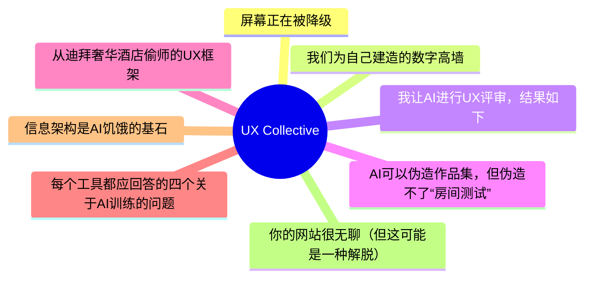
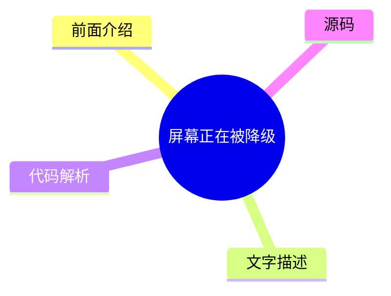
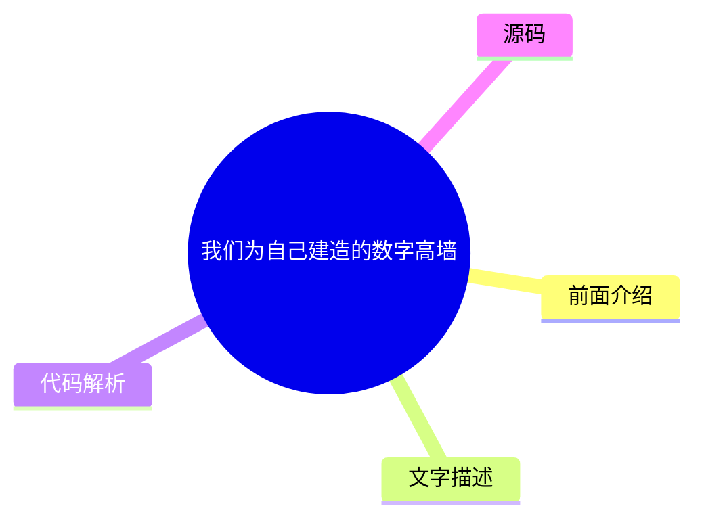
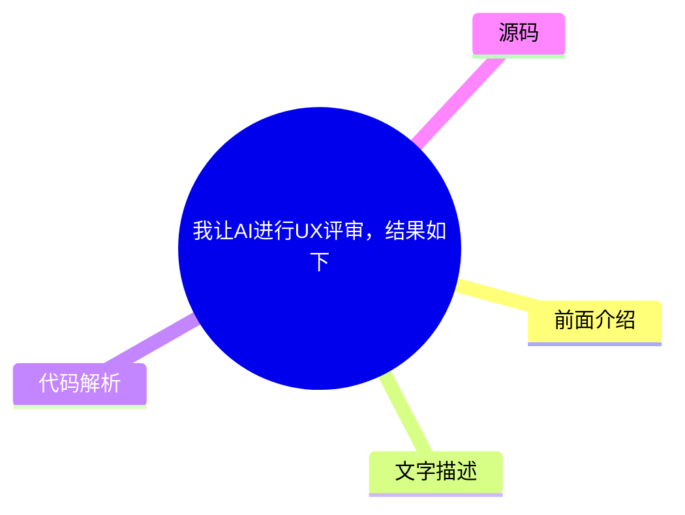
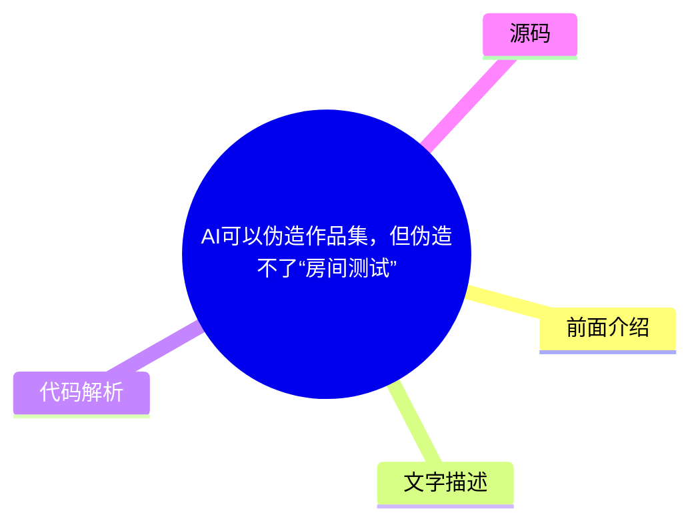
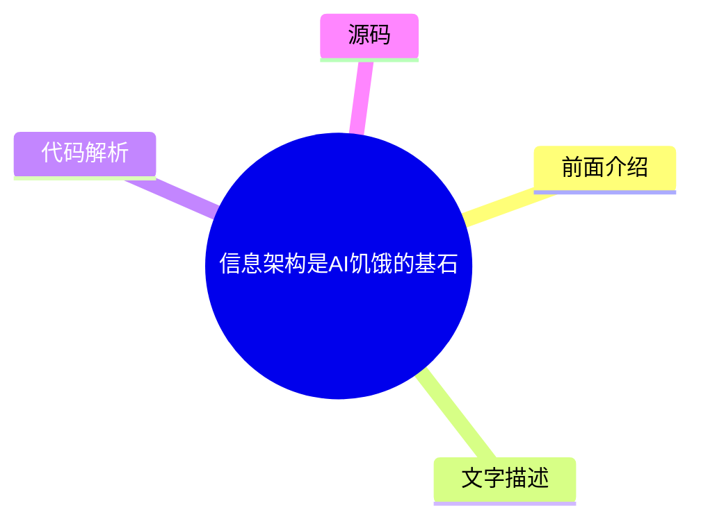
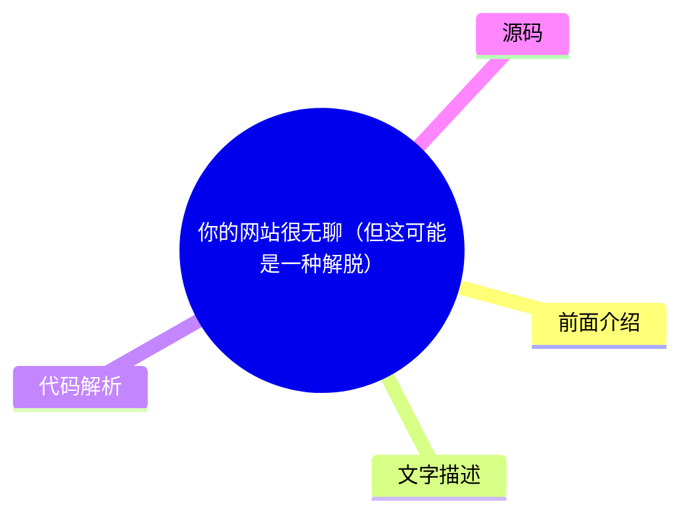

# ✏️ UX Collective Top 8 (2026-07-27)

## 前面介绍

- 数据源：UX Collective
- 抓取日期：2026-07-27
- 条目数：8
- 含完整正文：8
- 含代码片段：0
- 组织方式：前面介绍 / 树状图 / 文字描述 / 代码解析 / 源码

## 思维导图

## 详细整理（8 条，8 条含全文，0 条含代码）

### 1. 屏幕正在被降级
- **链接**: [https://uxdesign.cc/the-screens-are-getting-demoted-6b40120fcf04?source=rss----138adf9c44c---4](https://uxdesign.cc/the-screens-are-getting-demoted-6b40120fcf04?source=rss----138adf9c44c---4)
- **作者**: Serg Zorin
- **发布**: Wed, 22 Jul 2026 22:21:02 GMT

#### 前面介绍

- 随着AI产品的进步，界面不再是主要关注点，而是需要重新审视哪些屏幕是必要的，哪些可以作为备选。
- 用户不再需要手动点击操作，AI系统会自动完成寻找、识别、发送等步骤，界面间的鸿沟正在迅速缩小。
- 设计师的工作重心从“如何设计这些屏幕”转变为“这些屏幕是否应该存在”

#### 树状图

#### 文字描述

- 过去，UX设计很大程度上是关于屏幕的：在Figma中构建流程、映射状态、编写规范、处理交接等。
- AI正在改变这一现状，它通过自然语言指令（如“把上周的照片发给Mark”）直接完成任务，省去了繁琐的点击步骤。
- 对于复杂系统，许多屏幕的存在仅仅是因为软件无法自动理解用户意图，例如配置页面的40个字段。
- AI的出现使得设计师可以质疑屏幕存在的必要性，从而专注于更核心的设计决策。
- 用户习惯正在改变，他们不再询问“哪个屏幕打开这个功能”，而是问“有没有Claude技能能做这个”。

#### 代码解析

- 本文未提供源码，以下为实现思路或结构解析
- 核心逻辑是将用户的自然语言意图转化为系统操作序列，自动处理中间步骤（如文件查找、上下文识别、消息撰写）。
- 系统架构需要从“基于屏幕的交互”转变为“基于意图的执行”，减少用户在应用间跳转的摩擦成本。

#### 源码

#### 中文节选

# The screens are getting demoted

## As AI products become more advanced, the interface is no longer the main focus. Now, the real question is which screens are still needed and which can serve as fallbacks.

Designers often say that UX isn’t really about screens. It’s a line I see in portfolios, I hear in interviews; that’s the line we use to signal that we’re thinking beyond just pixels. But honestly, for most of my career, that wasn’t true. In one way or another, the job was screens: building flows in Figma, mapping out states, writing specs, worrying about happy paths and edge cases, and handling handoff. We kept saying UX isn’t about screens, even as we kept making more of them.

**Well, AI is about to call the bluff.**

Here’s a simple example. Let’s say you took a selfie with your friend Mark last week, and now you want to send it to him.

Open the mail app. Tap compose. Type the name. Hit Attach, and you’ve left the mail app entirely. You’re in the file/photo picker now, a separate product with its own rules. Dig around. Recents. Last week. There. Tap. Back to compose. Check the attachment. Send.

Compose, attach, browse, select, confirm, send. That’s six small steps just to move one photo, and each one was extra work around the real goal, not the goal itself.

Now, you just say or type: *send Mark the photo of us at the game from last week.* That’s it.

The same happened to reading design articles. You don’t need to read it all to decide whether it’s good. Paste it into Claude, ChatGPT, or whichever AI tool you use and ask whether it’s worth reading. Hopefully it will say: “Yes, this article is the best article about the impact of AI on UX.” Though I still encourage you to read it and make your own judgment.

What matters here is how the work has changed. Now, the system finds the photo, figures out who Mark is, attaches it, writes a reasonable message, and sends it. All those old steps still happen, but you’re no longer the one clicking through them.

A lot of UI lies in the gap between what you want and what the system forces you to do by hand. That gap is closing fast.

## This was most of the job

I work at Meta in the AI space and design products where complexity is real, and so is the learning curve. If I’m being very honest about where my hours went, a lot of them went into screens that only existed because the software couldn’t act on what someone wanted.

For example, the config page was there because the system couldn’t guess the right setting, so we ended up with forty fields. Nobody ever woke up excited to fill out forty fields. We tried to make it better with onboarding wizards, but in the end, it was still forty fields.

The setup wizard was needed because the system couldn’t figure out what you needed, so we guided you through it one question at a time.

The dashboard was there because we couldn’t be sure what really mattered to users, so we put twenty metrics on one screen, added tables for people to check themselves, a

#### 完整正文（中文）

# 屏幕正在被降级

## 随着人工智能产品变得越来越先进，界面已不再是主要关注点。现在，真正的问题是哪些屏幕仍然需要，哪些可以作为备选方案。

设计师常说，UX 并不真正关乎屏幕。这是我在作品集中看到的一句话，也是我在面试中听到的一句话；这是我们用来表明自己不仅仅是在思考像素的界线。但老实说，在我职业生涯的大部分时间里，这并不属实。以某种方式来说，工作对象就是屏幕：在 Figma 中构建流程，规划状态，编写规范，担心正常路径和边缘情况，以及处理交接。我们一边不断制作更多的屏幕，一边继续说 UX 不关乎屏幕。

**好吧，AI 即将揭穿这一谎言。**

举个简单的例子。假设你上周和朋友 Mark 合影，现在你想把它发给他。

打开邮件应用。点击撰写。输入名字。点击附件，你就完全离开了邮件应用。你现在处于文件/照片选择器中，这是一个拥有自己规则的产品。翻找。最近。上周。找到了。点击。回到撰写。检查附件。发送。

撰写、附件、浏览、选择、确认、发送。仅仅为了移动一张照片就要经过这六个小步骤，而且每一步都是围绕真正目标的额外工作，而不是目标本身。

现在，你只需要说或输入：*把上周我们在比赛时的照片发给 Mark。* 就这样。

阅读设计文章的情况也是如此。你不需要读完所有内容就能决定它是否值得读。把它粘贴到 Claude、ChatGPT 或你使用的任何 AI 工具中，询问它是否值得一读。希望它会回答：“是的，这篇文章是关于 AI 对 UX 影响的最佳文章。” 尽管我仍然鼓励你去阅读并做出自己的判断。

这里重要的是工作方式发生了变化。现在，系统会找到照片，弄清楚 Mark 是谁，附加它，撰写一条合理的消息，并发送。所有那些旧步骤仍然会发生，但你不再是那个点击完成它们的人。

很多 UI 都存在于你想要的和系统强迫你手动做的事情之间的差距中。这个差距正在迅速缩小。

## 这曾是大部分工作

I work at Meta in the AI space and design products where complexity is real, and so is the learning curve. If I’m being very honest about where my hours went, a lot of them went into screens that only existed because the software couldn’t act on what someone wanted.

For example, the config page was there because the system couldn’t guess the right setting, so we ended up with forty fields. Nobody ever woke up excited to fill out forty fields. We tried to make it better with onboarding wizards, but in the end, it was still forty fields.

The setup wizard was needed because the system couldn’t figure out what you needed, so we guided you through it one question at a time.

The dashboard was there because we couldn’t be sure what really mattered to users, so we put twenty metrics on one screen, added tables for people to check themselves, and hoped you’d find the one that mattered. A lot of dashboards are just us admitting, “We’re not sure what’s wrong either. Maybe you can tell us.”

But none of that was the real goal. People using serious products didn’t want the screens. They wanted the results hidden inside them. We built screens because it was the only way to deliver those results, and for a long time, there really was no other option.

Now, there’s another way: AI. This changes what most designers do. The question shifts from “How well can you design these screens?” to “Should these screens exist at all?”

This idea isn’t even new. About ten years ago, Golden Krishna wrote [ The Best Interface Is No Interface](https://www.nointerface.com), saying that designers often reach for a screen by habit when the better answer is sometimes no screen at all. He was right, just a bit early, because the technology wasn’t there yet. Now it is.

Jessa Parette argued something similar in “[AI just called design’s bluff](/ai-just-called-designs-bluff-2b94bf2f5cae)”: that a decade of design work was interface production, and AI has taken the cover off. My question is which screens are left standing.

## Why complex systems feel it first

I see this most clearly in complex tools, because that’s where I spend my time.

人们常说高级用户喜欢复杂的界面。实际上，他们只是忍受了这些界面，并且记住了你们的产品，是因为结果值得付出这些努力，而不是因为流程很棒。这些用户已经知道自己想要什么以及结果应该是什么样。中间的一切都只是额外的工作：导航、配置、点击五个标签页才能完成一件事。这在很长一段时间内是必要的，但它仍然是额外的工作。

但现在，用户习惯已经改变了。几年前，当我们进行演示时，遇到困难的用户总是会问：“我该打开哪个屏幕？”而如今，会有人打断并问：“有没有一个 Claude 技能可以做到这一点？”起初，这听起来很奇怪。当你听到十次后，它开始感觉正常了。

人们不再问去哪里找屏幕了。相反，他们想知道是否有一个技能或代理，能够获取他们的意图并给出结果，而无需使用 UI。

越来越多的答案是肯定的。

而且事情进展迅速。我不能在这里分享内部数据，但我所看到的情况很容易描述。一年前，人们希望我们改进某个页面或添加一个功能。现在，他们问的是能否拥有一个代理流程，而不是一个页面。显然，这种用户行为的变化对我们的路线图和我们的设计师工作产生了巨大影响。

在允许提及的地方，你可以看到这种转变。微软可能比任何其他公司都发送了更多的表单，它将员工用来注册新设备的内部表单[重构为一个对话式代理](https://www.microsoft.com/insidetrack/blog/simplifying-device-registration-at-microsoft-with-an-agentic-ai-assistant/)。他们的目标是将一个六步流程变成“只需一两个操作”。他们让旧表单与之并行运行，微软表示，随着人们转向代理，表单的使用率已经在下降。微软没有让表单变得更整洁，而是质疑它是否需要是一个表单。

这种趋势无处不在。Box 首席执行官 Aaron Levie 认为，智能体将成为“所有软件的主要用户”，公司拥有的智能体数量将是人类的百倍。Gartner 预计，今年将有约 40% 的企业应用将发布任务专用智能体，较一年前的不到 5% 有所上升，并将其描述为从以键盘和界面为中心的工作模式开始转变的标志。你无法指责 Nielsen Norman Group 追逐炒作，他们在 2026 年的报告中公开谈到了这一点：人们花在与 UI 交互上的时间越来越少，花在将工作交给其上层的层的时间越来越多。

“位于其上层的层”是另一种说法，意味着我们的屏幕正在悄无声息地被降级。

## 幸存的屏幕

这里有两种简单但无益的反应。一种是恐慌并说 AI 正在扼杀设计。另一种是相信没有什么真正改变，我们的角色只是转向产品策略，使设计师比以往任何时候都更有价值。我不完全同意这两种观点。

事实是，屏幕更多时候是被降级，而不是被删除。它们从主要角色转变为辅助角色，真正的问题是哪些屏幕保留，哪些屏幕消失。

Don Norman 在四十年前就为我们提供了这方面的词汇，即他的“两个鸿沟”：执行鸿沟，即你想要的与系统允许你做的之间的距离；以及评估鸿沟，即系统显示的与你所能理解的之间的距离。智能体正在加速缩小第一个鸿沟，这是我职业生涯中见过的最快的情况。第二个鸿沟仍然完全属于我们，并且随着越来越多的操作在视线之外发生，它正在悄悄变宽。

执行屏幕是那些被降级的屏幕。曾经发生工作的屏幕变成了不可逆操作前的确认步骤，或者是当代理不确定时的备选方案。它们变成了审计日志、事后检查的报告，或者是你去查看系统为你做了什么的场所。所有这些仍然是真实的设计工作，其中一些甚至比以前更难，但现在的主要焦点在于用户的意图。

意义构建屏幕则完全是另一回事。几年前，我读了一篇非常棒的 [Amelia Wattenberger 关于反对聊天机器人的文章](https://wattenberger.com/thoughts/boo-chatbots/)，她是 GitHub 研究实验室的一位设计工程师，负责 AI 界面的原型设计。她的观点让我印象深刻：好的工具“会清楚地说明它们应该如何使用”，而一个空的文本框对它能做什么一无所知，在询问 AI 和检查其工作之间来回切换会扼杀任何流程。她是对的，至少对于那些工作是思考而不是执行的任务屏幕而言。正如我之前承认的，一些仪表盘是我们耸耸肩（表示无奈）的产物。但在故障期间打开的那个仪表盘，试图弄清楚刚才出了什么问题，它的工作性质是不同的，代理最终会坐在它旁边，而不是取代它。

## 在您的收件箱中获取 Serg Zorin 的故事

免费加入 Medium 以获取该作者的更新。

Heenesh Patel 在“The last interface”中提出了类似的观点，将其描述为“零层 UI”：代理用作基础的一组基本核心界面。我会按功能而不是功能深度来区分它们。剩余的屏幕负责判断、监督和恢复，这就是第二个鸿沟所在的地方。

还有一个需要注意的地方，即使在我们正在愉快替换的执行界面中也适用。当人们不再亲自执行步骤时，他们往往会停止构建对系统运作方式的心理模型。这通常没问题，直到出现问题。一个智能体流程可以替换十个界面，但它会悄无声息地移除用户对底层发生情况的了解。当它出错或卡住时，用户只能试图从他们从未真正学过的系统中恢复过来。统计移除的界面或用户点击次数是一种衡量进度的懒惰方式。我更愿意问的是，某人是否在拥有足够的理解和控制力来支撑结果的情况下，达成了正确的结果。

在消费者设计师找我之前先说明一点：这主要针对复杂系统，至少目前是这样。消费产品也会改变，但会更慢，以它们自己的方式。没有人会为了好玩而浏览调试工具，但滚动是 Instagram 乐趣的一半，所以它不会很快变成命令行。不过，即便在那里，人们也更关心结果而不是导航。

## 新的设计评审

这部分内容可以在你下次评审或头脑风暴时使用。

多年来，我们的评审问题都集中在流程上。路径清晰吗？CTA（行动号召）容易看到吗？需要多少次点击？任务完成率是多少？这些都是好问题，但它们都假设流程应该首先存在。

现在，新问题更高一个层次，它们关注系统采取行动的那一刻。

**在运行任何内容之前：**

- 系统能否推断出这一点而不是询问？
- 这能否是一个命令、一项技能、一个 API 或自动化，而不是一个界面？
- 哪些需要用户的“是”，系统在执行前应该展示哪些假设？

**在运行过程中：**

- 应该保持可见的上下文是什么，系统应该在何时暂停询问？
- 用户可以在不停止 ...（截断，原文 16071+ 字符）

### 2. 我们为自己建造的数字高墙
- **链接**: [https://uxdesign.cc/the-digital-wall-we-built-ourselves-e9578f774374?source=rss----138adf9c44c---4](https://uxdesign.cc/the-digital-wall-we-built-ourselves-e9578f774374?source=rss----138adf9c44c---4)
- **作者**: Zeeshan Khalid
- **发布**: Wed, 22 Jul 2026 11:17:21 GMT

#### 前面介绍

- 全球排名前百万的网站中，有95.9%未能通过残障人士的访问测试。
- 无障碍障碍并非偶然，而是设计者有意或无意地系统性构建的结果。
- 许多网站对视障用户来说如同迷宫，迫使他们放弃独立操作，转而寻求他人帮助。

#### 树状图

#### 文字描述

- 作者回忆起朋友因无法使用屏幕阅读器而被迫放弃订票的经历，这种“只是更简单”的无奈令人心碎。
- WebAIM组织每年对全球百万个网站首页进行自动化无障碍测试，结果令人震惊。
- 许多网站充斥着“点击这里”的通用按钮、缺乏alt属性的图片以及难以理解的代码结构。
- 这种数字高墙不仅阻碍了残障人士，也反映了设计者在构建数字产品时的疏忽与傲慢。
- 真正的无障碍设计需要超越自动化测试，关注用户的真实体验和情感需求。

#### 代码解析

- 本文未提供源码，以下为实现思路或结构解析
- 无障碍实现的核心在于语义化HTML标签的使用，确保屏幕阅读器能准确解析页面结构。
- 图片必须包含alt属性描述，按钮和链接应有明确的文本标签，避免使用纯图片作为交互元素。
- 色彩对比度需符合WCAG标准，确保色盲用户也能清晰区分内容。

#### 源码

#### 中文节选

Member-only story

# The digital wall we built ourselves

## Why 95.9% of the world’s top million sites still fail the people who need them most.

I remember the first time I truly understood what it meant to be locked out of a website.

A quiet Tuesday afternoon, watching a friend with a visual impairment try to book a train ticket. He tabbed through the page, screen reader rattling off incomprehensible strings of code, button after button labelled “click here”, images announcing themselves as “image.jpg”. After fifteen minutes of frustration, he closed the laptop and asked me to do it for him.

*“It’s just easier this way,”* he said.

That sentence has haunted me ever since. Not because it was dramatic — but because it was so terribly, achingly *ordinary*.

Because here’s the thing we don’t want to admit: the web isn’t broken by accident. We broke it. Deliberately, systematically, and with increasing enthusiasm.

## The shocking numbers

Every year, [WebAIM](https://webaim.org/) — the organisation behind the WAVE accessibility evaluation tool — analyses the home pages of the top one million websites on the planet. They do this using automated testing against the Web Content Accessibility Guidelines (WCAG) 2.2 Level A and AA success criteria. It is, quite…

#### 完整正文（中文）

Member-only story

# The digital wall we built ourselves

## Why 95.9% of the world’s top million sites still fail the people who need them most.

I remember the first time I truly understood what it meant to be locked out of a website.

A quiet Tuesday afternoon, watching a friend with a visual impairment try to book a train ticket. He tabbed through the page, screen reader rattling off incomprehensible strings of code, button after button labelled “click here”, images announcing themselves as “image.jpg”. After fifteen minutes of frustration, he closed the laptop and asked me to do it for him.

*“It’s just easier this way,”* he said.

That sentence has haunted me ever since. Not because it was dramatic — but because it was so terribly, achingly *ordinary*.

Because here’s the thing we don’t want to admit: the web isn’t broken by accident. We broke it. Deliberately, systematically, and with increasing enthusiasm.

## The shocking numbers

Every year, [WebAIM](https://webaim.org/) — the organisation behind the WAVE accessibility evaluation tool — analyses the home pages of the top one million websites on the planet. They do this using automated testing against the Web Content Accessibility Guidelines (WCAG) 2.2 Level A and AA success criteria. It is, quite…

### 3. 我让AI进行UX评审，结果如下
- **链接**: [https://uxdesign.cc/i-handed-a-ux-review-over-to-ai-heres-what-happened-0511e73e4ffe?source=rss----138adf9c44c---4](https://uxdesign.cc/i-handed-a-ux-review-over-to-ai-heres-what-happened-0511e73e4ffe?source=rss----138adf9c44c---4)
- **作者**: Kolozsi István (kolboid)
- **发布**: Tue, 21 Jul 2026 21:36:57 GMT

#### 前面介绍

- AI是强大的UX评审伙伴，而非人类专家的替代品，其准确性取决于输入的专家知识。
- 通过结构化的多步骤工作流，AI能提供有价值的观察，但在判断语境和严重性方面仍有局限。
- AI与人类专家协作，可以显著提高工作效率，但无法完全取代人类的判断力。

#### 树状图

#### 文字描述

- 作者使用Claude和ChatGPT对门户的搜索、结果和产品详情页进行了UX专家评审。
- AI模型生成的分析中包含大量无关或虚假的问题，虽然也有有用的观察，但多停留在措辞和结构层面。
- Claude在准确性和文档生成上表现优于ChatGPT，但两者都无法像人类专家那样深入理解业务语境。
- 作者发现AI无法捕捉到人类专家能识别的细微问题，且容易产生“幻觉”。
- 最终，作者将AI作为辅助工具，通过人工筛选和润色来整合评审结果，效率提升了约15%。

#### 代码解析

- 本文未提供源码，以下为实现思路或结构解析
- AI评审流程应包含明确的输入数据结构，如GA数据、热力图、用户研究文档等。
- 提示词设计需遵循结构化工作流，将大任务拆解为子任务，并要求AI引用具体数据支持结论。
- 输出结果应经过人工审核，重点检查AI是否正确理解了业务目标和用户场景。

#### 源码

#### 中文节选

# 我把 UX 审查交给了 AI。结果如下。

## AI 是 UX 审查的强大伙伴，并非专家的替代品，其准确性源于你输入的专业知识，而非模型本身。

我接到一个本身并不复杂的任务：我需要为某个门户的搜索、结果和产品详情页面撰写一份 UX 专家审查报告。我有一套关于目标受众、目标和独特卖点（USP）的问题，一份行业研究文档，以及访问 Google Analytics 和 Clarity 的权限。

我最初的假设（你在各处读到的越来越多）是，AI 在这类事情上已经足够好了。你几乎不需要怎么跟它打交道；设计师只需要检查结果，而在这类话题上，它基本上取代了人类。既然恰好碰到了这样的任务，我想验证一下这是否真的成立。

## 测试

我并行使用了两个模型：**Claude Fable 5** 和 **ChatGPT-5.6 Sol**，当然，两者都使用的是付费订阅。我给它们提供了我所有的输入内容：简报、问答、研究材料、GA 导出数据、Clarity 热力图、注意力地图和滚动地图，以及必要的 URL。任务定义得很精确：生成一份 UX 专家审查文档，并设定了具体目标。

重要的是，我没有使用单一的提示词。我以结构化、多步骤的方式拆解了任务，并要求模型在可能的情况下用 GA 和 Clarity 数据来支持其发现，而不仅仅是假设。换句话说，我不是在测试“把所有内容扔进一个提示词”的方法，而是在测试刻意的工作流程能产出什么。

当然，我也在并行进行人工分析（像动物一样），以便有东西可以对比。

## 我的发现

让我先说清楚。这是一份体验报告，并非受控实验。一个项目，一位专家（我自己），而且我自己的分析也不是绝对的标准。请带着这个前提阅读以下内容。

这两个模型都进行了分析，但其中充满了不相关甚至根本不存在的问题。也有一些有用的观察，但即便如此，我也只能在措辞和结构层面上真正利用它们。Claude 在措辞和结构方面明显比 ChatGPT 更准确，尽管这只是我的主观印象，并非经过控制的测量。有一个区别是客观存在的，即 Claude 可以在一个文档中生成结果，而 ChatGPT 只能部分完成，但这更多是关于输出格式的问题，而非分析质量。

我承认：有一些问题我自己没有发现，这很有用。但 AI 反而漏掉的问题更多。

这与一项 2025 年测试 GPT-4o 与 Nielsen 可用性启发式原则的研究结果非常吻合：

“GPT-4o 找到了专家识别出的可用性问题的大约五分之一（21%），同时也提出了几个新的、部分虚假的问题。所以这是一个……

#### 完整正文（中文）

# 我把 UX 审查交给了 AI。结果如下。

## AI 是 UX 审查的强大伙伴，并非专家的替代品，其准确性源于你输入的专业知识，而非模型本身。

我接到一个本身并不复杂的任务：我需要为某个门户的搜索、结果和产品详情页面撰写一份 UX 专家审查报告。我有一套关于目标受众、目标和独特卖点（USP）的问题，一份行业研究文档，以及访问 Google Analytics 和 Clarity 的权限。

我最初的假设（你在各处读到的越来越多）是，AI 在这类事情上已经足够好了。你几乎不需要怎么跟它打交道；设计师只需要检查结果，而在这类话题上，它基本上取代了人类。既然恰好碰到了这样的任务，我想验证一下这是否真的成立。

## 测试

我并行使用了两个模型：**Claude Fable 5** 和 **ChatGPT-5.6 Sol**，当然，两者都使用的是付费订阅。我给它们提供了我所有的输入内容：简报、问答、研究材料、GA 导出数据、Clarity 热力图、注意力地图和滚动地图，以及必要的 URL。任务定义得很精确：生成一份 UX 专家审查文档，并设定了具体目标。

重要的是，我没有使用单一的提示词。我以结构化、多步骤的方式拆解了任务，并要求模型在可能的情况下用 GA 和 Clarity 数据来支持其发现，而不仅仅是假设。换句话说，我不是在测试“把所有内容扔进一个提示词”的方法，而是在测试刻意的工作流程能产出什么。

当然，我也在并行进行人工分析（像动物一样），以便有东西可以对比。

## 我的发现

让我先说清楚。这是一份体验报告，并非受控实验。一个项目，一位专家（我自己），而且我自己的分析也不是绝对的标准。请带着这个前提阅读以下内容。

这两个模型都进行了分析，但其中充满了无关甚至根本不存在的问题。也有一些有用的观察，但即便那些我也只能在措辞和结构层面真正使用。Claude 在措辞和结构上明显比 ChatGPT 更准确，尽管这只是我的主观印象，并非受控测量。有一个区别是客观的，即 Claude 可以在一个文档中生成结果，而 ChatGPT 只能部分完成，但这更多是关于输出格式的问题，而非分析质量。

我承认：有一些我自己没发现的问题，这很有用。但 AI 反而漏掉的问题更多。

这与一项测试 GPT-4o 与 Nielsen 可用性启发式原则的 2025 年研究非常吻合：

“GPT-4o 找到了专家识别出的可用性问题的约五分之一（21%），同时也提出了几个新的、部分虚假的问题。因此，它是一个优秀的初步 UX 审查工具，但单独使用时还无法替代专家评估。”[Can GPT-4o Evaluate Usability Like Human Experts? (2025)](https://arxiv.org/abs/2506.16345)

在一个比这些 Nielsen 风格的可用性启发式原则稍微复杂的项目中，我发现的情况基本相同。

## 材料最终是如何整合在一起的

最后，我结合 Claude 进行了分析。我提供了自己的观察，并在持续的对话中共同确定了删减和添加的内容。它审查了文本的语法、一致性和类似方面，并提出了修改建议。那部分非常有用。

我没有精确测量时间，但凭感觉：如果我自己做所有事情，总体上大约需要多花 15% 的时间。

所以 AI 是一个很棒的伙伴和助手，让我能够加快并完善我的工作，但目前它还不能取代我。它仍然是一个强有力的伙伴，我们在一起比以往任何时候都更好。

你可能会问，浏览器交互式测试是否会是更好的选择。如今，确实有各种方法和工具可以让模型在浏览器中实时浏览网站，而不仅仅是基于静态数据和 URL 工作。由于我没有实际运行过，我不敢确定，但我强烈怀疑这也不会带来更好的结果，因为核心限制不在于访问能力，而在于判断力，即理解上下文和目标，权衡严重程度，区分真实问题与噪音。实时浏览对此改变甚微。

我接下来实际尝试的方法则不同。我将为此任务构建自己的代理技能，该技能将编码既定的可用性启发式规则、由专业经验塑造的严重程度权重，以及 UX 从业者对界面所具备的专家视角，然后逐个项目进行优化。目的不是为了让它代替我做出决定，而是将我自己的专家判断转化为可复用、一致的形式。这就是我下次要探讨的内容。

这与你在该主题研究中的发现不谋而合：[Baymard 的 95% 准确率 AI 启发式评估](https://baymard.com/blog/ai-heuristic-evaluations) 并非通过更好的提示词实现，而是通过将模型建立在他们自己研究的 UX 知识库之上。诚然，在他们的案例中，这仅限于可用性启发式规则，这比像这样复杂且依赖上下文的审查要简单得多，但原理是相同的。准确性并非来自模型，而是来自你输入其中的专家框架。这正是值得将你自己的标准编码为技能的原因。

## 从长远来看？

我很清楚，AI 迟早会取代我们的工作，这一点基本没有疑问。唯一的问题是它何时会发生。

我读到有迹象表明出现了一种放缓，甚至停滞。根据一篇[2024年底的路透社文章](https://www.reuters.com/technology/artificial-intelligence/openai-rivals-seek-new-path-smarter-ai-current-methods-hit-limitations-2024-11-11/)，包括 Ilya Sutskever 在内的几位顶尖 AI 研究人员表示，单纯扩大模型预训练规模已经触及了极限。进一步的进展越来越多地来自于新方法，例如“o1”风格的逐步推理模型，而不是单纯靠规模。换句话说，开发并没有停止，但重心正从规模转向更智能的方法。

当然，后台还有各种其他的发展和研究在进行，所以毫无疑问，从长远来看，AI 将全面占据优势。

我最近偶然发现一个页面，建议我们还有几年好光景，特别是在研究和复杂设计领域，我们在各个地方使用各种 AI 模型来加速、完善并支持工作。

顺便说一句，我会根据具体用途在模型之间切换，所以别忘了，每个 LLM 都有其擅长的领域。[查看这个 2026 年 LLM 指南针](https://work2flow.ai/llm-compass/)！

**那么你明天该做什么？**

**开始：** 将 AI 作为第一轮合作伙伴，输入你的真实数据，分步工作，并将你自己的启发式规则和严重程度编码成可重用的提示词或技能。

**停止：** 直接发布其输出，指望一个提示词就能替代整个工作流程，并将判断权拱手相让。严重程度、优先级和业务背景必须由你掌握。

**停止：** 担心它明天会抢走你的工作。它不会，但学会驾驭它的设计师将跑赢那些不会驾驭的人。

### 4. AI可以伪造作品集，但伪造不了“房间测试”
- **链接**: [https://uxdesign.cc/ai-can-fake-your-portfolio-it-cant-fake-the-second-question-c89f96626f1c?source=rss----138adf9c44c---4](https://uxdesign.cc/ai-can-fake-your-portfolio-it-cant-fake-the-second-question-c89f96626f1c?source=rss----138adf9c44c---4)
- **作者**: Vlad Derdeicea
- **发布**: Tue, 21 Jul 2026 21:36:22 GMT

#### 前面介绍

- 作品集等静态展示物正变得廉价，面试中真正的决胜点在于“房间测试”这一现场互动环节。
- “房间测试”考察的是设计师在压力下，将个人判断转化为语言并传达给陌生人的能力。
- AI无法模拟这种即兴的、基于语境的深度对话，这是人类设计师的核心竞争力。

#### 树状图

#### 文字描述

- 作者回忆起多年前因无法回答面试官关于“设计思维”的问题而错失工作的经历。
- 真正的挑战不在于知识储备，而在于在无准备的情况下，向陌生人清晰阐述自己的设计决策。
- 面试官通过追问“为什么选择这个顺序”或“差点上线的是什么”来测试候选人的真实判断力。
- AI可以快速生成精美的作品集和案例研究，但无法模拟面对面的压力测试。
- 未来的招聘将更依赖于这种无法被AI伪造的实时互动，作品集的价值将回归到持续的创作过程。

#### 代码解析

- 本文未提供源码，以下为实现思路或结构解析
- 面试评估应从“验证作品”转向“验证思维过程”，通过追问挖掘候选人的决策依据。
- 设计思维不仅是方法论，更是面对复杂问题时进行权衡和取舍的能力。
- 面试官需要设计开放性问题，避免候选人依赖预设的答案或模板。

#### 源码

#### 中文节选

# AI 可以伪造你的作品集。它无法伪造第二个问题。

## 交付物刚刚变成了招聘中最便宜的东西。“房间测试”是你无法生成的现场跟进，也是 2026 年面试真正决定胜负的地方。

七八年前，我进入了一家大型跨国公司的最后一轮面试。四个面试环节，也许五个。作品集审查、案例研究、团队面谈，全套流程。我通过了每一个环节。最后一步是与设计副总裁的对话，流程中的每个人都认为这是最简单的一轮。握手环节。

她问我设计思维是如何改变我的工作方式的。

这个标签让我措手不及。当时设计思维刚刚成为一个独立的术语，一个带有大写 D 的东西，人们把它放在幻灯片和证书上。我每天都在实践它：在接触解决方案之前界定问题，在真实用户身上测试假设，公开迭代。但在我的工作场所，没人叫它设计思维。我们称之为解决问题。所以我真诚地问她，你所说的设计思维是什么意思？**房间里一片寂静。**

她简要而礼貌地解释了她的意思。当她说话时，我看着她在实时中做出决定。在我再说一个字之前，我就能看到她眼中正在形成裁决。我花了剩下的面试时间来证明我做了这个术语描述的一切，证明我在没有这个标签的情况下已经做了多年。但这并不重要。在我提出问题之后，每一个回答都通向一扇已经关闭的门。

多年来，我把这个故事归咎于运气不好。错误的词汇，错误的时间，错误的副总裁。直到我坐在桌子对面，作为经理每周主持这些对话，才明白到底发生了什么。我没有在知识测试中失败。工作是真实的，背后的实践也是真实的。我失败了别的东西：**那个现场、未准备好的时刻，即你在压力下，没有任何交付物可以依靠，向陌生人翻译你自己的判断。**

我把那个时刻称为 **“房间测试”**。我认为它即将成为整个面试。

## 我现在主持的房间

Not long ago I sat on the other side of that silence. I have blurred the details; the two questions are not.

The strongest case study I had seen in months. A banking onboarding flow, which I can judge closely because I run one. Clean problem framing, research artifacts, a decision log, before and after numbers. The candidate presented it fluently. If the interview had ended at the presentation, we would have been talking about an offer.

Then a colleague asked the first question: you sequenced identity verification before showing the user any value, most teams do the opposite, what made you choose that order? A pause. The candidate walked us through the screen we were already looking at, again.

I asked the second question: what almost shipped instead? **Nothing came back. Not a weak answer. No answer. There was no other version.** There was no alm

#### 完整正文（中文）

# AI 可以伪造你的作品集。它无法伪造第二个问题。

## 交付物刚刚变成了招聘中最便宜的东西。“房间测试”是你无法生成的现场跟进，也是 2026 年面试真正决定胜负的地方。

七八年前，我进入了一家大型跨国公司的最后一轮面试。四个面试环节，也许五个。作品集审查、案例研究、团队面谈，全套流程。我通过了每一个环节。最后一步是与设计副总裁的对话，流程中的每个人都认为这是最简单的一轮。握手环节。

她问我设计思维是如何改变我的工作方式的。

这个标签让我措手不及。当时设计思维刚刚成为一个独立的术语，一个带有大写 D 的东西，人们把它放在幻灯片和证书上。我每天都在实践它：在接触解决方案之前界定问题，在真实用户身上测试假设，公开迭代。但在我的工作场所，没人叫它设计思维。我们称之为解决问题。所以我真诚地问她，你所说的设计思维是什么意思？**房间里一片寂静。**

她简要而礼貌地解释了她的意思。当她说话时，我看着她在实时中做出决定。在我再说一个字之前，我就能看到她眼中正在形成裁决。我花了剩下的面试时间来证明我做了这个术语描述的一切，证明我在没有这个标签的情况下已经做了多年。但这并不重要。在我提出问题之后，每一个回答都通向一扇已经关闭的门。

多年来，我把这个故事归咎于运气不好。错误的词汇，错误的时间，错误的副总裁。直到我坐在桌子对面，作为经理每周主持这些对话，才明白到底发生了什么。我没有在知识测试中失败。工作是真实的，背后的实践也是真实的。我失败了别的东西：**那个现场、未准备好的时刻，即你在压力下，没有任何交付物可以依靠，向陌生人翻译你自己的判断。**

我把那个时刻称为 **“房间测试”**。我认为它即将成为整个面试。

## 我现在主持的房间

Not long ago I sat on the other side of that silence. I have blurred the details; the two questions are not.

The strongest case study I had seen in months. A banking onboarding flow, which I can judge closely because I run one. Clean problem framing, research artifacts, a decision log, before and after numbers. The candidate presented it fluently. If the interview had ended at the presentation, we would have been talking about an offer.

Then a colleague asked the first question: you sequenced identity verification before showing the user any value, most teams do the opposite, what made you choose that order? A pause. The candidate walked us through the screen we were already looking at, again.

I asked the second question: what almost shipped instead? **Nothing came back. Not a weak answer. No answer. There was no other version.** There was no almost.

I want to be careful with this story, because it is not about catching anyone, and this article will not become one of those. I do not know how that case study was made, and I did not need to know. What the two questions established was narrower: the judgment we were hiring for was not in the room that day. Whether it existed somewhere else, in a different form, on a better afternoon, the room could not say. Rooms are not truth machines. They are pressure tests. Mine failed one years ago while carrying eight years of real practice.

But the two stories share one structure, mine and the candidate’s. The artifact survived and the conversation did not. And the reason this matters more now than it did in 2019 is simple: **the artifact used to be expensive to make, it is not anymore.**

## The inversion

For twenty years the design career ran on a quiet division of labor. The artifact carried the proof: the portfolio, the case study, the deck. The interview existed to verify the artifact, to confirm that the person in front of you made the thing behind them. Expensive object, cheap conversation.

AI inverted that economics in roughly two years. A polished case study, complete with research narrative, decision log, and before and after metrics, can now be assembled in an afternoon by someone who was never near the project. So can the deck. So can the take home exercise, which is why hiring managers are quietly abandoning it. The visual signal that used to mean I can produce work at this level now means I have a subscription.

, a product designer writing in Bootcamp, made the case this spring for walking away from the portfolio entirely: “**AI can fake a portfolio in an afternoon.**” His answer is a public catalogue of continuous work, writing, talks, shipped experiments, a body of evidence too long and too messy to counterfeit. It is a good answer, and it is also a decade of homework. Most designers do not have a decade.

What everyone has, whether they want it or not, is the conversation. The artifact is now the cheapest thing in the hiring pipeline, and the conversation is the expensive one. **The proof did not disappear, it moved.**

One thing you can do with that this week: **inventory your own proof.** List everything you would show someone to establish your level, then mark each item as artifact or live. If everything on the list can be attached to an email, the list is weaker than it was two years ago, through no fault of yours.

## Writers felt it first

Design is not the first craft to hit this wall. Writers got there a year earlier, because text was the first thing AI made free.

《每日草稿》的撰稿人写了一篇关于识别 AI 写作民俗的文章。文章的大部分内容都在拆解流行的迹象：标点理论、对明喻的怀疑，以及认为限定词就是招供的想法。然后他落脚在一个更有趣的地方：值得认真对待的破绽完全不在文本之外，而在作者身上。发布一些你几乎不理解的东西，最终会有人让你就某一点展开，或者挑战一个你从未核实过的统计数据，写作与作者之间的差距会在观众面前敞开，“而他们逐渐意识到你并不完全理解自己的论点。”

**将作者替换为设计师，文章替换为案例研究，现场活动替换为作品集评审。** 句子中其他内容无需更改。

设计招聘已经在向这个方向发展。运营设计和设计领导力招聘并撰写《Verified Insider》通讯的招聘人员在二月描述了这种转变：“现场进行中的作品可以胜过打磨过的作品集。”围绕几天前杂乱的 Figma 文件、未经验证的概念、从未辩护过的决策构建的面试。他报告说现在看到这些格式的情况要多得多，他对谁会感到吃力的判断很精准：当对话脱离脚本时，那些表达能力强于执行力的候选人。

现在，在论点沾沾自喜之前，诚实地提个警告。现场对话也不是无法伪造的。Shraddha Sunil 和 Mudit Saraf 在六月为《哈佛商业评论》撰稿，在采访了 **120 名人才招聘负责人并分析了超过 6,000 次筛选会议** 后发现，候选人可以在有实时 AI 助手的远程面试中表现出色：“**在面试中表现良好的能力正变得无限可扩展且几乎免费。**” 阅读时你应该记住的一个星号：*两位作者都共同创立了一家面试筛选公司，因此应将这一发现视为利益相关者提供的方向性证据，而非中立研究。*

但请注意实时辅助能承载什么，不能承载什么。它能承载第一个问题，即每个候选人都能预见到的问题。它难以应对第二个问题：脱离所有剧本的追问，那个询问“几乎”、权衡取舍、遗憾以及做出决定的具体周二的问题。回忆可以被委托给一个隐藏的窗口。亲历过的质感却不能。**这就是为什么房间是在第二个问题中决定的，而对此有用的回应不是对他人的偏执。**

这是在问，你对自己工作的辩护是否深入到了脚本层面。在下次面试前，主动提供杂乱的文件。向某人展示两周前未完成的工作。如果这个想法让你感到恐惧，这种恐惧就是信息。

## 房间实际衡量的内容

“手永远无法持续产出优于眼力所及的东西。”——

资历是两个独立的测量指标，而不是一个梯子。级别是你拥有的范围，由组织授予。阶段是你作为从业者的成熟度，通过一次次经历累积，重组无法赋予你或拿走它。

级别体现在产物中。看看某人拥有并交付了什么，你可以从交付物中读出他们的范围。但产物正是那些变得可生成的东西。阶段从未存在于产物中。阶段在实时中显现，在提问时，在艰难的问题和你第一句诚实回答之间的空间里。

房间测试就是将阶段轴可视化。**具体来说，房间在四个轴向上读取你。**

一个敌意的问题是被视为信息还是威胁。成熟的从业者将针对工作的攻击视为关于工作的数据。早期的人将其视为关于他们自己的数据，你可以在最初的几秒钟内看到这种区别。

你的模式在压力下是否能迁移。任何人都可以将他们的流程应用于他们准备的项目。房间要求你将其应用于你从未见过的变体，实时进行，这是证明模式是模式而非记忆的唯一条件。

**你能为自己六个月前做出的一个权衡辩护吗，包括你会做出不同选择的那部分？** 对于那些“几乎要发布”的东西，最好的回答绝不是“什么都没有”。它是一个具体的选择、一个具体的原因，通常还伴随着一点小小的遗憾。

无论你是否在房间里的其他人发现之前，就先意识到了自己工作的薄弱之处。招聘方从对面椅子上看到了同样的模式：那些在被问及之前就主动指出自己短板的候选人，看起来更可信。

注意那个列表中缺失了什么。打磨，现在是可以生成的。回忆，现在是可以委托的。还有自信，它一直都是可以表演出来的。自信表演可以在演示中存活下来。但在追问面前很少能存活，因为表演没有“几乎”。

这个列表还拒绝了一件事，我也故意拒绝它。**搞砸一场面试并不会让你成为骗子**。我搞砸过一次，当时我拥有近十年的真实实践经验，因为缺少一项特定的技能：用别人的术语，在对话速度下，将私人判断转化为公开辩护。旧的模式将这项技能视为表演，视为面试表现好，视为比真正的“工作”低一等。这种框架在事实上是错误的，而不仅仅是感觉错了。当判断是真实的时候，辩护就是工作的最后一段路程。

我自己的数据点也指向同一个方向，尽管它总是伴随着那些限制条件。我构建的评估系统使用场景问题而不是收集自我评分，这实际上使其成为一个私人房间：没有人看着你，但你无法通过模式匹配得到听起来像资深人士的回答。大约一百名设计师做过这个测试，这是一个很小且自我选择的样本，所以把这些当作仪器观察结果来读，而不是人口统计数据。当我重写题库，以便让范围信号和成熟度信号能够区分开来时，十分之四的档案偏离了对角线：他们的级别和阶段讲述的是不同的故事。**而开始测试的人中几乎有一半自称是资深人士，而评估结果却整整低了一个级别**，这是未匹配群体的比较，所以是一个形状，而不是判决。两个数字都支持的狭隘结论是：我们大多数人从未被测试过自己的自我评估，一个

由于输入内容过长（超过 17013 字符），系统无法一次性处理。请提供您希望翻译的具体文本片段或章节。

### 5. 从迪拜奢华酒店偷师的UX框架
- **链接**: [https://uxdesign.cc/steal-this-ux-framework-from-dubais-most-over-the-top-hotel-0b14f71e46e5?source=rss----138adf9c44c---4](https://uxdesign.cc/steal-this-ux-framework-from-dubais-most-over-the-top-hotel-0b14f71e46e5?source=rss----138adf9c44c---4)
- **作者**: Slava Polonski, PhD
- **发布**: Thu, 23 Jul 2026 21:48:28 GMT

#### 前面介绍

- 酒店服务提供了比移动应用更细腻的用户体验，值得设计师深入研究。
- 迪拜亚特兰蒂斯酒店的巧克力喷泉展示了如何通过物理设计细节解决用户痛点。
- 在服务设计中，隐形的设计往往比显性的界面更能提升用户体验。

#### 树状图

#### 文字描述

- 作者在迪拜亚特兰蒂斯酒店观察发现，巧克力喷泉周围从未有过溢出，这得益于精心设计的物理结构。
- 酒店通过隐藏管道、调整流速和优化周边布局，解决了传统喷泉容易弄脏地面的痛点。
- 这种设计体现了“隐形人”原则，即优秀的设计应当让用户感觉不到其存在，却能顺畅地完成任务。
- 酒店服务中的细节，如员工对客人习惯的预判、无障碍设施的融入，都是值得学习的UX案例。
- 设计师应跳出App的框架，从实体空间和服务流程中寻找灵感。

#### 代码解析

- 本文未提供源码，以下为实现思路或结构解析
- 物理设计中的流体力学和材料选择直接影响用户体验，需考虑摩擦力、重力和表面张力。
- 服务流程中的触点设计应无缝衔接，减少用户操作步骤，提升服务效率。
- 环境因素（如光线、噪音、温度）对用户感知的影响需纳入设计考量。

#### 源码

#### 中文节选

**仅限会员阅读**

**从迪拜最浮夸的酒店偷学这个 UX 框架**

## 巧克力喷泉旁的隐形人

如果你用过巧克力喷泉，你就懂其中的物理原理。巧克力很稀。它会滴落。手里拿着串棉花糖的孩子肯定会弄洒。到了晚上九点，喷泉周围的台面应该看起来像犯罪现场。

但这一个从未发生过。五条丝带同时流淌：开心果、覆盆子、牛奶、白巧克力和黑巧，整整一周，大理石台面都一尘不染。我花了三个晚上才弄明白原因，当我弄明白时，我意识到我一直在注视着整个度假村最好的用户体验设计作品。稍后我会回到这个观察上来。

我们来到 [亚特兰蒂斯棕榈岛](https://www.atlantis.com/dubai) 度了一周假，这是世界上最奢华的酒店之一。如果你没去过，简单提一下这个地方。它位于 [棕榈岛](https://en.wikipedia.org/wiki/Palm_Jumeirah) 外环的尖端，那是迪拜外海一个人工的棕榈形岛屿，从太空都能辨认出来。与其说它是一家酒店，不如说是一个小城市：它有自己的 [水上乐园](https://www.atlantis.com/dubai/aquaventure-waterpark)，有自己的 [水族馆](https://www.atlantis.com/dubai/marine-and-waterpark/the-lost-chambers-aquarium)，还有一条餐厅街，已悄然成为餐饮界的重量级选手。它所锚定的更广阔的亚特兰蒂斯迪拜度假村……

#### 完整正文（中文）

**仅限会员阅读**

**从迪拜最浮夸的酒店偷学这个 UX 框架**

## 巧克力喷泉旁的隐形人

如果你用过巧克力喷泉，你就懂其中的物理原理。巧克力很稀。它会滴落。手里拿着串棉花糖的孩子肯定会弄洒。到了晚上九点，喷泉周围的台面应该看起来像犯罪现场。

但这一个从未发生过。五条丝带同时流淌：开心果、覆盆子、牛奶、白巧克力和黑巧，整整一周，大理石台面都一尘不染。我花了三个晚上才弄明白原因，当我弄明白时，我意识到我一直在注视着整个度假村最好的用户体验设计作品。稍后我会回到这个观察上来。

我们来到 [亚特兰蒂斯棕榈岛](https://www.atlantis.com/dubai) 度了一周假，这是世界上最奢华的酒店之一。如果你没去过，简单提一下这个地方。它位于 [棕榈岛](https://en.wikipedia.org/wiki/Palm_Jumeirah) 外环的尖端，那是迪拜外海一个人工的棕榈形岛屿，从太空都能辨认出来。与其说它是一家酒店，不如说是一个小城市：它有自己的 [水上乐园](https://www.atlantis.com/dubai/aquaventure-waterpark)，有自己的 [水族馆](https://www.atlantis.com/dubai/marine-and-waterpark/the-lost-chambers-aquarium)，还有一条餐厅街，已悄然成为餐饮界的重量级选手。它所锚定的更广阔的亚特兰蒂斯迪拜度假村……

### 6. 每个工具都应回答的四个关于AI训练的问题
- **链接**: [https://uxdesign.cc/the-trust-test-four-questions-every-tool-should-answer-even-figma-about-ai-training-model-usage-4f1150f91a30?source=rss----138adf9c44c---4](https://uxdesign.cc/the-trust-test-four-questions-every-tool-should-answer-even-figma-about-ai-training-model-usage-4f1150f91a30?source=rss----138adf9c44c---4)
- **作者**: Patrick Neeman
- **发布**: Thu, 23 Jul 2026 21:43:32 GMT

#### 前面介绍

- Figma的集体诉讼案并非关于版权，而是关于默认设置的透明度问题。
- 用户有权知道其数据是否被用于AI训练，以及如何选择退出。
- 设计团队应建立一套标准，确保产品在AI功能上的默认设置符合用户信任原则。

#### 树状图

#### 文字描述

- Figma被指控在未经同意的情况下，使用客户设计文件训练AI模型。
- 类似事件在Zoom、Slack和Adobe等公司也发生过，它们通过修改条款悄悄启用数据训练。
- 用户对默认设置的知情权和选择权至关重要，不透明的条款会严重损害品牌信任。
- Adobe通过修改措辞挽回了信任，而Slack仅修改了文字却保留了不合理的退出机制。
- 设计团队应将AI训练的默认设置视为一个设计决策，而非技术实现细节。

#### 代码解析

- 本文未提供源码，以下为实现思路或结构解析
- 产品应提供清晰的UI选项，允许用户选择“启用”或“禁用”AI数据训练功能。
- 隐私政策应明确说明数据的使用范围、存储方式和删除机制，避免使用法律术语掩盖事实。
- 默认设置应为“禁用”，除非用户主动选择启用，以符合“信任优先”的设计原则。

#### 源码

#### 中文节选

# 每个工具（甚至 Figma）都应该回答的关于 AI 训练模型使用的四个问题

## Figma 的集体诉讼并非真的关于版权，而是关于默认设置，而这些是你们团队做出的设计决策。这里有一个你可以应用的测试。

*免责声明：**我不是律师；我甚至没有一套西装。我在法律技术领域工作了八年，这使我足以在《法律与秩序》中扮演一个蹩脚的角色，除此之外别无他长。这无关法律，关乎信任。请继续阅读。*

2025 年 11 月，Raza Khan（一家初创公司创始人）在加利福尼亚北区法院起诉了 [Figma](https://news.bloomberglaw.com/litigation/figma-trained-ai-on-user-data-without-consent-class-action-says)。诉状并非以版权问题开篇——而是以同意问题开篇，并声称该公司在多年承诺相反做法后，默认开启了针对客户设计文件的模型训练。

该案中的任何问题尚未裁决。

Figma 否认了这些指控，并表示其训练重点在于一般模式，比如，呃，创建 [天气应用](https://www.theguardian.com/technology/article/2024/jul/03/figma-ai-app-creator-accused-of-ripping-off-apple-weather-app)，而不是客户内容。

请暂时搁置法律问题，因为那才是它该去的地方。设计问题并未悬而未决，而且这其实并不是一个关于 Figma 的问题。有人选择了“自愿加入”和“默认加入”，并且根据计划层级做出了不同的选择。而这个决定就存在于公开文档 [现在](https://www.figma.com/ai/our-approach/)。

**重要的是这一部分：在这个由设计师领导的公司的故事中，设计师是用户，而我们确切地知道代表我们做出默认决定是什么感觉。**

他的公司应该有更高的标准，因为他们身处公共广场；他们通过行动在教导设计师。

我们每季度都会向自己的用户推出相同的默认设置。所以这是一个包含四个问题的测试，大约需要二十分钟的工作量，只有当你将其扭转过来，让用户受到同理心和尊重的对待，而不是使用 [暗黑模式](https://www.nngroup.com/articles/deceptive-patterns/) 时，它才算数。

## 模式押韵

这种情况已经发生过太多次，以至于无论是否有 AI，都已形成了一种模式。以下是 AI 相关的案例。

**2023 年夏天，****Zoom**** 修改了其服务条款，声称对客户数据拥有广泛的权利，用于训练和调整模型。** 这一点在好几个月里都没有人注意到。当一家科技博客在 8 月曝光了这一条款时，The Record 在 [Zoom 再次修订条款称其不使用客户数据来训练 AI 模型](https://therecord.media/zoom-ai-terms-of-service-update) 一文中报道，该公司在一周内两次重写了相关措辞。

**九个月后，轮到 ****Slack**** 了。** 一篇 Hacker News 的帖子指向了隐私原则页面，工作区所有者才发现他们默认被纳入了针对消息、内容和文件的机器学习训练。TechCrunch 在 [Slack 因偷偷的 AI 训练政策而受到攻击](ht

#### 完整正文（中文）

# 每个工具（甚至 Figma）都应该回答的关于 AI 训练模型使用的四个问题

## Figma 的集体诉讼并非真的关于版权，而是关于默认设置，而这些是你们团队做出的设计决策。这里有一个你可以应用的测试。

*免责声明：**我不是律师；我甚至没有一套西装。我在法律技术领域工作了八年，这使我足以在《法律与秩序》中扮演一个蹩脚的角色，除此之外别无他长。这无关法律，关乎信任。请继续阅读。*

2025 年 11 月，Raza Khan（一家初创公司创始人）在加利福尼亚北区法院起诉了 [Figma](https://news.bloomberglaw.com/litigation/figma-trained-ai-on-user-data-without-consent-class-action-says)。诉状并非以版权问题开篇——而是以同意问题开篇，并声称该公司在多年承诺相反做法后，默认开启了针对客户设计文件的模型训练。

该案中的任何问题尚未裁决。

Figma 否认了这些指控，并表示其训练重点在于一般模式，比如，呃，创建 [天气应用](https://www.theguardian.com/technology/article/2024/jul/03/figma-ai-app-creator-accused-of-ripping-off-apple-weather-app)，而不是客户内容。

请暂时搁置法律问题，因为那才是它该去的地方。设计问题并未悬而未决，而且这其实并不是一个关于 Figma 的问题。有人选择了“自愿加入”和“默认加入”，并且根据计划层级做出了不同的选择。而这个决定就存在于公开文档 [现在](https://www.figma.com/ai/our-approach/)。

**重要的是这一部分：在这个由设计师领导的公司的故事中，设计师是用户，而我们确切地知道代表我们做出默认决定是什么感觉。**

他的公司应该有更高的标准，因为他们身处公共广场；他们通过行动在教导设计师。

我们每季度都会向自己的用户推出相同的默认设置。所以这是一个包含四个问题的测试，大约需要二十分钟的工作量，只有当你将其扭转过来，让用户受到同理心和尊重的对待，而不是使用 [暗黑模式](https://www.nngroup.com/articles/deceptive-patterns/) 时，它才算数。

## 模式押韵

这种情况已经发生过太多次，以至于有了某种形态，无论是否有 AI。以下是 AI 相关的案例。

**2023 年夏天，****Zoom**** 修改了其服务条款，声称对客户数据拥有广泛的权利，用于训练和调整模型。** 无人注意了好几个月。当一家科技博客在 8 月曝光了该条款时，The Record 在 [Zoom 再次修订条款，称其不使用客户数据训练 AI 模型](https://therecord.media/zoom-ai-terms-of-service-update) 一文中报道，该公司在一周内重写了两次措辞。

**九个月后轮到 ****Slack****。** 一篇 Hacker News 的帖子指向了隐私原则页面，工作区所有者才发现他们默认被纳入了机器学习训练，涉及消息、内容和文件。TechCrunch 在 [Slack 因偷偷的 AI 训练政策而遭到攻击](https://techcrunch.com/2024/05/17/slack-under-attack-over-sneaky-ai-training-policy/) 一文中报道了这一反应，其中包括一个将恼怒转化为愤怒的细节：退出订阅意味着必须使用特定的主题行向特定地址发送邮件，而且只有工作区所有者才能发送。

没有开关，没有设置。

这些条款自 2023 年 9 月起就已生效，Slack 在几天内重写了措辞，同时声称其做法没有任何改变，这既是事实，也与事无关。手上沾着新墨迹。

这种情况已经发生过太多次，以至于有了某种形态，而且感觉并不好。

**然后是 2024 年 6 月。****Adobe**** 推出了一个重新确认模态框，创作者阅读了许可语言，公司随后花了两周时间撤回了该做法。** 其自己的帖子 [更新 Adobe 的使用条款](https://blog.adobe.com/en/publish/2024/06/10/updating-adobes-terms-of-use) 承认，条款需要更加精确。

Adobe 的默认设置从来不是问题；问题在于其措辞。该公司在没有做被指控的事情的情况下，失去了数周的信任，这表明信任并不追踪行为。它追踪的是人们能够阅读和验证的内容。

Slack 是一个独立的类别，也是值得研究的类别。Zoom 和 Adobe 反转了。Slack 没有反转：它重写了句子，却保留了机制，这是换汤不换药的一招。

信任不是一种感觉，而是一套你可以审计的默认设置，Zoom 和 Adobe 都在两周内恢复了，因为他们可以回滚——一句需要修复的话，一个需要翻转的开关，一个需要在公开场合进行的修正。Slack 只修复了那句话，而电子邮件地址依然是退出方式。

每次都是同一套剧本。

- 一项政策变更悄无声息地落地。
- 注册是默认选项。
- 公司外有人发现了它。
- 然后是澄清、道歉，有时还有撤回。

这感觉就像《搏击俱乐部》，其中各家公司都在计算风险和回报。

“我的工作就是套用这个公式：取现场车辆的数量 A，乘以故障的概率 B，再乘以平均庭外和解金额 C。A 乘以 B 再乘以 C 等于 X。如果 X 小于召回的成本，我们就不做召回。”

听起来像是“同意精神”，读起来是这样的：

“我的工作就是套用这个公式：取我们摄取数据的用户数量 A，乘以任何人注意到的概率 B，再乘以每起索赔的平均和解金额 C。A 乘以 B 再乘以 C 等于 X。如果 X 小于构建真实同意流程的成本，我们就构建一个。”

**Figma 的不同之处在于，它根本没有撤回任何东西，而发现这一问题的途径是一份联邦投诉。** 没有需要修复的起草错误。分级默认设置被宣布、解释、用明确的理由进行辩护，并按计划生效。你无法澄清一个已经清晰的决定。

## 嗅探测试

从这种模式中衍生出四个问题，值得在运行它们之前给它们打分。

- 同意
- 对称性
- 披露
- 退出

一个通过所有四个测试的工具会将你的工作视为你的，而三个通过则足够普通，值得在续订时提出。但在对称性上，它与其他项目的权重并不相同，那里的失败比其他三者加起来还要重要。

### 测试一：同意

问题不在于工具是否告诉了你。而在于当你到达时，开关是否是关闭的。

Figma 的公告，[Meet Figma AI](https://www.figma.com/blog/introducing-figma-ai/)，出奇地直接。该公告于 2024 年 6 月发布，指出分享客户内容用于训练是可选的，由管理员设置偏好，并且 Starter 和 Professional 计划默认选择加入，在 2024 年 8 月 15 日之前不会进行训练。这是一个为期七周的公开通知，并描述了相关机制。

这比 Zoom 或 Slack 做到的透明度更高。

Slack 将其条款隐藏在隐私政策中，并用电子邮件地址回应调查。

Figma 公布了一个日期。

这仍然是可选择的。

通知并非同意。

默认生效前七周的窗口期是一种礼貌，也是真正的礼貌，但它将拒绝的负担加在了工作成果岌岌可危的人身上。从未要求过必须撤销的同意。它被假定、宣布，然后才变得可以取消。

从未要求过必须撤销的同意。它被假定、宣布，然后才变得可以取消。

关于这方面的研究已经尘埃落定。尼尔森诺曼集团的 [Sneaking: The Deceptive UX Pattern You Never Saw Coming](https://www.nngroup.com/articles/sneaking/) 编录了让某人同意他们从未打算同意的事情的一整套做法，其发现与其说是一个伦理问题，不如说是一个会计问题：欺骗能带来转化，但其造成的长期信任损失率超过了收益。

设计师了解这种模式，因为我们构建了它——预先勾选的复选框、安装时的捆绑权限、订阅折叠在账户创建中。我们花费了二十年时间发表研究，解释为什么这些模式具有敌意，但在需要达成增长目标时，仍然照常发布它们。

[ ] 一直致力于他职业生涯的最后阶段，争辩说这是本职工作，而不是一个注脚。[Design for a Better World](https://www.amazon.com/Design-Better-World-Meaningful-Sustainable/dp/0262047950) 呼吁设计师将视野拓宽到屏幕前的人之外，将已发布决策的后果视为自己的责任。默认设置正是此类决策。它由少数人在一个房间里做出一次，并适用于数百万从未见过他们的人。

The standard that produced the opt-out default was whether it would survive legal review. Ours is narrower and harder: what is right for the person whose work this is. The two agree most of the time, which is why the gap goes unnoticed until a quarter when they do not.

Run it this way. Open the tool, find the training setting, and look at its state.

If it is on and you did not turn it on, the company made a decision about your work and told you afterward.

### Test Two: Symmetry

Here is where it stops being an ordinary default and starts being a statement. Figma’s engineering explainer, [Building Figma AI](https://www.figma.com/ai/our-approach/), lays out the tiering plainly.

**Content training defaults to on for Starter and Professional, off for Organization and Enterprise.** That’s a pretty clear statement and the stated reason is that agreements with Organization and Enterprise are typically more complex and include specific requirements and restrictions.

Read that again, because it is the most important sentence in the whole episode and Figma published it voluntarily. What it says is this: we understood the setting carried contractual risk, so for customers who had negotiated terms making that risk explicit we defaulted to off, and for everyone else we defaulted to on.

Then read the consequence, which sits in Figma’s own [registration statement](https://www.sec.gov/Archives/edgar/data/1579878/000162828025035381/figma-sx1a.htm): roughly seventy percent of new Organization and Enterprise customers included at least one person who had previously been on a Professional plan. The protected tier is grown from the enrolled one. The designer whose files trained the models on a Professional account is the same designer who later brings her company onto an Enterprise contract and receives the protective default as a welcome gift.

The asymmetry is not evidence of bad faith. It is evidence of accurate risk assessment.

Bad faith is a mistake you can apologize for. This was a correct read of where leverage sat, followed by placing the exposure where it was least likely to generate a lawsuit.

That calculation was wrong by about seventeen months.

The underlying premise does not hold either. A freelance designer working under a client nondisclosure agreement is not carrying less confidentiality risk than a company with a master services agreement. She carries the same risk with a thinner contract and no procurement team. The obligation is identical.

The direct version: this was not morally right, and it does not respect designers.

Set the litigation aside and assume Figma wins outright. The tiering still sits in the published record, put there by the company itself: customers with procurement departments get protected, customers without them get enrolled. That is a judgment about whose work matters, made by a company whose business is the work of designers.

Leverage is not a moral category. Bargaining power tells you what a customer can force you to do, and nothing at all about what you owe her, which is why we do not let doctors calibrate care to a patient’s ability to sue.

Symmetry is the best question in the test because it is hardest to explain away. A single default applied to everyone might be a philosophy. Two defaults split along a payment line approved by legal is a position on who is worth protecting.

### Test Three: Disclosure

The third question 

...（截断，原文 23168+ 字符）

### 7. 信息架构是AI饥饿的基石
- **链接**: [https://uxdesign.cc/information-architecture-is-the-foundation-artificial-intelligence-is-starving-for-1d91fb5bf59f?source=rss----138adf9c44c---4](https://uxdesign.cc/information-architecture-is-the-foundation-artificial-intelligence-is-starving-for-1d91fb5bf59f?source=rss----138adf9c44c---4)
- **作者**: Patrick Neeman
- **发布**: Sun, 26 Jul 2026 19:28:45 GMT

#### 前面介绍

- AI的幻觉、错误回答和检索失败，往往源于底层信息架构的缺失或混乱。
- 良好的信息架构（IA）能够为AI提供清晰的结构、标签和语义关系，使其更准确地理解内容。
- 投资信息架构是提升AI系统性能的关键，这比单纯购买更好的模型更有效。

#### 树状图

#### 文字描述

- 过去二十年中，信息架构常被忽视，但AI的出现使其变得不可或缺。
- 糟糕的信息架构会导致AI检索到错误或过时的信息，从而生成错误的回答。
- 信息架构通过组织、标签和导航，确保“正确答案”在数据集中是可被找到的。
- 语义层（Semantic Layer）作为信息架构的现代形式，定义了数据类型和关系，帮助AI区分权威与轶事。
- 控制词汇表（Controlled Vocabulary）能统一术语，避免概念碎片化，提高AI的理解一致性。

#### 代码解析

- 本文未提供源码，以下为实现思路或结构解析
- 构建语义层需要定义严格的数据模型和关系图谱，确保数据结构符合业务逻辑。
- 元数据管理是信息架构的核心，需为每个数据实体添加类型、状态、来源等属性。
- 检索系统（如RAG）的效果直接取决于底层数据组织的质量，需定期审计和优化数据结构。

#### 源码

#### 中文节选

# Information architecture is the foundation artificial intelligence is starving for

## Every AI problem you chase — hallucinations, wrong answers, poor retrieval — traces back to the IA projects you never funded. Now’s the time to fund them.

For twenty years, information architecture was the discipline nobody funded. The job titles disappeared—I was one back in the day—and now it’s an art (and science) that needs to return. Teams didn’t align. Companies started showing their underwear.

Doing it well is less about structure than about getting an organization to agree on one way to name and arrange things. Every team brings its own vocabulary, so aligning them is slow, political, and thankless, and it loses every quarter to whatever ships a feature. The work stayed invisible, and so did its failures.

**Then AI arrived, and the invisible foundation showed up on the balance sheet.**

The same gaps that once cost you a confused visitor now cost you a hallucination, a wrong answer, or an agent that confidently retrieves garbage and acts on it. In a 2025 survey, [data quality and availability top the list of AI adoption barriers](https://www.aidataanalytics.network/data-science-ai/news-trends/data-quality-availability-top-list-of-ai-adoption-barriers), outranking every other obstacle.

The failures didn’t get worse; they got visible, repeatable, and expensive.

Simply said, poor information architecture can now be measured in token costs. A lot of them.

You can buy a better model, tune a sharper prompt, and stack another evaluation layer, and you will still serve wrong answers, because the model retrieves from a pile nobody agreed how to organize.

**You need to fix the foundation before you pay for it a second time.**

## Retrieval Is Only as Good as What It Starts With

Most teams treat retrieval as a solved problem. Point the model at your content, let it pull the relevant passages, generate an answer.

The technique has a name — retrieval-augmented generation, or RAG — and a foundational paper, [Retrieval-Augmented Generation for Knowledge-Intensive NLP Tasks](https://arxiv.org/abs/2005.11401), and the mechanism is exactly what it sounds like: the model grounds its answer in documents it fetches at query time instead of relying only on what it memorized in training, limiting the retrieval set.

That mechanism inherits every flaw in the pile it fetches from.

If your content store is a flat heap of unstructured, unlabeled, contradictory documents, retrieval doesn’t work. It finds the loudest match — the one that shares the most surface words with the query, regardless of whether it is current, authoritative, or true.

It finds the loudest match — the one that shares the most surface words with the query, regardless of whether it is current, authoritative, or true.

Information architecture is what makes “the right one” a thing that exists in the first place. Organization schemes, labeling, and navigation aren’t decoration on top of content; t

#### 完整正文（中文）

# Information architecture is the foundation artificial intelligence is starving for

## Every AI problem you chase — hallucinations, wrong answers, poor retrieval — traces back to the IA projects you never funded. Now’s the time to fund them.

For twenty years, information architecture was the discipline nobody funded. The job titles disappeared—I was one back in the day—and now it’s an art (and science) that needs to return. Teams didn’t align. Companies started showing their underwear.

Doing it well is less about structure than about getting an organization to agree on one way to name and arrange things. Every team brings its own vocabulary, so aligning them is slow, political, and thankless, and it loses every quarter to whatever ships a feature. The work stayed invisible, and so did its failures.

**Then AI arrived, and the invisible foundation showed up on the balance sheet.**

The same gaps that once cost you a confused visitor now cost you a hallucination, a wrong answer, or an agent that confidently retrieves garbage and acts on it. In a 2025 survey, [data quality and availability top the list of AI adoption barriers](https://www.aidataanalytics.network/data-science-ai/news-trends/data-quality-availability-top-list-of-ai-adoption-barriers), outranking every other obstacle.

The failures didn’t get worse; they got visible, repeatable, and expensive.

Simply said, poor information architecture can now be measured in token costs. A lot of them.

You can buy a better model, tune a sharper prompt, and stack another evaluation layer, and you will still serve wrong answers, because the model retrieves from a pile nobody agreed how to organize.

**You need to fix the foundation before you pay for it a second time.**

## Retrieval Is Only as Good as What It Starts With

Most teams treat retrieval as a solved problem. Point the model at your content, let it pull the relevant passages, generate an answer.

该技术有一个名称——检索增强生成，简称 RAG——以及一篇基础论文 [Retrieval-Augmented Generation for Knowledge-Intensive NLP Tasks](https://arxiv.org/abs/2005.11401)，其机制正如其名：模型根据查询时获取的文档来构建答案，而不是仅依赖其在训练期间记忆的内容，从而限制了检索集。

该机制继承了它所获取的文档堆中存在的每一个缺陷。

如果你的内容存储库是一堆未结构化、无标签、相互矛盾的文档，检索就无法工作。它会找到最响亮的匹配项——即与查询共享最多表面词汇的项，而不管它是否最新、权威或真实。

它会找到最响亮的匹配项——即与查询共享最多表面词汇的项，而不管它是否最新、权威或真实。

信息架构正是让“正确的那一个”成为存在事物的根本原因。组织方案、标签和导航并非内容之上的装饰；它们是正确答案可被找到的存储库与正确答案被埋藏在自身四个相互矛盾的草稿旁边这一存储库之间的区别。模型无法突破你赋予它的结构。如果你从未赋予它结构，它就会抓取最近的东西。

这是基础论点，其他一切皆以此为基础。检索系统是一个可发现性系统。多年来，你一直在构建——或忽视——可发现性系统。

## 结构是模型了解某物是什么的方式

价格、政策、弃用说明和客户引语可以读作相似的文本字符串，但含义截然相反。人类会浏览周围的页面并知道哪一个是哪一个。模型在没有任何支撑的情况下处理相同的四个片段，会看到四个看似合理的段落，没有理由将其中一个排在另一个之上。

元数据、分类法和内容类型化是系统区分权威与轶事、当前与过期、官方与推测的依据。

这是 Lou Rosenfeld 的工作，他在 [Information Architecture: For the Web and Beyond](https://www.amazon.com/Information-Architecture-Beyond-Louis-Rosenfeld/dp/1491911689) 中花费职业生涯将其形式化——组织、标记，以及那些让人类（以及现在的机器）在采取行动之前理解内容是什么的语义结构。

这个行业为同样的架构赋予了一个更新的名称——[语义层](https://en.wikipedia.org/wiki/Semantic_layer)，即位于原始内容和读取它的系统之间的一组受管理的定义、类型和关系。

无论你称之为分类法、本体还是语义层，这项工作都是相同的——告诉机器一个事物是什么，以及它与其他事物有何关联。

两种机制完成了大部分工作。受控词汇表——用于同一事物的固定、商定的术语集——使语言保持稳定，这样“cancelled”（取消）、“canceled”（取消）、“terminated”（终止）和“closed”（关闭）就不会将一个概念分裂成系统视为不相关的四个概念。

它们防止了当每个团队都以自己的方式命名事物时产生的缓慢漂移，并且它们为模型提供了一个严格、一致的语言来匹配，而不是一个移动的目标。结构化元数据完成了其余的工作：它是系统所依赖的架构，是标记什么是当前的、什么是规范的，以及一个事物如何与另一个事物相关的标签和字段，以便检索除了原始文本之外还有可供推理的内容。

该词汇表在输入端也物有所值。你可以在检索之前规范化指令——将用户的“refund”（退款）、“money back”（退款）和“reimbursement”（报销）映射到内容所归档的单一首选术语——这样查询和存储使用的是同一种受控语言，而不是互相猜测。先构建内容，再将问题带到内容上。

剥离掉这种架构，模型就无法区分信号和噪声，因为它从未被告知哪一个是哪一个。

这升级了第一个主张。理由一是关于找到正确的文档。这关乎系统理解文档本身是什么——而理解不是事后可以通过提示词强行诱导出来的。它必须存在于结构之中。

## 模糊性不会得到解决，只会被放大。

人们对于混乱的结构是宽容的。面对模糊的标签或半对半错的分类，人会运用判断力来填补空白，绕过它，然后继续前进。这种宽容掩盖了糟糕的信息架构带来的成本长达二十年。它也让团队相信这种混乱是可以接受的，因为总有一个人类在那里来消化它。

模型将人类从这个循环中移除了。它们不会用判断力来填补空白；它们会在混乱中寻找模式，并自信地大规模复制它。

它们不会用判断力来填补空白；它们会在混乱中寻找模式，并自信地大规模复制它。

一个人本会默默纠正的模糊标签，变成了提供给成千上万不知来源模糊之人的系统性错误答案。《2025年世界质量报告》发现，幻觉和可靠性担忧是企业列出的主要障碍，只有15%的企业报告在规模化部署生成式AI。

这是论点的转折点。

糟糕的信息架构过去每次只让你付出一个困惑用户的代价，这种成本如此分散，以至于没人去给它命名。

现在它让你付出的是自动化、重复、自信的失败——同样的错误答案，为每一个提问的人重新生成。

混乱没有改变。但影响范围变了。

## 代理需要结构来行动，而不仅仅是回答

检索是简单的情况。回答错误会让人尴尬；采取错误的行动则构成法律责任。当代理停止检索并开始执行——路由工单、更新记录、批准请求、调用另一个系统——它需要的不仅仅是正确的段落。它需要了解关系、层级和边界：什么属于什么，什么依赖于什么，它被允许触碰什么以及不被允许触碰什么。

这就是信息架构作为运营模型发挥作用，而不是作为档案系统——这正是语义层对代理的意义所在：对“什么属于什么”、“什么依赖于什么”以及“代理被允许触碰什么”的受控编码。

代理需要比人类更多的上下文，而语义层提供了这一点。

曾经组织帮助文章的分类法，现在 governing（管理）哪些动作对哪些对象是有效的。我在之前关于语义层作为代理基础设施的文章中详细阐述了这一点——我们构建的用于让内容可被找到的结构，正是代理安全行动所需要的结构。

错误的答案会侵蚀信任。错误的行动会转移资金、更改记录，并触发下游系统，而这些系统假设它是正确的。

如果一个代理不了解这些关系，它并不会拒绝行动。它依然会行动，基于它所获得的那个扁平且模糊的图景，带着它对一切事物都有的那种自信。错误的答案会侵蚀信任。错误的行动会转移资金、更改记录，并触发下游系统，而这些系统假设它是正确的。

这已经标好了价格，甚至在代理采取行动之前。在 [Moffatt v. Air Canada](https://canlii.ca/t/k2spq) 一案中，航空公司的支持聊天机器人告诉一位悲痛的客户，他可以追溯性地申请丧假票价——这与加拿大航空自己的丧假政策页面所说的恰恰相反。聊天机器人甚至链接到了那个与它相矛盾的那一页。当客户依赖这个答案并被拒绝后，不列颠哥伦比亚省的一个法庭裁定航空公司负有责任，并命令其支付赔偿金，驳回了聊天机器人是独立实体、对其自身言论负责的主张。

Two pages of one site said opposite things, and nothing reconciled them. That was a chatbot that only answered. Give an agent like it the power to act, and the same unreconciled structure starts moving money on its own.

This raises the stakes one more level. Reason three was about wrong answers at scale. This is about wrong actions at scale — and actions don’t ship with a disclaimer that the underlying structure was a guess.

## This Is How Information Architecture Finally Gets Funded

Every reason so far converts a formerly invisible cost into a now-visible outcome. Findability becomes retrieval accuracy. Typing becomes hallucination rate. Structure becomes agent reliability and time to deploy. The discipline didn’t change. The balance sheet did.

That reframe changes who is willing to pay for it. Information architecture never won budget when its return was “fewer confused users,” a number nobody could put on a slide.

It wins budget when its return is “the AI initiative already on the roadmap doesn’t fail.”

Enterprises spent $37 billion on generative AI in 2025, up from 11.5 billion the year before, per Menlo Ventures’ [State of Generative AI in the Enterprise](https://menlovc.com/perspective/2025-the-state-of-generative-ai-in-the-enterprise/) — and much of that spend rides on retrieval and grounding that only work if the underlying content is organized.

The gain is measurable, not hand-waved: Anthropic’s [Contextual Retrieval](https://www.anthropic.com/engineering/contextual-retrieval) work found that adding the context that situates each chunk before indexing it cut failed retrievals by up to 49 percent — a reliability number produced by fixing content, not by swapping models.

That is the semantic layer earning a budget line: structure priced as retrieval accuracy rather than as tidy content.

Fund the foundation, or keep paying for it downstream in failed retrievals, eroded trust, and pilots that never reach production.

So stop framing information architecture as hygiene and start framing it as the precondition it has become. It is no longer a librarian’s luxury or a cleanup task that slips every quarter. Fund the

...（截断，原文 16236+ 字符）

### 8. 你的网站很无聊（但这可能是一种解脱）
- **链接**: [https://uxdesign.cc/your-website-is-boring-but-that-might-just-set-it-free-f2b13863e22c?source=rss----138adf9c44c---4](https://uxdesign.cc/your-website-is-boring-but-that-might-just-set-it-free-f2b13863e22c?source=rss----138adf9c44c---4)
- **作者**: Sam Belt
- **发布**: Sun, 26 Jul 2026 14:19:22 GMT

#### 前面介绍

- 模板化网站的同质化趋势严重，限制了品牌差异化，导致用户体验千篇一律。
- AI代理和语音搜索的兴起，将推动电商从“发现”转向“效率”，进一步压缩网页的交互空间。
- 设计师需要重新思考品牌体验，拥抱“品牌x代码”的混合模式，打破模板的束缚。

#### 树状图

#### 文字描述

- 由于Shopify等模板工具的普及，网站设计变得高度同质化，缺乏独特性。
- 为了追求转化率和SEO，网站被过度优化，变得枯燥乏味，难以建立品牌情感连接。
- AI代理正在改变用户的购物行为，他们更信任AI推荐而非人工浏览，这加速了网页交互的消亡。
- 未来的电商将更加注重效率，用户可能直接通过代理完成购买，无需访问具体网页。
- 设计师应利用AI工具，在保持功能性的同时，注入更多品牌个性和创意元素。

#### 代码解析

- 本文未提供源码，以下为实现思路或结构解析
- 网站设计应从“模板驱动”转向“定制化”，利用代码和AI生成独特的视觉和交互体验。
- 品牌体验需超越视觉层面，融入叙事和情感，与用户建立深层连接。
- 在AI主导的搜索环境中，网站需要通过独特的品牌标识和内容策略来脱颖而出。

#### 源码

#### 中文节选

# Your website is boring (but that might just set it free)

## It’s time to shake off the grip of the templated web and celebrate a world of Brand x Code

Thanks to a combination of Napster and my parents’ AOL account, I started designing websites when I was a teenager. And since then, I have been lucky enough to work for some of the best design companies and most loved brands in the world. All of that, I think, makes me qualified to say: **websites are boring.**

I don’t believe we made them boring on purpose. But they are. For those of us working in product, we tried to make the web more efficient: mobile-first, conversion-optimised, accessibility-compliant, and SEO-friendly. Every decision that we made was rational, logical, what the business required. We optimised websites to be found and to convert, which, sadly, has made them optimised to be forgotten.

As strategists, particularly ones in brand and design, one of the fundamentals we are taught is that [differentiation ](https://www.kantar.com/inspiration/brands/get-an-equity-booster-how-meaningful-difference-supercharges-growth)is a key indicator of pricing power and [future growth ](https://www.kantar.com/campaigns/blueprint-for-brand-growth). And, as a recent [McKinsey study points out ](https://www.mckinsey.com/capabilities/growth-marketing-and-sales/our-insights/past-forward-the-modern-rethinking-of-marketings-core), a strong and recognisable brand has returned to the number-one priority for leaders precisely because it acts as an anchor for trust. Yet, despite all of that, the web increasingly looks the same.

The rise of Shopify, Squarespace, and Webflow templates didn’t only make it easy to build functional websites; they made it almost impossible to build anything else. It is easy to understand why this happened; templates solved massive engineering headaches, offering speed, reliability, and cost-efficiency that businesses desperately needed. But the result? Mass homogenisation. Three-column heroes. Identical PDPs. Checkout flows copy-pasted between competitors. Entire categories look identical because they’re literally using the same 12 templates.

尽管在某些行业中，这或许有充分的理由（监管、全球规模），但总体而言，感觉过去十年就像是我们为了转化率，在祭坛上牺牲了太多体现差异化的时刻。我们选择了点击率的安全性，而不是品牌曝光的风险，因为工具让这条路径变得容易且经过验证。如今，随着 AI 以各种形式兴起，除非我们开始更批判性地思考品牌体验和网络的本质，否则 AI 将把我们进一步降格为商品。而且这一次，情况会比以往任何时候都更糟糕。

语音和智能体搜索只是人们在寻找和评估事物方式发生更广泛转变的可见端倪。虽然我们目前尚不确定哪种行为会胜出，但新的模式已经清晰：我们正朝着一种不同的评估模式转变

#### 完整正文（中文）

# Your website is boring (but that might just set it free)

## It’s time to shake off the grip of the templated web and celebrate a world of Brand x Code

Thanks to a combination of Napster and my parents’ AOL account, I started designing websites when I was a teenager. And since then, I have been lucky enough to work for some of the best design companies and most loved brands in the world. All of that, I think, makes me qualified to say: **websites are boring.**

I don’t believe we made them boring on purpose. But they are. For those of us working in product, we tried to make the web more efficient: mobile-first, conversion-optimised, accessibility-compliant, and SEO-friendly. Every decision that we made was rational, logical, what the business required. We optimised websites to be found and to convert, which, sadly, has made them optimised to be forgotten.

As strategists, particularly ones in brand and design, one of the fundamentals we are taught is that [differentiation ](https://www.kantar.com/inspiration/brands/get-an-equity-booster-how-meaningful-difference-supercharges-growth)is a key indicator of pricing power and [future growth ](https://www.kantar.com/campaigns/blueprint-for-brand-growth). And, as a recent [McKinsey study points out ](https://www.mckinsey.com/capabilities/growth-marketing-and-sales/our-insights/past-forward-the-modern-rethinking-of-marketings-core), a strong and recognisable brand has returned to the number-one priority for leaders precisely because it acts as an anchor for trust. Yet, despite all of that, the web increasingly looks the same.

The rise of Shopify, Squarespace, and Webflow templates didn’t only make it easy to build functional websites; they made it almost impossible to build anything else. It is easy to understand why this happened; templates solved massive engineering headaches, offering speed, reliability, and cost-efficiency that businesses desperately needed. But the result? Mass homogenisation. Three-column heroes. Identical PDPs. Checkout flows copy-pasted between competitors. Entire categories look identical because they’re literally using the same 12 templates.

尽管在某些行业中，这或许有充分的理由（监管、全球规模），但总体而言，感觉过去十年就像是我们为了转化率，在祭坛上牺牲了太多体现差异化的时刻。我们选择了点击率带来的安全感，而不是品牌露出的风险，因为工具让这条路径变得简单且经过验证。如今，随着AI以各种形式兴起，除非我们开始更批判性地思考品牌体验和网络的本质，否则AI将把我们进一步降级为商品。而且这一次，情况会比以往任何时候都更糟糕。

语音和智能体搜索只是人们在寻找和评估事物方式发生更广泛转变的可见端倪。虽然我们目前尚不确定哪种行为最终会胜出，但新的模式已经清晰：我们正转向一种不同的评估范式，向智能体和LLM寻求一切所需。

The economics are predicted to be massive. Agentic commerce could generate $1 trillion in the US B2C retail market alone by 2030, with [global projections ](https://www.mckinsey.com/capabilities/quantumblack/our-insights/the-agentic-commerce-opportunity-how-ai-agents-are-ushering-in-a-new-era-for-consumers-and-merchants)reaching $3–5 trillion, moving faster than any previous commerce revolution. All of that is supported by some pretty shocking numbers. [58% of Gen Z and millennials trust ](https://www.emarketer.com/content/faq-on-agentic-commerce-how-brands-should-act-now-compete-ai-driven-landscape)an AI agent to compare prices and recommend options. In the UAE, [85% of consumers already use AI tools for shopping ](https://ae.visamiddleeast.com/en_AE/about-visa/newsroom/press-releases/prl-09062026.html), and 93% feel AI makes online shopping easier. And just this week, *The New York Times *published an [opinion piece ](https://www.nytimes.com/2026/07/08/opinion/ai-google-gemini-search-questions.html?utm_campaign=likeshopme&utm_content=ig-nytopinion&utm_medium=instagram&utm_source=dash+hudson)highlighting that 60% of searches now end without a single click, “ *compressing what used to be a meandering journey through the internet into an immediate arrival at your destination *“.

We are trading the possibility of sensory-rich, interactive, and human-first brand experiences for the sterile, fluorescent aisles of a self-checkout warehouse. Yes, the warehouse is efficient. But nobody falls in love with a warehouse.

All of this demonstrates how AI is moving commerce from warm discovery — intention, exploration and resonance, where you don’t only land on a webpage to buy a product but to cross the threshold of a brand’s world — to cold efficiency — a sterile, highly optimised, and entirely transactional experience. And, with the creation of [Google’s Universal Cart ](https://blog.google/products-and-platforms/products/shopping/google-shopping-cart/), this shift will only accelerate as the platform acts as both the starting gun and the finishing line, reducing websites to mere databases operating silently in the background.

Most people will argue that this shift presents us with a clear path: Your website is simply backend infrastructure, a machine-readable catalogue serviced through AI agents. But that path will lead to brutal price competition, hyper-efficiency, and ultimately, being forgotten.

There is another way. A necessary split. The bifurcated web, where we now must accept that websites have two completely different audiences.

One is the machine: the agents, the LLMs, the bots and the scrapers. For them, we must build the “Silent Web”. A hyper-optimised, structured, machine-readable data feed. But the other audience? The living, breathing humans? Once we free our front-end from the burden of having to cater to both search and soul with the same rigid templates, we are finally free to build the “Experiential Web”. One that makes the experience unique, beautiful, and unforgettable once more.

To understand what this Experiential Web might actually look like, we can look to the lessons of the early web. As the internet first stepped out of its original “boring” Web 1.0 era, it did so by prioritising brand and design, using technology as the enabler to make the screen tactile, creating worlds with their own logic, energy, and perspective.

I still remember the first time I visited [Nike Better World ](https://web.archive.org/web/20110427171318/http://www.nikebetterworld.com/). The now iconic experience launched parallax scrolling to the world. But, the creation of the site did not start with the code, or a new novel technology that we were all desperate to show we had working in our favour. It started with storytelling, humans, and the brand.

“In our opinion, technologies are independent of concept. Our primary focus was on creating a great interactive storytelling experience.”

— W+K via[Smashing Magazine](https://www.smashingmagazine.com/2011/07/behind-the-scenes-of-nike-better-world/)

Nike weren’t the only ones to capitalise on brand and code working together.

Bellroy’s “Slim your Wallet” (a [version](https://bellroy.com/collection/slim-your-wallet) of this is still live today!) used responsive HTML and CSS to create an interactive slide widget. As you dragged a slider to “add cards”, a simulated standard wallet visually ballooned into a massive, pocket-stretching brick, while the Bellroy wallet alongside it remained elegantly thin.

And, [Bagigia](http://www.bagigia.com/) focused on unique ways to sell a single, highly unusual, premium Italian leather bag by throwing out traditional vertical scroll mechanics. Using horizontal, scroll-triggered design, scrolling physically spun the bag 360 degrees in high definition. Hovering over different parts of the spinning bag activated call-outs detailing the premium stitching, custom zips, and leather grain.

All these experiences were commercial, conversion-driving, usable. But none of them were templatised, copy-pasted or duplicates of what had come before. And importantly, all used the technology to enhance the human experience of the brand, not just the commercial experience.

But if the old web used parallax, HTML5 and custom CSS to tell these stories, we have to ask: what is the equivalent today? It certainly isn’t a standard template.

The answer lies in what happens when we stop using AI as an automation tool and start treating it as a creative partner. When we use AI with genuine imagination, we can create spaces where brand and code work together to make something that feels deeply human.

我们已经开始看到这方面的早期苗头。看看 Tony’s Chocolonely 获得FWA大奖的 [AI Wrapper](https://thefwa.com/cases/tonys-chocolonely-ai-wrapper-p2) 网站，它允许用户动态提示并即时绘制定制的巧克力包装。或者 Google Creative Lab 的 [Infinite Wonderland ](https://infinitewonderland.withgoogle.com/)项目，用户点击经典故事中的一句话，AI 就会以所选艺术家的独特风格实时动态地绘制页面。或者一个个人最爱，也是 FWA 网站日冠军，[fitdrop.cc](http://fitdrop.cc/)，这是一个数字游乐场，追溯了45年的时尚，映射到创作者 [Iain Tait](http://food.xyz) 的虚拟版本上，你可以投掷、堆叠和拖动它们来揭示他们的历史。所有这些体验都是快乐、美丽、数字游乐场，而且无法复制粘贴到 Shopify 模板中。

这把我们实际想要花时间浏览的网页置于何地？

今天，品牌正出于纯粹的恐慌，匆忙实施 AI、智能搜索和 LLM 集成。我们看到通用的聊天机器人被贴上标准模板，并贴上“创新”的标签。但缺乏概念的技术只是昂贵的管道。如果你的 AI 策略纯粹是技术性的，你只会通过自动化陷入更深、更冷冰冰的商品形式。当正确使用时，AI 不应是一个贴在着陆页上的通用自动化工具。它应该是，也必须是魔法。

如果我们让 AI 将我们的网站仅仅变成数据库，我们不仅是在分包转化，我们还在失去我们的品牌世界。毕竟，最好的数字体验从来都不是关于管道的。它们一直关于“*在互联网上漫无目的的旅程*”，用顽皮、友好的摩擦、探索和表达的时刻，取代可预测的、机械的、点击即买的流程。最好的体验不是执行交易，而是人类浏览、偶然发现并深深沉浸在我们要创造的共享宇宙中的空间。

So, feed the machines the raw structured data they want on the backend, but don’t let the order they require dictate your human design. Use your creative energy to build experiences that humans actually want to get lost in. Use AI how we once used code: with imagination. Make AI your new creative partner, a way to supercharge your storytelling and, importantly, to build the distinction and memorability we know drives growth. By doing so, we can revive the historic partnership of brand and code, modernising it for a bifurcated internet.

We once had a web that built unforgettable things at the intersection of brand and code. It’s time we got back to that.

