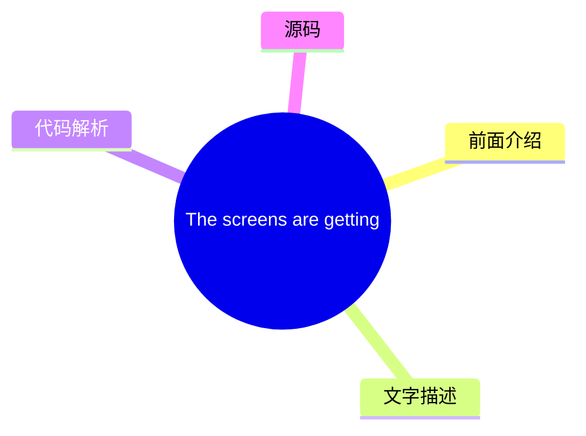
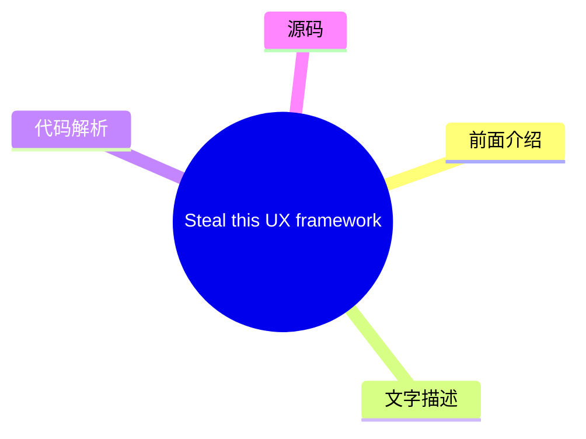
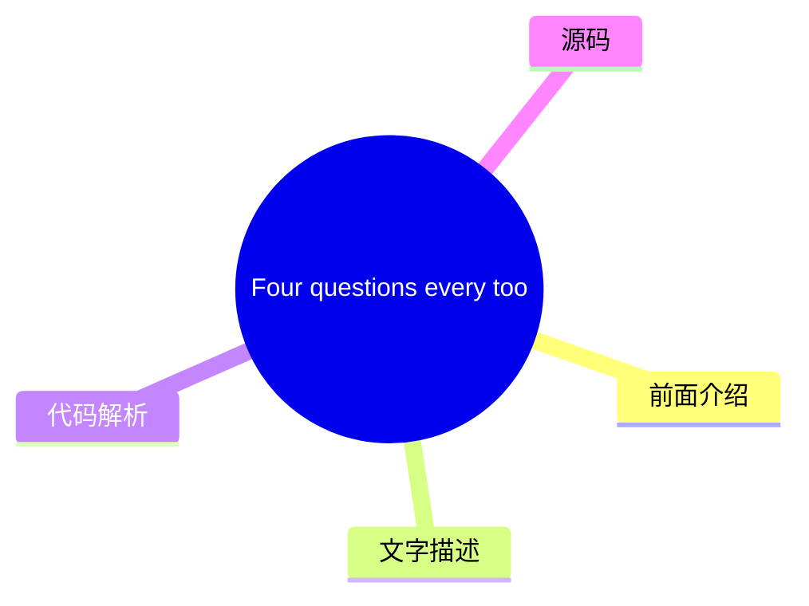
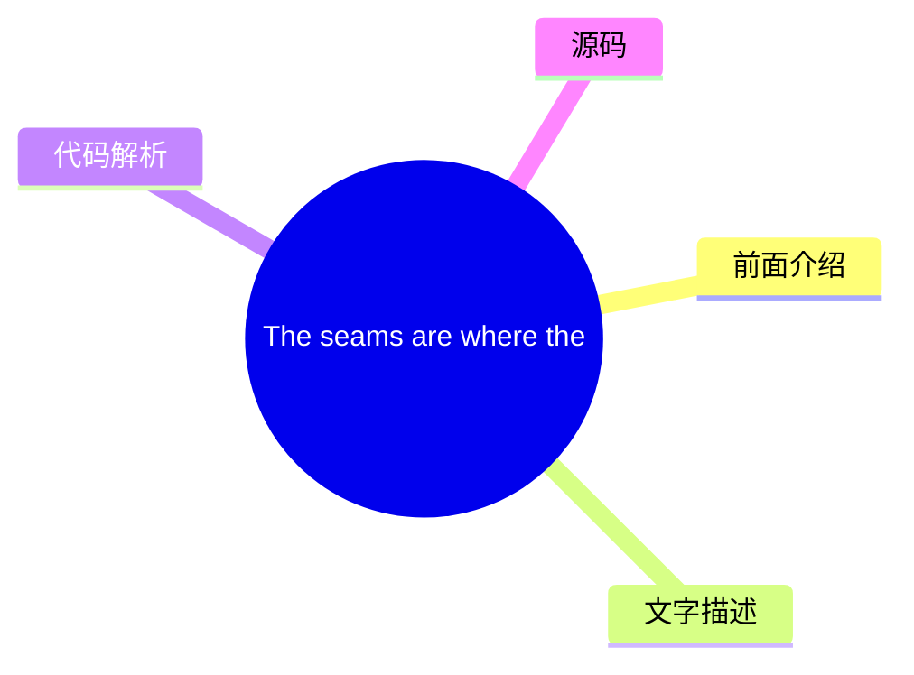
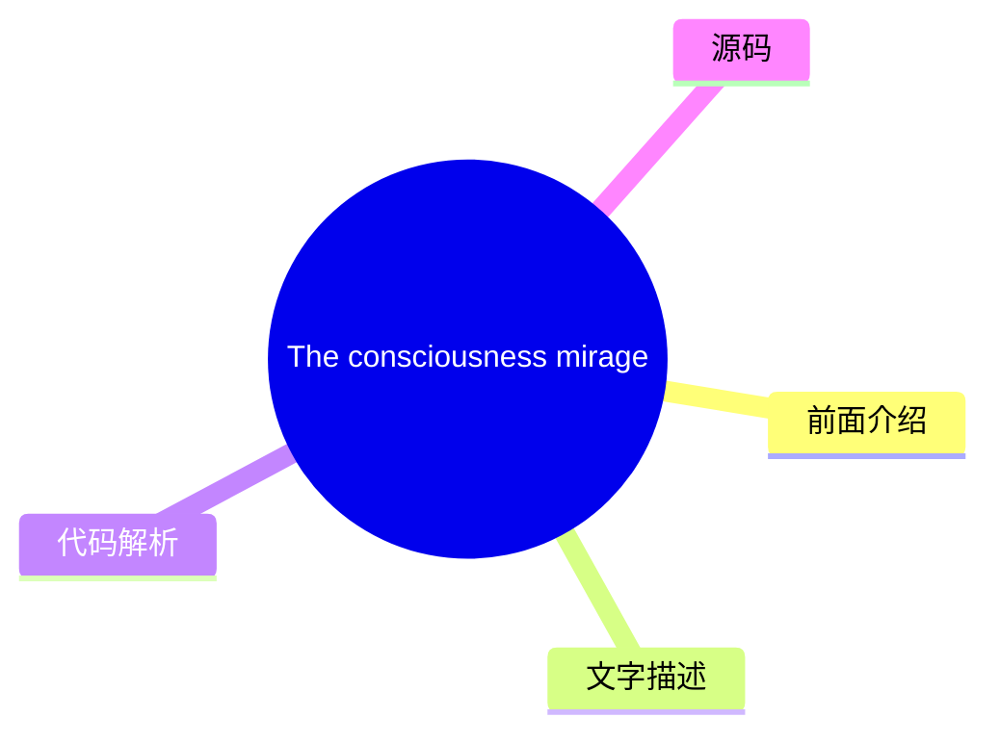

# ✏️ UX Collective Top 8 (2026-07-28)

## 前面介绍

- 数据源：UX Collective
- 抓取日期：2026-07-28
- 条目数：8
- 含完整正文：8
- 含代码片段：0
- 组织方式：前面介绍 / 树状图 / 文字描述 / 代码解析 / 源码

## 思维导图

```mermaid
mindmap
  root((UX Collective))
    The screens are getting demo
    Steal this UX framework from
    Four questions every tool sh
    Information architecture is 
    Your website is boring (but 
    The seams are where the syst
    From frictionless to meaning
    The consciousness mirage in 
```

## 详细整理（8 条，8 条含全文，0 条含代码）

### 1. The screens are getting demoted
- **链接**: [https://uxdesign.cc/the-screens-are-getting-demoted-6b40120fcf04?source=rss----138adf9c44c---4](https://uxdesign.cc/the-screens-are-getting-demoted-6b40120fcf04?source=rss----138adf9c44c---4)
- **作者**: Serg Zorin
- **发布**: Wed, 22 Jul 2026 22:21:02 GMT

#### 前面介绍

- 作者：Serg Zorin
- 发布时间：Wed, 22 Jul 2026 22:21:02 GMT

#### 树状图



#### 文字描述

- # The screens are getting demoted
- ## As AI products become more advanced, the interface is no longer the main focus. Now, the real question is which screens are still needed and which can serve as fallbacks. Designers often say that UX isn’t really about screens. It’s a line I see in portfolios, I hear in interviews; that’s the line we use to signal that we’re thinking beyond just pixels. But honestly, for most
- ## This was most of the job I work at Meta in the AI space and design products where complexity is real, and so is the learning curve. If I’m being very honest about where my hours went, a lot of them went into screens that only existed because the software couldn’t act on what someone wanted. For example, the config page was there because the system couldn’t guess the right se
- ## Why complex systems feel it first I see this most clearly in complex tools, because that’s where I spend my time. People often say that power users love complex interfaces. In reality, they just put up with them, and they memorized your product because the results were worth it, not because the process was great. These users already knew what they wanted and what the outcome

#### 代码解析

- 本文未检测到明确代码块，内容更偏新闻、观点或方法论。

#### 源码

#### 中文节选

# The screens are getting demoted

## As AI products become more advanced, the interface is no longer the main focus. Now, the real question is which screens are still needed and which can serve as fallbacks.

Designers often say that UX isn’t really about screens. It’s a line I see in portfolios, I hear in interviews; that’s the line we use to signal that we’re thinking beyond just pixels. But honestly, for most of my career, that wasn’t true. In one way or another, the job was screens: building flows in Figma, mapping out states, writing specs, worrying about happy paths and edge cases, and handling handoff. We kept saying UX isn’t about screens, even as we kept making more of them.

**Well, AI is about to call the bluff.**

Here’s a simple example. Let’s say you took a selfie with your friend Mark last week, and now you want to send it to him.

Open the mail app. Tap compose. Type the name. Hit Attach, and you’ve left the mail app entirely. You’re in the file/photo picker now, a separate product with its own rules. Dig around. Recents. Last week. There. Tap. Back to compose. Check the attachment. Send.

Compose, attach, browse, select, confirm, send. That’s six small steps just to move one photo, and each one was extra work around the real goal, not the goal itself.

Now, you just say or type: *send Mark the photo of us at the game from last week.* That’s it.

The same happened to reading design articles. You don’t need to read it all to decide whether it’s good. Paste it into Claude, ChatGPT, or whichever AI tool you use and ask whether it’s worth reading. Hopefully it will say: “Yes, this article is the best article about the impact of AI on UX.” Though I still encourage you to read it and make your own judgment.


What matters here is how the work has changed. Now, the system finds the photo, figures out who Mark is, attaches it, writes a reasonable message, and sends it. All those old steps still happen, but you’re no longer the one clicking through them.

A lot of UI lies in the gap between what you want and what the system forces you to do by hand. That gap is closing fast.

## This was most of the job


I work at Meta in the AI space and design products where complexity is real, and so is the learning curve. If I’m being very honest about where my hours went, a lot of them went into screens that only existed because the software couldn’t act on what someone wanted.

For example, the config page was there because the system couldn’t guess the right setting, so we ended up with forty fields. Nobody ever woke up excited to fill out forty fields. We tried to make it better with onboarding wizards, but in the end, it was still forty fields.

The setup wizard was needed because the system couldn’t figure out what you needed, so we guided you through it one question at a time.

The dashboard was there because we couldn’t be sure what really mattered to users, so we put twenty metrics on one screen, added tables for people to check themselves, a

#### 完整正文（中文）

# The screens are getting demoted

## As AI products become more advanced, the interface is no longer the main focus. Now, the real question is which screens are still needed and which can serve as fallbacks.

Designers often say that UX isn’t really about screens. It’s a line I see in portfolios, I hear in interviews; that’s the line we use to signal that we’re thinking beyond just pixels. But honestly, for most of my career, that wasn’t true. In one way or another, the job was screens: building flows in Figma, mapping out states, writing specs, worrying about happy paths and edge cases, and handling handoff. We kept saying UX isn’t about screens, even as we kept making more of them.

**Well, AI is about to call the bluff.**

Here’s a simple example. Let’s say you took a selfie with your friend Mark last week, and now you want to send it to him.

Open the mail app. Tap compose. Type the name. Hit Attach, and you’ve left the mail app entirely. You’re in the file/photo picker now, a separate product with its own rules. Dig around. Recents. Last week. There. Tap. Back to compose. Check the attachment. Send.

Compose, attach, browse, select, confirm, send. That’s six small steps just to move one photo, and each one was extra work around the real goal, not the goal itself.

Now, you just say or type: *send Mark the photo of us at the game from last week.* That’s it.

The same happened to reading design articles. You don’t need to read it all to decide whether it’s good. Paste it into Claude, ChatGPT, or whichever AI tool you use and ask whether it’s worth reading. Hopefully it will say: “Yes, this article is the best article about the impact of AI on UX.” Though I still encourage you to read it and make your own judgment.


What matters here is how the work has changed. Now, the system finds the photo, figures out who Mark is, attaches it, writes a reasonable message, and sends it. All those old steps still happen, but you’re no longer the one clicking through them.

A lot of UI lies in the gap between what you want and what the system forces you to do by hand. That gap is closing fast.

## This was most of the job


I work at Meta in the AI space and design products where complexity is real, and so is the learning curve. If I’m being very honest about where my hours went, a lot of them went into screens that only existed because the software couldn’t act on what someone wanted.

For example, the config page was there because the system couldn’t guess the right setting, so we ended up with forty fields. Nobody ever woke up excited to fill out forty fields. We tried to make it better with onboarding wizards, but in the end, it was still forty fields.

The setup wizard was needed because the system couldn’t figure out what you needed, so we guided you through it one question at a time.

The dashboard was there because we couldn’t be sure what really mattered to users, so we put twenty metrics on one screen, added tables for people to check themselves, and hoped you’d find the one that mattered. A lot of dashboards are just us admitting, “We’re not sure what’s wrong either. Maybe you can tell us.”

But none of that was the real goal. People using serious products didn’t want the screens. They wanted the results hidden inside them. We built screens because it was the only way to deliver those results, and for a long time, there really was no other option.

Now, there’s another way: AI. This changes what most designers do. The question shifts from “How well can you design these screens?” to “Should these screens exist at all?”

This idea isn’t even new. About ten years ago, Golden Krishna wrote [ The Best Interface Is No Interface](https://www.nointerface.com), saying that designers often reach for a screen by habit when the better answer is sometimes no screen at all. He was right, just a bit early, because the technology wasn’t there yet. Now it is.

Jessa Parette argued something similar in “[AI just called design’s bluff](/ai-just-called-designs-bluff-2b94bf2f5cae)”: that a decade of design work was interface production, and AI has taken the cover off. My question is which screens are left standing.

## Why complex systems feel it first

I see this most clearly in complex tools, because that’s where I spend my time.


人们常说高级用户喜欢复杂的界面。实际上，他们只是忍受这些界面，并且记住你们的产品是因为结果值得付出，而不是因为流程很棒。这些用户已经知道自己想要什么以及结果应该是什么样。中间的一切都只是额外的工作：导航、配置、点击五个标签页才能完成一件事。这在很长一段时间内是必要的，但这仍然是额外的工作。

但现在，用户习惯已经改变了。几年前，当我们进行演示时，卡住的用户总是会问：“我该打开哪个屏幕？”现在，会有人打断并问：“有没有一个 Claude 技能可以做到这一点？”起初，这听起来很奇怪。当你听到十次之后，它开始感觉正常了。

人们不再问去哪里找屏幕。相反，他们想知道是否有一个技能或代理可以接受他们的意图并给出结果，而无需使用 UI。

越来越多的答案是肯定的。

而且事情发展得很快。我不能在这里分享内部数据，但我所看到的情况很容易描述。一年前，人们希望我们改进一个页面或添加一个功能。现在，他们问是否可以拥有一个代理流程，而不是一个页面。显然，这种用户行为的变化对我们的路线图和我们的设计师工作产生了重大影响。

在我被允许提及的地方，你可以看到这种转变。微软可能比任何其他公司都发布了更多的表单，他们[将员工用于注册新设备的内部表单重建为对话式代理](https://www.microsoft.com/insidetrack/blog/simplifying-device-registration-at-microsoft-with-an-agentic-ai-assistant/)。他们的目标是将一个六步流程变成“只需一两个操作”。他们让旧表单与它并行运行，微软表示，随着人们转向代理，表单的使用率已经在下降。微软没有让表单变得更整洁，而是质疑它是否需要是一个表单。

And this trend is everywhere. Box CEO Aaron Levie thinks agents will become “[the primary user of all software](https://www.linkedin.com/posts/boxaaron_over-the-past-few-months-something-big-has-activity-7437559404981383168-BRkA),” with companies running a hundred times more agents than people. Gartner expects [around 40% of enterprise apps to ship task-specific agents this year](https://www.gartner.com/en/newsroom/press-releases/2025-08-26-gartner-predicts-40-percent-of-enterprise-apps-will-feature-task-specific-ai-agents-by-2026-up-from-less-than-5-percent-in-2025), up from under 5% a year ago, and frames this as the start of a shift away from keyboard- and interface-centric work. Nielsen Norman Group, which you can’t accuse of chasing hype, [talked about it openly in their 2026 report](https://www.nngroup.com/articles/state-of-ux-2026/): people are spending less time interacting with the UI and more time handing work to a layer that sits on top of it.

A “layer that sits on top” is another way of saying that our screens are quietly being demoted.

## The screens that survive

There are two easy but unhelpful reactions here. One is to panic and say AI is killing design. The other is to believe that nothing is really changing and that our role just shifts to product strategy, making designers more valuable than ever. I don’t fully agree with either view.

The truth is that more often, screens are being demoted, not deleted. They’re moving from the main role to a supporting one, and the real question is which screens stay and which ones go.


Don Norman gave us vocabulary for this forty years ago [with his two gulfs](https://www.nngroup.com/articles/two-ux-gulfs-evaluation-execution/): the gulf of execution, the distance between what you want and what the system lets you do, and the gulf of evaluation, the distance between what the system shows and what you can understand. Agents are collapsing the first gulf faster than anything I’ve watched in my career. The second gulf is still entirely ours, and it quietly widens as more of the doing happens out of sight.


执行屏幕是那些被降级的屏幕。曾经发生工作的地方变成了不可逆操作前的确认步骤，或者当代理不确定时的备选方案。它们变成了审计日志、事后检查的报告，或者是你去查看系统为你做了什么的场所。所有这些仍然是真实的设计工作，其中一些甚至比以前更难，但现在的主要焦点在于用户的意图。

意义构建屏幕则完全是另一回事。几年前，我读了一篇非常棒的[Amelia Wattenberger反对聊天机器人的文章](https://wattenberger.com/thoughts/boo-chatbots/)，她是GitHub研究实验室的一位设计工程师，负责AI界面的原型设计。她的观点一直萦绕在我心头：好的工具“会清楚地说明它们应该如何使用”，而一个空的文本框对它能做什么一无所知，在询问AI和检查其工作之间来回切换会扼杀任何流程。至少对于工作是思考而不是执行的屏幕来说，她是正确的。正如我之前承认的那样，一些仪表盘是我们耸耸肩（表示无奈）。但在故障期间打开的那个仪表盘，试图弄清楚刚才出了什么问题，它起着不同的作用，代理最终会坐在它旁边，而不是取代它。

## 在您的收件箱中获取 Serg Zorin 的故事

加入 Medium 免费获取此作者的更新。

Heenesh Patel 在“The last interface”中提出了类似的观点，描述了剩余的“零层UI”：代理作为基础使用的一组基本核心界面。我会按功能而不是功能深度来区分它们。剩余的屏幕处理判断、监督和恢复，这就是第二个鸿沟所在的地方。

还有一个需要注意的点，即使在我们正在愉快替换的执行界面也是如此。当人们不再亲自执行步骤时，他们往往会停止构建系统运作方式的心理模型。这通常没问题，直到出现问题为止。一个智能体流程可以替换十个界面，但它会悄无声息地移除用户对底层发生情况的了解。当它出错或卡住时，用户只能试图从他们从未真正学过的系统中恢复过来。统计移除的界面或用户点击次数是一种懒惰的衡量进度的方法。我更愿意问的是，某人是否在拥有足够的理解和控制力的情况下达成了正确的结果。

在消费者设计师们来找我之前先说明一点：这主要针对复杂系统，至少目前如此。消费产品也会改变，但速度会更慢，方式也不同。没有人会为了好玩而浏览调试工具，但滚动是 Instagram 的一半乐趣，所以它不会很快变成命令行。不过，即便在那里，人们也更关心结果而不是导航。

## 新的设计评审

这是你可以在下次评审或头脑风暴中使用的内容。

多年来，我们的评审问题都集中在流程上。路径清晰吗？CTA 容易看到吗？需要多少次点击？任务完成率是多少？这些都是好问题，但它们都假设流程首先应该存在。

现在，新问题提升了一个层次，它们关注的是系统采取行动的时刻。

**在运行任何内容之前：**

- 系统能否推断出来而不是询问？
- 这能否是一个命令、一项技能、一个 API 或自动化，而不是一个界面？
- 哪些需要用户的“是”，系统在执行前应该展示哪些假设？

**在运行过程中：**

- 应该保持可见的上下文是什么，系统应该在何时暂停并询问？
- 用户可以在不停止 ...（截断，原文 16071+ 字符）


### 2. Steal this UX framework from Dubai’s most over-the-top hotel
- **链接**: [https://uxdesign.cc/steal-this-ux-framework-from-dubais-most-over-the-top-hotel-0b14f71e46e5?source=rss----138adf9c44c---4](https://uxdesign.cc/steal-this-ux-framework-from-dubais-most-over-the-top-hotel-0b14f71e46e5?source=rss----138adf9c44c---4)
- **作者**: Slava Polonski, PhD
- **发布**: Thu, 23 Jul 2026 21:48:28 GMT

#### 前面介绍

- Stop studying apps. Study hotels. A Google UX researcher&#x2019;s field notes on the hidden UX of hospitality.Continue reading on UX Collective »
- 作者：Slava Polonski, PhD
- 发布时间：Thu, 23 Jul 2026 21:48:28 GMT

#### 树状图



#### 文字描述

- Member-only story **Steal this UX framework from Dubai’s most over-the-top hotel**
- ## The invisible man at the chocolate fountain If you have ever used a chocolate fountain, you know the physics. The chocolate is thin. It drips. A child holding a skewer of marshmallows is a guaranteed spill. The counter around one of these should look like a crime scene by nine o’clock. This one never did. Five ribbons ran at once: pistachio, raspberry, milk, white, and dark,

#### 代码解析

- 本文未检测到明确代码块，内容更偏新闻、观点或方法论。

#### 源码

#### 中文节选

Member-only story

**Steal this UX framework from Dubai’s most over-the-top hotel**

## The invisible man at the chocolate fountain

If you have ever used a chocolate fountain, you know the physics. The chocolate is thin. It drips. A child holding a skewer of marshmallows is a guaranteed spill. The counter around one of these should look like a crime scene by nine o’clock.

This one never did. Five ribbons ran at once: pistachio, raspberry, milk, white, and dark, and all week the marble around it stayed spotless. It took me three nights to work out why, and when I did, I realized I had been staring at the best piece of user-experience design in the whole resort. I’ll come back to this observation later.

We had come to [Atlantis The Palm](https://www.atlantis.com/dubai) for a week, one of the most lavish hotels in the world. If you have never been, a quick word on the place. It is located on the outer crescent of [Palm Jumeirah](https://en.wikipedia.org/wiki/Palm_Jumeirah), the artificial palm-shaped island off Dubai you can pick out from space. It is less a hotel than a small city: its own [waterpark](https://www.atlantis.com/dubai/aquaventure-waterpark), its own [aquarium](https://www.atlantis.com/dubai/marine-and-waterpark/the-lost-chambers-aquarium), and a strip of restaurants that has quietly become a culinary heavyweight. The wider Atlantis Dubai resort it anchors…

#### 完整正文（中文）

Member-only story

**Steal this UX framework from Dubai’s most over-the-top hotel**

## The invisible man at the chocolate fountain

If you have ever used a chocolate fountain, you know the physics. The chocolate is thin. It drips. A child holding a skewer of marshmallows is a guaranteed spill. The counter around one of these should look like a crime scene by nine o’clock.

This one never did. Five ribbons ran at once: pistachio, raspberry, milk, white, and dark, and all week the marble around it stayed spotless. It took me three nights to work out why, and when I did, I realized I had been staring at the best piece of user-experience design in the whole resort. I’ll come back to this observation later.

We had come to [Atlantis The Palm](https://www.atlantis.com/dubai) for a week, one of the most lavish hotels in the world. If you have never been, a quick word on the place. It is located on the outer crescent of [Palm Jumeirah](https://en.wikipedia.org/wiki/Palm_Jumeirah), the artificial palm-shaped island off Dubai you can pick out from space. It is less a hotel than a small city: its own [waterpark](https://www.atlantis.com/dubai/aquaventure-waterpark), its own [aquarium](https://www.atlantis.com/dubai/marine-and-waterpark/the-lost-chambers-aquarium), and a strip of restaurants that has quietly become a culinary heavyweight. The wider Atlantis Dubai resort it anchors…


### 3. Four questions every tool should answer (even Figma) about AI training model usage
- **链接**: [https://uxdesign.cc/the-trust-test-four-questions-every-tool-should-answer-even-figma-about-ai-training-model-usage-4f1150f91a30?source=rss----138adf9c44c---4](https://uxdesign.cc/the-trust-test-four-questions-every-tool-should-answer-even-figma-about-ai-training-model-usage-4f1150f91a30?source=rss----138adf9c44c---4)
- **作者**: Patrick Neeman
- **发布**: Thu, 23 Jul 2026 21:43:32 GMT

#### 前面介绍

- 作者：Patrick Neeman
- 发布时间：Thu, 23 Jul 2026 21:43:32 GMT

#### 树状图



#### 文字描述

- # Four questions every tool should answer (even Figma) about AI training model usage
- ## Figma’s class action is not really about copyright, it is about defaults and they are a design decision your team makes. Here’s a test you can apply. *Disclaimer: **I am not a lawyer; I don’t even own a suit. I did spend eight years in legal technology, which qualifies me to play one poorly on Law and Order and nothing further. This not about the law, it’s about trust. Read 
- ## The Pattern Rhymes This has happened enough times to have a shape, AI or not. These are the AI cases. **In the summer of 2023, ****Zoom**** amended its terms of service to claim broad rights over customer data for training and tuning models.** Nobody noticed for months. When a technology blog surfaced the clause in August, The Record reported in [Zoom revises terms again to 
- ## The Sniff Test Four questions fall out of that pattern, worth naming with their scoring before we run them. - Consent - Symmetry - Disclosure - Exit A tool that passes all four treats your work as yours, and three passes is ordinary enough to be worth raising at renewal. But symmetry does not weigh the same as the rest, and a failure there counts for more than the other thre

#### 代码解析

- 本文未检测到明确代码块，内容更偏新闻、观点或方法论。

#### 源码

#### 中文节选

# Four questions every tool should answer (even Figma) about AI training model usage

## Figma’s class action is not really about copyright, it is about defaults and they are a design decision your team makes. Here’s a test you can apply.

*Disclaimer: **I am not a lawyer; I don’t even own a suit. I did spend eight years in legal technology, which qualifies me to play one poorly on Law and Order and nothing further. This not about the law, it’s about trust. Read on.*

In November 2025, Raza Khan, [a startup founder, sued Figma](https://news.bloomberglaw.com/litigation/figma-trained-ai-on-user-data-without-consent-class-action-says) in the Northern District of California. The complaint does not lead with copyright — it leads with consent, and with the claim that the company switched on model training over customer design files by default after years of promising otherwise.

Nothing in that case has been decided.

Figma disputes the allegations and says its training focuses on general patterns like, uh, creating [weather apps](https://www.theguardian.com/technology/article/2024/jul/03/figma-ai-app-creator-accused-of-ripping-off-apple-weather-app), rather than customer content.

Hold the legal question open, because that is where it belongs. The design question is not open, and it is not really a question about Figma. Somebody chose between opt-in and opt-out, and chose differently by plan tier. And that decision sits in public documentation [right now](https://www.figma.com/ai/our-approach/).

**Here is the part that matters: Designers are the users in this story of a company lead by, and we know precisely how it feels to have a default decided on our behalf.**

and his company should have a higher standard because where they sit in the public square; they are teaching designers through their actions.

We ship those same defaults to our own users every quarter. So this is a test with four questions, about twenty minutes of work, and it only counts if you turn it around so the users are treated with empathy and respect and not [dark patterns](https://www.nngroup.com/articles/deceptive-patterns/).

## The Pattern Rhymes


这种情况已经发生过很多次，以至于即使没有 AI，也形成了一种模式。以下是 AI 相关的案例。

**2023 年夏天，****Zoom**** 修改了其服务条款，声称对客户数据拥有广泛的权利，用于训练和调整模型。** 这一点在数月内无人注意。当一家科技博客在 8 月曝光了该条款时，The Record 在 [Zoom 再次修订条款称其不使用客户数据训练 AI 模型](https://therecord.media/zoom-ai-terms-of-service-update) 一文中报道，该公司在一周内两次重写了相关措辞。

**九个月后轮到 ****Slack****。** 一篇 Hacker News 的帖子指向了隐私原则页面，工作区所有者才发现他们默认被纳入了针对消息、内容和文件的机器学习训练。TechCrunch 在 [Slack 因偷偷的 AI 训练政策而受到攻击](ht

#### 完整正文（中文）

# 每个工具（甚至 Figma）都应该回答的关于 AI 训练模型使用的四个问题

## Figma 的集体诉讼并非真的关于版权，而是关于默认设置，而这些是你们团队做出的设计决策。这里有一个你可以应用的测试。

*免责声明：**我不是律师；我甚至没有一套西装。我在法律技术领域工作了八年，这使我足以在《法律与秩序》中扮演一个蹩脚的角色，除此之外别无他长。这无关法律，关乎信任。请继续阅读。*

2025 年 11 月，拉扎·汗（Raza Khan），[一家初创公司创始人，起诉了 Figma](https://news.bloomberglaw.com/litigation/figma-trained-ai-on-user-data-without-consent-class-action-says)，地点位于加利福尼亚北区。起诉状并非以版权问题开篇——它是以同意权开篇，并声称该公司在多年承诺相反做法后，默认在客户的设计文件上开启了模型训练。

该案件中的任何内容都尚未做出裁决。

Figma 否认了这些指控，并表示其训练重点在于一般模式，比如，呃，创建[天气应用](https://www.theguardian.com/technology/article/2024/jul/03/figma-ai-app-creator-accused-of-ripping-off-apple-weather-app)，而不是客户内容。

请保持法律问题悬而未决，因为那是它该待的地方。设计问题并未悬而未决，而且这其实并不是关于 Figma 的问题。有人选择了“自愿加入”与“自愿退出”，并且根据计划层级做出了不同的选择。而这个决定目前就存在于公开文档中[这里](https://www.figma.com/ai/our-approach/)。

**重要的是这一部分：设计师是这家由他们领导的公司的用户，而我们确切地知道，当默认设置代表我们做出决定时，那种感觉是怎样的。**

他的公司应该有更高的标准，因为他们身处公共广场；他们通过行动在教导设计师。

我们每季度都会向自己的用户推出相同的默认设置。所以这是一个包含四个问题的测试，大约需要二十分钟的工作量，只有当你将其翻转过来，让用户受到同理心和尊重的对待，而不是[暗黑模式](https://www.nngroup.com/articles/deceptive-patterns/)时，它才有效。

## 模式押韵

This has happened enough times to have a shape, AI or not. These are the AI cases.

**In the summer of 2023, ****Zoom**** amended its terms of service to claim broad rights over customer data for training and tuning models.** Nobody noticed for months. When a technology blog surfaced the clause in August, The Record reported in [Zoom revises terms again to say it doesn’t use customer data to train AI models](https://therecord.media/zoom-ai-terms-of-service-update) that the company rewrote the language twice inside a week.

**Nine months later it was ****Slack****.** A post on Hacker News pointed at the privacy principles page, and workspace owners learned they were enrolled by default in machine learning training on messages, content, and files. TechCrunch covered the reaction in [Slack under attack over sneaky AI training policy](https://techcrunch.com/2024/05/17/slack-under-attack-over-sneaky-ai-training-policy/), including the detail that turned irritation into anger: opting out meant emailing a specific address with a specific subject line, and only a workspace owner could send it.

No toggle, no setting.

The terms had been live since at least September 2023, and Slack rewrote the language within days while saying it had changed no practice, which was true and beside the point. Fresh ink on their hands.


This has happened enough times to have a shape, and it doesn’t feel good.

**Then June 2024. Adobe pushed a re-acceptance modal, creators read the license language, and the company spent two weeks walking it back. **Its own post, [Updating Adobe’s Terms of Use](https://blog.adobe.com/en/publish/2024/06/10/updating-adobes-terms-of-use), conceded the terms needed to be more precise.

Adobe’s defaults were never the problem; its wording was. The company lost weeks of trust without doing the thing it stood accused of, which tells you that trust does not track behavior. It tracks what people can read and verify.

Slack is its own category, and the one worth studying. Zoom and Adobe reversed. Slack did not: it rewrote the sentence and kept the mechanism, which is a different move wearing the same clothes.


信任不是一种感觉，而是一套你可以审计的默认设置，Zoom 和 Adobe 都在两周内恢复了，因为他们可以回滚——一句需要修正的话，一个需要翻转的开关，一次公开的修正。Slack 只修正了那句话，而电子邮件地址依然是退出方式。

每次都是同一套剧本。

- 一项政策变更悄无声息地落地。
- 注册是默认选项。
- 公司外部有人发现了它。
- 然后是澄清、道歉，有时还有撤回。

这感觉非常像《搏击俱乐部》，其中的公司在计算风险和回报。

“我的工作就是套用这个公式：取现场车辆数量 A，乘以可能的故障率 B，再乘以平均庭外和解金额 C。A 乘以 B 再乘以 C 等于 X。如果 X 小于召回的成本，我们就不做召回。”

听起来像是同意精神的体现，读起来是这样的：

“我的工作就是套用这个公式：取我们摄取数据的用户数量 A，乘以有人注意到的概率 B，再乘以每起索赔的平均和解金额 C。A 乘以 B 再乘以 C 等于 X。如果 X 小于构建真实同意流程的成本，我们就构建它。”

**Figma 的不同之处在于，没有任何东西被撤回，发现过程是以联邦投诉的形式出现的。** 没有起草错误需要修正。分级默认设置被宣布、解释、用明确的理由辩护，并按计划生效。对于一项已经清晰的决定，你无法再进行澄清。

## 感知测试

从这种模式中衍生出四个问题，值得在运行它们之前给它们打分。

- 同意
- 对称性
- 披露
- 退出

一个通过所有四项的工具会将你的工作视为你的，而三项通过则足够普通，值得在续订时提出。但对称性的权重与其他项不同，那里的失败比其他三项加起来更重要。

### 测试一：同意

问题不在于工具是否告诉你。而在于当你到达时，开关是否是关闭的。

Figma 的公告，[Meet Figma AI](https://www.figma.com/blog/introducing-figma-ai/)，出奇地直接。该公告于 2024 年 6 月发布，声明分享客户内容用于训练是可选的，由管理员设置偏好，并且 Starter 和 Professional 计划默认选择加入，在 2024 年 8 月 15 日之前不会进行训练。这是一个为期七周的公开通知，并且描述了相关机制。

这比 Zoom 或 Slack 所能做到的透明度还要高。

Slack 将其条款埋在隐私政策中，并用电子邮件地址来回应质询。

Figma 公布了一个日期。

这仍然是可选择的。

通知并非同意。

默认生效前的七周窗口期是一种礼貌，也是真正的礼貌，但它将拒绝的负担加在了工作成果岌岌可危的人身上。从未要求过必须撤销的同意。它被假定、宣布，然后才变得可以取消。

从未要求过必须撤销的同意。它被假定、宣布，然后才变得可以取消。

关于这方面的研究已经尘埃落定。尼尔森诺曼集团的 [Sneaking: The Deceptive UX Pattern You Never Saw Coming](https://www.nngroup.com/articles/sneaking/) 记录了让某人同意他们从未打算同意的事物的做法家族，其发现与其说是一个伦理问题，不如说是一个会计问题：欺骗能带来转化，但其造成的长期信任损失率超过了收益。

设计师知道这种模式，因为我们构建了它——预先勾选的复选框、安装时的捆绑权限、订阅折叠在账户创建中。我们花费了二十年时间发表研究，解释为什么这些模式具有敌意，然后在需要达成增长目标时，无论如何都会发布它们。

[Design for a Better World](https://www.amazon.com/Design-Better-World-Meaningful-Sustainable/dp/0262047950) 坚持认为，这是设计师的工作，而不是对其工作的脚注。这本书敦促设计师将视野扩大到屏幕前的人之外，将已发布决策的后果视为自己的责任。默认设置正是此类决策。它由少数几个人在一个房间里做出一次，却适用于数百万从未见过他们的人。

The standard that produced the opt-out default was whether it would survive legal review. Ours is narrower and harder: what is right for the person whose work this is. The two agree most of the time, which is why the gap goes unnoticed until a quarter when they do not.

Run it this way. Open the tool, find the training setting, and look at its state.

If it is on and you did not turn it on, the company made a decision about your work and told you afterward.

### Test Two: Symmetry

Here is where it stops being an ordinary default and starts being a statement. Figma’s engineering explainer, [Building Figma AI](https://www.figma.com/ai/our-approach/), lays out the tiering plainly.

**Content training defaults to on for Starter and Professional, off for Organization and Enterprise.** That’s a pretty clear statement and the stated reason is that agreements with Organization and Enterprise are typically more complex and include specific requirements and restrictions.

Read that again, because it is the most important sentence in the whole episode and Figma published it voluntarily. What it says is this: we understood the setting carried contractual risk, so for customers who had negotiated terms making that risk explicit we defaulted to off, and for everyone else we defaulted to on.

Then read the consequence, which sits in Figma’s own [registration statement](https://www.sec.gov/Archives/edgar/data/1579878/000162828025035381/figma-sx1a.htm): roughly seventy percent of new Organization and Enterprise customers included at least one person who had previously been on a Professional plan. The protected tier is grown from the enrolled one. The designer whose files trained the models on a Professional account is the same designer who later brings her company onto an Enterprise contract and receives the protective default as a welcome gift.


The asymmetry is not evidence of bad faith. It is evidence of accurate risk assessment.

Bad faith is a mistake you can apologize for. This was a correct read of where leverage sat, followed by placing the exposure where it was least likely to generate a lawsuit.

That calculation was wrong by about seventeen months.


The underlying premise does not hold either. A freelance designer working under a client nondisclosure agreement is not carrying less confidentiality risk than a company with a master services agreement. She carries the same risk with a thinner contract and no procurement team. The obligation is identical.

The direct version: this was not morally right, and it does not respect designers.

Set the litigation aside and assume Figma wins outright. The tiering still sits in the published record, put there by the company itself: customers with procurement departments get protected, customers without them get enrolled. That is a judgment about whose work matters, made by a company whose business is the work of designers.

Leverage is not a moral category. Bargaining power tells you what a customer can force you to do, and nothing at all about what you owe her, which is why we do not let doctors calibrate care to a patient’s ability to sue.

Symmetry is the best question in the test because it is hardest to explain away. A single default applied to everyone might be a philosophy. Two defaults split along a payment line approved by legal is a position on who is worth protecting.

### Test Three: Disclosure

The third question 

...（截断，原文 23168+ 字符）


### 4. Information architecture is the foundation artificial intelligence is starving for
- **链接**: [https://uxdesign.cc/information-architecture-is-the-foundation-artificial-intelligence-is-starving-for-1d91fb5bf59f?source=rss----138adf9c44c---4](https://uxdesign.cc/information-architecture-is-the-foundation-artificial-intelligence-is-starving-for-1d91fb5bf59f?source=rss----138adf9c44c---4)
- **作者**: Patrick Neeman
- **发布**: Sun, 26 Jul 2026 19:28:45 GMT

#### 前面介绍

- 作者：Patrick Neeman
- 发布时间：Sun, 26 Jul 2026 19:28:45 GMT

#### 树状图


#### 文字描述

- # Information architecture is the foundation artificial intelligence is starving for
- ## Every AI problem you chase — hallucinations, wrong answers, poor retrieval — traces back to the IA projects you never funded. Now’s the time to fund them. For twenty years, information architecture was the discipline nobody funded. The job titles disappeared—I was one back in the day—and now it’s an art (and science) that needs to return. Teams didn’t align. Companies starte
- ## Retrieval Is Only as Good as What It Starts With Most teams treat retrieval as a solved problem. Point the model at your content, let it pull the relevant passages, generate an answer. The technique has a name — retrieval-augmented generation, or RAG — and a foundational paper, [Retrieval-Augmented Generation for Knowledge-Intensive NLP Tasks](https://arxiv.org/abs/2005.1140
- ## Structure Is How a Model Knows What Something Is A price, a policy, a deprecated note, and a customer quote can read as similar strings of text and mean opposite things. A person skims the surrounding page and knows which is which. A model, handed the same four snippets with no scaffolding, sees four passages of plausible language and no reason to rank one above another. Met

#### 代码解析

- 本文未检测到明确代码块，内容更偏新闻、观点或方法论。

#### 源码

#### 中文节选

# 信息架构是人工智能饥渴难耐的基石

## 你追逐的每一个 AI 问题——幻觉、错误答案、检索效果差——都追溯到那些从未资助过的 IA 项目。现在是资助它们的时候了。

二十年来，信息架构一直是没人资助的学科。职位头衔消失了——我当年就是其中之一——现在它是一门需要回归的艺术（也是科学）。团队没有对齐。公司开始暴露底裤。

做得好，与其说是关于结构，不如说是让组织就一种命名和排列事物的方式达成一致。每个团队都有自己的词汇，所以对齐它们是缓慢的、政治性的且吃力不讨好的，并且每一季度都会输给任何能发布功能的东西。这项工作保持隐形，它的失败也是如此。

**然后 AI 到来了，隐形的基础出现在了资产负债表上。**

曾经让你困惑的访客的那些差距，现在让你付出幻觉、错误答案或一个自信地检索垃圾数据并据此行动的代理人的代价。在 2025 年的一项调查中，[数据质量和可用性位居 AI 采用障碍榜首](https://www.aidataanalytics.network/data-science-ai/news-trends/data-quality-availability-top-list-of-ai-adoption-barriers)，超越了其他所有障碍。

失败并没有变得更糟；它们变得可见、可重复且昂贵。

简而言之，糟糕的信息架构现在可以用 token 成本来衡量。很多。

你可以购买更好的模型，优化更精准的提示词，并堆叠另一层评估层，但你仍然会提供错误的答案，因为模型是从一堆没人同意如何组织的数据中检索的。

**在你第二次为它买单之前，你需要修复这个基础。**

## 检索的效果取决于它起始于什么

大多数团队将检索视为一个已解决的问题。把模型指向你的内容，让它提取相关段落，生成答案。

The technique has a name — retrieval-augmented generation, or RAG — and a foundational paper, [Retrieval-Augmented Generation for Knowledge-Intensive NLP Tasks](https://arxiv.org/abs/2005.11401), and the mechanism is exactly what it sounds like: the model grounds its answer in documents it fetches at query time instead of relying only on what it memorized in training, limiting the retrieval set.

That mechanism inherits every flaw in the pile it fetches from.

If your content store is a flat heap of unstructured, unlabeled, contradictory documents, retrieval doesn’t work. It finds the loudest match — the one that shares the most surface words with the query, regardless of whether it is current, authoritative, or true.


It finds the loudest match — the one that shares the most surface words with the query, regardless of whether it is current, authoritative, or true.

Information architecture is what makes “the right one” a thing that exists in the first place. Organization schemes, labeling, and navigation aren’t decoration on top of content; t

#### 完整正文（中文）

# 信息架构是人工智能饥渴难耐的基石

## 你追逐的每一个 AI 问题——幻觉、错误答案、检索效果差——都追溯到那些从未资助过的 IA 项目。现在是资助它们的时候了。

二十年来，信息架构一直是没人资助的学科。职位头衔消失了——我当年就是其中之一——现在它是一门需要回归的艺术（也是科学）。团队没有对齐。公司开始暴露底裤。

做得好，与其说是关于结构，不如说是让组织就一种命名和排列事物的方式达成一致。每个团队都有自己的词汇，所以对齐它们是缓慢的、政治性的且吃力不讨好的，并且每一季度都会输给任何能发布功能的东西。这项工作保持隐形，它的失败也是如此。

**然后 AI 到来了，隐形的基础出现在了资产负债表上。**

曾经让你困惑的访客的那些差距，现在让你付出幻觉、错误答案或一个自信地检索垃圾数据并据此行动的代理人的代价。在 2025 年的一项调查中，[数据质量和可用性位居 AI 采用障碍榜首](https://www.aidataanalytics.network/data-science-ai/news-trends/data-quality-availability-top-list-of-ai-adoption-barriers)，超越了其他所有障碍。

失败并没有变得更糟；它们变得可见、可重复且昂贵。

简而言之，糟糕的信息架构现在可以用 token 成本来衡量。很多。

你可以购买更好的模型，优化更精准的提示词，并堆叠另一层评估层，但你仍然会提供错误的答案，因为模型是从一堆没人同意如何组织的数据中检索的。

**在你第二次为它买单之前，你需要修复这个基础。**

## 检索的效果取决于它起始于什么

大多数团队将检索视为一个已解决的问题。把模型指向你的内容，让它提取相关段落，生成答案。

这项技术有一个名字——检索增强生成，简称 RAG——以及一篇奠基性的论文 [Retrieval-Augmented Generation for Knowledge-Intensive NLP Tasks](https://arxiv.org/abs/2005.11401)，其机制正如其名：模型依据在查询时获取的文档来构建答案，而不是仅依赖其在训练期间记忆的内容，从而限制了检索范围。

该机制继承了它所获取的文档堆中存在的每一个缺陷。

如果你的内容存储库是一堆未经结构化、无标签且相互矛盾的文档，检索就无法工作。它会找到最响亮的匹配项——即与查询共享最多表面词汇的那个，而不管它是否最新、权威或真实。

它会找到最响亮的匹配项——即与查询共享最多表面词汇的那个，而不管它是否最新、权威或真实。

信息架构正是让“正确的那一个”成为存在事物的根本原因。组织方案、标签和导航并非内容之上的装饰；它们是正确答案可被找到的存储库与正确答案被埋藏在自身四个相互矛盾的草稿旁边这一存储库之间的区别。模型无法越过你赋予它的结构。如果你从未赋予它结构，它就会抓取最近的东西。

这是基础论断，其他一切皆以此为基。检索系统是一个可发现性系统。多年来，你一直在构建——或者忽视——可发现性系统。

## 结构是模型知晓某物为何物的途径

价格、政策、弃用说明和客户引言可以读起来像相似的文本字符串，但含义却截然相反。人类会浏览周围的页面并知道哪一个是哪一个。模型如果被赋予相同的四个片段而没有支撑结构，会看到四个看似合理的段落，没有理由将其中一个排在另一个之上。

元数据、分类法和内容类型化是系统区分权威性与轶事、当前性与过期性、官方性与推测性的手段。

这是 Lou Rosenfeld 的工作，他在 [Information Architecture: For the Web and Beyond](https://www.amazon.com/Information-Architecture-Beyond-Louis-Rosenfeld/dp/1491911689) 中花费职业生涯将其形式化——组织、标记，以及那些让人类（以及现在的机器）在采取行动之前理解内容是什么的语义结构。

这个行业为同样的架构赋予了更新的名称——[语义层](https://en.wikipedia.org/wiki/Semantic_layer)，即位于原始内容和读取它的系统之间的一组受管制的定义、类型和关系。

无论你称之为分类法、本体还是语义层，这项工作都是相同的——告诉机器一个事物是什么，以及它与其他事物有何关联。

两种机制完成了大部分工作。受控词汇表——同一事物的固定、商定的术语集——使语言保持稳定，这样“cancelled”（取消）、“canceled”（作废）、“terminated”（终止）和“closed”（关闭）就不会将一个概念分裂成系统视为不相关的四个概念。

它们防止了当每个团队都以自己的方式命名事物时产生的缓慢漂移，并为模型提供了一种严格的、一致的语言来匹配，而不是一个移动的目标。结构化元数据完成了其余的工作：它是系统所依赖的架构，是标记什么是当前的、什么是规范的，以及一个事物如何与其他事物相关的标签和字段，以便检索除了原始文本之外还有可供推理的内容。

该词汇表在输入端也发挥了作用。你可以在检索到达之前规范化指令——将用户的“refund”（退款）、“money back”（退款）和“reimbursement”（报销）映射到内容所归档的一个首选术语上——这样查询和存储系统使用的是同一种受控语言，而不是互相猜测。先构建内容，再将问题带到内容上。

移除该架构，模型就无法区分信号和噪声，因为它从未被告知哪一个是哪一个。

这升级了第一个主张。理由一是关于找到正确的文档。这关乎系统理解文档究竟是什么——而理解不是事后可以通过提示词强行诱导出来的。它必须存在于结构之中。

## 模糊性不会得到解决——只会被放大。

人们对于混乱的结构是宽容的。面对模糊的标签或半对半错的分类，人会运用判断力来填补空白，绕过问题，然后继续前进。这种宽容掩盖了糟糕的信息架构带来的成本长达二十年。它也让团队相信这种混乱是可以接受的，因为总有一个人类在那里来消化它。

模型将人类从这个循环中移除了。它们不会用判断力来填补空白；它们是在混乱中通过模式匹配，并自信地大规模复制这种混乱。

它们不会用判断力来填补空白；它们是在混乱中通过模式匹配，并自信地大规模复制这种混乱。

一个本会被人默默纠正的模糊标签，变成了针对成千上万不知来源模糊之处的系统性错误答案。 [2025年世界质量报告](https://www.prnewswire.com/news-releases/world-quality-report-2025-ai-adoption-surges-in-quality-engineering-but-enterprise-level-scaling-remains-elusive-302614772.html) 发现，幻觉和可靠性问题是企业列出的主要障碍，仅有15%的企业报告在规模化部署生成式AI。

这是论点的转折点。

糟糕的信息架构以前每次只让你付出一个困惑用户的代价，这种成本如此分散，以至于没人去给它命名。

现在它让你付出的是一种自动化的、重复的、自信的失败——针对每个提问的人，都会生成一个全新的错误答案。

混乱没有改变。但影响范围扩大了。

## 代理需要结构来行动，而不仅仅是回答

Retrieval is the easy case. Answering a question wrong is embarrassing; taking an action wrong is a liability. The moment an agent stops retrieving and starts doing — routing a ticket, updating a record, approving a request, calling another system — it needs more than the right passage. It needs to know relationships, hierarchies, and boundaries: what belongs to what, what depends on what, what it is allowed to touch and what it is not.

That is information architecture functioning as an operating model, not a filing system — which is what the semantic layer is meant to be for agents: the governed encoding of what belongs to what, what depends on what, and what an agent is allowed to touch.

Agents need more context than humans and the semantic layer provides that.

A taxonomy that once organized help articles now governs which actions are valid against which objects. I made this case at length in an earlier piece on the semantic layer as agent infrastructure — the structures we built to make content findable are the same structures agents need to act safely.


A wrong answer erodes trust. A wrong action moves money, changes records, and triggers systems downstream that assume it was correct.

An agent with no model of these relationships doesn’t refuse to act. It acts anyway, on the flat and ambiguous picture it was handed, with the same confidence it brings to everything. A wrong answer erodes trust. A wrong action moves money, changes records, and triggers systems downstream that assume it was correct.

This already has a price tag, even before an agent acts. In [Moffatt v. Air Canada](https://canlii.ca/t/k2spq), the airline’s support chatbot told a grieving customer he could claim a bereavement fare retroactively — the opposite of what Air Canada’s own bereavement policy page said. The chatbot even linked to the page that contradicted it. When the customer relied on the answer and was refused, a British Columbia tribunal held the airline liable and ordered it to pay, rejecting the claim that the chatbot was a separate entity responsible for its own words.


一个网站的两页内容说法相反，且没有任何调和之处。那是一个只回答问题的聊天机器人。给这样的智能体赋予行动能力，同样的未调和结构就会开始自行移动资金。

这又提高了赌注。第三个理由是关于大规模的错误答案。这是关于大规模的错误行动——而行动不会附带免责声明，说明底层结构只是猜测。

## 信息架构终于获得资金支持的方式

到目前为止，每一个理由都将原本隐形成本转化为现在可见的结果。可发现性变成了检索准确性。打字变成了幻觉率。结构变成了智能体可靠性和部署时间。学科没有改变。资产负债表变了。

这种重构改变了谁愿意为此买单。当回报是“减少困惑的用户”时，信息架构从未获得过预算，这是一个没人能放在幻灯片上的数字。

当回报是“路线图上已有的 AI 项目不会失败”时，它就能获得预算。

根据 Menlo Ventures 的《企业生成式 AI 现状》，企业在 2025 年在生成式 AI 上花费了 370 亿美元，比前一年增加了 115 亿美元——其中很大一部分支出依赖于检索和基础能力，而这些能力只有在底层内容经过组织的情况下才能发挥作用。

收益是可衡量的，而非敷衍了事：Anthropic 的 [上下文检索](https://www.anthropic.com/engineering/contextual-retrieval) 研究发现，在索引前添加定位每个数据块的上下文，将检索失败率降低了高达 49%——这是一个通过修复内容而非更换模型得出的可靠性数字。

这就是语义层获得预算行的方式：将结构定价为检索准确性，而不是整洁的内容。

资助基础，或者继续在下游为检索失败、信任受损以及从未投入生产的试点项目买单。

所以，不要再把信息架构框架化为卫生工作，而要开始将其框架化为它已成为的前提条件。它不再是图书管理员的奢侈品或每季度都会被遗漏的清理任务。资助它

...（截断，原文 16236+ 字符）


### 5. Your website is boring (but that might just set it free)
- **链接**: [https://uxdesign.cc/your-website-is-boring-but-that-might-just-set-it-free-f2b13863e22c?source=rss----138adf9c44c---4](https://uxdesign.cc/your-website-is-boring-but-that-might-just-set-it-free-f2b13863e22c?source=rss----138adf9c44c---4)
- **作者**: Sam Belt
- **发布**: Sun, 26 Jul 2026 14:19:22 GMT

#### 前面介绍

- 作者：Sam Belt
- 发布时间：Sun, 26 Jul 2026 14:19:22 GMT

#### 树状图

```mermaid
mindmap
  root((Your website is boring ())
    前面介绍
    文字描述
    代码解析
    源码
```

#### 文字描述

- # Your website is boring (but that might just set it free)
- ## It’s time to shake off the grip of the templated web and celebrate a world of Brand x Code Thanks to a combination of Napster and my parents’ AOL account, I started designing websites when I was a teenager. And since then, I have been lucky enough to work for some of the best design companies and most loved brands in the world. All of that, I think, makes me qualified to say

#### 代码解析

- 本文未检测到明确代码块，内容更偏新闻、观点或方法论。

#### 源码

#### 中文节选

# 你的网站很无聊（但这可能正是它的解脱）

## 是时候摆脱模板化网络的束缚，庆祝品牌与代码共存的世界了

得益于 Napster 和我父母的 AOL 账号的结合，我在十几岁时就开始设计网站了。从那时起，我很幸运能为世界上一些顶尖的设计公司和最受喜爱的品牌工作。我认为，这一切都让我有资格说：**网站很无聊。**

我不认为我们是有意让它们变得无聊的。但它们确实如此。对于在产品领域工作的我们来说，我们试图让网络更高效：优先考虑移动端、优化转化率、符合无障碍标准，并利于 SEO。我们做的每一个决定都是理性的、合乎逻辑的，也是业务所要求的。我们优化网站以便被找到和转化，遗憾的是，这反而让它们变得容易被遗忘。

作为战略家，特别是品牌和设计领域的战略家，我们被教导的基本原则之一是，[差异化](https://www.kantar.com/inspiration/brands/get-an-equity-booster-how-meaningful-difference-supercharges-growth)是定价能力和[未来增长](https://www.kantar.com/campaigns/blueprint-for-brand-growth)的关键指标。正如最近一项[麦肯锡研究指出的那样](https://www.mckinsey.com/capabilities/growth-marketing-and-sales/our-insights/past-forward-the-modern-rethinking-of-marketings-core)，强大且可识别的品牌之所以重新成为领导者的首要任务，正是因为它充当了信任的锚点。然而，尽管如此，网络却越来越千篇一律。

Shopify、Squarespace 和 Webflow 模板的兴起不仅让构建功能性网站变得容易；它们几乎让构建其他任何东西变得不可能。不难理解为什么会发生这种情况；模板解决了巨大的工程难题，提供了业务迫切需要的速度、可靠性和成本效益。但结果呢？大规模的同质化。三栏式的首屏。一模一样的产品详情页（PDP）。竞争对手之间复制粘贴的结账流程。整个类别看起来都一模一样，因为它们实际上使用的是完全相同的 12 个模板。

尽管在某些行业中，这或许有充分的理由（监管、全球规模），但总体而言，感觉过去十年就像是我们为了转化率，在祭坛上牺牲了太多体现差异化的时刻。我们选择了点击率的安全性，而不是品牌曝光的风险，因为工具让这条路径变得容易且经过验证。如今，随着各种形式的 AI 的兴起，除非我们开始更批判性地思考品牌体验和网络的本质，否则 AI 将进一步把我们降格为商品。而且这一次，情况会比以往任何时候都更糟糕。

语音和智能体搜索只是人们在寻找和评估事物方式发生更广泛转变的可见端倪。虽然我们尚不确定哪种行为最终会胜出，但新的模式已经清晰：我们正朝着一种不同的评估方式转变。

#### 完整正文（中文）

# 你的网站很无聊（但这可能正是它的解脱）

## 是时候摆脱模板化网络的束缚，庆祝品牌与代码共存的世界了

得益于 Napster 和我父母的 AOL 账号的结合，我在十几岁时就开始设计网站了。从那时起，我很幸运能为世界上一些顶尖的设计公司和最受喜爱的品牌工作。我认为，这一切都让我有资格说：**网站很无聊。**

我不认为我们是有意让它们变得无聊的。但它们确实如此。对于在产品领域工作的我们来说，我们试图让网络更高效：优先考虑移动端、优化转化率、符合无障碍标准，并利于 SEO。我们做的每一个决定都是理性的、合乎逻辑的，也是业务所要求的。我们优化网站以便被找到和转化，遗憾的是，这反而让它们变得容易被遗忘。

作为战略家，特别是品牌和设计领域的战略家，我们被教导的基本原则之一是，[差异化](https://www.kantar.com/inspiration/brands/get-an-equity-booster-how-meaningful-difference-supercharges-growth)是定价能力和[未来增长](https://www.kantar.com/campaigns/blueprint-for-brand-growth)的关键指标。正如最近一项[麦肯锡研究指出的那样](https://www.mckinsey.com/capabilities/growth-marketing-and-sales/our-insights/past-forward-the-modern-rethinking-of-marketings-core)，强大且可识别的品牌之所以重新成为领导者的首要任务，正是因为它充当了信任的锚点。然而，尽管如此，网络却越来越千篇一律。

Shopify、Squarespace 和 Webflow 模板的兴起不仅让构建功能性网站变得容易；它们几乎让构建其他任何东西变得不可能。不难理解为什么会发生这种情况；模板解决了巨大的工程难题，提供了业务迫切需要的速度、可靠性和成本效益。但结果呢？大规模的同质化。三栏式的首屏。一模一样的产品详情页（PDP）。竞争对手之间复制粘贴的结账流程。整个类别看起来都一模一样，因为它们实际上使用的是完全相同的 12 个模板。

And while in some sectors there may be good excuses for this (regulation, global scale), overall it feels like the last decade has been one where we have sacrificed too many moments of differentiation at the altar of conversion. We chose click-through safety over the risk of brand presence because the tools made the path easy and proven. Now, with the rise of AI in all its different forms, unless we begin to think more critically about the true nature of brand experiences and the web, AI will reduce us even further to commodities. And this time, it’s going to be much worse than what has come before.

Voice and agentic search are just the visible edge of a broader shift in how people find and evaluate things. While we aren’t quite sure just yet what behaviour will win out, the new patterns are clear: we’re moving toward a different evaluation paradigm, turning to agents and LLMs for anything and everything.


经济规模预计将十分巨大。到 2030 年，仅在美国 B2C 零售市场，代理式商务就可能产生 1 万亿美元，全球预测将达到 3 至 5 万亿美元，其发展速度超过以往任何一次商业革命。所有这些都建立在一些相当惊人的数字之上。58% 的 Z 世代和千禧一代信任 AI 代理来比较价格和推荐选项。在阿联酋，85% 的消费者已经在购物中使用 AI 工具，93% 的人认为 AI 让在线购物变得更轻松。就在本周，《纽约时报》发表了一篇观点文章，指出现在 60% 的搜索结果在没有任何点击的情况下就结束了，“将过去在互联网上漫无目的的旅程压缩为直接抵达目的地”。

我们正在用感官丰富、互动性强且以人为本的品牌体验，去换取自助结账仓库那种无菌、荧光闪烁的过道。是的，仓库是高效的。但没有人会爱上一个仓库。

这一切都表明，AI 正将商业从温暖的发现——即意图、探索和共鸣，这种不仅仅是登陆网页购买产品，而是跨越品牌世界门槛的体验——转变为冰冷的效率——一种无菌、高度优化且完全交易化的体验。而且，随着谷歌通用购物车的推出，这一转变将加速，因为该平台既充当起跑线也充当终点线，将网站简化为在后台默默运行的数据库。

大多数人会争辩说，这种转变为我们指明了一条清晰的道路：你的网站仅仅是后端基础设施，一个通过 AI 代理服务的机器可读目录。但这条道路将导致残酷的价格竞争、极致的效率，最终被遗忘。

还有另一种方式。一种必要的分离。这种分化的网络，迫使我们现在必须接受网站拥有两个截然不同的受众。

一个是机器：代理、大语言模型、机器人以及爬虫。为了它们，我们必须构建“静默网络”。一个高度优化、结构化、机器可读的数据源。但另一个受众呢？那些鲜活、有呼吸的人类？一旦我们将前端从必须用同一套僵化模板同时迎合搜索和灵魂的负担中解放出来，我们终于可以自由地构建“体验网络”。一个让体验变得独特、美丽且令人难忘的网络。

为了理解“体验网络”实际上可能是什么样子，我们可以借鉴早期网络的教训。当互联网最初走出其原本“无聊”的 Web 1.0 时代时，它是通过优先考虑品牌和设计，利用技术作为使屏幕具有触感、创造拥有自身逻辑、能量和视角的世界的推动力来实现这一点的。

我仍然记得我第一次访问 [Nike Better World](https://web.archive.org/web/20110427171318/http://www.nikebetterworld.com/) 的情景。那个如今已成为标志性的体验向世界推出了视差滚动。但是，该网站的创作并非始于代码，也不是始于某种我们迫切想要证明其对我们有利的新颖技术。它始于讲故事、人类和品牌。

“在我们看来，技术与概念是独立的。我们的首要关注点是创造出色的互动叙事体验。”

—— W+K 引自 [Smashing Magazine](https://www.smashingmagazine.com/2011/07/behind-the-scenes-of-nike-better-world/)

Nike 并不是唯一一个利用品牌与代码协同工作的公司。

Bellroy 的“Slim your Wallet”（该版本的 [页面](https://bellroy.com/collection/slim-your-wallet) 至今仍在运营！）使用了响应式 HTML 和 CSS 创建了一个交互式滑动小部件。当你拖动滑块“添加卡片”时，一个模拟的标准钱包在视觉上膨胀成了一个巨大的、撑破口袋的砖块，而旁边的 Bellroy 钱包依然优雅地保持纤细。

此外，[Bagigia](http://www.bagigia.com/) 通过摒弃传统的垂直滚动机制，专注于以一种独特的方式销售一款单一、极其不寻常的优质意大利皮革包。使用水平滚动触发的设计，滚动动作在高清模式下物理旋转了包袋 360 度。将鼠标悬停在旋转包袋的不同部位会激活标注，详细说明其优质缝线、定制拉链和皮革纹理。

所有这些体验都是商业性的、能推动转化的、可用的。但它们都不是模板化的、复制粘贴的或对之前内容的重复。重要的是，所有这些体验都利用技术来增强品牌的**人类体验**，而不仅仅是商业体验。

但是，如果旧时代的网络使用视差、HTML5 和自定义 CSS 来讲述这些故事，我们必须问：今天的等价物是什么？它绝对不是标准模板。

答案在于当我们停止将 AI 用作自动化工具，并开始将其视为创意伙伴时会发生什么。当我们带着真正的想象力使用 AI 时，我们可以创造出品牌和代码协同工作以创造出某种感觉**深刻人性化**的东西的空间。

We are seeing early shoots of this. Look at Tony’s Chocolonely’s FWA-winning [AI Wrapper](https://thefwa.com/cases/tonys-chocolonely-ai-wrapper-p2) site, which lets users dynamically prompt and paint bespoke chocolate packaging on the fly. Or Google Creative Lab’s [Infinite Wonderland ](https://infinitewonderland.withgoogle.com/)project, where users click a sentence of a classic story and watch AI dynamically illustrate the page in real-time in a chosen artist’s unique style. Or a personal favourite, and a FWA Website of the Day, [fitdrop.cc](http://fitdrop.cc/), a digital playground tracing 45 years of fashion, mapped onto virtual versions of the creator, [Iain Tait](http://food.xyz), that you can toss, stack and drag to reveal their history. All of these experiences are joyous, beautiful, digital playgrounds, and impossible to copy-paste into a Shopify template.

Where does all of that leave the web we actually want to spend time on?

Today, brands are rushing to implement AI, agentic search, and LLM integrations out of sheer panic. We see generic chatbots slapped onto standard templates and labelled “innovation”. But technology without concept is just expensive plumbing. If your AI strategy is purely technological, you will simply automate your way into a deeper, colder form of commodity. When used correctly, AI shouldn’t be a generic automation tool strapped to a landing page. It should be, can be, magic.

If we let AI reduce our websites to mere databases, we aren’t only subcontracting conversion, we’re losing our brand world. After all, the best digital experiences have never been about the pipes. They’ve always been about the “ *meandering journey through the internet”*, replacing the predictable, robotic, click-to-buy-stream with moments of playfulness, friendly friction, exploration, and expression. Rather than executing a transaction, the best experiences are spaces where humans browse, stumble, and are drawn deeply into the shared universes we create.


So, feed the machines the raw structured data they want on the backend, but don’t let the order they require dictate your human design. Use your creative energy to build experiences that humans actually want to get lost in. Use AI how we once used code: with imagination. Make AI your new creative partner, a way to supercharge your storytelling and, importantly, to build the distinction and memorability we know drives growth. By doing so, we can revive the historic partnership of brand and code, modernising it for a bifurcated internet.

We once had a web that built unforgettable things at the intersection of brand and code. It’s time we got back to that.


### 6. The seams are where the system lives
- **链接**: [https://uxdesign.cc/the-seams-are-where-the-system-lives-9c43587be771?source=rss----138adf9c44c---4](https://uxdesign.cc/the-seams-are-where-the-system-lives-9c43587be771?source=rss----138adf9c44c---4)
- **作者**: Takuma Kakehi
- **发布**: Sun, 26 Jul 2026 12:08:08 GMT

#### 前面介绍

- Partitioning a system into clean modules doesn&#x2019;t remove complexity&#x200A;&#x2014;&#x200A;it relocates it to the seams. Cities learned this by zoning. Software&#x2026;Continue reading on UX Collective »
- 作者：Takuma Kakehi
- 发布时间：Sun, 26 Jul 2026 12:08:08 GMT

#### 树状图



#### 文字描述

- Member-only story
- # The seams are where the system lives
- ## Partitioning a system into clean modules doesn’t remove complexity — it relocates it to the seams. Cities learned this by zoning. Software is relearning it one microservice at a time. I spent an evening trying to drive across a city I have never been to — and gave up. It started as an aimless hour on Google Maps. I was drifting over Florida looking at neighborhoods with stra

#### 代码解析

- 本文未检测到明确代码块，内容更偏新闻、观点或方法论。

#### 源码

#### 中文节选

会员专属故事

# 接缝即系统的栖身之所

## 将系统划分为整洁的模块并不会消除复杂性——而是将其转移到了接缝处。城市通过分区学到了这一点。软件正在一次一个微服务地重新领悟这一点。

我花了一个晚上试图穿越一座我从未去过的城市——然后放弃了。

这始于在谷歌地图上漫无目的的一小时。我在佛罗里达州上空漂移，看着那些形状奇特的街区——这个州充满了这样的街区——当我降落在**凯普科拉尔**（Cape Coral），位于墨西哥湾沿岸时，我就无法离开了。从上方看它令人着迷：一个巨大的网格梳入沼泽，数百英里的运河，一种过于有序而显得不真实的图案。所以我做了你看到如此整洁的地方时会做的事——我试图在上面规划一条路线。也就是在那里，它崩塌了。不是因为路途遥远。而是因为各部分之间没有任何东西：没有商店与街道交汇的拐角，没有理由让任何一个街区与下一个相连。那个让它从十英里高空看起来很美的事物，正是让它在地面上变得不可能的事物。它只有地块，没有城市。

关于那个网格的三件事留在了我的脑海里，结果发现它们就是整篇文章的全部，所以请记住它们。

#### 完整正文（中文）

会员专属故事

# 接缝即系统的栖身之所

## 将系统划分为整洁的模块并不会消除复杂性——而是将其转移到了接缝处。城市通过分区学到了这一点。软件正在一次一个微服务地重新领悟这一点。

我花了一个晚上试图穿越一座我从未去过的城市——然后放弃了。

这始于在谷歌地图上漫无目的的一小时。我在佛罗里达州上空漂移，看着那些形状奇特的街区——这个州充满了这样的街区——当我降落在**凯普科拉尔**（Cape Coral），位于墨西哥湾沿岸时，我就无法离开了。从上方看它令人着迷：一个巨大的网格梳入沼泽，数百英里的运河，一种过于有序而显得不真实的图案。所以我做了你看到如此整洁的地方时会做的事——我试图在上面规划一条路线。也就是在那里，它崩塌了。不是因为路途遥远。而是因为各部分之间没有任何东西：没有商店与街道交汇的拐角，没有理由让任何一个街区与下一个相连。那个让它从十英里高空看起来很美的事物，正是让它在地面上变得不可能的事物。它只有地块，没有城市。

关于那个网格的三件事留在了我的脑海里，结果发现它们就是整篇文章的全部，所以请记住它们。


### 7. From frictionless to meaningful
- **链接**: [https://uxdesign.cc/from-frictionless-to-meaningful-2dc785d6cc4e?source=rss----138adf9c44c---4](https://uxdesign.cc/from-frictionless-to-meaningful-2dc785d6cc4e?source=rss----138adf9c44c---4)
- **作者**: Ida Persson
- **发布**: Mon, 27 Jul 2026 22:00:18 GMT

#### 前面介绍

- 作者：Ida Persson
- 发布时间：Mon, 27 Jul 2026 22:00:18 GMT

#### 树状图


#### 文字描述

- Good design is frictionless, right? When a product seamlessly fits into our lives, when a digital experience is smooth and without problems, that is what we call successful design. It’s when we experience friction with a product that we start to pay attention. A Slack outage. A phone where the user interface makes it hard to find the call button. A shirt that, despite its promi
- ## DesignShift: From Frictionless to Meaningful Molly’s reflection made me consider the many ways that frictionless often means meaningless and the many ways that we can benefit from more friction in our lives. These are the emerging ways that friction brings meaning to our lives: - Friction creates memorable experiences - Friction invites reflection - Friction invites responsi
- ## 1. Friction creates memorable experiences The first topic I want to explore is the idea that Molly expressed during our hike: “We spend so much time making things frictionless, but by making it frictionless we make it forgettable.” Think about the most memorable experiences of your life. Chances are, they weren’t the times when everything went smoothly. They were the moments
- ## 2. Friction invites reflection: Make Me Think One of the most popular books in design is [ Don’t Make Me Think](https://sensible.com/dont-make-me-think/) by Steve Krug. It’s a practical guide to making websites and digital interfaces easy to use. Krug emphasizes that users should be able to navigate and interact with a site without having to stop and think. He encourages des

#### 代码解析

- 本文未检测到明确代码块，内容更偏新闻、观点或方法论。

#### 源码

#### 中文节选

好的设计是无摩擦的，对吧？当产品无缝融入我们的生活，当数字体验流畅且没有问题时，那就是我们所说的成功设计。正是当我们与产品产生摩擦时，我们才开始关注它。Slack 系统中断。一款用户界面让用户很难找到拨号按钮的手机。一件尽管承诺了防护却无法抵御刺骨寒风的衬衫。设计师的目标和梦想是创造无缝衔接且能正常运行的体验。

设计师很快就会学到摩擦 = 坏，于是我们花费大部分时间试图消除摩擦，以改善体验。

然而，这种对无摩擦的**渴望**或**痴迷**总是件好事吗？摩擦实际上能丰富体验吗？

最近在德国爬山时，我的朋友兼设计师 Molly 和我谈到了摩擦与设计。当我们因海拔升高而气喘吁吁时，话题自然而然地引了出来。Molly 解释道：

“我们花了很多时间让事物变得无摩擦，但正因为让它变得无摩擦，它才变得容易被遗忘。”

## DesignShift：从无摩擦到有意义

Molly 的反思让我思考了无摩擦往往意味着无意义的许多方式，以及我们在生活中从更多摩擦中获益的许多途径。

以下是摩擦为我们的生活带来意义的几种新兴方式：

- 摩擦创造难忘的体验
- 摩擦邀请反思
- 摩擦邀请责任感
- 摩擦提高意识
- 摩擦帮助我们与他人建立联系
- 摩擦帮助我们减少消费
- 摩擦促进学习
- 摩擦帮助我们完成困难的事情

## 1. 摩擦创造难忘的体验

我想探讨的第一个话题是 Molly 在徒步旅行中表达的观点：“我们花了很多时间让事物变得无摩擦，但正因为让它变得无摩擦，它才变得容易被遗忘。”

Think about the most memorable experiences of your life. Chances are, they weren’t the times when everything went smoothly. They were the moments filled with challenge, effort, and yes — friction. The hike where you got lost but discovered a hidden waterfall. The meal you struggled to cook but finally perfected. The project that pushed you to your limits but resulted in work you’re truly proud of.

There’s also what researchers call the [effort heuristic](https://en.wikipedia.org/wiki/Effort_heuristic). It is our tendency to value things more when we’ve put effort into them. When we struggle through something, overcome obstacles, and finally succeed, the achievement feels more significant. IKEA famously benefits from this with the “IKEA effect” — people value furniture more when they’ve assembled it themselves, despite the frustration of deciphering instruction manuals and searching for missing screws. The friction of assembly creates attachment and memory.

## 2. Friction invites reflection: Make Me Think

One of the most popular books in design is [

#### 完整正文（中文）

好的设计是无摩擦的，对吧？当产品无缝融入我们的生活，当数字体验流畅且没有问题时，那就是我们所说的成功设计。正是当我们与产品产生摩擦时，我们才开始关注它。Slack 系统中断。一款用户界面让用户很难找到拨号按钮的手机。一件尽管承诺了防护却无法抵御刺骨寒风的衬衫。设计师的目标和梦想是创造无缝衔接且能正常运行的体验。

设计师很快就会学到摩擦 = 坏，于是我们花费大部分时间试图消除摩擦，以改善体验。

然而，这种对无摩擦的**渴望**或**痴迷**总是件好事吗？摩擦实际上能丰富体验吗？

最近在德国爬山时，我的朋友兼设计师 Molly 和我谈到了摩擦与设计。当我们因海拔升高而气喘吁吁时，话题自然而然地引了出来。Molly 解释道：

“我们花了很多时间让事物变得无摩擦，但正因为让它变得无摩擦，它才变得容易被遗忘。”

## DesignShift：从无摩擦到有意义

Molly 的反思让我思考了无摩擦往往意味着无意义的许多方式，以及我们在生活中从更多摩擦中获益的许多途径。

以下是摩擦为我们的生活带来意义的几种新兴方式：

- 摩擦创造难忘的体验
- 摩擦邀请反思
- 摩擦邀请责任感
- 摩擦提高意识
- 摩擦帮助我们与他人建立联系
- 摩擦帮助我们减少消费
- 摩擦促进学习
- 摩擦帮助我们完成困难的事情

## 1. 摩擦创造难忘的体验

我想探讨的第一个话题是 Molly 在徒步旅行中表达的观点：“我们花了很多时间让事物变得无摩擦，但正因为让它变得无摩擦，它才变得容易被遗忘。”

Think about the most memorable experiences of your life. Chances are, they weren’t the times when everything went smoothly. They were the moments filled with challenge, effort, and yes — friction. The hike where you got lost but discovered a hidden waterfall. The meal you struggled to cook but finally perfected. The project that pushed you to your limits but resulted in work you’re truly proud of.

There’s also what researchers call the [effort heuristic](https://en.wikipedia.org/wiki/Effort_heuristic). It is our tendency to value things more when we’ve put effort into them. When we struggle through something, overcome obstacles, and finally succeed, the achievement feels more significant. IKEA famously benefits from this with the “IKEA effect” — people value furniture more when they’ve assembled it themselves, despite the frustration of deciphering instruction manuals and searching for missing screws. The friction of assembly creates attachment and memory.

## 2. Friction invites reflection: Make Me Think

One of the most popular books in design is [ Don’t Make Me Think](https://sensible.com/dont-make-me-think/) by Steve Krug. It’s a practical guide to making websites and digital interfaces easy to use. Krug emphasizes that users should be able to navigate and interact with a site without having to stop and think. He encourages designers to focus on clarity, simplicity, and usability by following familiar design conventions, minimizing distractions, and making key actions obvious.

It’s a book about creating good user experiences, and while it provides a lot of valuable tips for designers, it also creates a false narrative that less friction is always good.


让我们来看看电子商务领域的一个例子。在这个领域，我们经常看到“减少摩擦”作为一种策略，让公司销售人们实际上并不需要的产品。在朋友兼共同创作者 [Anna Rátkai](https://www.linkedin.com/in/anna-ratkai/overlay/about-this-profile/) 创建的 [KindCommerce](https://www.bekindcommerce.com/) 网站上，她解释了“公司使用‘立即购买’按钮而不是‘加入购物车’，以减少结账时的摩擦并产生更多冲动性购买”。消费者体验到了无摩擦感。这可能在当下感觉不错，但往往会有长期的后果。冲动的决定往往会导致过度消费，同时给已经饱受创伤的地球造成额外的伤害。

通过增加摩擦让人们思考，可以帮助人们停止购买他们并不真正需要的东西。这可以帮助他们在采取行动之前反思自己的行为。

## 3. 摩擦邀请责任

许多设计师都有良好的初衷。我们希望创作出帮助人们的工作。我们希望确保我们的工作不会造成伤害。然而，在压缩的时间表和预算削减之间，我们被迫走捷径，而这些捷径可能会产生意想不到的负面后果。在探索“摩擦作为善的催化剂”这一想法时，我也开始思考如何利用摩擦或停顿的时刻来让我们对自己负责。

当我在 IDEO 工作时，我们负责的创新项目持续大约 12 周。我们通过设计思维流程，为客户创造新的创新解决方案。这个过程很快；为了向客户展示成果，我们经常通宵达旦地工作。没有太多时间进行反思。没有时间停下来问：等一下，我们遗漏了什么？

在科技行业，我们崇尚速度。“快速行动，打破常规”曾是 Facebook 多年的座右铭。但在这种匆忙中，什么被打破了？往往是后果的审慎考量。当我们优化无摩擦的开发流程时，我们跳过了那些令人不适的问题：这可能会伤害谁？我们忽略了什么？这个房间里缺少了谁的声音？

我相信 *“好的设计是好奇心与批判性思维的共舞。”* 在设计思维中，我们使用“我们如何”这个问题来通过好奇心鼓励机会。正如我们经常问 [“我们如何”](https://medium.com/user-experience-design-1/from-how-might-we-to-at-what-cost-b635a595afd2) 一样，我们也必须问“代价是什么”。

## 4. 摩擦提升意识

如果你以前吃过 [Tony's Chocolonely](https://us.tonyschocolonely.com/) 的巧克力棒，你可能会注意到，它的巧克力块与你习惯看到的不同。与其说是完美笔直且易于掰断的条状，这些巧克力块是不均匀的。有的很大，有的很小。这种不均匀性使得掰下巧克力块变得困难。公司收到了很多关于巧克力块的投诉。大多数人觉得很难掰下来。对于只想吃一块巧克力的顾客来说，这种不均匀性制造了摩擦。

然而，这种摩擦背后有一个故事。在他们的网站 [常见问题解答](https://tonyschocolonely.com/us/en/our-mission) 上，他们写道：

“当巧克力行业存在如此多的不平等时，巧克力棒被分成大小相等的块对我们来说毫无意义！我们 6 盎司巧克力棒大小不一的块，是一种令人愉悦的方式，提醒我们的巧克力朋友们，巧克力行业的利润分配是不公平的。”

如今，可可种植主要在西非进行，农民每天的收入只有 [78 美分](https://tonyschocolonely.com/us/en/our-mission) —— 远低于世界银行每天 1.90 美元的极端贫困线。童工是一个主要问题，据估计有 [156 万儿童](https://www.dol.gov/agencies/ilab/our-work/child-forced-labor-trafficking/child-labor-cocoa) 目前在可可种植园工作。

The uneven pieces represent this inequality and how Tony’s Chocolonely is trying to change this one uneven piece at a time. The friction within the product creates an opportunity for Tony’s to raise awareness and highlight how their product stands for more than taste and form. The friction creates an opportunity to connect with customers. Some might have bought the chocolate just because it tastes good or because of the pretty packaging, but Tony’s is not just looking to sell another chocolate bar. They want to create friction in the industry in order to create systematic change.

## 5. Friction helps us connect with other people

We live frictionless lives that promise ease, but somehow, loneliness is on the rise.

When I started working on the DesignShifts, I wanted to explore the shift “From convenience to connection.” This topic relates closely to our practices in design, but I also realized that when we talk about frictionless, most of the time we’re also talking about convenience. Our solutions are meant to make life simpler, to optimize experiences. To help us get from A to B quicker. Convenience often equals frictionless.

[Kyla Scanlon reflects on how many of our digital experiences provide an escape from the real world which often has a lot of friction](https://kyla.substack.com/p/the-most-valuable-commodity-in-the). Dating apps, curated social media feeds, [instantly translating headphones](https://www.archivebuttons.com/articles?article=https%3A%2F%2Fwww.theatlantic.com%2Fbooks%2F2025%2F11%2Fwhat-translation-airpods-are-taking-away-from-us%2F684865%2F), and food delivered at the push of a button are easy to turn to when the real world feels challenging.

Optimized, convenient, and frictionless experiences often mean that human connections are removed. Because human interactions increase the likelihood for friction. We have apps that make it easier to order food without any human interactions. This might feel nice in the moment, but it might also lead to increased isolation and disconnection.


The unintended consequences of convenience are that we’re becoming less connected to our communities. The design solutions are making it easy to avoid human interactions.

## 6. Friction makes us consume less

Two years ago, I decided to stop shopping at Amazon. The convenience of the platform had kept me hooked for a long time, but I also kept seeing stories about their inhumane work conditions, strategies to outprice all independent local bookstores, and the ever-growing wealth of Jeff Bezos. These issues kept nagging me so one day, I decided to stop using their service.

My decision added a lot of friction. When I needed supplies to fix tiles in my bathroom, my free Amazon next-day delivery was replaced with a 20-minute bike ride through the city, 20 minutes of searching a large hardware store with the help of a shop assistant, only to arrive home noticing I’d picked up the wrong color. The experience was quite frustrating and took a lot of time and energy. However, not shopping at Amazon made me aware of all the things I bought “just because.” When I needed something small for my house, I always ended up buying additional things — both to get free shipping, but also because I might need this later. When I stopped using Amazon, I stopped shopping as much. The friction led me to reconsider many purchases. The friction led me to not buy extra things I did not need.

## 7. Friction enables learning

Many times in my career and life I’ve thought to myself “I wish I could just click a button and I would know all this already.” I often feel this way with my slow-moving German language progress. Wouldn’t it be nice to have a magic button that took us to the finish line right away? Or better yet, would it be better if someone else could do the task for us?


Our brains are wired to remember things that require effort. Cognitive psychology shows us that information processed with more difficulty is often retained better — a phenomenon known as [desirable difficulty](https://en.wikipedia.org/wiki/Desirable_difficulty). When we remove all friction from an experience, we also remove the cognitive engagement that helps us form lasting memories. Yes, sometimes I wish that my German would be perfect already. I wish that I could skip the pain of the process. However, learning isn’t just i

...（截断，原文 16288+ 字符）


### 8. The consciousness mirage in AI design
- **链接**: [https://uxdesign.cc/the-anthropomorphism-consciousness-mirage-in-ai-design-ux-framework-8e23beb1d7c1?source=rss----138adf9c44c---4](https://uxdesign.cc/the-anthropomorphism-consciousness-mirage-in-ai-design-ux-framework-8e23beb1d7c1?source=rss----138adf9c44c---4)
- **作者**: Slava Polonski, PhD
- **发布**: Mon, 27 Jul 2026 11:20:13 GMT

#### 前面介绍

- We know it&#x2019;s not human. We feel heard anyway. What mind attribution does to your users, and why it&#x2019;s now a UX design dial.Continue reading on UX Collective »
- 作者：Slava Polonski, PhD
- 发布时间：Mon, 27 Jul 2026 11:20:13 GMT

#### 树状图



#### 文字描述

- Member-only story
- # The consciousness mirage in AI design *TL;DR: We don’t anthropomorphize AI because we’re irrational. We do it because our brains evolved to treat language as evidence of another mind. In this article, I propose two frameworks — the Mind Attribution Ladder and the Empathy Trough — to explain how these perceptions emerge, evolve, and eventually recalibrate. The result is a prac
- ## Consequences of anthropomorphism An elderly guest walked up to a hotel reception on Germany’s Baltic coast carrying a small box of chocolates. They were a gift, she explained, for Leah, the colleague who had been so wonderfully patient with her on the phone; who took the time to answer all her questions. “*Well, you know, at my age, I don’t always understand everything the f

#### 代码解析

- 本文未检测到明确代码块，内容更偏新闻、观点或方法论。

#### 源码

#### 中文节选

Member-only story

# The consciousness mirage in AI design

*TL;DR: We don’t anthropomorphize AI because we’re irrational. We do it because our brains evolved to treat language as evidence of another mind. In this article, I propose two frameworks — the Mind Attribution Ladder and the Empathy Trough — to explain how these perceptions emerge, evolve, and eventually recalibrate. The result is a practical blueprint for designing conversational AI that builds trust while avoiding unwarranted mind attribution.*

## Consequences of anthropomorphism

An elderly guest walked up to a hotel reception on Germany’s Baltic coast carrying a small box of chocolates. They were a gift, she explained, for Leah, the colleague who had been so wonderfully patient with her on the phone; who took the time to answer all her questions. “*Well, you know, at my age, I don’t always understand everything the first time,*” she said softly. “*I know I ask a lot of questions. But Leah answered every single one with such patience and she made me feel heard. That kind of kindness is so rare these days, especially with the young generation.”*

#### 完整正文（中文）

Member-only story

# The consciousness mirage in AI design

*TL;DR: We don’t anthropomorphize AI because we’re irrational. We do it because our brains evolved to treat language as evidence of another mind. In this article, I propose two frameworks — the Mind Attribution Ladder and the Empathy Trough — to explain how these perceptions emerge, evolve, and eventually recalibrate. The result is a practical blueprint for designing conversational AI that builds trust while avoiding unwarranted mind attribution.*

## Consequences of anthropomorphism

An elderly guest walked up to a hotel reception on Germany’s Baltic coast carrying a small box of chocolates. They were a gift, she explained, for Leah, the colleague who had been so wonderfully patient with her on the phone; who took the time to answer all her questions. “*Well, you know, at my age, I don’t always understand everything the first time,*” she said softly. “*I know I ask a lot of questions. But Leah answered every single one with such patience and she made me feel heard. That kind of kindness is so rare these days, especially with the young generation.”*

