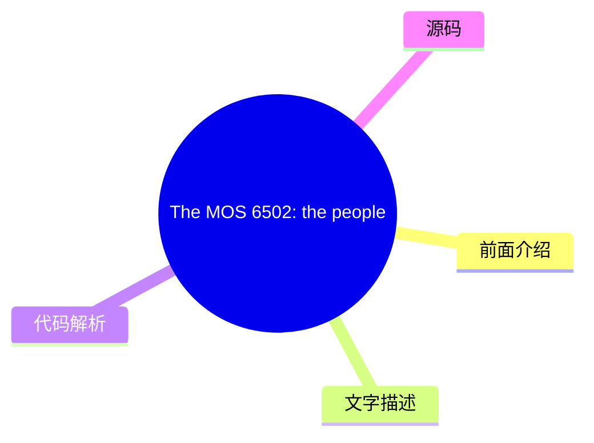
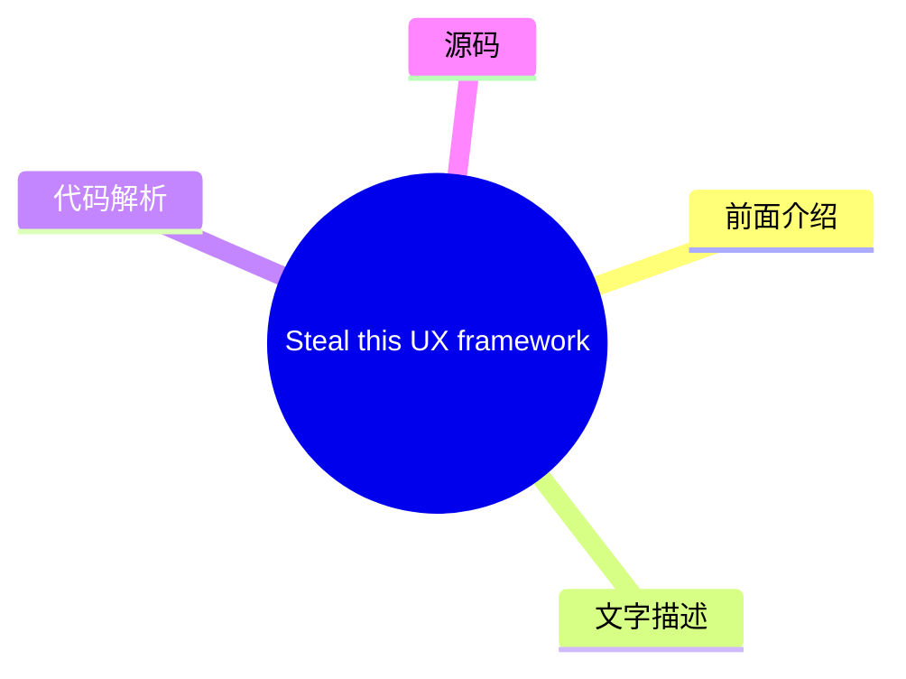
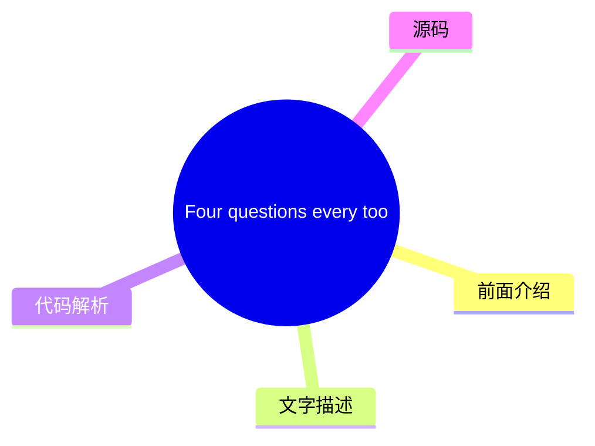
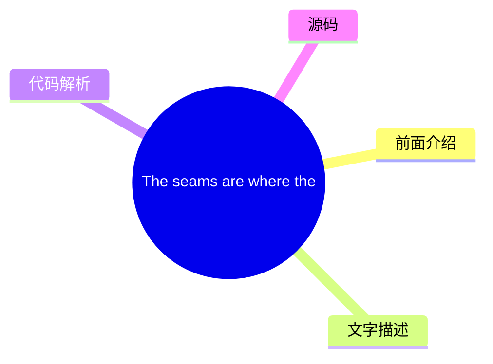
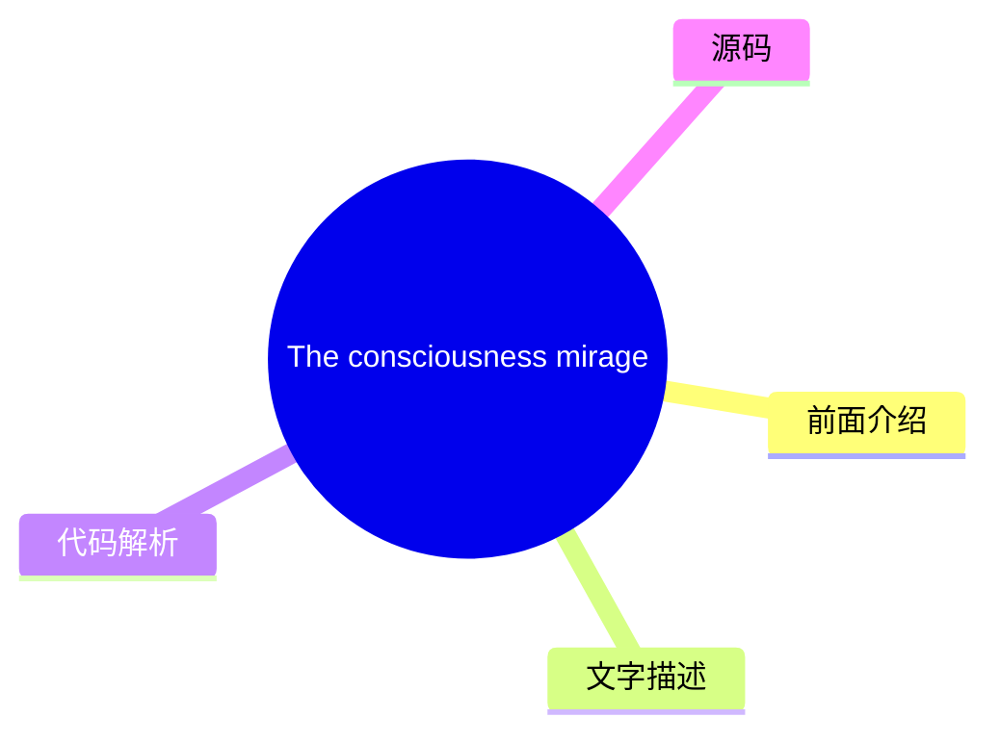

# ✏️ UX Collective Top 8 (2026-07-29)

## 前面介绍

- 数据源：UX Collective
- 抓取日期：2026-07-29
- 条目数：8
- 含完整正文：8
- 含代码片段：0
- 组织方式：前面介绍 / 树状图 / 文字描述 / 代码解析 / 源码

## 思维导图

```mermaid
mindmap
  root((UX Collective))
    The MOS 6502: the people’s p
    Steal this UX framework from
    Four questions every tool sh
    Information architecture is 
    Your website is boring (but 
    The seams are where the syst
    From frictionless to meaning
    The consciousness mirage in 
```

## 详细整理（8 条，8 条含全文，0 条含代码）

### 1. The MOS 6502: the people’s princess
- **链接**: [https://uxdesign.cc/the-mos-6502-the-peoples-princess-0a2f99409834?source=rss----138adf9c44c---4](https://uxdesign.cc/the-mos-6502-the-peoples-princess-0a2f99409834?source=rss----138adf9c44c---4)
- **作者**: Neel Dozome
- **发布**: Tue, 28 Jul 2026 22:21:13 GMT

#### 前面介绍

- The impact of blending arcade game UI concepts with the power of affordable 1970s calculator chipsContinue reading on UX Collective »
- 作者：Neel Dozome
- 发布时间：Tue, 28 Jul 2026 22:21:13 GMT

#### 树状图



#### 文字描述

- Member-only story
- # The MOS 6502: the people’s princess
- ## The impact of blending arcade game UI concepts with the power of affordable 1970s calculator chips. On the cover of the January, 1975 edition of *Popular Electronics* was a model that set hearts aflame and pulses racing — at least, in our corner of geekdom. The magazine announced a major breakthrough in consumer electronics that was being eagerly anticipated: the first affor

#### 代码解析

- 本文未检测到明确代码块，内容更偏新闻、观点或方法论。

#### 源码

#### 中文节选

Member-only story

# The MOS 6502: the people’s princess

## The impact of blending arcade game UI concepts with the power of affordable 1970s calculator chips.

On the cover of the January, 1975 edition of *Popular Electronics* was a model that set hearts aflame and pulses racing — at least, in our corner of geekdom. The magazine announced a major breakthrough in consumer electronics that was being eagerly anticipated: the first affordable, commercial personal computer. The device that promised to end waiting times for time-share slices on a mainframe to check if a computer programme worked or paying a king’s ransom to own a machine.

Named after a real star (but referenced in a Star Trek episode as a planet), it was called the “[ALTAIR 8800](https://en.wikipedia.org/wiki/Altair_8800)”.

In fact,[ the Altair 8800 owed inspiration to  Popular Electronics](https://www.nutsvolts.com/magazine/article/micro_memories_200301)

*.*As the publication of record of the period’s technology scene, the magazine’s technical editor Les Soloman was inundated by with pitches about experimental garage computers. To evaluate these pitches, Solomon corresponded with an engineer and entrepreneur he trusted named Ed Roberts.

#### 完整正文（中文）

Member-only story

# The MOS 6502: the people’s princess

## The impact of blending arcade game UI concepts with the power of affordable 1970s calculator chips.

On the cover of the January, 1975 edition of *Popular Electronics* was a model that set hearts aflame and pulses racing — at least, in our corner of geekdom. The magazine announced a major breakthrough in consumer electronics that was being eagerly anticipated: the first affordable, commercial personal computer. The device that promised to end waiting times for time-share slices on a mainframe to check if a computer programme worked or paying a king’s ransom to own a machine.

Named after a real star (but referenced in a Star Trek episode as a planet), it was called the “[ALTAIR 8800](https://en.wikipedia.org/wiki/Altair_8800)”.

In fact,[ the Altair 8800 owed inspiration to  Popular Electronics](https://www.nutsvolts.com/magazine/article/micro_memories_200301)

*.*As the publication of record of the period’s technology scene, the magazine’s technical editor Les Soloman was inundated by with pitches about experimental garage computers. To evaluate these pitches, Solomon corresponded with an engineer and entrepreneur he trusted named Ed Roberts.


### 2. Steal this UX framework from Dubai’s most over-the-top hotel
- **链接**: [https://uxdesign.cc/steal-this-ux-framework-from-dubais-most-over-the-top-hotel-0b14f71e46e5?source=rss----138adf9c44c---4](https://uxdesign.cc/steal-this-ux-framework-from-dubais-most-over-the-top-hotel-0b14f71e46e5?source=rss----138adf9c44c---4)
- **作者**: Slava Polonski, PhD
- **发布**: Thu, 23 Jul 2026 21:48:28 GMT

#### 前面介绍

- Stop studying apps. Study hotels. A Google UX researcher&#x2019;s field notes on the hidden UX of hospitality.Continue reading on UX Collective »
- 作者：Slava Polonski, PhD
- 发布时间：Thu, 23 Jul 2026 21:48:28 GMT

#### 树状图



#### 文字描述

- Member-only story **Steal this UX framework from Dubai’s most over-the-top hotel**
- ## The invisible man at the chocolate fountain If you have ever used a chocolate fountain, you know the physics. The chocolate is thin. It drips. A child holding a skewer of marshmallows is a guaranteed spill. The counter around one of these should look like a crime scene by nine o’clock. This one never did. Five ribbons ran at once: pistachio, raspberry, milk, white, and dark,

#### 代码解析

- 本文未检测到明确代码块，内容更偏新闻、观点或方法论。

#### 源码

#### 中文节选

Member-only story

**Steal this UX framework from Dubai’s most over-the-top hotel**

## The invisible man at the chocolate fountain

If you have ever used a chocolate fountain, you know the physics. The chocolate is thin. It drips. A child holding a skewer of marshmallows is a guaranteed spill. The counter around one of these should look like a crime scene by nine o’clock.

This one never did. Five ribbons ran at once: pistachio, raspberry, milk, white, and dark, and all week the marble around it stayed spotless. It took me three nights to work out why, and when I did, I realized I had been staring at the best piece of user-experience design in the whole resort. I’ll come back to this observation later.

We had come to [Atlantis The Palm](https://www.atlantis.com/dubai) for a week, one of the most lavish hotels in the world. If you have never been, a quick word on the place. It is located on the outer crescent of [Palm Jumeirah](https://en.wikipedia.org/wiki/Palm_Jumeirah), the artificial palm-shaped island off Dubai you can pick out from space. It is less a hotel than a small city: its own [waterpark](https://www.atlantis.com/dubai/aquaventure-waterpark), its own [aquarium](https://www.atlantis.com/dubai/marine-and-waterpark/the-lost-chambers-aquarium), and a strip of restaurants that has quietly become a culinary heavyweight. The wider Atlantis Dubai resort it anchors…

#### 完整正文（中文）

Member-only story

**Steal this UX framework from Dubai’s most over-the-top hotel**

## The invisible man at the chocolate fountain

If you have ever used a chocolate fountain, you know the physics. The chocolate is thin. It drips. A child holding a skewer of marshmallows is a guaranteed spill. The counter around one of these should look like a crime scene by nine o’clock.

This one never did. Five ribbons ran at once: pistachio, raspberry, milk, white, and dark, and all week the marble around it stayed spotless. It took me three nights to work out why, and when I did, I realized I had been staring at the best piece of user-experience design in the whole resort. I’ll come back to this observation later.

We had come to [Atlantis The Palm](https://www.atlantis.com/dubai) for a week, one of the most lavish hotels in the world. If you have never been, a quick word on the place. It is located on the outer crescent of [Palm Jumeirah](https://en.wikipedia.org/wiki/Palm_Jumeirah), the artificial palm-shaped island off Dubai you can pick out from space. It is less a hotel than a small city: its own [waterpark](https://www.atlantis.com/dubai/aquaventure-waterpark), its own [aquarium](https://www.atlantis.com/dubai/marine-and-waterpark/the-lost-chambers-aquarium), and a strip of restaurants that has quietly become a culinary heavyweight. The wider Atlantis Dubai resort it anchors…


### 3. Four questions every tool should answer (even Figma) about AI training model usage
- **链接**: [https://uxdesign.cc/the-trust-test-four-questions-every-tool-should-answer-even-figma-about-ai-training-model-usage-4f1150f91a30?source=rss----138adf9c44c---4](https://uxdesign.cc/the-trust-test-four-questions-every-tool-should-answer-even-figma-about-ai-training-model-usage-4f1150f91a30?source=rss----138adf9c44c---4)
- **作者**: Patrick Neeman
- **发布**: Thu, 23 Jul 2026 21:43:32 GMT

#### 前面介绍

- 作者：Patrick Neeman
- 发布时间：Thu, 23 Jul 2026 21:43:32 GMT

#### 树状图



#### 文字描述

- # Four questions every tool should answer (even Figma) about AI training model usage
- ## Figma’s class action is not really about copyright, it is about defaults and they are a design decision your team makes. Here’s a test you can apply. *Disclaimer: **I am not a lawyer; I don’t even own a suit. I did spend eight years in legal technology, which qualifies me to play one poorly on Law and Order and nothing further. This not about the law, it’s about trust. Read 
- ## The Pattern Rhymes This has happened enough times to have a shape, AI or not. These are the AI cases. **In the summer of 2023, ****Zoom**** amended its terms of service to claim broad rights over customer data for training and tuning models.** Nobody noticed for months. When a technology blog surfaced the clause in August, The Record reported in [Zoom revises terms again to 
- ## The Sniff Test Four questions fall out of that pattern, worth naming with their scoring before we run them. - Consent - Symmetry - Disclosure - Exit A tool that passes all four treats your work as yours, and three passes is ordinary enough to be worth raising at renewal. But symmetry does not weigh the same as the rest, and a failure there counts for more than the other thre

#### 代码解析

- 本文未检测到明确代码块，内容更偏新闻、观点或方法论。

#### 源码

#### 中文节选

# Four questions every tool should answer (even Figma) about AI training model usage

## Figma’s class action is not really about copyright, it is about defaults and they are a design decision your team makes. Here’s a test you can apply.

*Disclaimer: **I am not a lawyer; I don’t even own a suit. I did spend eight years in legal technology, which qualifies me to play one poorly on Law and Order and nothing further. This not about the law, it’s about trust. Read on.*

In November 2025, Raza Khan, [a startup founder, sued Figma](https://news.bloomberglaw.com/litigation/figma-trained-ai-on-user-data-without-consent-class-action-says) in the Northern District of California. The complaint does not lead with copyright — it leads with consent, and with the claim that the company switched on model training over customer design files by default after years of promising otherwise.

Nothing in that case has been decided.

Figma disputes the allegations and says its training focuses on general patterns like, uh, creating [weather apps](https://www.theguardian.com/technology/article/2024/jul/03/figma-ai-app-creator-accused-of-ripping-off-apple-weather-app), rather than customer content.

Hold the legal question open, because that is where it belongs. The design question is not open, and it is not really a question about Figma. Somebody chose between opt-in and opt-out, and chose differently by plan tier. And that decision sits in public documentation [right now](https://www.figma.com/ai/our-approach/).

**Here is the part that matters: Designers are the users in this story of a company lead by, and we know precisely how it feels to have a default decided on our behalf.**

and his company should have a higher standard because where they sit in the public square; they are teaching designers through their actions.

We ship those same defaults to our own users every quarter. So this is a test with four questions, about twenty minutes of work, and it only counts if you turn it around so the users are treated with empathy and respect and not [dark patterns](https://www.nngroup.com/articles/deceptive-patterns/).

## The Pattern Rhymes


This has happened enough times to have a shape, AI or not. These are the AI cases.

**In the summer of 2023, ****Zoom**** amended its terms of service to claim broad rights over customer data for training and tuning models.** Nobody noticed for months. When a technology blog surfaced the clause in August, The Record reported in [Zoom revises terms again to say it doesn’t use customer data to train AI models](https://therecord.media/zoom-ai-terms-of-service-update) that the company rewrote the language twice inside a week.

**Nine months later it was ****Slack****.** A post on Hacker News pointed at the privacy principles page, and workspace owners learned they were enrolled by default in machine learning training on messages, content, and files. TechCrunch covered the reaction in [Slack under attack over sneaky AI training policy](ht

#### 完整正文（中文）

# Four questions every tool should answer (even Figma) about AI training model usage

## Figma’s class action is not really about copyright, it is about defaults and they are a design decision your team makes. Here’s a test you can apply.

*Disclaimer: **I am not a lawyer; I don’t even own a suit. I did spend eight years in legal technology, which qualifies me to play one poorly on Law and Order and nothing further. This not about the law, it’s about trust. Read on.*

In November 2025, Raza Khan, [a startup founder, sued Figma](https://news.bloomberglaw.com/litigation/figma-trained-ai-on-user-data-without-consent-class-action-says) in the Northern District of California. The complaint does not lead with copyright — it leads with consent, and with the claim that the company switched on model training over customer design files by default after years of promising otherwise.

Nothing in that case has been decided.

Figma disputes the allegations and says its training focuses on general patterns like, uh, creating [weather apps](https://www.theguardian.com/technology/article/2024/jul/03/figma-ai-app-creator-accused-of-ripping-off-apple-weather-app), rather than customer content.

Hold the legal question open, because that is where it belongs. The design question is not open, and it is not really a question about Figma. Somebody chose between opt-in and opt-out, and chose differently by plan tier. And that decision sits in public documentation [right now](https://www.figma.com/ai/our-approach/).

**Here is the part that matters: Designers are the users in this story of a company lead by, and we know precisely how it feels to have a default decided on our behalf.**

and his company should have a higher standard because where they sit in the public square; they are teaching designers through their actions.

We ship those same defaults to our own users every quarter. So this is a test with four questions, about twenty minutes of work, and it only counts if you turn it around so the users are treated with empathy and respect and not [dark patterns](https://www.nngroup.com/articles/deceptive-patterns/).

## The Pattern Rhymes


This has happened enough times to have a shape, AI or not. These are the AI cases.

**In the summer of 2023, ****Zoom**** amended its terms of service to claim broad rights over customer data for training and tuning models.** Nobody noticed for months. When a technology blog surfaced the clause in August, The Record reported in [Zoom revises terms again to say it doesn’t use customer data to train AI models](https://therecord.media/zoom-ai-terms-of-service-update) that the company rewrote the language twice inside a week.

**Nine months later it was ****Slack****.** A post on Hacker News pointed at the privacy principles page, and workspace owners learned they were enrolled by default in machine learning training on messages, content, and files. TechCrunch covered the reaction in [Slack under attack over sneaky AI training policy](https://techcrunch.com/2024/05/17/slack-under-attack-over-sneaky-ai-training-policy/), including the detail that turned irritation into anger: opting out meant emailing a specific address with a specific subject line, and only a workspace owner could send it.

No toggle, no setting.

The terms had been live since at least September 2023, and Slack rewrote the language within days while saying it had changed no practice, which was true and beside the point. Fresh ink on their hands.


This has happened enough times to have a shape, and it doesn’t feel good.

**Then June 2024. Adobe pushed a re-acceptance modal, creators read the license language, and the company spent two weeks walking it back. **Its own post, [Updating Adobe’s Terms of Use](https://blog.adobe.com/en/publish/2024/06/10/updating-adobes-terms-of-use), conceded the terms needed to be more precise.

Adobe’s defaults were never the problem; its wording was. The company lost weeks of trust without doing the thing it stood accused of, which tells you that trust does not track behavior. It tracks what people can read and verify.

Slack is its own category, and the one worth studying. Zoom and Adobe reversed. Slack did not: it rewrote the sentence and kept the mechanism, which is a different move wearing the same clothes.


Trust is not a feeling, it is a set of defaults you can audit, and Zoom and Adobe both recovered inside a fortnight because reversal was available to them — a sentence to fix, a toggle to flip, a correction to make in public. Slack fixed the sentence only, and the email address is still the exit.

Same script every time.

- A policy change lands quietly.
- Enrollment is the default.
- Somebody outside the company finds it.
- Then the clarification, the apology, and sometimes the walk-back.

It feels a lot like [Fight Club](https://www.imdb.com/title/tt0137523/), where the companies are calculating risk and reward.

“My job was to apply the formula: Take the number of vehicles in the field, A, multiply it by the probable rate of failure, B, multiply the result by the average out-of-court settlement, C. A times B times C equals X. If X is less than the cost of a recall, we don’t do one.”


Sounds like consent spirit, read like this:

“My job was to apply the formula: Take the number of users whose data we ingested, A, multiply it by the probable rate of anyone noticing, B, multiply that by the average settlement per claim, C. A times B times C equals X. If X is less than the cost of building a real consent flow, we don’t build one.”


**What is different about Figma is that nothing was walked back at all, and the discovery arrived as a federal complaint.** There was no drafting error to fix. The tiered default was announced, explained, defended with a stated rationale, and allowed to take effect on schedule. You cannot clarify a decision that was already clear.

## The Sniff Test

Four questions fall out of that pattern, worth naming with their scoring before we run them.

- Consent
- Symmetry
- Disclosure
- Exit

A tool that passes all four treats your work as yours, and three passes is ordinary enough to be worth raising at renewal. But symmetry does not weigh the same as the rest, and a failure there counts for more than the other three combined.

### Test One: Consent

The question is not whether a tool told you. It is whether the switch was off when you got there.


Figma’s announcement, [Meet Figma AI](https://www.figma.com/blog/introducing-figma-ai/), is unusually direct. Published in June 2024, it states that sharing customer content for training is optional, that admins set the preference, and that Starter and Professional plans are opted in by default, with no training before August 15, 2024. That is seven weeks of notice, published openly, with the mechanism described.

That is more transparency than Zoom or Slack managed.

Slack buried its terms in a privacy policy and answered discovery with an email address.

Figma published a date.

It is still opt-out.

Notice is not consent.

A seven-week window before a default takes effect is a courtesy, and a real one, but it puts the burden of refusal on the person whose work is at stake. Consent that has to be revoked was never asked for. It was assumed, announced, and then made cancellable.


Consent that has to be revoked was never asked for. It was assumed, announced, and then made cancellable.

The research on this is settled. Nielsen Norman Group’s [Sneaking: The Deceptive UX Pattern You Never Saw Coming](https://www.nngroup.com/articles/sneaking/) catalogs the family of practices that get someone to agree to something they never intended, and the finding is not an ethical one so much as an accounting one: sneaking converts, and it costs long-term trust at a rate that outruns the gain.

Designers know the pattern because we build it — the pre-checked box, the bundled permission at install, the subscription folded into account creation. We have spent two decades publishing research on why these patterns are hostile, then shipping them anyway when a growth target needed hitting.

 has spent the last stretch of his career arguing this is the job rather than a footnote to it. [Design for a Better World](https://www.amazon.com/Design-Better-World-Meaningful-Sustainable/dp/0262047950) presses designers to widen the frame past the person at the screen and treat a shipped decision’s consequences as their own. A default is exactly that kind of decision. It gets made once, by a few people in one room, and applies to millions who will never meet them.


The standard that produced the opt-out default was whether it would survive legal review. Ours is narrower and harder: what is right for the person whose work this is. The two agree most of the time, which is why the gap goes unnoticed until a quarter when they do not.

Run it this way. Open the tool, find the training setting, and look at its state.

If it is on and you did not turn it on, the company made a decision about your work and told you afterward.

### Test Two: Symmetry

Here is where it stops being an ordinary default and starts being a statement. Figma’s engineering explainer, [Building Figma AI](https://www.figma.com/ai/our-approach/), lays out the tiering plainly.

**Content training defaults to on for Starter and Professional, off for Organization and Enterprise.** That’s a pretty clear statement and the stated reason is that agreements with Organization and Enterprise are typically more complex and include specific requirements and restrictions.

Read that again, because it is the most important sentence in the whole episode and Figma published it voluntarily. What it says is this: we understood the setting carried contractual risk, so for customers who had negotiated terms making that risk explicit we defaulted to off, and for everyone else we defaulted to on.

Then read the consequence, which sits in Figma’s own [registration statement](https://www.sec.gov/Archives/edgar/data/1579878/000162828025035381/figma-sx1a.htm): roughly seventy percent of new Organization and Enterprise customers included at least one person who had previously been on a Professional plan. The protected tier is grown from the enrolled one. The designer whose files trained the models on a Professional account is the same designer who later brings her company onto an Enterprise contract and receives the protective default as a welcome gift.


The asymmetry is not evidence of bad faith. It is evidence of accurate risk assessment.

Bad faith is a mistake you can apologize for. This was a correct read of where leverage sat, followed by placing the exposure where it was least likely to generate a lawsuit.

That calculation was wrong by about seventeen months.


The underlying premise does not hold either. A freelance designer working under a client nondisclosure agreement is not carrying less confidentiality risk than a company with a master services agreement. She carries the same risk with a thinner contract and no procurement team. The obligation is identical.

The direct version: this was not morally right, and it does not respect designers.

Set the litigation aside and assume Figma wins outright. The tiering still sits in the published record, put there by the company itself: customers with procurement departments get protected, customers without them get enrolled. That is a judgment about whose work matters, made by a company whose business is the work of designers.

Leverage is not a moral category. Bargaining power tells you what a customer can force you to do, and nothing at all about what you owe her, which is why we do not let doctors calibrate care to a patient’s ability to sue.

Symmetry is the best question in the test because it is hardest to explain away. A single default applied to everyone might be a philosophy. Two defaults split along a payment line approved by legal is a position on who is worth protecting.

### Test Three: Disclosure

The third question 

...（截断，原文 23168+ 字符）


### 4. Information architecture is the foundation AI is starving for
- **链接**: [https://uxdesign.cc/information-architecture-is-the-foundation-artificial-intelligence-is-starving-for-1d91fb5bf59f?source=rss----138adf9c44c---4](https://uxdesign.cc/information-architecture-is-the-foundation-artificial-intelligence-is-starving-for-1d91fb5bf59f?source=rss----138adf9c44c---4)
- **作者**: Patrick Neeman
- **发布**: Sun, 26 Jul 2026 19:28:45 GMT

#### 前面介绍

- 作者：Patrick Neeman
- 发布时间：Sun, 26 Jul 2026 19:28:45 GMT

#### 树状图


#### 文字描述

- # Information architecture is the foundation AI is starving for
- ## Every AI problem you chase — hallucinations, wrong answers, poor retrieval — traces back to the IA projects you never funded. Now’s the time to fund them. For twenty years, information architecture was the discipline nobody funded. The job titles disappeared—I was one back in the day—and now it’s an art (and science) that needs to return. Teams didn’t align. Companies starte
- ## Retrieval Is Only as Good as What It Starts With Most teams treat retrieval as a solved problem. Point the model at your content, let it pull the relevant passages, generate an answer. The technique has a name — retrieval-augmented generation, or RAG — and a foundational paper, [Retrieval-Augmented Generation for Knowledge-Intensive NLP Tasks](https://arxiv.org/abs/2005.1140
- ## Structure Is How a Model Knows What Something Is A price, a policy, a deprecated note, and a customer quote can read as similar strings of text and mean opposite things. A person skims the surrounding page and knows which is which. A model, handed the same four snippets with no scaffolding, sees four passages of plausible language and no reason to rank one above another. Met

#### 代码解析

- 本文未检测到明确代码块，内容更偏新闻、观点或方法论。

#### 源码

#### 中文节选

# Information architecture is the foundation AI is starving for

## Every AI problem you chase — hallucinations, wrong answers, poor retrieval — traces back to the IA projects you never funded. Now’s the time to fund them.

For twenty years, information architecture was the discipline nobody funded. The job titles disappeared—I was one back in the day—and now it’s an art (and science) that needs to return. Teams didn’t align. Companies started showing their underwear.

Doing it well is less about structure than about getting an organization to agree on one way to name and arrange things. Every team brings its own vocabulary, so aligning them is slow, political, and thankless, and it loses every quarter to whatever ships a feature. The work stayed invisible, and so did its failures.

**Then AI arrived, and the invisible foundation showed up on the balance sheet.**

The same gaps that once cost you a confused visitor now cost you a hallucination, a wrong answer, or an agent that confidently retrieves garbage and acts on it. In a 2025 survey, [data quality and availability top the list of AI adoption barriers](https://www.aidataanalytics.network/data-science-ai/news-trends/data-quality-availability-top-list-of-ai-adoption-barriers), outranking every other obstacle.

The failures didn’t get worse; they got visible, repeatable, and expensive.

Simply said, poor information architecture can now be measured in token costs. A lot of them.


You can buy a better model, tune a sharper prompt, and stack another evaluation layer, and you will still serve wrong answers, because the model retrieves from a pile nobody agreed how to organize.

**You need to fix the foundation before you pay for it a second time.**

## Retrieval Is Only as Good as What It Starts With

Most teams treat retrieval as a solved problem. Point the model at your content, let it pull the relevant passages, generate an answer.


The technique has a name — retrieval-augmented generation, or RAG — and a foundational paper, [Retrieval-Augmented Generation for Knowledge-Intensive NLP Tasks](https://arxiv.org/abs/2005.11401), and the mechanism is exactly what it sounds like: the model grounds its answer in documents it fetches at query time instead of relying only on what it memorized in training, limiting the retrieval set.

That mechanism inherits every flaw in the pile it fetches from.

If your content store is a flat heap of unstructured, unlabeled, contradictory documents, retrieval doesn’t work. It finds the loudest match — the one that shares the most surface words with the query, regardless of whether it is current, authoritative, or true.


It finds the loudest match — the one that shares the most surface words with the query, regardless of whether it is current, authoritative, or true.

Information architecture is what makes “the right one” a thing that exists in the first place. Organization schemes, labeling, and navigation aren’t decoration on top of content; they are the differenc

#### 完整正文（中文）

# Information architecture is the foundation AI is starving for

## Every AI problem you chase — hallucinations, wrong answers, poor retrieval — traces back to the IA projects you never funded. Now’s the time to fund them.

For twenty years, information architecture was the discipline nobody funded. The job titles disappeared—I was one back in the day—and now it’s an art (and science) that needs to return. Teams didn’t align. Companies started showing their underwear.

Doing it well is less about structure than about getting an organization to agree on one way to name and arrange things. Every team brings its own vocabulary, so aligning them is slow, political, and thankless, and it loses every quarter to whatever ships a feature. The work stayed invisible, and so did its failures.

**Then AI arrived, and the invisible foundation showed up on the balance sheet.**

The same gaps that once cost you a confused visitor now cost you a hallucination, a wrong answer, or an agent that confidently retrieves garbage and acts on it. In a 2025 survey, [data quality and availability top the list of AI adoption barriers](https://www.aidataanalytics.network/data-science-ai/news-trends/data-quality-availability-top-list-of-ai-adoption-barriers), outranking every other obstacle.

The failures didn’t get worse; they got visible, repeatable, and expensive.

Simply said, poor information architecture can now be measured in token costs. A lot of them.


You can buy a better model, tune a sharper prompt, and stack another evaluation layer, and you will still serve wrong answers, because the model retrieves from a pile nobody agreed how to organize.

**You need to fix the foundation before you pay for it a second time.**

## Retrieval Is Only as Good as What It Starts With

Most teams treat retrieval as a solved problem. Point the model at your content, let it pull the relevant passages, generate an answer.


The technique has a name — retrieval-augmented generation, or RAG — and a foundational paper, [Retrieval-Augmented Generation for Knowledge-Intensive NLP Tasks](https://arxiv.org/abs/2005.11401), and the mechanism is exactly what it sounds like: the model grounds its answer in documents it fetches at query time instead of relying only on what it memorized in training, limiting the retrieval set.

That mechanism inherits every flaw in the pile it fetches from.

If your content store is a flat heap of unstructured, unlabeled, contradictory documents, retrieval doesn’t work. It finds the loudest match — the one that shares the most surface words with the query, regardless of whether it is current, authoritative, or true.


It finds the loudest match — the one that shares the most surface words with the query, regardless of whether it is current, authoritative, or true.

Information architecture is what makes “the right one” a thing that exists in the first place. Organization schemes, labeling, and navigation aren’t decoration on top of content; they are the difference between a store where the correct answer is findable and a store where it sits buried next to four contradictory drafts of itself. The model can’t reach past the structure you gave it. If you never gave it one, it reaches for whatever is nearest.

This is the foundational claim, and everything else stacks on it. A retrieval system is a findability system. You have been building — or neglecting — findability systems for years.

## Structure Is How a Model Knows What Something Is

A price, a policy, a deprecated note, and a customer quote can read as similar strings of text and mean opposite things. A person skims the surrounding page and knows which is which. A model, handed the same four snippets with no scaffolding, sees four passages of plausible language and no reason to rank one above another.

Metadata, taxonomy, and content typing are what let a system tell authoritative from anecdotal, current from expired, official from speculative.


This is the work Lou Rosenfeld,  and  spent careers formalizing in [Information Architecture: For the Web and Beyond](https://www.amazon.com/Information-Architecture-Beyond-Louis-Rosenfeld/dp/1491911689) — organization, labeling, and the semantic structures that let people, and now machines, understand what a piece of content is before acting on it.

The industry has a newer name for that same scaffolding — the [semantic layer](https://en.wikipedia.org/wiki/Semantic_layer), the governed set of definitions, types, and relationships that sits between raw content and the systems reading it.

Call it a taxonomy, an ontology or a semantic layer, the job is identical — telling a machine what a thing is and how it relates to other things.


Two mechanisms do most of that work. Controlled vocabularies — a fixed, agreed set of terms for the same thing — hold the language steady, so that “cancelled,” “canceled,” “terminated,” and “closed” don’t fracture one concept into four the system treats as unrelated.

They prevent the slow drift that creeps in when every team names things its own way, and they give the model a strict, consistent language to match against instead of a moving target. Structured metadata does the rest: it is the scaffolding the system leans on, the tags and fields that mark what is current, what is canonical, and how one thing relates to another, so retrieval has something to reason over besides raw text.

That vocabulary earns its keep on the input side, too. You can normalize the instruction before it reaches retrieval — mapping a user’s “refund,” “money back,” and “reimbursement” onto the one preferred term the content is filed under — so the query and the store speak the same controlled language instead of guessing at each other. Structure the content, then bring the question to it.

Strip that scaffolding away and the model can’t separate signal from noise, because nothing ever told it which was which.


This escalates the first claim. Reason one was about finding the right document. This is about the system understanding what the document even is — and understanding is not something you can prompt your way into after the fact. It has to be in the structure.

## Ambiguity Doesn’t Get Resolved — It Gets Amplified.

People are forgiving of messy structure. Faced with a vague label or a half-right category, a person uses judgment to fill the gap, works around it, and moves on. That tolerance hid the cost of bad information architecture for two decades. It also let teams believe the mess was fine, because a human was always there to absorb it.

Models remove the human from that loop. They don’t fill gaps with judgment; they pattern-match over the mess and reproduce it at scale, confidently.


They don’t fill gaps with judgment; they pattern-match over the mess and reproduce it at scale, confidently.

A vague label a person would have quietly corrected becomes a systematic wrong answer served to thousands who have no idea the source was ambiguous. The [World Quality Report 2025](https://www.prnewswire.com/news-releases/world-quality-report-2025-ai-adoption-surges-in-quality-engineering-but-enterprise-level-scaling-remains-elusive-302614772.html) found hallucination and reliability concerns among the top barriers enterprises named, with only 15 percent reporting generative AI deployed at enterprise scale.

This is the turn in the argument.

Bad information architecture used to cost you one confused user at a time, a cost so diffuse nobody bothered to name it.

Now it costs you an automated, repeated, confident failure — the same wrong answer, generated fresh for every person who asks.

The mess didn’t change. The blast radius did.

## Agents Need Structure to Act, Not Just to Answer


Retrieval is the easy case. Answering a question wrong is embarrassing; taking an action wrong is a liability. The moment an agent stops retrieving and starts doing — routing a ticket, updating a record, approving a request, calling another system — it needs more than the right passage. It needs to know relationships, hierarchies, and boundaries: what belongs to what, what depends on what, what it is allowed to touch and what it is not.

That is information architecture functioning as an operating model, not a filing system — which is what the semantic layer is meant to be for agents: the governed encoding of what belongs to what, what depends on what, and what an agent is allowed to touch.

Agents need more context than humans and the semantic layer provides that.

A taxonomy that once organized help articles now governs which actions are valid against which objects. I made this case at length in an earlier piece on the semantic layer as agent infrastructure — the structures we built to make content findable are the same structures agents need to act safely.


A wrong answer erodes trust. A wrong action moves money, changes records, and triggers systems downstream that assume it was correct.

An agent with no model of these relationships doesn’t refuse to act. It acts anyway, on the flat and ambiguous picture it was handed, with the same confidence it brings to everything. A wrong answer erodes trust. A wrong action moves money, changes records, and triggers systems downstream that assume it was correct.

This already has a price tag, even before an agent acts. In [Moffatt v. Air Canada](https://canlii.ca/t/k2spq), the airline’s support chatbot told a grieving customer he could claim a bereavement fare retroactively — the opposite of what Air Canada’s own bereavement policy page said. The chatbot even linked to the page that contradicted it. When the customer relied on the answer and was refused, a British Columbia tribunal held the airline liable and ordered it to pay, rejecting the claim that the chatbot was a separate entity responsible for its own words.


Two pages of one site said opposite things, and nothing reconciled them. That was a chatbot that only answered. Give an agent like it the power to act, and the same unreconciled structure starts moving money on its own.

This raises the stakes one more level. Reason three was about wrong answers at scale. This is about wrong actions at scale — and actions don’t ship with a disclaimer that the underlying structure was a guess.

## This Is How Information Architecture Finally Gets Funded

Every reason so far converts a formerly invisible cost into a now-visible outcome. Findability becomes retrieval accuracy. Typing becomes hallucination rate. Structure becomes agent reliability and time to deploy. The discipline didn’t change. The balance sheet did.

That reframe changes who is willing to pay for it. Information architecture never won budget when its return was “fewer confused users,” a number nobody could put on a slide.

It wins budget when its return is “the AI initiative already on the roadmap doesn’t fail.”

Enterprises spent $37 billion on generative AI in 2025, up from 11.5 billion the year before, per Menlo Ventures’ [State of Generative AI in the Enterprise](https://menlovc.com/perspective/2025-the-state-of-generative-ai-in-the-enterprise/) — and much of that spend rides on retrieval and grounding that only work if the underlying content is organized.

The gain is measurable, not hand-waved: Anthropic’s [Contextual Retrieval](https://www.anthropic.com/engineering/contextual-retrieval) work found that adding the context that situates each chunk before indexing it cut failed retrievals by up to 49 percent — a reliability number produced by fixing content, not by swapping models.

That is the semantic layer earning a budget line: structure priced as retrieval accuracy rather than as tidy content.


Fund the foundation, or keep paying for it downstream in failed retrievals, eroded trust, and pilots that never reach production.

So stop framing information architecture as hygiene and start framing it as the precondition it has become. It is no longer a librarian’s luxury or a cleanup task that slips every quarter. Fund the foundation, or keep 


...（截断，原文 16215+ 字符）


### 5. Your website is boring (but that might just set it free)
- **链接**: [https://uxdesign.cc/your-website-is-boring-but-that-might-just-set-it-free-f2b13863e22c?source=rss----138adf9c44c---4](https://uxdesign.cc/your-website-is-boring-but-that-might-just-set-it-free-f2b13863e22c?source=rss----138adf9c44c---4)
- **作者**: Sam Belt
- **发布**: Sun, 26 Jul 2026 14:19:22 GMT

#### 前面介绍

- 作者：Sam Belt
- 发布时间：Sun, 26 Jul 2026 14:19:22 GMT

#### 树状图

```mermaid
mindmap
  root((Your website is boring ())
    前面介绍
    文字描述
    代码解析
    源码
```

#### 文字描述

- # Your website is boring (but that might just set it free)
- ## It’s time to shake off the grip of the templated web and celebrate a world of Brand x Code Thanks to a combination of Napster and my parents’ AOL account, I started designing websites when I was a teenager. And since then, I have been lucky enough to work for some of the best design companies and most loved brands in the world. All of that, I think, makes me qualified to say

#### 代码解析

- 本文未检测到明确代码块，内容更偏新闻、观点或方法论。

#### 源码

#### 中文节选

# Your website is boring (but that might just set it free)

## It’s time to shake off the grip of the templated web and celebrate a world of Brand x Code

Thanks to a combination of Napster and my parents’ AOL account, I started designing websites when I was a teenager. And since then, I have been lucky enough to work for some of the best design companies and most loved brands in the world. All of that, I think, makes me qualified to say: **websites are boring.**

I don’t believe we made them boring on purpose. But they are. For those of us working in product, we tried to make the web more efficient: mobile-first, conversion-optimised, accessibility-compliant, and SEO-friendly. Every decision that we made was rational, logical, what the business required. We optimised websites to be found and to convert, which, sadly, has made them optimised to be forgotten.

As strategists, particularly ones in brand and design, one of the fundamentals we are taught is that [differentiation ](https://www.kantar.com/inspiration/brands/get-an-equity-booster-how-meaningful-difference-supercharges-growth)is a key indicator of pricing power and [future growth ](https://www.kantar.com/campaigns/blueprint-for-brand-growth). And, as a recent [McKinsey study points out ](https://www.mckinsey.com/capabilities/growth-marketing-and-sales/our-insights/past-forward-the-modern-rethinking-of-marketings-core), a strong and recognisable brand has returned to the number-one priority for leaders precisely because it acts as an anchor for trust. Yet, despite all of that, the web increasingly looks the same.

The rise of Shopify, Squarespace, and Webflow templates didn’t only make it easy to build functional websites; they made it almost impossible to build anything else. It is easy to understand why this happened; templates solved massive engineering headaches, offering speed, reliability, and cost-efficiency that businesses desperately needed. But the result? Mass homogenisation. Three-column heroes. Identical PDPs. Checkout flows copy-pasted between competitors. Entire categories look identical because they’re literally using the same 12 templates.


And while in some sectors there may be good excuses for this (regulation, global scale), overall it feels like the last decade has been one where we have sacrificed too many moments of differentiation at the altar of conversion. We chose click-through safety over the risk of brand presence because the tools made the path easy and proven. Now, with the rise of AI in all its different forms, unless we begin to think more critically about the true nature of brand experiences and the web, AI will reduce us even further to commodities. And this time, it’s going to be much worse than what has come before.

Voice and agentic search are just the visible edge of a broader shift in how people find and evaluate things. While we aren’t quite sure just yet what behaviour will win out, the new patterns are clear: we’re moving toward a different eval

#### 完整正文（中文）

# 你的网站很无聊（但这可能正是它的自由）

## 是时候摆脱模板化网络的束缚，庆祝品牌与代码共存的世界了

得益于 Napster 和我父母的 AOL 账号的结合，我在十几岁时就开始设计网站了。从那时起，我很幸运能为世界上一些顶尖的设计公司和最受喜爱的品牌工作。我认为，这一切都让我有资格说：**网站很无聊。**

我不认为我们是有意让它们变得无聊的。但它们确实很无聊。对于我们从事产品工作的人来说，我们试图让网络更高效：优先考虑移动端、优化转化率、符合无障碍标准、并利于 SEO。我们所做的每一个决定都是理性的、合乎逻辑的，也是业务所要求的。我们优化网站以便被发现和转化，可悲的是，这反而让它们变得容易被遗忘。

作为战略家，特别是品牌和设计领域的战略家，我们被教导的基本原则之一是，[差异化](https://www.kantar.com/inspiration/brands/get-an-equity-booster-how-meaningful-difference-supercharges-growth)是定价能力和[未来增长](https://www.kantar.com/campaigns/blueprint-for-brand-growth)的关键指标。正如最近一项[麦肯锡研究指出的那样](https://www.mckinsey.com/capabilities/growth-marketing-and-sales/our-insights/past-forward-the-modern-rethinking-of-marketings-core)，强大的、可识别的品牌之所以重新成为领导者的首要任务，正是因为它充当了信任的锚点。然而，尽管如此，网络却越来越千篇一律。

Shopify、Squarespace 和 Webflow 模板的兴起不仅让构建功能性网站变得容易；它们几乎让构建其他任何东西变得不可能。不难理解为什么会发生这种情况；模板解决了巨大的工程难题，提供了企业迫切需要的速度、可靠性和成本效益。但结果呢？大规模的同质化。三栏式的首屏。一模一样的产品详情页（PDP）。竞争对手之间复制粘贴的结账流程。整个类别看起来都一模一样，因为它们实际上使用的是完全相同的 12 个模板。

And while in some sectors there may be good excuses for this (regulation, global scale), overall it feels like the last decade has been one where we have sacrificed too many moments of differentiation at the altar of conversion. We chose click-through safety over the risk of brand presence because the tools made the path easy and proven. Now, with the rise of AI in all its different forms, unless we begin to think more critically about the true nature of brand experiences and the web, AI will reduce us even further to commodities. And this time, it’s going to be much worse than what has come before.

Voice and agentic search are just the visible edge of a broader shift in how people find and evaluate things. While we aren’t quite sure just yet what behaviour will win out, the new patterns are clear: we’re moving toward a different evaluation paradigm, turning to agents and LLMs for anything and everything.


The economics are predicted to be massive. Agentic commerce could generate $1 trillion in the US B2C retail market alone by 2030, with [global projections ](https://www.mckinsey.com/capabilities/quantumblack/our-insights/the-agentic-commerce-opportunity-how-ai-agents-are-ushering-in-a-new-era-for-consumers-and-merchants)reaching $3–5 trillion, moving faster than any previous commerce revolution. All of that is supported by some pretty shocking numbers. [58% of Gen Z and millennials trust ](https://www.emarketer.com/content/faq-on-agentic-commerce-how-brands-should-act-now-compete-ai-driven-landscape)an AI agent to compare prices and recommend options. In the UAE, [85% of consumers already use AI tools for shopping ](https://ae.visamiddleeast.com/en_AE/about-visa/newsroom/press-releases/prl-09062026.html), and 93% feel AI makes online shopping easier. And just this week, *The New York Times *published an [opinion piece ](https://www.nytimes.com/2026/07/08/opinion/ai-google-gemini-search-questions.html?utm_campaign=likeshopme&utm_content=ig-nytopinion&utm_medium=instagram&utm_source=dash+hudson)highlighting that 60% of searches now end without a single click, “ *compressing what used to be a meandering journey through the internet into an immediate arrival at your destination *“.

We are trading the possibility of sensory-rich, interactive, and human-first brand experiences for the sterile, fluorescent aisles of a self-checkout warehouse. Yes, the warehouse is efficient. But nobody falls in love with a warehouse.

All of this demonstrates how AI is moving commerce from warm discovery — intention, exploration and resonance, where you don’t only land on a webpage to buy a product but to cross the threshold of a brand’s world — to cold efficiency — a sterile, highly optimised, and entirely transactional experience. And, with the creation of [Google’s Universal Cart ](https://blog.google/products-and-platforms/products/shopping/google-shopping-cart/), this shift will only accelerate as the platform acts as both the starting gun and the finishing line, reducing websites to mere databases operating silently in the background.


Most people will argue that this shift presents us with a clear path: Your website is simply backend infrastructure, a machine-readable catalogue serviced through AI agents. But that path will lead to brutal price competition, hyper-efficiency, and ultimately, being forgotten.

There is another way. A necessary split. The bifurcated web, where we now must accept that websites have two completely different audiences.

One is the machine: the agents, the LLMs, the bots and the scrapers. For them, we must build the “Silent Web”. A hyper-optimised, structured, machine-readable data feed. But the other audience? The living, breathing humans? Once we free our front-end from the burden of having to cater to both search and soul with the same rigid templates, we are finally free to build the “Experiential Web”. One that makes the experience unique, beautiful, and unforgettable once more.

To understand what this Experiential Web might actually look like, we can look to the lessons of the early web. As the internet first stepped out of its original “boring” Web 1.0 era, it did so by prioritising brand and design, using technology as the enabler to make the screen tactile, creating worlds with their own logic, energy, and perspective.

I still remember the first time I visited [Nike Better World ](https://web.archive.org/web/20110427171318/http://www.nikebetterworld.com/). The now iconic experience launched parallax scrolling to the world. But, the creation of the site did not start with the code, or a new novel technology that we were all desperate to show we had working in our favour. It started with storytelling, humans, and the brand.

“In our opinion, technologies are independent of concept. Our primary focus was on creating a great interactive storytelling experience.”


— W+K via[Smashing Magazine](https://www.smashingmagazine.com/2011/07/behind-the-scenes-of-nike-better-world/)

Nike weren’t the only ones to capitalise on brand and code working together.


Bellroy 的“Slim your Wallet”（[该版本的页面](https://bellroy.com/collection/slim-your-wallet) 至今仍在运营！）使用了响应式 HTML 和 CSS 创建了一个交互式滑动小部件。当你拖动滑块“添加卡片”时，一个模拟的标准钱包在视觉上膨胀成了一个巨大的、撑破口袋的砖块，而旁边的 Bellroy 钱包则依然优雅地保持纤细。

此外，[Bagigia](http://www.bagigia.com/) 通过摒弃传统的垂直滚动机制，专注于以独特的方式销售一款单一、极其不寻常的优质意大利皮革包。使用水平滚动触发式设计，滚动动作在高清模式下物理旋转了包包 360 度。将鼠标悬停在旋转包包的不同部位时，会激活标注，详细说明优质缝线、定制拉链和皮革纹理。

所有这些体验都是商业性的、能推动转化的、可用的。但它们都不是模板化的、复制粘贴的或对前人作品的重复。重要的是，所有这些体验都利用技术增强了品牌的用户体验，而不仅仅是商业体验。

但如果旧时代的网络使用视差滚动、HTML5 和自定义 CSS 来讲述这些故事，我们必须问：今天的等价物是什么？它绝对不是标准模板。

答案在于当我们停止将 AI 用作自动化工具，开始将其视为创意伙伴时会发生什么。当我们带着真正的想象力使用 AI 时，我们可以创造出品牌与代码协同工作的空间，创造出某种感觉非常人性化的东西。

我们已经开始看到这方面的早期苗头。看看 Tony’s Chocolonely 获得FWA大奖的 [AI Wrapper](https://thefwa.com/cases/tonys-chocolonely-ai-wrapper-p2) 网站，它允许用户动态提示并即时绘制定制的巧克力包装。或者 Google Creative Lab 的 [Infinite Wonderland ](https://infinitewonderland.withgoogle.com/)项目，用户点击经典故事中的句子，并观看 AI 以所选艺术家的独特风格实时动态地绘制页面。或者一个个人最爱，也是 FWA 网站日冠军，[fitdrop.cc](http://fitdrop.cc/)，这是一个数字游乐场，追溯了 45 年的时尚，映射到创作者 [Iain Tait](http://food.xyz) 的虚拟版本上，你可以投掷、堆叠和拖动它们来揭示他们的历史。所有这些体验都是快乐、美丽、数字游乐场，而且无法复制粘贴到 Shopify 模板中。

这把我们真正想花时间浏览的网站置于何地？

如今，品牌正出于纯粹的恐慌，急于实施 AI、智能搜索和 LLM 集成。我们看到通用的聊天机器人被贴上“创新”的标签，随意地套用在标准模板上。但缺乏概念的技术只是昂贵的管道。如果你的 AI 策略纯粹是技术性的，你只会通过自动化陷入更深、更冷冰冰的商品化形式。当正确使用时，AI 不应是一个贴在着陆页上的通用自动化工具。它应该是，也必须是魔法。

如果我们任由 AI 将我们的网站简化为仅仅的数据库，我们不仅是在外包转化，我们还在失去我们的品牌世界。毕竟，最好的数字体验从来都不是关于管道的。它们一直关于“*在互联网上漫无目的的旅程*”，用俏皮、友好的摩擦、探索和表达的时刻，取代了可预测的、机械的“点击购买”流程。最好的体验不是执行交易，而是人类浏览、偶然发现并深深沉浸在我们创造的共享宇宙中的空间。

So, feed the machines the raw structured data they want on the backend, but don’t let the order they require dictate your human design. Use your creative energy to build experiences that humans actually want to get lost in. Use AI how we once used code: with imagination. Make AI your new creative partner, a way to supercharge your storytelling and, importantly, to build the distinction and memorability we know drives growth. By doing so, we can revive the historic partnership of brand and code, modernising it for a bifurcated internet.

We once had a web that built unforgettable things at the intersection of brand and code. It’s time we got back to that.


### 6. The seams are where the system lives
- **链接**: [https://uxdesign.cc/the-seams-are-where-the-system-lives-9c43587be771?source=rss----138adf9c44c---4](https://uxdesign.cc/the-seams-are-where-the-system-lives-9c43587be771?source=rss----138adf9c44c---4)
- **作者**: Takuma Kakehi
- **发布**: Sun, 26 Jul 2026 12:08:08 GMT

#### 前面介绍

- Partitioning a system into clean modules doesn&#x2019;t remove complexity&#x200A;&#x2014;&#x200A;it relocates it to the seams. Cities learned this by zoning. Software&#x2026;Continue reading on UX Collective »
- 作者：Takuma Kakehi
- 发布时间：Sun, 26 Jul 2026 12:08:08 GMT

#### 树状图



#### 文字描述

- Member-only story
- # The seams are where the system lives
- ## Partitioning a system into clean modules doesn’t remove complexity — it relocates it to the seams. Cities learned this by zoning. Software is relearning it one microservice at a time. I spent an evening trying to drive across a city I have never been to — and gave up. It started as an aimless hour on Google Maps. I was drifting over Florida looking at neighborhoods with stra

#### 代码解析

- 本文未检测到明确代码块，内容更偏新闻、观点或方法论。

#### 源码

#### 中文节选

Member-only story

# The seams are where the system lives

## Partitioning a system into clean modules doesn’t remove complexity — it relocates it to the seams. Cities learned this by zoning. Software is relearning it one microservice at a time.

I spent an evening trying to drive across a city I have never been to — and gave up.

It started as an aimless hour on Google Maps. I was drifting over Florida looking at neighborhoods with strange shapes — the state is full of them — when I landed on **Cape Coral**, on the Gulf Coast, and couldn’t leave. From above it’s mesmerizing: an enormous grid combed into the swamp, hundreds of miles of canals, a pattern too orderly to be real. So I did the thing you do when a place looks that clean — I tried to trace a route across it. That’s where it fell apart. Not because it was far. Because there was nothing between the parts: no corner where a shop meets a street meets a neighborhood, no reason for any one block to connect to the next. The thing that made it beautiful from ten miles up was the thing that made it impossible at street level. It was all lots and no city.

Three things about that grid stayed with me, and they turn out to be the whole essay, so hold onto them.

#### 完整正文（中文）

Member-only story

# The seams are where the system lives

## Partitioning a system into clean modules doesn’t remove complexity — it relocates it to the seams. Cities learned this by zoning. Software is relearning it one microservice at a time.

I spent an evening trying to drive across a city I have never been to — and gave up.

It started as an aimless hour on Google Maps. I was drifting over Florida looking at neighborhoods with strange shapes — the state is full of them — when I landed on **Cape Coral**, on the Gulf Coast, and couldn’t leave. From above it’s mesmerizing: an enormous grid combed into the swamp, hundreds of miles of canals, a pattern too orderly to be real. So I did the thing you do when a place looks that clean — I tried to trace a route across it. That’s where it fell apart. Not because it was far. Because there was nothing between the parts: no corner where a shop meets a street meets a neighborhood, no reason for any one block to connect to the next. The thing that made it beautiful from ten miles up was the thing that made it impossible at street level. It was all lots and no city.

Three things about that grid stayed with me, and they turn out to be the whole essay, so hold onto them.


### 7. From frictionless to meaningful
- **链接**: [https://uxdesign.cc/from-frictionless-to-meaningful-2dc785d6cc4e?source=rss----138adf9c44c---4](https://uxdesign.cc/from-frictionless-to-meaningful-2dc785d6cc4e?source=rss----138adf9c44c---4)
- **作者**: Ida Persson
- **发布**: Mon, 27 Jul 2026 22:00:18 GMT

#### 前面介绍

- 作者：Ida Persson
- 发布时间：Mon, 27 Jul 2026 22:00:18 GMT

#### 树状图


#### 文字描述

- Good design is frictionless, right? When a product seamlessly fits into our lives, when a digital experience is smooth and without problems, that is what we call successful design. It’s when we experience friction with a product that we start to pay attention. A Slack outage. A phone where the user interface makes it hard to find the call button. A shirt that, despite its promi
- ## DesignShift: From Frictionless to Meaningful Molly’s reflection made me consider the many ways that frictionless often means meaningless and the many ways that we can benefit from more friction in our lives. These are the emerging ways that friction brings meaning to our lives: - Friction creates memorable experiences - Friction invites reflection - Friction invites responsi
- ## 1. Friction creates memorable experiences The first topic I want to explore is the idea that Molly expressed during our hike: “We spend so much time making things frictionless, but by making it frictionless we make it forgettable.” Think about the most memorable experiences of your life. Chances are, they weren’t the times when everything went smoothly. They were the moments
- ## 2. Friction invites reflection: Make Me Think One of the most popular books in design is [ Don’t Make Me Think](https://sensible.com/dont-make-me-think/) by Steve Krug. It’s a practical guide to making websites and digital interfaces easy to use. Krug emphasizes that users should be able to navigate and interact with a site without having to stop and think. He encourages des

#### 代码解析

- 本文未检测到明确代码块，内容更偏新闻、观点或方法论。

#### 源码

#### 中文节选

好的设计是无摩擦的，对吧？当产品能无缝融入我们的生活，当数字体验流畅且没有问题时，那就是我们所说的成功设计。正是当我们与产品产生摩擦时，我们才开始关注它。Slack 服务中断。一款用户界面让用户难以找到拨号按钮的手机。一件尽管承诺了防护，却无法抵御刺骨寒风的衬衫。设计师的目标和梦想是创造无摩擦的、只需正常运作的体验。

设计师很快就会学到摩擦 = 坏，然后我们会花大部分时间试图消除摩擦，以改善体验。

然而，这种对无摩擦的**渴望**或**痴迷**总是好事吗？摩擦实际上能丰富体验吗？

最近在德国爬山时，我的朋友兼设计师 Molly 和我开始讨论摩擦与设计。当我们随着海拔升高而气喘吁吁时，话题自然而然地引了出来。Molly 解释道：

“我们花了这么多时间让事物变得无摩擦，但正是通过让它变得无摩擦，我们让它变得容易被遗忘。”

## DesignShift：从无摩擦到有意义

Molly 的反思让我思考了无摩擦往往意味着无意义的许多方式，以及我们在生活中从更多的摩擦中获益的许多方式。

以下是摩擦为我们的生活带来意义的各种新兴方式：

- 摩擦创造难忘的体验
- 摩擦邀请反思
- 摩擦邀请责任感
- 摩擦提高意识
- 摩擦帮助我们与他人建立联系
- 摩擦帮助我们减少消费
- 摩擦促进学习
- 摩擦帮助我们完成困难的事情

## 1. 摩擦创造难忘的体验

我想探讨的第一个话题是 Molly 在徒步旅行中表达的观点：“我们花了这么多时间让事物变得无摩擦，但正是通过让它变得无摩擦，我们让它变得容易被遗忘。”

回想一下你人生中最难忘的经历。很有可能，那些并不是一切都很顺利的时候。而是那些充满挑战、努力付出，是的——充满摩擦的时刻。你迷路却发现了隐藏瀑布的徒步旅行。你费力烹饪但最终完美呈现的饭菜。那个将你逼到极限但最终产出了你真正引以为傲的作品的项目。

还有研究人员所说的[努力启发法](https://en.wikipedia.org/wiki/Effort_heuristic)。这是一种倾向，即当我们投入努力时，会更看重事物。当我们克服困难、战胜障碍并最终成功时，这种成就感会显得更加重要。宜家因“宜家效应”而闻名——尽管 deciphering 指南和寻找缺失螺丝的过程令人沮丧，但人们组装家具时会更看重它。组装的摩擦创造了依恋和记忆。

## 2. 摩擦引发反思：Make Me Think

设计界最受欢迎的书籍之一是 [

#### 完整正文（中文）

好的设计是无摩擦的，对吧？当产品能无缝融入我们的生活，当数字体验流畅且没有问题时，那就是我们所说的成功设计。正是当我们与产品产生摩擦时，我们才开始关注它。Slack 服务中断。一款用户界面让用户难以找到拨号按钮的手机。一件尽管承诺了防护，却无法抵御刺骨寒风的衬衫。设计师的目标和梦想是创造无摩擦的、只需正常运作的体验。

设计师很快就会学到摩擦 = 坏，然后我们会花大部分时间试图消除摩擦，以改善体验。

然而，这种对无摩擦的**渴望**或**痴迷**总是好事吗？摩擦实际上能丰富体验吗？

最近在德国爬山时，我的朋友兼设计师 Molly 和我开始讨论摩擦与设计。当我们随着海拔升高而气喘吁吁时，话题自然而然地引了出来。Molly 解释道：

“我们花了这么多时间让事物变得无摩擦，但正是通过让它变得无摩擦，我们让它变得容易被遗忘。”

## DesignShift：从无摩擦到有意义

Molly 的反思让我思考了无摩擦往往意味着无意义的许多方式，以及我们在生活中从更多的摩擦中获益的许多方式。

以下是摩擦为我们的生活带来意义的各种新兴方式：

- 摩擦创造难忘的体验
- 摩擦邀请反思
- 摩擦邀请责任感
- 摩擦提高意识
- 摩擦帮助我们与他人建立联系
- 摩擦帮助我们减少消费
- 摩擦促进学习
- 摩擦帮助我们完成困难的事情

## 1. 摩擦创造难忘的体验

我想探讨的第一个话题是 Molly 在徒步旅行中表达的观点：“我们花了这么多时间让事物变得无摩擦，但正是通过让它变得无摩擦，我们让它变得容易被遗忘。”

回想一下你人生中最难忘的经历。很有可能，那些并不是一切都很顺利的时候。而是那些充满挑战、努力，以及是的——摩擦的时刻。你迷路却发现了隐藏瀑布的那次徒步。你费尽周折却终于完美做出的那顿饭。那个将你逼到极限但最终产出了你真正引以为傲的作品的项目。

还有研究人员所说的 [努力启发法](https://en.wikipedia.org/wiki/Effort_heuristic)。这是我们在投入努力后更看重某物的倾向。当我们克服困难、战胜障碍并最终成功时，这种成就感会显得更加重要。宜家因“宜家效应”而闻名——尽管 deciphering 说明书和寻找缺失螺丝的过程令人沮丧，但人们在自己组装家具时，会更看重它。组装的摩擦感创造了依恋和记忆。

## 2. 摩擦引发反思：让我思考

设计界最受欢迎的书籍之一是 Steve Krug 的 [ Don’t Make Me Think](https://sensible.com/dont-make-me-think/)。这是一本关于让网站和数字界面易于使用的实用指南。Krug 强调，用户应该能够在不停止思考的情况下浏览和与网站互动。他鼓励设计师通过遵循熟悉的设计惯例、最大限度地减少干扰以及使关键操作显而易见，来专注于清晰度、简单性和可用性。

这是一本关于创造良好用户体验的书，虽然它为设计师提供了许多有价值的技巧，但它也制造了一种错误的叙事，即摩擦越少总是越好。

让我们来看看电子商务领域的一个例子。在这个领域，我们经常看到“减少摩擦”作为一种策略，帮助公司销售人们可能实际上并不需要的产品。在朋友兼联合创作者 [Anna Rátkai](https://www.linkedin.com/in/anna-ratkai/overlay/about-this-profile/) 创建的 [KindCommerce](https://www.bekindcommerce.com/) 网站上，她解释道：“公司使用‘立即购买’按钮而不是‘加入购物车’，以减少结账过程中的摩擦，并产生更多的冲动购买。”消费者体验到了无摩擦感。这可能在当下感觉不错，但往往会有长期的后果。冲动的决定往往会导致过度消费，同时给已经受损的地球造成额外的伤害。

通过增加摩擦让人们思考，可以帮助人们停止购买他们并不真正需要的东西。这可以帮助他们在采取行动之前反思自己的行为。

## 3. 摩擦邀请责任

许多设计师都有良好的初衷。我们希望创作出帮助人们的工作。我们希望确保我们的工作不会造成伤害。然而，在压缩的时间表和预算削减之间，我们被迫走捷径，而这些捷径可能会产生意想不到的负面后果。在探索“摩擦作为善的催化剂”这一想法时，我也开始思考如何利用摩擦或停顿的时刻来让我们对自己负责。

当我在 IDEO 工作时，我们负责的创新项目持续大约 12 周。我们通过设计思维流程，为客户创造新的创新解决方案。这个过程很快；为了向客户展示成果，我们经常通宵达旦地工作。没有太多时间进行反思。没有时间停下来问：等一下，我们遗漏了什么？

在科技行业，我们崇尚速度。“快速行动，打破常规”曾是 Facebook 多年的座右铭。但在这种匆忙中，什么被打破了？往往是后果的审慎考量。当我们优化无摩擦的开发流程时，我们跳过了那些令人不适的问题：这可能会伤害谁？我们忽略了什么？这个房间里缺少了谁的声音？

我相信 *“好的设计是好奇心与批判性之间的舞蹈。”* 在设计思维中，我们使用“我们如何”来通过好奇心鼓励机会。就像我们经常问 [“我们如何”](https://medium.com/user-experience-design-1/from-how-might-we-to-at-what-cost-b635a595afd2) 一样，我们也必须问“代价是什么”。

## 4. 摩擦提升意识

如果你吃过 [Tony's Chocolonely](https://us.tonyschocolonely.com/) 的巧克力棒，你可能会注意到，它的块状与通常所见的不同。与其说是完美笔直且易于掰断的条状，不如说这些块是不均匀的。有的很大，有的很小。这种不均匀性使得掰下巧克力块变得困难。公司收到了很多关于巧克力块的投诉。大多数人觉得很难掰下来。对于只想享用一块巧克力的顾客来说，这种不均匀性制造了摩擦。

然而，这种摩擦背后有一个故事。在他们的 [网站常见问题解答](https://tonyschocolonely.com/us/en/our-mission) 中，他们写道：

“对于我们来说，当巧克力行业存在如此多的不平等时，将巧克力棒分成大小相等的块是没有意义的！我们 6 盎司巧克力棒中大小不一的块，是一种令人愉悦的方式，提醒我们的巧克力朋友们，巧克力行业的利润分配是不公平的。”

如今，可可种植主要在西非进行，农民每天的收入仅为 [78 美分](https://tonyschocolonely.com/us/en/our-mission) —— 远低于世界银行每天 1.90 美元的极端贫困线。童工是一个主要问题，据估计有 [156 万儿童](https://www.dol.gov/agencies/ilab/our-work/child-forced-labor-trafficking/child-labor-cocoa) 目前在可可种植业工作。

不均匀的碎片代表了这种不平等，以及 Tony’s Chocolonely 是如何试图一点一点地改变这种不平等。产品内部的摩擦为 Tony’s 提供了提高意识的机会，并突显了他们的产品不仅仅代表口味和形态。这种摩擦创造了与客户建立联系的机会。有些人可能仅仅因为巧克力好吃或包装漂亮而购买，但 Tony’s 不仅仅想卖另一块巧克力棒。他们想要在行业内制造摩擦，以创造系统性的改变。

## 5. 摩擦帮助我们与他人建立联系

我们过着无摩擦的生活，承诺着轻松，但不知何故，孤独感却在上升。

当我开始着手研究 DesignShifts 时，我想探索“从便利到连接”的转变。这个话题与我们的设计实践密切相关，但我同时也意识到，当我们谈论无摩擦时，大多数时候我们谈论的也是便利。我们的解决方案旨在让生活更简单，优化体验。帮助我们更快地从 A 到达 B。便利往往等于无摩擦。

[Kyla Scanlon 反思了我们的许多数字体验如何提供逃离现实世界的机会，而现实世界往往充满了摩擦](https://kyla.substack.com/p/the-most-valuable-commodity-in-the)。约会应用、精心策划的社交媒体信息流、[即时翻译耳机](https://www.archivebuttons.com/articles?article=https%3A%2F%2Fwww.theatlantic.com%2Fbooks%2F2025%2F11%2Fwhat-translation-airpods-are-taking-away-from-us%2F684865%2F)，以及一键送达的食物，当现实世界感觉充满挑战时，这些都是容易转向的选择。

经过优化的、便利的和无摩擦的体验往往意味着人类连接的缺失。因为人际互动增加了产生摩擦的可能性。我们有应用程序让点餐变得更加容易，无需任何人际互动。这在当下可能感觉不错，但也可能导致孤立感和疏离感的增加。

便利的意外后果是我们与社区的联系越来越少。设计解决方案使得回避人际互动变得轻而易举。

## 6. 阻碍让我们消费得更少

两年前，我决定不再在亚马逊购物。该平台的便利性曾让我长期沉迷其中，但我同时也不断看到关于其非人道工作条件、通过策略压垮所有独立本地书店以及杰夫·贝佐斯不断增长的财富的故事。这些问题一直困扰着我，所以有一天，我决定不再使用他们的服务。

我的决定增加了很多阻碍。当我需要修补浴室瓷砖的用品时，我原本免费的亚马逊次日达服务被替换成了一次穿越城市的20分钟骑行，以及在一位店员帮助下在一家大型五金店搜寻了20分钟，结果回到家才发现我拿错了颜色。这种体验相当令人沮丧，耗费了大量时间和精力。然而，不使用亚马逊让我意识到了我购买的所有“仅仅因为”的东西。当我需要家里的小东西时，我总是最终买到了额外的东西——既是为了获得免运费，也是因为我可能以后会用得上。当我停止使用亚马逊时，我购物也变少了。阻碍让我重新考虑了许多购买决定。阻碍让我没有购买那些我不需要的东西。

## 7. 阻碍促进了学习

在我的职业生涯和生活中，很多次我对自己说“我希望我只要点一下按钮，就已经知道所有这些了。”对于我缓慢的德语学习进度，我经常有这种感觉。如果有一个魔法按钮能让我们立刻到达终点，那该多好啊？或者更好的是，如果有人能替我们完成这项任务，会不会更好？

我们的大脑天生倾向于记住那些需要付出努力的事情。认知心理学向我们展示了，经过更多努力处理的信息往往能更好地保留——这一现象被称为[理想难度](https://en.wikipedia.org/wiki/Desirable_difficulty)。当我们从体验中移除所有摩擦时，我们也移除了帮助我们形成持久记忆的认知参与。是的，有时我也希望我的德语已经完美了。我希望我能跳过过程的痛苦。然而，学习不仅仅是...


### 8. The consciousness mirage in AI design
- **链接**: [https://uxdesign.cc/the-anthropomorphism-consciousness-mirage-in-ai-design-ux-framework-8e23beb1d7c1?source=rss----138adf9c44c---4](https://uxdesign.cc/the-anthropomorphism-consciousness-mirage-in-ai-design-ux-framework-8e23beb1d7c1?source=rss----138adf9c44c---4)
- **作者**: Slava Polonski, PhD
- **发布**: Mon, 27 Jul 2026 11:20:13 GMT

#### 前面介绍

- We know it&#x2019;s not human. We feel heard anyway. What mind attribution does to your users, and why it&#x2019;s now a UX design dial.Continue reading on UX Collective »
- 作者：Slava Polonski, PhD
- 发布时间：Mon, 27 Jul 2026 11:20:13 GMT

#### 树状图



#### 文字描述

- Member-only story
- # The consciousness mirage in AI design *TL;DR: We don’t anthropomorphize AI because we’re irrational. We do it because our brains evolved to treat language as evidence of another mind. In this article, I propose two frameworks — the Mind Attribution Ladder and the Empathy Trough — to explain how these perceptions emerge, evolve, and eventually recalibrate. The result is a prac
- ## Consequences of anthropomorphism An elderly guest walked up to a hotel reception on Germany’s Baltic coast carrying a small box of chocolates. They were a gift, she explained, for Leah, the colleague who had been so wonderfully patient with her on the phone; who took the time to answer all her questions. “*Well, you know, at my age, I don’t always understand everything the f

#### 代码解析

- 本文未检测到明确代码块，内容更偏新闻、观点或方法论。

#### 源码

#### 中文节选

仅限会员阅读

# AI 设计中的意识幻象

*TL;DR：我们拟人化 AI 并非因为我们不理智。我们这样做是因为我们的大脑进化到将语言视为另一个心智存在的证据。在本文中，我提出了两个框架——心智归因阶梯和共情槽——来解释这些感知是如何产生、演变并最终重新校准的。其结果是为设计对话式 AI 提供了一份实用蓝图，既能建立信任，又能避免不当的心智归因。*

## 拟人化的后果

一位老年客人拿着一小盒巧克力，走上德国波罗的海海岸的一家酒店前台。她解释说，这是给 Leah 的礼物，这位同事在电话里对她非常有耐心，花时间回答了她所有的问题。“*你知道，到了我这个年纪，我并不总能第一次就理解所有事情，*”她轻声说道。“*我知道我问题很多。但 Leah 用极大的耐心回答了每一个问题，让我感到被倾听。那种善良如今太罕见了，尤其是对年轻一代来说。*”

#### 完整正文（中文）

仅限会员阅读

# AI 设计中的意识幻象

*TL;DR：我们拟人化 AI 并非因为我们不理智。我们这样做是因为我们的大脑进化到将语言视为另一个心智存在的证据。在本文中，我提出了两个框架——心智归因阶梯和共情槽——来解释这些感知是如何产生、演变并最终重新校准的。其结果是为设计对话式 AI 提供了一份实用蓝图，既能建立信任，又能避免不当的心智归因。*

## 拟人化的后果

一位老年客人拿着一小盒巧克力，走上德国波罗的海海岸的一家酒店前台。她解释说，这是给 Leah 的礼物，这位同事在电话里对她非常有耐心，花时间回答了她所有的问题。“*你知道，到了我这个年纪，我并不总能第一次就理解所有事情，*”她轻声说道。“*我知道我问题很多。但 Leah 用极大的耐心回答了每一个问题，让我感到被倾听。那种善良如今太罕见了，尤其是对年轻一代来说。*”

