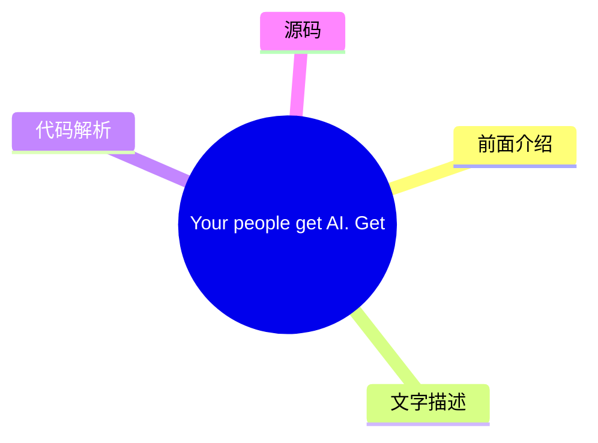
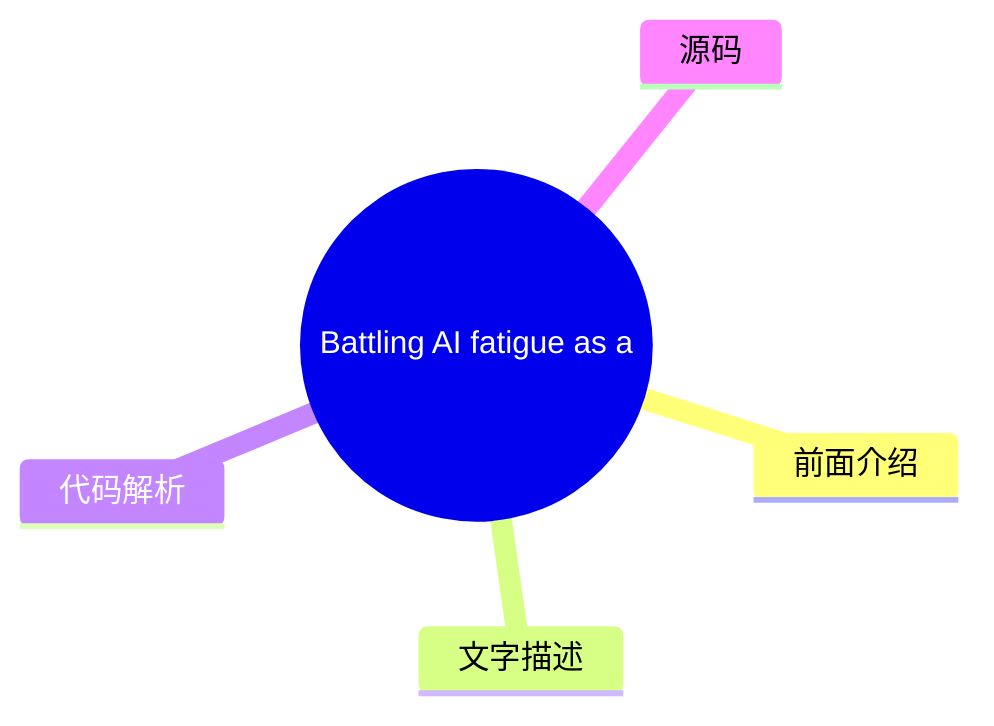
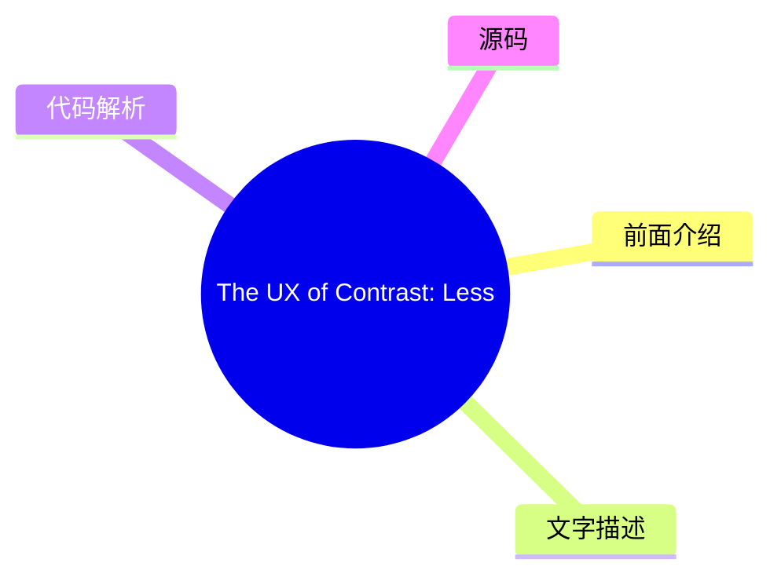
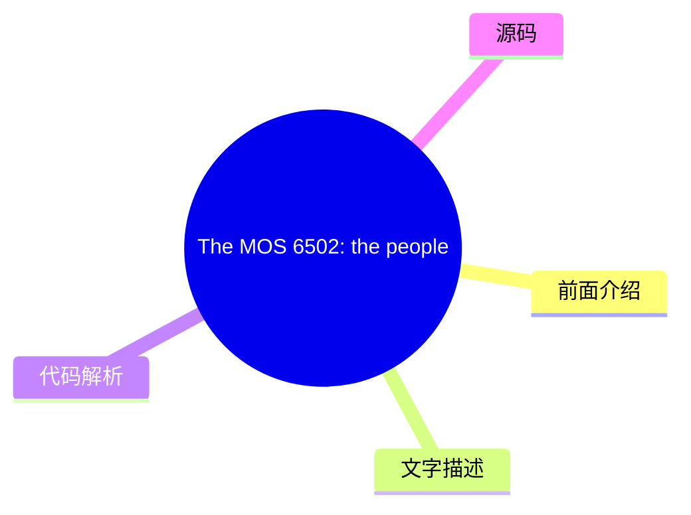
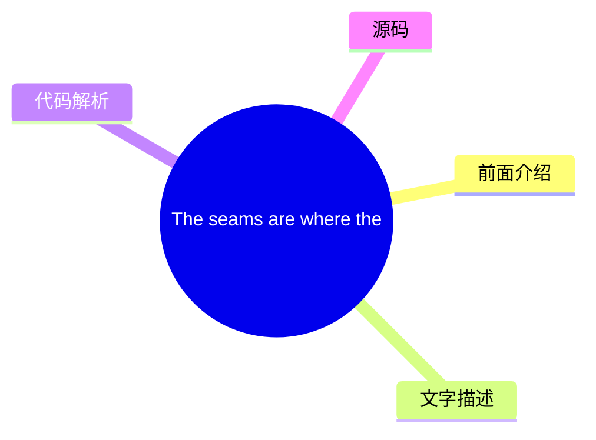
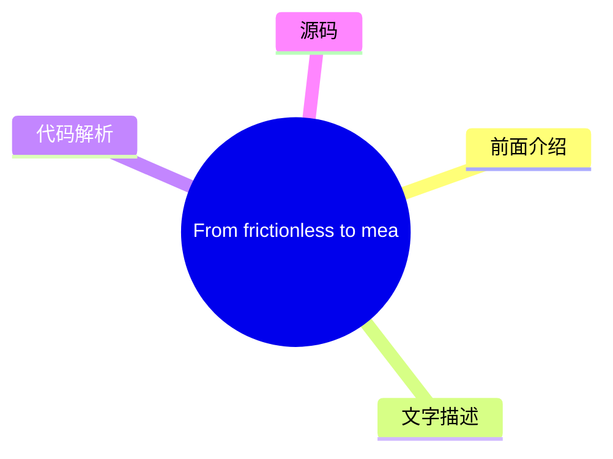

# ✏️ UX Collective Top 8 (2026-07-30)

## 前面介绍

- 数据源：UX Collective
- 抓取日期：2026-07-30
- 条目数：8
- 含完整正文：8
- 含代码片段：0
- 组织方式：前面介绍 / 树状图 / 文字描述 / 代码解析 / 源码

## 思维导图

```mermaid
mindmap
  root((UX Collective))
    Your people get AI. Get out 
    Battling AI fatigue as a des
    The UX of Contrast: Lessons 
    The MOS 6502: the people’s p
    Information architecture is 
    Your website is boring (but 
    The seams are where the syst
    From frictionless to meaning
```

## 详细整理（8 条，8 条含全文，0 条含代码）

### 1. Your people get AI. Get out of their way.
- **链接**: [https://uxdesign.cc/your-people-get-ai-get-out-of-their-way-131370c157f8?source=rss----138adf9c44c---4](https://uxdesign.cc/your-people-get-ai-get-out-of-their-way-131370c157f8?source=rss----138adf9c44c---4)
- **作者**: Dan Maccarone
- **发布**: Wed, 29 Jul 2026 21:58:06 GMT

#### 前面介绍

- 作者：Dan Maccarone
- 发布时间：Wed, 29 Jul 2026 21:58:06 GMT

#### 树状图



#### 文字描述

- # Your people get AI. Get out of their way. *We are all using the same tools. Companies that win will be the ones willing to trust the people who already understand them.* Here’s a number more people should be talking about: [Ninety-five percent](https://fortune.com/2025/08/18/mit-report-95-percent-generative-ai-pilots-at-companies-failing-cfo/) of corporate AI projects go nowh
- ## Get Dan Maccarone’s stories in your inbox Join Medium for free to get updates from this writer. [Daniel Pink](https://en.wikipedia.org/wiki/Drive:_The_Surprising_Truth_About_What_Motivates_Us) wrote a book on what actually moves knowledge workers, and, guess what, it wasn’t control! It was autonomy, mastery, purpose. Grip the wheel too hard and you don’t just slow your best 

#### 代码解析

- 本文未检测到明确代码块，内容更偏新闻、观点或方法论。

#### 源码

#### 中文节选

# Your people get AI. Get out of their way.

*We are all using the same tools. Companies that win will be the ones willing to trust the people who already understand them.*

Here’s a number more people should be talking about: [Ninety-five percent](https://fortune.com/2025/08/18/mit-report-95-percent-generative-ai-pilots-at-companies-failing-cfo/) of corporate AI projects go nowhere. MIT looked into why, and the answer had nothing to do with the tools being used. It was the companies using them.

I recently had two conversations that explain almost everything about why so many companies are finding it challenging to find success using AI. These two conversations were with people in different industries trying to use the same tools, with wildly polarized outcomes.

The thing that separated them was the size of the companies and everything that comes along with that: layers of bureaucracy, the amount of process for approvals, and the hundred years of history about who gets to make a decision.

The first was a friend who runs UX at a hundred-year-old manufacturer, the kind of place with real factories and a brand your parents would recognize. She’s sharp, and she figured out how to build with AI fast. Unfortunately, her company has not. It only recently even decided digital mattered, and leadership’s entire AI strategy has been to tell everyone to move faster without telling or educating anyone how to do that.

Her product managers are basically opening Claude and building things before anyone’s agreed on what they’re actually building, creating dozens of half-baked products, blooming with no strategy. She’s the head of UX, senior to those PMs, the one person who could point all that energy in the right direction, and she can’t.

She’s stuck waiting on IT to approve access to the same AI tools her team is already using, asking again and again for permissions that never come, while people with a fraction of her judgment ship mediocre products that solve no real problem.


The second conversation was with an engineering lead on a small product team I work with, the kind of team where the founder is still in the room for the calls that matter. We were working out how design gets approved, and on a small team, the default is to let all the stakeholders weigh in and end up with [design by committee](https://www.nngroup.com/articles/design-by-committee/), which reliably produces the worst version of anything.

To his credit, he shut that idea down before it even started. For the day-to-day, he said, he and the designer would make decisions together and keep moving. Only the genuinely big questions would go to the founder or the full team.

The insight really came when he told the founder his job, at this point, was to be a filter that removes the small stuff, so her attention was saved for the few decisions that actually needed her. Thus removing any need for committee-based decisions.

Both of these companies were approaching their process with the same t

#### 完整正文（中文）

# Your people get AI. Get out of their way.

*We are all using the same tools. Companies that win will be the ones willing to trust the people who already understand them.*

Here’s a number more people should be talking about: [Ninety-five percent](https://fortune.com/2025/08/18/mit-report-95-percent-generative-ai-pilots-at-companies-failing-cfo/) of corporate AI projects go nowhere. MIT looked into why, and the answer had nothing to do with the tools being used. It was the companies using them.

I recently had two conversations that explain almost everything about why so many companies are finding it challenging to find success using AI. These two conversations were with people in different industries trying to use the same tools, with wildly polarized outcomes.

The thing that separated them was the size of the companies and everything that comes along with that: layers of bureaucracy, the amount of process for approvals, and the hundred years of history about who gets to make a decision.

The first was a friend who runs UX at a hundred-year-old manufacturer, the kind of place with real factories and a brand your parents would recognize. She’s sharp, and she figured out how to build with AI fast. Unfortunately, her company has not. It only recently even decided digital mattered, and leadership’s entire AI strategy has been to tell everyone to move faster without telling or educating anyone how to do that.

Her product managers are basically opening Claude and building things before anyone’s agreed on what they’re actually building, creating dozens of half-baked products, blooming with no strategy. She’s the head of UX, senior to those PMs, the one person who could point all that energy in the right direction, and she can’t.

She’s stuck waiting on IT to approve access to the same AI tools her team is already using, asking again and again for permissions that never come, while people with a fraction of her judgment ship mediocre products that solve no real problem.


The second conversation was with an engineering lead on a small product team I work with, the kind of team where the founder is still in the room for the calls that matter. We were working out how design gets approved, and on a small team, the default is to let all the stakeholders weigh in and end up with [design by committee](https://www.nngroup.com/articles/design-by-committee/), which reliably produces the worst version of anything.

To his credit, he shut that idea down before it even started. For the day-to-day, he said, he and the designer would make decisions together and keep moving. Only the genuinely big questions would go to the founder or the full team.

The insight really came when he told the founder his job, at this point, was to be a filter that removes the small stuff, so her attention was saved for the few decisions that actually needed her. Thus removing any need for committee-based decisions.

Both of these companies were approaching their process with the same tools, such as Claude and Cursor. The difference is that one of them is small enough to let a good decision happen with trusted team members, and the other has spent a century building machinery to guarantee that no decision happens without permission.

This makes it look like a big-company problem, and it mostly is, but not entirely. What’s really separating these two companies runs deeper than size: whether the people on top trust the people doing the work enough to get out of their way.

A hundred-year-old manufacturer can choose that as surely as a five-person startup can. Most of them just won’t.

**It was never about the technology**

In the end, the overall challenge is not AI. Most companies are built, top to bottom, to reward control to the people who own the process, who sign off, who run the departments, and it rewarded them for a good reason, because for a hundred years, making the thing was the hard part, and whoever could marshal the making earned the promotions and praise.


[Gary Hamel](https://www.humanocracy.com/) has spent years making the case that hierarchy was really our answer to scarce information. When the person at the top was the only one who could see the whole picture, routing every decision up to them made sense, and the skill of commanding and coordinating all that work was genuinely rare.

Neither of those things is true anymore.

Everyone can see the forest through the trees now, and the rewards we gave to managing the makers, that we spent a century promoting people for, stopped being the rare, valuable thing it used to be.

As we know, making [isn’t the hard part](https://medium.com/user-experience-design-1/everyones-sharpening-knives-for-the-wrong-fight-56844adad459) anymore, which means the archaic systems that we built to find and promote and protect the controllers are now the single biggest thing standing between your company and the people who already know what to do.

**Your people already cracked it**

[Ethan Mollick](https://www.oneusefulthing.org/p/detecting-the-secret-cyborgs) has a name for the people at your company who quietly cracked this: secret cyborgs. They’re using AI to do better work, faster, and they are deliberately not telling you, because the rules your company wrote about AI were written out of fear, and admitting you used it feels like admitting you’re replaceable.

[Microsoft and LinkedIn’s Work Trend Index](https://www.microsoft.com/en-us/worklab/work-trend-index/ai-at-work-is-here-now-comes-the-hard-part) put real numbers on it: roughly three in four knowledge workers already use AI at work, most of them smuggling in their own tools without approval, and more than half won’t cop to using it on anything that matters. [McKinsey](https://www.mckinsey.com/capabilities/tech-and-ai/our-insights/superagency-in-the-workplace-empowering-people-to-unlock-ais-full-potential-at-work) caught leaders lowballing their own employees’ AI use by a factor of three, and concluded, in the most polite consulting voice imaginable, that the bottleneck isn’t the workforce. It’s leadership.


想想看。人们是自发适应的。他们适应得如此之快、如此之静，以至于你甚至没有察觉到，而你之所以仍然无法察觉，是因为他们已经学会了向你展示是不安全的。

**挡路的机制**

这就是为什么公司无法追赶的原因，这与领导层的智慧或他们愿意投入多少时间毫无关系。

我们正处于一代人的转变之中，这迫使人们不得不面对过时的结构、脱节的政策以及对变革的单纯恐惧。

[Steve Blank](https://steveblank.com/2015/05/19/organizational-debt-is-like-technical-debt-but-worse/) 将这种累积的混乱称为组织债务，它是技术债务的结构性表亲，悄无声息地累积，直到最终成为阻碍你的东西。

六十年前，[Douglas McGregor](https://en.wikipedia.org/wiki/Theory_X_and_Theory_Y) 将管理分为两种理论。X 理论假设人们需要被监督和指导，否则就会混日子。Y 理论假设人们，一旦被赋予值得做的事情，就会全力以赴。大多数公司在全员大会上都说 Y 理论，但却是按照 X 理论一砖一瓦地建立起来的。每一个关卡、每一次审批、每一句“在做事之前先让我参与进来”，都是对这种信念的微小纪念碑：即决策最安全的地方是在执行工作的人之上。

[Gary Hamel](https://www.humanocracy.com/) 再次花费职业生涯为这种信念标价：官僚主义的纯粹拖累，以及那些产出仅仅是“许可”的层级。在我们刚刚离开的那个世界里，这种“拖累”是可以生存的，那是协调大量人员所支付的税。而在现在的世界里，它是致命的，因为官僚主义最不擅长保护的东西，恰恰是突然变得最重要的东西：关于什么值得做的快速、可信、人为的决策。

[Marty Cagan](https://www.svpg.com/product-vs-feature-teams/) 多年来一直在向产品界大声疾呼这一观点。有些团队，你把解决方案交给他们，让他们去构建；有些团队，你信任他们去找到正确的问题并加以解决。第一类团队会执行他们被告知的内容。第二类团队会做出决定。

You’re gonna be shocked at which one AI just made ten times more valuable, and which one most companies are historically structurally yearning to produce.

**What the grip costs you**

This is where it gets expensive. [Amy Edmondson](https://www.hbs.edu/faculty/Pages/item.aspx?num=54851)’s whole body of work on psychological safety says people only bring you their real thinking, their misfires, their weird experiments, when it’s safe to do it. A company that treats AI use as a compliance risk instead of a superpower is quietly instructing its best people to keep their best work in a locked drawer.

## Get Dan Maccarone’s stories in your inbox

Join Medium for free to get updates from this writer.

[Daniel Pink](https://en.wikipedia.org/wiki/Drive:_The_Surprising_Truth_About_What_Motivates_Us) wrote a book on what actually moves knowledge workers, and, guess what, it wasn’t control! It was autonomy, mastery, purpose. Grip the wheel too hard and you don’t just slow your best people down, you bore them.

Bored people with rare, portable skills do not stay bored for long. They leave. Usually for a leader who says yes and gets out of the way.

**Nobody gives up status without a fight**

So why won’t some companies just loosen up? Because you’re asking the people with the most power to volunteer that the thing which earned them that power counts for less now. The classic executive who climbed the corporate ladder by being the sharpest maker in the building now runs a building where making isn’t the valuable part anymore.

Nobody gives up status without a fight, so instead of loosening the grip, they tighten it.


They add a review, ask to be looped in, invent a new step that plants them in front of the work, because if they can’t be the sharpest maker in the room anymore, they can at least be the one whose sign-off you still need.[ Das Narayandas](https://www.library.hbs.edu/working-knowledge/why-employees-resist-ai-and-how-companies-can-win-them-over) dug into why AI rollouts stall and found the culprit hiding in plain sight: the tools threaten the identity and status of the very people who have to approve them. It shows up as one more approval step, one more “let’s align first” before anyone’s allowed to actually get the work done.

That’s a genuinely disorienting place to stand, and the most human response available is to hold on tighter. Add a review. Ask to be looped in. [Erik Brynjolfsson](https://www.aeaweb.org/articles?id=10.1257%2Fmac.20180386) has shown that the payoff from a general-purpose technology always lags, sometimes by years, and that the lag is the organization slowly, painfully rebuilding itself around the new reality.

None of this waits for you. The gap between what your people can do and what your company will let them do is widening every day, and you are the one holding it open. Call it governance if it helps, but the reality everyone that matters knows it’s fear.

**How it actually changes**

Corporations aren’t doomed…yet. Real change doesn’t come from an announcement, though. Not a company-wide email, not an all-hands about how everything’s different now, not a Claude access for every employee and a declaration that “we’re into AI now!” Those are all just the noises companies make when they want credit for change without actually doing it.

They change the way they always have, through one person other people actually trust. [Nancy Baym](https://hbr.org/2026/03/peer-influence-can-make-or-break-your-ai-rollout)’s research at Microsoft landed on a reason for stalled adoption that nobody expects: the learning stays invisible. The tools work and the training happens, but the people who cracked it did it in the background, so nobody else ever gets to see how.

Remember the secret cyborgs from earlier? What actually moves an o


...（截断，原文 15282+ 字符）


### 2. Battling AI fatigue as a designer and developer: a practical guide
- **链接**: [https://uxdesign.cc/battling-ai-fatigue-as-a-designer-and-developer-a-practical-guide-d04a2549e802?source=rss----138adf9c44c---4](https://uxdesign.cc/battling-ai-fatigue-as-a-designer-and-developer-a-practical-guide-d04a2549e802?source=rss----138adf9c44c---4)
- **作者**: Adir SL
- **发布**: Wed, 29 Jul 2026 21:57:29 GMT

#### 前面介绍

- 作者：Adir SL
- 发布时间：Wed, 29 Jul 2026 21:57:29 GMT

#### 树状图



#### 文字描述

- ## A warning about using AI for everything Not too long ago, I needed a new app for writing down my expenses so I could better keep track of my money, so I searched the iOS App Store. I found many apps for expense reports, for budgeting and money management in general, but something felt strange. As a UI Designer and a Front-end Developer, I can spot patterns in the designs, an
- ## Try to limit your usage of AI Not every task should go through ChatGPT, Claude, Gemini or your AI assistant of choice. Even if this task could be done quicker, there is a sense of accomplishment in doing things on your own. To start with, I would recommend that if you use AI heavily at work, try to avoid using it in your personal life. If you plan a vacation, you can plan it
- ## Do the fun parts yourself I know this part might be controversial, but small and easy tasks you can do yourself in the same amount of time as the AI — you SHOULD do yourself. Not only that, you should also do the fun parts yourself, instead of asking AI to assist, even if it means it will take longer to complete, because the fun part is for you, **the AI won’t have fun for y
- ## Don’t be 100x more productive If you’re using AI in your workflow to be more productive, you’re probably already between 5x to 10x more productive than you used to be. Trying to maximize this and become 100x more productive will lead you to obsession and self burnout, please don’t do that to yourself. invest in work quality, not quantity. I know it’s very tempting, you tell 

#### 代码解析

- 本文未检测到明确代码块，内容更偏新闻、观点或方法论。

#### 源码

#### 中文节选

## 关于使用 AI 做一切的一则警告

不久前，我需要一个新应用来记录我的开支，以便更好地管理我的资金，于是我搜索了 iOS App Store。

我找到了许多用于费用报告、预算编制和一般理财的应用，但有些地方感觉不对劲。作为一名 UI 设计师和前端开发人员，我能在设计中发现规律，而这些应用并非人类制作。

我找到的大多数应用都是 AI 生成的、通过“氛围编码”制作的应用，我并不真的想使用其中任何一个，所以我决定自己制作一个记账应用。

我在终端中启动了 Claude Code，开始制作一个 Web 应用，这个 Web 应用我在 iOS 的 Safari 中打开，然后从那里我使用了“[添加到主屏幕](https://support.apple.com/en-il/guide/iphone/iph42ab2f3a7/ios)”功能，让它像原生 iOS 应用一样使用，差不多是这样。

我对 Claude Code 并不陌生，我之前也用氛围编码制作过应用和网站——无论是为了工作还是个人使用，但这一次感觉有些不同。

在工作中，我每天每时每刻都在使用 AI，我用 Claude Code 编写网站，我也使用同一个 AI 在 Figma 中生成设计，我经常起草邮件，并让 AI 助手让它们听起来更稳健或更专业，有时我甚至让 AI 起草邮件本身。

我做的有些项目是在 Figma 中使用 AI 提示生成的，然后使用 AI 将 Figma 中生成的设计编码成真实的网站，最后我会附上一封听起来很专业的 AI 生成的邮件消息和实时网站链接，将项目发送给客户，AI 完成了所有实际工作。

我描述的这种基于 AI 的工作流程如今并不罕见。

我描述的这种基于 AI 的工作流程如今并不罕见，很多人用 AI 做一切事情，前端开发经常被引用为受 AI 使用影响最大的行业。

不过，我认为这就是为什么我在业余时间使用 AI 来氛围编码我的个人开支 Web 应用时感觉有些奇怪的原因，我也把我的业余时间卸载到了 AI 工作流程中。

I realized this was a sign of “[AI fatigue](https://siddhantkhare.com/writing/ai-fatigue-is-real)” as it is now known in the industry, and I found a few ways to make it better so I decided to share them in this article.

## Try to limit your usage of AI

Not every task should go through ChatGPT, Claude, Gemini or your AI assistant of choice. Even if this task could be done quicker, there is a sense of accomplishment in doing things on your own. To start with, I would recommend that if you use AI heavily at work, try to avoid using it in your personal life.

If you plan a vacation, you can plan it yourself like you used to do a decade ago, by searching Google and asking friends for recommendations. Will you miss some attractions? Possibly. Will it matter in the long run? Probably not.

It’s worth it if it gets you out of the AI mindscape that leaves you a mere participant in your own life; if it’s only in your work life, it will feel much more manageable.

As Tyler Durden told us in “Fight Club” (1999

#### 完整正文（中文）

## 关于使用 AI 做一切的一则警告

不久前，我需要一个新应用来记录我的开支，以便更好地管理我的资金，于是我搜索了 iOS App Store。

我找到了许多用于费用报告、预算编制和一般理财的应用，但有些地方感觉不对劲。作为一名 UI 设计师和前端开发人员，我能在设计中发现规律，而这些应用并非人类制作。

我找到的大多数应用都是 AI 生成的、通过“氛围编码”制作的应用，我并不真的想使用其中任何一个，所以我决定自己制作一个记账应用。

我在终端中启动了 Claude Code，开始制作一个 Web 应用，这个 Web 应用我在 iOS 的 Safari 中打开，然后从那里我使用了“[添加到主屏幕](https://support.apple.com/en-il/guide/iphone/iph42ab2f3a7/ios)”功能，让它像原生 iOS 应用一样使用，差不多是这样。

我对 Claude Code 并不陌生，我之前也用氛围编码制作过应用和网站——无论是为了工作还是个人使用，但这一次感觉有些不同。

在工作中，我每天每时每刻都在使用 AI，我用 Claude Code 编写网站，我也使用同一个 AI 在 Figma 中生成设计，我经常起草邮件，并让 AI 助手让它们听起来更稳健或更专业，有时我甚至让 AI 起草邮件本身。

我做的有些项目是在 Figma 中使用 AI 提示生成的，然后使用 AI 将 Figma 中生成的设计编码成真实的网站，最后我会附上一封听起来很专业的 AI 生成的邮件消息和实时网站链接，将项目发送给客户，AI 完成了所有实际工作。

我描述的这种基于 AI 的工作流程如今并不罕见。

我描述的这种基于 AI 的工作流程如今并不罕见，很多人用 AI 做一切事情，前端开发经常被引用为受 AI 使用影响最大的行业。

不过，我认为这就是为什么我在业余时间使用 AI 来氛围编码我的个人开支 Web 应用时感觉有些奇怪的原因，我也把我的业余时间卸载到了 AI 工作流程中。

I realized this was a sign of “[AI fatigue](https://siddhantkhare.com/writing/ai-fatigue-is-real)” as it is now known in the industry, and I found a few ways to make it better so I decided to share them in this article.

## Try to limit your usage of AI

Not every task should go through ChatGPT, Claude, Gemini or your AI assistant of choice. Even if this task could be done quicker, there is a sense of accomplishment in doing things on your own. To start with, I would recommend that if you use AI heavily at work, try to avoid using it in your personal life.

If you plan a vacation, you can plan it yourself like you used to do a decade ago, by searching Google and asking friends for recommendations. Will you miss some attractions? Possibly. Will it matter in the long run? Probably not.

It’s worth it if it gets you out of the AI mindscape that leaves you a mere participant in your own life; if it’s only in your work life, it will feel much more manageable.

As Tyler Durden told us in “Fight Club” (1999), “You are not your job” (see image above), if your job requires you to use a certain technology — it doesn’t mean YOU need to use it, only your office persona needs to. Your free time is your own.

## Do the fun parts yourself

I know this part might be controversial, but small and easy tasks you can do yourself in the same amount of time as the AI — you SHOULD do yourself. Not only that, you should also do the fun parts yourself, instead of asking AI to assist, even if it means it will take longer to complete, because the fun part is for you, **the AI won’t have fun for you.**

Finding out what you feel is the fun part is subjective and everyone will have fun with different parts, some coders like the math of it all, some like to build the UI, I like to hand code the CSS animations, so I’m not asking the AI to do THAT part for me. I will animate it myself.

Also, I don’t ask the AI to write for me. Ever. Not this article, no WhatsApp, no Slack messages, nothing. If I send something into the world, I wrote it myself.

For me writing is thinking and I don’t want to outsource it to a machine.


I might consult the AI about the writing process, I might ask it for information, or a summary, for its opinion on my writing, but the writing itself is my own, the thinking behind it is my own, and the final decision on what to change is also my own. For me, writing is thinking, and I don’t want to outsource it to a machine, at least not yet.

## Don’t be 100x more productive

If you’re using AI in your workflow to be more productive, you’re probably already between 5x to 10x more productive than you used to be. Trying to maximize this and become 100x more productive will lead you to obsession and self burnout, please don’t do that to yourself.

invest in work quality, not quantity.


I know it’s very tempting, you tell yourself you can make an entire year’s work in a week, or even less but please realize that work is endless, you will never get **everything** done, work will always fill more of your time. [Beware of productivity paradoxes.](https://calnewport.com/beware-of-productivity-paradoxes/)

A better way is to stay 10x more productive and just work happier, not harder, not longer, just make work more satisfying, invest in work quality, not quantity.

Invest in the work itself and not in the pipeline that made you get there because no pipeline will work 100% of the time and you’ll get crazier and crazier trying to perfect the pipeline using new models, new apps or new methods, instead of perfecting the work that you do with the help of your AI pipeline.

## You are not staying behind

Tech people will always tell you that you HAVE to use any new technology, or else you’ll be left behind, you’ll become irrelevant in the near future.

Let me tell you right now — **you’re NOT staying behind**** **by NOT trying any new AI assistant, any new coding app or by not using the newest models.

Whenever something becomes essential for your job, you will learn it then. You don’t need to prepare yourself in advance by knowing all the digital tools in existence like you’re preparing for the digital apocalypse. Tools will come and go and they rarely matter in the great scheme of things.


你不需要像准备数字末日那样，提前去了解所有现有的数字工具。

让我举一个我亲身经历的例子，我记得 Sketch 刚推出的时候，它是一款专门为 UI 设计师打造的 UI 设计软件，而在此之前的设计软件都是像 Adobe Illustrator 或 Photoshop 这样的通用工具。

我的许多朋友都加入了 Sketch 的行列，他们早早地学习它，并在工作中尽可能多地使用它，试图说服他们的管理者投资新的设计工具，并为它开创新的工作流程。

我没有那样做，因为 Sketch 只支持 Mac，而我在 2020 年之前一直使用的是 Windows，所以我一直在等待，同时继续使用 Adobe 的应用程序。几年后，Figma 出现了（并赢得了 UI 设计软件的竞争）。

我当然学习了 Figma，但因为没有学习 Sketch，相比于我的大多数同龄人，我对设计工具感到不那么疲惫，我能够更快地成为 Figma 专家，而且我不需要说服我的管理者放弃基于 Adobe 的工作流程，因为许多人早在一年或两年前就已经为了 Sketch 放弃了它们。

大多数时候，选择获胜的技术，一旦变得清晰，将比试图学习所有新工具（担心自己会被抛在后面）要好得多。你只会让自己对技术感到精疲力竭。

## 结论

对 AI 感到疲惫是很自然的，因为 AI 似乎已经完全接管了我们生活的方方面面，但在这篇文章中，我概述了一些对我行之有效的关键点。

把 AI 留在工作场所感觉是一种解脱，就像在 2000 年代初，我们把互联网留在家庭电脑上，直到回家才去想它。

此外，放下我对 100 倍生产力的误解，或者对被抛在后面的恐惧，这些想法你经常能听到，无论是来自你的同龄人还是社交媒体，但它们在现实中毫无根据。

具有讽刺意味的是——我所有的这一切，以及促使我写这篇文章的支出应用 froggo，仍然是我每天用来追踪资金的工具，它也赢得了在 iPhone 主屏幕上的位置。

以下是我用过的一些技巧，但在为这篇文章做研究时，我在网上还看到了很多其他技巧，我相信很多人也有自己的策略。

如果你发现了一些对你有效且对其他人也适用的方法，请在评论区留言，我会阅读所有评论，迫不及待地想看看对其他人有效的方法是什么。

请记住，AI 的使用确实会影响你的情绪，所以要明智地使用它。

感谢读到结尾 🙏


### 3. The UX of Contrast: Lessons from Indika’s Game Design
- **链接**: [https://uxdesign.cc/the-ux-of-contrast-what-indika-taught-me-about-designing-intentional-contradiction-c880e9eaf084?source=rss----138adf9c44c---4](https://uxdesign.cc/the-ux-of-contrast-what-indika-taught-me-about-designing-intentional-contradiction-c880e9eaf084?source=rss----138adf9c44c---4)
- **作者**: Alisa Smelkova
- **发布**: Wed, 29 Jul 2026 21:57:08 GMT

#### 前面介绍

- 作者：Alisa Smelkova
- 发布时间：Wed, 29 Jul 2026 21:57:08 GMT

#### 树状图



#### 文字描述

- # The UX of Contrast: Lessons from Indika’s Game Design
- ## Introducing PX Contrast: a deliberate layering of conflicting player experiences leading to intentional multiple interpretations Contrast is one of the most familiar [visual tools](https://www.nngroup.com/articles/visual-hierarchy-ux-definition/) for guiding attention in design. But in Indika it becomes a game UX tool. It shapes how players interpret the story. Released in 2
- ## A nun, a Devil, and a World that Stops Making Sense You play as Indika, a young Orthodox nun who moves from complete obedience to rejecting her faith entirely. She carries the Devil with her, quite literally, inside her head, as she searches for identity outside the monastery walls. He whispers things Indika would never dare to say out loud, and raises questions she initiall
- ## Defining PX Contrast: Three Conditions for Meaningful Contradiction PX Contrast builds on existing discussions of contrast in game UX (e.g., Salama’s [Affinity vs Contrast](https://medium.com/@salamatizm/presence-in-practice-affinity-vs-contrast-in-game-ux-5549fef85ad6) framework), but extends the concept beyond momentary friction or immersion-breaking elements that pull pla

#### 代码解析

- 本文未检测到明确代码块，内容更偏新闻、观点或方法论。

#### 源码

#### 中文节选

# 对比度的用户体验：来自 Indika 游戏设计的启示

## 介绍 PX Contrast：对冲突玩家体验的刻意分层，旨在引导出有意为之的多重解读

对比度是设计中最熟悉的[视觉工具](https://www.nngroup.com/articles/visual-hierarchy-ux-definition/)之一，用于引导注意力。但在 Indika 中，它变成了游戏 UX 工具。它塑造了玩家解读故事的方式。这款由 Odd Meter 于 2024 年发布的游戏，因其非传统的叙事手法，在 2025 年游戏变革奖上获得了[最佳叙事奖](https://www.gamingamigos.com/post/games-for-change-2025-impact-awards?utm_source=chatgpt.com)。

我最初在发布时玩了 Indika，有一件事一直困扰着我：为什么体验的不同部分看起来像是完全属于不同的游戏？它的玩法、音效、进度和 UI 不断与玩家的预期相悖，但它们共同表达了同样的情感冲突。

我将这种方法称为**玩家体验对比度** *(PX Contrast)*：一种冲突的玩家体验共存的状态，允许玩家同时持有对同一互动的不同解读。

## 一位修女、一个恶魔，以及一个不再讲道理的世界

你扮演 Indika，一位年轻的东正教修女，她的行为从完全顺从转变为彻底拒绝自己的信仰。她将恶魔带在身边，字面意义上就在她的脑海中，在修道院围墙外寻找身份。他低语着 Indika 绝不敢大声说出口的话，并提出了她最初视为罪孽的问题。随着游戏的进行，他的声音与她自己的声音之间的界限变得越来越模糊。

这种内在的分裂也体现在她周围的世界中。起初，Indika 感到出奇地脚踏实地。游戏在修道院中开始，那里的外观完全可信。在俄罗斯长大，我立刻认出了修道院的视觉语言，这种熟悉感让后来世界的转变感觉更加令人不安。

随着游戏的进行，那种真实感就像《Indika》中的确信感一样崩塌了。历史准确性让位于梦境逻辑：像谷仓一样大的牛、蒸汽动力机械、巨大的钟，以及许多其他怪诞的事物。你走得越远，这个世界就越不“真实”，Indika对自己所相信的东西就越不确定。

她发现的世界只能被描述为一种直接源自陀思妥耶夫斯基和布尔加科夫小说的悲剧与喜剧的狂野结合。—— 来自游戏的官方

[Steam 页面](https://store.steampowered.com/app/1373960/INDIKA/)

这种描述极好地捕捉了游戏的基调。它在黑暗喜剧和真正的恐惧之间不断摇摆，用象征主义和梦境逻辑包裹着它的故事。就连“Indika”这个名字也感觉是刻意为之。它与印度大麻的相似性增加了另一层可能的含义，尤其是考虑到游戏中反复出现的感知和现实扭曲的主题。

这种象征主义也反映了创作者 Dmitry

#### 完整正文（中文）

# 对比度的用户体验：来自 Indika 游戏设计的启示

## 介绍 PX Contrast：对冲突玩家体验的刻意分层，旨在引导出有意为之的多重解读

对比度是设计中最熟悉的[视觉工具](https://www.nngroup.com/articles/visual-hierarchy-ux-definition/)之一，用于引导注意力。但在 Indika 中，它变成了游戏 UX 工具。它塑造了玩家解读故事的方式。这款由 Odd Meter 于 2024 年发布的游戏，因其非传统的叙事手法，在 2025 年游戏变革奖上获得了[最佳叙事奖](https://www.gamingamigos.com/post/games-for-change-2025-impact-awards?utm_source=chatgpt.com)。

我最初在发布时玩了 Indika，有一件事一直困扰着我：为什么体验的不同部分看起来像是完全属于不同的游戏？它的玩法、音效、进度和 UI 不断与玩家的预期相悖，但它们共同表达了同样的情感冲突。

我将这种方法称为**玩家体验对比度** *(PX Contrast)*：一种冲突的玩家体验共存的状态，允许玩家同时持有对同一互动的不同解读。

## 一位修女、一个恶魔，以及一个不再讲道理的世界

你扮演 Indika，一位年轻的东正教修女，她的行为从完全顺从转变为彻底拒绝自己的信仰。她将恶魔带在身边，字面意义上就在她的脑海中，在修道院围墙外寻找身份。他低语着 Indika 绝不敢大声说出口的话，并提出了她最初视为罪孽的问题。随着游戏的进行，他的声音与她自己的声音之间的界限变得越来越模糊。

这种内在的分裂也体现在她周围的世界中。起初，Indika 感到出奇地脚踏实地。游戏在修道院中开始，那里的外观完全可信。在俄罗斯长大，我立刻认出了修道院的视觉语言，这种熟悉感让后来世界的转变感觉更加令人不安。

随着游戏的进行，那种真实感就像《Indika》的确定性一样崩塌了。历史准确性让位于梦境逻辑：像谷仓一样大的奶牛、蒸汽动力机械、巨大的钟，以及许多其他怪诞的事物。你走得越远，这个世界就越不“真实”，Indika对自己所信奉的东西就越不确定。

她发现的世界只能被描述为一种直接源自陀思妥耶夫斯基和布尔加科夫小说的悲剧与喜剧的狂野结合。—— 来自游戏的官方

[Steam 页面](https://store.steampowered.com/app/1373960/INDIKA/)

这一描述极好地捕捉了游戏的基调。它在黑暗喜剧和真正的恐惧之间不断摇摆，用象征主义和梦境逻辑包裹着它的故事。就连“Indika”这个名字也感觉是刻意为之。它与大麻属的相似性增加了另一层可能的含义，尤其是考虑到游戏中反复出现的感知与现实扭曲的主题。

这种象征主义也反映了创作者德米特里·斯韦特洛夫的个人经历。在 [《卫报》的采访](https://www.theguardian.com/games/2024/may/02/indika-russian-orthodox-church-fairytale-game-dmitry-svetlov-interview) 中，他描述了自己在成为无神论者之前是信教的。与其说是批评信仰本身，不如说游戏探索的是塑造一个人身份的更广泛的信念和价值观体系。

像任何强有力的象征主义作品一样，它邀请多种解读。以下是我对游戏的解读，以及我认为其游戏 UX 设计在其中所起的作用。

## 定义 PX 对比：有意义矛盾的三个条件

PX 对比建立在游戏 UX 中关于对比的现有讨论（例如 Salama 的 [亲和力与对比](https://medium.com/@salamatizm/presence-in-practice-affinity-vs-contrast-in-game-ux-5549fef85ad6) 框架）之上，但将这一概念延伸到了瞬间的摩擦或破坏沉浸感的元素之外。

PX 对比是有意叠加的相互冲突的玩家体验，它们共存但不解决，允许玩家同时持有对同一交互的多种解读。

在此语境下，“对比”一词并非单纯指视觉差异或并置的元素。在 PX Contrast 中，系统的差异会导致玩家对体验的解读产生矛盾，并产生紧张感。

PX Contrast 在满足以下三个条件时生效：

- 两个或多个系统（界面、声音、节奏、进程、环境等）对同一种体验产生不同的解读，从而允许对立的含义共存。
- 这些元素之间的对比服务于同一个潜在主题，而非仅仅作为纯粹的美学或机械选择存在。
- 这种对比是刻意为之的。这是一种支持玩家解读的深思熟虑的设计选择，而非未解决的矛盾。

### PX Contrast 与叙事冲突

另一个密切相关的是 [叙事冲突](https://clicknothing.com/2007/10/07/ludonarrative-d/)，由 Clint Hocking 于 2007 年提出，描述的是游戏故事与其机制背道而驰的时刻。自那以后，一些设计师和批评家开始将其视为一种刻意使用的工具，而非需要避免的东西。例如，Connor Jackson 就主张摆脱 Hocking 将该概念视为缺陷的框架，转而将其视为一种 [有意义的表达手段](https://journals.sagepub.com/doi/10.1177/15554120261438561)。

“冲突”描述的是玩家感到不协调的感觉，而 PX Contrast 描述的是创造这种紧张感的设计结构。不仅仅是游戏玩法与叙事的对抗，还包括界面、声音、节奏、进程和环境共同贡献于同一种情感张力。

## Indika 如何运用 PX Contrast

在《Indika》中，玩家与游戏角色共享同一种破碎的感知：神圣仪式与游戏化动作、缓慢的现实与快速的记忆、扭曲的世界与正常的世界。对于每一种矛盾，两种解读都不占上风。两者都保持活跃，创造出一种持续的张力，这反映了 Indika 无法化解其信仰的困境。

Indika 是一个完美的案例，展示了所有三种 PX 对比条件如何同时发挥作用。它的界面、节奏和音效各自以不同的方式挑战着玩家的预期，但它们之间没有任何矛盾。所有这些都通过不同的渠道传达了相同的情感理念。

像素艺术 UI、缓慢动作与快节奏记忆之间的对比，以及从神圣吟唱到俏皮复古音效的转变，都在挑战玩家预期的同时，逐渐教会玩家透过 Indika 支离破碎的视角去看待世界。

### 1. 界面：将信仰转化为反馈

同样引起我注意的是，界面本身如何成为叙事的一部分，以及它如何塑造了我体验主角旅程的方式。它没有支持世界的虚构设定，而是与设定保持距离，将玩家的视角与 Indika 的自身体验对齐。

界面逐渐重塑了玩家的预期：那些本应感觉神圣的行为被重新定义为普通的游戏互动。这反映了 Indika 对信仰的情感疏离（她是在“玩”而不是真正相信）。宗教仪式已经失去了任何意义。它们现在只是思维游戏中的节点。界面教会玩家同时持有神圣和游戏化的解读，而不必做出选择。

这种解读也反映在 Svetlov 自己的话中：

游戏成为了我们故事的一个非常重要的隐喻。我们都在玩的游戏，遵循着并非我们制定的规则，等待着注定属于我们的“胜利”奖励，并在“失败”时生活在对惩罚的恐惧中。—— Dmitry Svetlov 来自

[Game Developer](https://www.gamedeveloper.com/design/inside-indika-s-powerful-bleak-exploration-of-religion)

从设计角度来看，游戏提出了一个问题：这种出现在角色附近的 UI 元素是有意为之的[非叙事性](https://www.gamedeveloper.com/design/game-ui-discoveries-what-players-want) *(仅对玩家可见，不属于游戏世界的一部分)*，还是 Indika 实际上能将这些游戏界面元素感知为她自身心理现实的一部分。

我认为游戏并没有提供确定的答案，而这正是这个问题如此有趣的原因。这两种解读都为《PX Contrast》做出了贡献，通过刻意的设计扩展了叙事。

- 如果 UI 仅面向玩家，它会在玩家与世界之间制造距离。
- 如果 Indika 也能看到它，界面就变成了她破碎感知的另一种表达，延伸了这样一个观点：我们所体验的世界是由她的精神状态塑造的。

游戏的机制与仪式在世界中呈现的含义相矛盾。点燃蜡烛和祈祷并不是被呈现为精神反思的时刻，而是被呈现为产生分数和奖励的动作。

通常，这种游戏玩法与叙事之间的差距会被视为设计不一致。在这里，这种不一致变成了关于角色内心冲突的刻意反馈。

### 2. 声音：当祈祷听起来像是一种奖励

《Indika》中的声音遵循与 UI 相同的对比逻辑，当你将其分解为一个序列时，这一点最容易看出：

- 玩家做了什么
- 他们预期听到什么
- 他们实际听到了什么
- 这种不匹配让他们有什么感觉

**Indika 点燃蜡烛并祈祷。** 这个动作承载着真实宗教仪式的分量，因此玩家自然会期待寂静、崇敬或某种克制的东西。相反，游戏用明亮、欢快的复古铃声来回应。那种听起来像 Duolingo 里在说“你做到了”的声音，而不是教堂里在说“你被听到了”的声音。

大脑将其解读为一个小奖励，一个完成的任务。这种解读直接与该动作本身的宗教意义发生碰撞，玩家被迫同时持有这两种解读。这正是 Indika 对自己信仰感到的那种不协调：手势依然在执行，但背后的意义已经悄然消逝。

声音设计没有像传统那样强化氛围，而是在动作反馈与情感语境之间制造了刻意的摩擦。神圣而令人不安的声音与欢快、游戏化的效果及 UI 并存，迫使玩家质疑这些元素如何能属于同一种体验。

### 3. Pacing: Slow Devotion vs. Fast Memory

In the “real” game world, movement is slow and heavy. One of the first tasks, carrying buckets of water, takes real time and effort, which reinforces just how monotonous monastic life is.

In the “real” game world, movement is slow and heavy. One of the first tasks, carrying buckets of water, takes real time and effort, which reinforces just how monotonous monastic life is. The platformer sections inside Indika’s memories are the opposite: fast, reactive, and sometimes genuinely tense. That tonal shift in pacing is another strand of the same contrast running through the whole game.

In the racing section, the contrast between the “real” world and Indika’s memories becomes even more explicit. Indika asks how to control the vehicle, and the answer comes through literal button instructions embedded in the dialogue between the characters *(not through the usual on-screen control prompt)*. The game’s rules for the player become part of the rules governing Indika’s own memory, blurring the boundary between the player’s reality and hers.

As the Devil’s influence grows, his voice becomes more persistent and the boundary between realities begins to collapse. The screen floods with red, the music intensifies, and his voice merges with distorted sounds, overwhelming Indika’s own presence. Then a short prayer pulls her back into “normal” reality: the colors return, the Devil’s voice disappears, but a low, muffled sound remains undernea

...（截断，原文 17790+ 字符）


### 4. The MOS 6502: the people’s princess
- **链接**: [https://uxdesign.cc/the-mos-6502-the-peoples-princess-0a2f99409834?source=rss----138adf9c44c---4](https://uxdesign.cc/the-mos-6502-the-peoples-princess-0a2f99409834?source=rss----138adf9c44c---4)
- **作者**: Neel Dozome
- **发布**: Tue, 28 Jul 2026 22:21:13 GMT

#### 前面介绍

- The impact of blending arcade game UI concepts with the power of affordable 1970s calculator chipsContinue reading on UX Collective »
- 作者：Neel Dozome
- 发布时间：Tue, 28 Jul 2026 22:21:13 GMT

#### 树状图



#### 文字描述

- Member-only story
- # The MOS 6502: the people’s princess
- ## The impact of blending arcade game UI concepts with the power of affordable 1970s calculator chips. On the cover of the January, 1975 edition of *Popular Electronics* was a model that set hearts aflame and pulses racing — at least, in our corner of geekdom. The magazine announced a major breakthrough in consumer electronics that was being eagerly anticipated: the first affor

#### 代码解析

- 本文未检测到明确代码块，内容更偏新闻、观点或方法论。

#### 源码

#### 中文节选

Member-only story

# MOS 6502：人民的公主

## 将街机游戏 UI 概念与 20 世纪 70 年代廉价计算器芯片的威力相结合所带来的影响。

在 1975 年 1 月刊的《大众电子》封面上，有一款型号让无数人心跳加速——至少在我们这个极客圈子里是这样。这本杂志宣布了消费电子领域的一项重大突破，这也是当时人们热切期盼的：第一款价格亲民的商业个人电脑。这款设备承诺终结在大型机上等待分时切片以检查计算机程序是否运行的漫长等待，也无需支付巨资就能拥有一台机器。

它以一颗真实的恒星（但在《星际迷航》的一集中被引用为一颗行星）命名，被称为“[ALTAIR 8800](https://en.wikipedia.org/wiki/Altair_8800)”。

事实上，[Altair 8800 的灵感来源于《大众电子》](https://www.nutsvolts.com/magazine/article/micro_memories_200301)

*.*作为当时科技界记录性出版物，该杂志的技术编辑 Les Solomon 被关于实验性车库计算机的提案淹没。为了评估这些提案，Solomon 与一位他信任的工程师兼企业家 Ed Roberts 进行了书信往来。

#### 完整正文（中文）

Member-only story

# MOS 6502：人民的公主

## 将街机游戏 UI 概念与 20 世纪 70 年代廉价计算器芯片的威力相结合所带来的影响。

在 1975 年 1 月刊的《大众电子》封面上，有一款型号让无数人心跳加速——至少在我们这个极客圈子里是这样。这本杂志宣布了消费电子领域的一项重大突破，这也是当时人们热切期盼的：第一款价格亲民的商业个人电脑。这款设备承诺终结在大型机上等待分时切片以检查计算机程序是否运行的漫长等待，也无需支付巨资就能拥有一台机器。

它以一颗真实的恒星（但在《星际迷航》的一集中被引用为一颗行星）命名，被称为“[ALTAIR 8800](https://en.wikipedia.org/wiki/Altair_8800)”。

事实上，[Altair 8800 的灵感来源于《大众电子》](https://www.nutsvolts.com/magazine/article/micro_memories_200301)

*.*作为当时科技界记录性出版物，该杂志的技术编辑 Les Solomon 被关于实验性车库计算机的提案淹没。为了评估这些提案，Solomon 与一位他信任的工程师兼企业家 Ed Roberts 进行了书信往来。


### 5. Information architecture is the foundation AI is starving for
- **链接**: [https://uxdesign.cc/information-architecture-is-the-foundation-artificial-intelligence-is-starving-for-1d91fb5bf59f?source=rss----138adf9c44c---4](https://uxdesign.cc/information-architecture-is-the-foundation-artificial-intelligence-is-starving-for-1d91fb5bf59f?source=rss----138adf9c44c---4)
- **作者**: Patrick Neeman
- **发布**: Sun, 26 Jul 2026 19:28:45 GMT

#### 前面介绍

- 作者：Patrick Neeman
- 发布时间：Sun, 26 Jul 2026 19:28:45 GMT

#### 树状图


#### 文字描述

- # Information architecture is the foundation AI is starving for
- ## Every AI problem you chase — hallucinations, wrong answers, poor retrieval — traces back to the IA projects you never funded. Now’s the time to fund them. For twenty years, information architecture was the discipline nobody funded. The job titles disappeared—I was one back in the day—and now it’s an art (and science) that needs to return. Teams didn’t align. Companies starte
- ## Retrieval Is Only as Good as What It Starts With Most teams treat retrieval as a solved problem. Point the model at your content, let it pull the relevant passages, generate an answer. The technique has a name — retrieval-augmented generation, or RAG — and a foundational paper, [Retrieval-Augmented Generation for Knowledge-Intensive NLP Tasks](https://arxiv.org/abs/2005.1140
- ## Structure Is How a Model Knows What Something Is A price, a policy, a deprecated note, and a customer quote can read as similar strings of text and mean opposite things. A person skims the surrounding page and knows which is which. A model, handed the same four snippets with no scaffolding, sees four passages of plausible language and no reason to rank one above another. Met

#### 代码解析

- 本文未检测到明确代码块，内容更偏新闻、观点或方法论。

#### 源码

#### 中文节选

# Information architecture is the foundation AI is starving for

## Every AI problem you chase — hallucinations, wrong answers, poor retrieval — traces back to the IA projects you never funded. Now’s the time to fund them.

For twenty years, information architecture was the discipline nobody funded. The job titles disappeared—I was one back in the day—and now it’s an art (and science) that needs to return. Teams didn’t align. Companies started showing their underwear.

Doing it well is less about structure than about getting an organization to agree on one way to name and arrange things. Every team brings its own vocabulary, so aligning them is slow, political, and thankless, and it loses every quarter to whatever ships a feature. The work stayed invisible, and so did its failures.

**Then AI arrived, and the invisible foundation showed up on the balance sheet.**

The same gaps that once cost you a confused visitor now cost you a hallucination, a wrong answer, or an agent that confidently retrieves garbage and acts on it. In a 2025 survey, [data quality and availability top the list of AI adoption barriers](https://www.aidataanalytics.network/data-science-ai/news-trends/data-quality-availability-top-list-of-ai-adoption-barriers), outranking every other obstacle.

The failures didn’t get worse; they got visible, repeatable, and expensive.

Simply said, poor information architecture can now be measured in token costs. A lot of them.


You can buy a better model, tune a sharper prompt, and stack another evaluation layer, and you will still serve wrong answers, because the model retrieves from a pile nobody agreed how to organize.

**You need to fix the foundation before you pay for it a second time.**

## Retrieval Is Only as Good as What It Starts With

Most teams treat retrieval as a solved problem. Point the model at your content, let it pull the relevant passages, generate an answer.


The technique has a name — retrieval-augmented generation, or RAG — and a foundational paper, [Retrieval-Augmented Generation for Knowledge-Intensive NLP Tasks](https://arxiv.org/abs/2005.11401), and the mechanism is exactly what it sounds like: the model grounds its answer in documents it fetches at query time instead of relying only on what it memorized in training, limiting the retrieval set.

That mechanism inherits every flaw in the pile it fetches from.

If your content store is a flat heap of unstructured, unlabeled, contradictory documents, retrieval doesn’t work. It finds the loudest match — the one that shares the most surface words with the query, regardless of whether it is current, authoritative, or true.


It finds the loudest match — the one that shares the most surface words with the query, regardless of whether it is current, authoritative, or true.

Information architecture is what makes “the right one” a thing that exists in the first place. Organization schemes, labeling, and navigation aren’t decoration on top of content; they are the differenc

#### 完整正文（中文）

# Information architecture is the foundation AI is starving for

## Every AI problem you chase — hallucinations, wrong answers, poor retrieval — traces back to the IA projects you never funded. Now’s the time to fund them.

For twenty years, information architecture was the discipline nobody funded. The job titles disappeared—I was one back in the day—and now it’s an art (and science) that needs to return. Teams didn’t align. Companies started showing their underwear.

Doing it well is less about structure than about getting an organization to agree on one way to name and arrange things. Every team brings its own vocabulary, so aligning them is slow, political, and thankless, and it loses every quarter to whatever ships a feature. The work stayed invisible, and so did its failures.

**Then AI arrived, and the invisible foundation showed up on the balance sheet.**

The same gaps that once cost you a confused visitor now cost you a hallucination, a wrong answer, or an agent that confidently retrieves garbage and acts on it. In a 2025 survey, [data quality and availability top the list of AI adoption barriers](https://www.aidataanalytics.network/data-science-ai/news-trends/data-quality-availability-top-list-of-ai-adoption-barriers), outranking every other obstacle.

The failures didn’t get worse; they got visible, repeatable, and expensive.

Simply said, poor information architecture can now be measured in token costs. A lot of them.


You can buy a better model, tune a sharper prompt, and stack another evaluation layer, and you will still serve wrong answers, because the model retrieves from a pile nobody agreed how to organize.

**You need to fix the foundation before you pay for it a second time.**

## Retrieval Is Only as Good as What It Starts With

Most teams treat retrieval as a solved problem. Point the model at your content, let it pull the relevant passages, generate an answer.


这项技术有一个名字——检索增强生成，简称 RAG——以及一篇奠基性论文 [Retrieval-Augmented Generation for Knowledge-Intensive NLP Tasks](https://arxiv.org/abs/2005.11401)，其机制正如其名：模型根据查询时获取的文档来构建答案，而不是仅仅依赖其在训练期间记忆的内容，从而限制了检索范围。

该机制继承了它所获取的文档堆中存在的每一个缺陷。

如果你的内容存储库是一堆未经结构化、无标签且相互矛盾的文档，检索就无法工作。它会找到最响亮的匹配项——即与查询共享最多表面词汇的项，而不管该文档是否最新、权威或真实。

它会找到最响亮的匹配项——即与查询共享最多表面词汇的项，而不管该文档是否最新、权威或真实。

信息架构正是让“正确的那一个”成为某种存在的东西。组织方案、标签和导航并非内容之上的装饰；它们是正确答案可被找到的存储库与正确答案被埋藏在自身四个相互矛盾的草稿旁边这一存储库之间的区别。模型无法越过你赋予它的结构。如果你从未赋予它结构，它就会抓取最近的东西。

这是核心论点，其他一切皆以此为基。检索系统是一个可发现性系统。多年来，你一直在构建——或者忽视——可发现性系统。

## 结构是模型知晓某物是什么的方式

价格、政策、弃用说明和客户引言可以读作相似的文本字符串，但含义截然相反。人类会略读周围的页面并知道哪一个是哪一个。模型如果被赋予相同的四个片段而没有支撑结构，会看到四段看似合理的语言，没有理由将其中一段排在另一段之上。

元数据、分类法和内容类型化是系统区分权威与轶事、当前与过期、官方与推测性内容的手段。

This is the work Lou Rosenfeld,  and  spent careers formalizing in [Information Architecture: For the Web and Beyond](https://www.amazon.com/Information-Architecture-Beyond-Louis-Rosenfeld/dp/1491911689) — organization, labeling, and the semantic structures that let people, and now machines, understand what a piece of content is before acting on it.

The industry has a newer name for that same scaffolding — the [semantic layer](https://en.wikipedia.org/wiki/Semantic_layer), the governed set of definitions, types, and relationships that sits between raw content and the systems reading it.

Call it a taxonomy, an ontology or a semantic layer, the job is identical — telling a machine what a thing is and how it relates to other things.


Two mechanisms do most of that work. Controlled vocabularies — a fixed, agreed set of terms for the same thing — hold the language steady, so that “cancelled,” “canceled,” “terminated,” and “closed” don’t fracture one concept into four the system treats as unrelated.

They prevent the slow drift that creeps in when every team names things its own way, and they give the model a strict, consistent language to match against instead of a moving target. Structured metadata does the rest: it is the scaffolding the system leans on, the tags and fields that mark what is current, what is canonical, and how one thing relates to another, so retrieval has something to reason over besides raw text.

That vocabulary earns its keep on the input side, too. You can normalize the instruction before it reaches retrieval — mapping a user’s “refund,” “money back,” and “reimbursement” onto the one preferred term the content is filed under — so the query and the store speak the same controlled language instead of guessing at each other. Structure the content, then bring the question to it.

Strip that scaffolding away and the model can’t separate signal from noise, because nothing ever told it which was which.


这升级了第一个论点。理由一关于找到正确的文档。这关乎系统理解文档究竟是什么——而理解不是事后可以通过提示词强行诱导出来的。它必须存在于结构之中。

## 模糊性不会得到解决，只会被放大。

人们对于混乱的结构是宽容的。面对模糊的标签或半对半错的分类，人会运用判断力来填补空白，绕过它，然后继续前进。这种宽容掩盖了糟糕的信息架构带来的成本长达二十年。它也让团队相信这种混乱是可以接受的，因为总有一个人类在那里来吸收它。

模型将人类从那个循环中移除了。它们不会用判断力来填补空白；它们会在混乱中寻找模式，并自信地大规模复制它。

它们不会用判断力来填补空白；它们会在混乱中寻找模式，并自信地大规模复制它。

一个本会被人默默纠正的模糊标签，变成了针对成千上万不知来源模糊之人的系统化错误答案。《2025年世界质量报告》发现，幻觉和可靠性担忧是企业列出的主要障碍，仅有15%的企业报告了在企业规模上部署生成式AI。

这是论点的转折点。

糟糕的信息架构过去每次只让你付出一个困惑的用户，这种成本如此分散，以至于没人去给它命名。

现在它让你付出的是一种自动化的、重复的、自信的失败——对每个提问的人，都会生成全新的同一个错误答案。

混乱没有改变。但影响范围变了。

## 代理需要结构来行动，而不仅仅是回答

Retrieval is the easy case. Answering a question wrong is embarrassing; taking an action wrong is a liability. The moment an agent stops retrieving and starts doing — routing a ticket, updating a record, approving a request, calling another system — it needs more than the right passage. It needs to know relationships, hierarchies, and boundaries: what belongs to what, what depends on what, what it is allowed to touch and what it is not.

That is information architecture functioning as an operating model, not a filing system — which is what the semantic layer is meant to be for agents: the governed encoding of what belongs to what, what depends on what, and what an agent is allowed to touch.

Agents need more context than humans and the semantic layer provides that.

A taxonomy that once organized help articles now governs which actions are valid against which objects. I made this case at length in an earlier piece on the semantic layer as agent infrastructure — the structures we built to make content findable are the same structures agents need to act safely.


A wrong answer erodes trust. A wrong action moves money, changes records, and triggers systems downstream that assume it was correct.

An agent with no model of these relationships doesn’t refuse to act. It acts anyway, on the flat and ambiguous picture it was handed, with the same confidence it brings to everything. A wrong answer erodes trust. A wrong action moves money, changes records, and triggers systems downstream that assume it was correct.

This already has a price tag, even before an agent acts. In [Moffatt v. Air Canada](https://canlii.ca/t/k2spq), the airline’s support chatbot told a grieving customer he could claim a bereavement fare retroactively — the opposite of what Air Canada’s own bereavement policy page said. The chatbot even linked to the page that contradicted it. When the customer relied on the answer and was refused, a British Columbia tribunal held the airline liable and ordered it to pay, rejecting the claim that the chatbot was a separate entity responsible for its own words.


Two pages of one site said opposite things, and nothing reconciled them. That was a chatbot that only answered. Give an agent like it the power to act, and the same unreconciled structure starts moving money on its own.

This raises the stakes one more level. Reason three was about wrong answers at scale. This is about wrong actions at scale — and actions don’t ship with a disclaimer that the underlying structure was a guess.

## This Is How Information Architecture Finally Gets Funded

Every reason so far converts a formerly invisible cost into a now-visible outcome. Findability becomes retrieval accuracy. Typing becomes hallucination rate. Structure becomes agent reliability and time to deploy. The discipline didn’t change. The balance sheet did.

That reframe changes who is willing to pay for it. Information architecture never won budget when its return was “fewer confused users,” a number nobody could put on a slide.

It wins budget when its return is “the AI initiative already on the roadmap doesn’t fail.”

Enterprises spent $37 billion on generative AI in 2025, up from 11.5 billion the year before, per Menlo Ventures’ [State of Generative AI in the Enterprise](https://menlovc.com/perspective/2025-the-state-of-generative-ai-in-the-enterprise/) — and much of that spend rides on retrieval and grounding that only work if the underlying content is organized.

The gain is measurable, not hand-waved: Anthropic’s [Contextual Retrieval](https://www.anthropic.com/engineering/contextual-retrieval) work found that adding the context that situates each chunk before indexing it cut failed retrievals by up to 49 percent — a reliability number produced by fixing content, not by swapping models.

That is the semantic layer earning a budget line: structure priced as retrieval accuracy rather than as tidy content.


Fund the foundation, or keep paying for it downstream in failed retrievals, eroded trust, and pilots that never reach production.

So stop framing information architecture as hygiene and start framing it as the precondition it has become. It is no longer a librarian’s luxury or a cleanup task that slips every quarter. Fund the foundation, or keep 


（内容已截断，原文包含 16215+ 字符）


### 6. Your website is boring (but that might just set it free)
- **链接**: [https://uxdesign.cc/your-website-is-boring-but-that-might-just-set-it-free-f2b13863e22c?source=rss----138adf9c44c---4](https://uxdesign.cc/your-website-is-boring-but-that-might-just-set-it-free-f2b13863e22c?source=rss----138adf9c44c---4)
- **作者**: Sam Belt
- **发布**: Sun, 26 Jul 2026 14:19:22 GMT

#### 前面介绍

- 作者：Sam Belt
- 发布时间：Sun, 26 Jul 2026 14:19:22 GMT

#### 树状图

```mermaid
mindmap
  root((Your website is boring ())
    前面介绍
    文字描述
    代码解析
    源码
```

#### 文字描述

- # Your website is boring (but that might just set it free)
- ## It’s time to shake off the grip of the templated web and celebrate a world of Brand x Code Thanks to a combination of Napster and my parents’ AOL account, I started designing websites when I was a teenager. And since then, I have been lucky enough to work for some of the best design companies and most loved brands in the world. All of that, I think, makes me qualified to say

#### 代码解析

- 本文未检测到明确代码块，内容更偏新闻、观点或方法论。

#### 源码

#### 中文节选

# 你的网站很无聊（但这可能正是它的自由）

## 是时候摆脱模板化网络的束缚，庆祝一个品牌与代码共存的世界

得益于 Napster 和我父母的 AOL 账号的结合，我在十几岁时就开始设计网站。从那时起，我很幸运能为世界上一些顶尖的设计公司和最受喜爱的品牌工作。我认为，这一切都让我有资格说：**网站很无聊。**

我不认为我们是有意让它们变得无聊的。但它们确实如此。对于我们这些从事产品工作的人来说，我们试图让网络更高效：移动优先、转化优化、无障碍合规、SEO 友好。我们做的每一个决定都是理性的、合乎逻辑的，也是业务所要求的。我们将网站优化为易于被发现和转化，遗憾的是，这也使它们变得易于被遗忘。

作为战略家，特别是品牌和设计领域的战略家，我们被教导的基本原则之一是，[差异化](https://www.kantar.com/inspiration/brands/get-an-equity-booster-how-meaningful-difference-supercharges-growth)是定价能力和[未来增长](https://www.kantar.com/campaigns/blueprint-for-brand-growth)的关键指标。正如最近一项[麦肯锡研究指出的那样](https://www.mckinsey.com/capabilities/growth-marketing-and-sales/our-insights/past-forward-the-modern-rethinking-of-marketings-core)，强大且可识别的品牌之所以重新成为领导者的首要任务，正是因为它充当了信任的锚点。然而，尽管如此，网络却越来越千篇一律。

Shopify、Squarespace 和 Webflow 模板的兴起不仅让构建功能性网站变得容易；它们几乎让构建其他任何东西变得不可能。不难理解为什么会发生这种情况；模板解决了巨大的工程难题，提供了业务迫切需要的速度、可靠性和成本效益。但结果呢？大规模的同质化。三栏式的首屏。一模一样的产品详情页（PDP）。竞争对手之间复制粘贴的结账流程。整个类别看起来都一模一样，因为它们实际上使用的是完全相同的 12 个模板。

And while in some sectors there may be good excuses for this (regulation, global scale), overall it feels like the last decade has been one where we have sacrificed too many moments of differentiation at the altar of conversion. We chose click-through safety over the risk of brand presence because the tools made the path easy and proven. Now, with the rise of AI in all its different forms, unless we begin to think more critically about the true nature of brand experiences and the web, AI will reduce us even further to commodities. And this time, it’s going to be much worse than what has come before.

Voice and agentic search are just the visible edge of a broader shift in how people find and evaluate things. While we aren’t quite sure just yet what behaviour will win out, the new patterns are clear: we’re moving toward a different eval

#### 完整正文（中文）

# 你的网站很无聊（但这可能正是它的自由）

## 是时候摆脱模板化网络的束缚，庆祝一个品牌与代码共存的世界

得益于 Napster 和我父母的 AOL 账号的结合，我在十几岁时就开始设计网站。从那时起，我很幸运能为世界上一些顶尖的设计公司和最受喜爱的品牌工作。我认为，这一切都让我有资格说：**网站很无聊。**

我不认为我们是有意让它们变得无聊的。但它们确实如此。对于我们这些从事产品工作的人来说，我们试图让网络更高效：移动优先、转化优化、无障碍合规、SEO 友好。我们做的每一个决定都是理性的、合乎逻辑的，也是业务所要求的。我们将网站优化为易于被发现和转化，遗憾的是，这也使它们变得易于被遗忘。

作为战略家，特别是品牌和设计领域的战略家，我们被教导的基本原则之一是，[差异化](https://www.kantar.com/inspiration/brands/get-an-equity-booster-how-meaningful-difference-supercharges-growth)是定价能力和[未来增长](https://www.kantar.com/campaigns/blueprint-for-brand-growth)的关键指标。正如最近一项[麦肯锡研究指出的那样](https://www.mckinsey.com/capabilities/growth-marketing-and-sales/our-insights/past-forward-the-modern-rethinking-of-marketings-core)，强大且可识别的品牌之所以重新成为领导者的首要任务，正是因为它充当了信任的锚点。然而，尽管如此，网络却越来越千篇一律。

Shopify、Squarespace 和 Webflow 模板的兴起不仅让构建功能性网站变得容易；它们几乎让构建其他任何东西变得不可能。不难理解为什么会发生这种情况；模板解决了巨大的工程难题，提供了业务迫切需要的速度、可靠性和成本效益。但结果呢？大规模的同质化。三栏式的首屏。一模一样的产品详情页（PDP）。竞争对手之间复制粘贴的结账流程。整个类别看起来都一模一样，因为它们实际上使用的是完全相同的 12 个模板。

虽然在某些行业中，这或许有充分的理由（监管、全球规模），但总体而言，感觉过去十年就像是我们为了转化率而牺牲了太多差异化时刻。我们选择了点击安全的路径，而不是品牌曝光的风险，因为工具让这条路变得容易且经过验证。如今，随着 AI 以各种形式兴起，除非我们开始更批判性地思考品牌体验和网络的本质，否则 AI 将进一步把我们降格为商品。而且这一次，情况会比以往任何时候都糟糕。

语音和智能代理搜索只是人们在寻找和评估事物方式发生更广泛转变的可见端倪。虽然我们尚不确定哪种行为将最终胜出，但新的模式已经清晰：我们正转向一种不同的评估范式，转向代理和 LLM 来处理一切事务。

经济规模预计将十分惊人。到2030年，仅在美国B2C零售市场，代理式商务就可能创造1万亿美元的收入，全球预测将达到3至5万亿美元，其发展速度将超过以往任何一次商业革命。这一切都建立在一些相当惊人的数据之上。58%的Z世代和千禧一代信任AI代理来比价和推荐选项。在阿联酋，85%的消费者已经在购物中使用AI工具，93%的人认为AI让在线购物变得更轻松。就在本周，《纽约时报》发表了一篇观点文章，指出现在60%的搜索结果在没有任何点击的情况下就结束了，“将过去在互联网上漫无目的的旅程压缩为直接抵达目的地”。

我们正在用感官丰富、互动性强且以人为本的品牌体验，去换取自助结账仓库那种无菌、荧光闪烁的过道。是的，仓库是高效的。但没有人会爱上一个仓库。

这一切都表明，AI如何将商业从温暖的发现——即意图、探索和共鸣，这种你不仅是为了购买产品而访问网页，更是为了跨越品牌世界的门槛——转变为冰冷的效率——一种无菌、高度优化且完全交易化的体验。随着谷歌通用购物车的推出，这一转变将加速，因为该平台既是起跑线也是终点线，将网站降级为在后台默默运行的数据库。

大多数人会争辩说，这种转变为我们指明了一条清晰的道路：你的网站仅仅是后端基础设施，一个通过 AI 代理服务的机器可读目录。但这条道路将导致残酷的价格竞争、极致的效率，最终被遗忘。

还有另一种方式。一种必要的分离。这种分化的网络，迫使我们现在必须接受网站拥有两个完全不同的受众。

一个是机器：代理、大语言模型、机器人和爬虫。为了它们，我们必须构建“静默网络”。一个高度优化、结构化、机器可读的数据源。但另一个受众呢？那些鲜活、有呼吸的人类？一旦我们将前端从必须用同样的僵化模板同时迎合搜索和灵魂的负担中解放出来，我们终于可以自由地构建“体验网络”。一个让体验变得独特、美丽且令人难忘的网络。

为了理解“体验网络”实际上可能是什么样子，我们可以借鉴早期互联网的教训。当互联网最初走出其原本“无聊”的 Web 1.0 时代时，它是通过优先考虑品牌和设计来实现的，利用技术作为使屏幕具有触感的手段，创造出拥有自己逻辑、能量和视角的世界。

我仍然记得我第一次访问 [Nike Better World](https://web.archive.org/web/20110427171318/http://www.nikebetterworld.com/) 的情景。那个如今已成为标志性的体验向世界推出了视差滚动技术。但是，该网站的创建并非始于代码，也不是始于某种我们迫切想要展示其对我们有利的新颖技术。它始于讲故事、人类和品牌。

“在我们看来，技术与概念是独立的。我们的主要关注点在于创造出色的互动式讲故事体验。”

—— W+K，引用自 [Smashing Magazine](https://www.smashingmagazine.com/2011/07/behind-the-scenes-of-nike-better-world/)

Nike 并不是唯一一个利用品牌与代码协同工作的人。

Bellroy 的“Slim your Wallet”（[该版本的页面](https://bellroy.com/collection/slim-your-wallet) 至今仍在运营！）使用了响应式 HTML 和 CSS 创建了一个交互式滑动小部件。当你拖动滑块“添加卡片”时，一个模拟的标准钱包在视觉上膨胀成了一个巨大的、撑破口袋的砖块，而旁边的 Bellroy 钱包依然优雅地保持纤细。

此外，[Bagigia](http://www.bagigia.com/) 通过摒弃传统的垂直滚动机制，专注于以一种独特的方式销售一款单品的、高度不寻常的优质意大利皮革包。使用水平滚动触发的设计，滚动动作在高清画面中物理旋转了该包 360 度。将鼠标悬停在旋转包的不同部位会激活标注，详细说明其优质缝线、定制拉链和皮革纹理。

所有这些体验都是商业性的、能推动转化的、可用的。但它们都不是模板化的、复制粘贴的或对之前内容的重复。重要的是，所有这些体验都利用技术来增强品牌的人类体验，而不仅仅是商业体验。

但是，如果旧的网络使用视差滚动、HTML5 和自定义 CSS 来讲述这些故事，我们必须问：今天的等价物是什么？它绝对不是标准模板。

答案在于当我们停止将 AI 用作自动化工具，并开始将其视为创意伙伴时会发生什么。当我们带着真正的想象力使用 AI 时，我们可以创造出品牌和代码协同工作以创造出某种感觉深刻的人性化事物的空间。

We are seeing early shoots of this. Look at Tony’s Chocolonely’s FWA-winning [AI Wrapper](https://thefwa.com/cases/tonys-chocolonely-ai-wrapper-p2) site, which lets users dynamically prompt and paint bespoke chocolate packaging on the fly. Or Google Creative Lab’s [Infinite Wonderland ](https://infinitewonderland.withgoogle.com/)project, where users click a sentence of a classic story and watch AI dynamically illustrate the page in real-time in a chosen artist’s unique style. Or a personal favourite, and a FWA Website of the Day, [fitdrop.cc](http://fitdrop.cc/), a digital playground tracing 45 years of fashion, mapped onto virtual versions of the creator, [Iain Tait](http://food.xyz), that you can toss, stack and drag to reveal their history. All of these experiences are joyous, beautiful, digital playgrounds, and impossible to copy-paste into a Shopify template.

Where does all of that leave the web we actually want to spend time on?

Today, brands are rushing to implement AI, agentic search, and LLM integrations out of sheer panic. We see generic chatbots slapped onto standard templates and labelled “innovation”. But technology without concept is just expensive plumbing. If your AI strategy is purely technological, you will simply automate your way into a deeper, colder form of commodity. When used correctly, AI shouldn’t be a generic automation tool strapped to a landing page. It should be, can be, magic.

If we let AI reduce our websites to mere databases, we aren’t only subcontracting conversion, we’re losing our brand world. After all, the best digital experiences have never been about the pipes. They’ve always been about the “ *meandering journey through the internet”*, replacing the predictable, robotic, click-to-buy-stream with moments of playfulness, friendly friction, exploration, and expression. Rather than executing a transaction, the best experiences are spaces where humans browse, stumble, and are drawn deeply into the shared universes we create.


所以，在后台给机器提供它们想要的原始结构化数据，但不要让它们要求的顺序来支配你的人类设计。用你的创造力去构建那些人类真正愿意沉浸其中的体验。像我们曾经使用代码那样去使用 AI：发挥想象力。让 AI 成为你的新创意伙伴，一种增强你叙事能力的方式，更重要的是，打造我们深知能推动增长的独特性和记忆点。通过这样做，我们可以复兴品牌与代码的历史性伙伴关系，并将其现代化，以适应一个分化的互联网。

我们曾经拥有一个在品牌与代码交汇处创造难忘事物的网络。是时候回归那种状态了。


### 7. The seams are where the system lives
- **链接**: [https://uxdesign.cc/the-seams-are-where-the-system-lives-9c43587be771?source=rss----138adf9c44c---4](https://uxdesign.cc/the-seams-are-where-the-system-lives-9c43587be771?source=rss----138adf9c44c---4)
- **作者**: Takuma Kakehi
- **发布**: Sun, 26 Jul 2026 12:08:08 GMT

#### 前面介绍

- Partitioning a system into clean modules doesn&#x2019;t remove complexity&#x200A;&#x2014;&#x200A;it relocates it to the seams. Cities learned this by zoning. Software&#x2026;Continue reading on UX Collective »
- 作者：Takuma Kakehi
- 发布时间：Sun, 26 Jul 2026 12:08:08 GMT

#### 树状图



#### 文字描述

- Member-only story
- # The seams are where the system lives
- ## Partitioning a system into clean modules doesn’t remove complexity — it relocates it to the seams. Cities learned this by zoning. Software is relearning it one microservice at a time. I spent an evening trying to drive across a city I have never been to — and gave up. It started as an aimless hour on Google Maps. I was drifting over Florida looking at neighborhoods with stra

#### 代码解析

- 本文未检测到明确代码块，内容更偏新闻、观点或方法论。

#### 源码

#### 中文节选

仅限会员阅读

# 接缝是系统存在的地方

## 将系统划分为整洁的模块并不会消除复杂性——而是将其转移到接缝处。城市通过分区学到了这一点。软件正在一次一个微服务地重新学习它。

我花了一个晚上试图穿越一座我从未去过的城市——然后放弃了。

这始于在谷歌地图上漫无目的的一小时。我在佛罗里达州上空漂流，看着那些形状奇特的街区——这个州充满了这样的街区——当我降落在**凯普科拉尔**（Cape Coral），位于墨西哥湾沿岸，却无法离开时。从上方看，它令人着迷：一个巨大的网格梳入沼泽，数百英里的运河，一种过于有序而显得不真实的模式。所以我做了你看到那个地方如此整洁时通常会做的事——我试图在上面规划一条路线。就在那时，它崩塌了。不是因为路途遥远。而是因为各部分之间什么都没有：没有商店与街道交汇的拐角，没有理由让任何一个街区与下一个相连。那东西让它在十英里高空看起来很美，却让它在街面高度变得不可能。那全是地块，没有城市。

关于那个网格的三件事留在了我的脑海里，结果它们构成了整篇文章，所以请记住它们。

#### 完整正文（中文）

仅限会员阅读

# 接缝是系统存在的地方

## 将系统划分为整洁的模块并不会消除复杂性——而是将其转移到接缝处。城市通过分区学到了这一点。软件正在一次一个微服务地重新学习它。

我花了一个晚上试图穿越一座我从未去过的城市——然后放弃了。

这始于在谷歌地图上漫无目的的一小时。我在佛罗里达州上空漂流，看着那些形状奇特的街区——这个州充满了这样的街区——当我降落在**凯普科拉尔**（Cape Coral），位于墨西哥湾沿岸，却无法离开时。从上方看，它令人着迷：一个巨大的网格梳入沼泽，数百英里的运河，一种过于有序而显得不真实的模式。所以我做了你看到那个地方如此整洁时通常会做的事——我试图在上面规划一条路线。就在那时，它崩塌了。不是因为路途遥远。而是因为各部分之间什么都没有：没有商店与街道交汇的拐角，没有理由让任何一个街区与下一个相连。那东西让它在十英里高空看起来很美，却让它在街面高度变得不可能。那全是地块，没有城市。

关于那个网格的三件事留在了我的脑海里，结果它们构成了整篇文章，所以请记住它们。


### 8. From frictionless to meaningful
- **链接**: [https://uxdesign.cc/from-frictionless-to-meaningful-2dc785d6cc4e?source=rss----138adf9c44c---4](https://uxdesign.cc/from-frictionless-to-meaningful-2dc785d6cc4e?source=rss----138adf9c44c---4)
- **作者**: Ida Persson
- **发布**: Mon, 27 Jul 2026 22:00:18 GMT

#### 前面介绍

- 作者：Ida Persson
- 发布时间：Mon, 27 Jul 2026 22:00:18 GMT

#### 树状图



#### 文字描述

- Good design is frictionless, right? When a product seamlessly fits into our lives, when a digital experience is smooth and without problems, that is what we call successful design. It’s when we experience friction with a product that we start to pay attention. A Slack outage. A phone where the user interface makes it hard to find the call button. A shirt that, despite its promi
- ## DesignShift: From Frictionless to Meaningful Molly’s reflection made me consider the many ways that frictionless often means meaningless and the many ways that we can benefit from more friction in our lives. These are the emerging ways that friction brings meaning to our lives: - Friction creates memorable experiences - Friction invites reflection - Friction invites responsi
- ## 1. Friction creates memorable experiences The first topic I want to explore is the idea that Molly expressed during our hike: “We spend so much time making things frictionless, but by making it frictionless we make it forgettable.” Think about the most memorable experiences of your life. Chances are, they weren’t the times when everything went smoothly. They were the moments
- ## 2. Friction invites reflection: Make Me Think One of the most popular books in design is [ Don’t Make Me Think](https://sensible.com/dont-make-me-think/) by Steve Krug. It’s a practical guide to making websites and digital interfaces easy to use. Krug emphasizes that users should be able to navigate and interact with a site without having to stop and think. He encourages des

#### 代码解析

- 本文未检测到明确代码块，内容更偏新闻、观点或方法论。

#### 源码

#### 中文节选

好的设计是无摩擦的，对吧？当产品无缝融入我们的生活，当数字体验流畅且没有问题时，那就是我们所说的成功设计。正是当我们与产品产生摩擦时，我们才开始关注它。Slack 系统故障。一款用户界面让人难以找到拨号按钮的手机。一件尽管承诺了防护却无法抵御刺骨寒风的衬衫。设计师的目标和梦想是创造无摩擦的、只需按一下就能正常工作的体验。

设计师很快就会学到摩擦 = 坏，于是我们花费大部分时间试图消除摩擦，以改善体验。

然而，这种对无摩擦的**渴望**或**痴迷**总是好事吗？摩擦实际上真的能丰富体验吗？

最近在德国爬山时，我的朋友兼设计师 Molly 和我开始讨论摩擦与设计。当我们因海拔升高而气喘吁吁时，话题自然而然地引出了摩擦。Molly 解释道：

“我们花费了这么多时间让事物变得无摩擦，但正是通过让它变得无摩擦，我们让它变得容易被遗忘。”

## DesignShift：从无摩擦到有意义

Molly 的反思让我思考了许多无摩擦往往意味着无意义的方式，以及我们在生活中如何能从更多的摩擦中受益。

以下是摩擦为我们的生活带来意义的几种新兴方式：

- 摩擦创造难忘的体验
- 摩擦邀请反思
- 摩擦邀请责任感
- 摩擦提高意识
- 摩擦帮助我们与他人建立联系
- 摩擦帮助我们减少消费
- 摩擦促进学习
- 摩擦帮助我们完成困难的事情

## 1. 摩擦创造难忘的体验

我想探讨的第一个话题是 Molly 在徒步旅行中表达的观点：“我们花费了这么多时间让事物变得无摩擦，但正是通过让它变得无摩擦，我们让它变得容易被遗忘。”

回想一下你生命中最难忘的经历。很可能，那些并不是一切都很顺利的时候。而是那些充满挑战、努力，以及是的——摩擦的时刻。你迷路却发现了隐藏瀑布的徒步旅行。你费尽周折终于完美烹饪的那顿饭。那个将你逼到极限但最终产出了你真正引以为傲的作品的项目。

还有研究人员所说的[努力启发法](https://en.wikipedia.org/wiki/Effort_heuristic)。这是一种当我们投入努力时，更倾向于高估其价值的倾向。当我们克服困难、战胜障碍并最终成功时，这种成就感会显得更加重要。宜家因“宜家效应”而闻名——尽管 deciphering 说明书和寻找缺失螺丝的过程令人沮丧，但人们更珍视自己亲手组装的家具。组装的摩擦感创造了依恋和记忆。

## 2. 摩擦引发反思：Make Me Think

设计领域最受欢迎的书籍之一是 [

#### 完整正文（中文）

好的设计是无摩擦的，对吧？当产品无缝融入我们的生活，当数字体验流畅且没有问题时，那就是我们所说的成功设计。正是当我们与产品产生摩擦时，我们才开始关注它。Slack 系统故障。一款用户界面让人难以找到拨号按钮的手机。一件尽管承诺了防护却无法抵御刺骨寒风的衬衫。设计师的目标和梦想是创造无摩擦的、只需按一下就能正常工作的体验。

设计师很快就会学到摩擦 = 坏，于是我们花费大部分时间试图消除摩擦，以改善体验。

然而，这种对无摩擦的**渴望**或**痴迷**总是好事吗？摩擦实际上真的能丰富体验吗？

最近在德国爬山时，我的朋友兼设计师 Molly 和我开始讨论摩擦与设计。当我们因海拔升高而气喘吁吁时，话题自然而然地引出了摩擦。Molly 解释道：

“我们花费了这么多时间让事物变得无摩擦，但正是通过让它变得无摩擦，我们让它变得容易被遗忘。”

## DesignShift：从无摩擦到有意义

Molly 的反思让我思考了许多无摩擦往往意味着无意义的方式，以及我们在生活中如何能从更多的摩擦中受益。

以下是摩擦为我们的生活带来意义的几种新兴方式：

- 摩擦创造难忘的体验
- 摩擦邀请反思
- 摩擦邀请责任感
- 摩擦提高意识
- 摩擦帮助我们与他人建立联系
- 摩擦帮助我们减少消费
- 摩擦促进学习
- 摩擦帮助我们完成困难的事情

## 1. 摩擦创造难忘的体验

我想探讨的第一个话题是 Molly 在徒步旅行中表达的观点：“我们花费了这么多时间让事物变得无摩擦，但正是通过让它变得无摩擦，我们让它变得容易被遗忘。”

回想一下你生命中最难忘的经历。很有可能，那些并不是一切都很顺利的时候。而是那些充满挑战、努力，以及是的——摩擦的时刻。你迷路却发现了隐藏瀑布的徒步旅行。你努力烹饪但最终完美呈现的那顿饭。那个将你推向极限但最终产出了你真正引以为傲的作品的项目。

还有研究人员所说的[努力启发法](https://en.wikipedia.org/wiki/Effort_heuristic)。这是一种当我们投入努力时，更倾向于高估事物价值的倾向。当我们克服困难、战胜障碍并最终成功时，这种成就感会显得更加重要。宜家因“宜家效应”而闻名——尽管 deciphering 说明手册和寻找缺失螺丝的过程令人沮丧，但当人们自己组装家具时，他们会更看重这些家具。组装过程中的摩擦创造了依恋和记忆。

## 2. 摩擦引发反思：让我思考

设计界最受欢迎的书籍之一是史蒂夫·克鲁格的[《别让我思考》](https://sensible.com/dont-make-me-think/)。这是一本关于让网站和数字界面易于使用的实用指南。克鲁格强调，用户应该能够在不停止思考的情况下浏览和与网站交互。他鼓励设计师通过遵循熟悉的设计惯例、减少干扰并使关键操作显而易见，来专注于清晰度、简洁性和可用性。

这是一本关于创造良好用户体验的书，虽然它为设计师提供了许多有价值的技巧，但它也制造了一种错误的叙事，即摩擦越少总是越好。

让我们来看看电商领域的一个例子。在这个领域，我们经常看到“减少摩擦”作为一种策略，帮助公司销售人们可能实际上并不需要的产品。在朋友兼共同创作者 [Anna Rátkai](https://www.linkedin.com/in/anna-ratkai/overlay/about-this-profile/) 创建的 [KindCommerce](https://www.bekindcommerce.com/) 网站上，她解释了“公司使用立即购买按钮而不是加入购物车，以减少结账过程中的摩擦并产生更多冲动购买。”消费者体验到了无摩擦感。这可能在当下感觉不错，但往往会有长期的后果。冲动的决定往往导致过度消费，同时给已经受伤的地球造成额外的伤害。

通过增加摩擦让人们思考，可以帮助人们停止购买他们真正不需要的东西。这可以帮助他们在采取行动之前反思自己的行为。

## 3. 摩擦邀请责任感

许多设计师都有良好的初衷。我们希望创作出帮助人们的工作。我们希望确保我们的工作不会造成伤害。然而，在压缩的时间表和预算削减之间，我们被迫走捷径，而这些捷径可能会产生意想不到的负面后果。在探索摩擦作为善的催化剂这一想法时，我也开始思考如何利用摩擦或停顿的时刻来让我们对自己负责。

当我在 IDEO 工作时，我们负责的创新项目持续大约 12 周。我们通过设计思维流程，为客户创造新的创新解决方案。这个过程很快；为了向客户展示成果，我们工作到深夜和周末。没有太多时间进行反思。没有时间停下来问：等一下，我们遗漏了什么？

在科技行业，我们崇尚速度。“快速行动，打破常规”曾是 Facebook 多年的座右铭。但在这种匆忙中，什么被打破了？往往是后果的审慎考量。当我们为了开发流程的无摩擦而进行优化时，我们跳过了那些令人不适的问题：这可能会伤害谁？我们忽略了什么？这个房间里缺少了谁的声音？

我相信 *“好的设计是好奇心与批判性思维的共舞。”* 在设计思维中，我们使用“我们如何”这个问题来通过好奇心鼓励机会。正如我们经常问 [“我们如何”](https://medium.com/user-experience-design-1/from-how-might-we-to-at-what-cost-b635a595afd2) 一样，我们也必须问“代价是什么”。

## 4. 阻碍提升意识

如果你以前吃过 [Tony's Chocolonely](https://us.tonyschocolonely.com/) 的巧克力棒，你可能会注意到，它的分块与你习惯看到的不同。与其说是完美笔直且易于掰断的条状，不如说是参差不齐的。有的块大，有的块小。这种不均匀性使得掰下巧克力块变得困难。公司收到了很多关于巧克力块的投诉。大多数人觉得很难掰下来。对于只想吃一块巧克力的顾客来说，这种不均匀性制造了摩擦。

然而，这种摩擦背后有一个故事。在他们的 [网站常见问题解答](https://tonyschocolonely.com/us/en/our-mission) 中，他们写道：

“对于巧克力棒被分成大小相等的块，在我们看来是没有道理的，因为巧克力行业存在如此多的不平等！我们 6 盎司巧克力棒中大小不一的块，是一种令人愉悦的方式，提醒我们的巧克力朋友们，巧克力行业的利润分配是不公平的。”

如今，可可种植主要在西非进行，农民的日收入仅为 [78 美分](https://tonyschocolonely.com/us/en/our-mission) —— 远低于世界银行每天 1.90 美元的极端贫困线。童工是一个主要问题，据估计有 [156 万名儿童](https://www.dol.gov/agencies/ilab/our-work/child-forced-labor-trafficking/child-labor-cocoa) 目前正在从事可可种植工作。

不均匀的碎片代表了这种不平等，以及 Tony’s Chocolonely 是如何试图一点一点地改变这种不平等的。产品内部的摩擦为 Tony’s 提供了提高意识的机会，并突显了他们的产品不仅仅代表口味和形式。摩擦创造了与客户建立联系的机会。有些人可能只是因为巧克力好吃或者包装漂亮才购买，但 Tony’s 不仅仅想卖另一块巧克力棒。他们想要在行业内制造摩擦，以创造系统性变革。

## 5. 摩擦帮助我们与他人建立联系

我们过着无摩擦的生活，承诺着轻松，但不知何故，孤独感却在上升。

当我开始着手设计“从便利到连接”的转变时，我想探索这一转变。这个话题与我们的设计实践密切相关，但我同时也意识到，当我们谈论无摩擦时，大多数时候我们谈论的也是便利。我们的解决方案旨在让生活更简单，优化体验。帮助我们更快地从 A 到达 B。便利往往等于无摩擦。

[Kyla Scanlon 反思了我们的许多数字体验如何提供逃避现实世界的途径，而现实世界往往充满了摩擦](https://kyla.substack.com/p/the-most-valuable-commodity-in-the)。约会应用、精心策划的社交媒体信息流、[即时翻译耳机](https://www.archivebuttons.com/articles?article=https%3A%2F%2Fwww.theatlantic.com%2Fbooks%2F2025%2F11%2Fwhat-translation-airpods-are-taking-away-from-us%2F684865%2F)，以及一键送达的食物，当现实世界感觉充满挑战时，这些都是容易转向的选择。

经过优化的、便利的和无摩擦的体验往往意味着人类联系的缺失。因为人际互动增加了产生摩擦的可能性。我们有应用程序让点餐变得更加容易，无需任何人际互动。这可能在当下感觉不错，但也可能导致孤立感和疏离感的增加。

The unintended consequences of convenience are that we’re becoming less connected to our communities. The design solutions are making it easy to avoid human interactions.

## 6. Friction makes us consume less

Two years ago, I decided to stop shopping at Amazon. The convenience of the platform had kept me hooked for a long time, but I also kept seeing stories about their inhumane work conditions, strategies to outprice all independent local bookstores, and the ever-growing wealth of Jeff Bezos. These issues kept nagging me so one day, I decided to stop using their service.

My decision added a lot of friction. When I needed supplies to fix tiles in my bathroom, my free Amazon next-day delivery was replaced with a 20-minute bike ride through the city, 20 minutes of searching a large hardware store with the help of a shop assistant, only to arrive home noticing I’d picked up the wrong color. The experience was quite frustrating and took a lot of time and energy. However, not shopping at Amazon made me aware of all the things I bought “just because.” When I needed something small for my house, I always ended up buying additional things — both to get free shipping, but also because I might need this later. When I stopped using Amazon, I stopped shopping as much. The friction led me to reconsider many purchases. The friction led me to not buy extra things I did not need.

## 7. Friction enables learning

Many times in my career and life I’ve thought to myself “I wish I could just click a button and I would know all this already.” I often feel this way with my slow-moving German language progress. Wouldn’t it be nice to have a magic button that took us to the finish line right away? Or better yet, would it be better if someone else could do the task for us?


我们的大脑天生倾向于记住那些需要付出努力的事物。认知心理学向我们表明，处理起来越困难的信息，往往保留得越好——这一现象被称为[理想难度](https://en.wikipedia.org/wiki/Desirable_difficulty)。当我们从体验中移除所有摩擦时，我们也移除了帮助我们形成持久记忆的认知参与度。是的，有时我也希望我的德语已经完美了。我希望我可以跳过这个过程带来的痛苦。然而，学习不仅仅是...

