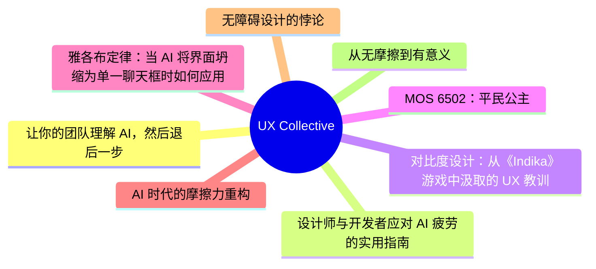
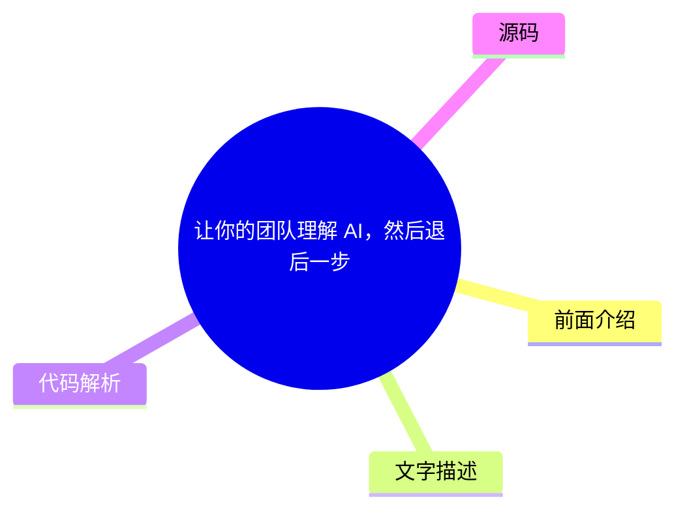
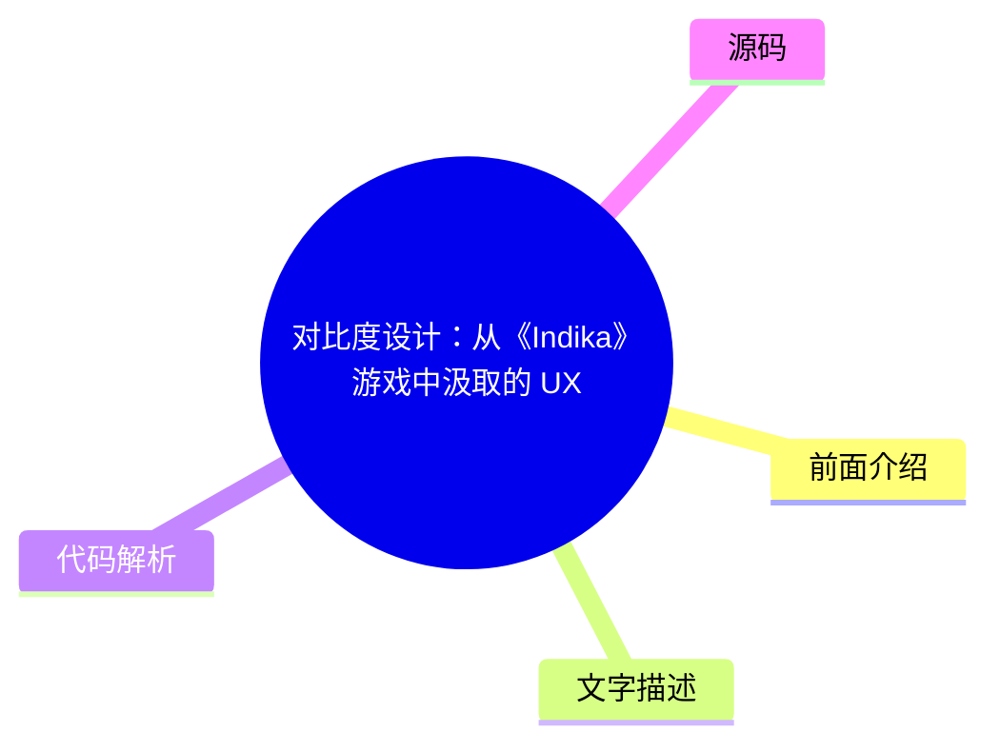
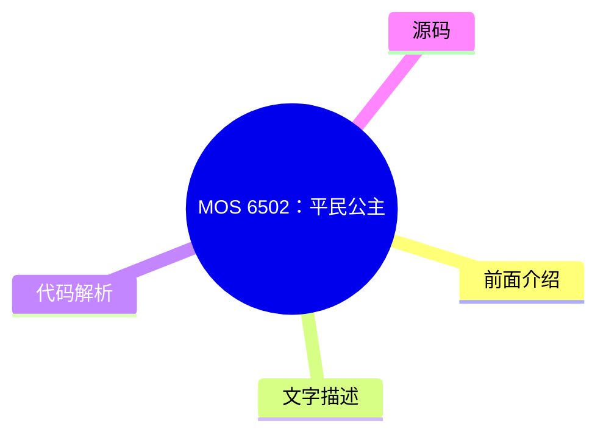
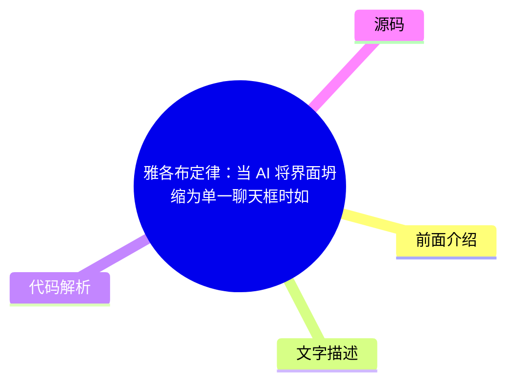
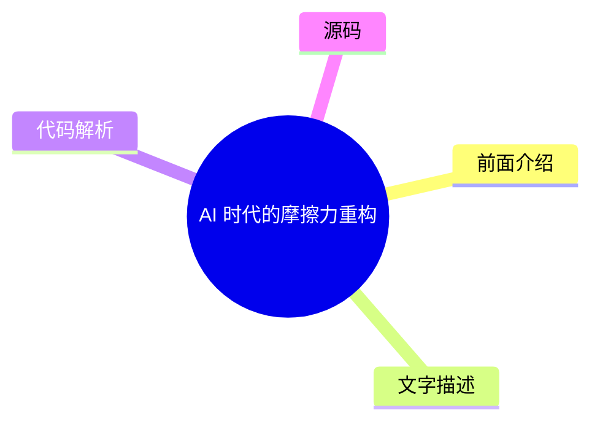
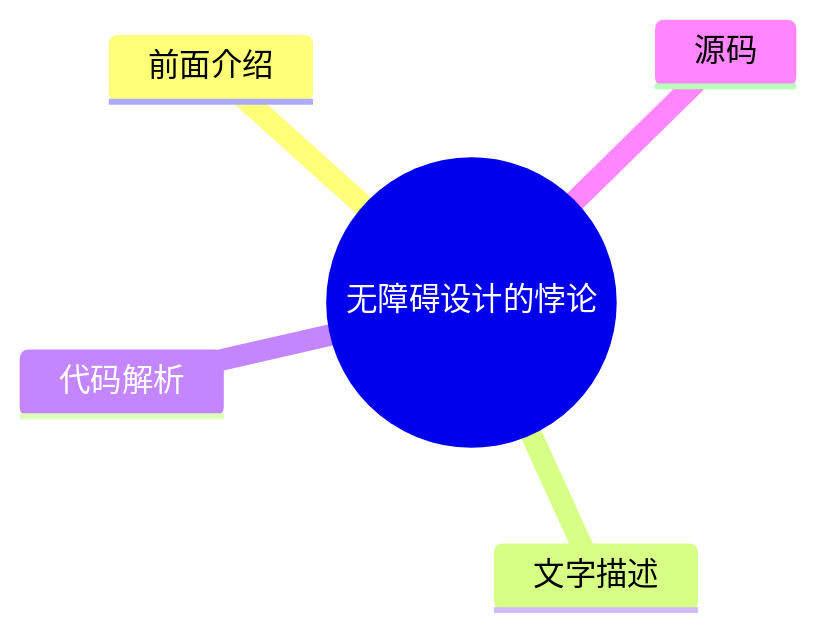

# ✏️ UX Collective Top 8 (2026-07-31)

## 前面介绍

- 数据源：UX Collective
- 抓取日期：2026-07-31
- 条目数：8
- 含完整正文：0
- 含代码片段：0
- 组织方式：前面介绍 / 树状图 / 文字描述 / 代码解析 / 源码

## 思维导图

## 详细整理（8 条，0 条含全文，0 条含代码）

### 1. 让你的团队理解 AI，然后退后一步
- **链接**: [https://uxdesign.cc/your-people-get-ai-get-out-of-their-way-131370c157f8?source=rss----138adf9c44c---4](https://uxdesign.cc/your-people-get-ai-get-out-of-their-way-131370c157f8?source=rss----138adf9c44c---4)
- **作者**: Dan Maccarone
- **发布**: Wed, 29 Jul 2026 21:58:06 GMT

#### 前面介绍

- AI 工具需要被团队理解才能发挥作用。
- 设计者和开发者应从阻碍转变为赋能。

#### 树状图

#### 文字描述

- 文章强调在 AI 时代，设计者和开发者的角色正在转变。
- 核心观点是当团队对 AI 有充分理解时，设计者不应过度干预，而应退后一步。
- 这种策略旨在释放团队的创造力，让他们能够自主地利用 AI 工具解决问题。
- 通过信任团队的能力，可以避免不必要的控制，从而提高工作效率。

#### 代码解析

- 本文未提供源码，以下为实现思路或结构解析：
- 核心在于建立团队对 AI 的认知模型，而非编写具体的代码逻辑。
- 设计者的职责是提供工具和边界，而非替代开发者的决策。
- 通过文档和培训降低 AI 的使用门槛，实现去中心化的创新。

#### 源码

未抓到可展示源码或原文节选。

### 2. 设计师与开发者应对 AI 疲劳的实用指南
- **链接**: [https://uxdesign.cc/battling-ai-fatigue-as-a-designer-and-developer-a-practical-guide-d04a2549e802?source=rss----138adf9c44c---4](https://uxdesign.cc/battling-ai-fatigue-as-a-designer-and-developer-a-practical-guide-d04a2549e802?source=rss----138adf9c44c---4)
- **作者**: Adir SL
- **发布**: Wed, 29 Jul 2026 21:57:29 GMT

#### 前面介绍

- AI 工具的普及带来了效率提升，但也引发了职业倦怠。
- 本文提供了一套实用的策略来应对这种疲劳感。

#### 树状图

#### 文字描述

- 文章探讨了在 AI 浪潮下，设计师和开发者面临的独特挑战。
- 作者分享了如何通过调整工作流程和心态来缓解 AI 疲劳。
- 建议包括合理分配任务、利用 AI 辅助而非完全依赖，以及保持持续学习。
- 通过平衡技术进步与个人身心健康，可以更可持续地推进工作。

#### 代码解析

- 本文未提供源码，以下为实现思路或结构解析：
- 核心在于建立心理防御机制，避免因技术迭代过快而产生的焦虑。
- 建议采用“人机协作”而非“人机对抗”的工作模式。
- 定期进行技术复盘，将 AI 视为增强能力的工具而非替代品。

#### 源码

未抓到可展示源码或原文节选。

### 3. 对比度设计：从《Indika》游戏中汲取的 UX 教训
- **链接**: [https://uxdesign.cc/the-ux-of-contrast-what-indika-taught-me-about-designing-intentional-contradiction-c880e9eaf084?source=rss----138adf9c44c---4](https://uxdesign.cc/the-ux-of-contrast-what-indika-taught-me-about-designing-intentional-contradiction-c880e9eaf084?source=rss----138adf9c44c---4)
- **作者**: Alisa Smelkova
- **发布**: Wed, 29 Jul 2026 21:57:08 GMT

#### 前面介绍

- 游戏设计中的对比度原理对 UI/UX 设计有重要启示。
- 《Indika》展示了如何利用对比度引导用户注意力。

#### 树状图

#### 文字描述

- 文章分析了游戏《Indika》在视觉设计上对对比度的运用。
- 通过强烈的色彩和光影对比，游戏成功地在混乱中建立了清晰的视觉层级。
- 这种设计手法不仅美观，还能有效地引导玩家的视线和操作。
- 对于 Web 和移动应用设计而言，学习这种对比度策略能提升界面的可读性和用户体验。

#### 代码解析

- 本文未提供源码，以下为实现思路或结构解析：
- 核心在于利用色彩理论构建视觉权重，而非依赖复杂的布局算法。
- 设计时应遵循 WCAG 对比度标准，同时结合情感化设计。
- 通过明暗对比来区分前景与背景，增强界面的立体感和层次感。

#### 源码

未抓到可展示源码或原文节选。

### 4. MOS 6502：平民公主
- **链接**: [https://uxdesign.cc/the-mos-6502-the-peoples-princess-0a2f99409834?source=rss----138adf9c44c---4](https://uxdesign.cc/the-mos-6502-the-peoples-princess-0a2f99409834?source=rss----138adf9c44c---4)
- **作者**: Neel Dozome
- **发布**: Tue, 28 Jul 2026 22:21:13 GMT

#### 前面介绍

- MOS 6502 是一款经典的 8 位微处理器。
- 它将街机 UI 概念与廉价计算器芯片结合，产生了深远影响。

#### 树状图

#### 文字描述

- 文章回顾了 MOS 6502 处理器在计算机历史上的地位。
- 尽管它结构简单，但因其低成本和高效能，被广泛应用于早期的游戏机和计算机中。
- 作者探讨了如何将复杂的街机游戏界面概念移植到这种简单的硬件上。
- 这种融合不仅推动了游戏产业的发展，也影响了后续的 UI 设计趋势。

#### 代码解析

- 本文未提供源码，以下为实现思路或结构解析：
- 核心在于在资源受限的硬件上实现复杂的图形渲染。
- 通过优化内存管理和指令集，实现了高效的图形输出。
- 这种设计思路对现代嵌入式系统的 UI 开发仍有参考价值。

#### 源码

未抓到可展示源码或原文节选。

### 5. 雅各布定律：当 AI 将界面坍缩为单一聊天框时如何应用
- **链接**: [https://uxdesign.cc/jakobs-law-how-to-apply-it-as-ai-collapses-surfaces-into-one-chat-box-d8ebc9a727db?source=rss----138adf9c44c---4](https://uxdesign.cc/jakobs-law-how-to-apply-it-as-ai-collapses-surfaces-into-one-chat-box-d8ebc9a727db?source=rss----138adf9c44c---4)
- **作者**: Patrick Neeman
- **发布**: Thu, 30 Jul 2026 22:36:31 GMT

#### 前面介绍

- 雅各布定律指出用户更倾向于使用他们熟悉的系统。
- 在 AI 统一界面的趋势下，如何保持用户习惯是一个挑战。

#### 树状图

#### 文字描述

- 文章探讨了在 AI 驱动的界面中，传统的导航模式正在被打破。
- 随着所有功能都集成到一个聊天框中，用户如何找到他们需要的信息变得困难。
- 作者提出了如何在保持熟悉感的同时，适应这种新的交互模式。
- 关键在于在 AI 的灵活性中建立清晰的导航逻辑和上下文感知。

#### 代码解析

- 本文未提供源码，以下为实现思路或结构解析：
- 核心在于设计上下文感知的导航系统，而非传统的菜单。
- 通过分析用户的历史交互来预测下一步操作，减少认知负荷。
- 在聊天界面中嵌入微交互，以提供明确的视觉反馈。

#### 源码

未抓到可展示源码或原文节选。

### 6. AI 时代的摩擦力重构
- **链接**: [https://uxdesign.cc/rethinking-friction-in-an-ai-world-8f361d62ab5e?source=rss----138adf9c44c---4](https://uxdesign.cc/rethinking-friction-in-an-ai-world-8f361d62ab5e?source=rss----138adf9c44c---4)
- **作者**: Darren Yeo
- **发布**: Thu, 30 Jul 2026 22:33:38 GMT

#### 前面介绍

- 摩擦力在 AI 时代有了新的定义和意义。
- 从“无摩擦”转向“有意义的摩擦”是设计的新方向。

#### 树状图

#### 文字描述

- 文章重新审视了摩擦力在产品设计中的作用。
- 在 AI 时代，完全的“无摩擦”可能导致用户迷失方向或做出错误决策。
- 作者认为，适度的摩擦力可以引导用户进行深思熟虑的操作。
- 设计的目标是在效率与控制之间找到平衡，确保用户始终掌握主动权。

#### 代码解析

- 本文未提供源码，以下为实现思路或结构解析：
- 核心在于设计确认机制和撤销选项，以防止误操作。
- 通过微交互增加操作的反馈感，提升用户的掌控体验。
- 在关键决策点引入延迟或确认步骤，以平衡速度与准确性。

#### 源码

未抓到可展示源码或原文节选。

### 7. 无障碍设计的悖论
- **链接**: [https://uxdesign.cc/the-accessibility-paradox-d2c073256660?source=rss----138adf9c44c---4](https://uxdesign.cc/the-accessibility-paradox-d2c073256660?source=rss----138adf9c44c---4)
- **作者**: Michael Buckley
- **发布**: Thu, 30 Jul 2026 05:24:35 GMT

#### 前面介绍

- 无障碍设计旨在让所有人都能使用产品。
- 但在追求完美的无障碍过程中，可能会遇到意想不到的挑战。

#### 树状图

#### 文字描述

- 文章探讨了无障碍设计在实施过程中遇到的复杂问题。
- 作者指出，有时为了满足特定的无障碍标准，可能会牺牲设计的整体美感或一致性。
- 此外，无障碍设计往往需要跨学科的协作，这增加了开发的复杂性。
- 文章呼吁在设计初期就充分考虑无障碍需求，以避免后期的返工。

#### 代码解析

- 本文未提供源码，以下为实现思路或结构解析：
- 核心在于建立自动化的无障碍检测工具链。
- 通过代码审查和自动化测试，确保符合 WCAG 标准。
- 在开发流程中嵌入无障碍检查点，而非作为后期补充。

#### 源码

未抓到可展示源码或原文节选。

### 8. 从无摩擦到有意义
- **链接**: [https://uxdesign.cc/from-frictionless-to-meaningful-2dc785d6cc4e?source=rss----138adf9c44c---4](https://uxdesign.cc/from-frictionless-to-meaningful-2dc785d6cc4e?source=rss----138adf9c44c---4)
- **作者**: Ida Persson
- **发布**: Mon, 27 Jul 2026 22:00:18 GMT

#### 前面介绍

- 无摩擦的交互虽然流畅，但可能缺乏深度。
- 设计应追求在流畅性与意义感之间取得平衡。

#### 树状图

#### 文字描述

- 文章对比了“无摩擦”与“有意义”两种设计哲学。
- 无摩擦的交互虽然能提升效率，但可能导致用户缺乏参与感。
- 作者认为，有意义的交互应该包含用户的主动选择和思考过程。
- 通过引入适当的挑战和反馈，可以增强用户对产品的投入和忠诚度。

#### 代码解析

- 本文未提供源码，以下为实现思路或结构解析：
- 核心在于设计游戏化的元素，增加用户的参与度。
- 通过动态难度调整，保持用户的挑战感和成就感。
- 在交互中融入叙事元素，提升用户的情感共鸣。

#### 源码

未抓到可展示源码或原文节选。

