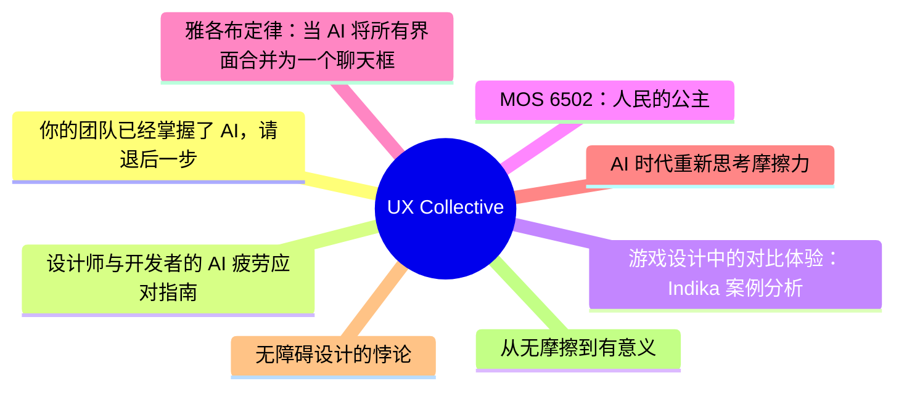
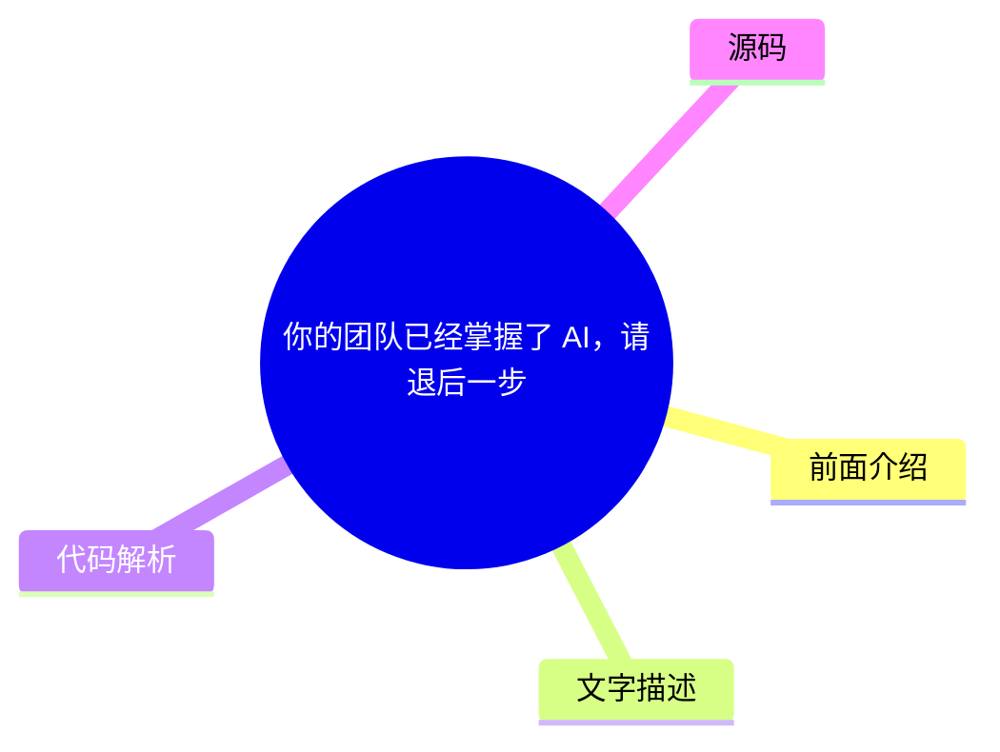
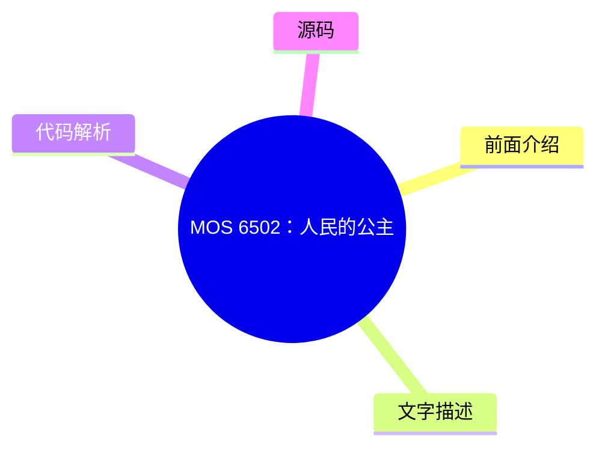
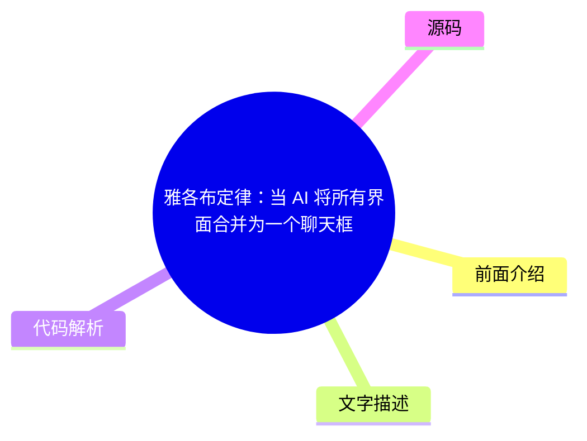
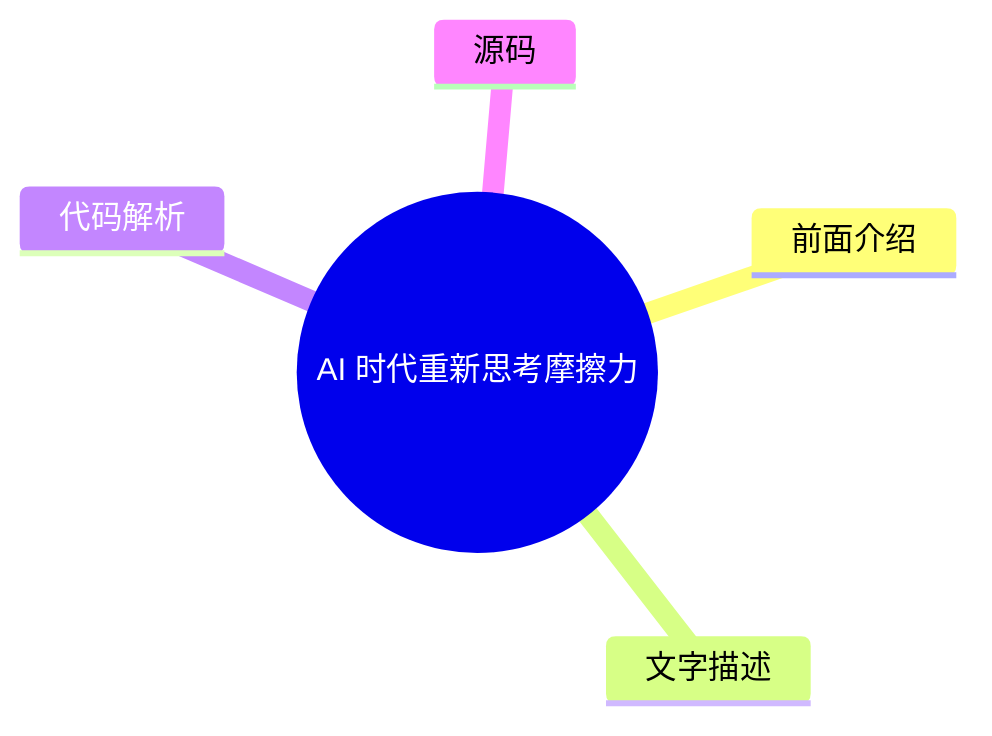
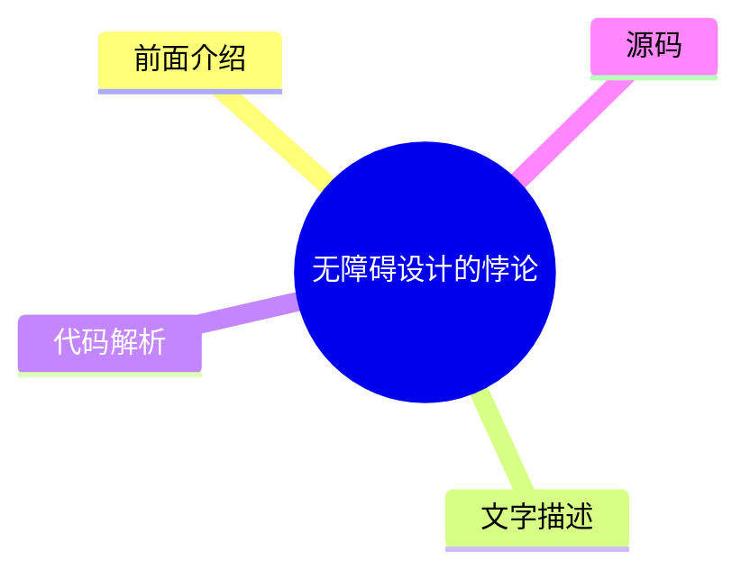

```mermaid
mindmap
  root((游戏设计中的对比体验：Indika 案例分析))
    前面介绍
    文字描述
    代码解析
    源码
```

# ✏️ UX Collective Top 8 (2026-08-01)

## 前面介绍

- 数据源：UX Collective
- 抓取日期：2026-08-01
- 条目数：8
- 含完整正文：8
- 含代码片段：0
- 组织方式：前面介绍 / 树状图 / 文字描述 / 代码解析 / 源码

## 思维导图

## 详细整理（8 条，8 条含全文，0 条含代码）

### 1. 你的团队已经掌握了 AI，请退后一步
- **链接**: [https://uxdesign.cc/your-people-get-ai-get-out-of-their-way-131370c157f8?source=rss----138adf9c44c---4](https://uxdesign.cc/your-people-get-ai-get-out-of-their-way-131370c157f8?source=rss----138adf9c44c---4)
- **作者**: Dan Maccarone
- **发布**: Wed, 29 Jul 2026 21:58:06 GMT

#### 前面介绍

- 95% 的企业 AI 项目失败并非因为工具，而是因为使用工具的公司缺乏信任和流程。
- 大公司因官僚主义和审批流程阻碍了员工的创造力，而小团队则能快速决策。
- 真正的挑战不在于技术，而在于组织是否愿意放权给那些已经理解工具的人。

#### 树状图

#### 文字描述

- 文章对比了一家百年老厂和一个小型初创团队在 AI 使用上的截然不同的结果。
- 大厂虽然引入了 AI，但缺乏明确的策略和教育，导致产品经理在没有指导的情况下盲目开发。
- 小团队通过创始人作为过滤器，避免了“委员会式设计”，让设计师和开发者共同决策。
- 作者指出，AI 的兴起改变了“制造”的难度，过去稀缺的“管理”技能变得不再重要。
- 企业需要从奖励“控制者”转向信任“执行者”，让 AI 工具真正发挥作用。

#### 代码解析

- 本文未提供源码，以下为实现思路或结构解析

#### 源码

#### 中文节选

# 你的团队懂 AI。别再阻碍他们。

*我们都在使用相同的工具。获胜的公司将是那些愿意信任那些已经了解他们的人的公司。*

这里有一个更多人应该讨论的数字：[95%](https://fortune.com/2025/08/18/mit-report-95-percent-generative-ai-pilots-at-companies-failing-cfo/) 的企业 AI 项目毫无进展。MIT 调查了原因，答案与使用的工具无关。而是使用工具的公司。

我最近进行了两次对话，它们几乎解释了为什么这么多公司在利用 AI 寻求成功时面临挑战。这两次对话的对象是来自不同行业、试图使用相同工具、但结果却截然不同的人。

将他们区分开来的是公司规模以及随之而来的一切：官僚主义的层级、审批流程的繁琐，以及关于谁有权做决策的百年历史。

第一次对话的对象是一位在一家百年制造企业负责 UX 的朋友，那是一个拥有真实工厂、品牌连你的父母都能认出来的地方。她很敏锐，并且想出了如何快速利用 AI 进行构建。不幸的是，她的公司没有。它甚至最近才决定数字化很重要，而领导层的整个 AI 策略就是告诉所有人要加快速度，却不告诉或教育任何人如何做到这一点。

她的产品经理基本上是直接打开 Claude 开始构建东西，而在没有人同意他们实际上在构建什么之前，这导致了数十个半成品产品，在没有策略的情况下盲目发展。她是 UX 负责人，比那些 PM 资历更深，是唯一能将所有精力引导到正确方向的人，但她做不到。

她被困在等待 IT 批准她团队已经在使用的相同 AI 工具的访问权限，一次又一次地请求从未到来的许可，而那些判断力只有她几分之一的人却在发布平庸的产品，解决不了任何实际问题。

第二次对话是与我所在的一个小型产品团队的工程负责人进行的，那种团队的特点是，在重要的会议中创始人依然在场。我们正在商讨设计审批的流程，而在小团队中，默认做法是让所有利益相关者都参与进来，最终导致[委员会式设计](https://www.nngroup.com/articles/design-by-committee/)，这可靠地会产出任何事物的最差版本。

值得称赞的是，他在这个想法刚萌芽时就将其扼杀了。他说，在日常工作中，他和设计师会共同做出决定并继续推进。只有真正重大的问题才会交给创始人或整个团队。

当他对创始人说明他的职责时，这个见解真正出现了：他的工作现在就是充当一个过滤器，过滤掉琐碎的事情，从而节省她的注意力，让她只关注真正需要她做决策的少数事项。从而消除了任何基于委员会做决策的必要性。

这两家公司都是以相同的方式处理流程的。

#### 完整正文（中文）

# 你的团队懂 AI。别再阻碍他们。

*我们都在使用相同的工具。获胜的公司将是那些愿意信任那些已经了解他们的人的公司。*

这里有一个更多人应该讨论的数字：[95%](https://fortune.com/2025/08/18/mit-report-95-percent-generative-ai-pilots-at-companies-failing-cfo/) 的企业 AI 项目毫无进展。MIT 调查了原因，答案与使用的工具无关。而是使用工具的公司。

我最近进行了两次对话，它们几乎解释了为什么这么多公司在利用 AI 寻求成功时面临挑战。这两次对话的对象是来自不同行业、试图使用相同工具、但结果却截然不同的人。

将他们区分开来的是公司规模以及随之而来的一切：官僚主义的层级、审批流程的繁琐，以及关于谁有权做决策的百年历史。

第一次对话的对象是一位在一家百年制造企业负责 UX 的朋友，那是一个拥有真实工厂、品牌连你的父母都能认出来的地方。她很敏锐，并且想出了如何快速利用 AI 进行构建。不幸的是，她的公司没有。它甚至最近才决定数字化很重要，而领导层的整个 AI 策略就是告诉所有人要加快速度，却不告诉或教育任何人如何做到这一点。

她的产品经理基本上是直接打开 Claude 开始构建东西，而在没有人同意他们实际上在构建什么之前，这导致了数十个半成品产品，在没有策略的情况下盲目发展。她是 UX 负责人，比那些 PM 资历更深，是唯一能将所有精力引导到正确方向的人，但她做不到。

她被困在等待 IT 批准她团队已经在使用的相同 AI 工具的访问权限，一次又一次地请求从未到来的许可，而那些判断力只有她几分之一的人却在发布平庸的产品，解决不了任何实际问题。

第二次对话是与我在一个小产品团队共事的工程负责人进行的，那种团队的特点是，在重要的会议中创始人仍然在场。我们正在商讨设计审批的流程，而在小团队中，默认做法是让所有利益相关者都参与进来，最终导致[委员会式设计](https://www.nngroup.com/articles/design-by-committee/)，这可靠地会产出任何事物中最糟糕的版本。

值得称赞的是，他在这个想法刚萌芽时就将其扼杀了。他说，在日常工作中，他和设计师会共同做出决定并继续推进。只有真正重大的问题才会交给创始人或全体团队。

当他告诉创始人，他目前的职责是充当一个过滤器，过滤掉琐碎的事情，从而为她节省精力，让她专注于真正需要她做决策的少数事项时，洞察力真正产生了。因此，消除了任何基于委员会决策的需求。

这两家公司都在使用相同的工具，比如 Claude 和 Cursor。区别在于，其中一家足够小，可以让值得信赖的团队成员做出良好的决策，而另一家则花费了一个世纪建立了一套机制，以确保没有许可就不会做出任何决策。

这看起来像是一个大公司的问题，而且大部分情况确实如此，但并非完全如此。真正将这两家公司区分开来的，比规模更深层次的是：处于顶层的人是否足够信任执行工作的人，以至于愿意退后一步，不干涉。

一家拥有百年历史的制造商完全可以做出这种选择，就像一家五人初创公司一样。大多数公司只是不会这么做。

**这从来都不是关于技术**

归根结底，整体挑战不在于 AI。大多数公司自上而下都是为奖励控制而构建的，奖励那些拥有流程、签字批准、管理部门的人，而且这样做是有充分理由的，因为在一百年里，制造东西是困难的部分，而谁能调动资源去制造，谁就能获得晋升和赞扬。

[Gary Hamel](https://www.humanocracy.com/) 多年来一直致力于论证，层级制度实际上是我们应对信息匮乏的答案。当处于顶层的人是唯一能看清全貌的人时，将每一个决策都上报给他们是合理的，而且指挥和协调所有工作的技能确实是真正稀缺的。

这两件事不再成立了。

现在，每个人都能透过树木看到森林，而我们为了管理创造者而给予的奖励——我们花费了一个世纪去提拔和推崇的那些人——不再像过去那样是稀缺且宝贵的了。

正如我们所知，[创造不再是最难的部分](https://medium.com/user-experience-design-1/everyones-sharpening-knives-for-the-wrong-fight-56844adad459)，这意味着我们建立起来用于寻找、提拔和保护控制者的过时系统，现在成了阻碍贵公司与那些已经知道该怎么做的人之间的最大障碍。

**你的人员已经破解了它**

[Ethan Mollick](https://www.oneusefulthing.org/p/detecting-the-secret-cyborgs) 给你公司里那些默默破解了这一难题的人起了一个名字：秘密赛博格。他们正在使用 AI 来更高效、更快地完成工作，并且故意不告诉你，因为你们公司制定的关于 AI 的规则是出于恐惧而制定的，承认使用了它感觉就像承认自己是可以被替代的一样。

[微软和领英的工作趋势指数](https://www.microsoft.com/en-us/worklab/work-trend-index/ai-at-work-is-here-now-comes-the-hard-part) 用真实数据证明了这一点：大约四分之三的知识工作者已经在工作中使用了 AI，其中大多数人是在未经批准的情况下偷偷带入自己的工具，而且超过一半的人不会承认在重要的事情上使用了它。[麦肯锡](https://www.mckinsey.com/capabilities/tech-and-ai/our-insights/superagency-in-the-workplace-empowering-people-to-unlock-ais-full-potential-at-work) 发现领导层对员工 AI 使用情况的评估低了三倍，并以最礼貌的咨询口吻得出结论：瓶颈不在劳动力，而在领导层。

想想看。人们已经自发地适应了。他们适应得如此之快、如此之安静，以至于你甚至没有察觉到，而你之所以仍然无法察觉，是因为他们已经学会了向你展示是危险的。

**挡路的机制**

这就是为什么公司无法追赶的原因，这与领导层有多聪明或他们愿意投入多少时间毫无关系。

我们正处于一代人的转变之中，这迫使人们不得不正视过时的结构、脱节的政策以及对变革的单纯恐惧。

[Steve Blank](https://steveblank.com/2015/05/19/organizational-debt-is-like-technical-debt-but-worse/) 将这种累积的混乱称为组织债务，它是技术债务的结构性表亲，悄无声息地累积，直到最终成为阻碍你的东西。

六十年前，[Douglas McGregor](https://en.wikipedia.org/wiki/Theory_X_and_Theory_Y) 将管理分为两种理论。X 理论假设人们需要被监督和指导，否则就会偷懒。Y 理论假设人们，一旦被赋予值得做的事情，就会全力投入。大多数公司在全员大会上都说 Y 理论，但他们的构建方式却是 X 理论。每一个关卡、每一次审批、每一句“在做事之前先让我知道”都是对这种信念的小小纪念碑：他们认为决策最安全的地方是在执行工作的人之上。

[Gary Hamel](https://www.humanocracy.com/) 再次花费职业生涯为这种信念标价：官僚主义的纯粹拖累，以及那些产出仅仅是“许可”的层级。在我们刚刚离开的那个世界里，这种“拖累”是可以忍受的，那是协调大量人员所支付的税。而在现在的世界里，这种拖累是致命的，因为官僚主义最不擅长保护的东西，恰恰是突然变得最重要的东西：关于什么值得做的那个快速、可信、基于人性的决策。

[Marty Cagan](https://www.svpg.com/product-vs-feature-teams/) 多年来一直在向产品界大声疾呼这一观点。有些团队你把解决方案交给他们，让他们去构建；有些团队你信任他们去发现问题并解决问题。第一类团队交付他们被告知的内容。第二类团队则做出决定。

你将会对哪一个 AI 让价值翻了十倍感到震惊，以及哪一个又是大多数公司历史上结构上最渴望产生的，感到惊讶。

**“抓握”的成本**

这里开始变得昂贵了。 [Amy Edmondson](https://www.hbs.edu/faculty/Pages/item.aspx?num=54851) 关于心理安全的全部著作表明，人们只有在感到安全时，才会向你展示他们的真实想法、他们的失误、他们的怪异实验。一家将 AI 使用视为合规风险而非超能力的公司，正在暗中指示其最优秀的人将最好的工作锁在抽屉里。

## 在您的收件箱中获取 Dan Maccarone 的故事

加入 Medium 免费获取该作者的更新。

[Daniel Pink](https://en.wikipedia.org/wiki/Drive:_The_Surprising_Truth_About_What_Motivates_Us) 写了一本关于什么真正推动知识型工人的书，而猜猜看，那不是控制！那是自主权、精通、目的。如果你抓方向盘抓得太紧，你不仅会拖慢你最好的员工，还会让他们感到无聊。

拥有稀有、可迁移技能的无聊的人不会长时间保持无聊。他们会离开。通常是为了一个会说“是”并退后一步的领导者。

**没有人会轻易放弃地位**

那么，为什么有些公司就是不肯松手？因为你在要求拥有最大权力的人自愿承认，那件赋予他们权力的东西现在价值降低了。那位通过成为大楼里最精明的制造者而爬上企业阶梯的经典高管，现在管理着一座制造不再是最有价值的部分的大楼。

没有人会轻易放弃地位，所以他们没有选择松手，而是选择了收紧抓握。

他们添加一个审查环节，要求被纳入流程，编造了一个新的步骤让他们站在工作面前，因为如果他们不能再成为房间里最敏锐的创造者，他们至少还是那个你需要签字批准的人。[Das Narayandas](https://www.library.hbs.edu/working-knowledge/why-employees-resist-ai-and-how-companies-can-win-them-over) 深入研究了为什么 AI 推广会停滞，并发现了那个隐藏在眼皮底下的罪魁祸首：这些工具威胁到了那些必须批准它们的人的身份和地位。这表现为多了一个审批步骤，多了一个“让我们先对齐一下”的要求，而在任何人被允许实际开展工作之前。

这是一个真正令人迷失方向的地方，而最可用的、最人性化的反应是抓得更紧。添加一个审查。要求被纳入流程。[Erik Brynjolfsson](https://www.aeaweb.org/articles?id=10.1257%2Fmac.20180386) 已经证明，通用技术的回报总是滞后，有时会滞后数年，而这种滞后是组织在缓慢而痛苦地围绕新现实重建自己。

这一切都不会等你。你的员工能做的事情和你公司允许他们做的事情之间的差距每天都在扩大，而正是你在维持着这个差距。如果这有助于理解，你可以称之为治理，但所有重要的人都知道，现实是恐惧。

**它实际上如何改变**

公司并没有注定要完蛋……还不会。真正的改变不会来自公告。不是公司范围的邮件，不是全员大会谈论现在一切都不同了，不是给每个员工开通 Claude 访问权限并宣称“我们现在进入 AI 了！”这些只是公司在想要获得改变功劳但实际上并没有做时所发出的噪音。

他们一直以来的改变方式是通过一个其他人真正信任的人。[Nancy Baym](https://hbr.org/2026/03/peer-influence-can-make-or-break-your-ai-rollout) 在微软的研究发现了一个导致采用停滞的、没人预料到的原因：学习是隐形的。工具在运行，培训也在进行，但破解它的人是在后台完成的，所以其他人永远看不到他们是如何做到的。

还记得之前提到的秘密赛博格吗？真正推动一个……

由于输入内容被截断（显示为 "...（截断，原文 15282+ 字符）"），我无法获取完整的原文进行翻译。

请提供需要翻译的具体文本内容。

### 2. 设计师与开发者的 AI 疲劳应对指南
- **链接**: [https://uxdesign.cc/battling-ai-fatigue-as-a-designer-and-developer-a-practical-guide-d04a2549e802?source=rss----138adf9c44c---4](https://uxdesign.cc/battling-ai-fatigue-as-a-designer-and-developer-a-practical-guide-d04a2549e802?source=rss----138adf9c44c---4)
- **作者**: Adir SL
- **发布**: Wed, 29 Jul 2026 21:57:29 GMT

#### 前面介绍

- 过度使用 AI 会导致“AI 疲劳”，让人感觉失去了对生活的掌控感。
- 应限制在个人生活中使用 AI，保留自己规划假期和决策的权利。
- 应亲自完成那些有趣或能带来成就感的小任务，而不是全部外包给 AI。

#### 树状图

#### 文字描述

- 作者发现，当在个人项目中使用 AI 时，会感到一种奇怪的疏离感，这是 AI 疲劳的信号。
- 建议在个人生活中避免使用 AI，例如自己规划旅行，而不是依赖 AI 生成行程。
- 对于能带来乐趣的任务（如编写 CSS 动画或撰写文章），应亲自完成，因为 AI 无法体验乐趣。
- 写作被视为思考的过程，不应完全外包给机器，但可以借助 AI 进行信息检索和反馈。
- 不要追求 100 倍的生产力，这会导致自我倦怠，应专注于工作质量而非数量。

#### 代码解析

- 本文未提供源码，以下为实现思路或结构解析

#### 源码

#### 中文节选

## 关于使用 AI 做一切事项的警告

不久前，我需要一个新应用来记录我的开支，以便更好地管理我的资金，所以我搜索了 iOS App Store。

我找到了许多用于费用报告、预算编制和一般资金管理的应用，但感觉有些不对劲。作为一名 UI 设计师和前端开发人员，我能在设计中发现模式，而这些应用并非人类制作。

我找到的大多数应用都是 AI 生成的、基于氛围编码的应用，我真的不想使用其中的任何一个，所以我决定自己制作一个开支应用。

我在终端中启动了 Claude Code，开始制作一个 Web 应用，这个 Web 应用我在 iOS 的 Safari 中打开，然后从那里我使用了“[添加到主屏幕](https://support.apple.com/en-il/guide/iphone/iph42ab2f3a7/ios)”功能，让它像原生 iOS 应用一样使用，或多或少。

我对 Claude Code 并不陌生，我之前也 vibe coded 过应用和网站——无论是为了工作还是个人使用，但这次感觉有些不同。

在工作中，我整天都在使用 AI，我用 Claude Code 编写网站，我也使用同一个 AI 在 Figma 中生成设计，我经常起草邮件，并让 AI 助手让它们听起来更稳健或更专业，有时我甚至让 AI 起草邮件本身。

我做的有些项目是在 Figma 中使用 AI 提示生成的，然后使用 AI 将 Figma 中的生成设计编码成真实的网站，最后，我会附上听起来很专业的 AI 生成的邮件消息和实时网站链接，将项目发送给客户，AI 完成了所有实际工作。

我描述的这种基于 AI 的工作流程如今并不罕见。

我描述的这种基于 AI 的工作流程如今并不罕见，很多人用 AI 做一切事情，前端开发经常被引用为受 AI 使用影响最大的行业。

尽管如此，我认为这就是为什么我在业余时间使用 AI vibe coding 我的个人开支 Web 应用时感觉有些奇怪的原因，我也把我的业余时间卸载到了 AI 工作流程中。

我意识到这是业内现在所称的“AI 疲劳”的迹象，我找到了几种改善它的方法，因此决定在这篇文章中分享它们。

## 尝试限制 AI 的使用

并非所有任务都需要经过 ChatGPT、Claude、Gemini 或你选择的 AI 助手。即使这项任务可以更快完成，亲力亲为也会有一种成就感。首先，如果你在工作中大量使用 AI，我建议尝试在个人生活中避免使用它。

如果你计划一次旅行，你可以像十年前那样，通过搜索谷歌和向朋友寻求推荐来自己规划。你会错过一些景点吗？有可能。但从长远来看，这重要吗？可能不重要。

如果你能摆脱那种让你仅仅成为自己生活中旁观者的 AI 心境，那这一切都是值得的；如果这种情况只发生在你的工作生活中，那会感觉容易处理得多。

正如泰勒·德登在《搏击俱乐部》（1999）中告诉我们的那样

#### 完整正文（中文）

## 关于使用 AI 做一切事项的警告

不久前，我需要一个新应用来记录我的开支，以便更好地管理我的资金，所以我搜索了 iOS App Store。

我找到了许多用于费用报告、预算编制和一般资金管理的应用，但感觉有些不对劲。作为一名 UI 设计师和前端开发人员，我能在设计中发现模式，而这些应用并非人类制作。

我找到的大多数应用都是 AI 生成的、基于氛围编码的应用，我真的不想使用其中的任何一个，所以我决定自己制作一个开支应用。

我在终端中启动了 Claude Code，开始制作一个 Web 应用，这个 Web 应用我在 iOS 的 Safari 中打开，然后从那里我使用了“[添加到主屏幕](https://support.apple.com/en-il/guide/iphone/iph42ab2f3a7/ios)”功能，让它像原生 iOS 应用一样使用，或多或少。

我对 Claude Code 并不陌生，我之前也 vibe coded 过应用和网站——无论是为了工作还是个人使用，但这次感觉有些不同。

在工作中，我整天都在使用 AI，我用 Claude Code 编写网站，我也使用同一个 AI 在 Figma 中生成设计，我经常起草邮件，并让 AI 助手让它们听起来更稳健或更专业，有时我甚至让 AI 起草邮件本身。

我做的有些项目是在 Figma 中使用 AI 提示生成的，然后使用 AI 将 Figma 中的生成设计编码成真实的网站，最后，我会附上听起来很专业的 AI 生成的邮件消息和实时网站链接，将项目发送给客户，AI 完成了所有实际工作。

我描述的这种基于 AI 的工作流程如今并不罕见。

我描述的这种基于 AI 的工作流程如今并不罕见，很多人用 AI 做一切事情，前端开发经常被引用为受 AI 使用影响最大的行业。

尽管如此，我认为这就是为什么我在业余时间使用 AI vibe coding 我的个人开支 Web 应用时感觉有些奇怪的原因，我也把我的业余时间卸载到了 AI 工作流程中。

我意识到这是业内现在所称的“AI 疲劳”的一个迹象，我找到了几种改善它的方法，因此决定在这篇文章中分享它们。

## 尝试限制 AI 的使用

并非所有任务都应该经过 ChatGPT、Claude、Gemini 或你选择的 AI 助手。即使这项任务可以更快完成，自己动手做也会有一种成就感。首先，如果你在工作中大量使用 AI，我建议尝试在个人生活中避免使用它。

如果你计划度假，你可以像十年前那样，通过搜索谷歌和向朋友寻求推荐来自己规划。你会错过一些景点吗？有可能。但从长远来看，这重要吗？可能不重要。

如果你能摆脱那种让你仅仅成为自己生活中旁观者的 AI 心境，那这就值得；如果只是在工作生活中，那感觉会容易得多。

正如“搏击俱乐部”（1999 年）中泰勒·德顿告诉我们的，“你不是你的工作”（见上图），如果你的工作要求你使用某种技术——这并不意味着**你**需要使用它，只有你的职场人设需要。你的业余时间属于你自己。

## 自己做有趣的部分

我知道这部分可能有争议，但那些你可以用和 AI 同样的时间自己完成的小而简单的任务——**你应该自己做**。不仅如此，你还应该自己做有趣的部分，而不是要求 AI 协助，即使这意味着完成它会花更长时间，因为有趣的部分是为了你，**AI 不会替你感到有趣。**

找出你认为有趣的部分是主观的，每个人对不同的部分都会感到有趣，有些程序员喜欢其中的数学运算，有些喜欢构建 UI，我喜欢手动编写 CSS 动画，所以我不会要求 AI 为我做那部分。我会自己制作动画。

此外，我从不要求 AI 为我代笔。绝不。不是这篇文章，不是 WhatsApp，不是 Slack 消息，什么都不是。如果我向世界发送某些内容，那是我自己写的。

对我来说，写作就是思考，我不想把它外包给机器。

我可能会咨询 AI 关于写作过程，可能会向它询问信息或摘要，或者征求它对我写作的意见，但写作本身是我的，背后的思考是我的，最终决定要改变什么也是我的。对我来说，写作就是思考，我不想把它外包给机器，至少现在不想。

## 不要追求 100 倍效率

如果你在流程中使用 AI 来提高效率，你可能已经比以前提高了 5 到 10 倍。试图最大化这一点并成为 100 倍高效的人会导致你陷入痴迷和自我倦怠，请不要那样对待自己。

投资于工作质量，而不是数量。

我知道这非常诱人，你告诉自己可以在一周甚至更短的时间内完成一年的工作，但请意识到工作是无穷无尽的，你永远无法完成**所有**事情，工作总是会占据你更多的时间。[警惕生产力悖论。](https://calnewport.com/beware-of-productivity-paradoxes/)

更好的方式是保持 10 倍的效率，只是工作得更快乐，而不是更努力、更长时间，只是让工作更令人满意，投资于工作质量，而不是数量。

投资于工作本身，而不是让你达到这一步的流程，因为没有任何流程能 100% 地正常工作，你会越来越疯狂地试图通过新的模型、新的应用程序或新方法来完善流程，而不是在 AI 流程的帮助下完善你所做的工作。

## 你并没有落后

技术人员总是告诉你，你必须使用任何新技术，否则你将被抛在后面，在不久的将来变得无关紧要。

我现在就告诉你——**通过不尝试任何新的 AI 助手、任何新的编码应用程序或不使用最新的模型，你并没有落后。**

每当某样东西成为你工作的必需品时，你到时候自然会学会它。你不需要像准备数字末日那样，提前了解所有现有的数字工具来做好准备。工具会来来去去，在宏大的格局中，它们很少重要。

你不需要像准备数字末日那样，提前去了解所有现有的数字工具。

让我举一个我工作经历中的例子，我记得 Sketch 刚推出的时候，它是一款专为 UI 设计师从零构建的 UI 设计软件，在此之前的设计软件都是像 Adobe Illustrator 或 Photoshop 这样的通用工具。

我的许多朋友都加入了 Sketch 的行列，他们很早就开始学习它，并在自己的工作中尽可能多地使用它，试图说服他们的管理层投资新的设计工具，并为它开辟新的工作流程。

我没有那样做，因为 Sketch 只支持 Mac，而我在 2020 年之前一直使用的是 Windows，所以我一直在等待，同时继续使用 Adobe 的应用程序。几年后，Figma 出现了（并赢得了 UI 设计软件的竞争）。

我当然学习了 Figma，但因为没有学习 Sketch，相比于大多数同龄人，我对设计工具的疲劳感要少一些。我能够更快地成为 Figma 专家，而且我不需要说服我的管理层放弃基于 Adobe 的工作流程，因为早在一年或两年前，许多人就已经为了 Sketch 而放弃了 Adobe 的工作流程。

大多数时候，选择获胜的技术，一旦变得清晰，将比试图学习所有新工具（担心被抛在后面）要好得多。你会让自己对技术感到彻底的厌倦。

## 结论

对 AI 感到疲劳是很自然的，因为 AI 似乎已经完全接管了我们生活的方方面面，但在这篇文章中，我概述了一些对我有效的关键点。

把 AI 留在工作场所感觉是一种解脱，就像在 21 世纪初，我们把互联网留在家庭电脑里，直到回家才去想它。

此外，我还放下了关于生产力提高 100 倍或被抛在身后的误解，这些想法你经常能听到，无论是来自你的同龄人还是社交媒体，但它们在现实中毫无根据。

具有讽刺意味的是——我所有的这一切的起因，也就是让我写下这篇文章的支出应用 froggo，仍然是我每天用来追踪资金的工具，它也赢得了在 iPhone 主屏幕上的位置。

这些是我用过的一些技巧，但在为这篇文章做研究时，我在网上看到了更多技巧，我相信很多人也有自己的策略。

如果你发现了对你有效且对他人也有效的技巧，请在评论区留言，我会阅读所有评论，迫不及待地想看看什么对其他人有效。

请记住，AI 的使用确实会影响你的情绪，所以要明智地使用它。

感谢读到结尾 🙏

### 3. 游戏设计中的对比体验：Indika 案例分析
- **链接**: [https://uxdesign.cc/the-ux-of-contrast-what-indika-taught-me-about-designing-intentional-contradiction-c880e9eaf084?source=rss----138adf9c44c---4](https://uxdesign.cc/the-ux-of-contrast-what-indika-taught-me-about-designing-intentional-contradiction-c880e9eaf084?source=rss----138adf9c44c---4)
- **作者**: Alisa Smelkova
- **发布**: Wed, 29 Jul 2026 21:57:08 GMT

#### 前面介绍

- Indika 游戏通过“玩家体验对比”（PX Contrast）创造了多重解读空间。
- 游戏在视觉、声音和节奏上故意制造冲突，以表达主角内心的矛盾。
- PX Contrast 要求不同系统服务于同一主题，且必须是有意为之的设计选择。

#### 树状图

#### 文字描述

- Indika 讲述了一个年轻修女对抗内心恶魔的故事，游戏世界随着剧情发展从写实转向超现实。
- 作者提出 PX Contrast 是一种持续的状态，让相互冲突的体验共存，而非简单的视觉差异。
- PX Contrast 与“游戏叙事失调”不同，后者通常被视为设计缺陷，而前者是有意为之的体验设计。
- 游戏通过混合喜剧与悲剧、现实与梦境逻辑，引导玩家在多个层面解读故事。
- 这种设计支持了游戏关于信仰、身份和感知的主题，而非仅仅作为美学装饰。

#### 代码解析

- 本文未提供源码，以下为实现思路或结构解析

#### 源码

#### 中文节选

# 对比度的用户体验：来自《Indika》游戏设计的启示

## 介绍 PX Contrast：一种有意叠加的冲突玩家体验，旨在引发有意的多重解读

对比度是设计引导注意力时最熟悉的[视觉工具](https://www.nngroup.com/articles/visual-hierarchy-ux-definition/)之一。但在《Indika》中，它变成了游戏用户体验工具。它塑造了玩家解读故事的方式。这款由 Odd Meter 于 2024 年发行的游戏，因其非传统的叙事手法，在 2025 年游戏变革奖上获得了[最佳叙事奖](https://www.gamingamigos.com/post/games-for-change-2025-impact-awards?utm_source=chatgpt.com)。

我最初在发布时玩了《Indika》，有一件事一直困扰着我：为什么体验的不同部分看起来像是属于完全不同的游戏？它的玩法、音效、进度和 UI 不断与玩家的预期相悖，但它们共同表达的是同一种情感冲突。

我将这种方法称为**玩家体验对比度** *(PX Contrast)*：一种冲突的玩家体验共存的持续状态，允许玩家同时持有对同一互动的不同解读。

## 一位修女、一个恶魔，以及一个不再讲理的世界

你扮演 Indika，一位年轻的东正教修女，她从完全顺从走向彻底拒绝自己的信仰。她随身带着恶魔，字面意义上就在她的脑子里，在修道院墙外寻找身份。他低语着 Indika 从不敢大声说出的话，提出了她最初视为罪孽的问题。随着游戏进行，他的声音和她自己的声音之间的界限变得越来越模糊。

这种内在的分裂也体现在她周围的世界中。起初，Indika 感到出奇地脚踏实地。游戏在修道院中开始，那里的景象完全可信。在俄罗斯长大，我立刻认出了修道院的视觉语言，这种熟悉感让后来世界的转变感觉更加令人不安。

随着游戏的进行，那种真实感就像《Indika》的确定性一样崩塌了。历史准确性让位于梦境逻辑：像谷仓一样大的奶牛、蒸汽动力机械、巨大的钟，以及许多其他怪诞的事物。你走得越远，这个世界就越不“真实”，Indika对自己所相信的事情也越不确定。

她发现的世界只能被描述为一种直接源自陀思妥耶夫斯基和布尔加科夫小说的悲喜剧的狂野结合。—— 游戏官方

[Steam 页面](https://store.steampowered.com/app/1373960/INDIKA/)

这一描述非常贴切地捕捉到了游戏的基调。它在黑色幽默和真正的恐惧之间不断摇摆，将故事包裹在象征主义和梦境逻辑之中。就连“Indika”这个名字也感觉是刻意为之。它与大麻属的相似性增加了另一层可能的含义，尤其是考虑到游戏中反复出现的关于感知和现实扭曲的主题。

这种象征主义也反映了创作者 Dmitry

#### 完整正文（中文）

# 对比度的用户体验：来自《Indika》游戏设计的启示

## 介绍 PX Contrast：一种有意叠加的冲突玩家体验，旨在引发有意的多重解读

对比度是设计引导注意力时最熟悉的[视觉工具](https://www.nngroup.com/articles/visual-hierarchy-ux-definition/)之一。但在《Indika》中，它变成了游戏用户体验工具。它塑造了玩家解读故事的方式。这款由 Odd Meter 于 2024 年发行的游戏，因其非传统的叙事手法，在 2025 年游戏变革奖上获得了[最佳叙事奖](https://www.gamingamigos.com/post/games-for-change-2025-impact-awards?utm_source=chatgpt.com)。

我最初在发布时玩了《Indika》，有一件事一直困扰着我：为什么体验的不同部分看起来像是属于完全不同的游戏？它的玩法、音效、进度和 UI 不断与玩家的预期相悖，但它们共同表达的是同一种情感冲突。

我将这种方法称为**玩家体验对比度** *(PX Contrast)*：一种冲突的玩家体验共存的持续状态，允许玩家同时持有对同一互动的不同解读。

## 一位修女、一个恶魔，以及一个不再讲理的世界

你扮演 Indika，一位年轻的东正教修女，她从完全顺从走向彻底拒绝自己的信仰。她随身带着恶魔，字面意义上就在她的脑子里，在修道院墙外寻找身份。他低语着 Indika 从不敢大声说出的话，提出了她最初视为罪孽的问题。随着游戏进行，他的声音和她自己的声音之间的界限变得越来越模糊。

这种内在的分裂也体现在她周围的世界中。起初，Indika 感到出奇地脚踏实地。游戏在修道院中开始，那里的景象完全可信。在俄罗斯长大，我立刻认出了修道院的视觉语言，这种熟悉感让后来世界的转变感觉更加令人不安。

随着游戏的进行，那种真实感就像《Indika》的确定性一样崩塌了。历史准确性让位于梦境逻辑：像谷仓一样大的牛、蒸汽动力机械、巨大的钟，以及许多其他怪诞的事物。你走得越远，这个世界就越不“真实”，Indika对自己所相信的事情就越不确定。

她发现的世界只能被描述为一种直接源自陀思妥耶夫斯基和布尔加科夫小说的悲剧与喜剧的狂野结合。—— 游戏官方

[Steam 页面](https://store.steampowered.com/app/1373960/INDIKA/)

这种描述非常贴切地捕捉到了游戏的基调。它在黑暗喜剧和真正的恐惧之间不断摇摆，将故事包裹在象征主义和梦境逻辑之中。就连“Indika”这个名字也感觉是刻意为之。它与大麻（Cannabis indica）的相似性增加了另一层可能的含义，尤其是考虑到游戏中反复出现的关于感知和现实扭曲的主题。

这种象征主义也反映了创作者德米特里·斯韦特洛夫（Dmitry Svetlov）自己的经历。在 [《卫报》的采访](https://www.theguardian.com/games/2024/may/02/indika-russian-orthodox-church-fairytale-game-dmitry-svetlov-interview) 中，他描述了自己在成为无神论者之前是信教的。与其说是批评信仰本身，不如说游戏探索的是塑造一个人身份的更广泛的信念和价值体系。

像任何强有力的象征主义作品一样，它邀请多种解读。以下是我对游戏的解读，以及我认为其游戏 UX 设计在其中所起的作用。

## 定义 PX 对比：有意义矛盾的三个条件

PX 对比建立在现有的游戏 UX 对比讨论（例如 Salama 的 [亲和力与对比](https://medium.com/@salamatizm/presence-in-practice-affinity-vs-contrast-in-game-ux-5549fef85ad6) 框架）之上，但将这一概念扩展到了瞬间的摩擦或破坏沉浸感的元素之外。

PX 对比是有意叠加的相互冲突的玩家体验，它们共存但不解决，允许玩家同时持有对同一交互的多种解读。

在此语境下，“对比”一词不仅仅指视觉差异或并置的对立元素。在 PX 对比中，系统的差异会在玩家解读体验和感受紧张感的方式上制造矛盾。

PX 对比在满足以下三个条件时生效：

- 两个或多个系统（界面、声音、节奏、进程、环境等）对同一种体验产生不同的解读，从而允许对立的含义共存。
- 这些元素之间的对比服务于同一个潜在主题，而不是仅仅作为一种纯粹的美学或机械选择而存在。
- 这种对比是故意的。这是一种深思熟虑的设计选择，旨在支持玩家的解读，而非未解决的矛盾。

### PX 对比与叙事与玩法不和谐

另一个密切相关的是 [叙事与玩法不和谐](https://clicknothing.com/2007/10/07/ludonarrative-d/)，该术语由 Clint Hocking 于 2007 年创造，描述的是游戏的故事与其机制背道而驰的时刻。从那时起，一些设计师和批评家开始将其视为一种刻意使用的工具，而非需要避免的东西。例如，Connor Jackson 就主张摆脱 Hocking 将该概念视为缺陷的框架，转而将其视为一种 [富有意义的表达手段](https://journals.sagepub.com/doi/10.1177/15554120261438561)。

不和谐描述的是玩家感到不匹配的感觉，而 PX 对比描述的是创造这种紧张感的设计结构。不仅仅是玩法与叙事的对立，还包括界面、声音、节奏、进程和环境都在为同一种情感紧张感做出贡献。

## Indika 如何使用 PX 对比

在 *Indika* 中，玩家与主角拥有相同的破碎感知：神圣的仪式与游戏化的机制相冲突，缓慢的现实与快速的记忆相对立，扭曲的空间与正常的空间并存。双方都没有获胜，从而产生了一种持续的紧张感，这种紧张感反映了 Indika 无法解决其信仰困境的状态。

作为 PX Contrast 的一个案例研究，游戏的界面、节奏和音效各自以不同的方式挑战着玩家的预期。然而，这些相互冲突的系统并没有制造混乱，而是汇聚在一起，教导玩家如何透过 Indika 那破碎的视角去观察世界。

### 1. 界面：将信仰转化为反馈

同样引起我注意的是，界面本身如何成为叙事的一部分，以及它如何塑造了我体验主角旅程的方式。界面并没有支持世界的虚构设定，反而与它产生了距离，使玩家的视角与 Indika 的自身体验保持一致。

界面逐渐重塑着玩家的预期：那些本应感觉神圣的行为被重新构建为普通的游戏互动。这映射了 Indika 对信仰的情感疏离（她是在“玩”而不是真正相信）。宗教仪式已经失去了任何意义。它们现在只是思维游戏中的几个节点。界面教导玩家同时持有神圣和游戏化的解读，而不必做出选择。

这种解读也在 Svetlov 的话中得到了体现：

这款游戏成为了我们故事的一个重要隐喻。我们都在玩的游戏，遵循着并非我们制定的规则，等待着“胜利”时注定属于我们的奖励，并在“失败”时生活在对惩罚的恐惧中。—— Dmitry Svetlov

[Game Developer](https://www.gamedeveloper.com/design/inside-indika-s-powerful-bleak-exploration-of-religion)

从设计角度来看，游戏提出了一个问题：这种出现在角色附近的、具有空间感的 UI 元素，是有意为之的[非叙事性](https://www.gamedeveloper.com/design/game-ui-discoveries-what-players-want)（仅对玩家可见，不属于游戏世界），还是 Indika 实际上能将这些游戏界面元素感知为她自身心理现实的一部分？

我认为游戏并没有提供明确的答案，而这正是这个问题如此有趣的原因。这两种解读都为 PX Contrast 做出了贡献，通过有意的设计扩展了叙事。

- 如果 UI 仅对玩家存在，它会在玩家和世界之间制造距离。

- 如果 Indika 也能看到它，界面就变成了她破碎感知的另一种表达，延伸了这样一个观点：我们所体验的世界是由她的精神状态塑造的。

游戏机制与仪式在世界中呈现的意义相矛盾。点燃蜡烛和祈祷并非被呈现为精神反思的时刻，而是被呈现为产生积分和奖励的动作。

通常，这种游戏玩法与叙事之间的差距会被视为设计不一致。在这里，这种不一致变成了关于角色内心冲突的刻意反馈。

### 2. 声音：当祈祷听起来像是一种奖励

Indika 中的声音遵循与 UI 相同的对比逻辑，当你将其分解为一个序列时，这一点最容易看出：

- 玩家做了什么
- 他们预期听到什么
- 他们实际听到了什么
- 这种不匹配让他们有什么感觉

**Indika 点燃蜡烛并祈祷。** 这个动作承载着真实宗教仪式的分量，因此玩家自然会期待寂静、崇敬或某种克制的声音。相反，游戏用明亮、欢快的复古铃声来回应。那种在 Duolingo 中说“你做到了”的声音，而不是在教堂里说“你被听到了”的声音。

大脑将其解读为一种小奖励，一个完成的任务。这种解读直接与该动作本身的宗教意义发生碰撞，玩家同时持有这两种解读。这正是 Indika 对自己信仰感到的那种不和谐：姿态依然在执行，但背后的意义已经悄然消逝。

声音设计没有像传统那样强化氛围，而是在动作反馈和情感语境之间制造了刻意的摩擦。神圣而令人不安的声音与欢快、游戏化的效果和 UI 并存，迫使玩家质疑这些元素如何能属于同一种体验。

### 3. 节奏：缓慢的虔诚与快速的记忆

在“真实”的游戏世界中，移动缓慢而沉重。最初的任务之一，提着水桶，需要真实的时间和精力，这强化了修道生活的单调乏味。

在“真实”的游戏世界中，移动缓慢而沉重。最初的几项任务之一——提着水桶——需要耗费真实的时间和精力，这进一步强化了修道士生活的单调乏味。Indika 记忆中的平台跳跃部分则截然相反：快速、反应灵敏，有时甚至令人真正感到紧张。这种节奏上的基调转变，是贯穿整个游戏的另一条对比线索。

在赛车环节，“真实”世界与 Indika 记忆之间的对比变得更加明确。Indika 询问如何控制车辆，答案通过角色对话中嵌入的字面按钮指令呈现出来（*并非通过通常的屏幕控制提示*）。游戏为玩家设定的规则变成了 governing Indika 自己记忆的规则，模糊了玩家现实与她的现实之间的界限。

随着恶魔影响力的增强，他的声音变得更加执着，现实之间的界限开始崩塌。屏幕被红色淹没，音乐变得激烈，他的声音与扭曲的声音融合在一起，压倒了 Indika 自身的存在。随后，一段简短的祈祷将她拉回了“正常”的现实：色彩回归，恶魔的声音消失，但在下方仍残留着低沉、沉闷的声音。

在这些状态之间切换，将对比转化为一种游戏机制：玩家学会将视觉、声音和控制的改变解读为 Indika 心理状态的信号。

### 4. 进度的错觉

就像 Indika 的其余设计一样，进度系统借鉴了复古游戏（retro）的视觉和声音设计……（截断，原文 17476+ 字符）

### 4. MOS 6502：人民的公主
- **链接**: [https://uxdesign.cc/the-mos-6502-the-peoples-princess-0a2f99409834?source=rss----138adf9c44c---4](https://uxdesign.cc/the-mos-6502-the-peoples-princess-0a2f99409834?source=rss----138adf9c44c---4)
- **作者**: Neel Dozome
- **发布**: Tue, 28 Jul 2026 22:21:13 GMT

#### 前面介绍

- MOS 6502 芯片将街机游戏 UI 概念与廉价计算器芯片结合，开创了个人电脑时代。
- Altair 8800 的发布标志着个人计算机的普及，改变了人们使用计算机的方式。
- 该芯片的架构设计影响了后续许多计算机系统，成为计算机历史上的重要里程碑。

#### 树状图

#### 文字描述

- 1975 年《Popular Electronics》杂志封面展示了 Altair 8800，这是第一款可负担的商业个人电脑。
- 该杂志的技术编辑 Les Solomon 负责评估各种车库计算机项目，并与 Ed Roberts 合作开发。
- Altair 8800 的成功激发了人们对个人计算的兴趣，为后来的计算机革命奠定了基础。
- MOS 6502 芯片以其低成本和低功耗，被广泛应用于 Apple II、Commodore 64 等早期计算机中。
- 它不仅是一颗芯片，更是连接街机游戏体验与家庭计算梦想的桥梁。

#### 代码解析

- 本文未提供源码，以下为实现思路或结构解析

#### 源码

#### 中文节选

Member-only story

# The MOS 6502: the people’s princess

## The impact of blending arcade game UI concepts with the power of affordable 1970s calculator chips.

On the cover of the January, 1975 edition of *Popular Electronics* was a model that set hearts aflame and pulses racing — at least, in our corner of geekdom. The magazine announced a major breakthrough in consumer electronics that was being eagerly anticipated: the first affordable, commercial personal computer. The device that promised to end waiting times for time-share slices on a mainframe to check if a computer programme worked or paying a king’s ransom to own a machine.

Named after a real star (but referenced in a Star Trek episode as a planet), it was called the “[ALTAIR 8800](https://en.wikipedia.org/wiki/Altair_8800)”.

In fact,[ the Altair 8800 owed inspiration to  Popular Electronics](https://www.nutsvolts.com/magazine/article/micro_memories_200301)

*.*As the publication of record of the period’s technology scene, the magazine’s technical editor Les Soloman was inundated by with pitches about experimental garage computers. To evaluate these pitches, Solomon corresponded with an engineer and entrepreneur he trusted named Ed Roberts.

#### 完整正文（中文）

Member-only story

# The MOS 6502: the people’s princess

## The impact of blending arcade game UI concepts with the power of affordable 1970s calculator chips.

On the cover of the January, 1975 edition of *Popular Electronics* was a model that set hearts aflame and pulses racing — at least, in our corner of geekdom. The magazine announced a major breakthrough in consumer electronics that was being eagerly anticipated: the first affordable, commercial personal computer. The device that promised to end waiting times for time-share slices on a mainframe to check if a computer programme worked or paying a king’s ransom to own a machine.

Named after a real star (but referenced in a Star Trek episode as a planet), it was called the “[ALTAIR 8800](https://en.wikipedia.org/wiki/Altair_8800)”.

In fact,[ the Altair 8800 owed inspiration to  Popular Electronics](https://www.nutsvolts.com/magazine/article/micro_memories_200301)

*.*As the publication of record of the period’s technology scene, the magazine’s technical editor Les Soloman was inundated by with pitches about experimental garage computers. To evaluate these pitches, Solomon corresponded with an engineer and entrepreneur he trusted named Ed Roberts.

### 5. 雅各布定律：当 AI 将所有界面合并为一个聊天框
- **链接**: [https://uxdesign.cc/jakobs-law-how-to-apply-it-as-ai-collapses-surfaces-into-one-chat-box-d8ebc9a727db?source=rss----138adf9c44c---4](https://uxdesign.cc/jakobs-law-how-to-apply-it-as-ai-collapses-surfaces-into-one-chat-box-d8ebc9a727db?source=rss----138adf9c44c---4)
- **作者**: Patrick Neeman
- **发布**: Thu, 30 Jul 2026 22:36:31 GMT

#### 前面介绍

- 随着 AI 助手成为任务的主要入口，用户习惯于使用熟悉的界面模式。
- AI 助手的统一性降低了学习成本，使得新工具的采用速度更快。
- 设计组件和语义层变得至关重要，因为它们提供了跨不同助手的清晰预期。

#### 树状图

#### 文字描述

- 雅各布定律指出，用户会将自己习惯使用的网站行为应用到新网站上。
- 过去 30 年，设计系统团队致力于保持界面与更广泛网络习惯的一致性。
- 现在，越来越多的任务通过 AI 助手完成，而不是通过独立的网站或应用。
- AI 助手（如 Claude、ChatGPT）通过统一的对话界面处理各种任务，减少了用户需要学习的界面数量。
- Slack、Teams 等平台也在集成 AI 代理，使得对话本身就是与软件交互的界面。

#### 代码解析

- 本文未提供源码，以下为实现思路或结构解析

#### 源码

#### 中文节选

# Jakob 定律：如何将其应用于 AI 将各种表面坍缩为一个聊天框

## 像 Claude 这样的助手正通过对话式的前端入口处理更多任务。Jakob Nielsen 的熟悉界面定律现在正欢快地指向了助手本身。

“用户的大部分时间都花在其他网站上。” —

[Jakob Nielsen, Jakob’s Law (2000)](https://jakobnielsenphd.substack.com/p/jakobs-law)

Jakob Nielsen 在 2000 年写下了这条定律，它比那个 Web 时代的其他几乎所有事物都更长久地存续了下来。他的许多戒律依然成立，这并非因为技术停止了进步——它从未停止——而是因为人们改变的速度远不及他们的工具。

其含义是：用户期望你的网站像他们已经知道的那些网站一样运作，就像我们期望汽车以某种特定方式运作一样，也就是说，如果方向盘是一堆操纵杆，我就不想租或买那辆车。

这就是为什么组织建立了设计系统团队——为了坚持应用程序设计的最佳实践，以便每个屏幕都与人们已经预期的内容保持一致，同时又能在品牌范围内进行创新。

在过去的 30 年里，这意味着要匹配更广泛网络的惯例，因为那是用户建立习惯的地方

但这正在迅速改变。

越来越多的任务不再始于网站或应用程序——它们始于一个助手。你让 Claude 或 ChatGPT 起草电子邮件或提取数字，工作通过一个对话式界面完成，而不是来自不同供应商和设计团队的十几个分散的界面。

一个人接触的界面数量正在减少，助手正成为任务的入口，而这些任务过去通常在多个浏览器标签页中拥有各自的目的地。

它们的相似性是一个特性，因为每个助手都运行在相同的模式上——一个提问框、一个回复、一来一往——学会一个就等于学会了所有，因此一个新的 AI 工具不需要说明书，其采用速度也比任何引导流程所能管理的都要快。

这是经过设计的，因为我们正在学习如何适应这个新时代。

Jakob’s Law usually reads as a warning against deviating; here it runs the other way, as the reason uptake is this quick. The more these interfaces resemble each other, the less anyone has to learn, and the more willing people are to try the next one which gives us a chance to be creative in inventing the future. This flips his law on its head.

That’s why [design components](https://ux-components.com/) and their semantic layer matter more than ever — they make conventions explicit and predictable, the clear expectations users need to move across sites and the legible structure an agent needs to read one.

That doesn’t retire Jakob’s Law; it moves the work to a different set of surfaces and requires even more standardzation.

If most use cases now flow through the assistant, the question for anyone building software isn’t only whether your product works when reached through that surface — it’s whether you’ve given the agent enough contex

#### 完整正文（中文）

# Jakob 定律：如何将其应用于 AI 将各种表面坍缩为一个聊天框

## 像 Claude 这样的助手正通过对话式的前端入口处理更多任务。Jakob Nielsen 的熟悉界面定律现在正欢快地指向了助手本身。

“用户的大部分时间都花在其他网站上。” —

[Jakob Nielsen, Jakob’s Law (2000)](https://jakobnielsenphd.substack.com/p/jakobs-law)

Jakob Nielsen 在 2000 年写下了这条定律，它比那个 Web 时代的其他几乎所有事物都更长久地存续了下来。他的许多戒律依然成立，这并非因为技术停止了进步——它从未停止——而是因为人们改变的速度远不及他们的工具。

其含义是：用户期望你的网站像他们已经知道的那些网站一样运作，就像我们期望汽车以某种特定方式运作一样，也就是说，如果方向盘是一堆操纵杆，我就不想租或买那辆车。

这就是为什么组织建立了设计系统团队——为了坚持应用程序设计的最佳实践，以便每个屏幕都与人们已经预期的内容保持一致，同时又能在品牌范围内进行创新。

在过去的 30 年里，这意味着要匹配更广泛网络的惯例，因为那是用户建立习惯的地方

但这正在迅速改变。

越来越多的任务不再始于网站或应用程序——它们始于一个助手。你让 Claude 或 ChatGPT 起草电子邮件或提取数字，工作通过一个对话式界面完成，而不是来自不同供应商和设计团队的十几个分散的界面。

一个人接触的界面数量正在减少，助手正成为任务的入口，而这些任务过去通常在多个浏览器标签页中拥有各自的目的地。

它们的相似性是一个特性，因为每个助手都运行在相同的模式上——一个提问框、一个回复、一来一往——学会一个就等于学会了所有，因此一个新的 AI 工具不需要说明书，其采用速度也比任何引导流程所能管理的都要快。

这是经过设计的，因为我们正在学习如何适应这个新时代。

Jakob’s Law 通常被解读为对偏离的警告；在这里，它却反其道而行之，成为了这种快速普及的原因。这些界面越相似，人们需要学习的内容就越少，也就越愿意尝试下一个界面，这给了我们在创造未来时发挥创造力的机会。这彻底颠覆了他的定律。

这就是为什么 [设计组件](https://ux-components.com/) 及其语义层比以往任何时候都更重要——它们使约定俗成变得明确且可预测，这是用户跨越不同网站所需的清晰期望，也是代理需要阅读的清晰结构。

这并没有让 Jakob’s Law 失效；它只是将工作转移到了不同的界面，并要求更严格的标准化。

如果大多数用例现在都通过助手流转，那么对于任何构建软件的人来说，问题不仅在于你的产品通过该界面访问时是否有效——还在于你是否通过使用标准模式，为代理提供了足够的上下文来良好地使用它。

## 界面数量正在减少

在计算的大部分历史中，软件呈指数级增长；每一项工作都有其特定的目的地——一个应用程序、一个网站、一个工具，每个都有其需要学习的界面——直到主屏幕被填满，浏览器标签页多到数不清。

Jakob’s Law 的存在正是因为有如此多的界面，用户需要它们表现一致，因为下拉菜单就是下拉菜单。

助手则走向了另一个方向，将工作吸收到一个地方。

现在，人们通过他们已经打开的任意助手来路由工作——[Anthropic Claude](https://claude.ai/)、[Microsoft Copilot](https://copilot.microsoft.com/)、[Google Gemini](https://gemini.google.com/)、[ChatGPT](https://chatgpt.com/)——而不是为每项任务打开不同的工具。

这不仅仅是独立助手的问题，因为人们已经使用的聊天工具本身也已成为独立的对话界面：Slack 现在直接在其频道中运行 AI 代理，包括来自 Anthropic 等公司的第三方代理，[Microsoft Teams 将 Copilot 及其代理放在了与同事交谈的同一个窗口中](https://slack.com/blog/news/ai-innovations-in-slack)。

开源项目将这一理念进一步推进：[OpenClaw](https://docs.openclaw.ai/)，一个快速增长的自主托管代理，会将您选择的模型——Claude、GPT、Gemini——放入您已经在使用的任何消息应用中，从 Slack 和 Teams 到 Discord、WhatsApp 和 Telegram。

人们彼此之间正在进行的对话，现在也成为了他们与软件对话的地方，因此用户无需重新学习。

OpenAI 允许第三方应用在 ChatGPT 内部运行，因此您可以在不离开对话的情况下[搜索列表、制作演示文稿或播放列表](https://openai.com/index/introducing-apps-in-chatgpt/)。Anthropic 的模型上下文协议从另一侧完成了同样的工作：它是一个[连接助手与数据及工具所在系统的开放标准](https://www.anthropic.com/news/model-context-protocol)，用单一协议取代了一堆一次性集成。Claude 通过这一连接访问您的日历、文档和问题跟踪器。

更深层的变化在于该助手到达那里后所做的事情。

它不仅仅在一个地方回答问题——它会主动去执行解释工作。Claude Cowork 接收一个目标，并在您的文件和应用程序之间[跨文件工作，综合多个来源的信息并返回一个完成的交付成果](https://www.anthropic.com/product/claude-cowork)，而不是一次回答一个提示。

将其指向工作，它就会在各个来源之间移动。访问十几个网站、阅读每个网站并拼凑出它们含义的劳动——这正是 Jakob 定律旨在减少的确切认知成本——代理现在几乎完全吸收了。用户陈述结果；解释工作在视线之外发生。

访问十几个网站、阅读每个网站并拼凑出它们含义的劳动——这正是 Jakob 定律旨在减少的确切认知成本——代理现在几乎完全吸收了。该代理现在为您打包信息，一旦我们部署好 API，这将极大地改善企业体验。

Put it together and the direction is clear. The number of surfaces in the world isn’t shrinking — software keeps multiplying as fast as ever; What’s falling is the number any one user touches directly, because the assistant has become the common surface and an agent increasingly does the cross-surface work the person used to do by hand.

We’ve watched a version of this before. The late-1990s web was a sprawl of directories and portals — Yahoo’s hand-built index of where to go. [Then search collapsed all of that into a single box](https://medium.com/muzli-design-inspiration/five-ux-lessons-from-the-webcrawler-and-ask-jeeves-era-about-the-ai-experience-transition-54e281a60672).

And sometimes the count drops to zero.

A surface doesn’t always shrink into the assistant — sometimes it never appears at all, because the work has gone ambient. An agent watching your inbox files the receipt, flags the renewal, and reschedules the meeting in the background, and the first you hear of it is a summary after the fact, if that.

There’s no screen to open and no conversation to start, so the interface Jakob’s Law was written about simply isn’t there — which is a harder design problem than a familiar screen, not an easier one.

**Action items**

- **Map the journey across surfaces.**Lay out the user’s end-to-end journey, then mark which steps now happen in an assistant, which still happen in your product, and where the handoffs fall. The handoffs are where expectations break and where your design work moves.
- **Watch where tasks start.**For a week, note when you reach for an assistant before the app you’d once have opened — your own behavior is the leading indicator for your users’, and sets expectations immediately.
- **Stop counting screens and reducing clicks as wins.**Retire the metrics that reward time-in-app and page views. If the assistant does the task, those numbers fall even when you’re winning.

## Jakob’s Law Points at the Assistant Now

Jakob’s Law is a claim about reference points and users build mental models in the places they spend their time, then carry those expectations everywhere else. When the time was spent across many websites, the reference set was the web’s shared furniture — logo top-left, search top-right, cart and notifications in the corner.

When the time is spent in an assistant, the reference set becomes the assistant.

You type a request in plain language, get something back, and refine it in conversation, expecting it to remember what you said two turns ago. [Hundreds of millions of people now do this every week](https://techcrunch.com/2025/10/06/sam-altman-says-chatgpt-has-hit-800m-weekly-active-users/), and it’s becoming the default expectation for how you get a computer to do something.

That’s the point — assistants are becoming the default in many cases, which helps with adoption.

It’s no longer just “work like other websites.” It’s “work the way the assistant works,” because that’s the interaction your users are fluent in now. I’ve called the plain-language input the asking box in earlier writing; the larger point is that the asking box is no longer one pattern among many. It’s becoming the pattern — the entry point a growing share of tasks pass through.

This is Jakob’s Law doing exactly what it always did. It’s just that the place users spend their time consolidated, so the expectations consolidated with it.

**Action items**

- **Learn the new conventions firsthand so you know how to design for them.**Spend a week doing real work inside Claude, Copilot, Gemini, or ChatGPT, and write down the interaction patterns you come to expect. That list is your users’ new baseline.
- **Audit your feature against them.**Hold your own AI feature to that baseline and fix every place it behaves differently for no reason — difference without a reason is friction.
- **Don’t reinvent the input.**The asking box is a convention now; a clever custom take on it just taxes people to relearn something they already do fluently everywhere else.

## You May Not Own the Surface Anymore

If a use case flows through the assistant, the interface your user sees is the assistant’s, not yours. They ask Claude to find every auto-renewal clause in their contracts, and Claude reaches your contract platform through a connector, does the work, and answers in the chat. The user never opens your application. They never see your navigation, your carefully built dashboard, your brand. Your product did the work and stayed invisible.

That’s the real consequence of fewer surfaces.

For a meaningful set of tasks, you don’t own the surface anymore and it looks like service design. The assistant does. Jakob’s Law still applies — but now it applies to the assistant’s interface, which you don’t control, and your job shifts from designing the destination to being legible through someone else’s.

For a meaningful set of tasks, you don’t own the surface anymore, the assistant does.

This is where the affordance problem  flagged early comes back, relocated. She pointed out that a bare chat input has no affordances — [the same rectangle looks like a search box, a login form, and a credit card field](https://wattenberger.com/thoughts/boo-chatbots). When your product is reached through that rectangle, its capabilities are only as visible as the assistant makes them. Users won’t discover your features by clicking around. They’ll discover them only if the assistant knows your product can do the thing and surfaces it at the right moment. Users are not used to having the ability to ask what the agent does; they have to get the courage to ask, and even more so, know what the right questions are.

So the work moves to a different lay

...（截断，原文 22008+ 字符）

### 6. AI 时代重新思考摩擦力
- **链接**: [https://uxdesign.cc/rethinking-friction-in-an-ai-world-8f361d62ab5e?source=rss----138adf9c44c---4](https://uxdesign.cc/rethinking-friction-in-an-ai-world-8f361d62ab5e?source=rss----138adf9c44c---4)
- **作者**: Darren Yeo
- **发布**: Thu, 30 Jul 2026 22:33:38 GMT

#### 前面介绍

- 摩擦力分为交互摩擦、认知摩擦和情感摩擦三种类型。
- 完全消除摩擦可能导致用户无法保留信息，甚至产生不满。
- 适度的摩擦可以引导用户停下来思考，从而提升体验的质量和满意度。

#### 树状图

#### 文字描述

- 新加坡樟宜机场通过自动化通关等技术消除了摩擦，使体验变得“不可忘却”。
- 在 UX 设计中，摩擦力会阻碍用户完成任务或引起心理挫败感。
- AI 虽然能快速处理简单任务，但如果过度追求“无摩擦”，会导致浅层思考和持续消费。
- 作者在开发家长沟通应用时，通过引入交互暂停和认知暂停，反而提高了用户满意度。
- 适度的摩擦可以引导用户关注重要信息，增加对内容的尊重感，使体验更具人性化。

#### 代码解析

- 本文未提供源码，以下为实现思路或结构解析

#### 源码

#### 中文节选

# 重构 AI 时代的摩擦

### “令人遗忘”设计的悖论

“让体验变得令人遗忘，”一位资深业务主管曾对我说。

对于一位以创造难忘时刻为傲的设计师来说，这听起来可能像是个笑话。但作为机场运营主管，他是认真的。

新加坡航空每天要处理数千名旅客。对于这些乘客来说，快乐来自于飞行体验和准点出发。运营团队最不希望看到的是，客户被困在长队中，或者遇到 boarding pass（登机牌）失效等小麻烦，进而招致他们的愤怒和投诉。

在机场，顺畅是隐形的。樟宜机场之所以能保持世界一流水平，原因之一就是其不断投入以消除摩擦。

曾经被认为不可能的“无护照移民通关”技术现已实现。如今，新加坡居民和符合条件的旅客只需走过自动闸机，无需出示护照。在 10 到 30 秒内，他们就能通过海关，相比之下，在其他机场的体验显得格外突兀。

归根结底，目标是让机场体验变得完全令人遗忘。

### 摩擦的三种面孔

你可以在任何地方看到这种模式。没人会爱上银行业务；你只希望银行能保障你的资金，以便你过好自己的生活。这就是像 DBS 这样的银行致力于让银行业务变得隐形的原因。

或者考虑为孩子选择学校。没有父母愿意处理堆积如山的纸质表格，或者仅仅因为属于边缘案例类别就不得不多费周折。他们想要一个无缝的系统，能让他们立即感到安心。

在 UX 设计中，摩擦是指任何减缓用户速度、阻碍其达成目标或引起心理挫败感的事物。它通常以三种方式出现：

- 交互摩擦：完成任务所需的体力付出，例如需要五页的结账流程（两步即可完成）、重复的字段，或在移动端上极小且紧密排列的按钮。

- 认知摩擦：令人困惑的界面带来的心理负担；导航被埋没、标签晦涩难懂，或者布局偏离熟悉模式太远，导致用户停顿并思考：“我接下来该点哪里？”
- 情绪摩擦：因糟糕的体验、结尾出现的意外费用，或在提供清晰价值前要求侵入性权限而引发的焦虑、恼怒或不信任。

当这些微小的挫败感累积时，用户就会放弃。他们会放弃当前的步骤、关闭标签页或卸载应用。因此，现代产品设计的主要宗旨，如航空公司、银行和学校所做的那样，长期以来一直是让数字路径更加顺畅，消除不必要的步骤，让操作感觉毫不费力。

### 当“无摩擦”变得过于容易

最近，无摩擦设计的边界已经扩展到了 AI 工作流。像 ChatGPT 和 Claude 这样的平台，使得使用文本、图片或文档进行提示变得如此轻松，以至于用户能迅速获得结果。

#### 完整正文（中文）

# 重构 AI 时代的摩擦

### “令人遗忘”设计的悖论

“让体验变得令人遗忘，”一位资深业务主管曾对我说。

对于一位以创造难忘时刻为傲的设计师来说，这听起来可能像是个笑话。但作为机场运营主管，他是认真的。

新加坡航空每天要处理数千名旅客。对于这些乘客来说，快乐来自于飞行体验和准点出发。运营团队最不希望看到的是，客户被困在长队中，或者遇到 boarding pass（登机牌）失效等小麻烦，进而招致他们的愤怒和投诉。

在机场，顺畅是隐形的。樟宜机场之所以能保持世界一流水平，原因之一就是其不断投入以消除摩擦。

曾经被认为不可能的“无护照移民通关”技术现已实现。如今，新加坡居民和符合条件的旅客只需走过自动闸机，无需出示护照。在 10 到 30 秒内，他们就能通过海关，相比之下，在其他机场的体验显得格外突兀。

归根结底，目标是让机场体验变得完全令人遗忘。

### 摩擦的三种面孔

你可以在任何地方看到这种模式。没人会爱上银行业务；你只希望银行能保障你的资金，以便你过好自己的生活。这就是像 DBS 这样的银行致力于让银行业务变得隐形的原因。

或者考虑为孩子选择学校。没有父母愿意处理堆积如山的纸质表格，或者仅仅因为属于边缘案例类别就不得不多费周折。他们想要一个无缝的系统，能让他们立即感到安心。

在 UX 设计中，摩擦是指任何减缓用户速度、阻碍其达成目标或引起心理挫败感的事物。它通常以三种方式出现：

- 交互摩擦：完成任务所需的体力付出，例如需要五页的结账流程（两步即可完成）、重复的字段，或在移动端上极小且紧密排列的按钮。

- Cognitive friction: The mental tax of a confusing interface; buried navigation, cryptic labels, or layouts that stray so far from familiar patterns that users pause and think, “What do I click next?”
- Emotional friction: The rise in anxiety, annoyance, or mistrust triggered by a poor experience, surprise fees at the end, or apps demanding intrusive permissions before offering clear value.

When these micro-frustrations compound, users give up. They abandon their steps, close the tab, or uninstall the app. So the primary directive of modern product design, like airlines, banks, and schools, has long been to smooth out the digital road, eliminating unnecessary steps and making actions feel effortless.

### When frictionless becomes too easy

More recently, the frontier of frictionless design has moved into AI workflows. Platforms like ChatGPT and Claude have made prompting with text, images, or documents so effortless that users get results in seconds. Like a digital genie, modern LLMs can grasp user intent from minimal input. Users keep returning because the experience feels smooth, intuitive, and immediately rewarding.

But here’s the uncomfortable question: if AI can remove friction from simple tasks, why not from everything helping someone grasp abstract math, build software, or expand a few bullet points into a full essay?

AI can feel like a silver bullet that removes friction from everything. And that, in itself, can become a slippery slope.

Beneath this frictionless ideal lies a business model built on continuous consumption. The smoother the experience, the more we prompt, the more compute we consume, and the more tokens are spent. But when we optimise entirely for instant output over intentional effort, we trade deep, rigorous thinking for a fast, superficial result.

## A case for “good” friction

I saw this play out firsthand on a parents’ communication app my team built.

最初，我们设计信息流时力求完全无摩擦，使用标准化的公告格式，让滚动变得毫不费力。然而，尽管采用率飙升，支持工单也随之激增。家长们难以记住信息，弄丢附件，并在无限滚动中错过了关键细节。

因此，我们做了一个反直觉的举动：我们重新引入了摩擦力。

我们引入了互动暂停，以吸引人们对附件和活动的注意。我们增加了认知暂停，例如截断内容，迫使家长停下来阅读摘要，并主动点击展开。我们甚至添加了 AI 生成的[对话开场白](https://build.tech.gov.sg/projects/2026/242)到公告和帖子中，以便家长在放学后暂停并思考如何与孩子交谈。

在应用中花费的时间增加了，但客户满意度更高。体验不再那么快，但感觉更加尊重和人性化。

在运营中，无论是在工厂车间还是在机场值机柜台，效率都是王道。消除摩擦能让队伍加快，速度感觉就像是进步。

然而，必要的摩擦点无处不在。工厂依赖紧急停止协议；机场值机要求乘客暂停并确认他们没有携带危险品。就连牛顿第三定律也提醒了它的价值：摩擦力作为地面的阻力，正是让我们能够向前推进的原因。

像 [Ida Persson](/from-frictionless-to-meaningful-2dc785d6cc4e) 这样的设计师开始称这种摩擦为*有意义的摩擦*：这种摩擦保护、澄清或加深人类体验，而不仅仅是减缓体验。

那么，如果摩擦实际上并不是敌人呢？如果有些摩擦不是 meant to be forgotten（意指不应被遗忘），而是 meant to be embraced（意指应当被拥抱）呢？

### 为人类而非机器进行设计

如果有一个[想法](https://medium.com/design-bootcamp/how-a-year-of-running-taught-me-about-design-f5c82f80f8eb)我想在此基础上构建，那就是：即使这意味着保留摩擦力，也要尊重人类价值观、情感和决策过程。

Machines are built for efficiency. They get something done and then forgotten. Human beings are not machines. We are imperfect, sensitive creatures who hold on to emotions, beliefs, and moral values.

Designers are human beings designing for human beings. It may sound obvious, but sometimes we forget why we design and dream of doing away with designing altogether to get quicker answers.

Frictionless AI risks creating passive users: people who accept the first answer, skip reflection, and outsource judgement to a model that doesn’t share their stakes. A bit of deliberate friction:

“Are you sure?”,

“What are you trying to achieve?”,

“Here’s what you might be overlooking”,

can turn a smooth interaction into a meaningful one.

Remove friction where it blocks progress. Keep it where it shapes judgement, builds trust, or deepens meaning.

Because the goal of design is not just to make things easy but to make them matter.

## References

Afterbell. (2026). *Afterbell | {build} hackathon*. GovTech {Build} Hackathon. [https://build.tech.gov.sg/projects/2026/242](https://build.tech.gov.sg/projects/2026/242)

ICA Singapore. (2024). Passport-Less Immigration Clearance at Changi Airport. In *YouTube*. [https://www.youtube.com/watch?v=1SdqDIvcvag](https://www.youtube.com/watch?v=1SdqDIvcvag)

Persson, I. (2026, July 27). *From Frictionless to Meaningful*. UX Collective. Medium. [https://uxdesign.cc/from-frictionless-to-meaningful-2dc785d6cc4e](/from-frictionless-to-meaningful-2dc785d6cc4e)

Rekhi, S. (2018). The Hierarchy of User Friction. In *Medium*. [https://medium.com/@sachinrekhi/the-hierarchy-of-user-friction-e99113b77d78](https://medium.com/@sachinrekhi/the-hierarchy-of-user-friction-e99113b77d78)

### 7. 无障碍设计的悖论
- **链接**: [https://uxdesign.cc/the-accessibility-paradox-d2c073256660?source=rss----138adf9c44c---4](https://uxdesign.cc/the-accessibility-paradox-d2c073256660?source=rss----138adf9c44c---4)
- **作者**: Michael Buckley
- **发布**: Thu, 30 Jul 2026 05:24:35 GMT

#### 前面介绍

- 无障碍设计（如语义化 HTML）本意是为了帮助残障用户，却意外地帮助了 AI 爬虫。
- AI 训练数据集大量使用了为无障碍设计的 alt 文本和结构化内容。
- 为了阻止 AI 抓取内容而部署的反机器人措施（如 CAPTCHA），反而给视障用户带来了更大的障碍。

#### 树状图

#### 文字描述

- 无障碍标准（如 WCAG）旨在改善人类可访问性，但 AI 模型也利用这些结构化数据来学习。
- LAION-5B 等大型数据集通过抓取网页上的 alt 文本，为图像生成模型提供了训练材料。
- 这种数据收集方式往往未经创作者的同意，引发了关于版权和伦理的争议。
- 为了防止数据被滥用，网站部署了 CAPTCHA 等验证机制，但这些机制对屏幕阅读器用户极不友好。
- 视障用户成为了反机器人措施的无辜受害者，这暴露了无障碍与内容控制之间的潜在冲突。

#### 代码解析

- 本文未提供源码，以下为实现思路或结构解析

#### 源码

#### 中文节选

Accessibility is one of those rare concepts that almost nobody argues against. Making websites easier to navigate for people with disabilities is a fairly uncontested virtue. Semantic HTML, descriptive links, meaningful image descriptions, and keyboard navigation all help create a web that is more inclusive and usable.

Yet the AI era has introduced an unexpected, deeply ironic wrinkle into this story. The websites doing the most to make information accessible to humans are often the same websites making it easiest for machines to harvest. Obviously, this was never the goal. The [Web Content Accessibility Guidelines (WCAG)](https://www.w3.org/WAI/standards-guidelines/wcag/) were developed to help people, not artificial intelligence.

A screen reader needs to understand the structure of a page, and so does an AI crawler. A visually impaired user benefits from meaningful image descriptions, and so does a multimodal model attempting to associate language with visual concepts. And a search engine benefits from semantic HTML, as does a large language model collecting training data.

The common denominator is that the content is structured to make it more accessible to humans and more interpretable by machines. As a result, the web’s accessibility standards have undergone an unintended role reversal. They began as accommodations for people with disabilities. Today they also function as infrastructure for one of the largest technological industries in history.

### From Alt Text to Training Data

One of the clearest examples of these unintended consequences appears in the datasets behind today’s image generators. [LAION-5B](https://arxiv.org/pdf/2210.08402), one of the largest public image-text datasets, paired images from [Common Crawl](https://commoncrawl.org/), a nonprofit archive of publicly accessible web pages, with the HTML alt text written to make those images accessible. That vast collection of image-description pairs became an important source of training data for models such as Stable Diffusion and DALL·E.

The blind web, quite literally, helped teach AI how to see.

问题本身不在于自动化收集。搜索引擎和档案项目几十年来一直在抓取网络，通常是为了帮助人们找到或保存原始材料。

AI 训练改变了这种关系。它可以在创作者不知情、未获同意、未获署名或未获报酬的情况下吸收创造性和信息性工作，然后利用这些材料生产出可能与那些使其成为可能的个人和组织相竞争的系统。

大部分内容曾经是且现在仍然是公开可访问的，尽管有些来自公开性较低的资源。无论如何，这些内容都是为阅读、观看和分享而创建的，不一定是成为他人商业产品的原材料。

随着创作者和组织认识到公开可访问的内容可以被这样收集、重新利用和货币化，许多人开始寻找方法来阻止这种情况。

#### 完整正文（中文）

Accessibility is one of those rare concepts that almost nobody argues against. Making websites easier to navigate for people with disabilities is a fairly uncontested virtue. Semantic HTML, descriptive links, meaningful image descriptions, and keyboard navigation all help create a web that is more inclusive and usable.

Yet the AI era has introduced an unexpected, deeply ironic wrinkle into this story. The websites doing the most to make information accessible to humans are often the same websites making it easiest for machines to harvest. Obviously, this was never the goal. The [Web Content Accessibility Guidelines (WCAG)](https://www.w3.org/WAI/standards-guidelines/wcag/) were developed to help people, not artificial intelligence.

A screen reader needs to understand the structure of a page, and so does an AI crawler. A visually impaired user benefits from meaningful image descriptions, and so does a multimodal model attempting to associate language with visual concepts. And a search engine benefits from semantic HTML, as does a large language model collecting training data.

The common denominator is that the content is structured to make it more accessible to humans and more interpretable by machines. As a result, the web’s accessibility standards have undergone an unintended role reversal. They began as accommodations for people with disabilities. Today they also function as infrastructure for one of the largest technological industries in history.

### From Alt Text to Training Data

One of the clearest examples of these unintended consequences appears in the datasets behind today’s image generators. [LAION-5B](https://arxiv.org/pdf/2210.08402), one of the largest public image-text datasets, paired images from [Common Crawl](https://commoncrawl.org/), a nonprofit archive of publicly accessible web pages, with the HTML alt text written to make those images accessible. That vast collection of image-description pairs became an important source of training data for models such as Stable Diffusion and DALL·E.

The blind web, quite literally, helped teach AI how to see.

The problem is not automated collection by itself. Search engines and archival projects have scraped the web for decades, often to help people find or preserve the original material.

AI training changes the relationship. It can absorb creative and informational work without the creator’s knowledge, consent, attribution, or compensation, then use that material to produce systems that may compete with the people and organizations whose work made them possible.

Much of this content was and is publicly accessible, though some was obtained from less openly available sources. In either case, it was created to be read, viewed, and shared, not necessarily to become raw material for someone else’s commercial product.

As creators and organizations recognized that publicly accessible content could be collected, repurposed, and monetized in this way, many began looking for ways to push back. And that response created a second, equally ironic consequence.

### Blocking Bots Can Mean Blocking People Too

Organizations have responded by deploying anti-bot measures such as CAPTCHAs, rate limiting, browser verification, and other automated security checks. These defenses can slow unauthorized data collection, but they land hardest on the very users accessibility work was meant to serve.

In WebAIM’s long-running screen reader survey, users have [ranked CAPTCHA the single most problematic barrier on the web](https://www.smashingmagazine.com/2025/11/accessibility-problem-authentication-methods-captcha/) — ahead of ambiguous links, missing alt text, and unexpected screen changes — a ranking that has held for more than a decade.

Screen readers cannot reliably interpret the distorted images or audio clips most CAPTCHAs present, and [even Google’s own documentation acknowledges](https://friendlycaptcha.com/insights/recaptcha-accessibility/) that reCAPTCHA cannot guarantee full accessibility for people using screen readers or with motor impairments.

This is the most concrete injustice in the whole story.

被禁用的用户并不是那些进行大规模抓取操作的人，但他们却是那些不断未能通过旨在阻止抓取的测试的人。他们已成为网络出版商与 AI 公司之间冲突的意外牺牲品。

需要明确的是，这并不是反对无障碍访问的论点。得出“无障碍访问差的网站是抵御 AI 抓取的有效防御手段”这一结论，将是一种极其倒退的策略。糟糕的无障碍访问带来的危害是真实的，而且根据大多数标准，将残疾人排除在数字生活之外被视为一种道德失败。

然而，这种情况确实暴露了我们曾经认为不言而喻兼容的数字价值之间的张力。我们曾认为开放性、可发现性和无障碍访问形成了一道统一的防线。如今，无障碍访问与内容控制正日益走向不同的方向。

### 技术防御与法律边界

无障碍访问与内容控制之间的冲突，本质上是一个伦理问题。然而，伦理原则难以直接编码和执行，因此社会通常通过两个实用杠杆来解决这些张力：技术控制和法律或政策框架。

诸如 CAPTCHA、速率限制、浏览器验证和机器人检测等技术措施，可以提高大规模抓取的成本，但它们仍处于持续的军备竞赛之中。随着 AI 系统变得越来越强大，绕过这些防御的技术手段也随之增强。此外，正如这一悖论所表明的那样，同样的措施往往为那些它们从未打算阻止的人制造了障碍。

法律和政策方法则以不同的方式解决这一问题。它们不是试图让内容更难访问，而是建立规则来规范谁可以收集、重用或从中获利。法院已经开始定义这些边界，与技术防御不同，法律和许可框架塑造了那些希望避免诉讼、监管处罚和声誉损害的组织的激励机制。

[The New York Times’ suit against OpenAI and Microsoft](https://en.wikipedia.org/wiki/The_New_York_Times_v._Microsoft_and_OpenAI) survived a motion to dismiss in 2025 and is now in discovery, while [Getty Images’ suit against Stability AI](https://www.aivortex.io/legal/guides/ai-copyright-training-data-2026-landscape/) tests whether training an image generator on scraped, publicly accessible photographs constitutes infringement.

Neither case is about accessibility directly, but both illustrate the growing tension between public access to information, creators’ rights, and commercial AI use. As organizations seek greater control over how their content is collected, reused, and monetized, an important question remains largely unaddressed: How can we protect intellectual property without undermining the accessibility that makes the web usable for everyone?

The better answer is not to choose between accessibility and intellectual property, but to separate them. Just as copyright law distinguishes public access from ownership, future legal frameworks should distinguish accessibility from permission for commercial AI reuse. Making information accessible to people is not the same as granting permission for unrestricted AI reuse. Those are separate ethical and legal questions, and they should be treated that way in law.

### What This Means in Practice

For all the overuse of the phrase “AI era,” it does capture one important reality: accessibility has shifted from a checklist of usability guidelines into a study of unintended consequences. The practical task now isn’t to choose between accessibility and control — it’s to ensure that protecting one no longer requires sacrificing the other.

Policymakers can distinguish, in statute, between a right of public access and a license for commercial AI reuse. Anyone deploying bot defenses should also test them against screen readers before shipping them, because right now the group most likely to be blocked isn’t the scraper — it’s the person the accessible web was built for in the first place.

无障碍悖论提醒我们，为特定目的设计的技术很少能保持其初衷。随着我们向前发展，现在的责任不再仅仅是构建一个更无障碍的网页，而是确保嵌入该网页中的价值观继续服务于它们 intended to benefit 的人群。

### 8. 从无摩擦到有意义
- **链接**: [https://uxdesign.cc/from-frictionless-to-meaningful-2dc785d6cc4e?source=rss----138adf9c44c---4](https://uxdesign.cc/from-frictionless-to-meaningful-2dc785d6cc4e?source=rss----138adf9c44c---4)
- **作者**: Ida Persson
- **发布**: Mon, 27 Jul 2026 22:00:18 GMT

#### 前面介绍

- 过度的无摩擦设计会让体验变得“不可忘却”，缺乏记忆点。
- 适度的摩擦可以创造难忘的体验，并邀请用户进行反思。
- 摩擦力还能培养责任感，帮助用户做出更深思熟虑的决策。

#### 树状图

#### 文字描述

- 作者通过徒步旅行的经历意识到，消除所有摩擦会让体验变得平淡无奇。
- IKEA 效应表明，用户更珍视自己费力完成的产品，因为过程中的摩擦增加了成就感。
- 在电商中，减少摩擦可能导致冲动消费，而增加摩擦可以引导用户反思购买行为。
- 摩擦力还能帮助用户减少消费，通过增加使用难度来鼓励环保和可持续的生活方式。
- 设计的目标不应仅仅是消除摩擦，而应通过摩擦来创造更有意义和深度的体验。

#### 代码解析

- 本文未提供源码，以下为实现思路或结构解析

#### 源码

#### 中文节选

好的设计是无摩擦的，对吧？当产品能无缝融入我们的生活，当数字体验流畅且没有问题时，那就是我们所说的成功设计。正是当我们与产品产生摩擦时，我们才开始关注它。Slack 系统中断。一款用户界面让用户很难找到拨号按钮的手机。一件尽管承诺如此，却无法抵御冰寒风霜的衬衫。设计师的目标和梦想是创造无摩擦的、只需按一下就能工作的体验。

设计师很快就会学到摩擦 = 坏，然后我们会花大部分时间试图消除摩擦，以改善体验。

然而，这种对无摩擦的**渴望**或**痴迷**总是件好事吗？摩擦实际上能丰富体验吗？

最近在德国爬山时，我的朋友兼设计师 Molly 和我开始谈论摩擦和设计。当我们因海拔升高而气喘吁吁时，话题自然而然地引了出来。Molly 解释道：

“我们花这么多时间让事物变得无摩擦，但通过让它变得无摩擦，我们让它变得容易被遗忘。”

## DesignShift：从无摩擦到有意义

Molly 的反思让我思考了无摩擦往往意味着无意义的许多方式，以及我们在生活中从更多的摩擦中受益的许多方式。

以下是摩擦为我们的生活带来意义的各种新兴方式：

- 摩擦创造难忘的体验
- 摩擦邀请反思
- 摩擦邀请责任感
- 摩擦提高意识
- 摩擦帮助我们与他人建立联系
- 摩擦帮助我们减少消费
- 摩擦促进学习
- 摩擦帮助我们做困难的事情

## 1. 摩擦创造难忘的体验

我想探讨的第一个话题是 Molly 在徒步旅行中表达的观点：“我们花这么多时间让事物变得无摩擦，但通过让它变得无摩擦，我们让它变得容易被遗忘。”

回想一下你生命中最难忘的经历。很有可能，那些并不是一切都很顺利的时候。而是那些充满挑战、付出努力，是的——充满摩擦的时刻。你迷路却发现了隐藏瀑布的徒步旅行。你费力烹饪但最终完美呈现的餐食。你被逼到极限但最终做出了真正引以为傲的作品的项目。

还有研究人员所说的[努力启发法](https://en.wikipedia.org/wiki/Effort_heuristic)。这是一种倾向，即当我们投入努力时，会更看重事物。当我们克服困难、战胜障碍并最终成功时，这种成就感会显得更加重要。宜家因“宜家效应”而闻名——尽管 deciphering 说明书和寻找缺失螺丝的过程令人沮丧，但当人们自己组装家具时，会更看重它。组装的摩擦感创造了依恋和记忆。

## 2. 摩擦引发反思：Make Me Think

设计领域最受欢迎的书籍之一是 [

#### 完整正文（中文）

好的设计是无摩擦的，对吧？当产品能无缝融入我们的生活，当数字体验流畅且没有问题时，那就是我们所说的成功设计。正是当我们与产品产生摩擦时，我们才开始关注它。Slack 系统中断。一款用户界面让用户很难找到拨号按钮的手机。一件尽管承诺如此，却无法抵御冰寒风霜的衬衫。设计师的目标和梦想是创造无摩擦的、只需按一下就能工作的体验。

设计师很快就会学到摩擦 = 坏，然后我们会花大部分时间试图消除摩擦，以改善体验。

然而，这种对无摩擦的**渴望**或**痴迷**总是件好事吗？摩擦实际上能丰富体验吗？

最近在德国爬山时，我的朋友兼设计师 Molly 和我开始谈论摩擦和设计。当我们因海拔升高而气喘吁吁时，话题自然而然地引了出来。Molly 解释道：

“我们花这么多时间让事物变得无摩擦，但通过让它变得无摩擦，我们让它变得容易被遗忘。”

## DesignShift：从无摩擦到有意义

Molly 的反思让我思考了无摩擦往往意味着无意义的许多方式，以及我们在生活中从更多的摩擦中受益的许多方式。

以下是摩擦为我们的生活带来意义的各种新兴方式：

- 摩擦创造难忘的体验
- 摩擦邀请反思
- 摩擦邀请责任感
- 摩擦提高意识
- 摩擦帮助我们与他人建立联系
- 摩擦帮助我们减少消费
- 摩擦促进学习
- 摩擦帮助我们做困难的事情

## 1. 摩擦创造难忘的体验

我想探讨的第一个话题是 Molly 在徒步旅行中表达的观点：“我们花这么多时间让事物变得无摩擦，但通过让它变得无摩擦，我们让它变得容易被遗忘。”

回想一下你人生中最难忘的经历。很有可能，那些并不是一切都很顺利的时候。而是那些充满挑战、付出努力，是的——充满摩擦的时刻。你迷路却发现了隐藏瀑布的徒步旅行。你费力烹饪但最终完美呈现的一餐。那个将你推向极限但最终产出了你真正引以为傲的作品的项目。

研究人员还提出了 [努力启发法](https://en.wikipedia.org/wiki/Effort_heuristic)。这是一种倾向，即当我们投入努力时，会认为事物更有价值。当我们克服困难、战胜障碍并最终取得成功时，这种成就感会显得更加重要。宜家因“宜家效应”而闻名——人们会对自己组装的家具赋予更高的价值，尽管这伴随着解读说明书和寻找缺失螺丝的挫败感。组装过程中的摩擦创造了依恋和记忆。

## 2. 摩擦引发反思：让我思考

设计领域最受欢迎的书籍之一是 [Don’t Make Me Think](https://sensible.com/dont-make-me-think/)，作者是 Steve Krug。这是一本关于让网站和数字界面易于使用的实用指南。Krug 强调，用户应该能够浏览和与网站交互，而无需停下来思考。他鼓励设计师通过遵循熟悉的设计惯例、减少干扰并使关键操作显而易见，来专注于清晰度、简洁性和可用性。

这是一本关于创造良好用户体验的书，虽然它为设计师提供了许多有价值的技巧，但它也制造了一种错误的叙事，即摩擦越少总是越好。

让我们来看看电商领域的一个例子。在这个领域，我们经常看到“减少摩擦”的策略，作为公司销售人们可能并不真正需要的产品的一种手段。在朋友兼共同创作者 [Anna Rátkai](https://www.linkedin.com/in/anna-ratkai/overlay/about-this-profile/) 创建的 [KindCommerce](https://www.bekindcommerce.com/) 网站上，她解释道：“公司使用‘立即购买’按钮而不是‘加入购物车’，以减少结账过程中的摩擦，从而产生更多的冲动购买。”消费者体验到了无摩擦感。这可能在当下感觉不错，但往往会有长期的后果。冲动的决定往往会导致过度消费，同时给已经饱受创伤的地球造成额外的伤害。

通过增加摩擦让人们思考，可以帮助人们停止购买他们并不真正需要的东西。它可以帮助他们在采取行动之前反思自己的行为。

## 3. 摩擦邀请责任

许多设计师都有良好的初衷。我们希望创作出帮助人们的工作。我们希望确保我们的工作不会造成伤害。然而，在压缩的时间表和预算削减之间，我们被迫走捷径，而这些捷径可能会产生意想不到的负面后果。在探索“摩擦作为善的催化剂”这一想法时，我也开始思考如何利用摩擦或停顿的时刻来让我们对自己负责。

我在 IDEO 工作时，我们负责的创新项目大约持续 12 周。我们通过设计思维流程，为客户创造新的创新解决方案。这个过程很快；为了向客户展示成果，我们经常通宵达旦地工作。没有太多时间进行反思。没有时间停下来问：等一下，我们遗漏了什么？

在科技行业，我们崇尚速度。“快速行动，打破常规”曾是 Facebook 多年的座右铭。但在这种匆忙中，被打破的究竟是什么？往往是后果的审慎考量。当我们追求无摩擦的开发流程时，往往会跳过那些令人不适的问题：这可能会伤害谁？我们忽略了什么？这个房间里缺失了谁的声音？

我相信 *“好的设计是好奇心与批判性思维的共舞。”* 在设计思维中，我们使用“我们如何”这个问题来通过好奇心激发机会。正如我们经常问 [“我们如何”](https://medium.com/user-experience-design-1/from-how-might-we-to-at-what-cost-b635a595afd2) 一样，我们也必须问“代价是什么”。

## 4. 摩擦提升意识

如果你以前吃过 [Tony's Chocolonely](https://us.tonyschocolonely.com/) 的巧克力棒，你可能会注意到，它的块状与常见的不同。与其说是整齐划一、易于掰断的条状，它的块状是不规则的。有的很大，有的很小。这种不规则性使得掰下巧克力块变得困难。公司收到了很多关于巧克力块的投诉。大多数人觉得很难掰下。对于那些只想享受一块巧克力的人来说，这种不规则性制造了摩擦。

然而，这种摩擦背后有一个故事。在他们的 [网站常见问题解答](https://tonyschocolonely.com/us/en/our-mission) 中，他们写道：

“在我们看来，当巧克力行业存在如此多的不平等时，巧克力棒被分成大小相等的块是没有意义的！我们 6 盎司巧克力棒中大小不一的块，是一种让人易于接受的提醒方式，提醒我们的巧克力朋友们，巧克力行业的利润分配是不公平的。”

如今，可可种植主要在非洲西部进行，农民的日收入仅为 [78 美分](https://tonyschocolonely.com/us/en/our-mission) —— 远低于世界银行每天 1.90 美元的极端贫困线。童工是一个主要问题，据估计有 [156 万儿童](https://www.dol.gov/agencies/ilab/our-work/child-forced-labor-trafficking/child-labor-cocoa) 目前正在从事可可种植。

不均匀的碎片代表了这种不平等，以及 Tony’s Chocolonely 是如何试图一点一点地改变这种不平等状况的。产品内部的摩擦为 Tony’s 提供了提高意识的机会，并突显了他们的产品不仅仅代表口味和形式。这种摩擦创造了与客户建立联系的机会。有些人可能只是因为巧克力好吃或者包装漂亮才购买，但 Tony’s 不仅仅想卖另一块巧克力棒。他们想要在行业内制造摩擦，以创造系统性的改变。

## 5. 摩擦帮助我们与他人建立联系

我们过着没有摩擦的生活，承诺着轻松，但不知何故，孤独感却在上升。

当我开始着手研究 DesignShifts 时，我想探索“从便利到连接”的转变这一话题。这个话题与我们在设计实践中的关系非常密切，但我同时也意识到，当我们谈论“无摩擦”时，大多数时候我们谈论的也是“便利”。我们的解决方案旨在让生活更简单，优化体验。帮助我们更快地从 A 到达 B。便利往往等同于无摩擦。

[Kyla Scanlon 反思了我们的许多数字体验如何提供逃避现实世界的途径，而现实世界往往充满了摩擦](https://kyla.substack.com/p/the-most-valuable-commodity-in-the)。约会应用、精心策划的社交媒体信息流、[即时翻译耳机](https://www.archivebuttons.com/articles?article=https%3A%2F%2Fwww.theatlantic.com%2Fbooks%2F2025%2F11%2Fwhat-translation-airpods-are-taking-away-from-us%2F684865%2F)，以及按下一个按钮就能送到的食物，都是当现实世界感觉充满挑战时容易转向的选择。

经过优化的、便利的和无摩擦的体验往往意味着人类连接的缺失。因为人际互动会增加摩擦的可能性。我们有应用程序让点餐变得更加容易，无需任何人际互动。这在当下可能会感觉不错，但也可能导致孤立感和疏离感的增加。

便利的意外后果是我们与社区的联系正在减少。设计解决方案使得回避人际互动变得轻而易举。

## 6. 摩擦让我们消费得更少

两年前，我决定不再在亚马逊购物。该平台的便利性曾让我长期沉迷其中，但我同时也不断看到关于其非人道工作条件、通过策略压垮所有独立本地书店以及杰夫·贝佐斯不断增长的财富的故事。这些问题一直困扰着我，所以有一天，我决定停止使用他们的服务。

我的决定增加了很多摩擦。当我需要修补浴室瓷砖的用品时，我原本免费的亚马逊次日达被一次20分钟的城市骑行所取代，接着是20分钟在大型五金店在店员帮助下寻找商品，最后回到家时才发现我拿错了颜色。这种体验相当令人沮丧，耗费了大量时间和精力。然而，不使用亚马逊让我意识到了所有那些我“只是因为”就买下的东西。当我需要家里的小东西时，我总是最终买了额外的物品——既是为了获得免运费，也是因为我可能以后会用到。当我停止使用亚马逊时，我减少了购物。摩擦促使我重新考虑了许多购买决定。摩擦让我没有购买那些我不需要的东西。

## 7. 摩擦促进了学习

在我的职业生涯和生活中，我经常对自己说“我希望我只要点击一个按钮，就已经知道所有这些了。”对于我缓慢的德语学习进度，我经常有这种感觉。如果有一个魔法按钮能让我们立刻到达终点线，那该多好啊？或者更好的是，如果有人能替我们完成这项任务，岂不是更好？

我们的大脑天生倾向于记住那些需要付出努力的事物。认知心理学向我们展示了这样一个现象：处理起来越困难的信息，往往保留得越好——这被称为[理想难度](https://en.wikipedia.org/wiki/Desirable_difficulty)。当我们移除体验中的所有摩擦力时，也就同时移除了帮助我们形成持久记忆的认知参与度。是的，有时我也希望我的德语已经完美无缺了。我希望我能跳过过程中的痛苦。然而，学习不仅仅是...

