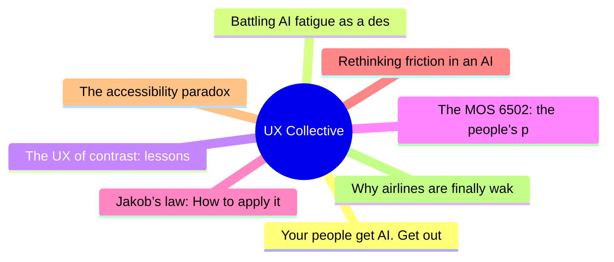
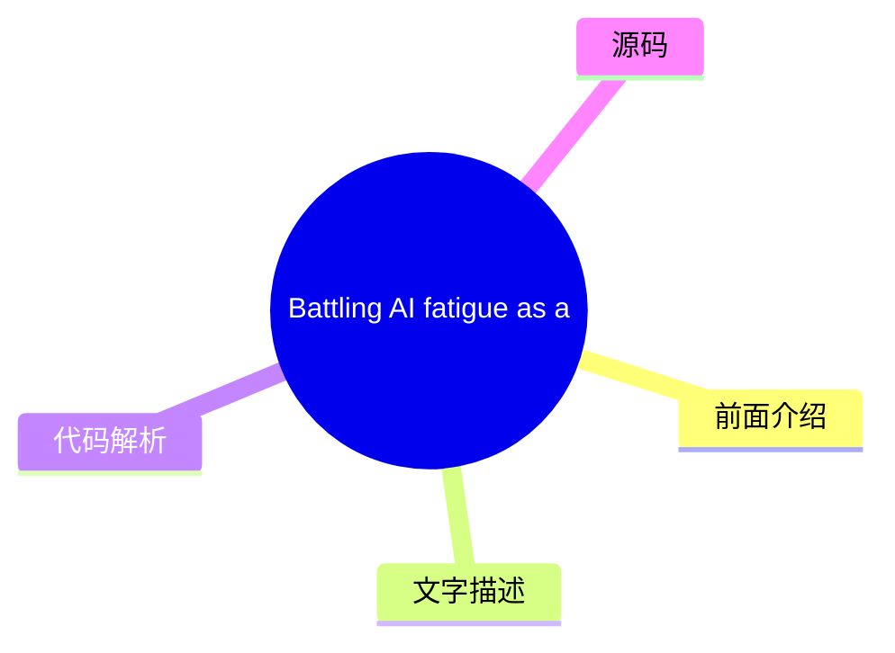
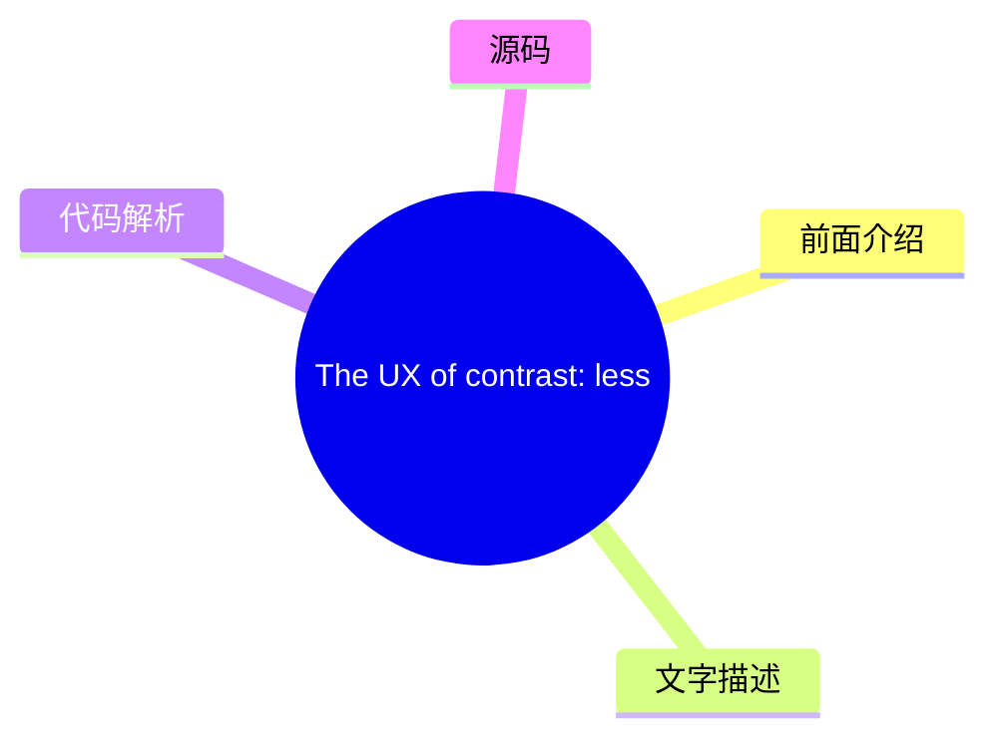
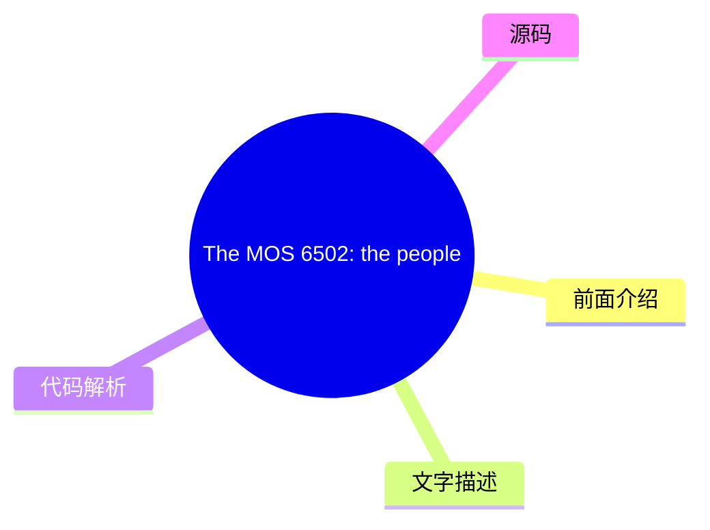
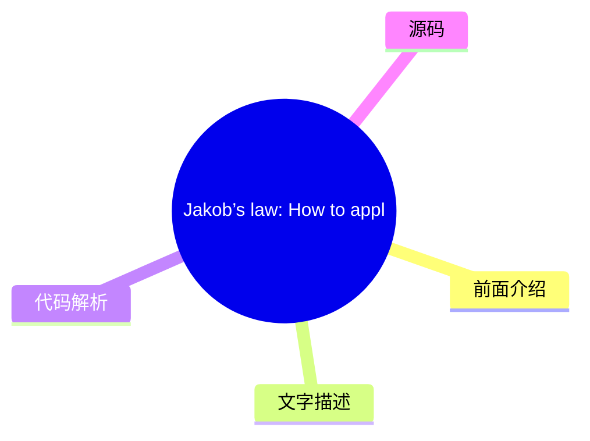
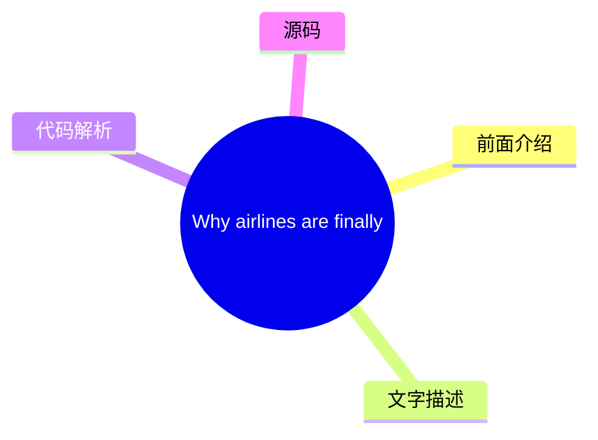

# ✏️ UX Collective Top 8 (2026-08-02)

## 前面介绍

- 数据源：UX Collective
- 抓取日期：2026-08-02
- 条目数：8
- 含完整正文：0
- 含代码片段：0
- 组织方式：前面介绍 / 树状图 / 文字描述 / 代码解析 / 源码

## 思维导图

## 详细整理（8 条，0 条含全文，0 条含代码）

### 1. Your people get AI. Get out of their way.
- **链接**: [https://uxdesign.cc/your-people-get-ai-get-out-of-their-way-131370c157f8?source=rss----138adf9c44c---4](https://uxdesign.cc/your-people-get-ai-get-out-of-their-way-131370c157f8?source=rss----138adf9c44c---4)
- **作者**: Dan Maccarone
- **发布**: Wed, 29 Jul 2026 21:58:06 GMT

#### 前面介绍

- 作者：Dan Maccarone
- 发布时间：Wed, 29 Jul 2026 21:58:06 GMT

#### 树状图

#### 文字描述

- 未抓到可展开正文。

#### 代码解析

- 本文未检测到明确代码块，内容更偏新闻、观点或方法论。

#### 源码

未抓到可展示源码或原文节选。

### 2. Battling AI fatigue as a designer and developer: a practical guide
- **链接**: [https://uxdesign.cc/battling-ai-fatigue-as-a-designer-and-developer-a-practical-guide-d04a2549e802?source=rss----138adf9c44c---4](https://uxdesign.cc/battling-ai-fatigue-as-a-designer-and-developer-a-practical-guide-d04a2549e802?source=rss----138adf9c44c---4)
- **作者**: Adir SL
- **发布**: Wed, 29 Jul 2026 21:57:29 GMT

#### 前面介绍

- 作者：Adir SL
- 发布时间：Wed, 29 Jul 2026 21:57:29 GMT

#### 树状图

#### 文字描述

- 未抓到可展开正文。

#### 代码解析

- 本文未检测到明确代码块，内容更偏新闻、观点或方法论。

#### 源码

未抓到可展示源码或原文节选。

### 3. The UX of contrast: lessons from Indika’s game design
- **链接**: [https://uxdesign.cc/the-ux-of-contrast-what-indika-taught-me-about-designing-intentional-contradiction-c880e9eaf084?source=rss----138adf9c44c---4](https://uxdesign.cc/the-ux-of-contrast-what-indika-taught-me-about-designing-intentional-contradiction-c880e9eaf084?source=rss----138adf9c44c---4)
- **作者**: Alisa Smelkova
- **发布**: Wed, 29 Jul 2026 21:57:08 GMT

#### 前面介绍

- 作者：Alisa Smelkova
- 发布时间：Wed, 29 Jul 2026 21:57:08 GMT

#### 树状图

#### 文字描述

- 未抓到可展开正文。

#### 代码解析

- 本文未检测到明确代码块，内容更偏新闻、观点或方法论。

#### 源码

未抓到可展示源码或原文节选。

### 4. The MOS 6502: the people’s princess
- **链接**: [https://uxdesign.cc/the-mos-6502-the-peoples-princess-0a2f99409834?source=rss----138adf9c44c---4](https://uxdesign.cc/the-mos-6502-the-peoples-princess-0a2f99409834?source=rss----138adf9c44c---4)
- **作者**: Neel Dozome
- **发布**: Tue, 28 Jul 2026 22:21:13 GMT

#### 前面介绍

- The impact of blending arcade game UI concepts with the power of affordable 1970s calculator chipsContinue reading on UX Collective »
- 作者：Neel Dozome
- 发布时间：Tue, 28 Jul 2026 22:21:13 GMT

#### 树状图

#### 文字描述

- The impact of blending arcade game UI concepts with the power of affordable 1970s calculator chipsContinue reading on UX Collective »

#### 代码解析

- 本文未检测到明确代码块，内容更偏新闻、观点或方法论。

#### 源码

未抓到可展示源码或原文节选。

### 5. Jakob’s law: How to apply it as AI collapses surfaces into one chat box
- **链接**: [https://uxdesign.cc/jakobs-law-how-to-apply-it-as-ai-collapses-surfaces-into-one-chat-box-d8ebc9a727db?source=rss----138adf9c44c---4](https://uxdesign.cc/jakobs-law-how-to-apply-it-as-ai-collapses-surfaces-into-one-chat-box-d8ebc9a727db?source=rss----138adf9c44c---4)
- **作者**: Patrick Neeman
- **发布**: Thu, 30 Jul 2026 22:36:31 GMT

#### 前面介绍

- 作者：Patrick Neeman
- 发布时间：Thu, 30 Jul 2026 22:36:31 GMT

#### 树状图

#### 文字描述

- 未抓到可展开正文。

#### 代码解析

- 本文未检测到明确代码块，内容更偏新闻、观点或方法论。

#### 源码

未抓到可展示源码或原文节选。

### 6. Rethinking friction in an AI world
- **链接**: [https://uxdesign.cc/rethinking-friction-in-an-ai-world-8f361d62ab5e?source=rss----138adf9c44c---4](https://uxdesign.cc/rethinking-friction-in-an-ai-world-8f361d62ab5e?source=rss----138adf9c44c---4)
- **作者**: Darren Yeo
- **发布**: Thu, 30 Jul 2026 22:33:38 GMT

#### 前面介绍

- 作者：Darren Yeo
- 发布时间：Thu, 30 Jul 2026 22:33:38 GMT

#### 树状图

#### 文字描述

- 未抓到可展开正文。

#### 代码解析

- 本文未检测到明确代码块，内容更偏新闻、观点或方法论。

#### 源码

未抓到可展示源码或原文节选。

### 7. The accessibility paradox
- **链接**: [https://uxdesign.cc/the-accessibility-paradox-d2c073256660?source=rss----138adf9c44c---4](https://uxdesign.cc/the-accessibility-paradox-d2c073256660?source=rss----138adf9c44c---4)
- **作者**: Michael Buckley
- **发布**: Thu, 30 Jul 2026 05:24:35 GMT

#### 前面介绍

- 作者：Michael Buckley
- 发布时间：Thu, 30 Jul 2026 05:24:35 GMT

#### 树状图

#### 文字描述

- 未抓到可展开正文。

#### 代码解析

- 本文未检测到明确代码块，内容更偏新闻、观点或方法论。

#### 源码

未抓到可展示源码或原文节选。

### 8. Why airlines are finally waking up to context-aware design
- **链接**: [https://uxdesign.cc/why-airlines-are-finally-waking-up-to-context-aware-design-9cdb67722d03?source=rss----138adf9c44c---4](https://uxdesign.cc/why-airlines-are-finally-waking-up-to-context-aware-design-9cdb67722d03?source=rss----138adf9c44c---4)
- **作者**: Zeeshan Khalid
- **发布**: Sat, 01 Aug 2026 17:17:38 GMT

#### 前面介绍

- Your boarding pass has been sitting in that app for three days. But right now, as you sprint through Terminal 5, it&#x2019;s the last thing you&#x2026;Continue reading on UX Collective »
- 作者：Zeeshan Khalid
- 发布时间：Sat, 01 Aug 2026 17:17:38 GMT

#### 树状图

#### 文字描述

- Your boarding pass has been sitting in that app for three days. But right now, as you sprint through Terminal 5, it&#x2019;s the last thing you&#x2026;Continue reading on UX Collective »

#### 代码解析

- 本文未检测到明确代码块，内容更偏新闻、观点或方法论。

#### 源码

未抓到可展示源码或原文节选。

