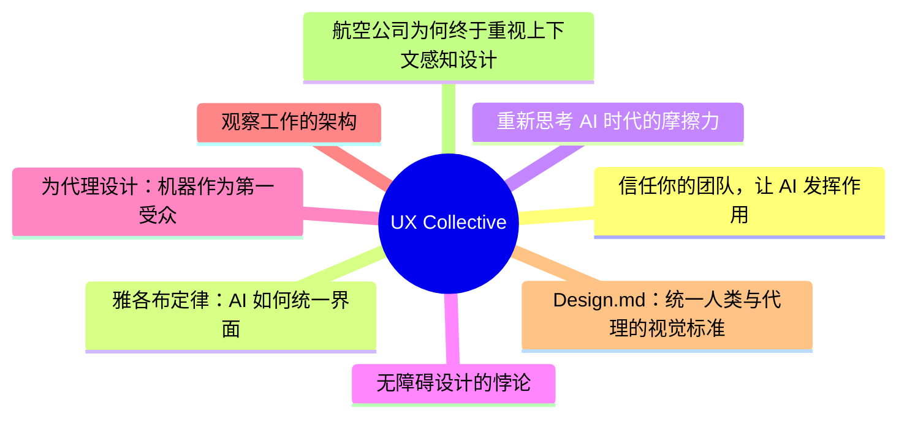
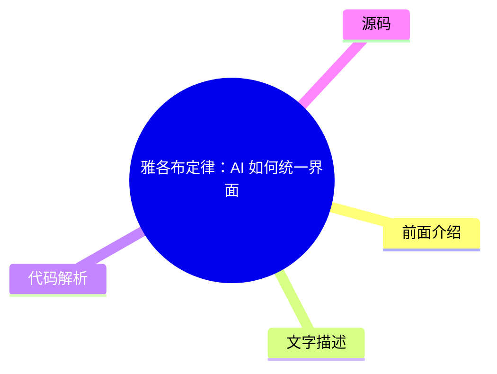
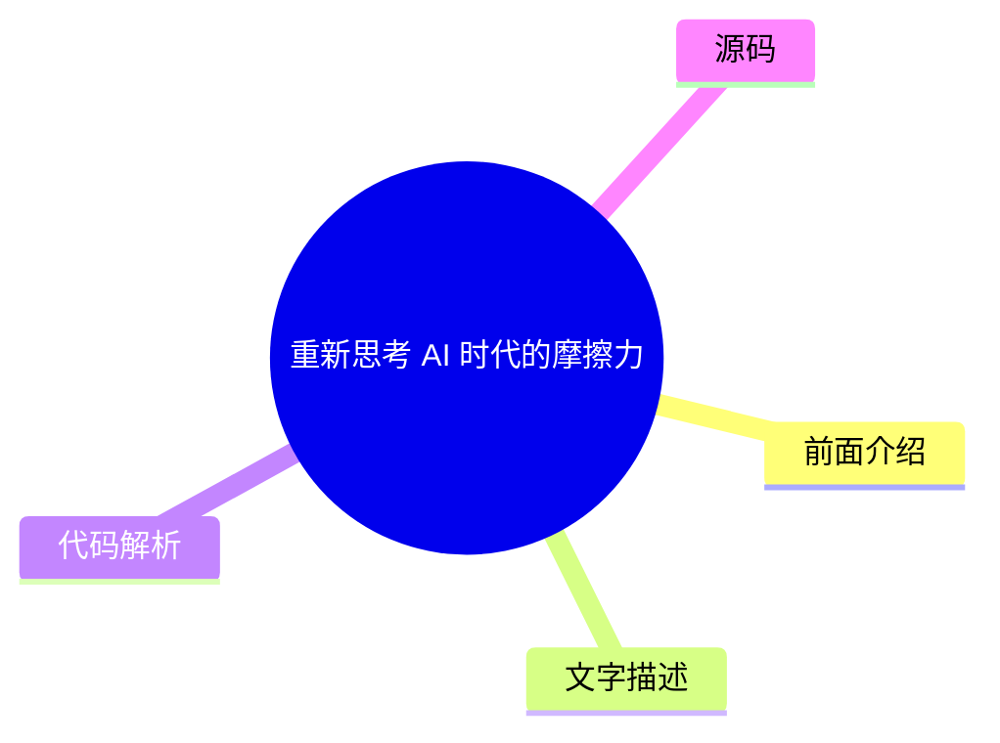
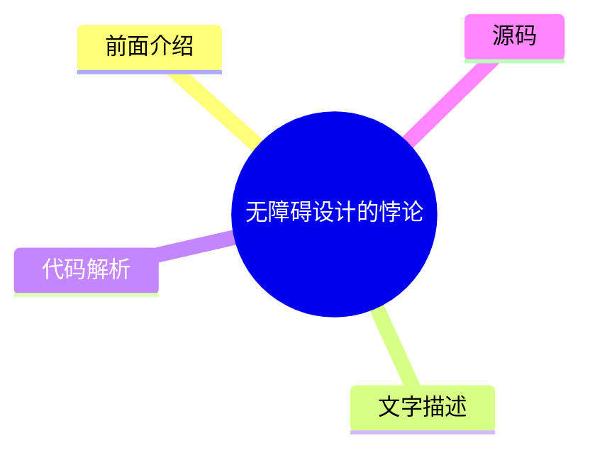
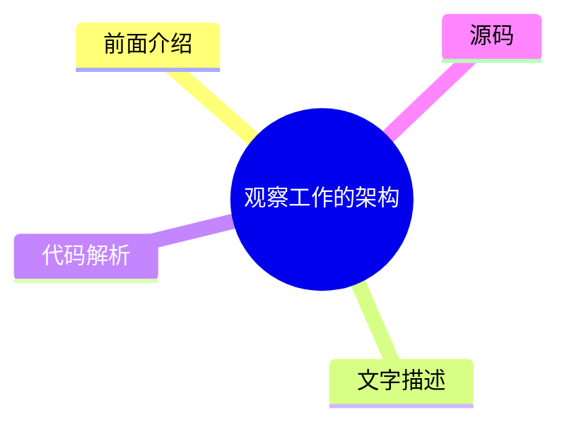
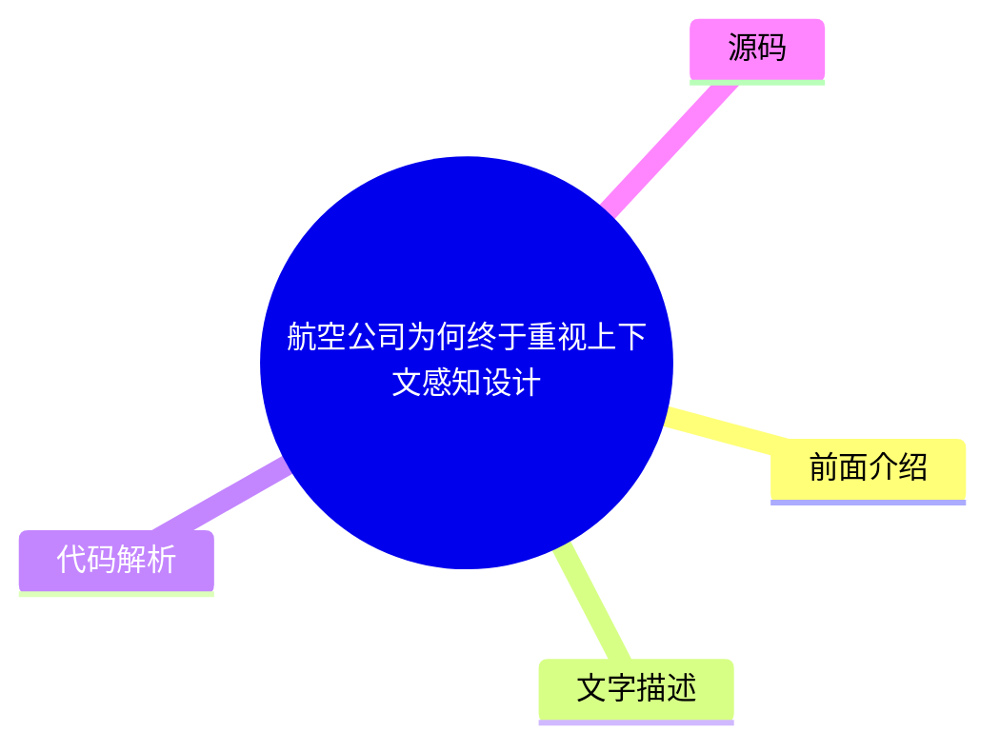

# ✏️ UX Collective Top 8 (2026-08-03)

## 前面介绍

- 数据源：UX Collective
- 抓取日期：2026-08-03
- 条目数：8
- 含完整正文：8
- 含代码片段：1
- 组织方式：前面介绍 / 树状图 / 文字描述 / 代码解析 / 源码

## 思维导图



## 详细整理（8 条，8 条含全文，1 条含代码）

### 1. 信任你的团队，让 AI 发挥作用
- **链接**: [https://uxdesign.cc/your-people-get-ai-get-out-of-their-way-131370c157f8?source=rss----138adf9c44c---4](https://uxdesign.cc/your-people-get-ai-get-out-of-their-way-131370c157f8?source=rss----138adf9c44c---4)
- **作者**: Dan Maccarone
- **发布**: Wed, 29 Jul 2026 21:58:06 GMT

#### 前面介绍

- 95% 的企业 AI 项目失败并非因为工具本身，而是因为公司内部流程僵化。
- 大公司往往通过繁琐的审批流程来维持控制，导致 AI 工具无法落地。
- 小团队通过快速决策和信任成员，能更有效地利用 AI 工具。

#### 树状图


#### 文字描述

- 文章指出，MIT 的研究显示 95% 的企业 AI 项目最终失败，原因在于公司而非工具。
- 作者通过两个案例对比了不同规模公司的 AI 使用情况：一家百年老厂因官僚主义导致 AI 项目混乱，而一家小团队通过创始人过滤决策，让 AI 流程顺畅运行。
- 企业过去奖励那些能控制流程和签署批准的人，因为过去“制造”是困难的部分。但现在 AI 让“制造”变得容易，反而那些僵化的控制系统成为了阻碍。
- 真正的挑战不在于技术，而在于领导层是否愿意信任员工，给他们空间去使用 AI。

#### 代码解析

- 本文未提供源码，以下为实现思路或结构解析

#### 源码

#### 中文节选

# 你的团队懂 AI。别挡他们的路。

*我们都在使用同样的工具。获胜的公司将是那些愿意信任已经了解他们的人的公司。*

这里有一个更多人应该讨论的数字：[95%](https://fortune.com/2025/08/18/mit-report-95-percent-generative-ai-pilots-at-companies-failing-cfo/) 的企业 AI 项目最终都无疾而终。MIT 调查了原因，答案与所使用的工具无关。问题出在使用工具的公司身上。

我最近进行了两次对话，它们几乎解释了为什么这么多公司在利用 AI 寻求成功时面临挑战。这两次对话的对象是来自不同行业、试图使用相同工具但结果却截然不同的人。

将他们区分开来的因素是公司规模以及随之而来的一切：层层官僚机构、繁琐的审批流程，以及关于谁有权做决策的百年历史。

第一位是一位朋友，她在一家拥有百年历史的制造商担任 UX 负责人，那里有真正的工厂，还有你父母能认出的品牌。她很敏锐，并且想出了如何快速利用 AI 进行构建。不幸的是，她的公司没有。它直到最近才决定数字化很重要，而领导层的整个 AI 策略就是告诉所有人要加快速度，却不告诉或教育任何人如何做到这一点。

她的产品经理基本上是直接打开 Claude 开始构建东西，而在任何人就他们实际上在构建什么达成一致之前，这已经发生了，导致几十个半成品产品涌现，毫无策略地野蛮生长。她是 UX 负责人，比那些 PM 资历更深，本可以指出所有这些能量的正确方向，但她做不到。

她被困在等待 IT 批准访问她团队已经在使用的相同 AI 工具，一次又一次地索要从未到来的权限，而那些判断力只有她几分之一的人却在发布平庸的产品，这些产品解决不了任何真正的问题。

第二次对话是与我所在的一个小型产品团队的工程负责人进行的，那种团队的特点是，创始人仍然会出席重要的会议。我们正在商讨设计审批的流程，而在小团队中，默认做法是让所有利益相关者都发表意见，最终导致[委员会式设计](https://www.nngroup.com/articles/design-by-committee/)，这可靠地会产出任何事物的最差版本。

值得称赞的是，他在这个想法刚萌芽时就将其扼杀了。他说，对于日常事务，他和设计师会共同做出决定并继续推进。只有真正重大的问题才会交给创始人或整个团队。

当他告诉创始人，他的工作（在这个阶段）是充当一个过滤器，过滤掉琐碎的事情，从而为她节省注意力，让她专注于真正需要她做决定的少数事项时，这个见解真正出现了。从而消除了任何基于委员会决策的需求。

这两家公司都是以相同的方式处理流程的

#### 完整正文（中文）

# 你的团队懂 AI。别挡他们的路。

*我们都在使用同样的工具。获胜的公司将是那些愿意信任已经了解他们的人的公司。*

这里有一个更多人应该讨论的数字：[95%](https://fortune.com/2025/08/18/mit-report-95-percent-generative-ai-pilots-at-companies-failing-cfo/) 的企业 AI 项目最终都无疾而终。MIT 调查了原因，答案与所使用的工具无关。问题出在使用工具的公司身上。

我最近进行了两次对话，它们几乎解释了为什么这么多公司在利用 AI 寻求成功时面临挑战。这两次对话的对象是来自不同行业、试图使用相同工具但结果却截然不同的人。

将他们区分开来的因素是公司规模以及随之而来的一切：层层官僚机构、繁琐的审批流程，以及关于谁有权做决策的百年历史。

第一位是一位朋友，她在一家拥有百年历史的制造商担任 UX 负责人，那里有真正的工厂，还有你父母能认出的品牌。她很敏锐，并且想出了如何快速利用 AI 进行构建。不幸的是，她的公司没有。它直到最近才决定数字化很重要，而领导层的整个 AI 策略就是告诉所有人要加快速度，却不告诉或教育任何人如何做到这一点。

她的产品经理基本上是直接打开 Claude 开始构建东西，而在任何人就他们实际上在构建什么达成一致之前，这已经发生了，导致几十个半成品产品涌现，毫无策略地野蛮生长。她是 UX 负责人，比那些 PM 资历更深，本可以指出所有这些能量的正确方向，但她做不到。

她被困在等待 IT 批准访问她团队已经在使用的相同 AI 工具，一次又一次地索要从未到来的权限，而那些判断力只有她几分之一的人却在发布平庸的产品，这些产品解决不了任何真正的问题。

第二次对话是与我在一个小产品团队共事的一位工程负责人进行的，那种团队的特点是，创始人仍然会出席重要的会议。我们正在商讨设计审批流程，而在小团队中，默认做法是让所有利益相关者都发表意见，最终导致[委员会式设计](https://www.nngroup.com/articles/design-by-committee/)，这可靠地会产出任何事物的最差版本。

值得称道的是，他在这个想法刚萌芽时就将其扼杀了。他说，在日常工作中，他和设计师会共同做出决定并继续推进。只有真正重大的问题才会提交给创始人或整个团队。

当他告诉创始人，他目前的职责是充当一个过滤器，过滤掉琐碎的事情，从而为她节省注意力，让她专注于真正需要她做决策的少数事项时，洞察力真正出现了。从而消除了任何基于委员会做决策的需求。

这两家公司都在使用相同的工具，例如 Claude 和 Cursor。区别在于，其中一家足够小，可以让信任的团队成员做出好的决策，而另一家则花费了一个世纪建立机制，以确保没有许可就不做任何决策。

这看起来像是一个大公司的问题，而且大部分情况确实如此，但并不完全是这样。真正将这两家公司区分开来的，不仅仅是规模：在于高层是否信任执行工作的人员，足以让他们放手。

一家百年老厂完全可以做出这种选择，就像五人初创公司一样。大多数公司只是不会这么做。

**这从来都不是关于技术**

归根结底，整体挑战不在于 AI。大多数公司自上而下都是为奖励控制而建立的，奖励那些拥有流程、签字批准、管理部门的人，并且他们获得奖励是有充分理由的，因为在一个世纪里，制造东西是困难的部分，而谁能调动制造工作，谁就能获得晋升和赞扬。

[Gary Hamel](https://www.humanocracy.com/) 多年来一直致力于论证，层级制度实际上是我们应对信息匮乏的解决方案。当处于顶层的人是唯一能看到全貌的人时，将每一个决策都上报给他们是合理的，而指挥和协调所有工作的技能确实非常罕见。

这两件事现在都不再成立了。

现在，每个人都能透过树木看到森林，而我们花了一个世纪来推崇和奖励那些管理创造者的人，这种做法不再像过去那样是一种稀缺且宝贵的技能。

正如我们所知，[创造不再是最难的部分](https://medium.com/user-experience-design-1/everyones-sharpening-knives-for-the-wrong-fight-56844adad459)，这意味着我们建立起来用于寻找、提拔和保护控制者的过时系统，现在成了阻碍贵公司与你公司里那些已经知道该怎么做的人之间的最大障碍。

**你的人员已经破解了它**

[Ethan Mollick](https://www.oneusefulthing.org/p/detecting-the-secret-cyborgs) 给你公司里那些默默破解了这一难题的人起了一个名字：秘密赛博格。他们正在利用 AI 更好、更快地工作，并且故意不告诉你，因为你们公司制定的关于 AI 的规则是出于恐惧而制定的，承认使用了它感觉就像承认自己是可以被替代的一样。

[微软和领英的职场趋势指数](https://www.microsoft.com/en-us/worklab/work-trend-index/ai-at-work-is-here-now-comes-the-hard-part) 用真实数据证明了这一点：大约四分之三的知识工作者已经在工作中使用了 AI，其中大多数人是在未经批准的情况下偷偷带入自己的工具，而且超过一半的人不愿承认在重要的事情上使用了它。[麦肯锡](https://www.mckinsey.com/capabilities/tech-and-ai/our-insights/superagency-in-the-workplace-empowering-people-to-unlock-ais-full-potential-at-work) 发现领导层对员工 AI 使用情况的评估低了三倍，并以最礼貌的咨询口吻得出结论：瓶颈不在劳动力，而在领导层。

想想看。人们已经自行适应了。他们适应得如此之快、如此之安静，以至于你甚至没有察觉到，而你现在依然无法察觉的原因是，他们已经学会了向你展示是不安全的。

**挡在路上的机制**

这就是为什么公司无法追赶上的原因，这与领导层的智慧或他们愿意投入多少时间毫无关系。

我们正处于一代人的转变之中，这迫使人们不得不正视过时的结构、脱节的政策以及对变革的单纯恐惧。

[Steve Blank](https://steveblank.com/2015/05/19/organizational-debt-is-like-technical-debt-but-worse/) 将这种积累的混乱称为组织债务，它是技术债务的结构性表亲，悄无声息地累积，直到它变成阻碍你的东西。

六十年前，[Douglas McGregor](https://en.wikipedia.org/wiki/Theory_X_and_Theory_Y) 将管理分为两种理论。X 理论假设人们需要被监督和指导，否则就会混日子。Y 理论假设人们，一旦被赋予值得做的事情，就会全力以赴。大多数公司在全员大会上都说 Y 理论，但却是按照 X 理论一砖一瓦地建立起来的。每一个关卡、每一次审批、每一句“在做事之前先让我参与进来”，都是对这种信念的微小纪念碑：即决策最安全的地方是在执行工作的人之上。

[Gary Hamel](https://www.humanocracy.com/) 再次花费职业生涯为这种信念标价：官僚主义的纯粹拖累，以及那些产出仅仅是“批准”的层级。在我们刚刚离开的那个世界里，这种“拖累”是可以生存的，是你为了协调大量人员而支付的税款。在这个世界里，它是致命的，因为官僚主义最不擅长保护的东西，恰恰是突然变得最重要的东西：关于什么值得做的快速、可信且基于人性的决策。

[Marty Cagan](https://www.svpg.com/product-vs-feature-teams/) 多年来一直在向产品界大声疾呼这一观点。有些团队，你把解决方案交给他们，告诉他们去执行；有些团队，你信任他们去发现问题并解决问题。第一类团队执行被告诉的内容。第二类团队做决定。

You’re gonna be shocked at which one AI just made ten times more valuable, and which one most companies are historically structurally yearning to produce.

**What the grip costs you**

This is where it gets expensive. [Amy Edmondson](https://www.hbs.edu/faculty/Pages/item.aspx?num=54851)’s whole body of work on psychological safety says people only bring you their real thinking, their misfires, their weird experiments, when it’s safe to do it. A company that treats AI use as a compliance risk instead of a superpower is quietly instructing its best people to keep their best work in a locked drawer.

## Get Dan Maccarone’s stories in your inbox

Join Medium for free to get updates from this writer.

[Daniel Pink](https://en.wikipedia.org/wiki/Drive:_The_Surprising_Truth_About_What_Motivates_Us) wrote a book on what actually moves knowledge workers, and, guess what, it wasn’t control! It was autonomy, mastery, purpose. Grip the wheel too hard and you don’t just slow your best people down, you bore them.

Bored people with rare, portable skills do not stay bored for long. They leave. Usually for a leader who says yes and gets out of the way.

**Nobody gives up status without a fight**

So why won’t some companies just loosen up? Because you’re asking the people with the most power to volunteer that the thing which earned them that power counts for less now. The classic executive who climbed the corporate ladder by being the sharpest maker in the building now runs a building where making isn’t the valuable part anymore.

Nobody gives up status without a fight, so instead of loosening the grip, they tighten it.


他们添加了一个审查环节，要求被纳入其中，编造了一个新的步骤，让他们站在工作面前，因为如果他们不能再成为房间里最敏锐的创作者，他们至少还是那个你需要签字批准的人。[Das Narayandas](https://www.library.hbs.edu/working-knowledge/why-employees-resist-ai-and-how-companies-can-win-them-over) 深入研究了为什么 AI 推广会停滞，并发现了那个藏在眼皮底下的罪魁祸首：这些工具威胁到了那些必须批准它们的人的身份和地位。这表现为多了一个审批步骤，多了一个“让我们先对齐一下”的要求，而在任何人真正开始工作之前。

这是一个真正令人迷失方向的地方，而最可用的、最人性化的反应就是抓得更紧。添加一个审查。要求被纳入其中。[Erik Brynjolfsson](https://www.aeaweb.org/articles?id=10.1257%2Fmac.20180386) 已经证明，通用技术的回报总是滞后，有时会滞后数年，而这种滞后是组织在缓慢而痛苦地围绕新现实重建自己。

这一切都不会等你。你的人员能做什么和你公司允许他们做什么之间的差距每天都在扩大，而正是你在维持着这个差距。如果这有助于理解，就称之为治理，但所有重要的人都知道，现实是恐惧。

**它实际上如何改变**

公司并没有注定要完蛋……至少现在还没有。然而，真正的改变并非来自公告。不是公司范围的邮件，不是全员大会，宣布一切现在都不同了，不是给每个员工都开通 Claude 访问权限，并宣称“我们现在进入 AI 时代了！”这些只是公司在想要获得改变功劳却实际上并未付诸行动时发出的噪音。

他们总是通过一个其他人真正信任的人来改变。 [Nancy Baym](https://hbr.org/2026/03/peer-influence-can-make-or-break-your-ai-rollout) 在微软的研究发现了一个导致采用停滞的、谁也没想到的原因：学习过程是不可见的。工具在运行，培训也在进行，但破解它的人是在后台完成的，所以其他人永远看不到他们是如何做到的。

还记得之前提到的秘密赛博格吗？真正推动一个……

（内容已截断，原文包含 15282+ 字符）


### 2. 雅各布定律：AI 如何统一界面
- **链接**: [https://uxdesign.cc/jakobs-law-how-to-apply-it-as-ai-collapses-surfaces-into-one-chat-box-d8ebc9a727db?source=rss----138adf9c44c---4](https://uxdesign.cc/jakobs-law-how-to-apply-it-as-ai-collapses-surfaces-into-one-chat-box-d8ebc9a727db?source=rss----138adf9c44c---4)
- **作者**: Patrick Neeman
- **发布**: Thu, 30 Jul 2026 22:36:31 GMT

#### 前面介绍

- 随着 AI 助手接管更多任务，用户界面正从分散走向统一。
- 雅各布定律指出用户习惯于现有网站的交互模式，这加速了 AI 工具的普及。
- 设计组件和语义层变得至关重要，它们为用户和 AI 代理提供了清晰的结构和预期。

#### 树状图



#### 文字描述

- 雅各布·尼尔森定律认为用户将大部分时间花在其他网站上，因此期望你的网站行为符合他们的习惯。
- 随着 AI 助手（如 Claude）成为任务的前端入口，用户不再需要学习多个分散的界面，这大大降低了采用门槛。
- 界面的一致性（如提问框、回复、来回交互）使得新工具的采用速度远超传统的人工引导流程。
- 随着任务流通过助手进行，软件构建者不仅要考虑产品本身，还要确保 AI 代理有足够的上下文和标准模式来使用它。

#### 代码解析

- 本文未提供源码，以下为实现思路或结构解析

#### 源码

#### 中文节选

# Jakob 定律：如何将其应用于 AI 将各种表面坍缩为一个聊天框

像 Claude 这样的助手正通过对话式的前端入口处理更多任务。Jakob Nielsen 的熟悉界面定律现在正欢快地指向了助手本身。

“用户的大部分时间都花在其他网站上。”

—— [Jakob Nielsen, Jakob’s Law (2000)](https://jakobnielsenphd.substack.com/p/jakobs-law)

Jakob Nielsen 在 2000 年写下了这条定律，它比那个网络时代的其他几乎所有事物都更长久。他的许多戒律依然成立，这并非因为技术停止了发展——它从未停止——而是因为人们改变的速度远不及他们的工具。

其含义是：用户期望你的网站能像他们已经知道的网站一样运作，就像我们期望汽车以某种方式运作一样，也就是说，如果方向盘是一堆杠杆，我就不想租或买那辆车。

这就是为什么组织建立了设计系统团队——为了坚持应用程序设计的最佳实践，使每个屏幕都与人们已经期望的内容保持一致，同时仍在品牌范围内进行创新。

30 年来，这意味着匹配更广泛网络的惯例，因为那是用户建立习惯的地方

但这正在迅速改变。

越来越多的任务不再始于网站或应用程序——它们始于一个助手。你要求 Claude 或 ChatGPT 起草电子邮件或提取数据，工作通过一个对话式界面完成，而不是来自不同供应商和设计团队的十几个截然不同的界面。

一个人接触的界面数量正在减少，助手正成为任务的入口，而这些任务以前在多个浏览器标签页中都有各自的目的地。

它们的相似性是一个特性，因为每个助手都运行在相同的模式上——一个提问框、一个回复、来回的交流——学习一个就教会了你所有，因此一个新的 AI 工具不需要手册，并且采用速度比任何引导流程都能管理的速度都要快。

这是经过设计的，因为我们正在学习如何适应这个新时代。

Jakob’s Law usually reads as a warning against deviating; here it runs the other way, as the reason uptake is this quick. The more these interfaces resemble each other, the less anyone has to learn, and the more willing people are to try the next one which gives us a chance to be creative in inventing the future. This flips his law on its head.

That’s why [design components](https://ux-components.com/) and their semantic layer matter more than ever — they make conventions explicit and predictable, the clear expectations users need to move across sites and the legible structure an agent needs to read one.

That doesn’t retire Jakob’s Law; it moves the work to a different set of surfaces and requires even more standardzation.


If most use cases now flow through the assistant, the question for anyone building software isn’t only whether your product works when reached through that surface — it’s whether you’ve given the agent enough contex

#### 完整正文（中文）

# Jakob 定律：如何将其应用于 AI 将各种表面坍缩为一个聊天框

像 Claude 这样的助手正通过对话式的前端入口处理更多任务。Jakob Nielsen 的熟悉界面定律现在正欢快地指向了助手本身。

“用户的大部分时间都花在其他网站上。”

—— [Jakob Nielsen, Jakob’s Law (2000)](https://jakobnielsenphd.substack.com/p/jakobs-law)

Jakob Nielsen 在 2000 年写下了这条定律，它比那个网络时代的其他几乎所有事物都更长久。他的许多戒律依然成立，这并非因为技术停止了发展——它从未停止——而是因为人们改变的速度远不及他们的工具。

其含义是：用户期望你的网站能像他们已经知道的网站一样运作，就像我们期望汽车以某种方式运作一样，也就是说，如果方向盘是一堆杠杆，我就不想租或买那辆车。

这就是为什么组织建立了设计系统团队——为了坚持应用程序设计的最佳实践，使每个屏幕都与人们已经期望的内容保持一致，同时仍在品牌范围内进行创新。

30 年来，这意味着匹配更广泛网络的惯例，因为那是用户建立习惯的地方

但这正在迅速改变。

越来越多的任务不再始于网站或应用程序——它们始于一个助手。你要求 Claude 或 ChatGPT 起草电子邮件或提取数据，工作通过一个对话式界面完成，而不是来自不同供应商和设计团队的十几个截然不同的界面。

一个人接触的界面数量正在减少，助手正成为任务的入口，而这些任务以前在多个浏览器标签页中都有各自的目的地。

它们的相似性是一个特性，因为每个助手都运行在相同的模式上——一个提问框、一个回复、来回的交流——学习一个就教会了你所有，因此一个新的 AI 工具不需要手册，并且采用速度比任何引导流程都能管理的速度都要快。

这是经过设计的，因为我们正在学习如何适应这个新时代。

Jakob 定律通常被解读为一种对偏离的警告；在这里，它却反其道而行之，成为了这种快速普及的原因。这些界面越是相似，人们需要学习的内容就越少，而人们尝试下一个界面的意愿就越强，这给了我们在发明未来时发挥创造力的机会。这彻底颠覆了他的定律。

这就是为什么 [设计组件](https://ux-components.com/) 及其语义层比以往任何时候都更重要——它们使惯例变得明确且可预测，这是用户在站点间移动所需的清晰期望，也是代理需要阅读的可读结构。

这并没有废除 Jakob 定律；它将工作转移到了不同的表面，并要求更多的标准化。

如果大多数用例现在都通过助手流动，那么对于任何构建软件的人来说，问题不仅在于你的产品通过该表面到达时是否有效——还在于你是否通过使用标准模式，为代理提供了足够的上下文来良好地使用它。

## 表面数量正在减少

在计算机历史的绝大部分时间里，软件呈指数级增长；每项工作都有其特定的目的地——一个应用程序、一个网站、一个工具，每个都有其需要学习的界面——直到主屏幕被填满，浏览器标签页多到数不清。

Jakob 定律之所以存在，正是因为有如此多的表面，而用户需要它们表现相似，因为下拉菜单就是下拉菜单。

助手则走向了另一个方向，将工作吸收到一个地方。

人们现在通过他们已经打开的任何助手来路由工作——[Anthropic Claude](https://claude.ai/)、[Microsoft Copilot](https://copilot.microsoft.com/)、[Google Gemini](https://gemini.google.com/)、[ChatGPT](https://chatgpt.com/)——而不是为每项任务打开不同的工具。

这不仅仅是独立的助手，因为人们已经居住其中的聊天工具本身也已成为独立的对话表面：Slack 现在直接在其频道中运行 AI 代理，包括来自 Anthropic 等第三方代理，[Microsoft Teams 将 Copilot 和其代理放在与同事交谈的同一窗口中](https://slack.com/blog/news/ai-innovations-in-slack)。

开源项目将这一理念推向了更远：[OpenClaw](https://docs.openclaw.ai/)，一个快速增长的自主托管代理，会将您选择的模型——Claude、GPT、Gemini——放入您已经在使用的任何消息应用中，从 Slack 和 Teams 到 Discord、WhatsApp 和 Telegram。

人们彼此之间原本的对话，现在也成了他们与软件对话的地方，因此用户无需重新学习。

OpenAI 允许第三方应用在 ChatGPT 内部运行，因此您可以在不离开对话的情况下[搜索列表、制作演示文稿或播放列表](https://openai.com/index/introducing-apps-in-chatgpt/)。Anthropic 的模型上下文协议从另一侧完成了同样的工作：它是一个[连接助手与数据和工具所在系统的开放标准](https://www.anthropic.com/news/model-context-protocol)，用单一协议取代了大量的临时集成。Claude 通过这一连接访问您的日历、文档和问题跟踪器。

更深层次的转变在于助手到达那里之后会做什么。

它不仅仅是在一个地方回答问题——它会走出去执行解释工作。Claude Cowork 接收一个目标，并在您的文件和应用程序之间[跨文件工作，综合多个来源的信息并返回一个完成的交付成果](https://www.anthropic.com/product/claude-cowork)，而不是一次回答一个提示。

将其指向工作，它就会在各个来源之间移动。访问十几个网站、阅读每个网站并拼凑出它们含义的劳动——这正是 Jakob 定律旨在减少的确切认知成本——代理现在几乎完全吸收了。用户陈述结果；解释工作在视线之外发生。

访问十几个网站、阅读每个网站并拼凑出它们含义的劳动——这正是 Jakob 定律旨在减少的确切认知成本——代理现在几乎完全吸收了。代理现在为您打包信息，一旦我们部署好 API，这将极大地改善企业体验。

把这一切放在一起，方向就清晰了。世界上的表面数量并没有减少——软件依然像以前一样快速倍增；减少的是任何单个用户直接接触的表面数量，因为助手已经成为了通用表面，而智能体越来越多地承担了原本需要人工完成的跨表面工作。

我们以前见过类似的场景。20世纪90年代末的互联网是一堆目录和门户网站的蔓延——雅虎手建的索引，告诉你该去哪里。[然后搜索将这一切浓缩进了一个单一的搜索框](https://medium.com/muzli-design-inspiration/five-ux-lessons-from-the-webcrawler-and-ask-jeeves-era-about-the-ai-experience-transition-54e281a60672)。

有时，数量甚至会降为零。

一个表面并不总是缩小成助手——有时它根本不会出现，因为工作已经变得无处不在。一个在后台监视你收件箱的智能体会归档收据、标记续订并重新安排会议，你第一次听到这件事，可能是在事后得到的摘要中，如果有的话。

没有屏幕可以打开，也没有对话可以开始，因此雅各布定律所描述的界面根本就不存在——这是一个比熟悉的屏幕更难的设计问题，而不是更容易的问题。

**行动项**

- **绘制跨表面的旅程。**梳理用户的端到端旅程，然后标记哪些步骤现在在助手中进行，哪些仍在你的产品中进行，以及交接点在哪里。交接点是期望破裂的地方，也是你的设计工作发挥作用的地方。
- **观察任务开始的地方。**持续一周，记录你是在打开某个应用之前先使用了助手——你自己的行为是你用户行为的前导指标，并立即设定了期望。
- **停止将减少屏幕和点击次数视为胜利。**淘汰那些奖励应用停留时间和页面浏览量的指标。如果助手完成了任务，即使你赢了，这些数字也会下降。

## 雅各布定律如今指向了助手

Jakob 定律是关于参考点的，用户会在他们花费时间的地方建立心智模型，然后将这些期望带到其他任何地方。当时间花费在许多网站上时，参考集是网络共享的“家具”——左上角的 Logo，右上角的搜索，以及角落里的购物车和通知。

当时间花费在助手上时，参考集就变成了助手。

你用自然语言输入请求，得到结果，并在对话中对其进行优化，期望它能记住两轮对话前你说的话。[数亿人现在每周都会这样做](https://techcrunch.com/2025/10/06/sam-altman-says-chatgpt-has-hit-800m-weekly-active-users/)，并且这正成为你让计算机做某事时的默认期望。

这就是重点——助手在许多情况下正成为默认选项，这有助于采用。

不再仅仅是“像其他网站一样工作”。而是“像助手那样工作”，因为那是你的用户现在熟练的交互方式。我在之前的文章中曾将自然语言输入称为“提问框”；更大的观点是，提问框不再只是众多模式中的一种。它正在成为这种模式——越来越多的任务流经的入口。

这正是 Jakob 定律在发挥它一贯的作用。只是用户花费时间的地方集中了，所以期望也随之集中。

**行动项**

- **亲自学习新惯例，以便知道如何为它们进行设计。** 在 Claude、Copilot、Gemini 或 ChatGPT 中花一周时间进行实际工作，并写下你预期的交互模式。这份列表就是你的用户的新基准。
- **对照它们审计你的功能。** 将你自己的 AI 功能与该基准进行比较，并修复每一个无故表现不同的地方——没有理由的差异就是摩擦。
- **不要重新发明输入方式。** 提问框现在是一种惯例；对它的巧妙定制只会让人们去重新学习他们已经在其他地方熟练掌握的东西。

## 你可能不再拥有界面

If a use case flows through the assistant, the interface your user sees is the assistant’s, not yours. They ask Claude to find every auto-renewal clause in their contracts, and Claude reaches your contract platform through a connector, does the work, and answers in the chat. The user never opens your application. They never see your navigation, your carefully built dashboard, your brand. Your product did the work and stayed invisible.

That’s the real consequence of fewer surfaces.

For a meaningful set of tasks, you don’t own the surface anymore and it looks like service design. The assistant does. Jakob’s Law still applies — but now it applies to the assistant’s interface, which you don’t control, and your job shifts from designing the destination to being legible through someone else’s.


For a meaningful set of tasks, you don’t own the surface anymore, the assistant does.

This is where the affordance problem  flagged early comes back, relocated. She pointed out that a bare chat input has no affordances — [the same rectangle looks like a search box, a login form, and a credit card field](https://wattenberger.com/thoughts/boo-chatbots). When your product is reached through that rectangle, its capabilities are only as visible as the assistant makes them. Users won’t discover your features by clicking around. They’ll discover them only if the assistant knows your product can do the thing and surfaces it at the right moment. Users are not used to having the ability to ask what the agent does; they have to get the courage to ask, and even more so, know what the right questions are.

So the work moves to a different lay

...（截断，原文 22008+ 字符）


### 3. 重新思考 AI 时代的摩擦力
- **链接**: [https://uxdesign.cc/rethinking-friction-in-an-ai-world-8f361d62ab5e?source=rss----138adf9c44c---4](https://uxdesign.cc/rethinking-friction-in-an-ai-world-8f361d62ab5e?source=rss----138adf9c44c---4)
- **作者**: Darren Yeo
- **发布**: Thu, 30 Jul 2026 22:33:38 GMT

#### 前面介绍

- 摩擦力分为交互摩擦、认知摩擦和情感摩擦三种类型。
- 完全无摩擦的 AI 体验可能导致用户缺乏深度思考，仅追求快速产出。
- 引入“良性”摩擦（如强制阅读、暂停）反而能提升用户体验和满意度。

#### 树状图



#### 文字描述

- 摩擦力是指任何减缓用户进度、阻碍目标达成或引起心理挫败的因素，通常表现为物理操作困难、界面混乱或引发焦虑。
- 新加坡樟宜机场等机构致力于消除摩擦，使体验变得“不可见”，从而提升用户满意度。
- 然而，在 AI 时代，完全消除摩擦可能导致用户跳过关键步骤，只获得肤浅的结果。文章作者在开发家长沟通应用时发现，完全流畅的滚动导致用户难以保留信息。
- 通过引入交互暂停（如强制展开附件）、认知暂停（如截断内容）和 AI 生成的对话引导，虽然增加了使用时间，但显著提高了用户满意度和对信息的保留。

#### 代码解析

- 本文未提供源码，以下为实现思路或结构解析

#### 源码

#### 中文节选

# 重构 AI 时代的摩擦

### “令人遗忘”设计的悖论

“让体验令人遗忘，”一位资深业务高管曾对我说。

对于一位以创造难忘时刻为荣的设计师来说，这听起来可能像是个笑话。但作为机场运营负责人，他是认真的。

新加坡航空每天处理数千名旅客。对于这些乘客来说，快乐来自于飞行体验和准点出发。运营团队最不希望看到的是客户被困在长队中，或者遇到像登机牌失效这样的小麻烦，进而招致他们的愤怒和投诉。

在机场，顺畅是隐形的。樟宜机场之所以能保持世界一流水平，一个原因就是其不断致力于消除摩擦。

曾经被认为不可能的尖端无护照出入境通关系统如今已成现实。如今，新加坡居民和符合条件的旅客只需走过自动闸机，无需出示护照。在 10 到 30 秒内，他们就能通过海关，相比之下，在其他机场的经历显得格外突兀。

最终，目标是让机场体验变得完全令人遗忘。

### 摩擦的三种面孔

你可以到处看到这种模式。没人会爱上银行业务；你只是希望银行能保障你的资金，以便你过好自己的生活。这就是像星展银行（DBS）这样的银行致力于让银行业务隐形的原因。

或者考虑为孩子选择学校。没有父母愿意因为属于边缘案例而处理堆积如山的纸质表格，或者为了额外的繁琐手续而奔波。他们想要一个无缝的系统，能给他们即时的安心感。

在 UX 设计中，摩擦是指任何减缓用户速度、阻碍其达成目标或造成心理挫败的事物。它通常以三种方式出现：

- 交互摩擦：完成任务所需的体力付出，例如需要五页的结账流程而两步就能完成、重复的字段，或在移动端上极小且拥挤的按钮。

- 认知摩擦：令人困惑的界面带来的心智负担；导航被埋没、标签晦涩难懂，或者布局偏离熟悉模式太远，导致用户停顿并思考：“下一步该点哪里？”
- 情绪摩擦：因糟糕的体验、结尾出现的意外费用，或在提供清晰价值前要求侵入性权限而引发的焦虑、恼怒或不信任。

当这些微小的挫败感累积时，用户就会放弃。他们会中断操作、关闭标签页或卸载应用。因此，现代产品设计（如航空公司、银行和学校）的主要指导原则长期以来一直是让数字路径更加顺畅，消除不必要的步骤，让操作感觉毫不费力。

### 当“无摩擦”变得过于容易

最近，无摩擦设计的前沿已经进入了 AI 工作流。像 ChatGPT 和 Claude 这样的平台使得使用文本、图片或文档进行提示变得如此轻松，以至于用户可以立即获得结果。

#### 完整正文（中文）

# 重构 AI 时代的摩擦

### “令人遗忘”设计的悖论

“让体验令人遗忘，”一位资深业务高管曾对我说。

对于一位以创造难忘时刻为荣的设计师来说，这听起来可能像是个笑话。但作为机场运营负责人，他是认真的。

新加坡航空每天处理数千名旅客。对于这些乘客来说，快乐来自于飞行体验和准点出发。运营团队最不希望看到的是客户被困在长队中，或者遇到像登机牌失效这样的小麻烦，进而招致他们的愤怒和投诉。

在机场，顺畅是隐形的。樟宜机场之所以能保持世界一流水平，一个原因就是其不断致力于消除摩擦。

曾经被认为不可能的尖端无护照出入境通关系统如今已成现实。如今，新加坡居民和符合条件的旅客只需走过自动闸机，无需出示护照。在 10 到 30 秒内，他们就能通过海关，相比之下，在其他机场的经历显得格外突兀。

最终，目标是让机场体验变得完全令人遗忘。

### 摩擦的三种面孔

你可以到处看到这种模式。没人会爱上银行业务；你只是希望银行能保障你的资金，以便你过好自己的生活。这就是像星展银行（DBS）这样的银行致力于让银行业务隐形的原因。

或者考虑为孩子选择学校。没有父母愿意因为属于边缘案例而处理堆积如山的纸质表格，或者为了额外的繁琐手续而奔波。他们想要一个无缝的系统，能给他们即时的安心感。

在 UX 设计中，摩擦是指任何减缓用户速度、阻碍其达成目标或造成心理挫败的事物。它通常以三种方式出现：

- 交互摩擦：完成任务所需的体力付出，例如需要五页的结账流程而两步就能完成、重复的字段，或在移动端上极小且拥挤的按钮。

- 认知摩擦：令人困惑的界面带来的心智负担；导航被埋没、标签晦涩难懂，或者布局偏离熟悉模式太远，导致用户停顿并思考：“下一步该点哪里？”
- 情绪摩擦：由糟糕的体验、账单末尾的意外费用，或在提供清晰价值前要求侵入性权限而引发的焦虑、恼怒或不信任感。

当这些微小的挫败感累积时，用户就会放弃。他们会中断操作、关闭标签页或卸载应用。因此，现代产品设计（如航空公司、银行和学校）的主要宗旨长期以来一直是让数字路径更加顺畅，消除不必要的步骤，让操作感觉毫不费力。

### 当“无摩擦”变得过于容易

最近，无摩擦设计的边界已经扩展到了 AI 工作流。像 ChatGPT 和 Claude 这样的平台，使得使用文本、图片或文档进行提示变得如此轻松，用户只需几秒钟就能得到结果。就像数字精灵一样，现代大语言模型可以从极少的输入中理解用户的意图。用户不断回归，因为这种体验感觉流畅、直观且即时满足。

但这里有一个令人不安的问题：如果 AI 能从简单任务中消除摩擦，为什么不能从所有帮助某人理解抽象数学、构建软件或将几个要点扩展成完整文章的事情中消除摩擦呢？

AI 可以感觉像是一把能消除一切摩擦的“银弹”。而这一点本身，就可能变成一条滑坡。

在这层无摩擦的理想之下，隐藏着一种基于持续消费的商业模式。体验越顺畅，我们提示得越多，消耗的计算量就越大，消耗的代币也就越多。但是，当我们完全为了即时输出而优化，而不是为了有意识的努力时，我们实际上是用快速、肤浅的结果，换取了深度、严谨的思考。

## 为“良性”摩擦正名

我在我们团队开发的一款家长沟通应用中亲眼目睹了这一过程。

Originally, we designed the feed to be completely frictionless, using standardised announcement formats to make scrolling effortless. And while adoption rates spiked, support tickets surged right alongside them. Parents struggled to retain information, lost track of attachments, and missed key details in the infinite scroll.

So, we did something counterintuitive: we brought the friction back.

We introduced interaction pauses to draw attention to attachments and events. We added cognitive pauses, such as truncating content, forcing parents to stop, read the summary, and deliberately tap to expand. We even added AI-generated [conversation starters](https://build.tech.gov.sg/projects/2026/242) to announcements and posts so that parents could pause and reflect on how to talk to their kids after school.

Time spent in the app went up, but there was higher customer satisfaction. The experience wasn’t as fast, but it felt more respectful and more human.

In operations, on a factory floor or at an airport check-in, efficiency is king. Removing friction speeds up the line, and speed feels like progress.

Yet necessary friction points are everywhere. Factories rely on emergency stop protocols; airport check-ins require passengers to pause and confirm they aren’t carrying hazardous goods. Even Newton’s third law reminds us of its value: friction acts as the ground’s resistance that allows us to push forward in the first place.

Designers like [Ida Persson](/from-frictionless-to-meaningful-2dc785d6cc4e) have started calling this *meaningful friction*: friction that protects, clarifies, or deepens human experience rather than merely slowing it down.

So what if friction isn’t actually the enemy? What if some friction isn’t meant to be forgotten, but embraced?

### Designing for humans, not machines

If there’s [one idea](https://medium.com/design-bootcamp/how-a-year-of-running-taught-me-about-design-f5c82f80f8eb) I’d build on, it’s this: honour human values, emotions, and decision-making, even when that means keeping friction in the loop.


Machines are built for efficiency. They get something done and then forgotten. Human beings are not machines. We are imperfect, sensitive creatures who hold on to emotions, beliefs, and moral values.

Designers are human beings designing for human beings. It may sound obvious, but sometimes we forget why we design and dream of doing away with designing altogether to get quicker answers.

Frictionless AI risks creating passive users: people who accept the first answer, skip reflection, and outsource judgement to a model that doesn’t share their stakes. A bit of deliberate friction:

“Are you sure?”,

“What are you trying to achieve?”,

“Here’s what you might be overlooking”,


can turn a smooth interaction into a meaningful one.

Remove friction where it blocks progress. Keep it where it shapes judgement, builds trust, or deepens meaning.

Because the goal of design is not just to make things easy but to make them matter.

## References

Afterbell. (2026). *Afterbell | {build} hackathon*. GovTech {Build} Hackathon. [https://build.tech.gov.sg/projects/2026/242](https://build.tech.gov.sg/projects/2026/242)

ICA Singapore. (2024). Passport-Less Immigration Clearance at Changi Airport. In *YouTube*. [https://www.youtube.com/watch?v=1SdqDIvcvag](https://www.youtube.com/watch?v=1SdqDIvcvag)

Persson, I. (2026, July 27). *From Frictionless to Meaningful*. UX Collective. Medium. [https://uxdesign.cc/from-frictionless-to-meaningful-2dc785d6cc4e](/from-frictionless-to-meaningful-2dc785d6cc4e)

Rekhi, S. (2018). The Hierarchy of User Friction. In *Medium*. [https://medium.com/@sachinrekhi/the-hierarchy-of-user-friction-e99113b77d78](https://medium.com/@sachinrekhi/the-hierarchy-of-user-friction-e99113b77d78)


### 4. 无障碍设计的悖论
- **链接**: [https://uxdesign.cc/the-accessibility-paradox-d2c073256660?source=rss----138adf9c44c---4](https://uxdesign.cc/the-accessibility-paradox-d2c073256660?source=rss----138adf9c44c---4)
- **作者**: Michael Buckley
- **发布**: Thu, 30 Jul 2026 05:24:35 GMT

#### 前面介绍

- 无障碍设计（如语义化 HTML、描述性链接）旨在帮助残障用户，但也让 AI 爬虫更容易抓取数据。
- AI 训练数据集（如 LAION-5B）大量使用了为无障碍设计的图片描述。
- 为了防止 AI 抓取，网站部署的反机器人措施（如 CAPTCHA）往往对使用屏幕阅读器的残障用户造成更大阻碍。

#### 树状图



#### 文字描述

- 无障碍设计标准（WCAG）最初是为了帮助人类，但意外地成为了 AI 训练的基础设施。
- 屏幕阅读器需要理解页面结构，AI 爬虫同样需要；有意义的图片描述对视障用户和视觉模型都至关重要。
- 为了防止未经授权的数据收集，许多网站部署了 CAPTCHA 等验证机制，但这对依赖屏幕阅读器的用户来说是最难逾越的障碍。
- 这导致残障用户成为了 AI 抓取与网站防御之间的“意外牺牲品”。文章强调，这并非反对无障碍设计，而是揭示了数字价值（开放性、可发现性）与内容控制之间的潜在冲突。

#### 代码解析

- 本文未提供源码，以下为实现思路或结构解析

#### 源码

#### 中文节选

无障碍访问是那些几乎无人反对的概念之一。让残障人士更容易浏览网站是一项相当无可争议的美德。语义化 HTML、描述性链接、有意义的图片描述以及键盘导航都有助于创建一个更具包容性和可用性的网络。

然而，AI 时代在这个故事中引入了一个意想不到的、深刻的讽刺。那些在让人类获取信息方面做得最多的网站，往往也是让机器抓取最容易的网站。显然，这从来都不是目标。 [Web 内容无障碍指南 (WCAG)](https://www.w3.org/WAI/standards-guidelines/wcag/) 是为了帮助人类，而不是为了人工智能。

屏幕阅读器需要理解页面的结构，AI 爬虫也是如此。视障用户从有意义的图片描述中受益，多模态模型在将语言与视觉概念联系起来时也是如此。搜索引擎从语义化 HTML 中受益，大型语言模型在收集训练数据时也是如此。

共同点是内容被构建得对人类更具可访问性，对机器也更具可解释性。结果，网络的无障碍标准经历了意外的角色互换。它们最初是针对残障人士的便利措施。今天，它们也成为了历史上最大的技术产业之一的基础设施。

### 从替代文本到训练数据

这些意外后果最清晰的例子之一出现在当今图像生成器背后的数据集中。 [LAION-5B](https://arxiv.org/pdf/2210.08402)，最大的公开图像-文本数据集之一，将来自 [Common Crawl](https://commoncrawl.org/)（一个非营利性的公开网页存档）的图像与为了使这些图像可访问而编写的 HTML 替代文本配对。那庞大的图像-描述对成为了 Stable Diffusion 和 DALL·E 等模型的重要训练数据来源。

盲人网络，从字面上看，帮助教会了 AI 如何“看”。

The problem is not automated collection by itself. Search engines and archival projects have scraped the web for decades, often to help people find or preserve the original material.

AI training changes the relationship. It can absorb creative and informational work without the creator’s knowledge, consent, attribution, or compensation, then use that material to produce systems that may compete with the people and organizations whose work made them possible.

Much of this content was and is publicly accessible, though some was obtained from less openly available sources. In either case, it was created to be read, viewed, and shared, not necessarily to become raw material for someone else’s commercial product.

As creators and organizations recognized that publicly accessible content could be collected, repurposed, and monetized in this way, many began looking for ways to push ba

#### 完整正文（中文）

无障碍访问是那些几乎无人反对的概念之一。让残障人士更容易浏览网站是一项相当无可争议的美德。语义化 HTML、描述性链接、有意义的图片描述以及键盘导航都有助于创建一个更具包容性和可用性的网络。

然而，AI 时代在这个故事中引入了一个意想不到的、深刻的讽刺。那些在让人类获取信息方面做得最多的网站，往往也是让机器抓取最容易的网站。显然，这从来都不是目标。 [Web 内容无障碍指南 (WCAG)](https://www.w3.org/WAI/standards-guidelines/wcag/) 是为了帮助人类，而不是为了人工智能。

屏幕阅读器需要理解页面的结构，AI 爬虫也是如此。视障用户从有意义的图片描述中受益，多模态模型在将语言与视觉概念联系起来时也是如此。搜索引擎从语义化 HTML 中受益，大型语言模型在收集训练数据时也是如此。

共同点是内容被构建得对人类更具可访问性，对机器也更具可解释性。结果，网络的无障碍标准经历了意外的角色互换。它们最初是针对残障人士的便利措施。今天，它们也成为了历史上最大的技术产业之一的基础设施。

### 从替代文本到训练数据

这些意外后果最清晰的例子之一出现在当今图像生成器背后的数据集中。 [LAION-5B](https://arxiv.org/pdf/2210.08402)，最大的公开图像-文本数据集之一，将来自 [Common Crawl](https://commoncrawl.org/)（一个非营利性的公开网页存档）的图像与为了使这些图像可访问而编写的 HTML 替代文本配对。那庞大的图像-描述对成为了 Stable Diffusion 和 DALL·E 等模型的重要训练数据来源。

盲人网络，从字面上看，帮助教会了 AI 如何“看”。

The problem is not automated collection by itself. Search engines and archival projects have scraped the web for decades, often to help people find or preserve the original material.

AI training changes the relationship. It can absorb creative and informational work without the creator’s knowledge, consent, attribution, or compensation, then use that material to produce systems that may compete with the people and organizations whose work made them possible.

Much of this content was and is publicly accessible, though some was obtained from less openly available sources. In either case, it was created to be read, viewed, and shared, not necessarily to become raw material for someone else’s commercial product.

As creators and organizations recognized that publicly accessible content could be collected, repurposed, and monetized in this way, many began looking for ways to push back. And that response created a second, equally ironic consequence.

### Blocking Bots Can Mean Blocking People Too

Organizations have responded by deploying anti-bot measures such as CAPTCHAs, rate limiting, browser verification, and other automated security checks. These defenses can slow unauthorized data collection, but they land hardest on the very users accessibility work was meant to serve.

In WebAIM’s long-running screen reader survey, users have [ranked CAPTCHA the single most problematic barrier on the web](https://www.smashingmagazine.com/2025/11/accessibility-problem-authentication-methods-captcha/) — ahead of ambiguous links, missing alt text, and unexpected screen changes — a ranking that has held for more than a decade.

Screen readers cannot reliably interpret the distorted images or audio clips most CAPTCHAs present, and [even Google’s own documentation acknowledges](https://friendlycaptcha.com/insights/recaptcha-accessibility/) that reCAPTCHA cannot guarantee full accessibility for people using screen readers or with motor impairments.

This is the most concrete injustice in the whole story.


残障用户并不是那些进行大规模抓取操作的人，但他们却是那些不断未能通过旨在阻止抓取的测试的人。他们已成为网络出版商与人工智能公司之间冲突的意外牺牲品。

需要明确的是，这并不是反对无障碍访问的论点。得出“无法访问的网站是抵御人工智能抓取的有效防御手段”这一结论，将是一种极其倒退的策略。糟糕的无障碍访问带来的危害是真实的，而且根据大多数标准，将残障人士排除在数字生活之外被视为一种伦理失败。

然而，这种情况确实暴露了我们曾经认为不言而喻兼容的数字价值之间的紧张关系。我们曾认为开放性、可发现性和无障碍访问形成了一个统一的战线。如今，无障碍访问与内容控制正日益朝着不同的方向发展。

### 技术防御与法律边界

无障碍访问与内容控制之间的冲突，本质上是一个伦理问题。然而，伦理原则难以直接编码和执行，因此社会通常通过两个实用杠杆来解决这些紧张关系：技术控制和法律或政策框架。

CAPTCHA、速率限制、浏览器验证和机器人检测等技术措施可以提高大规模抓取的成本，但它们仍属于一场持续的军备竞赛的一部分。随着人工智能系统变得越来越强大，绕过这些防御的技术手段也随之增强。此外，正如这一悖论所揭示的那样，同样的措施往往为那些它们从未打算阻止的人制造了障碍。

法律和政策方法则以不同的方式解决问题。它们不是试图让内容更难访问，而是建立规则来规范谁可以收集、重新使用或从中获利。法院已经开始定义这些边界，与技术防御不同，法律和许可框架塑造了那些希望避免诉讼、监管处罚和声誉损害的组织的激励机制。

[《纽约时报》对 OpenAI 和微软的诉讼](https://en.wikipedia.org/wiki/The_New_York_Times_v._Microsoft_and_OpenAI) 在 2025 年幸存了一项驳回动议，目前正处于发现阶段，而 [Getty Images 对 Stability AI 的诉讼](https://www.aivortex.io/legal/guides/ai-copyright-training-data-2026-landscape/) 则在测试将抓取的公开照片用于训练图像生成器是否构成侵权。

这两个案件都不是直接关于可访问性的，但它们都说明了公共信息获取、创作者权利和商业 AI 使用之间日益加剧的紧张关系。随着组织寻求对内容收集、重用和货币化的方式拥有更大的控制权，一个重要的问题仍未得到解决：我们如何在保护知识产权的同时，不削弱使网络对每个人都能使用的可访问性？

更好的答案不是在可访问性和知识产权之间做出选择，而是将它们区分开来。正如版权法将公共访问与所有权区分开来一样，未来的法律框架也应将可访问性与商业 AI 重用的许可区分开来。让信息对人们可访问，并不等同于授予无限制的 AI 重用许可。这是两个独立的伦理和法律问题，法律应当将它们区别对待。

### 实践中的含义

尽管“AI 时代”一词被过度使用，但它确实捕捉到了一个重要现实：可访问性已经从可用性指南的清单转变为对意外后果的研究。现在的实际任务不是在可访问性和控制权之间做出选择——而是要确保保护一方不再需要牺牲另一方。

政策制定者可以在法律中区分公共访问权和商业 AI 重用许可。任何部署机器人防御措施的人都应该在发布前针对屏幕阅读器进行测试，因为目前最可能被屏蔽的群体不是抓取者——而是最初为可访问网络而构建的人。

The accessibility paradox reminds us that technologies designed for one purpose rarely remain that way. As we move forward, the responsibility now is no longer simply building a more accessible web, but ensuring that the values embedded in that web continue to serve the people they were intended to benefit.


### 5. 为代理设计：机器作为第一受众
- **链接**: [https://uxdesign.cc/designing-for-the-proxy-2606ffac2335?source=rss----138adf9c44c---4](https://uxdesign.cc/designing-for-the-proxy-2606ffac2335?source=rss----138adf9c44c---4)
- **作者**: Aurélie Radom
- **发布**: Sun, 02 Aug 2026 14:12:49 GMT

#### 前面介绍

- AI 现在在人类接触内容之前，先对内容进行解读、总结和评估。
- 设计时需要平衡机器的可读性与人类的可理解性，避免过度优化导致“代理优先”。
- 招聘和医疗等领域的案例表明，如果系统优化了机器的信号，人类体验可能会被边缘化。

#### 树状图


#### 文字描述

- 设计师过去只关注人类受众，但现在数字体验首先需要被 AI 助手理解和引用。
- AI 不仅仅是引导用户找到信息，而是直接代表用户行动，这改变了内容被发现和体验的方式。
- 如果设计过度优化了机器的可读性（如为了 SEO 或 AI 引用而调整结构），可能会牺牲人类的实际体验。
- 作者以招聘为例，候选人为了通过算法筛选而优化简历，导致招聘过程变成机器间的对话，真实的人被隐藏。

#### 代码解析

- 本文未提供源码，以下为实现思路或结构解析

#### 源码

#### 中文节选

# 为代理进行设计

**受众发生了变化**

几十年来，设计师只有一个受众：人。

我们采用的每一种方法、框架和原则都围绕着理解人类需求以及设计人们能够导航、信任和享受的体验。以人为中心的设计不仅仅是一种方法论。它成为了我们职业的基石。那个基石并没有消失，但在它周围发生了变化。

如今，许多数字体验在到达人类之前，还有另一个受众。一篇旨在回答某人问题的文章可能首先需要被语言模型理解并引用。一个试图理解 API 的开发者在打开官方文档之前，会先询问 AI 助手。一个搜索信息的用户可能在访问原始来源之前，就会收到 AI 生成的答案。

我们与作品的第一次互动现在是通过另一台机器发生的。这些系统不再仅仅是我们在创作过程中使用的工具。它们已经成为了我们作品如何被发现、被解读和被体验的参与者。我们经常描述 AI 正在改变我们的工作方式。我认为正在发生的是更根本性的变化。

**AI 正在改变首先接触我们作品的人。**

几十年来，优化以人为中心就足够了，因为人是第一读者、第一用户和第一决策者。今天，我们的作品在到达其目标受众之前，就已经被机器进行了解读、总结和评估。机器成为了创作者和受众之间的中介，这带来了一个新的设计挑战。我们如何在无意中为代理而非为人类进行设计的情况下，优化机器体验？

**为代理进行设计的危险**

数字产品一直由中介塑造。搜索引擎改变了我们组织信息的方式，因为它们成为了创作者和读者之间的门户。社交平台改变了我们沟通的方式，因为算法决定了什么值得被关注。每一次技术变革都潜移默化地影响了产品和内容的设计方式。我们通过学习语义 HTML、结构化元数据和信息架构来适应，这些技术让内容更容易被找到。这些做法都没有与以人为中心的设计相冲突，因为目标始终如一：帮助人们更轻松地发现信息。

LLM 引入了某种根本性的不同。它们不仅仅是引导人们获取信息。它们会解读信息、总结信息，并在用户与原始来源交互之前代表用户采取行动。

马歇尔·麦克卢汉在《理解媒介》中 argued that every new medium changes not only how information is distributed, but also how it is created. 搜索引擎奖励可发现性，社交媒体奖励参与度，而 LLM 则奖励可解释性。无论我们是否意识到，我们开始考虑为这个新受众进行设计。问题开始于当信号取代了

#### 完整正文（中文）

# 为代理进行设计

**受众发生了变化**

几十年来，设计师只有一个受众：人。

我们采用的每一种方法、框架和原则都围绕着理解人类需求以及设计人们能够导航、信任和享受的体验。以人为中心的设计不仅仅是一种方法论。它成为了我们职业的基石。那个基石并没有消失，但在它周围发生了变化。

如今，许多数字体验在到达人类之前，还有另一个受众。一篇旨在回答某人问题的文章可能首先需要被语言模型理解并引用。一个试图理解 API 的开发者在打开官方文档之前，会先询问 AI 助手。一个搜索信息的用户可能在访问原始来源之前，就会收到 AI 生成的答案。

我们与作品的第一次互动现在是通过另一台机器发生的。这些系统不再仅仅是我们在创作过程中使用的工具。它们已经成为了我们作品如何被发现、被解读和被体验的参与者。我们经常描述 AI 正在改变我们的工作方式。我认为正在发生的是更根本性的变化。

**AI 正在改变首先接触我们作品的人。**

几十年来，优化以人为中心就足够了，因为人是第一读者、第一用户和第一决策者。今天，我们的作品在到达其目标受众之前，就已经被机器进行了解读、总结和评估。机器成为了创作者和受众之间的中介，这带来了一个新的设计挑战。我们如何在无意中为代理而非为人类进行设计的情况下，优化机器体验？

**为代理进行设计的危险**

数字产品一直由中介塑造。搜索引擎改变了我们组织信息的方式，因为它们成为了创作者和读者之间的门户。社交平台改变了我们沟通的方式，因为算法决定了什么值得被关注。每一次技术变革都潜移默化地影响了产品和内容的设计方式。我们通过学习语义 HTML、结构化元数据和信息架构来适应，这些技术让内容更容易被找到。这些做法都没有与以人为中心的设计相冲突，因为目标始终如一：帮助人们更轻松地发现信息。

LLM 引入了一些根本性的不同。它们不仅仅是引导人们获取信息。它们在用户与原始来源交互之前，就解读、总结并代表用户采取行动。

马歇尔·麦克卢汉在《理解媒介》中 argued [Understanding Media](https://mitpress.mit.edu/9780262631594/understanding-media/)，每一种新媒介不仅改变了信息的分发方式，也改变了信息的创造方式。搜索引擎奖励可发现性，社交媒体奖励参与度，而 LLM 奖励可解释性。无论我们是否意识到，我们开始考虑为这个新受众进行设计。问题始于信号取代了它原本想要代表的事物。

我们以前见过这种情况。社交平台旨在帮助人们发现相关内容，但参与度成为了主导信号，因为它是可以衡量的。平台在预测什么能让人持续观看方面变得越来越有效，但这并不一定意味着能创造有意义的连接。

系统针对代理进行了优化，而人类体验则变得次要。

我们正在经历 AI 带来的类似转变。随着组织开始创建更容易被语言模型检索、总结和引用的内容，它们是在主要为需要信息的人设计，还是为站在他们之间的系统设计？

这种区别很重要。

一篇医疗文章如果结构完美，适合 LLM 引用，但患者无法理解，那它依然会失败。针对机器理解的优化并不是问题所在。问题在于，当机器理解成为成功的定义时，问题就开始了。

招聘领域也出现了同样的模式。申请人跟踪系统和 AI 筛选工具帮助公司管理日益增长的应用量。随着候选人针对算法优化简历和作品集，招聘过程有风险变成一场机器之间的对话。候选人开始为评估他们的系统写作，而不是为他们希望触达的人写作。招聘人员变成了第二读者，作品集变成了需要解码的信号，而其背后的人则变得难以看清。

**截图无法展示的内容**

创作端也正在发生同样的转变。生成式 AI 彻底改变了创作的经济模式。制作界面、编写文档以及探索数百种设计方向从未如此容易。一个令人信服的界面现在可以在几秒钟内生成。它可以看起来精致、完整且随时可以发布。但截图隐藏了使产品能够运作的几乎所有内容。

将同一个界面移入真实的设计工作流，差距很快就会显现。一旦引入一致的网格，布局就会崩坏，组件无法像系统那样运作，交互状态缺失，排版无法跨断点缩放，且从未考虑过无障碍性。交接变成了一堆像素的集合，而不是工程师可以实际构建的产品。

像素就在那里。产品却不在。

好的设计从来不是由截图中的内容定义的。它存在于截图无法展示的决策中：创造层级感的间距系统，允许产品演进的组件架构，降低认知负荷的交互模式，使复杂变得易懂的信息架构，以及确保每个人都能使用该体验的无障碍决策。

这些决策很少出现在静态图像中，却决定了产品能否在首次发布后存活下来。它们将一个吸引人的界面转化为能够历经数年演进而非数周的东西。

这种区别远不止适用于数字产品。建筑师不仅仅通过渲染图来评判。一座建筑必须能够屹立、适应并支撑居住在其中的人们。同样，设计师不仅仅通过精美的屏幕来评判，而是看这些屏幕在产品演进、扩展并适应不断变化的需求和日益增长的复杂性时，能否继续作为产品发挥作用。

AI 大幅降低了可见层的生产成本。这使得不可见层的价值呈指数级增长。具有讽刺意味的是，界面变得越容易生成，设计就越重要。因为设计从来不是像素，而是像素背后的所有内容。

**决定什么保留人类的特质**

这让我们回到了设计的核心问题。不是 AI 能否创造，而是设计师知道什么应该保留人类的特质。生成已经变得丰富，而辨别力却变得稀缺。

语言模型受益于一致性、明确的结构和语义清晰度。人类则对个性、模糊性、惊喜和情感做出反应。

两者都没有错。

最好的体验需要同时满足这两者。文档应该具有足够的结构，以便 AI 助手能够准确解读，同时对阅读它的工程师来说仍然易于理解。医疗保健内容应该易于语言模型检索，而不会牺牲患者所需的同理心、清晰度和细微差别。设计系统应该是机器可读的，但又不能过于僵化，以至于扼杀创造力。

[Google 的 People + AI 指南](https://pair.withgoogle.com/) 将 AI 描述为一种应该增强人类能力而非取代人类判断的合作伙伴。目标不是将人从过程中移除，而是设计出让人在其中保持有意义控制权的系统。以机器为中心的设计并不会取代以人为中心的设计，它扩展了我们的责任。

几十年来，设计师专注于创造人们能够理解、信任和享受的体验。今天，我们不仅要考虑如何让这些体验被我们为之设计的人所理解，还要考虑这些体验是如何被我们与目标用户之间的系统进行解读的。针对机器进行优化正逐渐成为工作的一部分，而针对机器进行设计则不然。

每一次技术变革都会引入一个新的代理。每一个代理都会产生新的激励。每一个激励最终都会塑造被构建出来的事物。

设计师无法控制这些激励，但他们决定产品最终是服务于背后的指标，还是服务于人。设计的未来不属于那些试图优化一切的人。它属于那些知道什么永远不应该被优化的人。AI 并没有改变我们为谁创造，它改变了谁最先阅读我们的内容。

我们的责任是确保它们永远不会被混淆。

**来自 AI × Taste**

*一个探讨 AI 时代品味经济学的月度系列：*

- **AI 让每个人都成为了创作者，而非设计师**
 AI 如何让生成变得唾手可得，使设计判断和品味成为新的竞争优势。
- **低品味的组织成本**
 弱势的设计判断如何在产品、团队和组织中层层叠加。
- **品味无法被委托**
 为什么 AI 可以生成无限的可能性，但决定什么应该存在仍然本质上是人类的职责。
- **为代理进行设计**
 为什么 AI 改变了谁最先阅读内容，以及当我们为了中介而非人而进行优化时会发生什么。


### 6. 观察工作的架构
- **链接**: [https://uxdesign.cc/the-architecture-of-watching-work-dcc521fcad1c?source=rss----138adf9c44c---4](https://uxdesign.cc/the-architecture-of-watching-work-dcc521fcad1c?source=rss----138adf9c44c---4)
- **作者**: Takuma Kakehi
- **发布**: Sun, 02 Aug 2026 10:27:44 GMT

#### 前面介绍

- 过去一百年，办公设计围绕“如何观察工作”展开。
- AI 正在悄然改变这一核心问题，重新定义了工作空间和管理的本质。
- 弗兰克·劳埃德·赖特的“压缩与释放”建筑理念隐喻了从压抑到释放的工作体验转变。

#### 树状图



#### 文字描述

- 文章以赖特设计的“伟大的工作间”为例，描述了通过压抑的入口进入开阔空间的体验，象征着从压抑到释放的过程。
- 这一建筑结构隐喻了传统办公室设计如何通过物理空间来管理和观察员工的工作。
- 随着 AI 的发展，工作不再需要被集中观察，AI 正在改变我们看待和管理工作的方式，可能正在瓦解传统的办公室架构。

#### 代码解析

- 本文未提供源码，以下为实现思路或结构解析

#### 源码

#### 中文节选

Member-only story

# The architecture of watching work

## For a century we designed the office around a single question — how do we see work? AI is quietly changing the question.

You reach *the* *Great Workroom* the way Frank Lloyd Wright meant you to. The approach is a low, dark passage of bare concrete, the ceiling pressed close over your head, the daylight draining out of the walk. Then the ceiling lifts, the walls fall away, and the room opens all at once — and you are standing in something that does not feel like an office. It feels like a forest that has agreed to hold still. It is a classic example of *Wright’s compression-and-release*: he built the dark, low corridor on purpose, so that the room would detonate when you stepped into it. He finished the whole thing in 1939, and eighty-seven years later the ceiling still does the thing he built it to do. Nearly sixty slender columns rise twenty-one feet from bases barely nine inches wide, spreading at the top into pads so broad they touch and become the roof. Wright called them dendriform — tree-shaped. Everyone else calls them lily pads. Light falls through forty-three miles of Pyrex tubing where the walls should be. There are no internal walls at all — half an acre of open floor, and once, a room full of clerks.

#### 完整正文（中文）

仅限会员阅读

# 观察工作的架构

## 一个世纪以来，我们围绕一个问题设计办公室——我们如何观察工作？AI 正在悄然改变这个问题。

你按照弗兰克·劳埃德·赖特（Frank Lloyd Wright）的初衷抵达 *那个* *伟大的工作间*。入口是一条低矮、幽暗的裸混凝土通道，天花板紧压在头顶，白昼的光线在行走间逐渐消逝。随后，天花板抬起，墙壁退去，房间瞬间敞开——你站在一个感觉不像办公室的地方。它感觉像是一片同意静止的森林。这是 *赖特的压缩与释放* 的经典案例：他特意建造了那条幽暗低矮的走廊，以便当你踏入时，房间会随之炸裂开来。他于 1939 年完成了整个建筑，八十七年后，天花板依然做着它被设计来做的事情。近六十根纤细的柱子从几乎只有九英寸宽的基座上升起二十一英尺，在顶部展开成宽大的垫子，彼此相连并成为屋顶。赖特称它们为“树状”（dendriform）。其他人则称它们为“睡莲叶”。光线穿过本该是墙壁的四十三英里长的派热克斯玻璃管落下。内部根本没有墙壁——半英亩的开阔地面，曾经是一个挤满办事员的房间。


### 7. Design.md：统一人类与代理的视觉标准
- **链接**: [https://uxdesign.cc/design-md-the-one-standard-file-carries-your-visual-identity-for-humans-and-agents-9058d5b39d9b?source=rss----138adf9c44c---4](https://uxdesign.cc/design-md-the-one-standard-file-carries-your-visual-identity-for-humans-and-agents-9058d5b39d9b?source=rss----138adf9c44c---4)
- **作者**: Patrick Neeman
- **发布**: Sun, 02 Aug 2026 10:27:17 GMT

#### 前面介绍

- DESIGN.md 是一个单一文件，同时包含机器可读的令牌和人类可读的说明。
- 它解决了 AI 代理在构建界面时缺乏品牌上下文的问题，确保输出符合品牌规范。
- 该文件包含品牌概述、色彩、排版、布局、深度、形状、组件及“注意事项”等八个部分。

#### 树状图


#### 文字描述

- 本文未提供源码，以下为实现思路或结构解析

#### 代码解析

- `text`: 代码片段可作为实现参考，建议结合上下文确认输入输出和边界条件。
- `text`: 代码片段可作为实现参考，建议结合上下文确认输入输出和边界条件。

#### 源码

#### 源码片段 1（text）

```text
---
colors:
  primary: "#855300"     # "Golden Retriever" — main actions
  secondary: "#0058be"   # "Sky Walk" — calmer, admin tasks
typography:
  body-md: { fontFamily: Plus Jakarta Sans, fontSize: 16px }
---
## Colors
The palette centers on "Golden Retriever" orange to drive
action, balanced by "Sky Walk" blue for scheduling and admin.
```

#### 源码片段 2（text）

```text
Here's an example DESIGN.md. Interview me about my brand —
colors and what each should signal, two or three type levels,
the corner radius that feels right — then write mine in the
same format.
```

#### 完整正文（中文）

# Design.md：承载你视觉身份的唯一标准文件，面向人类和智能体

就像莫霍克发型一样，业务在上方为了机器，派对在下方为了人类。单一文件是我们需要的标准，你的团队和你的智能体都将它视为真理。

今天让一个编码智能体去构建一个界面，看看它会抓取什么：一些灰色的 Material 按钮，一个 shadcn 卡片，一堆不属于任何特定品牌的默认组件。

这不是智能体的失败：这是智能体从零开始工作，因为你的视觉身份存在于 Figma 文件、演示文稿以及三位资深设计师的脑海中，而模型在构建时无法读取这些内容。

如果没有书面的真理来源，无论你的品牌如何，智能体都会退回到通用组件。字面意义上，任何它能找到的组件。

解决方案是一个纯文本文件，已检入到仓库中，它同时以两种方式陈述你的设计：上方是机器可读的令牌，下方是可读性强的解释性文字，说明这些值的含义以及何时调整它们。

2026年4月，Google Labs [开源了 DESIGN.md 格式](https://medium.com/design-bootcamp/google-makes-design-md-open-source-on-its-way-to-become-a-industry-standard-16119f2368dd)。这是智能体标准的开端，即模型将其作为契约读取的纯文本文件：README.md 用于代码如何运行，DESIGN.md 用于品牌如何呈现。

Design.md 是开始

[使用 Web 标准进行设计](https://medium.com/user-experience-design-1/designing-with-web-standards-the-playbook-for-this-ai-moment-92394884dc0d)以应对 AI 时刻的起点。树立了榜样，现在智能体正在跟随。

本文将引导你编写自己的文件，从第一个颜色令牌到针对你实时网站的审计。一个聊天窗口和一个你熟悉的品牌就足以开始。

## 一个文件，两个读者

这个文件做一件事：它以人类和机器都能阅读的形式，在同一时间、同一地点陈述你的设计。

[DESIGN.md](https://github.com/google-labs-code/design.md) 将机器可读的令牌——你的颜色、字体比例、间距和圆角——与可读性强的散文相结合，解释这些值的含义以及何时调整它们。

令牌为代理提供精确的数字，而散文则为其提供判断。

观察单个请求的差异。

- 如果没有 design.md 文件，让代理创建一个没有文件参与的主按钮，你会得到一个默认半径的蓝灰色矩形，正确且匿名。
- 如果有 design.md 文件，相同的请求会返回你的深森林绿和精确的圆角，因为令牌提供了数值，而散文提供了意图。

[格式细分](https://www.dsebastien.net/design-md-specification/) 一语道破：令牌告诉代理“是什么”，散文告诉它“为什么”，而两者都需要才能做出任何非平凡的调用。剥离这两者，无论它正在构建哪个品牌，它都会去寻找通用的组件。

有八个正文部分，且存在的部分应按此顺序出现：

- **概述**（也称为“品牌与风格”）—— 对产品外观和感觉的整体描述：品牌个性、目标受众以及 UI 应唤起的情感反应，当未定义特定令牌时用作上下文。
- **颜色**—— 色板；至少必须定义主色板，并根据需要定义其他色板。
- **排版**—— 字体层级；大多数系统有 9 到 15 个层级，使用语义类别（如标题、展示、正文和标签）进行命名。
- **布局**（也称为“布局与间距”）—— 布局和间距策略，例如网格模型和间距刻度；间距令牌位于此处。
- **层级与深度**（也称为“层级”）—— 视觉层级如何传达，是通过阴影还是对于扁平化设计，使用边框和颜色对比等替代方案。
- **形状**—— 元素如何成型；圆角令牌位于此处。
- **组件**—— 组件原子（如按钮、芯片、列表、输入和复选框）的样式指导，以及它们的组件令牌。
- **注意事项**—— 实用的边界和常见陷阱，例如仅将主色用于屏幕上最重要的单个操作。

后半部分是大多数团队跳过的部分，也是承载重量的部分。样式表已经有了你的十六进制值；它所没有的是推理过程。

- 为什么主色调是深森林绿。
- “每屏一个动作”对按钮意味着什么。
- 设计师在什么情况下被允许打破网格。

把它想象成工程师看待 README.md 的方式。关于仓库是否应该自我解释，人们不再争论。负责解释的文件位于根目录，每一位新工程师，以及现在的每一位代理，都会首先阅读它。DESIGN.md 就是品牌的那个文件，而散文部分才是品牌真正存在的地方。

## 结构：顶部是令牌，下方是散文

打开一个 DESIGN.md，你会发现两个区域。顶部，被围栏隔开，是 YAML 前置元数据：颜色、排版、间距、圆角和组件的分组。围栏下方是 Markdown 散文，按固定顺序书写，以概述开头，以简短的“应该做和不应该做”列表结尾。

Google 自己的 [Paws & Paths 示例](https://github.com/google-labs-code/design.md/blob/main/examples/paws-and-paths/DESIGN.md) 用几行展示了这种形状：

```
---
colors:
  primary: "#855300"     # "Golden Retriever" — main actions
  secondary: "#0058be"   # "Sky Walk" — calmer, admin tasks
typography:
  body-md: { fontFamily: Plus Jakarta Sans, fontSize: 16px }
---
## Colors
The palette centers on "Golden Retriever" orange to drive
action, balanced by "Sky Walk" blue for scheduling and admin.
```
类型化值位于围栏上方，纯文本解释位于下方，而像 {colors.primary} 这样的组件引用将两者联系起来，因此颜色只需定义一次，并在任何地方被引用。

结构是固定的；个性则不是。Google 的 [atmospheric-glass 示例](https://github.com/google-labs-code/design.md/blob/main/examples/atmospheric-glass/DESIGN.md) 用玻璃拟态天气应用填充了相同的章节——毛玻璃晶体面板、20 像素的模糊、漂浮在鲜艳渐变之上的白色调色板——而 Paws & Paths 读起来则友好、圆润且专业。相同的八个标题，相反的情绪。这种范围正是重点：格式承载的是品牌的个性，而不仅仅是数字。

[规范](https://github.com/google-labs-code/design.md/blob/main/docs/spec.md) 将该结构视为契约的一部分。未知的小节标题会被保留而不是被拒绝。只要其值有效，未知标记就会被接受。

但是，重复的小节标题是一个错误，它会拒绝整个文件，这表明小节的顺序和唯一性是至关重要的，而非装饰。

标记是带有意图声明的，因此当正文和标记不一致时，标记优先。

两种机制值得尽早学习。标记是规范性的，因此当正文和标记不一致时，标记优先。

定义一次的值可以通过引用重复使用：在 Paws & Paths 中，主按钮读取 backgroundColor {colors.primary}、rounded {rounded.lg}、padding {spacing.md}，因此它的外观永远不会是十六进制代码，而只是一组指针。重新品牌化，这只需要一行更改，而不是在四十个文件中搜索。

## 在聊天窗口中编写你的第一个文件

你不需要仓库就可以开始。打开你现有的任何助手，给它一个示例 DESIGN.md，并要求它就你的品牌对你进行面试——你的核心颜色以及每种颜色应该传达什么，两三个字体级别，感觉正确的圆角半径。然后让它将你的回答格式化为相同的结构，并将结果粘贴到纯文本文件中。这是一个工作草稿，而且它是一次对话的结果。

一个起始提示可以这么简短：

```
Here's an example DESIGN.md. Interview me about my brand —
colors and what each should signal, two or three type levels,
the corner radius that feels right — then write mine in the
same format.
```

编写这两部分是纪律。跳过正文，你就拥有了一个调色板；编写正文，你就拥有了一个简报。

所以从一个有观点的品牌开始——你的产品、一个客户、一个你钦佩的网站——那里的决策是真实的而不是虚构的。先起草标记：主色、次色、第三色和中性色，加上两三个字体级别。只有在那时，才编写解释这些值用途的简短概述和颜色部分。

跳过正文，你就拥有了一个调色板；编写正文，你就拥有了一个简报。

当草稿感觉接近完成时，就测试它。把文件粘贴到 agent 中，要求它生成一张样式的屏幕，然后观察它猜错的那一处。那个差距就是你下一个需要定义的 token。

## 按角色命名 Token 和组件

按功能命名事物，而不是按外观。一个名为 bigRedButton 的 token 一旦你重新品牌化就会失效，而一个名为 button.primary 的 token 则能经受任何视觉变化，因为角色比颜色更持久。组件也是如此。

借用每个工具已经熟知的词汇——button、input、card、badge、tabs——而不是发明一个 agent 必须去猜测的私有字典。

按功能命名事物，而不是按外观。

这是披着新外衣的旧智慧。

- Brad Frost 的 [Atomic Design](https://atomicdesign.bradfrost.com/) 多年前就指出，事物的命名方式决定了它们如何被理解和复用，且共享的组件语言总是胜过定制的。
- Christine Vallaure 在 [Design system contracts](https://christinevallaure.substack.com/p/design-system-contracts-the-component) 中提出了类似的论点。在每个组件中间放置一个简短、朴素的描述，设计工具和代码都能读取它，这样组件既不在 Figma 中，也不在代码库中，而是存在于共享文件里。
- 如果你想了解流行设计系统中同一元素是如何命名的，[UX Components](https://www.ux-components.com/) 会将它们并排展示——这是一种比从头争论名称更快的选择方式。

## 文件存放位置，以及如何保持诚实

把文件放在你源代码的其余部分所在的地方：在仓库根目录，或者在 /docs 文件夹中，命名为 DESIGN.md，紧挨着 README.md。现在，你对设计的每一次更改都有一个作者和差异，像审查其他任何 pull request 一样进行审查。仅凭这一点，就比仅存在于设计师才能打开的工具中的设计系统是一个安静的升级。

该文件也变成了一个可运行的程序。Google 的格式附带 [命令行工具，用于检查、对比和导出](https://github.com/google-labs-code/design.md/blob/main/README.md)：检查器会检查令牌引用并标记不符合 WCAG 对比度比率的颜色对，差异工具会显示两个版本之间的令牌和文本回归，而导出器会将你的令牌转换为 Tailwind 配置或 W3C 设计令牌格式，以便其他工具链使用。

结果以结构化数据的形式返回，代理可以据此采取行动。文档中的示例标记了一个按钮在深墨水背景上的白色文本，对比度为 15.42:1，轻松超过了 WCAG AA 阈值——这种审查以前靠肉眼完成，现在已成为构建过程的一部分。

双向检查正是让文件保持活力的关键。

最有用的习惯根本不需要任何工具。将助手指向你的文件和实时网站，然后询问它们在哪里不一致。有时网站是错误的，有时文件是过时的。

没人默默调和的真理来源最终会变成虚构。

## 标准尚未到来，但趋势已现

这一切都不需要你押注某一家公司的工具。该格式还很年轻，是一个带有大量项目仍在 [公开处理中](https://github.com/google-labs-code/design.md/issues) 的 alpha 规范——暗黑模式、动画和响应式断点都是未决问题——而真正的采用取决于设计师已经使用的工具是否决定读取和写入它。

这可能需要一段时间，但底层的趋势并非投机。

设计一旦开始，就会漂移

...（截断，原文 13640+ 字符）


### 8. 航空公司为何终于重视上下文感知设计
- **链接**: [https://uxdesign.cc/why-airlines-are-finally-waking-up-to-context-aware-design-9cdb67722d03?source=rss----138adf9c44c---4](https://uxdesign.cc/why-airlines-are-finally-waking-up-to-context-aware-design-9cdb67722d03?source=rss----138adf9c44c---4)
- **作者**: Zeeshan Khalid
- **发布**: Sat, 01 Aug 2026 17:17:38 GMT

#### 前面介绍

- 用户在机场赶时间时，期望看到的是当前状态（如登机口），而不是预订时的静态首页。
- 大多数航空应用缺乏上下文感知，无论航班时间远近都展示相同内容。
- 上下文感知设计能根据用户当前情境（如时间、地点）动态调整界面信息。

#### 树状图



#### 文字描述

- 文章描述了一个用户在机场赶飞机的场景：航班即将起飞，用户却要在应用中寻找登机口，因为应用依然显示预订时的静态首页。
- 大多数航空应用无论用户处于什么阶段（预订、候机、登机），都提供相同的功能和菜单，这导致用户必须手动搜索关键信息。
- 上下文感知设计要求应用根据用户的实时情境（如航班时间、当前位置）动态调整界面，优先展示最相关的信息（如登机口、行李提取处）。
- 这种设计能显著减少用户的焦虑和操作步骤，提升在紧急情况下的用户体验。

#### 代码解析

- 本文未提供源码，以下为实现思路或结构解析

#### 源码

#### 中文节选

会员专属故事

# 为什么航空公司终于开始重视上下文感知设计

## 你的登机牌已经在那个应用里躺了三天了。但现在，当你狂奔穿过5号航站楼时，它恰恰是你最不需要的东西。

早上6点47分。你只睡了三个小时，手里紧紧攥着一杯咖啡，这杯咖啡不知怎么既太烫又已经不热了。你的航班还有23分钟登机。你跑错了机场的一端。你掏出手机，打开航空公司应用，你看到了什么？

还是三周前预订机票时看到的那个主页。

同样的菜单。同样的目的地促销横幅，而你根本不去那个地方。同样的“探索我们的目的地”按钮，当你还在梦想这次旅行时它很有意义，但现在却感觉像是一个残酷的笑话。

*你滚动。你点击。你搜寻。我的登机口在哪里？变了吗？行李托运在哪里？*

应用知道。它拥有所有这些信息。但它让你费尽周折。

大多数航空公司应用都有一个共同点。它们是静态的。无论你的航班还有30天，还是你正在赶转机，你得到的体验基本上是一样的。

#### 完整正文（中文）

会员专属故事

# 为什么航空公司终于开始重视上下文感知设计

## 你的登机牌已经在那个应用里躺了三天了。但现在，当你狂奔穿过5号航站楼时，它恰恰是你最不需要的东西。

早上6点47分。你只睡了三个小时，手里紧紧攥着一杯咖啡，这杯咖啡不知怎么既太烫又已经不热了。你的航班还有23分钟登机。你跑错了机场的一端。你掏出手机，打开航空公司应用，你看到了什么？

还是三周前预订机票时看到的那个主页。

同样的菜单。同样的目的地促销横幅，而你根本不去那个地方。同样的“探索我们的目的地”按钮，当你还在梦想这次旅行时它很有意义，但现在却感觉像是一个残酷的笑话。

*你滚动。你点击。你搜寻。我的登机口在哪里？变了吗？行李托运在哪里？*

应用知道。它拥有所有这些信息。但它让你费尽周折。

大多数航空公司应用都有一个共同点。它们是静态的。无论你的航班还有30天，还是你正在赶转机，你得到的体验基本上是一样的。

