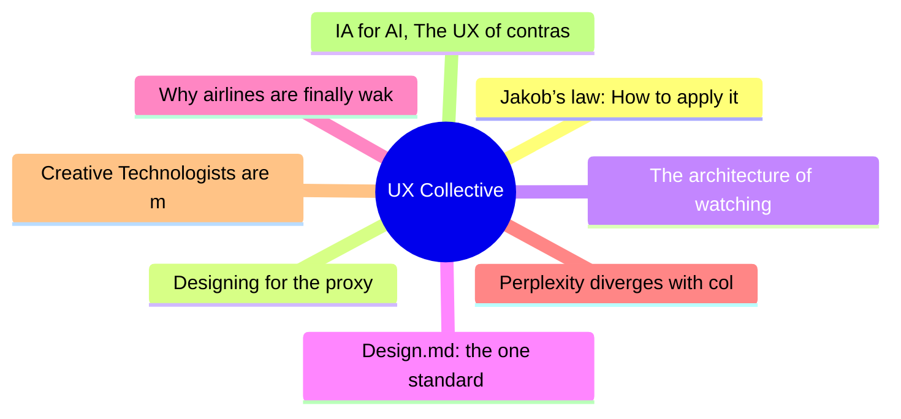
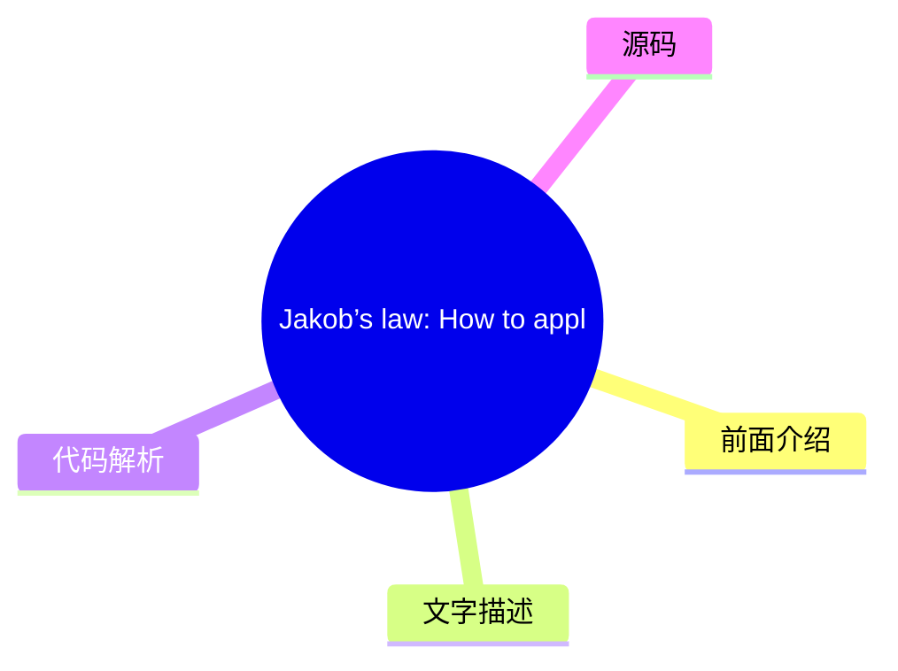
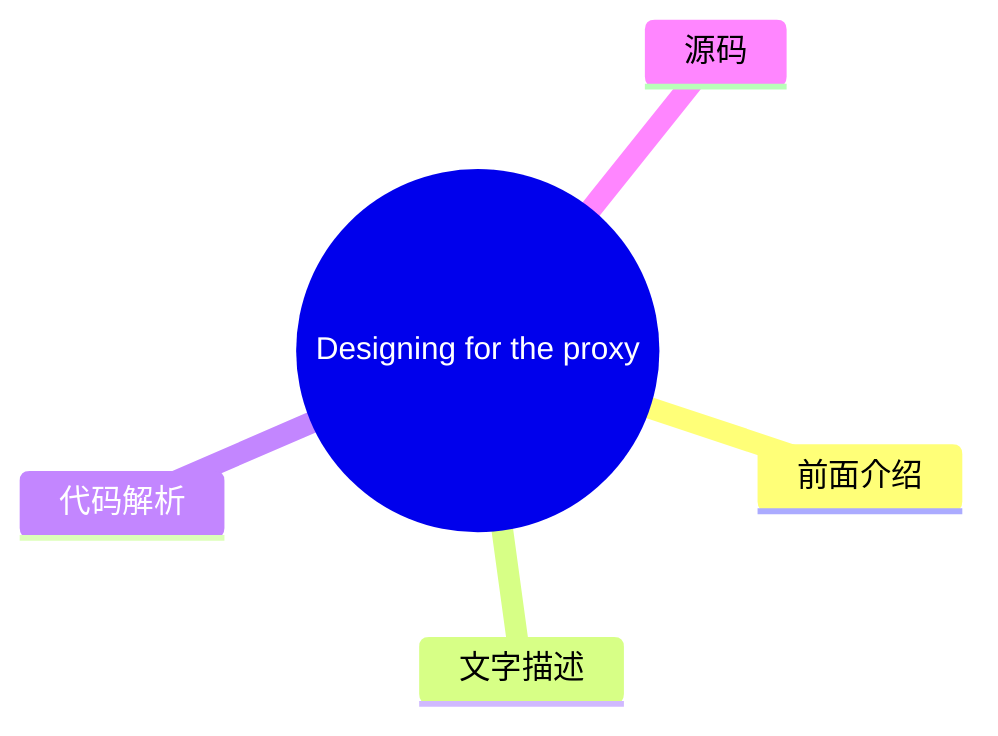
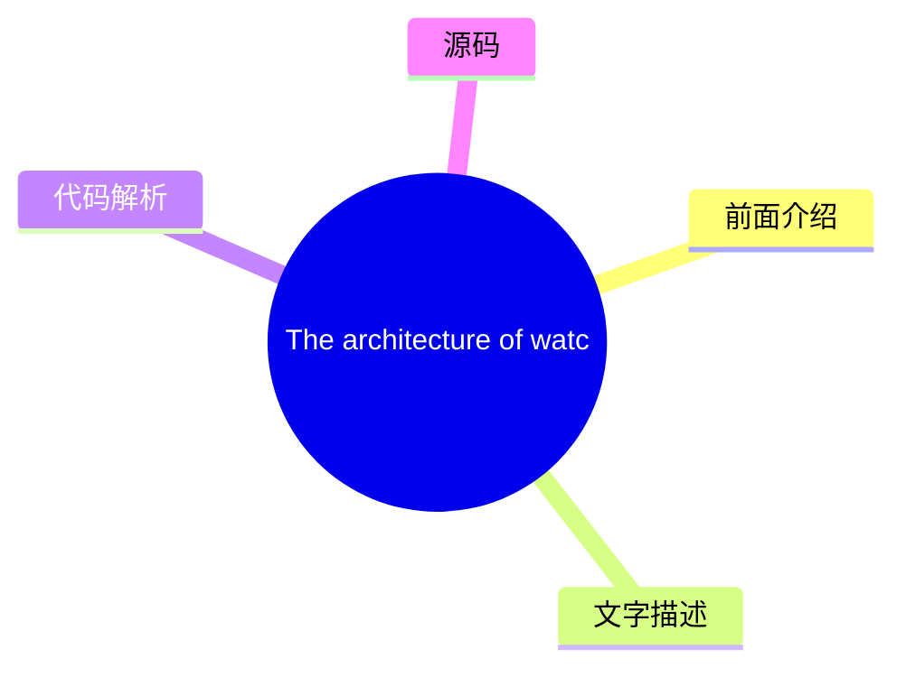
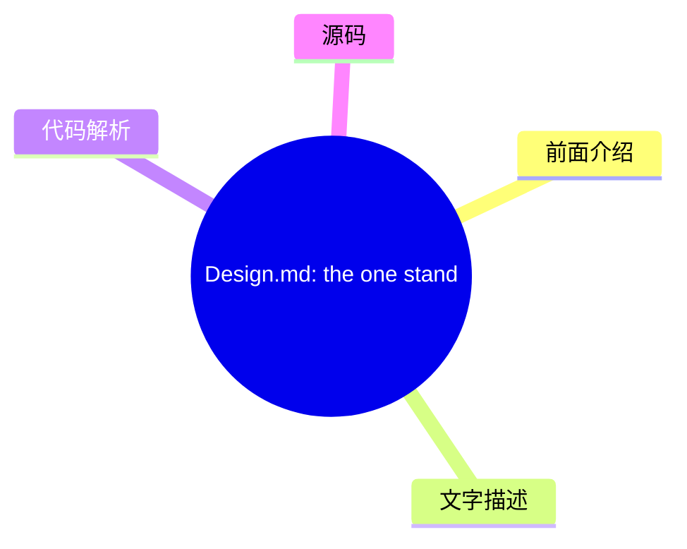
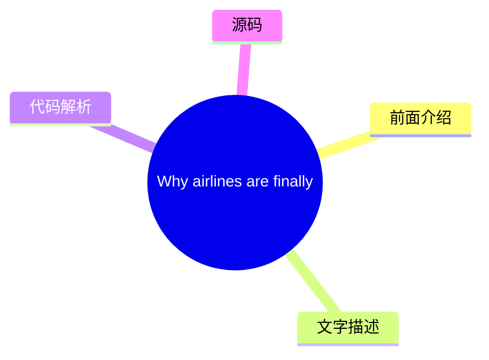
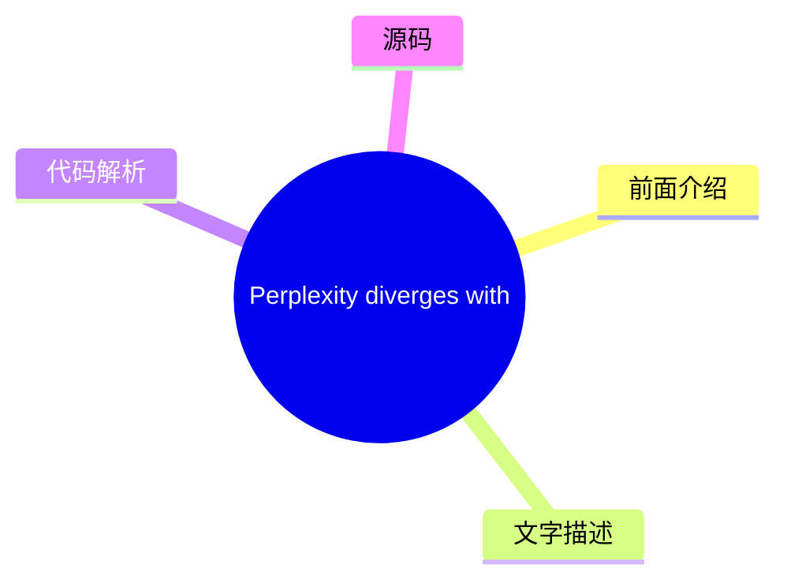
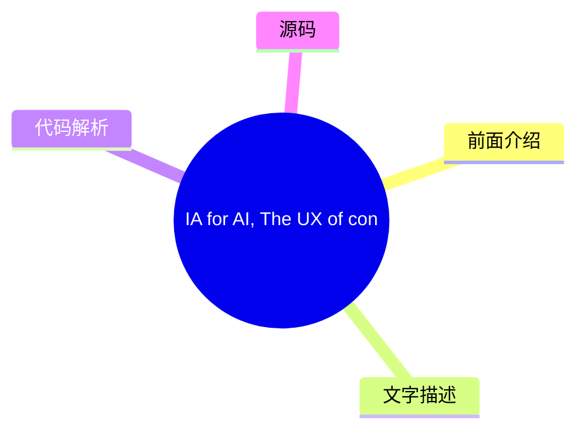

# ✏️ UX Collective Top 8 (2026-08-04)

## 前面介绍

- 数据源：UX Collective
- 抓取日期：2026-08-04
- 条目数：8
- 含完整正文：8
- 含代码片段：1
- 组织方式：前面介绍 / 树状图 / 文字描述 / 代码解析 / 源码

## 思维导图



## 详细整理（8 条，8 条含全文，1 条含代码）

### 1. Jakob’s law: How to apply it as AI collapses surfaces into one chat box
- **链接**: [https://uxdesign.cc/jakobs-law-how-to-apply-it-as-ai-collapses-surfaces-into-one-chat-box-d8ebc9a727db?source=rss----138adf9c44c---4](https://uxdesign.cc/jakobs-law-how-to-apply-it-as-ai-collapses-surfaces-into-one-chat-box-d8ebc9a727db?source=rss----138adf9c44c---4)
- **作者**: Patrick Neeman
- **发布**: Thu, 30 Jul 2026 22:36:31 GMT

#### 前面介绍

- 作者：Patrick Neeman
- 发布时间：Thu, 30 Jul 2026 22:36:31 GMT

#### 树状图



#### 文字描述

- # Jakob’s law: How to apply it as AI collapses surfaces into one chat box
- ## Assistants like Claude are pulling more tasks through a conversational front door. Jakob Nielsen’s law of familiar interfaces now points at the assistant itself with glee. “Users spend most of their time on other sites.” — [Jakob Nielsen, Jakob’s Law (2000)](https://jakobnielsenphd.substack.com/p/jakobs-law) Jakob Nielsen wrote his law in 2000, and it has outlasted almost ev
- ## The Surface Count Is Falling For most of computing’s history, software multiplied; every job got its own destination — an app, a site, a tool, each with its own interface to learn — until the home screen filled up and the browser tabs multiplied past counting. Jakob’s Law existed precisely because there were so many surfaces, and users needed them to behave alike because a d
- ## Jakob’s Law Points at the Assistant Now Jakob’s Law is a claim about reference points and users build mental models in the places they spend their time, then carry those expectations everywhere else. When the time was spent across many websites, the reference set was the web’s shared furniture — logo top-left, search top-right, cart and notifications in the corner. When the 

#### 代码解析

- 本文未检测到明确代码块，内容更偏新闻、观点或方法论。

#### 源码

#### 中文节选

# Jakob 定律：如何将其应用于 AI 将所有表面整合为一个聊天框

## 像 Claude 这样的助手正通过对话式的前端入口处理更多任务。Jakob Nielsen 的熟悉界面定律现在正欢快地指向了该助手本身。

“用户的大部分时间都花在其他网站上。” —

[Jakob Nielsen, Jakob’s Law (2000)](https://jakobnielsenphd.substack.com/p/jakobs-law)

Jakob Nielsen 于 2000 年写下了这条定律，它比那个网络时代的其他几乎所有事物都更长久。他的许多戒律依然成立，这并非因为技术停止了进步——它从未停止——而是因为人们改变的速度远不及他们的工具。

其含义是：用户期望你的网站像他们已经知道的那些网站一样运作，就像我们期望汽车以某种方式运作一样，即如果方向盘是一堆操纵杆，我就不想租或买那辆车。

这就是为什么组织建立了设计系统团队——为了坚持应用程序设计的最佳实践，以便每个屏幕都与人们已经预期的保持一致，同时仍在品牌范围内进行创新。

30 年来，这意味着要匹配更广泛网络的惯例，因为那是用户建立习惯的地方

但这正在迅速改变。

越来越多的任务不再始于网站或应用程序——它们始于一个助手。你要求 Claude 或 ChatGPT 起草电子邮件或提取数字，工作通过一个对话式界面完成，而不是来自不同供应商和设计团队的十几个截然不同的界面。

一个人接触的界面数量正在减少，助手正成为任务的入口，而这些任务以前在多个浏览器标签页中都有各自的目的地。

它们的相似性是一个特性，因为每个助手都运行在相同的模式上——一个提问框、一个回复、来回的互动——学习一种模式就教会了你所有模式，因此一个新的 AI 工具不需要手册，并且采用速度比任何引导流程都能管理的速度都要快。

这是经过设计的，因为我们正在学习如何适应这个新时代。

Jakob’s Law usually reads as a warning against deviating; here it runs the other way, as the reason uptake is this quick. The more these interfaces resemble each other, the less anyone has to learn, and the more willing people are to try the next one which gives us a chance to be creative in inventing the future. This flips his law on its head.

That’s why [design components](https://ux-components.com/) and their semantic layer matter more than ever — they make conventions explicit and predictable, the clear expectations users need to move across sites and the legible structure an agent needs to read one.

That doesn’t retire Jakob’s Law; it moves the work to a different set of surfaces and requires even more standardzation.


If most use cases now flow through the assistant, the question for anyone building software isn’t only whether your product works when reached through that surface — it’s whether you’ve given the agent enough contex

#### 完整正文（中文）

# Jakob 定律：如何将其应用于 AI 将所有表面整合为一个聊天框

## 像 Claude 这样的助手正通过对话式的前端入口处理更多任务。Jakob Nielsen 的熟悉界面定律现在正欢快地指向了该助手本身。

“用户的大部分时间都花在其他网站上。” —

[Jakob Nielsen, Jakob’s Law (2000)](https://jakobnielsenphd.substack.com/p/jakobs-law)

Jakob Nielsen 于 2000 年写下了这条定律，它比那个网络时代的其他几乎所有事物都更长久。他的许多戒律依然成立，这并非因为技术停止了进步——它从未停止——而是因为人们改变的速度远不及他们的工具。

其含义是：用户期望你的网站像他们已经知道的那些网站一样运作，就像我们期望汽车以某种方式运作一样，即如果方向盘是一堆操纵杆，我就不想租或买那辆车。

这就是为什么组织建立了设计系统团队——为了坚持应用程序设计的最佳实践，以便每个屏幕都与人们已经预期的保持一致，同时仍在品牌范围内进行创新。

30 年来，这意味着要匹配更广泛网络的惯例，因为那是用户建立习惯的地方

但这正在迅速改变。

越来越多的任务不再始于网站或应用程序——它们始于一个助手。你要求 Claude 或 ChatGPT 起草电子邮件或提取数字，工作通过一个对话式界面完成，而不是来自不同供应商和设计团队的十几个截然不同的界面。

一个人接触的界面数量正在减少，助手正成为任务的入口，而这些任务以前在多个浏览器标签页中都有各自的目的地。

它们的相似性是一个特性，因为每个助手都运行在相同的模式上——一个提问框、一个回复、来回的互动——学习一种模式就教会了你所有模式，因此一个新的 AI 工具不需要手册，并且采用速度比任何引导流程都能管理的速度都要快。

这是经过设计的，因为我们正在学习如何适应这个新时代。

Jakob 定律通常被解读为对偏离的警告；在这里，它却反其道而行之，解释了为何采用速度如此之快。这些界面越相似，人们需要学习的内容就越少，也就越愿意尝试下一个界面，这给了我们在创造未来时发挥创造力的机会。这彻底颠覆了他的定律。

这就是为什么 [设计组件](https://ux-components.com/) 及其语义层比以往任何时候都更重要——它们使惯例变得明确且可预测，为用户跨越站点所需的清晰期望，以及代理需要阅读的可读结构提供了保障。

这并没有让 Jakob 定律失效；它将工作转移到了不同的界面集合上，并要求更严格的标准化。

如果大多数用例现在都通过助手流转，那么对于任何构建软件的人来说，问题不仅在于你的产品通过该界面访问时是否可用——还在于你是否通过使用标准模式，为代理提供了足够的上下文以便其良好使用。

## 界面数量正在减少

在计算的大部分历史中，软件呈指数级增长；每项工作都有其专属目的地——一个应用程序、一个网站、一个工具，每个都有其需要学习的界面——直到主屏幕被填满，浏览器标签页多到数不清。

Jakob 定律之所以存在，正是因为有如此多的界面，用户需要它们表现一致，因为下拉菜单就是下拉菜单。

助手则走向了另一个方向，将工作吸收到一个地方。

人们现在通过他们已经打开的任意助手来路由工作——[Anthropic Claude](https://claude.ai/)、[Microsoft Copilot](https://copilot.microsoft.com/)、[Google Gemini](https://gemini.google.com/)、[ChatGPT](https://chatgpt.com/)——而不是为每项任务打开不同的工具。

这不仅仅是独立的助手，因为人们已经使用的聊天工具本身也已成为独立的对话界面：Slack 现在直接在其频道中运行 AI 代理，包括来自 Anthropic 等第三方代理，[Microsoft Teams 将 Copilot 及其代理放在了同事交谈的同一个窗口中](https://slack.com/blog/news/ai-innovations-in-slack)。

Open-source projects push the same idea further: [OpenClaw](https://docs.openclaw.ai/), a fast-growing self-hosted agent, drops a model of your choosing — Claude, GPT, Gemini — into whatever messaging app you already use, from Slack and Teams to Discord, WhatsApp, and Telegram.

The conversation people were already having with each other is now also where they talk to the software so the users don’t have to relearn it.

OpenAI lets third-party apps run inside ChatGPT itself, so you can [search listings, build a deck, or pull up a playlist without leaving the conversation](https://openai.com/index/introducing-apps-in-chatgpt/). Anthropic’s Model Context Protocol does the same work from the other side: it’s [an open standard that connects an assistant to the systems where data and tools live](https://www.anthropic.com/news/model-context-protocol), replacing a pile of one-off integrations with a single protocol. Claude reaches your calendar, your documents, and your issue tracker through that one connection.

The deeper shift is what the assistant does once it’s there.

It doesn’t just answer in one place — it goes out and does the interpreting. Claude Cowork takes a goal and [works across your files and applications, synthesizing across many sources and handing back a finished deliverable](https://www.anthropic.com/product/claude-cowork), rather than answering one prompt at a time.

Point it at the work and it moves between the sources itself. The labor of visiting a dozen sites, reading each one, and piecing together what they mean — the exact cognitive cost Jakob’s Law set out to reduce — the agent now absorbs almost entirely. The user states the outcome; the interpreting happens out of view.


The labor of visiting a dozen sites, reading each one, and piecing together what they mean — the exact cognitive cost Jakob’s Law set out to reduce — the agent now absorbs almost entirely. The agent now packages the information for you, which is going to dramatically improve the enterprise experience once we get the APIs in place.


把这一切放在一起，方向就清晰了。世界中的表面数量并没有减少——软件依然在以同样的速度呈指数级增长；真正下降的是任何单个用户直接接触的表面数量，因为助手已经成为了通用表面，而智能体越来越多地承担了原本需要人工完成的跨表面工作。

我们以前见过这种版本。20世纪90年代末的 Web 是目录和门户的蔓延——雅虎手动构建的索引，告诉你该去哪里。[然后搜索将这一切都坍缩进了一个单一的搜索框](https://medium.com/muzli-design-inspiration/five-ux-lessons-from-the-webcrawler-and-ask-jeeves-era-about-the-ai-experience-transition-54e281a60672)。

有时，数量会降为零。

一个表面并不总是缩小为助手——有时它根本不会出现，因为工作已经变得无处不在。一个在后台监控你收件箱的智能体会归档收据、标记续订并重新安排会议，你第一次听到这件事，可能是在事后得到的摘要中，如果有的话。

没有屏幕可以打开，也没有对话可以开始，所以雅各布定律所描述的界面根本就不存在——这比熟悉的屏幕是一个更难的设计问题，而不是一个更容易的问题。

**行动项**

- **绘制跨表面的旅程。**梳理用户的端到端旅程，然后标记哪些步骤现在发生在助手上，哪些仍然发生在你的产品中，以及交接点在哪里。交接点是期望破裂的地方，也是你的设计工作发挥作用的地方。
- **观察任务开始的地方。**持续一周，记录你是在打开某个应用之前先使用了助手——你自己的行为是你用户行为的先行指标，并立即设定了期望。
- **停止将屏幕数量和点击次数减少视为胜利。**淘汰那些奖励应用内时间和页面浏览量的指标。如果助手完成了任务，即使你赢了，这些数字也会下降。

## 雅各布定律现在指向了助手

Jakob 定律是关于参考点和用户的，用户会在他们花费时间的场所建立心理模型，然后将这些期望带到其他任何地方。当时间花费在许多网站上时，参考集是网络共享的家具——左上角的 Logo，右上角的搜索，角落里的购物车和通知。

当时间花费在助手上时，参考集就变成了助手。

你用自然语言输入请求，得到结果，并在对话中对其进行优化，期望它能记住你两轮对话前说的话。[数亿人现在每周都在这样做](https://techcrunch.com/2025/10/06/sam-altman-says-chatgpt-has-hit-800m-weekly-active-users/)，并且这正成为让计算机做某事的默认期望。

这就是重点——助手在很多情况下正成为默认选项，这有助于采用。

这不再仅仅是“像其他网站一样工作”。而是“像助手那样工作”，因为那是你的用户现在熟练的交互方式。我在之前的文章中把自然语言输入称为提问框；更大的观点是，提问框不再只是众多模式中的一种。它正在成为那种模式——越来越多的任务流经的入口。

## 在您的收件箱中获取 Patrick Neeman 的故事

加入 Medium 免费获取此作者的更新。

这正是 Jakob 定律在发挥它一贯的作用。只是用户花费时间的场所集中了，所以期望也随之集中。

**行动项**

- **亲自学习新约定，以便知道如何为它们进行设计。**花一周时间在 Claude、Copilot、Gemini 或 ChatGPT 内部进行实际工作，并写下你预期的交互模式。那份列表就是你的用户的新基准。
- **对照它们审计您的功能。**将您自己的 AI 功能与该基准进行比较，并修复每一个没有理由就表现不同的地方——没有理由的差异就是摩擦。
- **不要重新发明输入方式。**提问框现在是一种约定；对它的巧妙定制只会让人们在别处已经熟练做的事情上重新学习，增加了负担。

## 您可能不再拥有界面

如果用例流经助手，用户看到的界面是助手的，而不是你的。他们让 Claude 在合同中查找每一项自动续约条款，Claude 通过连接器访问你的合同平台，完成工作并在聊天中回答。用户从未打开你的应用程序。他们从未见过你的导航、你精心构建的仪表盘、你的品牌。你的产品完成了工作，却保持隐形。

这就是更少界面的真正后果。

对于有意义的一组任务，你不再拥有界面，看起来像服务设计。是助手在做。雅各布定律依然适用——但现在它适用于助手的界面，你无法控制，你的工作也从设计目的地转变为通过他人的界面变得清晰可见。

对于有意义的一组任务，你不再拥有界面，是助手在做。

这就是 affordance 问题 [Amelia Wattenberger](https://medium.com/u/48764f382701?source=post_page---user_mention--d8ebc9a727db---------------------------------------) 早期指出的地方回归、转移的地方。她指出，一个简单的聊天输入框没有任何 affordance —— [同一个矩形看起来像搜索框、登录表单和信用卡字段](https://wattenberger.com/thoughts/boo-chatbots)。当你的产品通过那个矩形被访问时，其功能只有助手让它可见时才可见。用户不会通过点击来发现你的功能。只有当助手知道你的产品能做……
...（截断，原文 22251+ 字符）


### 2. Designing for the proxy
- **链接**: [https://uxdesign.cc/designing-for-the-proxy-2606ffac2335?source=rss----138adf9c44c---4](https://uxdesign.cc/designing-for-the-proxy-2606ffac2335?source=rss----138adf9c44c---4)
- **作者**: Aurélie Radom
- **发布**: Sun, 02 Aug 2026 14:12:49 GMT

#### 前面介绍

- 作者：Aurélie Radom
- 发布时间：Sun, 02 Aug 2026 14:12:49 GMT

#### 树状图



#### 文字描述

- # Designing for the proxy **The audience changed** For decades, designers had one audience: people. Every method, framework and principle we adopted revolved around understanding human needs and designing experiences people could navigate, trust and enjoy. Human-centered design was never simply a methodology. It became the foundation of our profession. That foundation hasn’t di

#### 代码解析

- 本文未检测到明确代码块，内容更偏新闻、观点或方法论。

#### 源码

#### 中文节选

# Designing for the proxy

**The audience changed**

For decades, designers had one audience: people.

Every method, framework and principle we adopted revolved around understanding human needs and designing experiences people could navigate, trust and enjoy. Human-centered design was never simply a methodology. It became the foundation of our profession. That foundation hasn’t disappeared, but something has changed around it.

Today, many digital experiences have another audience before they ever reach a human. An article written to answer someone’s question may first need to be understood and cited by a language model. A developer trying to understand an API asks an AI assistant before opening the official documentation. A user searching for information may receive an AI-generated answer before ever visiting the original source.

The first interaction with our work now happens through another machine. These systems are no longer only tools we use during creation. They have become participants in how our work is discovered, interpreted and experienced. We often describe AI as changing the way we work. I think something more fundamental is happening.

**AI is changing who encounters our work first.**

For decades, optimizing for people was enough because people were the first readers, users and decision-makers. Today, our work is interpreted, summarized and evaluated before it reaches the person it was created for. The machine has become an intermediary between creators and audiences, and this introduces a new design challenge. How do we optimize for machines without accidentally designing for the proxy instead of the person?

**The danger of designing for the proxy**


Digital products have always been shaped by intermediaries. Search engines changed how we organized information because they became the gateway between creators and readers. Social platforms changed how we communicated because algorithms decided what deserved attention. Every technological shift quietly influenced the way products and content were designed. We adapted by learning semantic HTML, structured metadata and information architecture that made content easier to find. None of these practices conflicted with human-centered design because the destination remained the same: helping people discover information more easily.

LLMs introduce something fundamentally different. They do not simply direct people toward information. They interpret it, summarize it and act on behalf of users before users ever interact with the original source.

Marshall McLuhan argued in [ Understanding Media](https://mitpress.mit.edu/9780262631594/understanding-media/) that every new medium changes not only how information is distributed, but also how it is created. Search engines rewarded discoverability, social media rewarded engagement, and LLMs reward interpretability. Whether we realize it or not, we are beginning to design with this new audience in mind. The problem begins when the signal replace

#### 完整正文（中文）

# Designing for the proxy

**The audience changed**

For decades, designers had one audience: people.

Every method, framework and principle we adopted revolved around understanding human needs and designing experiences people could navigate, trust and enjoy. Human-centered design was never simply a methodology. It became the foundation of our profession. That foundation hasn’t disappeared, but something has changed around it.

Today, many digital experiences have another audience before they ever reach a human. An article written to answer someone’s question may first need to be understood and cited by a language model. A developer trying to understand an API asks an AI assistant before opening the official documentation. A user searching for information may receive an AI-generated answer before ever visiting the original source.

The first interaction with our work now happens through another machine. These systems are no longer only tools we use during creation. They have become participants in how our work is discovered, interpreted and experienced. We often describe AI as changing the way we work. I think something more fundamental is happening.

**AI is changing who encounters our work first.**

For decades, optimizing for people was enough because people were the first readers, users and decision-makers. Today, our work is interpreted, summarized and evaluated before it reaches the person it was created for. The machine has become an intermediary between creators and audiences, and this introduces a new design challenge. How do we optimize for machines without accidentally designing for the proxy instead of the person?

**The danger of designing for the proxy**


数字产品一直由中介塑造。搜索引擎改变了我们组织信息的方式，因为它们成为了创作者和读者之间的门户。社交平台改变了我们沟通的方式，因为算法决定了什么值得被关注。每一次技术变革都潜移默化地影响着产品和内容的设计方式。我们通过学习语义 HTML、结构化元数据和信息架构来适应，这些做法让内容更容易被找到。这些做法与以人为中心的设计并不冲突，因为目标始终如一：帮助人们更轻松地发现信息。

LLM 引入了一些根本性的不同。它们不仅仅是引导人们获取信息。它们会解读信息、总结信息，并在用户与原始来源互动之前代表用户采取行动。

马歇尔·麦克卢汉在 [Understanding Media](https://mitpress.mit.edu/9780262631594/understanding-media/) 中指出，每一种新媒介不仅改变了信息的分发方式，也改变了信息的创造方式。搜索引擎奖励可发现性，社交媒体奖励参与度，而 LLM 则奖励可解释性。无论我们是否意识到，我们开始考虑为这一新受众进行设计。问题始于信号取代了它所代表的事物。

我们以前见过这种情况。社交平台旨在帮助人们发现相关内容，但参与度成为了主导信号，因为它是可以衡量的。平台在预测什么能让人持续观看方面变得越来越有效，但这并不一定意味着能建立有意义的连接。

系统针对代理进行了优化，而人类体验则变得次要。

我们在 AI 领域正经历类似的转变。随着组织开始创建更容易被语言模型检索、总结和引用的内容，它们主要是在为需要信息的人设计，还是为位于他们之间的系统设计？

这种区别很重要。

一篇医疗文章如果结构完美以便于 LLM 引用，但如果患者无法理解，那它依然会失败。针对机器理解的优化并不是问题所在。问题在于，当机器理解成为成功的定义时，问题就开始了。

招聘领域也出现了同样的模式。申请人跟踪系统和 AI 筛选工具帮助公司管理日益增长的大量申请。随着候选人针对算法优化简历和作品集，招聘过程有风险变成一场机器之间的对话。候选人开始为评估他们的系统写作，而不是为他们希望触达的人写作。招聘人员变成了第二读者，作品集变成了需要解码的信号，而其背后的人则变得难以看清。

**截图无法展示的内容**

创作端也正在发生同样的转变。生成式 AI 彻底改变了创作的经济模式。制作界面、编写文档以及探索数百种设计方向从未如此简单。一个令人信服的界面现在可以在几秒钟内生成。它看起来可能很精致、完整且随时可以发布。但截图隐藏了使产品能够运作的几乎所有细节。

将同一个界面移入真实的设计工作流中，差距很快就会显现。一旦引入一致的网格，布局就会断裂，组件无法像系统那样运作，交互状态缺失，排版无法跨断点缩放，且从未考虑过无障碍访问。移交工作变成了一堆像素，而不是产品工程师可以真正构建的产品。

像素就在那里。产品却不存在。

好的设计从来不是由截图中的内容定义的。它存在于截图无法展示的决策中：创建层级关系的间距系统、允许产品演进的组件架构、降低认知负荷的交互模式、使复杂内容易于理解的信息架构，以及确保每个人都能使用该体验的无障碍访问决策。

这些决策很少出现在静态图像中，却决定了产品能否挺过首次发布。它们将一个吸引人的界面转化为能够历经数年演进而非数周的东西。

这种区分远不止适用于数字产品。建筑师不能仅凭渲染图来评判。建筑必须屹立不倒，适应环境，并支撑居住在其中的人们。同样，设计师不能仅凭漂亮的屏幕来评判，而是要看这些屏幕在产品演进、扩展并适应不断变化的需求和日益增长的复杂性时，能否继续作为产品发挥作用。

AI 大幅降低了可见层的生产成本。这使得不可见层的价值呈指数级增长。具有讽刺意味的是，界面变得越容易生成，设计就越重要。因为设计从来不是像素，而是像素背后的所有内容。

**决定什么应当保留人性**

这让我们回到了设计的核心问题。不是 AI 能否创造，而是设计师知道什么应当保留人性。生成已经变得丰富，而辨别力却变得稀缺。

语言模型受益于一致性、明确的结构和语义清晰度。人类则对个性、模糊性、惊喜和情感做出反应。

两者都没有错。

最好的体验需要同时满足这两者。文档应当结构足够清晰，以便 AI 助手准确解读，同时保持工程师阅读时的可理解性。医疗保健内容应当易于语言模型检索，而不应牺牲患者所需的同理心、清晰度和细微差别。设计系统应当是机器可读的，而不应变得过于僵化，从而扼杀创造力。

[Google 的 People + AI 指南](https://pair.withgoogle.com/) 将 AI 描述为一种应该增强人类能力而非取代人类判断的协作者。目标不是将人从过程中移除，而是设计出让人在其中保持有意义控制权的系统。以机器为中心的设计并不会取代以人为中心的设计，它扩展了我们的责任。

几十年来，设计师专注于创造人们能够理解、信任和享受的体验。今天，我们也必须考虑这些体验是如何被我们与我们要为之设计的人之间的系统进行解读的。优化机器正成为工作的一部分，而设计机器则不是。

每一次技术变革都会引入一个新的代理。每一个代理都会产生新的激励。每一个激励最终都会塑造被构建的内容。

设计师无法控制这些激励，但他们决定产品最终是为指标服务，还是为指标背后的人服务。设计的未来不属于那些优化一切的人。它属于那些知道什么永远不应该被优化的人。AI 并没有改变我们为谁创造，它改变了谁最先阅读。

我们的责任是确保它们永远不会被混淆。

**来自 AI × Taste**

*一个探讨 AI 时代品味经济学的月度系列：*

- **AI 让每个人都成为了创作者，而非设计师**
 AI 如何让生成变得唾手可得，使设计判断和品味成为新的竞争优势。
- **低品味的组织成本**
 弱设计判断如何在产品、团队和组织中产生累积效应。
- **品味无法被委托**
 为什么 AI 可以生成无限的可能性，但决定什么应该存在仍然本质上是人类的。
- **为代理而设计**
 为什么 AI 改变了谁最先阅读，以及当我们为中介而非人进行优化时会发生什么。


### 3. The architecture of watching work
- **链接**: [https://uxdesign.cc/the-architecture-of-watching-work-dcc521fcad1c?source=rss----138adf9c44c---4](https://uxdesign.cc/the-architecture-of-watching-work-dcc521fcad1c?source=rss----138adf9c44c---4)
- **作者**: Takuma Kakehi
- **发布**: Sun, 02 Aug 2026 10:27:44 GMT

#### 前面介绍

- For a century we designed the office around a single question&#x200A;&#x2014;&#x200A;how do we see work? AI is quietly changing the question.Continue reading on UX Collective »
- 作者：Takuma Kakehi
- 发布时间：Sun, 02 Aug 2026 10:27:44 GMT

#### 树状图



#### 文字描述

- Member-only story
- # The architecture of watching work
- ## For a century we designed the office around a single question — how do we see work? AI is quietly changing the question. You reach *the* *Great Workroom* the way Frank Lloyd Wright meant you to. The approach is a low, dark passage of bare concrete, the ceiling pressed close over your head, the daylight draining out of the walk. Then the ceiling lifts, the walls fall away, an

#### 代码解析

- 本文未检测到明确代码块，内容更偏新闻、观点或方法论。

#### 源码

#### 中文节选

会员专属内容

# 观察工作的架构

## 一个世纪以来，我们围绕一个问题设计办公室——我们如何观察工作？AI 正在悄然改变这个问题。

你以弗兰克·劳埃德·赖特希望的方式抵达*那个**伟大的工作间*。入口是一条低矮、幽暗的裸混凝土通道，天花板紧压在头顶，日光从通道中流逝。随后天花板升起，墙壁退去，房间瞬间敞开——你站在一个感觉不像办公室的地方。它感觉像是一片同意静止不动的森林。这是*赖特的“压缩与释放”*的典型例子：他特意建造了这条幽暗低矮的走廊，以便当你踏入时房间会“引爆”。他于 1939 年完成了整个建筑，八十七年后，天花板依然做着它被建造时所做的事。近六十根纤细的柱子从几乎只有九英寸宽的基座上升起二十英尺，在顶部展开成宽大的垫子，彼此相连并成为屋顶。赖特称它们为“树状”（dendriform）。其他人则称它们为“睡莲叶”。光线穿过四十三英里的派热克斯玻璃管，原本应该是墙壁的地方。完全没有内部墙壁——半英亩的开阔地板，曾经是一个挤满办事员的房间。

#### 完整正文（中文）

会员专属内容

# 观察工作的架构

## 一个世纪以来，我们围绕一个问题设计办公室——我们如何观察工作？AI 正在悄然改变这个问题。

你以弗兰克·劳埃德·赖特希望的方式抵达*那个**伟大的工作间*。入口是一条低矮、幽暗的裸混凝土通道，天花板紧压在头顶，日光从通道中流逝。随后天花板升起，墙壁退去，房间瞬间敞开——你站在一个感觉不像办公室的地方。它感觉像是一片同意静止不动的森林。这是*赖特的“压缩与释放”*的典型例子：他特意建造了这条幽暗低矮的走廊，以便当你踏入时房间会“引爆”。他于 1939 年完成了整个建筑，八十七年后，天花板依然做着它被建造时所做的事。近六十根纤细的柱子从几乎只有九英寸宽的基座上升起二十英尺，在顶部展开成宽大的垫子，彼此相连并成为屋顶。赖特称它们为“树状”（dendriform）。其他人则称它们为“睡莲叶”。光线穿过四十三英里的派热克斯玻璃管，原本应该是墙壁的地方。完全没有内部墙壁——半英亩的开阔地板，曾经是一个挤满办事员的房间。


### 4. Design.md: the one standard file carries your visual identity, for humans and agents
- **链接**: [https://uxdesign.cc/design-md-the-one-standard-file-carries-your-visual-identity-for-humans-and-agents-9058d5b39d9b?source=rss----138adf9c44c---4](https://uxdesign.cc/design-md-the-one-standard-file-carries-your-visual-identity-for-humans-and-agents-9058d5b39d9b?source=rss----138adf9c44c---4)
- **作者**: Patrick Neeman
- **发布**: Sun, 02 Aug 2026 10:27:17 GMT

#### 前面介绍

- 作者：Patrick Neeman
- 发布时间：Sun, 02 Aug 2026 10:27:17 GMT

#### 树状图



#### 文字描述

- # Design.md: the one standard file carries your visual identity, for humans and agents
- ## Like a mullet, the business is up top for the machine, and the party below for the person. A single file is the standard we need that both your team and your agents read as truth. Ask a coding agent to build a screen today and watch what it reaches for: Some gray Material button, a shadcn card, a stack of defaults that belong to no brand in particular. That is not the agent 
- ## One File, Two Readers The file does one thing: It states your design in a form both a person and a machine can read, in the same place, at the same time. [DESIGN.md](https://github.com/google-labs-code/design.md) combines machine-readable tokens — your colors, type scale, spacing, and radii — with human-readable prose that explains what those values mean and when to bend the
- ## The Anatomy: Tokens Up Top, Prose Below Open a DESIGN.md and you find two zones. Up top, fenced off, sits YAML frontmatter: typed groups for colors, typography, spacing, rounded corners, and components. Below the fence, Markdown prose, written in a fixed order that opens with Overview and closes with a short list of do’s and don’ts. Google’s own [Paws & Paths example](https:

#### 代码解析

- `text`: 代码片段可作为实现参考，建议结合上下文确认输入输出和边界条件。
- `text`: 代码片段可作为实现参考，建议结合上下文确认输入输出和边界条件。

#### 源码

#### 源码片段 1（text）

```text
---
colors:
  primary: "#855300"     # "Golden Retriever" — main actions
  secondary: "#0058be"   # "Sky Walk" — calmer, admin tasks
typography:
  body-md: { fontFamily: Plus Jakarta Sans, fontSize: 16px }
---
## Colors
The palette centers on "Golden Retriever" orange to drive
action, balanced by "Sky Walk" blue for scheduling and admin.
```

#### 源码片段 2（text）

```text
Here's an example DESIGN.md. Interview me about my brand —
colors and what each should signal, two or three type levels,
the corner radius that feels right — then write mine in the
same format.
```

#### 完整正文（中文）

# Design.md：承载你视觉身份的唯一标准文件，面向人类和智能体

就像莫霍克发型一样，上面是机器的，下面是人的。单一文件是我们需要的标准，你的团队和你的智能体都将它视为真理。

今天让一个编码智能体去构建一个界面，观察它会抓取什么：一些灰色的 Material 按钮，一个 shadcn 卡片，一堆不属于任何特定品牌的默认组件。

这并不是智能体失败了：这是智能体从零开始工作，因为你的视觉身份存在于 Figma 文件、演示文稿和三位资深设计师的脑海中，而模型在构建时无法读取这些内容。

如果没有书面的事实来源，无论你的品牌是什么，智能体都会退回到通用组件。字面意思就是，任何它能找到的组件。

解决方案是一个纯文本文件，已提交到代码仓库，它同时以两种方式陈述你的设计：顶部是机器可读的令牌，下方是人类可读的原理。

2026年4月，Google Labs [开源了 DESIGN.md 格式](https://medium.com/design-bootcamp/google-makes-design-md-open-source-on-its-way-to-become-a-industry-standard-16119f2368dd)。这是智能体标准的开端，是模型将其作为契约读取的纯文本文件：README.md 用于说明代码如何运行，DESIGN.md 用于说明品牌如何呈现。

Design.md 是

[与 Web 标准协作设计](https://medium.com/user-experience-design-1/designing-with-web-standards-the-playbook-for-this-ai-moment-92394884dc0d)的开始，专为 AI 时代。 [L. Jeffrey Zeldman](https://medium.com/u/355cb93fe914?source=post_page---user_mention--9058d5b39d9b---------------------------------------)树立了榜样，现在智能体正在跟随。

本文将带你从头开始编写自己的 DESIGN.md，从第一个颜色令牌到针对你实时网站运行的审计。一个聊天窗口和一个你熟悉的品牌就足以开始。

## 一个文件，两种读者

这个文件只做一件事：它以同一种形式、在同一时间、在同一地点陈述你的设计，供人和机器同时阅读。

[DESIGN.md](https://github.com/google-labs-code/design.md) 将机器可读的令牌——你的颜色、排版比例、间距和圆角——与解释这些值含义及何时调整它们的人类可读的散文相结合。

令牌为代理提供精确的数值，而散文则为其提供判断。

在单个请求上观察其中的差异。

- 没有 design.md 文件时，要求代理创建一个主按钮且未加载任何文件，你会得到一个具有默认圆角的蓝灰色矩形，正确但匿名。
- 有了 design.md 文件后，相同的请求会返回你的深森林绿，并使用你精确的圆角，因为令牌提供了数值，而散文提供了意图。

一份[格式细分](https://www.dsebastien.net/design-md-specification/)将其阐述得很清楚：令牌告诉代理“是什么”，散文告诉它“为什么”，而两者都需要才能做出任何非平凡的调用。如果剥离了这两者，无论它正在构建哪个品牌，它都会去寻找通用的组件。

共有八个正文部分，且存在的部分应按此顺序出现：

- **概述**（也称为“品牌与风格”）——对产品外观和感觉的整体描述：品牌个性、目标受众以及 UI 应唤起的情感反应，当未定义特定令牌时用作上下文。
- **颜色**——调色板；至少必须定义主调色板，并根据需要定义其他调色板。
- **排版**——排版层级；大多数系统有 9 到 15 个层级，使用语义类别（如标题、展示、正文和标签）进行命名。
- **布局**（也称为“布局与间距”）——布局和间距策略，例如网格模型和间距比例；间距令牌位于此处。
- **层级与深度**（也称为“层级”）——视觉层级如何传达，是通过阴影，还是对于扁平化设计，通过边框和颜色对比等替代方案。
- **形状**——元素如何塑造；圆角令牌位于此处。
- **组件**——组件原子（如按钮、芯片、列表、输入和复选框）的风格指导，以及它们的组件令牌。

- **Do’s and Don’ts**（注意事项）——实用的边界和常见陷阱，例如仅将主色用于屏幕上最重要的单一操作。

后半部分是大多数团队会跳过的部分，也是承载重量的部分。样式表里已经有了你的十六进制值；它所缺乏的是其中的理由。

- 为什么主色是深森林绿。
- “每屏一个操作”对按钮意味着什么。
- 设计师在什么情况下被允许打破网格。

把它想象成工程团队看待 README.md 的方式。关于仓库是否应该自我解释，已经不再有争议。负责解释的文件位于根目录，每一位新工程师，以及现在的每一位代理，都会首先阅读它。DESIGN.md 就是品牌对应的那个文件，而散文部分才是品牌真正存在的地方。

## 结构：顶部是令牌，下方是说明

打开一个 DESIGN.md，你会发现两个区域。顶部是 fenced off（ fenced off）的 YAML frontmatter（前置元数据）：为颜色、排版、间距、圆角和组件分类的分组。在 fence（ fence）下方是 Markdown 散文，按照固定的顺序编写，以 Overview（概述）开头，以简短的注意事项列表结尾。

Google 自己的 [Paws & Paths 示例](https://github.com/google-labs-code/design.md/blob/main/examples/paws-and-paths/DESIGN.md) 用几行代码展示了其形态：

```
---
colors:
  primary: "#855300"     # "Golden Retriever" — main actions
  secondary: "#0058be"   # "Sky Walk" — calmer, admin tasks
typography:
  body-md: { fontFamily: Plus Jakarta Sans, fontSize: 16px }
---
## Colors
The palette centers on "Golden Retriever" orange to drive
action, balanced by "Sky Walk" blue for scheduling and admin.
```
类型化值位于 fence 上方，纯文本理由位于下方，而像 {colors.primary} 这样的组件引用将两者联系起来，因此颜色只需定义一次，并在任何地方被引用。

结构是固定的；个性则不然。Google 的 [atmospheric-glass 示例](https://github.com/google-labs-code/design.md/blob/main/examples/atmospheric-glass/DESIGN.md) 用同样的章节填充了一个毛玻璃天气应用——磨砂晶体面板、20 像素的模糊、漂浮在鲜艳渐变之上的白色调——而 Paws & Paths 则读起来友好、圆润且专业。同样的八个标题，截然不同的氛围。这种跨度正是重点所在：格式承载的是品牌的个性，而不仅仅是数据。

[规范](https://github.com/google-labs-code/design.md/blob/main/docs/spec.md) 将该结构视为契约的一部分。未知的小节标题会被保留而不是被拒绝。只要其值有效，未知标记就会被接受。

但是，重复的小节标题是一个错误，会导致整个文件被拒绝，这告诉你小节的顺序和唯一性是结构性的，而非装饰性的。

标记是带有意图声明的，因此当正文和标记不一致时，标记胜出。

有两个机制值得尽早学习。标记是规范性的，因此当正文和标记不一致时，标记胜出。

定义一次的值可以通过引用重用：在 Paws & Paths 中，主按钮读取 backgroundColor {colors.primary}、rounded {rounded.lg}、padding {spacing.md}，因此它的外观永远不会是十六进制代码，而只是一组指针。重新品牌化，这只需要一行改动，而不是在四十个文件中搜索。

## 在聊天窗口中编写你的第一个文件

你不需要仓库就能开始。打开你现有的任何助手，给它一个示例 DESIGN.md，并要求它就你的品牌对你进行访谈——你的核心颜色及其各自代表的含义、两到三种字体层级、感觉合适的圆角半径。然后让它将你的回答格式化为相同的结构，并将结果粘贴到纯文本文件中。这就是一个工作草稿，而且它是一次对话的结果。

一个起始提示可以是这么简短：

```
Here's an example DESIGN.md. Interview me about my brand —
colors and what each should signal, two or three type levels,
the corner radius that feels right — then write mine in the
same format.
```

同时撰写两个部分是纪律。跳过文字，你得到的是调色板；写好文字，你得到的是简报。

所以从一个有观点的品牌开始——你的产品、一个客户、一个你钦佩的网站——那里的决策是真实的，而非虚构的。先起草标记：主色、次色、辅色和中性色，再加上两三个字号层级。只有在此之后，才撰写解释这些值用途的简短概述和颜色部分。

跳过文字，你得到的是调色板；写好文字，你得到的是简报。

当草稿感觉接近完成时，对其进行测试。将文件粘贴到代理中，要求生成一个样例屏幕，并观察它猜错的地方。那个差距就是你下一个需要定义的标记。

## 按角色命名的标记和组件

按功能命名事物，而不是按外观命名。一个名为 bigRedButton 的标记一旦重新品牌化就会失效，而一个名为 button.primary 的标记则能经受任何视觉变化，因为角色比颜色更持久。组件也是如此。

借用每个工具已经熟知的词汇——按钮、输入框、卡片、徽章、选项卡——而不是发明一个代理必须去猜测的私有词典。

按功能命名事物，而不是按外观命名。

这是披着新衣的旧智慧。

- Brad Frost 的 [Atomic Design](https://atomicdesign.bradfrost.com/) 多年前就论证了事物的命名方式塑造了它们被理解和复用的方式，并且共享的组件语言总是胜过定制的。
- Christine Vallaure 在 [Design system contracts](https://christinevallaure.substack.com/p/design-system-contracts-the-component) 中提出了类似的论点。在每个组件中间放置一个简短、朴素的描述，供设计工具和代码都读取，这样组件既不在 Figma 中也不在代码库中，而是在共享文件中。
- 如果你想要一份关于流行设计系统中同一元素如何命名的参考，[UX Components](https://www.ux-components.com/) 将它们并排展示——这是一种比从头开始争论名称更快的选名方式。

## 文件存放位置，以及如何保持诚实

将文件放在你其余源代码所在的位置：在仓库根目录下，或者在 /docs 文件夹中，命名为 DESIGN.md，紧挨着 README.md。现在，你对设计的每一次更改都有作者和差异，就像审查其他任何拉取请求一样。仅凭这一点，它就比仅存在于设计师才能打开的工具中的设计系统是一个安静的升级。

该文件也变成了你可以运行的东西。Google 的格式附带 [命令行工具，用于检查、对比和导出](https://github.com/google-labs-code/design.md/blob/main/README.md)：检查器会检查令牌引用并标记不符合 WCAG 对比度比率的颜色对，差异工具会显示两个版本之间的令牌和文本回归，而导出器会将你的令牌转换为 Tailwind 配置或 W3C 设计令牌格式，以便其他工具链使用。

结果以结构化数据的形式返回，代理可以据此采取行动。文档中的示例标记了一个按钮在深墨色背景上的白色文本，对比度为 15.42:1，轻松超过了 WCAG AA 阈值——以前这种审查是靠肉眼完成的，现在它已成为构建过程的一部分。

双向检查是保持文件活力的关键。

最实用的习惯根本不需要任何工具。将助手指向你的文件和实时网站，然后询问它们在哪里不一致。有时网站是错误的，有时文件是过时的。

没有人默默协调的真理来源最终会变成虚构。

## 标准尚未到来，但趋势已现

这一切都不需要你押注于某一家公司的工具。该格式还很年轻，是一个带有大量仍在[公开讨论](https://github.com/google-labs-code/design.md/issues)内容的 alpha 规范——暗黑模式、动画和响应式断点都是尚未解决的问题——而真正的采用取决于设计师是否已经

...（截断，原文 13779+ 字符）


### 5. Why airlines are finally waking up to context-aware design
- **链接**: [https://uxdesign.cc/why-airlines-are-finally-waking-up-to-context-aware-design-9cdb67722d03?source=rss----138adf9c44c---4](https://uxdesign.cc/why-airlines-are-finally-waking-up-to-context-aware-design-9cdb67722d03?source=rss----138adf9c44c---4)
- **作者**: Zeeshan Khalid
- **发布**: Sat, 01 Aug 2026 17:17:38 GMT

#### 前面介绍

- Your boarding pass has been sitting in that app for three days. But right now, as you sprint through Terminal 5, it&#x2019;s the last thing you&#x2026;Continue reading on UX Collective »
- 作者：Zeeshan Khalid
- 发布时间：Sat, 01 Aug 2026 17:17:38 GMT

#### 树状图



#### 文字描述

- Member-only story
- # Why airlines are finally waking up to context-aware design
- ## Your boarding pass has been sitting in that app for three days. But right now, as you sprint through Terminal 5, it’s the last thing you need. It’s 6:47 AM. You’re running on three hours of sleep, clutching a coffee that’s somehow both too hot and already lukewarm. Your flight boards in 23 minutes. You’re at the wrong end of the airport. And you pull out your phone, open the

#### 代码解析

- 本文未检测到明确代码块，内容更偏新闻、观点或方法论。

#### 源码

#### 中文节选

会员专属内容

# 为什么航空公司终于开始重视上下文感知设计

## 你的登机牌已经在那个 App 里躺了三天了。但现在，当你狂奔穿过 5 号航站楼时，它恰恰是你最不需要的东西。

现在是早上 6 点 47 分。你只睡了三个小时，手里紧紧攥着一杯咖啡，这杯咖啡不知怎么既太烫又已经不热了。你的航班还有 23 分钟登机。你跑错了机场的一端。于是你掏出手机，打开航空公司 App，你看到了什么？

还是三周前预订机票时看到的那个主页。

同样的菜单。同样的目的地促销横幅，而那个目的地并不是你要去的。同样的“探索我们的目的地”按钮，当初你梦想着这次旅行时它很有意义，但现在却感觉像是一个残酷的笑话。

*你滑动屏幕。你点击。你四处寻找。我的登机口在哪里？变了吗？行李托运在哪里？*

App 知道。它掌握着所有这些信息。但它让你费尽周折。

大多数航空公司 App 有一个共同点。它们是静态的。无论你的航班还有 30 天，还是你正在赶转机，你获得的基本上是相同的体验。

#### 完整正文（中文）

会员专属内容

# 为什么航空公司终于开始重视上下文感知设计

## 你的登机牌已经在那个 App 里躺了三天了。但现在，当你狂奔穿过 5 号航站楼时，它恰恰是你最不需要的东西。

现在是早上 6 点 47 分。你只睡了三个小时，手里紧紧攥着一杯咖啡，这杯咖啡不知怎么既太烫又已经不热了。你的航班还有 23 分钟登机。你跑错了机场的一端。于是你掏出手机，打开航空公司 App，你看到了什么？

还是三周前预订机票时看到的那个主页。

同样的菜单。同样的目的地促销横幅，而那个目的地并不是你要去的。同样的“探索我们的目的地”按钮，当初你梦想着这次旅行时它很有意义，但现在却感觉像是一个残酷的笑话。

*你滑动屏幕。你点击。你四处寻找。我的登机口在哪里？变了吗？行李托运在哪里？*

App 知道。它掌握着所有这些信息。但它让你费尽周折。

大多数航空公司 App 有一个共同点。它们是静态的。无论你的航班还有 30 天，还是你正在赶转机，你获得的基本上是相同的体验。


### 6. Perplexity diverges with color
- **链接**: [https://uxdesign.cc/perplexity-diverges-with-color-cad28cbe7bad?source=rss----138adf9c44c---4](https://uxdesign.cc/perplexity-diverges-with-color-cad28cbe7bad?source=rss----138adf9c44c---4)
- **作者**: Theresa-Marie Rhyne
- **发布**: Sat, 01 Aug 2026 02:47:36 GMT

#### 前面介绍

- Building data color schemes with Generative AI.Continue reading on UX Collective »
- 作者：Theresa-Marie Rhyne
- 发布时间：Sat, 01 Aug 2026 02:47:36 GMT

#### 树状图



#### 文字描述

- Member-only story
- # Perplexity diverges with color Here, I explore the use of [Perplexity](https://www.perplexity.ai/), a text-based generative AI model, as a color suggestion tool for building diverging color schemes to include in your data visualizations. A [diverging](https://web.natur.cuni.cz/~langhamr/lectures/vtfg1/mapinfo_2/barvy/colors.html#:~:text=Diverging%20Color%20Schemes,-Diverging%

#### 代码解析

- 本文未检测到明确代码块，内容更偏新闻、观点或方法论。

#### 源码

#### 中文节选

仅限会员阅读的故事

# Perplexity 随颜色发散

在这里，我探讨了将 [Perplexity](https://www.perplexity.ai/)（一种基于文本的生成式 AI 模型）作为配色建议工具，用于构建包含在数据可视化中的发散配色方案。[发散](https://web.natur.cuni.cz/~langhamr/lectures/vtfg1/mapinfo_2/barvy/colors.html#:~:text=Diverging%20Color%20Schemes,-Diverging%20schemes%20allow&text=A%20typical%20diverging%20scheme%20pairs,different%20hues%20at%20each%20extreme.) 配色方案融合了两个具有不同色相的[顺序配色方案]，并配有一个共享的中性中间色。颜色会加深，以表示从有意义的中值数据点向两个方向产生的差异。成功的结果取决于检查并有时修改特定的 Perplexity 颜色十六进制代码建议。

让我们先探索关于 Perplexity 作为生成式 AI 的细节，然后检查顺序配色方案如何创建发散效果。在本文中，我还注意到了 [Adobe Color](https://color.adobe.com/create/color-wheel) 应用程序的新界面。

**生成式 AI 聊天机器人简述：**

目前，有七种流行的生成式 AI 聊天机器人被广泛使用：Open AI 的 [ChatGPT](http://chatgpt.com/)、Microsoft 的 [Copilot](https://copilot.microsoft.com/chats/LbBYu2QARSc5Eq5kjqPmY)、Google 的 [Gemini](https://gemini.google.com/app)、Anthropic 的 [Claude](https://claude.ai/new)、[DeepSeek](https://chat.deepseek.com/)、xAI 的 [Grok](https://grok.com/) 和 Perplexity AI, Inc. **（简称为 [Perplexity](https://www.perplexity.ai/)）。** **用户可以要求这些聊天机器人协助执行网络搜索、创建电子邮件、文章和代码等任务。**

对于本文，我专注于 Perplexity。该聊天机器人被设计为[大型语言](https://en.wikipedia.org/wiki/Large_language_model)……

#### 完整正文（中文）

仅限会员阅读的故事

# Perplexity 随颜色发散

在这里，我探讨了将 [Perplexity](https://www.perplexity.ai/)（一种基于文本的生成式 AI 模型）作为配色建议工具，用于构建包含在数据可视化中的发散配色方案。[发散](https://web.natur.cuni.cz/~langhamr/lectures/vtfg1/mapinfo_2/barvy/colors.html#:~:text=Diverging%20Color%20Schemes,-Diverging%20schemes%20allow&text=A%20typical%20diverging%20scheme%20pairs,different%20hues%20at%20each%20extreme.) 配色方案融合了两个具有不同色相的[顺序配色方案]，并配有一个共享的中性中间色。颜色会加深，以表示从有意义的中值数据点向两个方向产生的差异。成功的结果取决于检查并有时修改特定的 Perplexity 颜色十六进制代码建议。

让我们先探索关于 Perplexity 作为生成式 AI 的细节，然后检查顺序配色方案如何创建发散效果。在本文中，我还注意到了 [Adobe Color](https://color.adobe.com/create/color-wheel) 应用程序的新界面。

**生成式 AI 聊天机器人简述：**

目前，有七种流行的生成式 AI 聊天机器人被广泛使用：Open AI 的 [ChatGPT](http://chatgpt.com/)、Microsoft 的 [Copilot](https://copilot.microsoft.com/chats/LbBYu2QARSc5Eq5kjqPmY)、Google 的 [Gemini](https://gemini.google.com/app)、Anthropic 的 [Claude](https://claude.ai/new)、[DeepSeek](https://chat.deepseek.com/)、xAI 的 [Grok](https://grok.com/) 和 Perplexity AI, Inc. **（简称为 [Perplexity](https://www.perplexity.ai/)）。** **用户可以要求这些聊天机器人协助执行网络搜索、创建电子邮件、文章和代码等任务。**

对于本文，我专注于 Perplexity。该聊天机器人被设计为[大型语言](https://en.wikipedia.org/wiki/Large_language_model)……


### 7. Creative Technologists are moving from the margins to the center
- **链接**: [https://uxdesign.cc/creative-technologists-are-moving-from-the-margins-to-the-center-4fcfaa3cf2f6?source=rss----138adf9c44c---4](https://uxdesign.cc/creative-technologists-are-moving-from-the-margins-to-the-center-4fcfaa3cf2f6?source=rss----138adf9c44c---4)
- **作者**: Ioana Adriana Teleanu
- **发布**: Sat, 01 Aug 2026 02:44:37 GMT

#### 前面介绍

- 作者：Ioana Adriana Teleanu
- 发布时间：Sat, 01 Aug 2026 02:44:37 GMT

#### 树状图


#### 文字描述

- # Creative Technologists are moving from the margins to the center
- ## Once an obscure job title, creative technology is becoming a new way of working, and a core capability inside modern product teams. Soon, many of us may be working this way. As AI collapses the distance between idea and implementation, companies are looking for people who can move across design, code, systems, and storytelling. Let us begin by disambiguating the Creative Tec
- ## The two ends of the spectrum Tina maps the field better than any formal taxonomy I have found. On one end is the commercial version, shaped by the dot-com boom, when companies needed people who could “talk to people and computers with the same suavity.” Some lean toward hardware, some live in the browser, and some build strange physical objects that end up in advertising cam
- ## A brief history: 60 years of the same person with different names The thing that gets lost in the “hot new role” discourse is that this archetype is not new. Its origin story goes back six decades, and tracing it reveals something important about where it is heading. **1966: the founding moment.** Bell Labs engineers Billy Klüver and Fred Waldhauer teamed up with artists Rob

#### 代码解析

- 本文未检测到明确代码块，内容更偏新闻、观点或方法论。

#### 源码

#### 中文节选

# 创意技术专家正从边缘走向中心

## 曾经是一个晦涩的头衔，创意技术正成为一种新的工作方式，以及现代产品团队的核心能力。很快，我们中的许多人可能都会以这种方式工作。

随着 AI 缩短了想法与实现之间的距离，公司正在寻找那些能够跨越设计、代码、系统和叙事领域的人。

让我们先来厘清创意技术专家这一角色。每个人都引用它，仿佛我们都明白它的含义。但当我要求人们具体定义它时，大多数人却做不到。

这也是可以理解的，这个角色确实很难界定。它已经存在了几十年，主要存在于广告公司、研究实验室和体验工作室。它也有过许多名字：用户体验工程师、设计技术专家、创意开发人员、用户体验原型制作师和设计工程师。分类学一团糟。即使是持有这个头衔的人也承认，这个名字听起来完全像是编造的。

但创意技术专家正迎来复兴。这个角色正从艺术边缘被拉入机器的中心，了解它的起源故事和方向能告诉我们许多创意职业的发展方向。

所以，让我试着来厘清它。

与其从定义开始，不如让我从一个人说起。

在最近一次 Google Flow 创作者社区通话中，嘉宾是 Tina Tarighian，她是位于纽约的 Google 创意实验室的高级创意技术专家。她在 Will Zimmerman 的 *3rd Space* 上发表的第一人称文章 [“WTF is a Creative Technologist?”](https://3rdspace3rdspace.substack.com/p/wtf-is-a-creative-technologist-by) 是我所读过的关于该角色最清晰的描述之一。如果你要阅读关于这个主题的另外一篇文章，那就读这一篇。

她的经历：高中时是一名全国排名的辩论选手。一位政治科学专业的学生，曾以为自己会成为下一个希拉里·克林顿。一个为了“真正去学习、哭一场，然后再学更多”而攻读计算机科学学位的人。一段在东京的对冲基金实习经历，感觉像是穿上了别人的鞋子。一位从街头把她拉住告诉她“选错职业”的算命先生。

然后，一位格林普特区的网络艺术家教了她 JavaScript。她穷到宁愿走 45 分钟去他的工作室，也不愿坐火车。她开始带着创意技术想法给公司发冷邮件。她第一个付费项目是为一家压缩内衣品牌开发虚拟试穿滤镜。她几乎没拿到钱，用她的话说，她“好几个星期都亢奋得让人受不了”。

她在乐队成立的前一天给一位音乐人发了私信，结果在他们的首秀上负责现场视觉编程。一个项目变成了十个：一个新博物馆驻留项目、时装秀装置、画廊作品，以及她自己的时装秀。当她想念那个不联系的前女友时，她开发了一个邮件抽奖程序，中奖概率极低，但确实会发送她的信。有 500 万人看到了它，来自 100 多个国家的人使用了它。

现在她工作

#### 完整正文（中文）

# 创意技术专家正从边缘走向中心

## 曾经是一个晦涩的头衔，创意技术正成为一种新的工作方式，以及现代产品团队的核心能力。很快，我们中的许多人可能都会以这种方式工作。

随着 AI 缩短了想法与实现之间的距离，公司正在寻找那些能够跨越设计、代码、系统和叙事领域的人。

让我们先来厘清创意技术专家这一角色。每个人都引用它，仿佛我们都明白它的含义。但当我要求人们具体定义它时，大多数人却做不到。

这也是可以理解的，这个角色确实很难界定。它已经存在了几十年，主要存在于广告公司、研究实验室和体验工作室。它也有过许多名字：用户体验工程师、设计技术专家、创意开发人员、用户体验原型制作师和设计工程师。分类学一团糟。即使是持有这个头衔的人也承认，这个名字听起来完全像是编造的。

但创意技术专家正迎来复兴。这个角色正从艺术边缘被拉入机器的中心，了解它的起源故事和方向能告诉我们许多创意职业的发展方向。

所以，让我试着来厘清它。

与其从定义开始，不如让我从一个人说起。

在最近一次 Google Flow 创作者社区通话中，嘉宾是 Tina Tarighian，她是位于纽约的 Google 创意实验室的高级创意技术专家。她在 Will Zimmerman 的 *3rd Space* 上发表的第一人称文章 [“WTF is a Creative Technologist?”](https://3rdspace3rdspace.substack.com/p/wtf-is-a-creative-technologist-by) 是我所读过的关于该角色最清晰的描述之一。如果你要阅读关于这个主题的另外一篇文章，那就读这一篇。

她的经历：高中时是一名全国排名的辩论选手。一位政治科学专业的学生，曾以为自己会成为下一个希拉里·克林顿。一个为了“真正去学习、哭一场，然后再学更多”而攻读计算机科学学位的人。一段在东京的对冲基金实习经历，感觉像是穿上了别人的鞋子。一位从街头把她拉住告诉她“选错职业”的算命先生。

Then a net artist in Greenpoint taught her JavaScript. She was broke enough to walk 45 minutes to his studio rather than take the train. She began cold-pitching companies with creative technology ideas. Her first paid project was a virtual try-on filter for a compression-underwear brand. She was paid almost nothing and remained, in her words, “insufferably giddy for weeks.”

She cold-messaged a musician the day before he started a band and ended up live-coding visuals at its debut show. One project turned into ten: a New Museum residency, fashion-show installations, gallery work, and her own runway shows. When she missed her no-contact ex-girlfriend, she built an email lottery with a tiny chance of actually sending her note. Five million people saw it, and people in more than 100 countries used it.

Now she works at Google Creative Lab, demonstrating tools built over a weekend to arenas of thousands, collaborating with Paris Hilton on ADHD-friendly apps using Gemini, and presenting on the main stage at Google I/O.

Here is how she describes the actual work:


“We are writing the first draft of what a technology means, sitting with something new before the obvious use cases have had a chance to calcify, and trying to find something meaningful in it.”

That is the role: **writing the first draft of what a technology means**.

## The two ends of the spectrum

Tina maps the field better than any formal taxonomy I have found.

On one end is the commercial version, shaped by the dot-com boom, when companies needed people who could “talk to people and computers with the same suavity.” Some lean toward hardware, some live in the browser, and some build strange physical objects that end up in advertising campaigns. The through-line, in her words, is that “they’re technical enough to build and perspicacious enough to know what’s worth building.”


On the other end are people using technology primarily as an artistic medium. Think of [Refik Anadol](https://refikanadol.com/) turning data into large-scale immersive environments, generative systems that feel alive, or Tina’s email lottery: code used as emotional expression. “What we all have in common,” she writes, “is that we are using technology as our primary medium to say something, not to ship products.”

Blair Neal, a veteran of the field who spent years at the experiential studio Fake Love, has been documenting this territory for more than a decade. His [“Advice for Creative Technologists”](https://ablairneal.com/advice-for-creative-technologists) is canonical field reading, and his [writing on creative technology inside organizations](https://ablairneal.com/creative-technology-and-organizational-structures-intro-and-part-1) offers the explanation I would give my parents:


“I am an artist, and just like a painter’s medium is the full range of paint types and canvases, my medium is technology itself.”

Neal also created [A Creative Technology Taxonomy](https://ablairneal.com/a-creative-technology-taxonomy), a large map of what a senior creative technologist might need to understand, from projection mapping and sensors to game engines and machine learning. Not everything needs to be mastered. The value of the map is that it provides a knowledge foundation for making informed choices about which technologies serve which experiences.

So when someone asks what a Creative Technologist is, the sincere answer is: someone whose medium is technology itself. Sometimes that medium is applied to commerce, sometimes to art, and often to an in-between space without a clean name.

## A brief history: 60 years of the same person with different names

The thing that gets lost in the “hot new role” discourse is that this archetype is not new. Its origin story goes back six decades, and tracing it reveals something important about where it is heading.


**1966: the founding moment.** Bell Labs engineers Billy Klüver and Fred Waldhauer teamed up with artists Robert Rauschenberg and Robert Whitman to stage [ 9 Evenings: Theatre and Engineering](https://www.experimentsinartandtechnology.org/9-evenings-theatre-engineering) at the 69th Regiment Armory in New York. Ten artists, including John Cage and Yvonne Rainer, worked with more than 30 Bell Labs engineers and scientists. The performances used closed-circuit television, infrared cameras, Doppler sonar, and other emerging technologies. The collaboration led to Experiments in Art and Technology, a nonprofit built around pairing artists and engineers. This is one of the clearest institutional origin points for creative technology.

**1973: the academy takes over.** Muriel Cooper co-founded the [Visible Language Workshop at MIT](https://mitmuseum.mit.edu/collections/subject/visible-language-workshop-292), exploring how computation could transform graphic design, typography, and publishing. The workshop later became one of the founding research groups of the MIT Media Lab. The question moved from “Can artists use technology?” to “Is computation itself a design medium?”

**1996–2001: the medium gets its language.** John Maeda led the Aesthetics + Computation Group at the Media Lab and argued that designers should understand the computer as a medium, not just a tool. His *Design by Numbers* project taught programming to visual artists. Two of his students, Casey Reas and Ben Fry, later created Processing, a digital sketchbook where designers and artists could code. As documented in AIGA Eye on Design’s [oral history of Processing](https://eyeondesign.aiga.org/processing-the-software-that-shaped-creative-coding/), it became both a software environment and a worldwide creative-coding community. In parallel, the dot-com boom produced the commercial variant: companies needed people who could move between technical infrastructure and creative intent.


**2005–2015：代理机构的黄金时代。** Arduino 让硬件实验变得更加触手可及。openFrameworks 和 Cinder 为创意程序员提供了专业工具。Flash 将网络变成了一个富有表现力的游乐场。R/GA 和 Wieden+Kennedy 等代理机构，以及 Fake Love 等工作室，帮助围绕创意技术专家建立了体验营销行业。交互式装置、投影映射和传感器驱动的品牌体验，使得“创意技术专家”成为一个人们可以申请的角色，即使该领域之外很少有人理解它。

**2015–2022：碎片化。** 随着产品公司吸纳了该角色的一部分，该角色开始分裂。亚马逊使用设计技术专家。谷歌使用用户体验工程师。初创公司使用创意开发者。以产品为导向的分支转向了该行业现在经常称为设计工程师的方向。艺术分支继续独立发展，从大规模的数据雕塑到小型的实验性互联网社区。

**2022–至今：AI 复兴。** 公司突然掌握了其文化和体验意义尚未被书写的技术。1966 年“艺术与技术实验”培养的能力——在用例固化之前与新技术共处，并在其中发现有意义的东西——再次变得稀缺。

这些年代的模式是一致的：每当一种真正的新技术出现——视频、计算、网络、物理计算、AI——弄清楚它意味着什么的人，往往是那些将其视为一种媒介而不仅仅是工具的人。名称在变。特质未变。

## 它如何映射到相邻角色

它相对于设计和技术周围出现的其他角色处于什么位置？

这是我尝试构建的一个本体论。

**创意技术专家：** 最宽泛且最具实验性的角色。它跨越硬件和软件、装置和浏览器、艺术和广告，融合了技术、创意和策略。在任何人知道要构建什么之前，它就乐于面对“这项技术可能意味着什么？”这个问题。Google 创意实验室就是其中一种典型：其职位描述了将早期技术转化为有形、引人入胜体验的工作。

**设计技术专家：** 以产品为导向的版本。亚马逊和 eBay 等公司曾使用这一头衔来描述涉及重度原型设计、设计系统和 UX 工程的职位。它通常更具结构性，且开放性较低。

**设计工程师：** 最面向生产的版本。它结合了产品设计、前端代码和交付界面的工艺。Vercel、Stripe、Cursor 和 Lovable 等公司帮助使这一头衔在产品团队中变得日益清晰。

这些角色之间的界限是模糊的，但侧重点不同。创意技术专家问的是“这可能意味着什么？”。设计工程师问的是“我们如何才能很好地交付它？”。前者撰写技术的初稿；后者确保最终版本经过精心打磨。

由于头衔描述的范围不一致，薪酬很难直接比较。例如，Google 创意实验室的职位招聘广告显示其美国基本工资范围为 162,000 美元至 247,000 美元，而广泛的薪酬聚合器则将非常不同的创意技术专家职位归为一类。更有用的结论不是某个头衔天生比另一个更有价值，而是组织对那些生产职责已经清晰可见的职位支付得更为一致。

但我认为这种情况即将改变。

## 为什么这个角色正处于风口浪尖

三件事正在汇聚。

**首先：AI 需要初稿。** 每家公司突然都能接触到那些显而易见的应用场景尚未固化的技术。模型每月发布。能力每周变化。每个组织内部的问题正是创意技术专家受训要回答的那个问题：这对我们意味着什么？Tina 描述了在 Google 的实际需求：一个新的模型在内部发布，需求是某种形式的“帮助人……


### 8. IA for AI, The UX of contrast, Battling AI fatigue
- **链接**: [https://uxdesign.cc/ia-for-ai-the-ux-of-contrast-battling-ai-fatigue-4f623495bed8?source=rss----138adf9c44c---4](https://uxdesign.cc/ia-for-ai-the-ux-of-contrast-battling-ai-fatigue-4f623495bed8?source=rss----138adf9c44c---4)
- **作者**: Fabricio Teixeira
- **发布**: Mon, 03 Aug 2026 09:47:06 GMT

#### 前面介绍

- 作者：Fabricio Teixeira
- 发布时间：Mon, 03 Aug 2026 09:47:06 GMT

#### 树状图



#### 文字描述

- # IA for AI, The UX of contrast, Battling AI fatigue
- ## Weekly curated resources for designers — thinkers and makers. “The discourse surrounding generative AI in the creative arts is frequently characterised by a sense of historical rupture, a seismic shift unlike any that has come before. Critics often frame the emergence of Large Language Models and diffusion-based image generators as an unprecedented existential threat to the 
- ## Editor picks - **Information architecture is the foundation AI is starving for**- **→** Every AI problem you chase traces back to IA. By- [Patrick Neeman](https://medium.com/u/abbf40336b08?source=post_page---user_mention--4f623495bed8---------------------------------------) - **Rethinking friction in an AI world**- **→** Why the best UX often disappears. By- [Darren Yeo](htt
- ## Make me think - **You don’t have to be smart if you can think clearly**- **→** “When you’re on fire, problems are transparent: they’re solved simply by the act of looking at them. Even complicated layers of multiple problems can simply be glanced through like stacked panes of glass. But nobody can work that way all the time.” - **Vercel project cards**- **→** “I started by t

#### 代码解析

- 本文未检测到明确代码块，内容更偏新闻、观点或方法论。

#### 源码

#### 中文节选

# IA for AI, The UX of contrast, Battling AI fatigue

## Weekly curated resources for designers — thinkers and makers.

“The discourse surrounding generative AI in the creative arts is frequently characterised by a sense of historical rupture, a seismic shift unlike any that has come before. Critics often frame the emergence of Large Language Models and diffusion-based image generators as an unprecedented existential threat to the ‘soul’ of human expression, a black swan event that may signal the end of human creative sovereignty.

However, when we look back over the history of Western art and technology, it becomes clearer that this anxiety is not a new phenomenon but rather a recurring structural feature of the relationship between human intent and technical innovation. Whenever a new tool emerges that threatens to lower the barrier to entry or automate a process previously governed by arduous manual labour, the established artistic class has responded with a mixture of moral panic, accusations of ‘soullessness,’ and a retreat into essentialist definitions of what constitutes ‘true’ art.”

## Editor picks

- **Information architecture is the foundation AI is starving for**- **→**
 Every AI problem you chase traces back to IA.
 By- [Patrick Neeman](https://medium.com/u/abbf40336b08?source=post_page---user_mention--4f623495bed8---------------------------------------)
- **Rethinking friction in an AI world**- **→**
 Why the best UX often disappears.
 By- [Darren Yeo](https://medium.com/u/17dab133f2ba?source=post_page---user_mention--4f623495bed8---------------------------------------)
- **Your people get AI. Get out of their way.**- **→**
 Companies that win will be the ones willing to trust people.
 By- [Dan Maccarone](https://medium.com/u/8011ccb304dc?source=post_page---user_mention--4f623495bed8---------------------------------------)

*The UX Collective is an independent design publication that elevates unheard design voices and helps designers think more critically about their work.*

## Make me think

- **You don’t have to be smart if you can think clearly**- **→**

“当你处于‘燃烧状态’时，问题变得透明：只需注视它们，问题便迎刃而解。即使是错综复杂的多重问题，也可以像层层叠叠的玻璃一样，一眼扫过。但没人能一直那样工作。”
- **Vercel 项目卡片**- **→**
 “我首先调整了内边距并将信息集中，以减少每张卡片占用的垂直空间。我们也省略了一些数据，例如我们意识到不需要在卡片上显示项目分支，因为那通常总是‘main’。”
- **个人软件时代**- **→**
 “但在回家的路上，我意识到发生了一件奇怪的事。或者更确切地说，是有什么事没发生。我从未打开过 Google。我从未在 GitHub 上搜索过“activity monitor CLI”。我没有花一个小时浏览“GitHub Top 10 工具”的博客文章，也没有安装三种不同的实用程序，结果发现……”

#### 完整正文（中文）

# IA for AI，对比的 UX，对抗 AI 疲劳

## 本周为设计师精选的资源 — 思考者和创造者。

“围绕创意艺术领域中生成式 AI 的讨论，经常被描述为一种历史断裂感，一种前所未有的地震式转变。批评者经常将大型语言模型和基于扩散的图像生成器视为对人类表达‘灵魂’的空前生存威胁，一个可能预示着人类创作主权终结的黑天鹅事件。

然而，当我们回顾西方艺术与技术的历史时，这种焦虑就变得更为清晰：这并非一种新现象，而是人类意图与技术创新之间关系的一种反复出现的结构性特征。每当一种新工具出现，威胁要降低准入门槛或自动化一个以前由繁重体力劳动支配的过程时，既有的艺术阶层就会以道德恐慌、指责‘缺乏灵魂’以及退回到本质主义定义什么是‘真正’艺术的混合反应来应对。”

## 编辑精选

- **信息架构是 AI 所匮乏的基础**- **→**
 你追逐的每一个 AI 问题，其根源都在 IA。
 作者- [Patrick Neeman](https://medium.com/u/abbf40336b08?source=post_page---user_mention--4f623495bed8---------------------------------------)
- **在 AI 时代重新思考摩擦**- **→**
 为什么最好的 UX 往往会消失。
 作者- [Darren Yeo](https://medium.com/u/17dab133f2ba?source=post_page---user_mention--4f623495bed8---------------------------------------)
- **你的员工懂 AI。别挡他们的路。**- **→**
 获胜的公司将是那些愿意信任人的公司。
 作者- [Dan Maccarone](https://medium.com/u/8011ccb304dc?source=post_page---user_mention--4f623495bed8---------------------------------------)

*The UX Collective 是一个独立的设计出版物，旨在提升未被听见的设计声音，并帮助设计师更批判性地思考他们的工作。*

## 让我思考

- **如果你能思考清晰，就不必聪明**- **→**

 “When you’re on fire, problems are transparent: they’re solved simply by the act of looking at them. Even complicated layers of multiple problems can simply be glanced through like stacked panes of glass. But nobody can work that way all the time.”
- **Vercel project cards**- **→**
 “I started by tweaking the padding and co-located information to reduce the vertical space occupied by each card. Some data was also omitted, for example we realised that we don’t need to show the project branch on the card which is generally always ‘main’.”
- **The era of personal software**- **→**
 “But on the walk home, I realized something strange had happened. Or rather, something hadn’t happened. I never opened Google. I never searched GitHub for “activity monitor CLI.” I didn’t spend an hour trawling through “Top 10 GitHub Tools” blog posts, or installing three different utilities only to find out one was deprecated and the other required a subscription.”

## Tools and resources

- **Battling AI fatigue: a practical guide**- **→**
 AI is great, but it doesn’t have to take over your life.
 By- [Adir SL](https://medium.com/u/33e023e403b?source=post_page---user_mention--4f623495bed8---------------------------------------)
- **The accessibility paradox**- **→**
 How making the web easier for humans also made it easier for machines.
 By- [Michael Buckley](https://medium.com/u/491633cab109?source=post_page---user_mention--4f623495bed8---------------------------------------)
- **Redesigning TikTok in five weeks**- **→**
 Exploring the user experience issues behind TikTok’s high churn rate.
 By- [Hani Yeo](https://medium.com/u/164e45e1f4e0?source=post_page---user_mention--4f623495bed8---------------------------------------)

## Support the newsletter

If you find our content helpful, here’s how you can support us:

- Check out [this week’s sponsor](https://bit.ly/uxc-dre1)and support their work too
- Forward this email to a friend and invite them to [subscribe](https://newsletter.uxdesign.cc/)
- [Sponsor an edition](https://uxdesigncc.medium.com/sponsor-the-ux-collective-newsletter-bf141c6284f)

