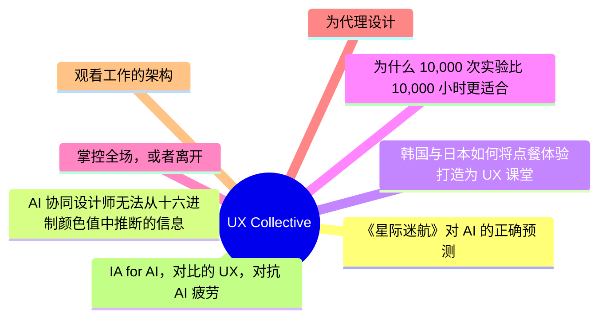
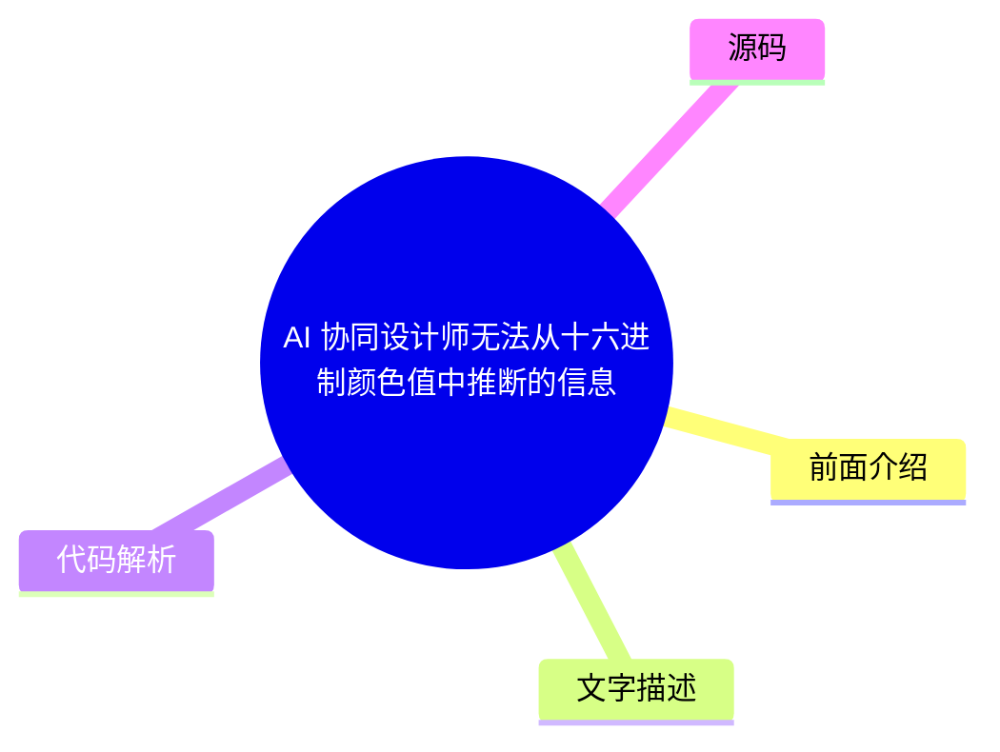
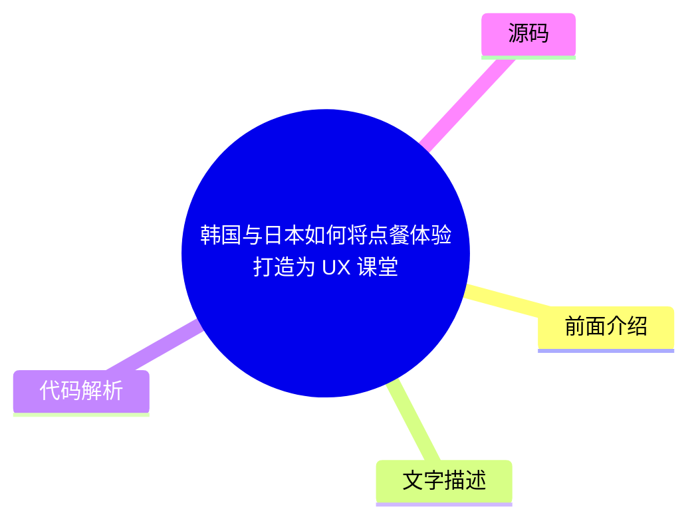
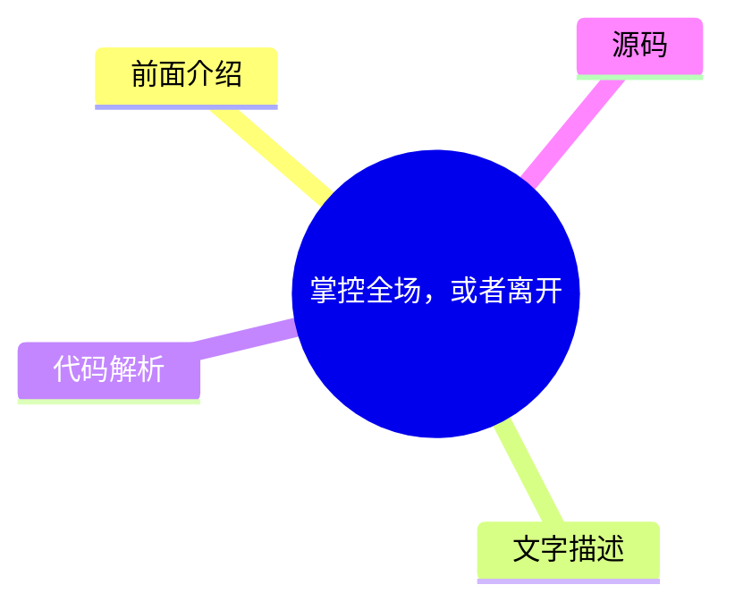
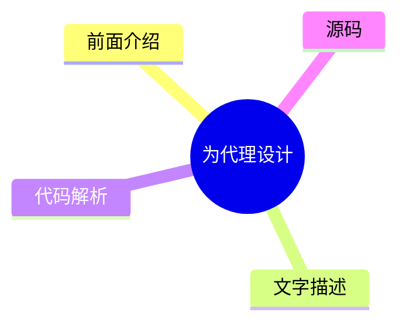
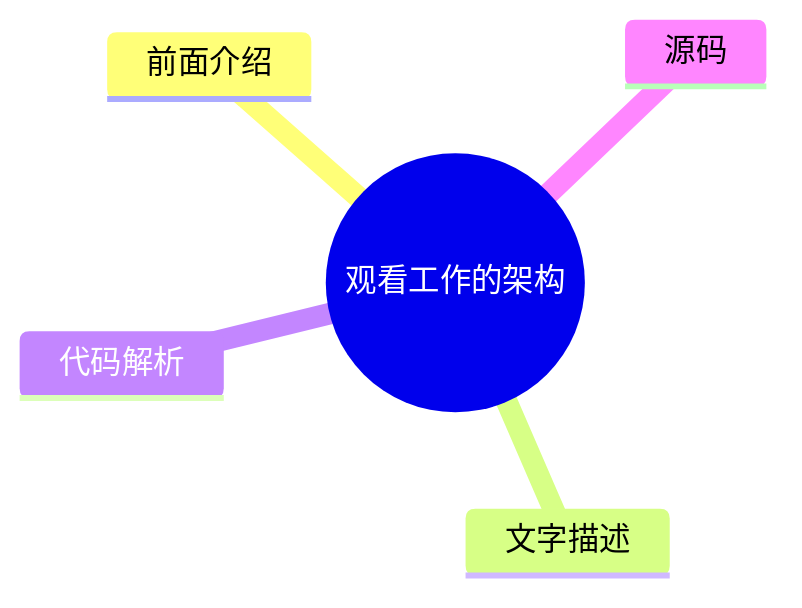

# ✏️ UX Collective Top 8 (2026-08-05)

## 前面介绍

- 数据源：UX Collective
- 抓取日期：2026-08-05
- 条目数：8
- 含完整正文：0
- 含代码片段：0
- 组织方式：前面介绍 / 树状图 / 文字描述 / 代码解析 / 源码

## 思维导图

## 详细整理（8 条，0 条含全文，0 条含代码）

### 1. 《星际迷航》对 AI 的正确预测
- **链接**: [https://uxdesign.cc/what-star-trek-got-right-about-ai-a4fb09e0d6c6?source=rss----138adf9c44c---4](https://uxdesign.cc/what-star-trek-got-right-about-ai-a4fb09e0d6c6?source=rss----138adf9c44c---4)
- **作者**: Patrick Neeman
- **发布**: Tue, 04 Aug 2026 21:10:21 GMT

#### 前面介绍

- 探讨了科幻作品《星际迷航》中关于人工智能的设想与现实发展的对比。
- 分析了剧中 AI 角色如何与人类协作，而非单纯替代。

#### 树状图

#### 文字描述

- 文章回顾了《星际迷航》系列中关于人工智能的早期描绘。
- 讨论了剧中 AI（如 Data）所展现出的情感与意识，以及这种设定对现实 AI 发展的启示。
- 指出了科幻作品在预测技术趋势方面的独特视角，以及其对公众认知的影响。
- 对比了现实中的 AI 技术与科幻设定之间的差距与相似之处。

#### 代码解析

- 本文未提供源码，以下为实现思路或结构解析

#### 源码

未抓到可展示源码或原文节选。

### 2. AI 协同设计师无法从十六进制颜色值中推断的信息
- **链接**: [https://uxdesign.cc/what-your-ai-co-designer-cant-infer-from-your-hex-values-d2023364e80e?source=rss----138adf9c44c---4](https://uxdesign.cc/what-your-ai-co-designer-cant-infer-from-your-hex-values-d2023364e80e?source=rss----138adf9c44c---4)
- **作者**: Lisa Demchenko
- **发布**: Tue, 04 Aug 2026 21:09:48 GMT

#### 前面介绍

- 介绍了在启动新客户项目时创建的上下文文件。
- 旨在帮助 Claude 等工具最大化输出质量。

#### 树状图

#### 文字描述

- 作者分享了为了优化 AI 输出而设计的上下文文件模板。
- 解释了为什么仅凭十六进制颜色值不足以传达完整的设计意图。
- 讨论了如何通过上下文文件向 AI 传递设计师的隐性知识和偏好。
- 强调了在 AI 辅助设计过程中，提供充分背景信息的重要性。

#### 代码解析

- 本文未提供源码，以下为实现思路或结构解析

#### 源码

未抓到可展示源码或原文节选。

### 3. 韩国与日本如何将点餐体验打造为 UX 课堂
- **链接**: [https://uxdesign.cc/how-korea-and-japan-turned-ordering-food-into-a-ux-masterclass-f64c31bd4c98?source=rss----138adf9c44c---4](https://uxdesign.cc/how-korea-and-japan-turned-ordering-food-into-a-ux-masterclass-f64c31bd4c98?source=rss----138adf9c44c---4)
- **作者**: Kristina Volchek
- **发布**: Tue, 04 Aug 2026 09:25:56 GMT

#### 前面介绍

- 研究了亚洲自助点餐机和平板电脑的交互设计。
- 分析了当地文化如何影响点餐系统的用户体验。

#### 树状图

#### 文字描述

- 文章深入探讨了韩国和日本在自助点餐终端上的设计创新。
- 分析了这些系统如何通过本地化的语言和界面设计来提升用户体验。
- 研究了在快节奏的餐饮环境中，如何平衡效率与用户满意度。
- 对比了不同地区的点餐 UX 设计策略及其背后的文化逻辑。

#### 代码解析

- 本文未提供源码，以下为实现思路或结构解析

#### 源码

未抓到可展示源码或原文节选。

### 4. 为什么 10,000 次实验比 10,000 小时更适合设计师
- **链接**: [https://uxdesign.cc/why-10-000-experiments-work-better-than-10-000-hours-for-designers-1a07aa35df7f?source=rss----138adf9c44c---4](https://uxdesign.cc/why-10-000-experiments-work-better-than-10-000-hours-for-designers-1a07aa35df7f?source=rss----138adf9c44c---4)
- **作者**: Kai Wong
- **发布**: Tue, 04 Aug 2026 07:34:49 GMT

#### 前面介绍

- Airbnb 放弃了二十年的优化策略以实现增长。
- 设计师可能也需要这种基于实验的方法。

#### 树状图

#### 文字描述

- 文章以 Airbnb 的案例为例，讨论了从长期优化转向快速实验的重要性。
- 解释了为什么在不确定的环境中，频繁的 A/B 测试比单纯的积累经验更有效。
- 分析了设计师如何通过快速迭代和实验来验证假设。
- 探讨了在产品设计中，如何平衡数据驱动与直觉判断。

#### 代码解析

- 本文未提供源码，以下为实现思路或结构解析

#### 源码

未抓到可展示源码或原文节选。

### 5. 掌控全场，或者离开
- **链接**: [https://uxdesign.cc/own-the-room-or-leave-it-39436e89a256?source=rss----138adf9c44c---4](https://uxdesign.cc/own-the-room-or-leave-it-39436e89a256?source=rss----138adf9c44c---4)
- **作者**: Jessa Parette
- **发布**: Tue, 04 Aug 2026 07:33:45 GMT

#### 前面介绍

- 探讨了在会议或演示中如何通过肢体语言和气场影响听众。
- 强调了自信表达对于设计提案的重要性。

#### 树状图

#### 文字描述

- 文章讨论了设计师在展示作品时，如何通过非语言沟通来增强说服力。
- 分析了“掌控全场”的心理机制及其在专业场合的应用。
- 探讨了在面对质疑时，如何保持专业自信并引导对话方向。
- 强调了个人气场与设计作品质量同样重要。

#### 代码解析

- 本文未提供源码，以下为实现思路或结构解析

#### 源码

未抓到可展示源码或原文节选。

### 6. 为代理设计
- **链接**: [https://uxdesign.cc/designing-for-the-proxy-2606ffac2335?source=rss----138adf9c44c---4](https://uxdesign.cc/designing-for-the-proxy-2606ffac2335?source=rss----138adf9c44c---4)
- **作者**: Aurélie Radom
- **发布**: Sun, 02 Aug 2026 14:12:49 GMT

#### 前面介绍

- 探讨了在 AI 时代，如何为“代理”而非用户设计界面。
- 分析了代理在处理复杂任务时的交互逻辑。

#### 树状图

#### 文字描述

- 文章提出了一个新的设计视角，即设计对象是 AI 代理而非最终用户。
- 讨论了代理如何理解上下文、做出决策并执行任务。
- 分析了代理与人类之间的协作模式，以及如何优化这种协作流程。
- 探讨了代理设计带来的伦理和隐私考量。

#### 代码解析

- 本文未提供源码，以下为实现思路或结构解析

#### 源码

未抓到可展示源码或原文节选。

### 7. 观看工作的架构
- **链接**: [https://uxdesign.cc/the-architecture-of-watching-work-dcc521fcad1c?source=rss----138adf9c44c---4](https://uxdesign.cc/the-architecture-of-watching-work-dcc521fcad1c?source=rss----138adf9c44c---4)
- **作者**: Takuma Kakehi
- **发布**: Sun, 02 Aug 2026 10:27:44 GMT

#### 前面介绍

- 回顾了一个世纪以来围绕“如何看见工作”设计的办公室布局。
- 指出 AI 正在悄然改变这一设计问题。

#### 树状图

#### 文字描述

- 文章回顾了现代办公室设计的历史演变，特别是关于视线和监控的设计。
- 探讨了随着 AI 技术的发展，工作场所的物理形态和监控方式正在发生根本性变化。
- 分析了 AI 如何改变我们对“工作”和“监督”的定义。
- 讨论了未来办公室设计将如何适应人机协作的新模式。

#### 代码解析

- 本文未提供源码，以下为实现思路或结构解析

#### 源码

未抓到可展示源码或原文节选。

### 8. IA for AI，对比的 UX，对抗 AI 疲劳
- **链接**: [https://uxdesign.cc/ia-for-ai-the-ux-of-contrast-battling-ai-fatigue-4f623495bed8?source=rss----138adf9c44c---4](https://uxdesign.cc/ia-for-ai-the-ux-of-contrast-battling-ai-fatigue-4f623495bed8?source=rss----138adf9c44c---4)
- **作者**: Fabricio Teixeira
- **发布**: Mon, 03 Aug 2026 09:47:06 GMT

#### 前面介绍

- 探讨了信息架构（IA）在 AI 时代的应用。
- 分析了如何通过设计对比来提升用户体验。
- 讨论了如何应对 AI 带来的认知疲劳问题。

#### 树状图

#### 文字描述

- 文章讨论了信息架构在 AI 系统设计中的关键作用。
- 分析了如何通过界面设计中的对比度来引导用户注意力。
- 探讨了在 AI 内容泛滥的时代，如何设计以减少用户的认知负担。
- 提出了应对 AI 疲劳的设计策略，如简化界面和提供清晰的反馈。

#### 代码解析

- 本文未提供源码，以下为实现思路或结构解析

#### 源码

未抓到可展示源码或原文节选。

