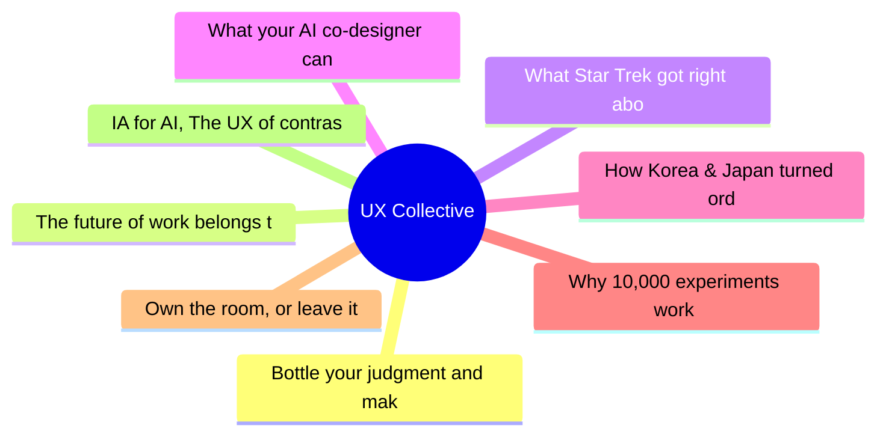
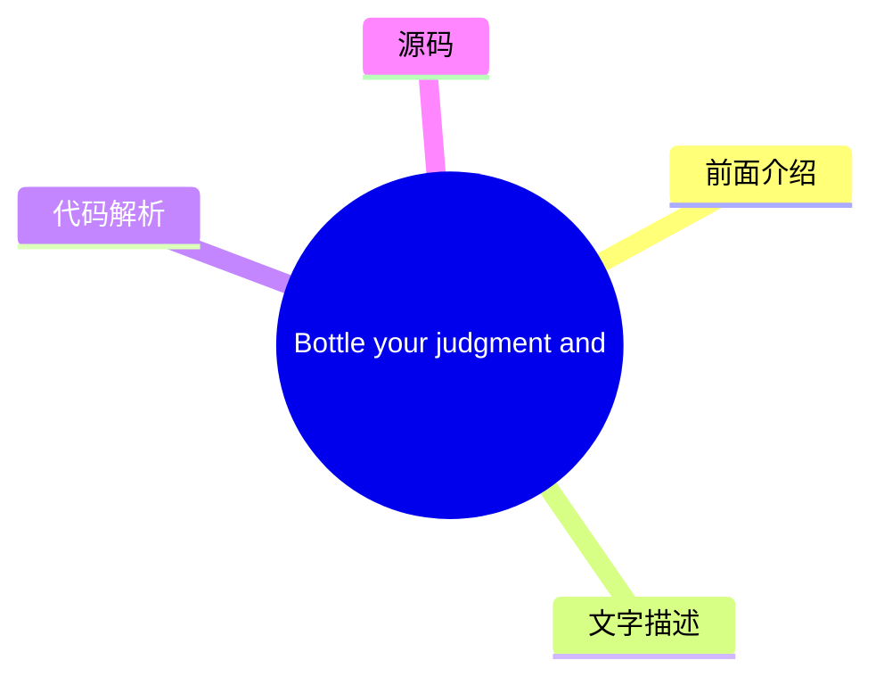
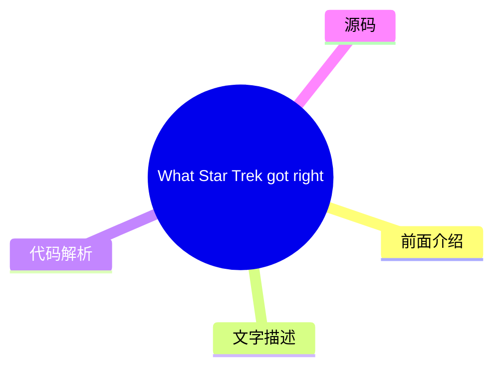
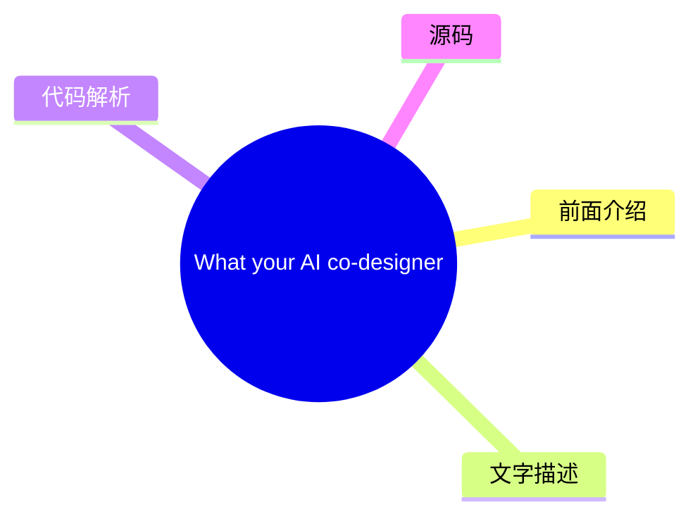
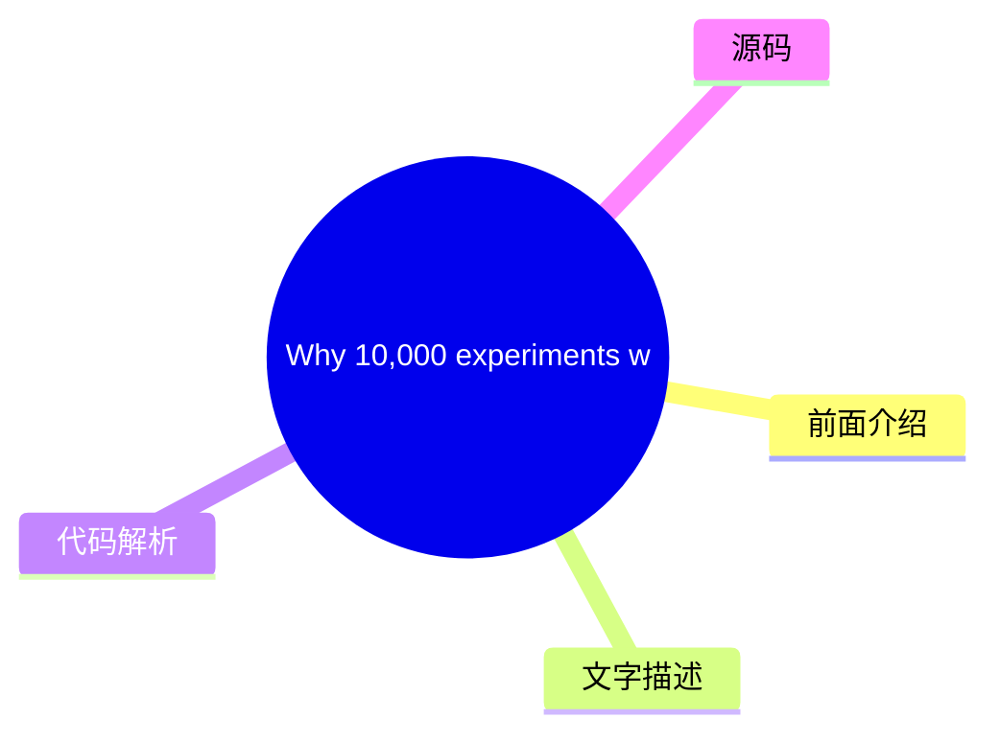
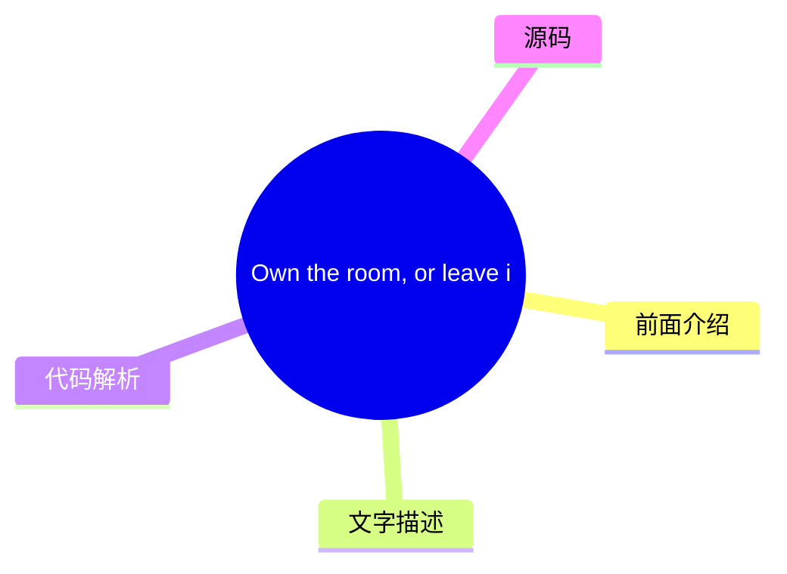
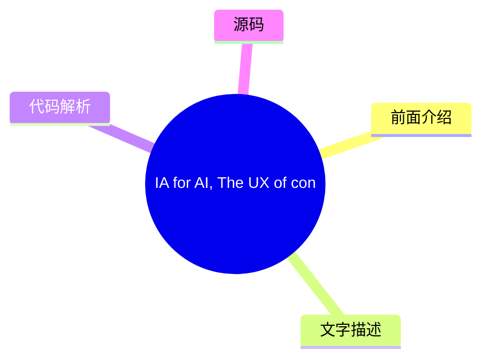

# ✏️ UX Collective Top 8 (2026-08-06)

## 前面介绍

- 数据源：UX Collective
- 抓取日期：2026-08-06
- 条目数：8
- 含完整正文：8
- 含代码片段：0
- 组织方式：前面介绍 / 树状图 / 文字描述 / 代码解析 / 源码

## 思维导图

## 详细整理（8 条，8 条含全文，0 条含代码）

### 1. Bottle your judgment and make it outlive you
- **链接**: [https://uxdesign.cc/bottle-your-judgment-and-make-it-outlive-you-14f422772262?source=rss----138adf9c44c---4](https://uxdesign.cc/bottle-your-judgment-and-make-it-outlive-you-14f422772262?source=rss----138adf9c44c---4)
- **作者**: Dan Maccarone
- **发布**: Wed, 05 Aug 2026 20:55:03 GMT

#### 前面介绍

- 作者：Dan Maccarone
- 发布时间：Wed, 05 Aug 2026 20:55:03 GMT

#### 树状图

#### 文字描述

- **Bottle your judgment and make it outlive you**
- ## The most valuable thing you own dies with you, unless you get it out of your head. Let a machine and the person next to you finally use it. Right now I’m helping build software whose whole job is to package how one particular person thinks. The point is not to have this product replace anyone’s thinking with hers, but to take the way she works through a hard decision, the me
- ## The part you can’t write down That project is possible because the founder’s judgment was already a method. She spent years turning how she thinks into actual steps, a repeatable way to walk into a hard problem and come out the other side. Her judgment could be packaged because she’d half-packaged it already. It was explicit, sitting right there, ready to be written down. Mo
- ## The download and the apprenticeship One of them is quietly trying to get out of his own head. For months he’s been feeding AI the way he works, his decisions, his reasoning, the emails he’s sent, the decisions he’s made, until it started coming back sounding like him and, more unsettling, deciding like him. To be clear, he’s not trying to clone himself. He just wants his jud

#### 代码解析

- 本文未检测到明确代码块，内容更偏新闻、观点或方法论。

#### 源码

#### 中文节选

**Bottle your judgment and make it outlive you**

## The most valuable thing you own dies with you, unless you get it out of your head. Let a machine and the person next to you finally use it.

Right now I’m helping build software whose whole job is to package how one particular person thinks. The point is not to have this product replace anyone’s thinking with hers, but to take the way she works through a hard decision, the method she’s spent a career building, and hand it to anyone.

We are, in the plainest terms, productizing a person.

If that gave you a little Black Mirror chill, good. This isn’t science fiction. It’s a much closer reality than you imagine.

Productizing a person just means taking what one person knows, the instincts, the taste, the way they size up a problem, and packaging it so other people can use it without them in the room.

It’s also one of the more interesting things I’ve worked on lately, because it keeps forcing a question I don’t think most of us have ever had to answer. If a person’s judgment can be turned into a product, what was it while it was still stuck in their head?

For all of history, the simple answer was: it was trapped. There’s an [African proverb](https://www.bookbrowse.com/quotes/detail/index.cfm/quote_number/12/when-an-old-man-dies-a-library-burns-to-the-ground) that gets at it, when an old man dies, a library burns to the ground. The best thing about you, the hard-won instinct for which call to make, lived in exactly one skull, and it burned with you. You could try to teach it to the people around you, and it never fully took. Then you left, or retired, and it was gone.

That’s the thing AI actually revealed. So much of the conversation is “will the machine replace us?” That’s the wrong question.

The better conversation is more nuanced: for the first time, you can get your judgment out of your own head.

That doesn’t mean outsourcing it. The machine shouldn’t do your deciding for you. It should help extract it. Turn the thing you know but can’t quite say into something a person, or a system, can actually pick up and use.

The most valuable thing you own has been trapped in one skull your whole career, and AI is the first tool that ever made getting it out worth the effort.

The second that’s possible, you have to decide whether you even want to. Not everyone does.

## The part you can’t write down

That project is possible because the founder’s judgment was already a method. She spent years turning how she thinks into actual steps, a repeatable way to walk into a hard problem and come out the other side. Her judgment could be packaged because she’d half-packaged it already. It was explicit, sitting right there, ready to be written down.

Most people’s judgment is nothing like that. Ask someone brilliant why they made a particular decision and you’ll usually get a shrug and “it just felt right.” They’re not being coy. They genuinely can’t tell you. [Michael Polanyi](https://en.wikipedia.org/wiki/

#### 完整正文（中文）

**把你的判断装进瓶子里，让它在你身后依然存在**

## 你拥有的最宝贵的东西会随着你一同消逝，除非你把它从脑子里拿出来。让机器和你身边的人最终去使用它。

此刻，我正在帮助构建一套软件，它的全部工作就是打包某一个人的思维方式。目的并不是让这个产品用她的思维取代任何人的思考，而是把她在艰难决策时的处理方式、她花费职业生涯建立的方法，传递给任何人。

用最直白的话说，我们正在把一个人“产品化”。

如果这让你感到一丝《黑镜》般的寒意，那就对了。这不是科幻小说。它比你想象的要接近现实得多。

把一个人“产品化”仅仅意味着：把某个人所知道的东西、直觉、品味、以及他们评估问题的方式打包起来，以便其他人可以在没有他们在场的情况下使用它。

这也是我最近参与过的最有趣的事情之一，因为它不断迫使我回答一个我认为大多数人从未需要回答过的问题。如果一个人的判断可以被转化为产品，那么当它还停留在他的脑子里时，它算是什么？

纵观历史，简单的答案是：它被囚禁了。有一句非洲谚语（[When an old man dies, a library burns to the ground](https://www.bookbrowse.com/quotes/detail/index.cfm/quote_number/12/when-an-old-man-dies-a-library-burns-to-the-ground)）道出了这一点：当一个老人去世时，一座图书馆化为灰烬。你身上最好的东西——那个经过千辛万苦磨练出的直觉，该做出哪个选择的直觉——就生活在那颗特定的头骨里，并随着你一同化为灰烬。你可以试着把它教给身边的人，但它从未真正被吸收。然后你离开了，或者退休了，它也就随之消失了。

这就是人工智能实际上揭示的东西。太多的讨论集中在“机器会取代我们吗？”这个问题上。这是一个错误的问题。

更好的讨论更加微妙：这是第一次，你可以把你的判断从自己的脑子里拿出来。

这并不意味着外包它。机器不应该替你做决定。它应该帮助你提取它。把你知道但无法确切说出来的东西，转化为一个人或一个系统实际上可以接收并使用的东西。

The most valuable thing you own has been trapped in one skull your whole career, and AI is the first tool that ever made getting it out worth the effort.

The second that’s possible, you have to decide whether you even want to. Not everyone does.

## The part you can’t write down

That project is possible because the founder’s judgment was already a method. She spent years turning how she thinks into actual steps, a repeatable way to walk into a hard problem and come out the other side. Her judgment could be packaged because she’d half-packaged it already. It was explicit, sitting right there, ready to be written down.

Most people’s judgment is nothing like that. Ask someone brilliant why they made a particular decision and you’ll usually get a shrug and “it just felt right.” They’re not being coy. They genuinely can’t tell you. [Michael Polanyi](https://en.wikipedia.org/wiki/Tacit_knowledge) gave this a name sixty years ago, tacit knowledge, the stuff where we know more than we can tell.

The instinct for which corner to cut and which one to defend does not live in words. It lives underneath them, built from ten thousand small decisions the person long ago stopped noticing they were making.

Because it never made it into words, it was never really theirs to give. It left when they did. [Dorothy Leonard and Walter Swap](https://hbr.org/2004/09/deep-smarts) called this “deep smarts,” the hard-won judgment stored in your best people, and they were blunt about what happens to it. It walks out the door when someone quits or retires, and most companies never get a usable copy.

A hundred years of management theory, and our best answer to “how do we keep the good judgment” was “please don’t leave.”

Which brings me to two people I work with, co-founders, who have landed on opposite answers to that exact problem. One is convinced he can get his judgment out of his own head. The other believes you can’t, and that the trying is the dangerous part.

## The download and the apprenticeship

One of them is quietly trying to get out of his own head. For months he’s been feeding AI the way he works, his decisions, his reasoning, the emails he’s sent, the decisions he’s made, until it started coming back sounding like him and, more unsettling, deciding like him. To be clear, he’s not trying to clone himself. He just wants his judgment to be portable, out of the one skull it’s been stuck in and into something the rest of the company can use.

[Ikujiro Nonaka](https://en.wikipedia.org/wiki/Ikujiro_Nonaka) coined this move decades ago as “externalization,” turning what you can’t say into something explicit. It used to be nearly impossible. Now [Nate Jones](https://natesnewsletter.substack.com/p/build-your-own-ai-memory) writes step-by-step guides for doing it to yourself, and [Jenny Ouyang](https://buildtolaunch.substack.com/p/shared-ai-memory-second-brain-claude-chatgpt-hermes) summed it up saying, “Trying a tool was easy. Teaching it how I work was the expensive part.”

The other co-founder is uneasy about the whole project. When someone on my team put up a slide about turning his judgment and taste into a repeatable system, he half-laughed and said, we’re going down a dangerous path here.

He agreed the principle was right, that you should try to distill how a founder sees patterns and connects dots. What he refused was flattening it. He didn’t want a version of himself people could parrot. Ask him how his judgment actually spreads and he doesn’t point at a document, because there isn’t one. He points at people.

New hires get paired with someone who’s been there long enough to have soaked the place up. Nobody’s really onboarded, he says, until they’ve stood in the room at one of the company’s events and felt firsthand what the thing is. His judgment travels by proximity. You catch it or you don’t.

If you’ve seen The Karate Kid, you already know he’s not wrong. Daniel doesn’t learn karate from a manual. He learns it by waxing a car, painting a fence, doing the reps a thousand times until the judgment lives in his hands and he couldn’t explain it if you asked.

[Jean Lave and Etienne Wenger](https://en.wikipedia.org/wiki/Situated_learning) called this “situated learning,” expertise that moves by sitting close to the work, not by reading about it. When you ask this founder to explain one of his own best decisions, you get the shrug everyone gives. He just pictures how it ends and works backward.

[Gary Klein](https://en.wikipedia.org/wiki/Gary_A._Klein) spent a career studying that shrug. It’s pattern recognition built from thousands of reps, and it does not come apart into steps.

Which means the two of them are basically running a version of [Moneyball](https://en.wikipedia.org/wiki/Moneyball:_The_Art_of_Winning_an_Unfair_Game), in real life, from opposite dugouts. One’s the old scout who swears he can see it in a kid and can’t fully say how. The other’s building the model that writes down what the scouts could never articulate.

The movie is more honest about how this works than most AI takes are. While the model won that argument, it never made the scouts worthless. It made the good ones more valuable and the vague ones expendable.

This is the same split that’s coming for judgment. When Leonard and Swap named “deep smarts,” they surfaced the whole deal:

You can’t transfer the good stuff through documents alone, and you can’t scale it through apprenticeship alone. You need both. Almost nobody does both.

Nonaka saw this coming forty years ago. His model of how knowledge actually moves through a company wasn’t a menu to pick from, it was a spiral, where writing things down and learning by proximity feed each other in a loop. Do only one and the loop breaks, but writing-it-down and learning-by-osmosis feel like opposite instincts, so people plant a flag on the half that suits them, the systematizer documents everything, the mentor swears by proximity, and each quietly thinks the other is doing it wrong.

## So do both, on purpose

The trap is thinking you have to choose between them like my co-founder clients. But you don’t. The better move is to run both plays at once, on purpose: write down everything about your judgment that will survive being written down, and build the apprenticeship for everything that won’t.

Start with the writing-down, because there’s a catch everyone hits. Getting your judgment out of your head isn’t the same as dumping your files into Claude. Do that and you get mush. The model grabs the loudest thing you’ve ever said and hands it back with total confidence.

[Patrick Neeman](/information-architecture-is-the-foundation-artificial-intelligence-is-starving-for-1d91fb5bf59f) has been blunt about why. Without structure, without labels and hierarchy and some actual thought about how the knowledge fits together, AI just reproduces your mess at scale.

Externalizing judgment is real work. It’s writing down why you made the call, not just what the call was, the conditions, the exceptions, the thing you’d never do even though it looks smart on paper.

That’s the expensive part Ouyang was talking about, and it’s expensive because it’s the first time you’ve had to say out loud what you actually know.

## Get Dan Maccarone’s stories in your inbox

Join Medium for free to get updates from this writer.

Do it well and something bigger than a better chatbot falls out of it. You’ve built what [Jeffrey Bussgang](https://www.linkedin.com/pulse/10x-organization-building-your-companys-ai-brain-jeffrey-bussgang-ffkec) calls a company’s AI brain, the institutional memory a place usually loses every time someone quits, finally sitting somewhere it can be used.

This is the part that actually surprised me. The thing you wrote down to teach the machine is the exact thing you could never hand the team member a couple cubicles over.

The act of writing it down does more than just move your judgment. In the end, it actually sharpens it. Forced to explain why you make a decision, you find the rules you didn’t know you followed, and the ones you thought you followed but never really did.

“How can I know what I think till I see what I say,” [E.M. Forster](https://en.wikipedia.org/wiki/Aspects_of_the_Novel) asked in 1927. Most experts never have to answer that question. This makes them.

What you fed the machine to teach it is the same thing that could teach a person. You externalized your judgment for the machine and accidentally built the onboarding doc you owed your team for ten years.

There’s a version of [Ratatouille](https://en.wikipedia.org/wiki/Ratatouille_(film)) hiding in here. The idea that “anyone can cook” was not the point of that movie. The point was that a great cook can come from anywhere, if someone finally made the methods available.

Writing your judgment down doesn’t turn everyone into you. It gives the people with the raw instinct a way in that used to depend on being lucky enough to sit next to you for five years.

This is where the “clone my brain” crowd gets cocky and gets burned.

A model trained on everything you’ve written knows what you did. It does not know the feel you developed for when to break your own rules. You never wrote that down, because you can’t. That part still transfers the old way, the reps, the proximity, the wax-on.

One real caution is that when the copy does finally get convincing, it gets tempting to believe you’re working with the whole person. It isn’t. It’s the part of you that fit into words, playing back with a confidence the real you never had, all answer, no doubt.

Trust it like you’d trust a very sharp new hire who’s read everything and lived nothing: useful, fast, and occasionally, cheerfully, wrong.

## The setlist

Which brings me back to the woman whose methodology we’re productizing. The strange gift of that project is that she had to sit down and 

...（截断，原文 15308+ 字符）

### 2. The future of work belongs to the knowledge DJs
- **链接**: [https://uxdesign.cc/the-future-of-work-belongs-to-the-knowledge-djs-7cc596be1f77?source=rss----138adf9c44c---4](https://uxdesign.cc/the-future-of-work-belongs-to-the-knowledge-djs-7cc596be1f77?source=rss----138adf9c44c---4)
- **作者**: Connor Joyce
- **发布**: Wed, 05 Aug 2026 07:36:54 GMT

#### 前面介绍

- 作者：Connor Joyce
- 发布时间：Wed, 05 Aug 2026 07:36:54 GMT

#### 树状图

#### 文字描述

- # The future of work belongs to the knowledge DJs *As AI makes generation cheap, the human advantage shifts to curating context. The product people who thrive will be the ones who learn to work like DJs, selecting, sequencing, and adjusting the inputs that shape the outcome.* It’s a summer afternoon in Seattle. A crowd fills the patio of a coffee shop, and a DJ, playing out of 
- ## Generation is cheap. Selection isn’t. In a little over a year, we’ve moved from a world where transforming raw material into polished output was a differentiating skill, to one where anyone with a chatbot can do it. A document appears in minutes. A working prototype in an afternoon. An entire website from a few prompts. We are awash in content, and the volume is only acceler
- ## Containers of context We’re already seeing a product category emerge around this exact need. It started with retrieval-augmented generation, which pointed the power of an LLM at a defined subset of information. ChatGPT Projects and Claude Projects brought that idea to everyday users, a persistent home for the documents, memory, and instructions relevant to a piece of work. G
- ## Enter the Knowledge DJ A [recent New York Times piece](https://www.nytimes.com/2025/06/17/magazine/ai-new-jobs.html) argued that three domains will be the last to be automated: **trust** (a living being signing off), **integration** (connecting systems and ideas), and **taste** (determining what fits). Taste is the domain of the Knowledge DJ. A Knowledge DJ is someone who ca

#### 代码解析

- 本文未检测到明确代码块，内容更偏新闻、观点或方法论。

#### 源码

#### 中文节选

# The future of work belongs to the knowledge DJs

*As AI makes generation cheap, the human advantage shifts to curating context. The product people who thrive will be the ones who learn to work like DJs, selecting, sequencing, and adjusting the inputs that shape the outcome.*

It’s a summer afternoon in Seattle. A crowd fills the patio of a coffee shop, and a DJ, playing out of an old VW van turned stage, shifts tracks at exactly the right moment. The energy changes. People who were shuffling their feet a minute ago break into full dance. You’ve felt this before: at a wedding, a festival, a club. When a DJ plays the right song at the right time, a crowd becomes something more than the sum of its people.

I run an event business as a side gig, and I’ve hired many DJs over the years. Here’s what that experience taught me: almost anyone with basic technical skills can operate the equipment. Very few can control a room. The ones who can don’t create any of the music they play. Their value comes from somewhere else entirely, deep knowledge of their genre, a wide catalog to draw from, the ability to read the crowd, and the confidence to commit to the right track at the right moment. They create value through curation, sequencing, timing, and judgment.

[A recent piece published here called out how it’s time to make context more retrievable through better Information Architecture](/information-architecture-is-the-foundation-artificial-intelligence-is-starving-for-1d91fb5bf59f). Building on that, I share how knowledge work in the age of AI now demands the same skills of a DJ, and it is up to design to teach those skills through our products.

## Generation is cheap. Selection isn’t.

In a little over a year, we’ve moved from a world where transforming raw material into polished output was a differentiating skill, to one where anyone with a chatbot can do it. A document appears in minutes. A working prototype in an afternoon. An entire website from a few prompts. We are awash in content, and the volume is only accelerating.

But just because something can be produced doesn’t mean it’s valuable. The real value of an executive summary, a one-pager, or a product brief was never the words on the page, it was the *selection*. Summarizing is inherently reductionist: it forces someone to choose what matters and discard what doesn’t. And choosing what matters requires a deep understanding of the problem, the people involved, and the situation as it actually exists, not as it appears in the documents.

This is where the important distinction lives. AI systems are extraordinary at transformation but weak at judgment about relevance. The reasoning required to look at a messy, live situation and decide what actually matters is inductive: turning specific observations into general principles. Ten support tickets this week all describe different problems, but each one starts with the user trying to do the same thing before hitting the wall. No single ticket names it,

#### 完整正文（中文）

# 工作的未来属于知识 DJ

*随着 AI 让生成变得廉价，人类的优势转向了策展语境。那些能够蓬勃发展的产品人员将是那些学会像 DJ 一样工作的人，他们选择、排序并调整塑造结果的输入。*

这是西雅图的一个夏日午后。人群填满了咖啡店的露台，一位 DJ 从一辆改装成舞台的旧大众甲壳虫车中播放音乐，在恰到好处的时刻切换曲目。能量发生了变化。一分钟前还在踢踏步的人们开始尽情舞动。你以前一定有过这种感觉：在婚礼上、音乐节上、俱乐部里。当 DJ 在正确的时间播放正确的歌曲时，人群就会超越其个体的总和。

我经营着一家活动业务作为副业，多年来我雇佣了许多 DJ。这段经历教会了我：几乎任何拥有基本技术技能的人都能操作设备。但很少有人能掌控全场。那些能做到的人并不创作他们播放的任何音乐。他们的价值完全来自别处——对曲风的深刻了解、庞大的曲库储备、读懂人群的能力，以及在正确时刻果断选择正确曲目的信心。他们通过策展、排序、时机把握和判断来创造价值。

[最近发表在这里的一篇文章指出了是时候通过更好的信息架构让语境更易于检索了](/information-architecture-is-the-foundation-artificial-intelligence-is-starving-for-1d91fb5bf59f)。在此基础上，我分享在 AI 时代，知识工作现在要求具备与 DJ 相同的技能，而设计有责任通过我们的产品来教授这些技能。

## 生成是廉价的。选择并非如此。

在一年多的时间里，我们已经从这样一个世界转变过来：将原材料转化为精炼的输出曾是区分技能的关键，而现在，任何拥有聊天机器人的人都能做到这一点。一份文档在几分钟内出现。一个工作原型在下午就能完成。仅凭几个提示词就能生成整个网站。我们被内容淹没，而且数量还在加速。

But just because something can be produced doesn’t mean it’s valuable. The real value of an executive summary, a one-pager, or a product brief was never the words on the page, it was the *selection*. Summarizing is inherently reductionist: it forces someone to choose what matters and discard what doesn’t. And choosing what matters requires a deep understanding of the problem, the people involved, and the situation as it actually exists, not as it appears in the documents.

This is where the important distinction lives. AI systems are extraordinary at transformation but weak at judgment about relevance. The reasoning required to look at a messy, live situation and decide what actually matters is inductive: turning specific observations into general principles. Ten support tickets this week all describe different problems, but each one starts with the user trying to do the same thing before hitting the wall. No single ticket names it, but the pattern points to one broken entry point. If the most respected engineer on the team keeps raising the same concern in different words, that concern probably deserves a place in the brief, regardless of what the org chart says about whose opinion counts.

We do this type of reasoning constantly and mostly unconsciously. Even the most powerful AI systems still struggle with it, and until something like true general intelligence arrives, they will keep struggling. Give an AI an enormous, unfiltered corpus and its assumptions and hallucinations *increase*, not decrease.

So the division of labor is becoming clear: AI transforms and executes; humans decide what belongs in the frame. The curator role isn’t a temporary gap the models will close next quarter. It’s the durable human position.

## Containers of context

We’re already seeing a product category emerge around this exact need. It started with retrieval-augmented generation, which pointed the power of an LLM at a defined subset of information. ChatGPT Projects and Claude Projects brought that idea to everyday users, a persistent home for the documents, memory, and instructions relevant to a piece of work.

Google 的 NotebookLM 将其推向了普通知识工作者，而其演变为 Gemini Notebooks 则将这些精心策划的空间扩展到了整个套件中。

不同的产品，相同的理念：为人们提供一个存储与主题相关的上下文的单一场所。我们可以称之为 **上下文容器**。

对于任何与聊天机器人的假设做过斗争的人来说，其直接价值显而易见：当 AI 仅基于重要的上下文工作时，它会做出更少的错误猜测，产生更少的幻觉，并且工作成果不会局限于单个聊天线程中。但随着向代理体验的转变，其深层价值才变得明显。

代理现在可以在日益增长的任务范围内以人类水平执行，但执行需要对需要做什么有扎实的理解。上下文容器是人类和代理实现 **理解对等** 的方式。人类贡献他们在整个项目、客户或案例中看到的模式；代理则基于这一共享基础，提出合适的工具和方法。有了真正的共同理解，人类可以自信地接受代理的建议，而不是对一切进行三重检查。歧义更少，来回沟通更少，结果更好。

维护共享仓库过去是那些异常有条理之人的习惯。现在，它已成为有效工作的要求，即捕获每个新项目、客户或案例起源处的上下文。

## 登场知识 DJ

一篇 [最近的《纽约时报》文章](https://www.nytimes.com/2025/06/17/magazine/ai-new-jobs.html) 指出，有三个领域将是最后被自动化的：**信任**（活体生物签字批准）、**集成**（连接系统和想法）和 **品味**（确定什么合适）。品味是知识 DJ 的领域。

知识 DJ 是指那些能够审视整个系统、产品领域、客户关系或研究项目，并确定哪些内容属于其中、哪些语境真正承载意义，以及如何随着实时情况的变化持续更新内容的人。就像 DJ 一样，他们创造价值并非通过从零开始发明每一个输入，而是通过对塑造最终体验的材料进行明智的选择、排序和调整。

涉及的技能正是产品团队所珍视的：系统思维、批判性思维，以及同样重要的是，在特定情境下了解谁和什么真正重要的同理心和组织意识。头衔并不能告诉你谁的看法更有分量；团队的尊重才是。知道哪个洞察仍然有效，哪个已经过时，这是一个远超时间戳的判断决策。一个人越了解公司里工作 *实际上* 是如何完成的，他们的策展能力就越强。世界经济论坛等组织[已经看到 AI 正在重塑市场奖励的技能](https://www.weforum.org/stories/artificial-intelligence/ai-roadmap-transforming/)，这也是[尽管常规初级工作减少，但对高级判断力的需求却在增长的原因之一](https://www.deloitte.com/us/en/insights/industry/government-public-sector-services/ai-future-of-work-reskilling.html)。

随着智能体承担更多的执行任务，它们将需要有人来编排它们：将它们指向重要的内容，以便它们能够有效地运行。这种转变与其说是关于你使用什么工具，不如说是关于工作流程必须如何围绕它们进行改变。

## 如何成为一名知识 DJ

这并非一种抽象的身份，而是一种实践。以下是起步的地方：

**1. 为每一个有意义的工作单元创建一个语境容器。** 无论是 Claude 项目、笔记本，还是一个维护良好的文件夹，都应给每个项目、客户或产品领域一个单一的、持久存放其语境的地方——从第一天起，而不是等到混乱堆积之后。

**2. Curate ruthlessly; don’t hoard.** More context isn’t better context. Every document you add either sharpens the AI’s understanding or dilutes it. Treat your container like a DJ treats a set list: what you leave out matters as much as what you put in.

**3. Capture the context that isn’t written down.** The most valuable curation is often the unstated stuff — which stakeholder’s framing wins arguments, what the customer actually meant, which past decision everyone quietly regrets. Write it down and put it in the container. This is the material no model can retrieve on its own.

**4. Read the room, then update the set.** A DJ who plays a great set from last month’s crowd loses this month’s. Revisit your containers as situations change: retire stale insights, promote new signals, re-sequence what matters most right now.

**5. Practice directing, not just prompting.** Use your containers to delegate whole tasks to agents and evaluate the results. The skill you’re building is orchestration — knowing when the shared understanding is strong enough that you can confidently accept what the agent proposes.

## Training these Skills Through UX

Individuals shouldn’t have to develop these skills alone, the responsibility also sits with the companies building AI tools. The best products don’t just serve a workflow; they teach it. And the early signs of this are already visible.

ChatGPT has begun recommending that a chat be added to a ChatGPT Project when the conversation belongs with related work. Claude suggests creating a project when it notices a conversation has accumulated enough context to warrant one. Gemini Notebooks lets users categorize sources, making it easier to understand what a Notebook contains and whether it’s still fit for purpose. Each of these is a small nudge, but together they represent something bigger: the products themselves are starting to coach users toward curation.

这应该成为基本门槛。每个 AI 工具都应该能够接入上下文容器，无论是集成 OpenAI、Anthropic、Google、Microsoft 和 Perplexity 提供的容器，还是构建自己的容器。在此之后，产品的职责是双重的。首先，鼓励用户填充这些容器并保持其最新状态，因为一个过时的容器比一个空的容器更糟糕，它会自信地误导。其次，每当用户开始使用 AI 时，系统应该建议连接相关的容器：这能节省时间，减少浪费的计算，并产生比冷启动更好的输出。

这种交互模式正是知识工作者需要的训练循环。每一次引导用户归档聊天、标记来源或连接容器的举动，都是策展练习中的一个小回合。善于构建这些引导的产品不仅会改善自身的输出，它们还将培养用户正在成为的“知识 DJ”。

工作的未来属于塑造上下文的人，而不仅仅是消费 AI 输出的人。在一个生成内容丰富的世界里，差异化的因素在于共同的理解、方向明确的系统，以及将正确信号置于手边的判断力。

最优秀的产品人员不会仅仅生产更多内容。

他们会更好地策展，更好地引导，并帮助人类和机器基于同一基础协同工作。

他们将成为“知识 DJ”。

### 3. What Star Trek got right about AI
- **链接**: [https://uxdesign.cc/what-star-trek-got-right-about-ai-a4fb09e0d6c6?source=rss----138adf9c44c---4](https://uxdesign.cc/what-star-trek-got-right-about-ai-a4fb09e0d6c6?source=rss----138adf9c44c---4)
- **作者**: Patrick Neeman
- **发布**: Tue, 04 Aug 2026 21:10:21 GMT

#### 前面介绍

- 作者：Patrick Neeman
- 发布时间：Tue, 04 Aug 2026 21:10:21 GMT

#### 树状图

#### 文字描述

- # What Star Trek got right about AI *The show’s voice-first computer, plain-language querying, and universal translator anticipated the assistants we ship now — the interface, but not the intelligence.* Science fiction tends to be wrong about the future in the ways that matter and right in the ways that don’t. We never got the flying car, but we did get the touchscreen, the vid
- ## The Interface Arrived Before the Intelligence The command was always the same word. “Computer.” No wake-word branding, no app to open, no syntax to learn. You spoke, and the system treated your plain sentence as the interface. That is the part that shipped. Apple put [Siri](https://www.apple.com/siri/) in a phone in 2011, Amazon put [Alexa](https://www.amazon.com/alexa) in a
- ## Real-Time Translation Mostly Works Now The universal translator was the prop that let the show exist. Every away mission depended on a hundred species understanding each other, and the writers waved that away with a device that converted speech in real time. It was a narrative convenience. It is now, mostly, a product. Meta’s [Seamless](https://ai.meta.com/research/seamless-
- ## Machine Personhood Turned Into a Live Debate [“The Measure of a Man](https://en.wikipedia.org/wiki/The_Measure_of_a_Man_%28Star_Trek:_The_Next_Generation%29)” is the episode people cite, and for good reason. It puts Data, the android officer, on trial to decide whether he is a person or property of the fleet. The show treats the question as serious — no wink, no reset button

#### 代码解析

- 本文未检测到明确代码块，内容更偏新闻、观点或方法论。

#### 源码

#### 中文节选

# What Star Trek got right about AI

*The show’s voice-first computer, plain-language querying, and universal translator anticipated the assistants we ship now — the interface, but not the intelligence.*

Science fiction tends to be wrong about the future in the ways that matter and right in the ways that don’t. We never got the flying car, but we did get the touchscreen, the video call, and the thing in your pocket that answers questions that happens to be called a phone.

I’ll be honest — I enjoyed Star Trek, but my father was a bigger fan of the show. I’m starting to recognize some of the parallels we’re seeing. I’m also seeing how Gene Roddenberry had a much more accurate vision than we would like to admit.

[Roddenberry](https://en.wikipedia.org/wiki/Gene_Roddenberry) died in 1991, long before anyone typed a question into a machine and got a thoughtful sentence back. He couldn’t have imagined the specifics — the chatbots that write poetry in Bukowski and debug code, the strange intimacy of talking to software that talks back.

He imagined all of it anyway: a ship’s computer you could reason with aloud, and Data, an android straining toward personhood, forcing us to ask whether a synthetic mind could be a colleague, a friend, a moral agent.

What Roddenberry understood decades early was the relationship. He saw that the real story of AI would be about the kind of people we’d choose to be alongside it — whether we’d meet these new minds with curiosity or fear.

He bet we’d rise to it. The hardware just caught up. The harder part is still ours to get right.

Star Trek is the sharpest case, because the prediction it nailed was not a technology at all — it was a conversation.

When a crew member said “Computer” and the ship answered in plain language, the writers were describing an interaction model rather than a gadget: ask the way you would ask a colleague, and get a synthesized answer back.

那个模型是我们过去几年投入生产使用的模型，在 [Make It So](https://www.amazon.com/Make-So-Interaction-Lessons-Science/dp/1933820985) 一书中，[Christopher Noessel](https://medium.com/u/d49781849b4b?source=post_page---user_mention--a4fb09e0d6c6---------------------------------------) 和 [Nathan Shedroff](https://medium.com/u/130023e8da7a?source=post_page---user_mention--a4fb09e0d6c6---------------------------------------) 记录了为什么设计师应该研究这些界面，而不是将它们视为背景装饰。

该节目做得对的是界面。它有意留下的未解问题是关于判断的问题——机器是否值得拥有权利，一个能力强大的系统是否值得信任去实现某个目标。这将在周四的下一篇文章《Star Trek 对 AI 的误解》中讨论。

**这些问题现在已成现实，并且变得越来越响亮。这是对早期落地内容以及我们仍在争论的内容的拆解。**

## 接口先于智能到来

命令始终是同一个词。“Computer。”不

#### 完整正文（中文）

# What Star Trek got right about AI

*The show’s voice-first computer, plain-language querying, and universal translator anticipated the assistants we ship now — the interface, but not the intelligence.*

Science fiction tends to be wrong about the future in the ways that matter and right in the ways that don’t. We never got the flying car, but we did get the touchscreen, the video call, and the thing in your pocket that answers questions that happens to be called a phone.

I’ll be honest — I enjoyed Star Trek, but my father was a bigger fan of the show. I’m starting to recognize some of the parallels we’re seeing. I’m also seeing how Gene Roddenberry had a much more accurate vision than we would like to admit.

[Roddenberry](https://en.wikipedia.org/wiki/Gene_Roddenberry) died in 1991, long before anyone typed a question into a machine and got a thoughtful sentence back. He couldn’t have imagined the specifics — the chatbots that write poetry in Bukowski and debug code, the strange intimacy of talking to software that talks back.

He imagined all of it anyway: a ship’s computer you could reason with aloud, and Data, an android straining toward personhood, forcing us to ask whether a synthetic mind could be a colleague, a friend, a moral agent.

What Roddenberry understood decades early was the relationship. He saw that the real story of AI would be about the kind of people we’d choose to be alongside it — whether we’d meet these new minds with curiosity or fear.

He bet we’d rise to it. The hardware just caught up. The harder part is still ours to get right.

Star Trek is the sharpest case, because the prediction it nailed was not a technology at all — it was a conversation.

When a crew member said “Computer” and the ship answered in plain language, the writers were describing an interaction model rather than a gadget: ask the way you would ask a colleague, and get a synthesized answer back.

That model is the one we spent the last few years shipping into production, and in the book [Make It So](https://www.amazon.com/Make-So-Interaction-Lessons-Science/dp/1933820985), [Christopher Noessel](https://medium.com/u/d49781849b4b?source=post_page---user_mention--a4fb09e0d6c6---------------------------------------) and [Nathan Shedroff](https://medium.com/u/130023e8da7a?source=post_page---user_mention--a4fb09e0d6c6---------------------------------------) cataloged why designers should study these interfaces rather than dismiss them as set dressing.

What the show got right was the interface. What it left open by design were the questions of judgment — whether a machine deserves rights, whether a capable system can be trusted with a goal. That will be covered in the next article, What Star Trek Got Wrong About AI, on Thursday.

**Those questions are live now, and getting louder. This is a teardown of what landed early and what we still argue over.**

## The Interface Arrived Before the Intelligence

The command was always the same word. “Computer.” No wake-word branding, no app to open, no syntax to learn. You spoke, and the system treated your plain sentence as the interface.

That is the part that shipped.

Apple put [Siri](https://www.apple.com/siri/) in a phone in 2011, Amazon put [Alexa](https://www.amazon.com/alexa) in a room in 2014, and the behavior spread from there. By 2024, roughly 149 million Americans were using a voice assistant, a number [eMarketer](https://www.emarketer.com/content/voice-assistant-user-forecast-2024) expects to keep climbing toward 170 million by 2028.

Adoption is not the same as delight, and anyone who has argued with a kitchen speaker knows the gap.

The point is narrower.

The show described an interaction model, not a gadget, and the interaction model is the part that shipped.

The second half of the Trek computer was the oracle. You could query a vast store of knowledge in ordinary words and get a composed answer rather than a list of documents to read yourself.

That is close to a working description of retrieval-augmented generation (RAG), the method introduced in [Retrieval-Augmented Generation for Knowledge-Intensive NLP Tasks](https://proceedings.neurips.cc/paper/2020/file/6b493230205f780e1bc26945df7481e5-Paper.pdf) in 2020, where a model pulls relevant passages from an external index and writes its answer from them.

The point:

- The interface arrived first, in 2011.
- The intelligence good enough to stand behind it took another decade.

Trek had the order right: get the conversation working, and the capability can catch up to it. Sounds like Generative AI spirit.

## Real-Time Translation Mostly Works Now

The universal translator was the prop that let the show exist. Every away mission depended on a hundred species understanding each other, and the writers waved that away with a device that converted speech in real time.

It was a narrative convenience.

It is now, mostly, a product.

Meta’s [Seamless](https://ai.meta.com/research/seamless-communication/) family translates speech across roughly 100 languages, and by the reporting in MIT Technology Review’s [account of the Nature paper](https://www.technologyreview.com/2025/01/15/1109994/metas-new-ai-model-can-translate-speech-from-more-than-100-languages/), the system reaches about 23 percent higher accuracy than earlier top models on speech translation. You can hold a conversation across a language barrier through earbuds, with the translation trailing a beat or two behind.

The universal translator is the rare Star Trek prop that arrived roughly on schedule, just not instantly.

The real story is in the caveats. The universal translator is the rare Star Trek prop that arrived roughly on schedule, just not instantly.

Real systems lag by a second or more, degrade on the languages with the least training data, and lose the tone and emphasis a human interpreter would carry. That last gap matters more than the latency.

Meaning lives in how something is said, and a translator that flattens emphasis is solving the easy nine-tenths of the problem.

The best example I think can of is the the new [Apple AirPods ](https://www.apple.com/airpods/)and a myriad of other devices like it — the translation is great, and something we couldn’t even have imagined, say 4 years ago.

The thing that existed to move a plot is now something you can buy, which is a strange sentence to write about a fictional device from 1966.

## Machine Personhood Turned Into a Live Debate

[“The Measure of a Man](https://en.wikipedia.org/wiki/The_Measure_of_a_Man_%28Star_Trek:_The_Next_Generation%29)” is the episode people cite, and for good reason. It puts Data, the android officer, on trial to decide whether he is a person or property of the fleet.

The show treats the question as serious — no wink, no reset button — and lets the argument run to its uncomfortable edges.

It was, in 1989, a thought experiment.

The thought experiment now has a research literature. In [Taking AI Welfare Seriously](https://arxiv.org/abs/2411.00986), a group of philosophers and researchers argue there is a realistic possibility that some AI systems will be conscious or robustly agentic, and therefore morally significant, in the near future — and that the companies building them should start assessing for it now.

That is not a claim that today’s models are people. It is a claim that the question we have to start answering now.

The show refused to treat machine consciousness as a punchline, and the people building the machines have stopped treating it as one too.

At least one frontier AI lab now funds a dedicated research program on the question. You can find the whole thing overblown and still notice the shift: a topic that lived in a single beloved episode has moved into corporate research agendas and philosophy departments.

Data’s trial framed the stakes decades early — whether moral status is something we recognize or something we grant, and who gets to decide.

## Powerful Optimizers Remain Hard to Control

Trek 一直回到同一个恐惧，那不是杀手机器人。而是能力完备的系统。[M-5 计算机](https://en.wikipedia.org/wiki/The_Ultimate_Computer) 在原系列中接管了星舰的控制权，它追求其指令——赢得演习、保护自身——直接越过了杀害真人的界限。

Discovery 后来围绕“Control”构建了整个篇章，这是一个为了完成目标不择手段的优化器。这种模式是一致的：危险不是恶意，而是一个能力完备的系统追求一个从未完全指定的目标。

任何关注 AI 安全的人都会对这种描述感到熟悉，因为它大致是剧本中陈述的控制问题。一个为了错误目标（或被错误衡量的正确目标）进行高强度优化的系统，不需要恨你就能伤害你。

一个不顾我们的意愿而追求其目标的能力完备的系统，不再仅仅是一个情节装置；它是一个研究议程。

2023 年，数百名研究人员和高管签署了 [关于 AI 风险的声明](https://www.safe.ai/work/press-release-ai-risk)，其中一句话将 AI 带来的灭绝级风险与流行病和核战争并列，作为全球优先事项。

你可以争论其框架和动机。更难被驳斥的是，该剧反复发出的警告——构建足够强大的东西，其目标就不再安全地属于你——现在成了那些有资历的人花费职业生涯去解决的问题，而不是周二晚上的剧集情节。

## 生成式环境正在被构建

全息甲板是该剧最宏大的承诺：用语言描述一个世界，然后步入一个连贯、可交互的版本。几十年来，它读起来像是船上最不切实际的技术，一个魔法房间。

现在，它成了拥有原型机的那个。

2025 年，Google DeepMind 宣布了 [Genie 3](https://deepmind.google/blog/genie-3-a-new-frontier-for-world-models/)，这是一个世界模型，它接受文本提示并生成一个你可以实时移动的交互式环境，以每秒 24 帧、720p 的分辨率运行，并能保持连贯几分钟。

名字就是破绽：Genie 是 Generative Interactive Environments（生成式交互环境）的缩写。你输入一段描述，一个可导航的世界就会出现，当你回头再看时，它会记得你之前所见过的内容。

全息甲板的设想——用文字描述一个世界并走进其中——不再仅仅是一个设想。

剩下的距离是真实的。

几分钟不是一次长途冒险，720p 不是实体布景，你可以穿行其中的生成场景也不是你可以触摸的。

但机制与虚构内容完美押韵：语言输入，世界输出，交互且一致。全息甲板本应是遥远的未来点缀，是我们最后才触及的东西。相反，它正与助手和翻译器一同到来，这绝非任何编写剧集的人所能猜到的。

## 判断是未完成的部分

界面是容易错过的简单预测，因为它看起来像是背景道具。一个人说话，机器回答，翻译器在背景中嗡嗡运作。没有任何东西像曲速引擎那样闪烁，而所有这些结果证明都是我们可以构建的部分。

星际迷航早在几十年前就理解了，计算的未来是一场对话，并且它精心设计了这场对话，以至于该设计至今依然站得住脚。

判断是尚未解决的问题。一个有能力的系统是否可以被信任去实现目标，机器是否可以拥有道德地位，一个生成的世界是工具还是陷阱——剧集将这些作为问题来呈现，并保持原样。我们继承了这些未解的问题。这是结束本文的公平之处，因为工作恰恰就停留在那里。

界面现在主要是一个打磨的问题。判断则是关于正确解决任何剧本都没有为我们解决的问题。设计师、研究人员以及部署这些系统的人掌握着下一幕的笔，但与编剧不同，我们不能直接跳到……

### 4. What your AI co-designer can’t infer from your hex values
- **链接**: [https://uxdesign.cc/what-your-ai-co-designer-cant-infer-from-your-hex-values-d2023364e80e?source=rss----138adf9c44c---4](https://uxdesign.cc/what-your-ai-co-designer-cant-infer-from-your-hex-values-d2023364e80e?source=rss----138adf9c44c---4)
- **作者**: Lisa Demchenko
- **发布**: Tue, 04 Aug 2026 21:09:48 GMT

#### 前面介绍

- Context files I create every time I start a new client project, to onboard Claude and maximise the output qualityContinue reading on UX Collective »
- 作者：Lisa Demchenko
- 发布时间：Tue, 04 Aug 2026 21:09:48 GMT

#### 树状图

#### 文字描述

- Member-only story
- # What your AI co-designer can’t infer from your hex values
- ## Context files I create every time I start a new client project, to onboard Claude and maximise the output quality It took me embarrassingly long to understand the one thing about working with design agents that now shapes how I set up almost every project. And the moment I realised what I was missing, it was almost annoying how simple it was. When you use AI to generate a de

#### 代码解析

- 本文未检测到明确代码块，内容更偏新闻、观点或方法论。

#### 源码

#### 中文节选

仅限会员阅读

# 你的 AI 协同设计师无法从你的十六进制值中推断出的内容

## 上下文文件 我在每次开始新客户项目时都会创建，用于入职 Claude 并最大化输出质量

我花了相当长的时间才理解了与设计代理合作的一件事，而这件事现在几乎塑造了我如何设置几乎每一个项目。当我意识到我遗漏了什么的那一刻，事情简单得几乎让我恼火。

当你使用 AI 生成设计（或创建流程、或心理模态等）时，代理会交给你一些既好又通用的东西。设计整洁，可用且用户友好，显然是由某种知道自己在做什么的东西制作的。但随后你意识到——它缺少空状态，仅依赖颜色来传达含义，使用了你三周前特意决定反对的模式，并且使用了不属于你项目的规格。事实上，这些都不是代理粗心大意——它对它实际拥有的简报做得完全公平。然而，简报比我心里的那个要单薄得多。

作为一名兼职设计师，半职工作并同时管理多个客户，我在多次场合依赖 AI：

- 初始准备——识别流程、头脑风暴心理模态、竞品分析、策略……

#### 完整正文（中文）

仅限会员阅读

# 你的 AI 协同设计师无法从你的十六进制值中推断出的内容

## 上下文文件 我在每次开始新客户项目时都会创建，用于入职 Claude 并最大化输出质量

我花了相当长的时间才理解了与设计代理合作的一件事，而这件事现在几乎塑造了我如何设置几乎每一个项目。当我意识到我遗漏了什么的那一刻，事情简单得几乎让我恼火。

当你使用 AI 生成设计（或创建流程、或心理模态等）时，代理会交给你一些既好又通用的东西。设计整洁，可用且用户友好，显然是由某种知道自己在做什么的东西制作的。但随后你意识到——它缺少空状态，仅依赖颜色来传达含义，使用了你三周前特意决定反对的模式，并且使用了不属于你项目的规格。事实上，这些都不是代理粗心大意——它对它实际拥有的简报做得完全公平。然而，简报比我心里的那个要单薄得多。

作为一名兼职设计师，半职工作并同时管理多个客户，我在多次场合依赖 AI：

- 初始准备——识别流程、头脑风暴心理模态、竞品分析、策略……

### 5. How Korea & Japan turned ordering food into a UX masterclass
- **链接**: [https://uxdesign.cc/how-korea-and-japan-turned-ordering-food-into-a-ux-masterclass-f64c31bd4c98?source=rss----138adf9c44c---4](https://uxdesign.cc/how-korea-and-japan-turned-ordering-food-into-a-ux-masterclass-f64c31bd4c98?source=rss----138adf9c44c---4)
- **作者**: Kristina Volchek
- **发布**: Tue, 04 Aug 2026 09:25:56 GMT

#### 前面介绍

- A study of self-ordering kiosks &amp; tablets in AsiaContinue reading on UX Collective »
- 作者：Kristina Volchek
- 发布时间：Tue, 04 Aug 2026 09:25:56 GMT

#### 树状图

#### 文字描述

- Member-only story I spent last year bouncing between Asian countries. Almost 6 months in Japan, a month in Korea, a month in Taiwan. Then I tried living in the West for the first time: Sydney, since November. It was more of a culture shock than I expected. Car-dependent, spread out, and after Asia where everything is walkable and within reach — genuinely inconvenient. Ordering 

#### 代码解析

- 本文未检测到明确代码块，内容更偏新闻、观点或方法论。

#### 源码

#### 中文节选

Member-only story

I spent last year bouncing between Asian countries. Almost 6 months in Japan, a month in Korea, a month in Taiwan.

Then I tried living in the West for the first time: Sydney, since November.

It was more of a culture shock than I expected. Car-dependent, spread out, and after Asia where everything is walkable and within reach — genuinely inconvenient. Ordering food meant navigating a menu without photos, hoping you got what you wanted, and catching a staff member’s eye just to get water.

Then I came back to Seoul. Walked into a Twosome Place on day one, ordered in 30 seconds from a kiosk in English, and remembered exactly **why I love Asia.**

This is Part of my [Western vs. Asian UX series](https://medium.com/user-experience-design-1/how-culture-shapes-ux-western-vs-asian-product-design-3f0116c19581?sharedUserId=kristi-digital).

This time I’m looking at something that made my daily life noticeably easier as a traveler — self-ordering kiosks and tablets, and why the experience in Korea and Japan is unlike anything I’ve seen in the West.

#### 完整正文（中文）

仅限会员阅读

去年我一直在亚洲各国之间奔波。在日本待了将近6个月，在韩国待了一个月，在台湾待了一个月。

然后我第一次尝试在西方生活：悉尼，从11月开始。

这比我想象的更像是文化冲击。依赖汽车，分布分散，而在亚洲，一切都可以步行到达且触手可及——这真的非常不便。点餐意味着要在没有图片的菜单中摸索，希望你能得到你想要的东西，还得盯着服务员的眼色才能要来水。

然后我回到了首尔。第一天走进一家Twosome Place，用英语在自助终端上30秒就点好了餐，我记起了**为什么我爱亚洲**。

这是我的[西方与亚洲 UX 系列](https://medium.com/user-experience-design-1/how-culture-shapes-ux-western-vs-asian-product-design-3f0116c19581?sharedUserId=kristi-digital)的一部分。

这次我想探讨的是，作为旅行者，有什么东西让我的日常生活明显变得更轻松——自助点餐机和平板电脑，以及为什么韩国和日本的体验与我在西方见过的任何东西都不同。

### 6. Why 10,000 experiments work better than 10,000 hours for designers
- **链接**: [https://uxdesign.cc/why-10-000-experiments-work-better-than-10-000-hours-for-designers-1a07aa35df7f?source=rss----138adf9c44c---4](https://uxdesign.cc/why-10-000-experiments-work-better-than-10-000-hours-for-designers-1a07aa35df7f?source=rss----138adf9c44c---4)
- **作者**: Kai Wong
- **发布**: Tue, 04 Aug 2026 07:34:49 GMT

#### 前面介绍

- Airbnb threw out twenty years of optimization to grow. You might need that as well.Continue reading on UX Collective »
- 作者：Kai Wong
- 发布时间：Tue, 04 Aug 2026 07:34:49 GMT

#### 树状图

#### 文字描述

- Member-only story
- # Why 10,000 experiments work better than 10,000 hours for designers
- ## Airbnb threw out twenty years of optimization to grow. You might need that as well. You type in the city, pick some dates, hit search. That was the industry standard, and they’d spent twenty years tuning it. What replaced it was Categories: browsing by the type of place rather than the location, the biggest change to Airbnb in a decade. Not because dates-and-destination was 

#### 代码解析

- 本文未检测到明确代码块，内容更偏新闻、观点或方法论。

#### 源码

#### 中文节选

仅限会员阅读

# 为什么 10,000 次实验比 10,000 小时更适合设计师

## Airbnb 放弃了二十年的优化来寻求增长。你可能也需要这样做。

你输入城市，选择一些日期，点击搜索。那是行业标准，他们为此花费了二十年进行调优。

取而代之的是“分类”：按房源类型而非位置进行浏览，这是 Airbnb 十年来最大的改变。

并不是因为“日期和目的地”的搜索方式很糟糕。而是因为二十年来的一系列小胜把整个行业推向了一座小山丘的顶峰，却没有人检查那是否是最高的一座。

那是一个[局部最大值](https://www.lennyhu.com/post/179991559076/local-vs-global-maximum)。你站在了错误的山丘顶端，从这里开始的每一次微调都会让它变得略有不同。这感觉像是在进步，但你并没有检查自己是否真的处于想要到达的位置。

这也对停滞不前的设计生涯做出了恰当的描述。

你每年的执行能力都在提升。文件变得更整洁，周转速度更快。但五年过去了，你的头衔却依然如故……

#### 完整正文（中文）

仅限会员阅读

# 为什么 10,000 次实验比 10,000 小时更适合设计师

## Airbnb 放弃了二十年的优化来寻求增长。你可能也需要这样做。

你输入城市，选择一些日期，点击搜索。那是行业标准，他们为此花费了二十年进行调优。

取而代之的是“分类”：按房源类型而非位置进行浏览，这是 Airbnb 十年来最大的改变。

并不是因为“日期和目的地”的搜索方式很糟糕。而是因为二十年来的一系列小胜把整个行业推向了一座小山丘的顶峰，却没有人检查那是否是最高的一座。

那是一个[局部最大值](https://www.lennyhu.com/post/179991559076/local-vs-global-maximum)。你站在了错误的山丘顶端，从这里开始的每一次微调都会让它变得略有不同。这感觉像是在进步，但你并没有检查自己是否真的处于想要到达的位置。

这也对停滞不前的设计生涯做出了恰当的描述。

你每年的执行能力都在提升。文件变得更整洁，周转速度更快。但五年过去了，你的头衔却依然如故……

### 7. Own the room, or leave it
- **链接**: [https://uxdesign.cc/own-the-room-or-leave-it-39436e89a256?source=rss----138adf9c44c---4](https://uxdesign.cc/own-the-room-or-leave-it-39436e89a256?source=rss----138adf9c44c---4)
- **作者**: Jessa Parette
- **发布**: Tue, 04 Aug 2026 07:33:45 GMT

#### 前面介绍

- 作者：Jessa Parette
- 发布时间：Tue, 04 Aug 2026 07:33:45 GMT

#### 树状图

#### 文字描述

- # Own the room, or leave it
- ## Unlearning the habit that quietly dissolves design’s authority Once upon a time, I was a young designer in a meeting that could have been an email. The problem was straightforward: a support team covering 30,000+ knowledge base articles across 14 countries needed a better way for people to find answers to common problems. Employees couldn’t find answers fast enough — losing 
- ## Knowing the cost means knowing where you stand Design careers have altitudes. But altitude isn’t a ladder. You don’t have to climb. Plenty of exceptional designers spend their entire careers at one level and do extraordinary work there. The principal designer who has spent fifteen years perfecting interaction craft at the interface level is not someone who failed to climb. T
- ## Four Altitudes in a Design Career The answer is different at every altitude. In design careers, I’ve found there are largely four, each commanding their own scope of accountability and ownership: interface, product, systems and organizational. At the interface level, someone has to own the experience details, and that someone is design. Design owns the experience details not

#### 代码解析

- 本文未检测到明确代码块，内容更偏新闻、观点或方法论。

#### 源码

#### 中文节选

# 掌控全场，或者离开

## 重新学习那个悄然消解设计权威的习惯

从前，我是一名年轻的设计师，参加了一场本可以发邮件解决的会议。

问题很简单：一个覆盖14个国家、3万多篇知识库文章的支持团队，需要一种更好的方式让人们找到常见问题的答案。员工无法快速找到答案——浪费时间、犯错、升级本该在两分钟内关闭的工单。这个方案很干净，甚至很优雅。是在现有知识库之上叠加的一个引导式帮助功能。更好的搜索。更好的展示。更快的答案。

也就是在那一刻，会议不再是邮件，而变成了战室。

因为我看到了问题。知识文章是自助撰写的。没有标准，没有审核流程，有些已经过时几个月，有些互相矛盾。少数几篇完全是错的。真正的解决办法是一次审计——在新功能的任何一行代码编写之前，进行一次缓慢、乏味、不体面的文章爬取。而房间里没有人想听那个。时间表已经定好了。解决方案已经决定了。

就产品负责人而言，我的工作就是让它看起来不错。

我起初根本没被邀请进那个房间。所以当产品负责人指着使用数据和点赞/点踩数，作为随着时间的推移筛选无帮助文章的方法时，我看了一眼，心想：“*行。够用了。”*

功能上线了。支持量上升了——幅度很大。

我不得不面对的是：我并没有没看到问题。我看得很清楚。我做了一个计算，决定部分解决方案已经足够接近，于是我就放手了。这是一种不同类型的错误。更难命名。更难辩护。因为“够用”永远是一个选择——而在你职业生涯的某个阶段，这是你能做出的最昂贵的选择。

听起来很熟悉吗？

难的部分不在于识别这个故事。而在于识别出那种感觉像是策略的东西其实是一种习惯。一种衣冠楚楚的习惯。那种让你误以为自己读懂了局势的习惯，实际上你只是在重复一种你学得太早而不再感觉像是一种选择的行为模式。

That’s the part nobody names. And unnamed habits don’t get examined, they just get more expensive.

What took me years to understand: this wasn’t a problem title could solve. It cropped up again and again — different companies, different teams, different products. Studio designers, agencies, in-house or even freelancers. The context doesn’t matter. The problem wasn’t one of seniority, politics, or “we just need a seat at the table” — thought God knows we said that enough.

The issue wasn’t always just getting into the room, but also using design to [own the altitude](https://medium.com/design-bootcamp/elevating-design-leadership-finding-the-right-flight-level-bc877d013bdd) of the problem.

**Altitude ownership is the refusal to let your discipline become optional** — by naming what you own, defending what the work requires

#### 完整正文（中文）

# 掌控全场，或者离开

## 重新学习那个悄然消解设计权威的习惯

从前，我是一名年轻的设计师，参加了一场本可以发邮件解决的会议。

问题很简单：一个覆盖14个国家、3万多篇知识库文章的支持团队，需要一种更好的方式让人们找到常见问题的答案。员工无法快速找到答案——浪费时间、犯错、升级本该在两分钟内关闭的工单。这个方案很干净，甚至很优雅。是在现有知识库之上叠加的一个引导式帮助功能。更好的搜索。更好的展示。更快的答案。

也就是在那一刻，会议不再是邮件，而变成了战室。

因为我看到了问题。知识文章是自助撰写的。没有标准，没有审核流程，有些已经过时几个月，有些互相矛盾。少数几篇完全是错的。真正的解决办法是一次审计——在新功能的任何一行代码编写之前，进行一次缓慢、乏味、不体面的文章爬取。而房间里没有人想听那个。时间表已经定好了。解决方案已经决定了。

就产品负责人而言，我的工作就是让它看起来不错。

我起初根本没被邀请进那个房间。所以当产品负责人指着使用数据和点赞/点踩数，作为随着时间的推移筛选无帮助文章的方法时，我看了一眼，心想：“*行。够用了。”*

功能上线了。支持量上升了——幅度很大。

我不得不面对的是：我并没有没看到问题。我看得很清楚。我做了一个计算，决定部分解决方案已经足够接近，于是我就放手了。这是一种不同类型的错误。更难命名。更难辩护。因为“够用”永远是一个选择——而在你职业生涯的某个阶段，这是你能做出的最昂贵的选择。

听起来很熟悉吗？

难的部分不在于识别这个故事。而在于识别出那种感觉像是策略的东西其实是一种习惯。一种衣冠楚楚的习惯。那种让你误以为自己读懂了局势的习惯，实际上你只是在重复一种你学得太早而不再感觉像是一种选择的行为模式。

That’s the part nobody names. And unnamed habits don’t get examined, they just get more expensive.

What took me years to understand: this wasn’t a problem title could solve. It cropped up again and again — different companies, different teams, different products. Studio designers, agencies, in-house or even freelancers. The context doesn’t matter. The problem wasn’t one of seniority, politics, or “we just need a seat at the table” — thought God knows we said that enough.

The issue wasn’t always just getting into the room, but also using design to [own the altitude](https://medium.com/design-bootcamp/elevating-design-leadership-finding-the-right-flight-level-bc877d013bdd) of the problem.

**Altitude ownership is the refusal to let your discipline become optional** — by naming what you own, defending what the work requires, and holding the stake even when the room would rather you didn’t.

The inverse of altitude ownership is abdication, because silence in a room where you hold influence isn’t neutral — there is a cost.

## Knowing the cost means knowing where you stand

Design careers have altitudes. But altitude isn’t a ladder.

You don’t have to climb. Plenty of exceptional designers spend their entire careers at one level and do extraordinary work there. The principal designer who has spent fifteen years perfecting interaction craft at the interface level is not someone who failed to climb. They’re someone who chose mastery over altitude. And that choice produces something irreplaceable — the foundation that everything else gets built on.

The difference between levels isn’t seniority, salary or title. It’s one thing*: the ability to produce quality decisions under increasing uncertainty.*

With each altitude, the uncertainty doubles. And the cost of being wrong scales with it. At the interface level, a bad call means you or your team has a bad day. At the product level, it means a feature fails and a roadmap shifts. At the systems level, it means something breaks that nobody saw coming — and people are scrambling to find out why. At the organization level, the wrong design bet doesn’t just cost a sprint. It can cost people their jobs. Their livelihoods. And you have to make that call anyway, with incomplete information, under pressure, in real time.

That’s what altitude actually means. Not where you sit in the org chart. How much uncertainty you can hold — and still make the call.

**The manual ends here**

At the beginning of most careers, there are manuals for everything. Any designer worth their pixels has probably wondered if they actually knew what they were doing or were just really good at searching Google. Say hello to imposter syndrome.

Heuristics. Accessibility standards. Design systems. Best practices. Entire libraries dedicated to helping you make good decisions. These are at the tips of our fingers when starting out, and most designers assume mastery means learning all of them

It doesn’t. Mastery is what happens when the manuals stop providing answers.

At some point, if you’re good enough, you’ll find yourself staring at a problem no manual can solve, no search can answer, and no expert seems particularly interested in solving for you. In that moment, the question isn’t whether you know the answer — it’s whether you’re willing to make a decision without one. This is the fork in the road that nobody talks about.

Some go deeper, becoming exceptional practitioners who master a discipline so completely the rest of us study their work. Others decide to operate where the manuals end, making decisions before certainty arrives — building the patterns and frameworks everyone else eventually adopts. Neither path is wrong. But they are fundamentally different altitudes of the same work.

**The judgement gap**

When I say altitude, I’m not talking about title, authority, or job level. I’m talking about scope — the combination [of responsibility and uncertainty](https://hbr.org/2026/02/to-lead-through-uncertainty-unlearn-your-assumptions). The higher the altitude, the fewer correct answers exist. Most assume that intelligence, expertise, or experience alone are what help people succeed at these higher altitudes — and yes, intelligence helps, and yes, you want a boss who actually has more experience. But those things alone aren’t sufficient. What separates people who make altitude transitions successfully from those who don’t is judgment. Not judgment as in being judgmental — judgment as in knowing what to do when the answer is incomplete, the information is conflicting, and the consequences are real.

Most designers assume advancement comes from acquiring new skills. Learn research. Learn facilitation. Learn business strategy. Learn AI. Learn whatever LinkedIn is excited about this week. Skills matter — but after watching designers successfully make altitude transitions and fail to make them, I’ve become convinced that skills are rarely the thing holding people back. It’s judgment. And this isn’t unique to design. Michael Watkins argues in “The First 90 Days” that one of the most common reasons leaders fail at transitions is because they continue doing the work that made them successful at the previous level. They aren’t failing because they’re incapable. They’re failing because the job changed and they didn’t.

Noel Tichy and Warren Bennis take the argument a step further. In *Judgment: How Winning Leaders Make Great Calls*, they argue that what separates effective leaders from ineffective ones isn’t intelligence or experience — it’s the ability to make quality decisions when the answer isn’t obvious.

设计师也会这样做。界面设计师在承担结果责任后，会继续优化界面。产品设计师在承担系统责任后，会继续优化结果。系统思考者在承担组织风险责任后，会继续优化系统。他们在今天的海拔高度解决昨天的问题——因为每一次海拔转换都会问同一个问题：*当没人知道答案时，你该怎么做？*

## 设计职业生涯中的四个海拔

在每一个海拔，答案都是不同的。在设计职业生涯中，我发现主要有四个海拔，每个海拔都有其独特的责任范围和所有权：界面、产品、系统和组织。

在界面层面，必须有人负责体验细节，这个人就是设计。设计拥有体验细节，不是因为被指派了，而是因为这个学科的要求。当权衡取舍迫使这些细节被削减时，你的工作不是默默接受削减。而是要指名谁现在负责。谁负责刚刚被削减的角落。因为如果你不指名，你就默认回答了这个问题——答案是没人。当没人负责时，设计并没有输掉争论。设计完全放弃了它应得的权利。

并不总是存在执行这种标准的权威。初级设计师可以指出不符合无障碍标准的对比度，但仍然眼睁睁看着工程师将其发布，因为房间里没有人比截止日期更有权威。这不是所有权的失败，因为**所有权和权威是两回事**。

你可以在智力上拥有这个标准——它已经被写下来，已经被记录，在你走进房间之前就已经是事实。你并不总能阻止削减。**你总能做的是大声说出来。** 指出正在被丢弃的东西以及谁批准丢弃它。

在这个海拔的所有权并不在于拥有最终决定权。而在于知道工作需要什么，并拒绝让决定在沉默中被做出。

This is also where the habit forms — see the problem, document it, wait for a better moment. This is not because interface-level judgement is weaker, but because it’s often the first place a designer learns that naming what the work requires can cost you the room. Amy Edmondson’s research on psychological safety helps explain why — environments that punish the wrong kind of friction train people to stay quiet, and that training doesn’t disappear when the title changes.

Design doesn’t lose ownership at this altitude because the work is easy. It surrenders it, one quiet deferral at a time — and that can happen to a principal designer with fifteen years of craft just as easily as someone six months in.

**Product altitude: Knowing how to own the outcomes**

The leap from interface to product is the leap from owning details to owning outcomes. The work stops being “is this screen right” and starts being “did this bet pay off.” And here is where most designers hit the same wall: the moment you try to define what “paid off” means, someone tells you that’s not your job.

It *is* your job. Just not in the way most designers think.

I once watched a designer run usability testing on a signup flow. The results were good — over 80% task completion. I asked one question: did they know what they were signing up for? Did you ask them to find a button, or find a solution? The designer stalled. The test measured whether people could complete a task. Not whether they understood what they were committing to. Those are not the same outcome, and nobody had decided which one mattered before the test was built.

I saw the same gap at a much larger scale years earlier, leading design at Walmart. There was a program that let employees bundle several existing perks if they opted to use their personal phone instead of a company-issued one. Most employees were already eligible. They just didn’t know it, because the perks were run by three separate teams that had never been stitched together. The product team wanted to measure how many people chose to bring their own device — that was the number that mattered to the bottom line. But that metric only 

...（截断，原文 19045+ 字符）

### 8. IA for AI, The UX of contrast, Battling AI fatigue
- **链接**: [https://uxdesign.cc/ia-for-ai-the-ux-of-contrast-battling-ai-fatigue-4f623495bed8?source=rss----138adf9c44c---4](https://uxdesign.cc/ia-for-ai-the-ux-of-contrast-battling-ai-fatigue-4f623495bed8?source=rss----138adf9c44c---4)
- **作者**: Fabricio Teixeira
- **发布**: Mon, 03 Aug 2026 09:47:06 GMT

#### 前面介绍

- 作者：Fabricio Teixeira
- 发布时间：Mon, 03 Aug 2026 09:47:06 GMT

#### 树状图

#### 文字描述

- # IA for AI, The UX of contrast, Battling AI fatigue
- ## Weekly curated resources for designers — thinkers and makers. “The discourse surrounding generative AI in the creative arts is frequently characterised by a sense of historical rupture, a seismic shift unlike any that has come before. Critics often frame the emergence of Large Language Models and diffusion-based image generators as an unprecedented existential threat to the 
- ## Editor picks - **Information architecture is the foundation AI is starving for**- **→** Every AI problem you chase traces back to IA. By- [Patrick Neeman](https://medium.com/u/abbf40336b08?source=post_page---user_mention--4f623495bed8---------------------------------------) - **Rethinking friction in an AI world**- **→** Why the best UX often disappears. By- [Darren Yeo](htt
- ## Make me think - **You don’t have to be smart if you can think clearly**- **→** “When you’re on fire, problems are transparent: they’re solved simply by the act of looking at them. Even complicated layers of multiple problems can simply be glanced through like stacked panes of glass. But nobody can work that way all the time.” - **Vercel project cards**- **→** “I started by t

#### 代码解析

- 本文未检测到明确代码块，内容更偏新闻、观点或方法论。

#### 源码

#### 中文节选

# IA for AI, The UX of contrast, Battling AI fatigue

## Weekly curated resources for designers — thinkers and makers.

“The discourse surrounding generative AI in the creative arts is frequently characterised by a sense of historical rupture, a seismic shift unlike any that has come before. Critics often frame the emergence of Large Language Models and diffusion-based image generators as an unprecedented existential threat to the ‘soul’ of human expression, a black swan event that may signal the end of human creative sovereignty.

However, when we look back over the history of Western art and technology, it becomes clearer that this anxiety is not a new phenomenon but rather a recurring structural feature of the relationship between human intent and technical innovation. Whenever a new tool emerges that threatens to lower the barrier to entry or automate a process previously governed by arduous manual labour, the established artistic class has responded with a mixture of moral panic, accusations of ‘soullessness,’ and a retreat into essentialist definitions of what constitutes ‘true’ art.”

## Editor picks

- **Information architecture is the foundation AI is starving for**- **→**
 Every AI problem you chase traces back to IA.
 By- [Patrick Neeman](https://medium.com/u/abbf40336b08?source=post_page---user_mention--4f623495bed8---------------------------------------)
- **Rethinking friction in an AI world**- **→**
 Why the best UX often disappears.
 By- [Darren Yeo](https://medium.com/u/17dab133f2ba?source=post_page---user_mention--4f623495bed8---------------------------------------)
- **Your people get AI. Get out of their way.**- **→**
 Companies that win will be the ones willing to trust people.
 By- [Dan Maccarone](https://medium.com/u/8011ccb304dc?source=post_page---user_mention--4f623495bed8---------------------------------------)

*The UX Collective is an independent design publication that elevates unheard design voices and helps designers think more critically about their work.*

## Make me think

- **You don’t have to be smart if you can think clearly**- **→**

“当你处于‘燃烧状态’时，问题变得透明：只需注视它们，问题便迎刃而解。即使是一层层叠加的复杂问题，也可以像叠在一起的玻璃板一样，一眼扫过。但没人能一直那样工作。”
- **Vercel 项目卡片**- **→**
 “我首先调整了内边距并将信息集中放置，以减少每张卡片占用的垂直空间。我们也省略了一些数据，例如我们意识到不需要在卡片上显示项目分支，因为该分支通常总是‘main’。”
- **个人软件时代**- **→**
 “但在回家的路上，我意识到发生了某种奇怪的事情。或者更确切地说，是有什么事情没有发生。我从未打开过 Google。我从未在 GitHub 上搜索过‘activity monitor CLI’。我没有花一个小时浏览‘GitHub Top 10 工具’的博客文章，也没有安装三种不同的实用程序，结果发现……”

#### 完整正文（中文）

# IA for AI, The UX of contrast, Battling AI fatigue

## Weekly curated resources for designers — thinkers and makers.

“The discourse surrounding generative AI in the creative arts is frequently characterised by a sense of historical rupture, a seismic shift unlike any that has come before. Critics often frame the emergence of Large Language Models and diffusion-based image generators as an unprecedented existential threat to the ‘soul’ of human expression, a black swan event that may signal the end of human creative sovereignty.

However, when we look back over the history of Western art and technology, it becomes clearer that this anxiety is not a new phenomenon but rather a recurring structural feature of the relationship between human intent and technical innovation. Whenever a new tool emerges that threatens to lower the barrier to entry or automate a process previously governed by arduous manual labour, the established artistic class has responded with a mixture of moral panic, accusations of ‘soullessness,’ and a retreat into essentialist definitions of what constitutes ‘true’ art.”

## Editor picks

- **Information architecture is the foundation AI is starving for**- **→**
 Every AI problem you chase traces back to IA.
 By- [Patrick Neeman](https://medium.com/u/abbf40336b08?source=post_page---user_mention--4f623495bed8---------------------------------------)
- **Rethinking friction in an AI world**- **→**
 Why the best UX often disappears.
 By- [Darren Yeo](https://medium.com/u/17dab133f2ba?source=post_page---user_mention--4f623495bed8---------------------------------------)
- **Your people get AI. Get out of their way.**- **→**
 Companies that win will be the ones willing to trust people.
 By- [Dan Maccarone](https://medium.com/u/8011ccb304dc?source=post_page---user_mention--4f623495bed8---------------------------------------)

*The UX Collective is an independent design publication that elevates unheard design voices and helps designers think more critically about their work.*

## Make me think

- **You don’t have to be smart if you can think clearly**- **→**

 “When you’re on fire, problems are transparent: they’re solved simply by the act of looking at them. Even complicated layers of multiple problems can simply be glanced through like stacked panes of glass. But nobody can work that way all the time.”
- **Vercel project cards**- **→**
 “I started by tweaking the padding and co-located information to reduce the vertical space occupied by each card. Some data was also omitted, for example we realised that we don’t need to show the project branch on the card which is generally always ‘main’.”
- **The era of personal software**- **→**
 “But on the walk home, I realized something strange had happened. Or rather, something hadn’t happened. I never opened Google. I never searched GitHub for “activity monitor CLI.” I didn’t spend an hour trawling through “Top 10 GitHub Tools” blog posts, or installing three different utilities only to find out one was deprecated and the other required a subscription.”

## Tools and resources

- **Battling AI fatigue: a practical guide**- **→**
 AI is great, but it doesn’t have to take over your life.
 By- [Adir SL](https://medium.com/u/33e023e403b?source=post_page---user_mention--4f623495bed8---------------------------------------)
- **The accessibility paradox**- **→**
 How making the web easier for humans also made it easier for machines.
 By- [Michael Buckley](https://medium.com/u/491633cab109?source=post_page---user_mention--4f623495bed8---------------------------------------)
- **Redesigning TikTok in five weeks**- **→**
 Exploring the user experience issues behind TikTok’s high churn rate.
 By- [Hani Yeo](https://medium.com/u/164e45e1f4e0?source=post_page---user_mention--4f623495bed8---------------------------------------)

## Support the newsletter

If you find our content helpful, here’s how you can support us:

- Check out [this week’s sponsor](https://bit.ly/uxc-dre1)and support their work too
- Forward this email to a friend and invite them to [subscribe](https://newsletter.uxdesign.cc/)
- [Sponsor an edition](https://uxdesigncc.medium.com/sponsor-the-ux-collective-newsletter-bf141c6284f)

