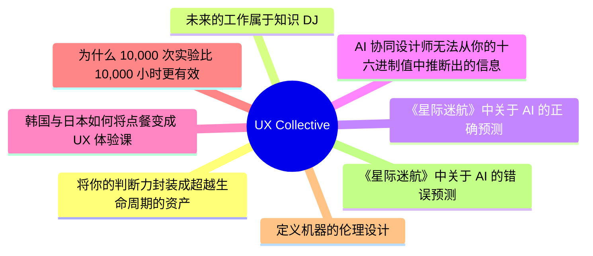
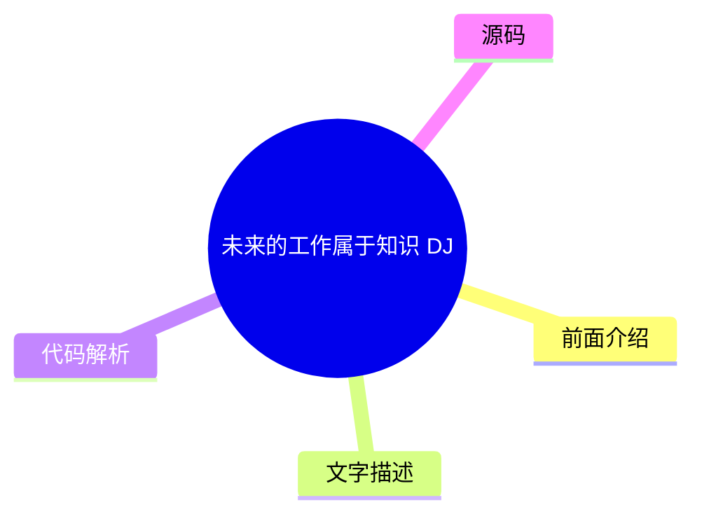
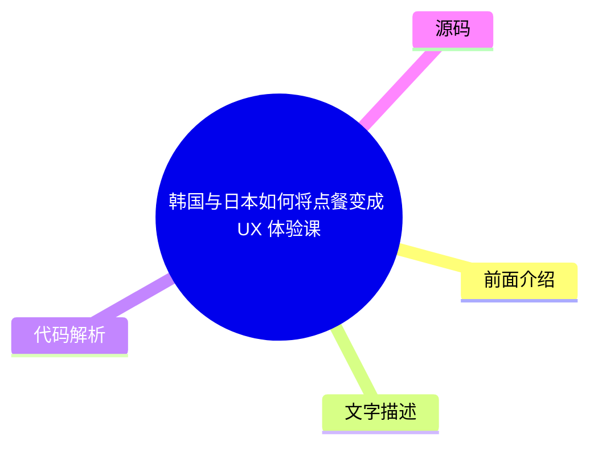
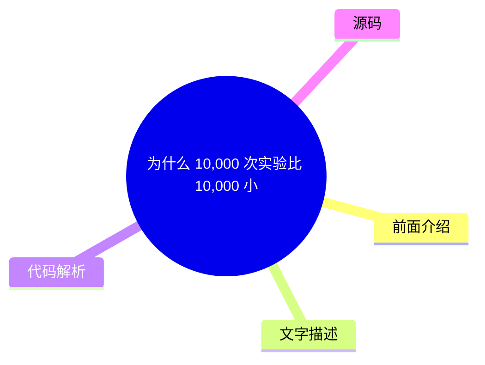
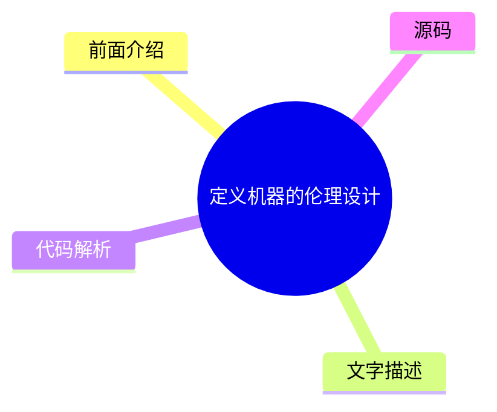
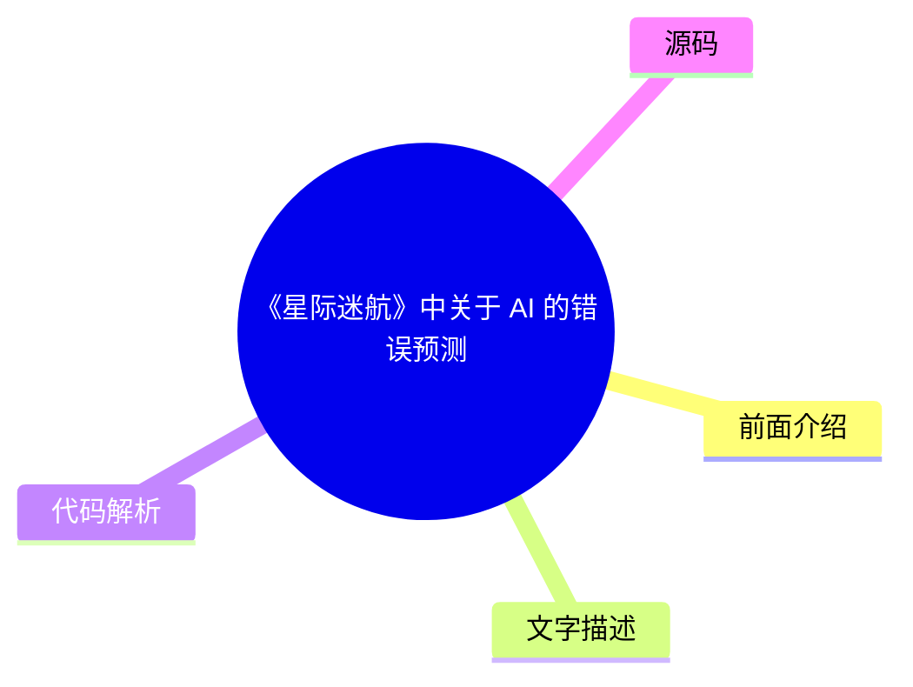

# ✏️ UX Collective Top 8 (2026-08-07)

## 前面介绍

- 数据源：UX Collective
- 抓取日期：2026-08-07
- 条目数：8
- 含完整正文：0
- 含代码片段：0
- 组织方式：前面介绍 / 树状图 / 文字描述 / 代码解析 / 源码

## 思维导图

## 详细整理（8 条，0 条含全文，0 条含代码）

### 1. 将你的判断力封装成超越生命周期的资产
- **链接**: [https://uxdesign.cc/bottle-your-judgment-and-make-it-outlive-you-14f422772262?source=rss----138adf9c44c---4](https://uxdesign.cc/bottle-your-judgment-and-make-it-outlive-you-14f422772262?source=rss----138adf9c44c---4)
- **作者**: Dan Maccarone
- **发布**: Wed, 05 Aug 2026 20:55:03 GMT

#### 前面介绍

- 将个人判断力转化为可复用的知识资产。
- 通过系统化记录，让经验超越个人寿命。

#### 树状图

#### 文字描述

- 文章探讨了如何将设计师和决策者的个人判断力转化为可复用的知识资产。
- 核心观点是不仅要关注当下的决策，更要思考如何让这些判断在未来依然有效。
- 通过建立个人知识库或系统，将隐性经验显性化，从而实现知识的传承和复用。

#### 代码解析

- 本文未提供源码，以下为实现思路或结构解析：
- 1. 建立个人知识库系统，用于存储和检索过往的决策案例。
- 2. 采用结构化方法记录决策过程、背景、结果及反思。
- 3. 定期回顾和更新知识库，确保信息的时效性和准确性。

#### 源码

未抓到可展示源码或原文节选。

### 2. 未来的工作属于知识 DJ
- **链接**: [https://uxdesign.cc/the-future-of-work-belongs-to-the-knowledge-djs-7cc596be1f77?source=rss----138adf9c44c---4](https://uxdesign.cc/the-future-of-work-belongs-to-the-knowledge-djs-7cc596be1f77?source=rss----138adf9c44c---4)
- **作者**: Connor Joyce
- **发布**: Wed, 05 Aug 2026 07:36:54 GMT

#### 前面介绍

- 工作本质正在从执行转向编排。
- 知识 DJ 需要在混乱的信息流中创造秩序。

#### 树状图

#### 文字描述

- 文章提出未来的工作模式将类似于 DJ 打碟，即从单纯的执行者转变为信息的编排者和整合者。
- 知识 DJ 的核心能力在于从海量信息中筛选、混合并创造新的价值，而不是单纯地完成既定任务。
- 这种角色要求具备更强的信息处理能力和创造力，能够将碎片化的知识串联成有意义的整体。

#### 代码解析

- 本文未提供源码，以下为实现思路或结构解析：
- 1. 建立个人的信息输入源（如 RSS、Newsletter、社交媒体）。
- 2. 开发或使用工具对信息进行分类、标签化和去重。
- 3. 定期进行内容整合与输出，形成新的知识产品或见解。

#### 源码

未抓到可展示源码或原文节选。

### 3. 《星际迷航》中关于 AI 的正确预测
- **链接**: [https://uxdesign.cc/what-star-trek-got-right-about-ai-a4fb09e0d6c6?source=rss----138adf9c44c---4](https://uxdesign.cc/what-star-trek-got-right-about-ai-a4fb09e0d6c6?source=rss----138adf9c44c---4)
- **作者**: Patrick Neeman
- **发布**: Tue, 04 Aug 2026 21:10:21 GMT

#### 前面介绍

- AI 将成为人类探索未知的伙伴。
- 技术进步将解决能源和通讯等基础物理问题。

#### 树状图

#### 文字描述

- 文章分析了《星际迷航》中关于人工智能的设定，指出其中许多预测是准确的。
- 例如，AI 在《星际迷航》中通常被视为人类的伙伴和助手，而非威胁，这与现代对 AI 的部分担忧形成对比。
- 此外，剧中展示的通过技术手段解决能源危机和实现超光速通讯的愿景，也反映了人类对技术解决复杂问题的乐观态度。

#### 代码解析

- 本文未提供源码，以下为实现思路或结构解析：
- 1. 分析科幻作品中的技术设定与当前现实发展的关联性。
- 2. 总结科幻作品中关于 AI 伦理、协作关系的合理预测。
- 3. 探讨技术乐观主义在推动社会进步中的作用。

#### 源码

未抓到可展示源码或原文节选。

### 4. AI 协同设计师无法从你的十六进制值中推断出的信息
- **链接**: [https://uxdesign.cc/what-your-ai-co-designer-cant-infer-from-your-hex-values-d2023364e80e?source=rss----138adf9c44c---4](https://uxdesign.cc/what-your-ai-co-designer-cant-infer-from-your-hex-values-d2023364e80e?source=rss----138adf9c44c---4)
- **作者**: Lisa Demchenko
- **发布**: Tue, 04 Aug 2026 21:09:48 GMT

#### 前面介绍

- 设计语境包含大量非视觉信息。
- 上下文文件是提升 AI 输出质量的关键。

#### 树状图

#### 文字描述

- 作者分享了每次开始新客户项目时创建的上下文文件，旨在帮助 Claude 等工具最大化输出质量。
- 文章强调，除了视觉设计（如十六进制颜色值）外，设计决策还依赖于大量的背景信息、品牌调性、用户画像和项目目标。
- 这些非视觉的上下文信息对于 AI 理解设计意图至关重要，否则 AI 可能会生成符合视觉规范但缺乏灵魂的设计。

#### 代码解析

- 本文未提供源码，以下为实现思路或结构解析：
- 1. 构建包含项目背景、目标受众、品牌指南的结构化上下文文件。
- 2. 在提示词中明确排除或包含特定的设计参数（如颜色代码）。
- 3. 强调上下文信息对 AI 理解设计意图和风格的重要性。

#### 源码

未抓到可展示源码或原文节选。

### 5. 韩国与日本如何将点餐变成 UX 体验课
- **链接**: [https://uxdesign.cc/how-korea-and-japan-turned-ordering-food-into-a-ux-masterclass-f64c31bd4c98?source=rss----138adf9c44c---4](https://uxdesign.cc/how-korea-and-japan-turned-ordering-food-into-a-ux-masterclass-f64c31bd4c98?source=rss----138adf9c44c---4)
- **作者**: Kristina Volchek
- **发布**: Tue, 04 Aug 2026 09:25:56 GMT

#### 前面介绍

- 亚洲的自助点餐系统设计非常出色。
- 通过技术手段优化了排队和点餐流程。

#### 树状图

#### 文字描述

- 文章研究了亚洲自助点餐机和平板电脑的设计，认为这些系统是用户体验的典范。
- 韩国和日本在点餐系统中融入了本地化的语言支持、简洁的界面设计和流畅的交互流程。
- 这些系统不仅解决了高峰期的排队问题，还通过个性化推荐和支付集成，极大地提升了用户的用餐体验和效率。

#### 代码解析

- 本文未提供源码，以下为实现思路或结构解析：
- 1. 分析自助点餐系统的界面布局与交互逻辑。
- 2. 研究多语言支持和本地化适配的实现方式。
- 3. 探讨如何通过技术手段优化用户在高峰期的排队体验。

#### 源码

未抓到可展示源码或原文节选。

### 6. 为什么 10,000 次实验比 10,000 小时更有效
- **链接**: [https://uxdesign.cc/why-10-000-experiments-work-better-than-10-000-hours-for-designers-1a07aa35df7f?source=rss----138adf9c44c---4](https://uxdesign.cc/why-10-000-experiments-work-better-than-10-000-hours-for-designers-1a07aa35df7f?source=rss----138adf9c44c---4)
- **作者**: Kai Wong
- **发布**: Tue, 04 Aug 2026 07:34:49 GMT

#### 前面介绍

- 实验驱动的设计优于单纯的练习。
- Airbnb 放弃了二十年的优化策略。

#### 树状图

#### 文字描述

- 文章引用了 Airbnb 放弃二十年优化策略的案例，提出进行 10,000 次实验比进行 10,000 小时的练习更能带来设计上的突破。
- 实验能够快速验证假设，提供真实的用户反馈，从而指导设计迭代。
- 相比之下，长时间的练习往往是在重复已有的经验，而实验则能带来新的认知和可能性。

#### 代码解析

- 本文未提供源码，以下为实现思路或结构解析：
- 1. 建立快速迭代的实验机制，鼓励小规模测试。
- 2. 收集和分析实验数据，以数据驱动设计决策。
- 3. 避免陷入“优化陷阱”，勇于尝试颠覆性的新方案。

#### 源码

未抓到可展示源码或原文节选。

### 7. 定义机器的伦理设计
- **链接**: [https://uxdesign.cc/defining-ethical-design-for-machines-10d8f7309eec?source=rss----138adf9c44c---4](https://uxdesign.cc/defining-ethical-design-for-machines-10d8f7309eec?source=rss----138adf9c44c---4)
- **作者**: Michael Buckley
- **发布**: Thu, 06 Aug 2026 02:06:36 GMT

#### 前面介绍

- AI 系统需要明确的伦理准则。
- 设计过程必须包含对潜在社会影响的考量。

#### 树状图

#### 文字描述

- 文章探讨了如何为机器和 AI 系统定义伦理设计原则。
- 作者认为，设计不仅仅是关于功能，更是关于价值观的体现。
- 在机器设计阶段就引入伦理考量，可以避免系统在未来产生偏见、歧视或危害社会的后果。

#### 代码解析

- 本文未提供源码，以下为实现思路或结构解析：
- 1. 制定包含公平性、透明度和问责制的伦理设计框架。
- 2. 在设计流程中嵌入伦理审查环节。
- 3. 建立针对 AI 系统的伦理影响评估机制。

#### 源码

未抓到可展示源码或原文节选。

### 8. 《星际迷航》中关于 AI 的错误预测
- **链接**: [https://uxdesign.cc/what-star-trek-got-wrong-about-ai-so-far-a60029fa1f1c?source=rss----138adf9c44c---4](https://uxdesign.cc/what-star-trek-got-wrong-about-ai-so-far-a60029fa1f1c?source=rss----138adf9c44c---4)
- **作者**: Patrick Neeman
- **发布**: Fri, 07 Aug 2026 00:20:56 GMT

#### 前面介绍

- AI 的进化速度可能比科幻作品更慢。
- 技术发展往往面临意想不到的阻碍。

#### 树状图

#### 文字描述

- 文章分析了《星际迷航》中关于人工智能的设定，指出其中许多预测是不准确的。
- 例如，剧中 AI 能够轻易实现通用人工智能（AGI）并拥有高度自主性，这在当前技术发展阶段仍难以实现。
- 此外，剧中展示的星际旅行和跨星系通讯在短期内也难以通过现有技术实现。

#### 代码解析

- 本文未提供源码，以下为实现思路或结构解析：
- 1. 对比科幻作品中的技术愿景与现实技术发展路径。
- 2. 分析阻碍 AI 达到科幻设定水平的物理或技术瓶颈。
- 3. 探讨技术乐观主义与现实主义之间的差距。

#### 源码

未抓到可展示源码或原文节选。

