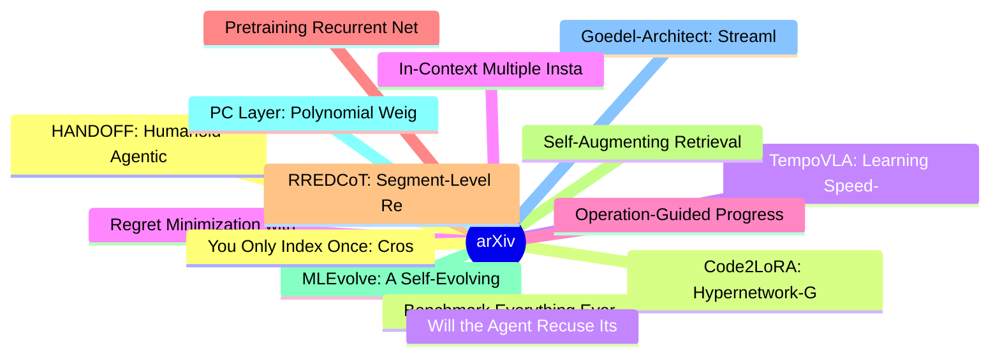

# arXiv 每日最新论文 (2026-06-06)

## 思维导图

## 列表（20 条）

### 1. HANDOFF: Humanoid Agentic Task-Space Whole-Body Control via Distilled Complementary Teachers
- **作者**: Lizhi Yang
- **日期**: 2026-06-04
- **链接**: [http://arxiv.org/abs/2606.06493v1](http://arxiv.org/abs/2606.06493v1)
- **摘要**: For a humanoid robot to be deployed in the real world, the choice of command space (i.e., the interface between task planning and whole-body control) is crucial. Existing whole-body controllers typically demand dense kinematic or spatial references that planners struggle to synthesize from task sema...

### 2. Code2LoRA: Hypernetwork-Generated Adapters for Code Language Models under Software Evolution
- **作者**: Liliana Hotsko
- **日期**: 2026-06-04
- **链接**: [http://arxiv.org/abs/2606.06492v1](http://arxiv.org/abs/2606.06492v1)
- **摘要**: Code language models need repository-level context to resolve imports, APIs, and project conventions. Existing methods inject this knowledge as long inputs (retrieved through RAG or dependency analysis) or through per-repository fine-tuning and LoRA -- costly at repository scale and brittle to evolv...

### 3. TempoVLA: Learning Speed-Controllable Vision-Language-Action Policies
- **作者**: Dong Jing
- **日期**: 2026-06-04
- **链接**: [http://arxiv.org/abs/2606.06491v1](http://arxiv.org/abs/2606.06491v1)
- **摘要**: Robot manipulation alternates between low-risk transit phases that call for fast execution and high-risk contact stages that demand slow, precise motion. Yet existing Vision-Language-Action models (VLAs) only inherit a single fixed speed from training demonstrations. Prior efforts to accelerate VLAs...

### 4. Regret Minimization with Adaptive Opponents in Repeated Games
- **作者**: Mingyang Liu
- **日期**: 2026-06-04
- **链接**: [http://arxiv.org/abs/2606.06486v1](http://arxiv.org/abs/2606.06486v1)
- **摘要**: In this paper, we study regret minimization in repeated games with \emph{adaptive} opponents who can respond based on histories of play. The standard metric of \emph{external regret} in online learning is known to fail to capture such adaptivity. To account for players' counterfactual reasoning, we ...

### 5. Operation-Guided Progressive Human-to-AI Text Transformation Benchmark for Multi-Granularity AI-Text Detection
- **作者**: Sondos Mahmoud Bsharat
- **日期**: 2026-06-04
- **链接**: [http://arxiv.org/abs/2606.06481v1](http://arxiv.org/abs/2606.06481v1)
- **摘要**: As AI writing assistants become increasingly integrated into real-world drafting and revision workflows, many documents are no longer purely human-written or AI-generated, but instead result from progressive human-AI co-editing. However, existing AI-text detection benchmarks largely focus on final o...

### 6. Pretraining Recurrent Networks without Recurrence
- **作者**: Akarsh Kumar
- **日期**: 2026-06-04
- **链接**: [http://arxiv.org/abs/2606.06479v1](http://arxiv.org/abs/2606.06479v1)
- **摘要**: Training recurrent neural networks (RNNs) requires assigning credit across long sequences of computations. Standard backpropagation through time (BPTT) addresses this problem poorly: it is sequential in time, limiting parallelism, and suffers from vanishing or exploding gradients, making long-range ...

### 7. RREDCoT: Segment-Level Reward Redistribution for Reasoning Models
- **作者**: Mykyta Ielanskyi
- **日期**: 2026-06-04
- **链接**: [http://arxiv.org/abs/2606.06475v1](http://arxiv.org/abs/2606.06475v1)
- **摘要**: Recent advancements in reasoning language models have been driven by Reinforcement Learning (RL) fine-tuning. Most often, these rely on the Group Relative Policy Optimization (GRPO) algorithm or modifications thereof to steer the models to produce Chain-of-Thought (CoT) traces. The final answer can ...

### 8. Self-Augmenting Retrieval for Diffusion Language Models
- **作者**: Paul Jünger
- **日期**: 2026-06-04
- **链接**: [http://arxiv.org/abs/2606.06474v1](http://arxiv.org/abs/2606.06474v1)
- **摘要**: Discrete diffusion language models generate text by iteratively denoising an entire response in parallel. At each step, they predict tentative tokens for every masked position, committing the confident predictions to the output and discarding the unconfident ones. We show that the discarded tokens a...

### 9. MLEvolve: A Self-Evolving Framework for Automated Machine Learning Algorithm Discovery
- **作者**: Shangheng Du
- **日期**: 2026-06-04
- **链接**: [http://arxiv.org/abs/2606.06473v1](http://arxiv.org/abs/2606.06473v1)
- **摘要**: Large language model (LLM) agents are increasingly applied to long-horizon tasks such as scientific discovery and machine learning engineering (MLE), where sustained self-evolution becomes a key capability. However, existing MLE agents suffer from inter-branch information isolation, memoryless searc...

### 10. PC Layer: Polynomial Weight Preconditioning for Improving LLM Pre-Training
- **作者**: Senmiao Wang
- **日期**: 2026-06-04
- **链接**: [http://arxiv.org/abs/2606.06470v1](http://arxiv.org/abs/2606.06470v1)
- **摘要**: We propose a preconditioning (PC) layer, a weight parameterization via polynomial preconditioner that ensures stable weight conditioning throughout LLM training. The PC module reshapes the singular-value spectrum of weight matrices via low-degree polynomial preconditioning. After training, the preco...

### 11. Goedel-Architect: Streamlining Formal Theorem Proving with Blueprint Generation and Refinement
- **作者**: Jui-Hui Chung
- **日期**: 2026-06-04
- **链接**: [http://arxiv.org/abs/2606.06468v1](http://arxiv.org/abs/2606.06468v1)
- **摘要**: We introduce Goedel-Architect, an agentic framework for formal theorem proving in Lean 4 centered on blueprint generation and refinement. A blueprint is a dependency graph of definitions and lemmas that builds up to the main theorem. First, Goedel-Architect generates a blueprint of formally stated d...

### 12. You Only Index Once: Cross-Layer Sparse Attention with Shared Routing
- **作者**: Yutao Sun
- **日期**: 2026-06-04
- **链接**: [http://arxiv.org/abs/2606.06467v1](http://arxiv.org/abs/2606.06467v1)
- **摘要**: Long-context inference in modern LLMs is increasingly constrained by decoding efficiency, especially in reasoning-heavy settings where models generate long intermediate chains of thought. Existing sparse attention methods often face a practical efficiency-quality trade-off. Structured block sparse m...

### 13. Benchmark Everything Everywhere All at Once
- **作者**: Shiyun Xiong
- **日期**: 2026-06-04
- **链接**: [http://arxiv.org/abs/2606.06462v1](http://arxiv.org/abs/2606.06462v1)
- **摘要**: Benchmarks are fundamental for evaluating and advancing LLMs and MLLMs by providing standardized and explicit measures of performance. However, their construction is labor-intensive and hard to reuse, raising concerns about sustainability and scalability. Moreover, existing benchmarks often quickly ...

### 14. Will the Agent Recuse Itself? Measuring LLM-Agent Compliance with In-Band Access-Deny Signals
- **作者**: Thamilvendhan Munirathinam
- **日期**: 2026-06-04
- **链接**: [http://arxiv.org/abs/2606.06460v1](http://arxiv.org/abs/2606.06460v1)
- **摘要**: As autonomous LLM agents increasingly hold real credentials and operate infrastructure without a human in the loop, operators have no standard way to tell an agent that a resource is off-limits. Access controls either let the agent in (it has valid credentials) or hard-fail it (indistinguishable fro...

### 15. In-Context Multiple Instance Learning
- **作者**: Alexander Möllers
- **日期**: 2026-06-04
- **链接**: [http://arxiv.org/abs/2606.06458v1](http://arxiv.org/abs/2606.06458v1)
- **摘要**: Multiple Instance Learning (MIL) addresses problems where supervision is available at the level of bags of instances and has been successfully applied in fields ranging from computational pathology to satellite imagery. Nevertheless, existing algorithms struggle in the low-label regime that characte...

### 16. Vortex: Efficient and Programmable Sparse Attention Serving for AI Agents
- **作者**: Zhuoming Chen
- **日期**: 2026-06-04
- **链接**: [http://arxiv.org/abs/2606.06453v1](http://arxiv.org/abs/2606.06453v1)
- **摘要**: Sparse attention is becoming increasingly important for serving large language models (LLMs) as generation lengths continue to grow. However, deploying and evaluating new sparse attention algorithms at scale remains highly engineering-intensive, slowing both human researchers and AI agents in explor...

### 17. Agent Memory: Characterization and System Implications of Stateful Long-Horizon Workloads
- **作者**: Yasmine Omri
- **日期**: 2026-06-04
- **链接**: [http://arxiv.org/abs/2606.06448v1](http://arxiv.org/abs/2606.06448v1)
- **摘要**: LLM agents are increasingly deployed on long-horizon tasks requiring sustained reasoning over extended interaction histories. Realizing this at scale requires agents to persistently store, retrieve, and update their own memory across sessions. A rich ecosystem of agent memory systems has emerged spa...

### 18. RiskFlow: Fast and Faithful Safety-Critical Traffic Scenario Generation
- **作者**: Qi Lan
- **日期**: 2026-06-04
- **链接**: [http://arxiv.org/abs/2606.06423v1](http://arxiv.org/abs/2606.06423v1)
- **摘要**: Safety-critical traffic scenario generation is essential for evaluating autonomous driving systems under rare but high-risk interactions. Existing diffusion-based methods offer strong controllability in closed-loop generation, but their iterative denoising process is computationally expensive and ma...

### 19. Double Preconditioning (DoPr): Optimization for Test-Time Performance, not Validation Loss
- **作者**: Thomas T. Zhang
- **日期**: 2026-06-04
- **链接**: [http://arxiv.org/abs/2606.06418v1](http://arxiv.org/abs/2606.06418v1)
- **摘要**: Many modern applications of deep learning involve training a neural network via a one-step prediction loss (e.g., $L^2$ regression, cross-entropy), but deploy the network by rolling out along its own predictions. Key examples include autoregressive language modeling, flow-based generative modeling, ...

### 20. Unsupervised Skill Discovery for Agentic Data Analysis
- **作者**: Zhisong Qiu
- **日期**: 2026-06-04
- **链接**: [http://arxiv.org/abs/2606.06416v1](http://arxiv.org/abs/2606.06416v1)
- **摘要**: Inference-time skill augmentation provides a lightweight way to improve data-analytic agents by injecting reusable procedural knowledge without updating model parameters. However, discovering effective skills for data analysis remains challenging, as reliable supervision is expensive and success cri...
