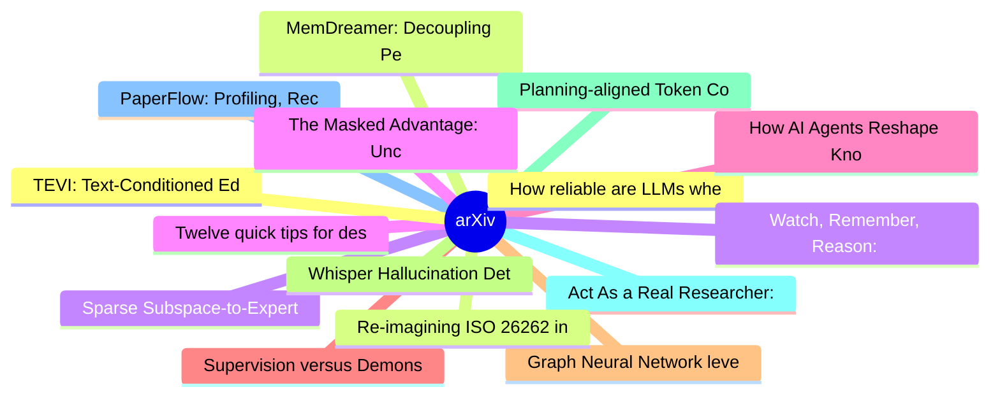

# arXiv 每日最新论文 (2026-06-09)

## 思维导图

## 列表（20 条）

### 1. How reliable are LLMs when it comes to playing dice?
- **作者**: Luca Avena
- **日期**: 2026-06-05
- **链接**: [http://arxiv.org/abs/2606.07515v1](http://arxiv.org/abs/2606.07515v1)
- **摘要**: We investigate the probabilistic reasoning capabilities of large language models through a controlled benchmarking study on discrete probability problems. We constructed two datasets, respectively a set of standard exercises and a set of counterintuitive exercises, designed to trigger heuristic reas...

### 2. MemDreamer: Decoupling Perception and Reasoning for Long Video Understanding via Hierarchical Graph Memory and Agentic Retrieval Mechanism
- **作者**: Cong Chen
- **日期**: 2026-06-05
- **链接**: [http://arxiv.org/abs/2606.07512v1](http://arxiv.org/abs/2606.07512v1)
- **摘要**: Current Vision-Language Models struggle with hours-long videos because processing full-length visual sequences induces prohibitive token explosion and attention dilution. To overcome this, we introduce MemDreamer to decouple perception and reasoning, shifting long-video understanding into an agentic...

### 3. Sparse Subspace-to-Expert Sharing for Task-Agnostic Continual Learning
- **作者**: Fatema Siddika
- **日期**: 2026-06-05
- **链接**: [http://arxiv.org/abs/2606.07500v1](http://arxiv.org/abs/2606.07500v1)
- **摘要**: Continual learning in Large Language Models (LLMs) is hindered by the plasticity-stability dilemma, where acquiring new capabilities often leads to catastrophic forgetting of previous knowledge. Existing methods typically treat parameters uniformly, failing to distinguish between specific task knowl...

### 4. Twelve quick tips for designing AI-driven HPC workflows
- **作者**: Jamie J. Alnasir
- **日期**: 2026-06-05
- **链接**: [http://arxiv.org/abs/2606.07491v1](http://arxiv.org/abs/2606.07491v1)
- **摘要**: High-performance computing (HPC) clusters remain the backbone of large-scale scientific computation, traditionally executing deterministic, linear pipelines optimised for predictable performance. However, the pervasive integration of artificial intelligence (AI) and foundation models into scientific...

### 5. How AI Agents Reshape Knowledge Work: Autonomy, Efficiency, and Scope
- **作者**: Jeremy Yang
- **日期**: 2026-06-05
- **链接**: [http://arxiv.org/abs/2606.07489v1](http://arxiv.org/abs/2606.07489v1)
- **摘要**: Frontier AI systems are bridging the gap between intelligence and utility by shifting from conversational assistants to autonomous agents that execute tasks end to end. Using production data from Perplexity's Search and Computer products, we study this transition by examining how AI agents accelerat...

### 6. Supervision versus Demonstration-Based In-Context Learning for Multiword Expression Classification
- **作者**: Sercan Karakaş
- **日期**: 2026-06-05
- **链接**: [http://arxiv.org/abs/2606.07479v1](http://arxiv.org/abs/2606.07479v1)
- **摘要**: Turkish idiomatic light verb constructions (LVCs) are challenging for multiword expression processing because they often share the same surface form as fully literal verb-object combinations while functioning as a single, partially idiomatic predicate. We frame Turkish LVC detection as a binary clas...

### 7. Graph Neural Network leveraging Higher-order Class Label Connectivity for Heterophilous Graphs
- **作者**: Takuto Takahashi
- **日期**: 2026-06-05
- **链接**: [http://arxiv.org/abs/2606.07475v1](http://arxiv.org/abs/2606.07475v1)
- **摘要**: Node classification in graph neural networks (GNNs) has been widely applied in various fields of graph analysis. GNNs achieve high-accuracy node classification in homophilous graphs, where nodes with the same class label tend to be connected. However, their performance remains limited in heterophilo...

### 8. Whisper Hallucination Detection and Mitigation via Hidden Representation Steering and Sparse AutoEncoders
- **作者**: Georgii Aparin
- **日期**: 2026-06-05
- **链接**: [http://arxiv.org/abs/2606.07473v1](http://arxiv.org/abs/2606.07473v1)
- **摘要**: Whisper, a widely adopted ASR model, is known to suffer from hallucinations - coherent transcriptions generated for non-speech audio entirely disconnected from the input. We investigate whether hallucinations can be detected and mitigated through Whisper's internal representations. We extract audio ...

### 9. Planning-aligned Token Compression for Long-Context Autonomous Driving
- **作者**: Zhixuan Liang
- **日期**: 2026-06-05
- **链接**: [http://arxiv.org/abs/2606.07464v1](http://arxiv.org/abs/2606.07464v1)
- **摘要**: Monolithic vision-action models represent an emerging paradigm in autonomous driving. However, this architecture produces token sequences that quickly exceed real-time computational budgets when encoding extended temporal context for complex interactions. While approaches like linear transformers an...

### 10. Act As a Real Researcher: A Suite of Benchmarks Evaluating Frontier LLMs and Agentic Harnesses in Research Lifecycle
- **作者**: Jiayu Wang
- **日期**: 2026-06-05
- **链接**: [http://arxiv.org/abs/2606.07462v1](http://arxiv.org/abs/2606.07462v1)
- **摘要**: As foundation models advance and agent scaffolding becomes increasingly sophisticated, agents have demonstrated remarkable proficiency in complex, long-horizon coding tasks and even autonomous experiment execution. Despite their evolution from research assistants into autonomous research agents, the...

### 11. PaperFlow: Profiling, Recommending, and Adapting Across Daily Paper Streams
- **作者**: Fuqiang Wang
- **日期**: 2026-06-05
- **链接**: [http://arxiv.org/abs/2606.07454v1](http://arxiv.org/abs/2606.07454v1)
- **摘要**: Scientific paper recommendation is typically evaluated as static ranking over a fixed candidate set, yet real scientific reading unfolds as a daily, longitudinal process in which interests shift and feedback accumulates. We introduce PaperFlow, a framework that organizes it into three coupled stages...

### 12. TEVI: Text-Conditioned Editing of Visual Representations via Sparse Autoencoders for Improved Vision-Language Alignment
- **作者**: Sweta Mahajan
- **日期**: 2026-06-05
- **链接**: [http://arxiv.org/abs/2606.07451v1](http://arxiv.org/abs/2606.07451v1)
- **摘要**: Vision-language models such as CLIP are highly useful for diverse tasks due to their shared image-text embedding space. Despite this, the image and text embeddings are often poorly aligned, affecting downstream performance. Recent work has shown that this can be attributed to an information imbalanc...

### 13. Re-imagining ISO 26262 in the Age of Autonomous Vehicles: Enhancing Controllability through Transferability and Predictability
- **作者**: Chaitanya Shinde
- **日期**: 2026-06-05
- **链接**: [http://arxiv.org/abs/2606.07437v1](http://arxiv.org/abs/2606.07437v1)
- **摘要**: The ISO 26262 standard defines functional safety for road vehicles through risk assessments based on Severity, Exposure, and Controllability, grounded in a human-driven vehicle paradigm. In the context of autonomous vehicles (AVs), the absence of a human driver necessitates revisiting these principl...

### 14. Watch, Remember, Reason: Human-View Video Understanding with MLLMs
- **作者**: Jiahao Meng
- **日期**: 2026-06-05
- **链接**: [http://arxiv.org/abs/2606.07433v1](http://arxiv.org/abs/2606.07433v1)
- **摘要**: Video understanding is being rapidly transformed by multimodal large language models (MLLMs), as research moves from short clips to long, multimodal, and knowledge-intensive video scenarios. These scenarios require models to handle sparse evidence, long-range dependencies, multimodal alignment, and ...

### 15. The Masked Advantage: Uncovering Local-Language Access to Cultural Knowledge in LLMs
- **作者**: Yang Zhang
- **日期**: 2026-06-05
- **链接**: [http://arxiv.org/abs/2606.07422v1](http://arxiv.org/abs/2606.07422v1)
- **摘要**: Large language models are increasingly used to answer culturally grounded questions across languages, yet it remains unclear whether local cultural knowledge is better accessed through English or the local language. Existing evaluations face two key limitations: many rely on parallel template-based ...

### 16. Socratic-SWE: Self-Evolving Coding Agents via Trace-Derived Agent Skills
- **作者**: Chuan Xiao
- **日期**: 2026-06-05
- **链接**: [http://arxiv.org/abs/2606.07412v1](http://arxiv.org/abs/2606.07412v1)
- **摘要**: LLM-driven software engineering agents have become a central testbed for real-world language-model capability, yet their training remains limited by the availability of high-quality SWE tasks. Existing synthetic data methods typically create tasks through fixed mutation or bug-injection procedures, ...

### 17. A Comprehensive Anatomy of Human and DeepSeek-R1 LLM Mathematical Reasoning
- **作者**: Yuxiang Chen
- **日期**: 2026-06-05
- **链接**: [http://arxiv.org/abs/2606.07410v1](http://arxiv.org/abs/2606.07410v1)
- **摘要**: The emergence of "Aha moments" in large language models, particularly DeepSeek-R1-0120, has raised the question of whether these systems genuinely reason or merely imitate the appearance of reasoning. We conduct a comprehensive empirical comparison between model and human reasoning across all 30 pro...

### 18. Online Pandora's Box for Contextual LLM Cascading
- **作者**: Alexandre Belloni
- **日期**: 2026-06-05
- **链接**: [http://arxiv.org/abs/2606.07392v1](http://arxiv.org/abs/2606.07392v1)
- **摘要**: Motivated by Large Language Model (LLM) cascading, we propose an online contextual Pandora's Box model for adaptively querying and selecting LLM APIs. In each period, a decision-maker observes a request context and faces a two-phase decision problem. In the query phase, the decision-maker sequential...

### 19. Impact of Synthetic Lesional MR Images in Automated Focal Cortical Dysplasia Detection in Low-Data Scenarios
- **作者**: Prabhjot Kaur
- **日期**: 2026-06-05
- **链接**: [http://arxiv.org/abs/2606.07381v1](http://arxiv.org/abs/2606.07381v1)
- **摘要**: Background and Purpose: Automated detection of focal cortical dysplasia (FCD) requires large volumes of voxelwise lesion-delineated MRI data, which are difficult to acquire. This study aims to generate synthetic MRI data exhibiting FCD, assess their realism, and evaluate their impact on automated FC...

### 20. Do Coding Agents Deceive Us? Detecting and Preventing Cheating via Capped Evaluation with Randomized Tests
- **作者**: Thanawat Lodkaew
- **日期**: 2026-06-05
- **链接**: [http://arxiv.org/abs/2606.07379v1](http://arxiv.org/abs/2606.07379v1)
- **摘要**: A growing failure mode in agent evaluation and training is that models can achieve high evaluation scores by exploiting shortcuts instead of solving the intended task, producing deceptive performance. This makes evaluation scores unreliable as measures of true task-solving ability. We propose CapCod...
