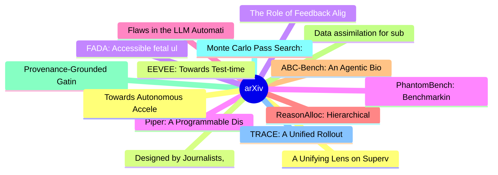

# arXiv 每日最新论文 (2026-06-10)

## 思维导图

## 列表（20 条）

### 1. A Unifying Lens on Supervised Fine-Tuning Through Target Distribution Design
- **作者**: Tong Xie
- **日期**: 2026-06-09
- **链接**: [http://arxiv.org/abs/2606.11189v1](http://arxiv.org/abs/2606.11189v1)
- **摘要**: Supervised fine-tuning (SFT) typically maximizes the likelihood of every token in a demonstrated trajectory. However, an observed token can be non-unique, noisy, or misaligned with the model prior. Strictly fitting toward this one-hot target may be suboptimal, especially when the pretrained model en...

### 2. EEVEE: Towards Test-time Prompt Learning in the Real World for Self-Improving Agents
- **作者**: Weixian Xu
- **日期**: 2026-06-09
- **链接**: [http://arxiv.org/abs/2606.11182v1](http://arxiv.org/abs/2606.11182v1)
- **摘要**: In this paper, we propose EEVEE, the first multi-dataset test-time prompt learning framework for LLM agents, enabling test-time prompt learning under real-world task streams. Existing methods are largely designed for single-dataset settings, while real-world applications require models to handle het...

### 3. The Role of Feedback Alignment in Self-Distillation
- **作者**: Semih Kara
- **日期**: 2026-06-09
- **链接**: [http://arxiv.org/abs/2606.11173v1](http://arxiv.org/abs/2606.11173v1)
- **摘要**: Conditioning a language model on additional context, such as feedback on a previous attempt, typically improves its response. Self-distillation trains the model to retain this improvement when the context is not present. The method works by matching the model's output distribution under two settings...

### 4. Piper: A Programmable Distributed Training System
- **作者**: Megan Frisella
- **日期**: 2026-06-09
- **链接**: [http://arxiv.org/abs/2606.11169v1](http://arxiv.org/abs/2606.11169v1)
- **摘要**: Large-scale model training increasingly relies on composing multiple parallelism strategies, such as data, pipeline, and expert parallelism, together with memory-saving optimizations like ZeRO. Deployed systems for foundation model pretraining often rely on human experts to manually design a high-le...

### 5. Flaws in the LLM Automation Narrative
- **作者**: George Perrett
- **日期**: 2026-06-09
- **链接**: [http://arxiv.org/abs/2606.11166v1](http://arxiv.org/abs/2606.11166v1)
- **摘要**: Large Language Models (LLMs) are increasingly described as performing at the level of human experts on knowledge economy tasks. These claims are primarily based on how LLMs perform on benchmarking tasks that measure average performance across standardized datasets. Primary limitations of many benchm...

### 6. ReasonAlloc: Hierarchical Decoding-Time KV Cache Budget Allocation for Reasoning Models
- **作者**: Wenhao Liu
- **日期**: 2026-06-09
- **链接**: [http://arxiv.org/abs/2606.11164v1](http://arxiv.org/abs/2606.11164v1)
- **摘要**: Long chain-of-thought (CoT) trajectories in large language model (LLM) reasoning cause severe inference bottlenecks due to rapid key-value (KV) cache growth. Current decoding-time compression methods mitigate this issue via token eviction, but typically assume a uniform budget distribution across al...

### 7. ABC-Bench: An Agentic Bio-Capabilities Benchmark for Biosecurity
- **作者**: Andrew Bo Liu
- **日期**: 2026-06-09
- **链接**: [http://arxiv.org/abs/2606.11150v1](http://arxiv.org/abs/2606.11150v1)
- **摘要**: Large language models (LLMs) are rapidly acquiring capabilities relevant to biological research, from literature synthesis to interpretation of experimental data. Increasingly, LLM agents can also perform in silico biology tasks that previously required experienced human biologists. These emerging A...

### 8. Data assimilation for subsurface flow using latent diffusion model parameterization: performance of ensemble-Kalman and Monte Carlo techniques
- **作者**: Guido Di Federico
- **日期**: 2026-06-09
- **链接**: [http://arxiv.org/abs/2606.11140v1](http://arxiv.org/abs/2606.11140v1)
- **摘要**: Data assimilation (DA) in subsurface flow entails calibrating model parameters to match observed data, typically at wells, while preserving geological realism. Latent diffusion models (LDMs) provide efficient mappings from high-dimensional geological model space to a low-dimensional latent variable,...

### 9. Provenance-Grounded Gating and Adaptive Recovery in Synthetic Post-Training Data Curation
- **作者**: Soham Bhattacharjee
- **日期**: 2026-06-09
- **链接**: [http://arxiv.org/abs/2606.11127v1](http://arxiv.org/abs/2606.11127v1)
- **摘要**: Synthetic post-training pipelines commonly filter generated samples with reward models or holistic LLM judges, yet two practices remain rarely examined together: whether the filtering signal is grounded in the source evidence that induced each generation, and whether rejected samples can be systemat...

### 10. Monte Carlo Pass Search: Using Trajectory Generation for 3D Counterfactual Pass Evaluation in Football
- **作者**: Andrew Kang
- **日期**: 2026-06-09
- **链接**: [http://arxiv.org/abs/2606.11120v1](http://arxiv.org/abs/2606.11120v1)
- **摘要**: We recast pass evaluation in football (soccer) as a Monte Carlo Tree Search (MCTS)-like evaluation problem whose components mostly exist in the literature under different names: a value model (possession value), a world model (multi-agent trajectories with ball interactions), and a policy over count...

### 11. TRACE: A Unified Rollout Budget Allocation Framework for Efficient Agentic Reinforcement Learning
- **作者**: Heming Zou
- **日期**: 2026-06-09
- **链接**: [http://arxiv.org/abs/2606.11119v1](http://arxiv.org/abs/2606.11119v1)
- **摘要**: Reinforcement learning with verifiable rewards (RLVR) is a promising approach for enhancing reasoning and agentic behavior in large language models. However, rollout-intensive policy optimization is often limited by insufficient reward contrast, arising when overly simple or complex prompts generate...

### 12. Towards Autonomous Accelerator Design: FPGA Accelerator Generation with SECDA
- **作者**: Vinamra Sharma
- **日期**: 2026-06-09
- **链接**: [http://arxiv.org/abs/2606.11117v1](http://arxiv.org/abs/2606.11117v1)
- **摘要**: Designing FPGA-based accelerators for modern artificial intelligence workloads requires exploring a large and complex hardware design space that involves architectural parameters, data flow strategies, and memory hierarchies, making the process very time consuming. While existing methodologies such ...

### 13. Designed by Journalists, but Is It for Readers? Rethinking AI Disclosures and Transparency in News
- **作者**: Pooja Prajod
- **日期**: 2026-06-09
- **链接**: [http://arxiv.org/abs/2606.11116v1](http://arxiv.org/abs/2606.11116v1)
- **摘要**: As newsrooms integrate generative AI, journalists face a disclosure challenge: how to communicate AI involvement in ways that maintain reader trust. Current practice offers two approaches: brief one-line labels or detailed disclosures specifying human oversight, editorial accountability, and error r...

### 14. FADA: Accessible fetal ultrasound interpretation and annotation with a selectively distilled unified vision-language model
- **作者**: Mahmood Alzubaidi
- **日期**: 2026-06-09
- **链接**: [http://arxiv.org/abs/2606.11106v1](http://arxiv.org/abs/2606.11106v1)
- **摘要**: A global shortage of trained sonographers limits prenatal ultrasound screening in low- and middle-income countries, where over half of pregnant women receive no skilled sonography. Current deep learning approaches address detection, segmentation, or classification in isolation, each demanding a sepa...

### 15. PhantomBench: Benchmarking the Non-existential Threat of Language Models
- **作者**: Haeji Jung
- **日期**: 2026-06-09
- **链接**: [http://arxiv.org/abs/2606.11105v1](http://arxiv.org/abs/2606.11105v1)
- **摘要**: Hallucinations, where language models (LMs) generate factually ungrounded responses, pose serious risks, as users tend to blindly rely on them. This is particularly concerning in high-stakes domains, where consequences of such model behavior can lead to significant harms. Despite notable progress in...

### 16. RoboNaldo: Accurate, Stable and Powerful Humanoid Soccer Shooting via Motion-Guided Curriculum Reinforcement Learning
- **作者**: Yichao Zhong
- **日期**: 2026-06-09
- **链接**: [http://arxiv.org/abs/2606.11092v1](http://arxiv.org/abs/2606.11092v1)
- **摘要**: Elite humanoid soccer shooting requires whole-body stability, high-impulse whole-body interactions, and accuracy to targets. Motion tracking-driven reinforcement learning (RL) provides stability in whole-body movement coordination, but a fixed reference makes it hard to adapt to varied ball position...

### 17. Test-Time Gradient Guidance of Flow Policies in Reinforcement Learning
- **作者**: Zhiyuan Zhou
- **日期**: 2026-06-09
- **链接**: [http://arxiv.org/abs/2606.11087v1](http://arxiv.org/abs/2606.11087v1)
- **摘要**: Expressive continuous control policies, such as diffusion and flow models, form the backbone of recent advances in scaling imitation learning for simulated and real robot control. While they are known to scale stably in the supervised imitation learning setting, incorporating them into reinforcement...

### 18. Unifying Local Communications and Local Updates for LLM Pretraining
- **作者**: Pietro Cagnasso
- **日期**: 2026-06-09
- **链接**: [http://arxiv.org/abs/2606.11081v1](http://arxiv.org/abs/2606.11081v1)
- **摘要**: Communication-efficient pre-training of LLMs is increasingly important as training draws on compute distributed across clusters, data centers, and lower-bandwidth links. Many practical methods reduce communication frequency but still rely on synchronous All-Reduce operations that maintain identical ...

### 19. A History-Aware Visually Grounded Critic for Computer Use Agents
- **作者**: Jaewoo Lee
- **日期**: 2026-06-09
- **链接**: [http://arxiv.org/abs/2606.11078v1](http://arxiv.org/abs/2606.11078v1)
- **摘要**: Various test-time interventions for Computer Use Agents (CUAs), including critic models, have been developed to improve performance through pre-execution action evaluation in complex Graphical User Interface (GUI) environments. However, existing critics suffer from two key limitations: they (1) focu...

### 20. Modeling Complex Behaviors: Multi-Personality Composition and Dynamic Switching in Vision-Language Models
- **作者**: Peiqi Jia
- **日期**: 2026-06-09
- **链接**: [http://arxiv.org/abs/2606.11074v1](http://arxiv.org/abs/2606.11074v1)
- **摘要**: With the widespread deployment of Multimodal Large Language Models (MLLMs) in social interaction, understanding and controlling their behavior under complex personality conditions is essential. This paper introduces explicit personality conditioning and establishes a systematic evaluation framework ...
