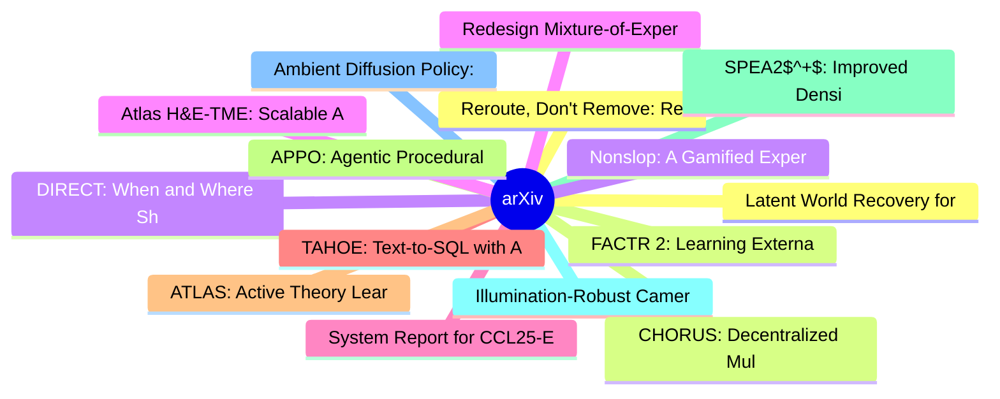

# arXiv 每日最新论文 (2026-06-11)

## 思维导图

## 列表（20 条）

### 1. Reroute, Don't Remove: Recoverable Visual Token Routing for Vision-Language Models
- **作者**: Cheng-Yu Yang
- **日期**: 2026-06-10
- **链接**: [http://arxiv.org/abs/2606.12412v1](http://arxiv.org/abs/2606.12412v1)
- **摘要**: Vision-language models (VLMs) project images into hundreds to thousands of visual tokens, making decoder inference expensive in both attention computation and KV-cache memory. Existing visual-token reduction methods largely follow a rank-and-remove paradigm: they score visual tokens, keep a compact ...

### 2. FACTR 2: Learning External Force Sensing for Commodity Robot Arms Improves Policy Learning
- **作者**: Steven Oh
- **日期**: 2026-06-10
- **链接**: [http://arxiv.org/abs/2606.12406v1](http://arxiv.org/abs/2606.12406v1)
- **摘要**: Contact-rich manipulation requires force sensitivity, but many robot arms lack dedicated force sensors due to their high cost. We present Neural External Torque Estimation (NEXT), a data-driven method that estimates external joint torques without needing any dedicated force sensors. NEXT trains in 1...

### 3. DIRECT: When and Where Should You Allocate Test-Time Compute in Embodied Planners?
- **作者**: Jadelynn Dao
- **日期**: 2026-06-10
- **链接**: [http://arxiv.org/abs/2606.12402v1](http://arxiv.org/abs/2606.12402v1)
- **摘要**: Vision-Language Models (VLMs) are increasingly deployed as high-level planners for embodied agents, with an emerging strategy of scaling test-time compute to improve capability. However, we observe that doing so increases latency, token usage, and FLOPs while yielding uneven, often diminishing gains...

### 4. Redesign Mixture-of-Experts Routers with Manifold Power Iteration
- **作者**: Songhao Wu
- **日期**: 2026-06-10
- **链接**: [http://arxiv.org/abs/2606.12397v1](http://arxiv.org/abs/2606.12397v1)
- **摘要**: Router is the cornerstone component to the Mixture-of-Experts models. Serving as expert proxies, the rows of the router matrix compute their similarity to the MoE inputs to determine which subset of experts is activated. Ideally, each router row is designed to encode the expert matrix into this repr...

### 5. System Report for CCL25-Eval Task 5: New Dataset and LoRA-Fine-Tuned Qwen2.5
- **作者**: Haotao Xie
- **日期**: 2026-06-10
- **链接**: [http://arxiv.org/abs/2606.12392v1](http://arxiv.org/abs/2606.12392v1)
- **摘要**: Recently, large language models (LLMs) have achieved promising progress in the fields of classical Chinese translation and the generation of classical poetry. However, domain-specific research on precise translation and affective-semantic understanding of classical poetry remains limited. The main c...

### 6. TAHOE: Text-to-SQL with Automated Hint Optimization from Experience
- **作者**: Zhiyi Chen
- **日期**: 2026-06-10
- **链接**: [http://arxiv.org/abs/2606.12387v1](http://arxiv.org/abs/2606.12387v1)
- **摘要**: Large Language Models (LLMs) have democratized database access through Text-to-SQL, but moving from prototypes to production remains difficult. Real deployments must handle strict SQL dialects, massive schemas, and evolving user preferences, while supervised fine-tuning is costly and rigid and agent...

### 7. ATLAS: Active Theory Learning for Automated Science
- **作者**: Noémi Éltető
- **日期**: 2026-06-10
- **链接**: [http://arxiv.org/abs/2606.12386v1](http://arxiv.org/abs/2606.12386v1)
- **摘要**: Advancing scientific understanding through mechanistic modeling requires posing the right experimental questions to yield maximally informative data. To automate this pursuit within cognitive science, we introduce ATLAS (Active Theory Learning for Automated Science), an active learning framework for...

### 8. APPO: Agentic Procedural Policy Optimization
- **作者**: Xucong Wang
- **日期**: 2026-06-10
- **链接**: [http://arxiv.org/abs/2606.12384v1](http://arxiv.org/abs/2606.12384v1)
- **摘要**: Recent advances in agentic Reinforcement Learning (RL) have substantially improved the multi-turn tool-use capabilities of large language model agents. However, most existing methods assign credit over coarse heuristic units, such as tool-call boundaries or fixed workflows, making it difficult to id...

### 9. SPEA2$^+$: Improved Density Estimation in SPEA2 with Provable Runtime Guarantees
- **作者**: Duc-Cuong Dang
- **日期**: 2026-06-10
- **链接**: [http://arxiv.org/abs/2606.12382v1](http://arxiv.org/abs/2606.12382v1)
- **摘要**: The Strength Pareto Evolutionary Algorithm 2 (SPEA2) is a popular and prominent evolutionary algorithm for solving multi-objective optimisation problems. Despite its popularity, theoretical analyses of SPEA2 have only appeared recently. Moreover, these analyses focus exclusively on how SPEA2 handles...

### 10. Illumination-Robust Camera-Based Heart-Rate Estimation for Physiological Sensing in Robots
- **作者**: Zhi Wei Xu
- **日期**: 2026-06-10
- **链接**: [http://arxiv.org/abs/2606.12378v1](http://arxiv.org/abs/2606.12378v1)
- **摘要**: Physiological awareness is important for service, social, and assistive robots that interact with humans in everyday environments. Remote photoplethysmography (rPPG) enables non-contact heart-rate (HR) estimation from an RGB camera, making it a promising sensing modality for robot-mounted vision sys...

### 11. Ambient Diffusion Policy: Imitation Learning from Suboptimal Data in Robotics
- **作者**: Adam Wei
- **日期**: 2026-06-10
- **链接**: [http://arxiv.org/abs/2606.12365v1](http://arxiv.org/abs/2606.12365v1)
- **摘要**: We propose Ambient Diffusion Policy, a simple and principled method for imitation learning from suboptimal data in robotics. High-quality, task-specific robot data is expensive and time-consuming to collect, while suboptimal datasets with lower-quality or out-of-distribution demonstrations are abund...

### 12. Latent World Recovery for Multimodal Learning with Missing Modalities
- **作者**: Hui Wang
- **日期**: 2026-06-10
- **链接**: [http://arxiv.org/abs/2606.12362v1](http://arxiv.org/abs/2606.12362v1)
- **摘要**: We study multimodal learning under missing modalities, with particular motivation from bioscience applications in which heterogeneous modalities are often only partially available when decisions need to be made. We propose Latent World Recovery (LWR), a framework built on two key ideas: (i) modality...

### 13. CHORUS: Decentralized Multi-Embodiment Collaboration with One VLA Policy
- **作者**: Ria Doshi
- **日期**: 2026-06-10
- **链接**: [http://arxiv.org/abs/2606.12352v1](http://arxiv.org/abs/2606.12352v1)
- **摘要**: Multi-robot collaboration allows robots to efficiently take on a wide range of tasks, from moving a couch through a doorway to assembling structures on a construction site. However, achieving such coordination in mobile multi-robot settings remains challenging: centralized methods conditioned on the...

### 14. Nonslop: A Gamified Experiment in Human-AI Collaborative Writing
- **作者**: Maria Edwards
- **日期**: 2026-06-10
- **链接**: [http://arxiv.org/abs/2606.12350v1](http://arxiv.org/abs/2606.12350v1)
- **摘要**: The rapid proliferation of large language models (LLMs) raises critical questions about human creativity and individual expression in an era of AI-assisted creation. When do humans adopt AI suggestions, and what are the implications for individual voice?
  This study examines these questions through...

### 15. Atlas H&E-TME: Scalable AI-Based Tissue Profiling at Expert Pathologist-Level Accuracy
- **作者**: Kai Standvoss
- **日期**: 2026-06-10
- **链接**: [http://arxiv.org/abs/2606.12346v1](http://arxiv.org/abs/2606.12346v1)
- **摘要**: Hematoxylin and eosin (H&E) staining is the cornerstone of histopathology, yet scalable, quantitative analysis of H&E whole-slide images (WSIs) remains a central challenge in computational pathology. We present Atlas H&E-TME, an AI-based system built on the Atlas family of pathology foundation model...

### 16. ALIGNBEAM : Inference-Time Alignment Transfer via Cross-Vocabulary Logit Mixing
- **作者**: Chirag Chawla
- **日期**: 2026-06-10
- **链接**: [http://arxiv.org/abs/2606.12342v1](http://arxiv.org/abs/2606.12342v1)
- **摘要**: Domain fine-tuning degrades the safety of large language models: fine-tuned specialists readily comply with harmful prompts framed in domain language. Existing inference-time defenses that mix logits from a safe anchor model require both models to share a vocabulary, which rules them out for the cro...

### 17. PROJECTMEM: A Local-First, Event-Sourced Memory and Judgment Layer for AI Coding Agents
- **作者**: Ripon Chandra Malo
- **日期**: 2026-06-10
- **链接**: [http://arxiv.org/abs/2606.12329v1](http://arxiv.org/abs/2606.12329v1)
- **摘要**: AI coding assistants now support a growing share of software work, from quick scripts to production applications. Yet these agents remain largely stateless: each new session re-reads project files, re-derives prior decisions, and - most costly - may repeat debugging attempts that already failed. Rec...

### 18. A Five-Plane Reference Architecture for Runtime Governance of Production AI Agents
- **作者**: Krti Tallam
- **日期**: 2026-06-10
- **链接**: [http://arxiv.org/abs/2606.12320v1](http://arxiv.org/abs/2606.12320v1)
- **摘要**: Enterprise security was built to govern data boundaries: the protected surface was data at rest and in transit, and the controls -- access control, data-loss prevention, perimeter inspection -- governed crossings of that boundary. Production AI agents dissolve this assumption. An agent reads context...

### 19. Harness In-Context Operator Learning with Chain of Operators
- **作者**: Minghui Yang
- **日期**: 2026-06-10
- **链接**: [http://arxiv.org/abs/2606.12318v1](http://arxiv.org/abs/2606.12318v1)
- **摘要**: Neural operators approximate mappings between function spaces, but often generalize poorly to other operators and usually require fine-tuning or retraining. In-Context Operator Networks (ICON) addresses this issue by prompting the model with numerical context so that the model learns specific operat...

### 20. Natural-Language Temporal Grounding in Hour-Long Videos is a Search Problem: A Benchmark and Empirical Decomposition
- **作者**: Sukmin Seo
- **日期**: 2026-06-10
- **链接**: [http://arxiv.org/abs/2606.12300v1](http://arxiv.org/abs/2606.12300v1)
- **摘要**: Temporal grounding--returning the interval $[t_s, t_e]$ for a natural-language query over a video--is the language interface to long-form video, yet has been studied on short videos; the dynamics of hour-scale natural-language grounding remain underexplored. We take the position that at hour-scale, ...
