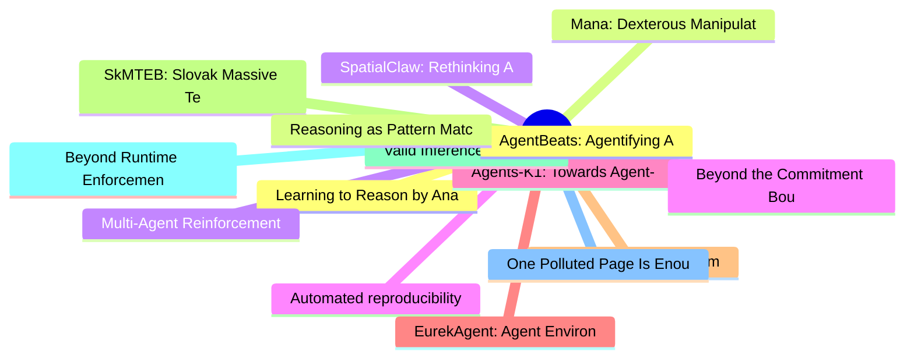

# arXiv 每日最新论文 (2026-06-13)

## 思维导图

## 列表（20 条）

### 1. Learning to Reason by Analogy via Retrieval-Augmented Reinforcement Fine-Tuning
- **作者**: Zilin Xiao
- **日期**: 2026-06-11
- **链接**: [http://arxiv.org/abs/2606.13680v1](http://arxiv.org/abs/2606.13680v1)
- **摘要**: Retrieval-augmented generation (RAG) has become a standard mechanism for grounding language models in external knowledge, yet conventional retrieval based on lexical or semantic similarity is poorly suited for complex reasoning tasks: a semantically similar problem may demand an entirely different s...

### 2. Mana: Dexterous Manipulation of Articulated Tools
- **作者**: Zhao-Heng Yin
- **日期**: 2026-06-11
- **链接**: [http://arxiv.org/abs/2606.13677v1](http://arxiv.org/abs/2606.13677v1)
- **摘要**: Articulated tool manipulation remains a major challenge in dexterous robotics due to the need to coordinate internal degrees of freedom and contact-rich interactions. While prior work has largely focused on rigid objects, articulated tool use remains underexplored because of its physical complexity ...

### 3. SpatialClaw: Rethinking Action Interface for Agentic Spatial Reasoning
- **作者**: Seokju Cho
- **日期**: 2026-06-11
- **链接**: [http://arxiv.org/abs/2606.13673v1](http://arxiv.org/abs/2606.13673v1)
- **摘要**: Spatial reasoning, the ability to determine where objects are, how they relate, and how they move in 3D, remains a fundamental challenge for vision-language models (VLMs). Tool-augmented agents attempt to address this by augmenting VLMs with specialist perception modules, yet their effectiveness is ...

### 4. Automated reproducibility assessments in the social and behavioral sciences using large language models
- **作者**: Tobias Holtdirk
- **日期**: 2026-06-11
- **链接**: [http://arxiv.org/abs/2606.13670v1](http://arxiv.org/abs/2606.13670v1)
- **摘要**: Reproducibility in the social and behavioral sciences is typically evaluated by independent researchers who reanalyze the original data to assess whether the published findings can be recovered. However, such approaches are resource-intensive and difficult to scale. Here, we show that large language...

### 5. Agents-K1: Towards Agent-native Knowledge Orchestration
- **作者**: Zongsheng Cao
- **日期**: 2026-06-11
- **链接**: [http://arxiv.org/abs/2606.13669v1](http://arxiv.org/abs/2606.13669v1)
- **摘要**: Current LLM-based research agents have advanced through agent orchestration, yet largely overlook scientific knowledge orchestration. Existing works often reduce papers to abstracts, surface mentions, and flat \texttt{cites} edges, omitting key entities, claims, evidence, mechanisms, and method line...

### 6. EurekAgent: Agent Environment Engineering is All You Need For Autonomous Scientific Discovery
- **作者**: Amy Xin
- **日期**: 2026-06-11
- **链接**: [http://arxiv.org/abs/2606.13662v1](http://arxiv.org/abs/2606.13662v1)
- **摘要**: LLM-based agents have shown increasing potential in automating scientific discovery. Given an optimizable metric and an execution environment, they can propose, validate, and iterate scientific solutions, and have produced results that outperform human-designed approaches. As model capabilities cont...

### 7. Before You Think: System 0, AI-Mediated Cognition and Cognitive Colonization
- **作者**: Marianna Bergamaschi Ganapini
- **日期**: 2026-06-11
- **链接**: [http://arxiv.org/abs/2606.13658v1](http://arxiv.org/abs/2606.13658v1)
- **摘要**: This paper examines three recent frameworks for understanding the cognitive and epistemic consequences of artificial intelligence: Tri-System Theory, Thinkframes, and System 0. It argues that while the first two capture important dimensions of AI's influence on individual reasoning and collective ep...

### 8. SkMTEB: Slovak Massive Text Embedding Benchmark and Model Adaptation
- **作者**: Marek Šuppa
- **日期**: 2026-06-11
- **链接**: [http://arxiv.org/abs/2606.13647v1](http://arxiv.org/abs/2606.13647v1)
- **摘要**: We introduce SkMTEB, the first comprehensive MTEB-style text embedding benchmark for Slovak, a low-resource West Slavic language, comprising 31 datasets across 7 task types -- nearly 4$\times$ the depth of existing multilingual benchmark coverage for Slovak. Our evaluation of 31 embedding models rev...

### 9. Valid Inference with Synthetic Data via Task Exchangeability
- **作者**: Lezhi Tan
- **日期**: 2026-06-11
- **链接**: [http://arxiv.org/abs/2606.13629v1](http://arxiv.org/abs/2606.13629v1)
- **摘要**: There is a proliferation of work arguing for the use of synthetic data in scientific research. For example, social scientists are arguing for the use of LLM-generated "silicon samples" in pilot studies; AI evaluations increasingly rely on "LLM-as-a-judge" outputs; and proteomics research is accelera...

### 10. Beyond Runtime Enforcement: Shield Synthesis as Defensibility Analysis for Adversarial Networks
- **作者**: Achraf Hsain
- **日期**: 2026-06-11
- **链接**: [http://arxiv.org/abs/2606.13621v1](http://arxiv.org/abs/2606.13621v1)
- **摘要**: Shielded reinforcement learning is typically presented as a runtime safety mechanism that compiles temporal-logic specifications into automata restricting an agent's actions. We argue this is the wrong product. The same automata-theoretic machinery -- specification compilation, product game construc...

### 11. One Polluted Page Is Enough: Evaluating Web Content Pollution in Generative Recommenders
- **作者**: Minghao Luo
- **日期**: 2026-06-11
- **链接**: [http://arxiv.org/abs/2606.13610v1](http://arxiv.org/abs/2606.13610v1)
- **摘要**: Search-augmented LLMs increasingly mediate everyday consumer recommendations by retrieving live web content. This creates a new risk: generative recommenders may consume polluted web content, such as fake reviews and promotional pages crafted to mislead recommendations. We ask: to what extent do sea...

### 12. AgentBeats: Agentifying Agent Assessment for Openness, Standardization, and Reproducibility
- **作者**: Xiaoyuan Liu
- **日期**: 2026-06-11
- **链接**: [http://arxiv.org/abs/2606.13608v1](http://arxiv.org/abs/2606.13608v1)
- **摘要**: Agent systems are advancing quickly across domains, but their evaluation remains fragmented. Most benchmarks rely on fixed, LLM-centric harnesses that require heavy integration, create test-production mismatch, and limit fair comparison across diverse agent designs. The root problem is the lack of a...

### 13. Reasoning as Pattern Matching: Shared Mechanisms in Human and LLM Everyday Reasoning
- **作者**: Zach Studdiford
- **日期**: 2026-06-11
- **链接**: [http://arxiv.org/abs/2606.13607v1](http://arxiv.org/abs/2606.13607v1)
- **摘要**: When large language models (LLMs) fail to generalize or make haphazard errors in reasoning, it is often taken as evidence that LLMs are not truly reasoning, but rather performing a kind of pattern matching. The implication is that people's behavior does not exhibit the same types of failures because...

### 14. Multi-Agent Reinforcement Learning from Delayed Marketplace Feedback for Objective-Weight Adaptation in Three-Sided Dispatch
- **作者**: Haochen Wu
- **日期**: 2026-06-11
- **链接**: [http://arxiv.org/abs/2606.13604v1](http://arxiv.org/abs/2606.13604v1)
- **摘要**: Dispatch in three-sided marketplaces provides a natural setting for reinforcement learning from world feedback: decisions are evaluated by delayed operational outcomes such as delivery speed, courier utilization, and merchant congestion. We present a deployed reinforcement learning system at DoorDas...

### 15. Beyond the Commitment Boundary: Probing Epiphenomenal Chain-of-Thought in Large Reasoning Models
- **作者**: Daniel Scalena
- **日期**: 2026-06-11
- **链接**: [http://arxiv.org/abs/2606.13603v1](http://arxiv.org/abs/2606.13603v1)
- **摘要**: Chain-of-thought (CoT) reasoning is the dominant paradigm for inference-time scaling in language models, yet the causal influence of individual steps on the final answer poorly understood. We estimate each step's causal importance via early exit and use this measure to study how answers form across ...

### 16. EpiBench: Verifiable Evaluation of AI Agents on Epigenomics Analysis
- **作者**: Harihara Muralidharan
- **日期**: 2026-06-11
- **链接**: [http://arxiv.org/abs/2606.13602v1](http://arxiv.org/abs/2606.13602v1)
- **摘要**: We introduce EpiBench, a verifiable benchmark for short-horizon epigenomics analysis. EpiBench evaluates whether agents can make well-defined analysis decisions from realistic workflow states and return deterministically gradable answers. The benchmark includes 106 evaluations across CUT\&Tag/CUT\&R...

### 17. Reward Modeling for Multi-Agent Orchestration
- **作者**: King Yeung Tsang
- **日期**: 2026-06-11
- **链接**: [http://arxiv.org/abs/2606.13598v1](http://arxiv.org/abs/2606.13598v1)
- **摘要**: Multi-Agent Systems (MAS) built on Large Language Models (LLMs) require effective orchestration to coordinate specialized agents, yet training such orchestrators is hindered by limited supervision and high computational cost. We propose Orchestration Reward Modeling (OrchRM), a self-supervised frame...

### 18. Multiagent Protocols with Aggregated Confidence Signals
- **作者**: Ali Elahi
- **日期**: 2026-06-11
- **链接**: [http://arxiv.org/abs/2606.13591v1](http://arxiv.org/abs/2606.13591v1)
- **摘要**: Confidence is used for reliability, oversight, and a range of downstream decision tasks in Natural Language Processing (NLP), yet no existing method produces or evaluates a confidence for the output of a multiagent system. Prior work uses confidence within multiagent debate (MAD) to weight messages,...

### 19. EvTexture++: Event-Driven Texture Enhancement for Video Super-Resolution
- **作者**: Dachun Kai
- **日期**: 2026-06-11
- **链接**: [http://arxiv.org/abs/2606.13580v1](http://arxiv.org/abs/2606.13580v1)
- **摘要**: Event-based vision has drawn increasing attention owing to its distinctive properties, including ultra-high temporal resolution and extreme dynamic range. Recent works have introduced it to video super-resolution (VSR) to enhance flow estimation and temporal alignment. In contrast, this paper shifts...

### 20. LabVLA: Grounding Vision-Language-Action Models in Scientific Laboratories
- **作者**: Baochang Ren
- **日期**: 2026-06-11
- **链接**: [http://arxiv.org/abs/2606.13578v1](http://arxiv.org/abs/2606.13578v1)
- **摘要**: Scientific laboratories increasingly rely on AI systems to reason about experiments, but the physical act of doing science remains largely outside their reach. AI can help read literature, generate hypotheses, and plan protocols, yet the execution of those protocols at the bench still requires a hum...
