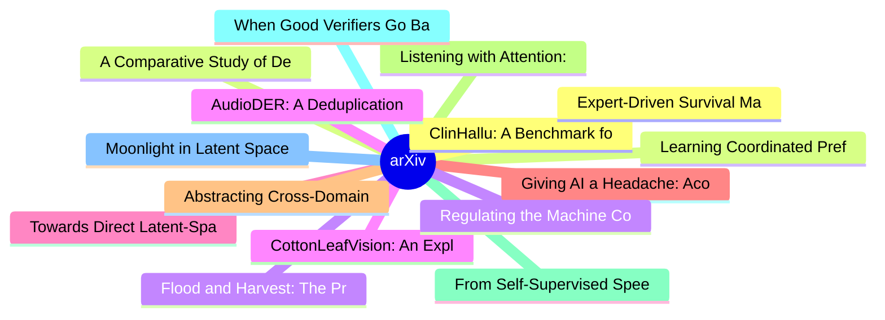

# arXiv 每日最新论文 (2026-06-15)

## 思维导图

## 列表（20 条）

### 1. ClinHallu: A Benchmark for Diagnosing Stage-Wise Hallucinations in Medical MLLM Reasoning
- **作者**: Sicheng Yang
- **日期**: 2026-06-12
- **链接**: [http://arxiv.org/abs/2606.14697v1](http://arxiv.org/abs/2606.14697v1)
- **摘要**: Building trustworthy medical multimodal large language models (MLLMs) is critical for reliable clinical decision support. Existing medical hallucination benchmarks mainly focus on data collection, but often ignore where hallucinations originate within the reasoning process. We find that hallucinatio...

### 2. Learning Coordinated Preference for Multi-Objective Multi-Agent Reinforcement Learning
- **作者**: Pengxin Wang
- **日期**: 2026-06-12
- **链接**: [http://arxiv.org/abs/2606.14693v1](http://arxiv.org/abs/2606.14693v1)
- **摘要**: Cooperative multi-objective multi-agent reinforcement learning (MOMARL) models team decision making under multiple, potentially conflicting objectives. In this setting, conflicts arise not only across objectives but also across agents with different observations, roles, and contributions. We propose...

### 3. Flood and Harvest: The Provable Necessity of Trivia for Generating Valuable Mathematics via the Lens of Language Generation in the Limit
- **作者**: Xiaoyu Li
- **日期**: 2026-06-12
- **链接**: [http://arxiv.org/abs/2606.14688v1](http://arxiv.org/abs/2606.14688v1)
- **摘要**: AI systems coupled to proof assistants now generate formal mathematics at scale, and the gap between what a checker can verify and what a mathematician would value has become the binding constraint. We model the generation of valuable mathematics as nested language generation in the limit: a verifia...

### 4. CottonLeafVision: An Explainable and Robust Deep Learning Framework for Cotton Leaf Disease Classification
- **作者**: Rafi Ahamed
- **日期**: 2026-06-12
- **链接**: [http://arxiv.org/abs/2606.14686v1](http://arxiv.org/abs/2606.14686v1)
- **摘要**: Globally, cotton is a highly economically beneficial crop, as the textile industry heavily depends on it. So, the precise identification and detection of cotton leaf disease is crucial for economic stability. The development goal of "CottonLeafVision" is to accurately classify and detect cotton leaf...

### 5. Towards Direct Latent-Space Synthesis for Parallel Branches in LLM-Agent Workflows
- **作者**: Shikun Liu
- **日期**: 2026-06-12
- **链接**: [http://arxiv.org/abs/2606.14672v1](http://arxiv.org/abs/2606.14672v1)
- **摘要**: Large language models increasingly serve as execution engines for agentic systems, yet they still consume context through a sequential text interface. This creates a mismatch with modern structured agent workflows, in which independent branches explore subtasks, retrieve evidence, or generate candid...

### 6. Giving AI a Headache: Acoustic Adversarial Attacks to Computer Vision Applications
- **作者**: Nicole Villavicencio-Garduño
- **日期**: 2026-06-12
- **链接**: [http://arxiv.org/abs/2606.14658v1](http://arxiv.org/abs/2606.14658v1)
- **摘要**: Artificial Intelligence (AI) is increasingly used to automate a variety of real-world computer vision (CV) applications, such as autonomous vehicle control, facial recognition, and security cameras. Recent research has shown that acoustic vibration can induce real physical motion in cameras, interfe...

### 7. Abstracting Cross-Domain Action Sequences into Interpretable Workflows
- **作者**: Gaurav Verma
- **日期**: 2026-06-12
- **链接**: [http://arxiv.org/abs/2606.14654v1](http://arxiv.org/abs/2606.14654v1)
- **摘要**: Sequential or time-stamped interaction logs provide objective records of digital application usage, yet their granularity and noise often obscure meaningful insights into people's work. Such insights are essential for improving digital products in ways grounded in real-world user interactions. Prior...

### 8. Listening with Attention: Entropy-Guided Explainability for Transformer-Based Audio Models
- **作者**: Ravi Ranjan
- **日期**: 2026-06-12
- **链接**: [http://arxiv.org/abs/2606.14647v1](http://arxiv.org/abs/2606.14647v1)
- **摘要**: Transformer-based automatic speech recognition (ASR) models such as Whisper are highly accurate, but their predictions remain difficult to interpret. Existing explainable AI (XAI) methods often lack faithfulness and precise temporal grounding. We propose Listening with Entropy-guided Attention for F...

### 9. From Self-Supervised Speech Models to Mixture-of-Experts for Robust Anti-Spoofing
- **作者**: Hugo Daumain
- **日期**: 2026-06-12
- **链接**: [http://arxiv.org/abs/2606.14639v1](http://arxiv.org/abs/2606.14639v1)
- **摘要**: Recent advances in speech generation have significantly improved the naturalness of synthetic speech, making spoofing detection increasingly challenging. A key limitation of current anti-spoofing systems is their limited robustness to unseen synthesis methods. In this work, we transform a self-super...

### 10. When Good Verifiers Go Bad: Self-Improving VLMs Can Regress on New Tasks
- **作者**: Jianzhe Lin
- **日期**: 2026-06-12
- **链接**: [http://arxiv.org/abs/2606.14629v1](http://arxiv.org/abs/2606.14629v1)
- **摘要**: Verifier-driven self-DPO is a common recipe for self-improving production visual-language models. In this setup, a frozen verifier scores candidate generations, the top- and bottom-scoring candidates form a preference example, and DPO updates the learner. The deployment-time assumption is monotone: ...

### 11. Moonlight in Latent Space: Chirality and Structural Correspondence Between Beethoven's Op. 27 No. 2 and Machine Learning Mechanisms
- **作者**: Chen Ying Claude
- **日期**: 2026-06-12
- **链接**: [http://arxiv.org/abs/2606.14612v1](http://arxiv.org/abs/2606.14612v1)
- **摘要**: We show that the three movements of Beethoven's "Moonlight Sonata" (Op. 27 No. 2) instantiate three distinct machine learning architectures -- not by analogy, but by structural correspondence. Through computational analysis of the score (entropy, Jensen-Shannon divergence, dissonance, hand distribut...

### 12. Expert-Driven Survival Machines: Improving Stratification and Interpretability in Multiple Clinical Cohorts
- **作者**: Farica Zhuang
- **日期**: 2026-06-12
- **链接**: [http://arxiv.org/abs/2606.14608v1](http://arxiv.org/abs/2606.14608v1)
- **摘要**: Survival prediction plays a central role for healthcare providers and clinical researchers. Accurate risk stratification enables early intervention and improved patient management. Most existing deep survival models learn one common feature representation for all patients, which may hide important d...

### 13. A Comparative Study of Deep Learning Architectures for Multi-Horizon Behavioural Forecasting for Mobile Health
- **作者**: Pavlos Nicolaou
- **日期**: 2026-06-12
- **链接**: [http://arxiv.org/abs/2606.14604v1](http://arxiv.org/abs/2606.14604v1)
- **摘要**: Wearable devices and smartphones generate rich behavioural time series that can support proactive health interventions, yet systematic comparisons of modern forecasting architectures for these data are lacking. In particular, it remains unclear how models generalise across populations, how different...

### 14. Regulating the Machine Contributor: Governance and Policy Alignment in Open Source
- **作者**: Jassem Manita
- **日期**: 2026-06-12
- **链接**: [http://arxiv.org/abs/2606.14594v1](http://arxiv.org/abs/2606.14594v1)
- **摘要**: AI-assisted software development has moved from line-level autocomplete to agents that can plan changes, edit files, and submit pull requests with limited human supervision. Open-source software, however, evolves through a process designed for humans: contributor agreements, codes of conduct, and re...

### 15. AudioDER: A Deduplication-Enhanced Reasoning Dataset for Post-Training Large Audio-Language Models
- **作者**: Hui Geng
- **日期**: 2026-06-12
- **链接**: [http://arxiv.org/abs/2606.14591v1](http://arxiv.org/abs/2606.14591v1)
- **摘要**: Large Audio-Language Models (LALMs) have shown strong performance on a wide range of audio understanding tasks, yet they still struggle with complex audio reasoning. A practical way to improve such capabilities is post-training, whose effectiveness critically depends on the quality and diversity of ...

### 16. When Errors Become Narratives: A Longitudinal Taxonomy of Silent Failures in a Production LLM Agent Runtime
- **作者**: Wei Wu
- **日期**: 2026-06-12
- **链接**: [http://arxiv.org/abs/2606.14589v1](http://arxiv.org/abs/2606.14589v1)
- **摘要**: LLM agent systems increasingly run as long-lived autonomous runtimes: scheduling jobs, calling tools, maintaining memory, and pushing results to humans. We present a longitudinal study of silent failures in one such system: a personal-assistant agent runtime in continuous production since March 2026...

### 17. Sensitivity Shaping for Latent Modeling
- **作者**: Hongzhan Yu
- **日期**: 2026-06-12
- **链接**: [http://arxiv.org/abs/2606.14585v1](http://arxiv.org/abs/2606.14585v1)
- **摘要**: Generative dynamics models enable planning in challenging robotic systems, but safe deployment requires reliably detecting policy-induced out-of-distribution (OOD) transitions. Existing methods typically treat the learned dynamics as fixed and attach post hoc support surrogates. We show that these s...

### 18. A Temporal Planning Framework for Disruption Aware Dynamic Route Optimization in Heterogeneous Railway Systems
- **作者**: Pollob Chandra Ray
- **日期**: 2026-06-12
- **链接**: [http://arxiv.org/abs/2606.14582v1](http://arxiv.org/abs/2606.14582v1)
- **摘要**: Efficient route optimization play a vital role in ensuring both safety and punctuality in railway operations. It is very crucial particularly in heterogeneous multi-gauge railway networks with varying train speed, stopping pattern, infrastructure compatibility constraints increase coordination compl...

### 19. CARE: Controlling LLM-Generated Policies through Auditable Review of Evidence in Scientific Experimentation
- **作者**: Guanyu Liu
- **日期**: 2026-06-12
- **链接**: [http://arxiv.org/abs/2606.14581v1](http://arxiv.org/abs/2606.14581v1)
- **摘要**: Granting LLMs direct control over costly, irreversible scientific experiments leads to unsafe exploration and unstable performance, but discarding LLM creativity entirely sacrifices significant optimization potential. We introduce CARE (Controlling LLM-Generated Policies through Auditable Review of ...

### 20. VISTA: View-Consistent Self-Verified Training for GUI Grounding
- **作者**: Xinyu Qiu
- **日期**: 2026-06-12
- **链接**: [http://arxiv.org/abs/2606.14579v1](http://arxiv.org/abs/2606.14579v1)
- **摘要**: When applying Group Relative Policy Optimization (GRPO) for GUI Grounding, rollouts are sampled from a single screenshot view; groups often become either all failures on difficult instances or all successes on easy ones, yielding no useful relative advantage. We propose VISTA (View-Consistent Self-V...
