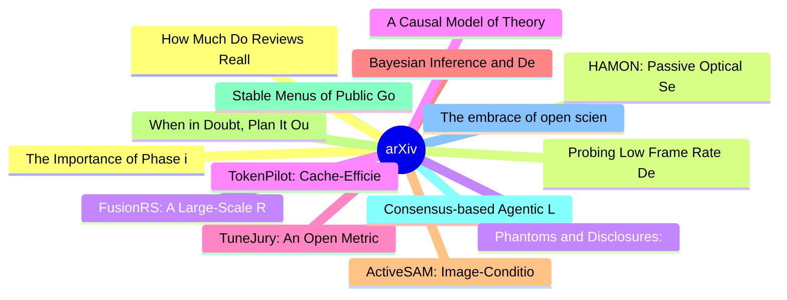

# arXiv 每日最新论文 (2026-06-16)

## 思维导图

## 列表（20 条）

### 1. The Importance of Phase in Neural Representations: An Internal Oppenheim-Lim Test of Image Classifiers
- **作者**: Alper Yıldırım
- **日期**: 2026-06-15
- **链接**: [http://arxiv.org/abs/2606.17037v1](http://arxiv.org/abs/2606.17037v1)
- **摘要**: Oppenheim and Lim (1981) showed that natural images stay recognizable when reconstructed from their Fourier phase alone, while the magnitude carries little of their identity. We ask whether trained image classifiers reproduce this asymmetry inside their hidden layers, and we test it causally: given ...

### 2. HAMON: Passive Optical Sequence Mixing for Long-Horizon Forecasting
- **作者**: Alper Yıldırım
- **日期**: 2026-06-15
- **链接**: [http://arxiv.org/abs/2606.17028v1](http://arxiv.org/abs/2606.17028v1)
- **摘要**: Simple linear and frequency-domain models remain surprisingly competitive in long-horizon time-series forecasting, and recent mechanistic evidence suggests that standard forecasting benchmarks may not require the dense superposed representations that make transformers powerful in other domains. This...

### 3. FusionRS: A Large-Scale RGB-Infrared Remote Sensing Dataset for Dual-Modal Vision-Language Foundation Models
- **作者**: Jiaju Han
- **日期**: 2026-06-15
- **链接**: [http://arxiv.org/abs/2606.17020v1](http://arxiv.org/abs/2606.17020v1)
- **摘要**: Remote sensing vision-language models have advanced Earth observation understanding, but most existing work remains centered on RGB imagery, leaving the complementary information in infrared data underexplored. Infrared images provide distinctive cues, including thermal intensity structures, object ...

### 4. TokenPilot: Cache-Efficient Context Management for LLM Agents
- **作者**: Buqiang Xu
- **日期**: 2026-06-15
- **链接**: [http://arxiv.org/abs/2606.17016v1](http://arxiv.org/abs/2606.17016v1)
- **摘要**: As LLM agents are deployed in long-horizon sessions, context accumulation drives up inference costs. Existing approaches utilize text pruning or dynamic memory eviction to minimize token footprints; however, their unconstrained sequence mutations alter layouts, introducing prefix mismatches and cach...

### 5. TuneJury: An Open Metric for Improving Music Generation Preference Alignment
- **作者**: Yonghyun Kim
- **日期**: 2026-06-15
- **链接**: [http://arxiv.org/abs/2606.17006v1](http://arxiv.org/abs/2606.17006v1)
- **摘要**: We introduce TuneJury, an open, instance-level pairwise reward model for text-to-music that predicts a music preference score from a text prompt and an audio clip. The released checkpoint is trained on publicly available human-preference labels covering arena-style (A vs. B) votes, metric-alignment ...

### 6. Bayesian Inference and Decision Audits for Public Archives of Frontier AI Evaluations
- **作者**: Yanan Long
- **日期**: 2026-06-15
- **链接**: [http://arxiv.org/abs/2606.17005v1](http://arxiv.org/abs/2606.17005v1)
- **摘要**: Public AI evaluations are often read as terminal leaderboards, yet the underlying evidence is a selective time series shaped by reporting rules, benchmark revisions, and missingness. Repeated public archives for LiveBench and Open LLM Leaderboard v2 serve as the primary longitudinal record; LMArena ...

### 7. ActiveSAM: Image-Conditional Class Pruning for Fast and Accurate Open-Vocabulary Segmentation
- **作者**: Tran Dinh Tien
- **日期**: 2026-06-15
- **链接**: [http://arxiv.org/abs/2606.16996v1](http://arxiv.org/abs/2606.16996v1)
- **摘要**: Segment Anything Model 3 (SAM 3) provides a strong frozen backbone for concept-prompted segmentation, but applying it directly to open-vocabulary semantic segmentation (OVSS) is inefficient: full-resolution decoding is typically run over the entire dataset vocabulary, whereas each image contains onl...

### 8. When in Doubt, Plan It Out: Committed Small Language Model Deliberation for Reactive Reinforcement Learning
- **作者**: Nathan Gavenski
- **日期**: 2026-06-15
- **链接**: [http://arxiv.org/abs/2606.16995v1](http://arxiv.org/abs/2606.16995v1)
- **摘要**: Reinforcement Learning (RL) policies often degrade in unfamiliar environments because they lack explicit deliberation. We propose Plan, Align, Commit, Think (PACT), a hybrid architecture that combines a fast, reactive RL policy with a slow, deliberative Small Language Model (SLM) planner. PACT invok...

### 9. Stable Menus of Public Goods: AI-Enabled Progress
- **作者**: Sara Fish
- **日期**: 2026-06-15
- **链接**: [http://arxiv.org/abs/2606.16989v1](http://arxiv.org/abs/2606.16989v1)
- **摘要**: Using an open problem from the EC 2025 paper "Stable Menus of Public Goods" as a testbed, we conduct experiments to understand the effectiveness of different AI-for-EconCS research workflows. Specifically, we study three questions: Does providing human intuition in the prompt help? Does automated mu...

### 10. Consensus-based Agentic Large Language Model Framework for Harmonized Tariff Schedule Code Classification
- **作者**: Truong Thanh Hung Nguyen
- **日期**: 2026-06-15
- **链接**: [http://arxiv.org/abs/2606.16987v1](http://arxiv.org/abs/2606.16987v1)
- **摘要**: Accurate Harmonized Tariff Schedule (HTS) code classification is essential for customs clearance, duty assessment, trade statistics, and regulatory compliance in maritime logistics. However, exact HTS classification remains challenging because product descriptions are often short, incomplete, or amb...

### 11. The embrace of open science: An analysis of a decade of AI research and 56 800 conference papers
- **作者**: Kevin L Coakley
- **日期**: 2026-06-15
- **链接**: [http://arxiv.org/abs/2606.16974v1](http://arxiv.org/abs/2606.16974v1)
- **摘要**: The reproducibility crisis has directed the AI research community toward improving documentation practices. Several studies have identified methodological issues, and in response, the most impactful venues in the field have introduced reproducibility checklists. We seek to understand whether documen...

### 12. How Much Do Reviews Really Contribute? A Study on Text-Enriched Matrix Factorization for Recommendations
- **作者**: Eduardo Ferreira da Silva
- **日期**: 2026-06-15
- **链接**: [http://arxiv.org/abs/2606.16973v1](http://arxiv.org/abs/2606.16973v1)
- **摘要**: Incorporating textual reviews into a Recommender System has become a prominent strategy for enriching collaborative signals with semantic information. However, the actual contribution of review-derived representations remains an open question, particularly when strong collaborative baselines are emp...

### 13. Probing Low Frame Rate Degradation in Neural Audio Codecs
- **作者**: Alex Gichamba
- **日期**: 2026-06-15
- **链接**: [http://arxiv.org/abs/2606.16969v1](http://arxiv.org/abs/2606.16969v1)
- **摘要**: Low frame rates in neural audio codecs are attractive for autoregressive speech synthesis, where the generation cost scales linearly with the sequence length. Recent work has demonstrated that codecs can operate at 12.5 Hz and below, but the mechanisms underlying low frame rate degradation remain in...

### 14. Phantoms and Disclosures: a Causal Framework for Auditing Synthetic Data
- **作者**: Kareem Amin
- **日期**: 2026-06-15
- **链接**: [http://arxiv.org/abs/2606.16952v1](http://arxiv.org/abs/2606.16952v1)
- **摘要**: The rapid adoption of generative AI and Large Language Models (LLMs) has spurred interest in synthetic data as a privacy-preserving alternative to sensitive real-world datasets. However, generating high-utility synthetic data often carries the risk of memorizing and regurgitating private information...

### 15. A Causal Model of Theory of Mind in Conflict for Artificial Intelligence
- **作者**: Nikolos Gurney
- **日期**: 2026-06-15
- **链接**: [http://arxiv.org/abs/2606.16944v1](http://arxiv.org/abs/2606.16944v1)
- **摘要**: Theory of mind (ToM), the capacity to ascribe mental states to others and use those ascriptions for prediction and inference, is widely assumed to be essential for effective human-machine integration. Existing AI-ToM models address \emph{how} to mentalize, but leave the question of when largely unad...

### 16. Scalable Circuit Learning for Interpreting Large Language Models
- **作者**: Naiyu Yin
- **日期**: 2026-06-15
- **链接**: [http://arxiv.org/abs/2606.16939v1](http://arxiv.org/abs/2606.16939v1)
- **摘要**: A prominent research direction in mechanistic interpretability is learning sparse circuits over LLM components to reveal how they jointly produce model behavior. However, raw neurons are polysemantic, making learned circuits hard to interpret. Sparse autoencoder (SAE) features alleviate this, but th...

### 17. CrossMaps: Confidence-Aware Open-Vocabulary Semantic Mapping for Rover Navigation
- **作者**: Jan-Niklas Klein
- **日期**: 2026-06-15
- **链接**: [http://arxiv.org/abs/2606.16935v1](http://arxiv.org/abs/2606.16935v1)
- **摘要**: Rovers rely on perception to maintain spatial maps that encode both objects and sensor quality (e.g., range reliability, lighting artifacts, data density), guiding data fusion, embedding updates, and navigation under partial observability. To study these coupled perception-navigation processes, we p...

### 18. A Unified Causal-Origin Taxonomy of Distributional Shifts in Reinforcement Learning
- **作者**: Ardianto Wibowo
- **日期**: 2026-06-15
- **链接**: [http://arxiv.org/abs/2606.16933v1](http://arxiv.org/abs/2606.16933v1)
- **摘要**: Reinforcement learning (RL) systems often degrade when operating conditions differ from those previously encountered, reflecting distributional shifts in the underlying data-generating process. Such shifts may occur between training and evaluation, as in In-Distribution (ID) and Out-of-Distribution ...

### 19. RAID: Semantic Graph Diffusion for True Cold-Start and Cross-Lingual Forecasting
- **作者**: Arunkumar V
- **日期**: 2026-06-15
- **链接**: [http://arxiv.org/abs/2606.16925v1](http://arxiv.org/abs/2606.16925v1)
- **摘要**: Time-series foundation models show strong transfer performance when given a non-empty history window. However, true cold-start scenarios, where a new item has no prior observations, violate this assumption. We propose RAID (Retrieval-Augmented Iterative Diffusion) a framework, which replaces history...

### 20. MA-SBI: Misspecification-Aware Simulation-Based Inference via Side-Channel Guidance
- **作者**: Arunkumar V
- **日期**: 2026-06-15
- **链接**: [http://arxiv.org/abs/2606.16923v1](http://arxiv.org/abs/2606.16923v1)
- **摘要**: Simulation-based inference (SBI) of latent parameters is often hindered by simulator misspecification, the mismatch between simulated and real-world observations caused by inherent modeling simplifications. RoPE, the recent state-of-the-art for robust SBI, addresses this through optimal transport be...
