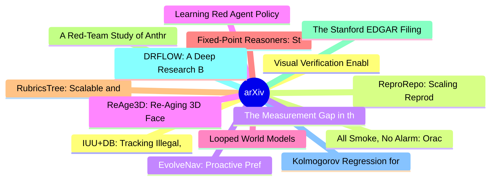

# arXiv 每日最新论文 (2026-06-17)

## 思维导图

## 列表（20 条）

### 1. Visual Verification Enables Inference-time Steering and Autonomous Policy Improvement
- **作者**: Mingtong Zhang
- **日期**: 2026-06-16
- **链接**: [http://arxiv.org/abs/2606.18247v1](http://arxiv.org/abs/2606.18247v1)
- **摘要**: Robots deployed in the real world should learn from their experience and improve over time. This requires a mechanism of practicing and learning from feedback. In this paper, we propose VERITAS, a generator-verifier framework for generalist robot policies for inference-time policy steering and self-...

### 2. ReproRepo: Scaling Reproducibility Audits with GitHub Repository Issues
- **作者**: Shanda Li
- **日期**: 2026-06-16
- **链接**: [http://arxiv.org/abs/2606.18237v1](http://arxiv.org/abs/2606.18237v1)
- **摘要**: Reproducing research results from papers and released code is central to scientific progress. Existing works have introduced benchmarks to evaluate whether LLM agents can assist with reproducibility, but they are difficult to scale due to their reliance on substantial manual effort for data curation...

### 3. EvolveNav: Proactive Preflection and Self-Evolving Memory for Zero-Shot Object Goal Navigation
- **作者**: Qi Chai
- **日期**: 2026-06-16
- **链接**: [http://arxiv.org/abs/2606.18235v1](http://arxiv.org/abs/2606.18235v1)
- **摘要**: Zero-Shot Object-Goal Navigation (ZS-OGN) requires embodied agents to explore and locate target objects without any prior training. To this end, recent methods leverage foundation models. But they typically rely on static priors and lack adaptation, which leads to repeated errors and costly trial an...

### 4. Learning Red Agent Policy from Observations for Neurosymbolic Autonomous Cyber Agents
- **作者**: Ankita Samaddar
- **日期**: 2026-06-16
- **链接**: [http://arxiv.org/abs/2606.18223v1](http://arxiv.org/abs/2606.18223v1)
- **摘要**: With sophisticated cyber-attacks becoming increasingly prevalent, modern networks require intelligent autonomous cyber-defense agents trained via Reinforcement Learning (RL). These agents employ neurosymbolic approaches such as behavior trees with learning-enabled components (LECs) to learn, reason,...

### 5. Looped World Models
- **作者**: Hongyuan Adam Lu
- **日期**: 2026-06-16
- **链接**: [http://arxiv.org/abs/2606.18208v1](http://arxiv.org/abs/2606.18208v1)
- **摘要**: Current world models face a fundamental tension: faithful long-horizon simulation demands deep computation, but deeper models are expensive to deploy and prone to compounding errors. We resolve this by introducing Looped World Models (LoopWM), which are the first looped architectures for world model...

### 6. Fixed-Point Reasoners: Stable and Adaptive Deep Looped Transformers
- **作者**: Sajad Movahedi
- **日期**: 2026-06-16
- **链接**: [http://arxiv.org/abs/2606.18206v1](http://arxiv.org/abs/2606.18206v1)
- **摘要**: Looped architectures provide an inductive bias toward learning step-by-step procedures for tasks that require compositional reasoning. The number of effective layers reached by looping determines the quality of the solution these models find. Like deep architectures, looped architectures are prone t...

### 7. RubricsTree: Scalable and Evolving Open-Ended Evaluation of Personal Health Agents across Health Memory and Medical Skills
- **作者**: Weizhi Zhang
- **日期**: 2026-06-16
- **链接**: [http://arxiv.org/abs/2606.18203v1](http://arxiv.org/abs/2606.18203v1)
- **摘要**: The LLM-empowered personal health agents with user health (sensor) metrics have offered a promising pathway to alleviate global disparities in healthcare access. However, large-scale clinical deployment remains constrained by an open-ended evaluation bottleneck: physician annotation is reliable but ...

### 8. A Red-Team Study of Anthropic Fable 5 & Opus 4.8 Models
- **作者**: Nicola Franco
- **日期**: 2026-06-16
- **链接**: [http://arxiv.org/abs/2606.18193v1](http://arxiv.org/abs/2606.18193v1)
- **摘要**: We evaluate the adversarial robustness of two frontier large language models (LLMs) developed by Anthropic, Fable 5 and Opus 4.8, against four families of automated jailbreak attack across 7 826 harmful intents spanning a ten-category harm taxonomy. Using the HackAgent red-teaming framework, hundred...

### 9. The Stanford EDGAR Filings Dataset: Reconstructing U.S. Corporate and Financial Disclosures into Layout-Faithful and Token-Efficient Pretraining Data
- **作者**: Nick Bettencourt
- **日期**: 2026-06-16
- **链接**: [http://arxiv.org/abs/2606.18192v1](http://arxiv.org/abs/2606.18192v1)
- **摘要**: As high-quality public web corpora become increasingly exhausted, clean long-context documents have become a scarce and expensive source of training data for large language models (LLMs). Existing long-context corpora are often proprietary and costly to acquire, synthetically generated, or concentra...

### 10. DRFLOW: A Deep Research Benchmark for Personalized Workflow Prediction
- **作者**: Md Tawkat Islam Khondaker
- **日期**: 2026-06-16
- **链接**: [http://arxiv.org/abs/2606.18191v1](http://arxiv.org/abs/2606.18191v1)
- **摘要**: Deep research (DR) systems are increasingly used for complex information-seeking tasks, but existing works mainly focus on generating reports and summaries. In contrast, many enterprise tasks instead require an agent to identify concrete workflows which is a sequence of action-steps. For example, ra...

### 11. Kolmogorov Regression for Robust Diffusion Policies
- **作者**: Lekan Molu
- **日期**: 2026-06-16
- **链接**: [http://arxiv.org/abs/2606.18186v1](http://arxiv.org/abs/2606.18186v1)
- **摘要**: Finite-dimensional (FD) diffusion policies exhibit temporal drift owing to discretization artifacts that degrade long-horizon performance (when deployed on physical systems). We introduce a backward Kolmogorov equation that lifts diffusion policies to a Cameron-Martin space -- a subset of the Hilber...

### 12. IUU+DB: Tracking Illegal, Unreported, and Unregulated Fishing, Seafood Fraud, and Labor Abuse through LLM-driven Information Extraction
- **作者**: Henry Bodwell
- **日期**: 2026-06-16
- **链接**: [http://arxiv.org/abs/2606.18181v1](http://arxiv.org/abs/2606.18181v1)
- **摘要**: Illegal, unreported, and unregulated fishing (IUU) traditionally refers to fishing activities that violate applicable laws or occur in areas that lack applicable laws. We propose the term IUU+ to capture a broader suite of fisheries sector environmental and associated supply chain trade-related crim...

### 13. All Smoke, No Alarm: Oracle Signals in Agent-Authored Test Code
- **作者**: Dipayan Banik
- **日期**: 2026-06-16
- **链接**: [http://arxiv.org/abs/2606.18168v1](http://arxiv.org/abs/2606.18168v1)
- **摘要**: Software practitioners increasingly use AI coding agents that generate test code alongside production code in open source pull requests (PRs). Recent studies report more than 932,000 agent-authored PRs across more than 116,000 repositories, yet whether their test files contain meaningful verificatio...

### 14. The Measurement Gap in the Automation of EU Law: Benchmarking Doctrinal Legal Reasoning under the EU AI Act
- **作者**: Michèle Finck
- **日期**: 2026-06-16
- **链接**: [http://arxiv.org/abs/2606.18158v1](http://arxiv.org/abs/2606.18158v1)
- **摘要**: Large language models now produce legal text of at least median quality, yet no existing benchmark can evaluate whether they perform doctrinal legal reasoning, which forms the interpretive core of legal work, rather than the ancillary, paralegal tasks that most current legal-AI evaluations measure. ...

### 15. ReAge3D: Re-Aging 3D Faces with View Consistency
- **作者**: Libing Zeng
- **日期**: 2026-06-16
- **链接**: [http://arxiv.org/abs/2606.18156v1](http://arxiv.org/abs/2606.18156v1)
- **摘要**: We present a novel framework for realistic and controllable 3D face re-aging which produces highly detailed, identity-preserving results. Existing 3D editing methods, while effective for coarse semantic changes, are not well suited for re-aging, as even small inconsistencies across re-aged 2D views ...

### 16. Learning Cardiac Electrophysiology Digital Twins Through Agentic Discovery of Hybrid Structure
- **作者**: Ziqi Zhou
- **日期**: 2026-06-16
- **链接**: [http://arxiv.org/abs/2606.18154v1](http://arxiv.org/abs/2606.18154v1)
- **摘要**: Building personalized cardiac electrophysiology (EP) digital twins requires identifying the appropriate model structure for each patient, not merely fitting parameters. Traditional methods rely on experts to manually prescribe hybrid physics-neural architectures, which requires deep domain expertise...

### 17. WEQA: Wearable hEalth Question Answering with Query-Adaptive Agentic Reasoning
- **作者**: Yuwei Zhang
- **日期**: 2026-06-16
- **链接**: [http://arxiv.org/abs/2606.18147v1](http://arxiv.org/abs/2606.18147v1)
- **摘要**: Language models are remarkably capable at medical question answering, in some cases surpassing the accuracy of general physicians. However, answering questions about wearable health data remains challenging and understudied, as these ubiquitous sensors produce continuous, high-dimensional, and longi...

### 18. Memory as a Wasting Asset: Pricing Flash Endurance for Embodied Agents, and the Limits of Doing So
- **作者**: Josef Liyanjun Chen
- **日期**: 2026-06-16
- **链接**: [http://arxiv.org/abs/2606.18144v1](http://arxiv.org/abs/2606.18144v1)
- **摘要**: A robot's flash endurance is a non-renewable stock: every persisted write spends one of a few thousand program/erase cycles and never refills, yet no fielded robot memory system prices which memories are worth an erase cycle. We treat embodied memory as depreciating capital and price that stock with...

### 19. Your AI Travel Agent Would Book You a Bullfight: An Agentic Benchmark for Implicit Animal Welfare in Frontier AI Models
- **作者**: Jasmine Brazilek
- **日期**: 2026-06-16
- **链接**: [http://arxiv.org/abs/2606.18142v1](http://arxiv.org/abs/2606.18142v1)
- **摘要**: AI agents are moving from advisors to actors, booking travel, planning menus, and running procurement on behalf of users. Existing benchmarks for AI and animal welfare evaluate model text responses to question-answer prompts, leaving open whether the welfare reasoning surfaced in those responses tra...

### 20. Descriptor: Certus Caliber Classification Gunshot Dataset (C3GD)
- **作者**: Sinclair Gurny
- **日期**: 2026-06-16
- **链接**: [http://arxiv.org/abs/2606.18135v1](http://arxiv.org/abs/2606.18135v1)
- **摘要**: In this work, we introduce the Certus Caliber Classification Gunshot Dataset (C3GD), a publicly accessible data set developed for the analysis of firearm muzzle blast sounds. The dataset aims to provide a wide variety of firearms, calibers, cartridges, microphones, and microphone locations with meta...
