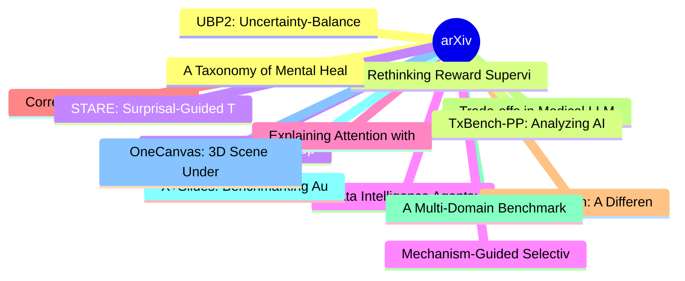

# arXiv 每日最新论文 (2026-06-18)

## 思维导图

## 列表（20 条）

### 1. UBP2: Uncertainty-Balanced Preference Planning for Efficient Preference-based Reinforcement Learning
- **作者**: Mohamed Nabail
- **日期**: 2026-06-17
- **链接**: [http://arxiv.org/abs/2606.19328v1](http://arxiv.org/abs/2606.19328v1)
- **摘要**: Preference-based RL provides an approach to learning reward models from pairwise comparisons of behaviors, bypassing the need for explicit reward design. However, existing methods typically rely on passive data collection and suffer from poor sample efficiency, especially during the early stages of ...

### 2. Rethinking Reward Supervision: Rubric-Conditioned Self-Distillation
- **作者**: Siyi Gu
- **日期**: 2026-06-17
- **链接**: [http://arxiv.org/abs/2606.19327v1](http://arxiv.org/abs/2606.19327v1)
- **摘要**: Post-training of reasoning language models is commonly driven by supervised distillation and reinforcement learning with verifiable rewards. Distillation often relies on chain-of-thought annotations that are expensive to obtain and may themselves be noisy, incomplete, or partially incorrect; even wh...

### 3. Reference-Driven Multi-Speaker Audio Scene Generation from In-the-Wild Priors
- **作者**: Michael Finkelson
- **日期**: 2026-06-17
- **链接**: [http://arxiv.org/abs/2606.19325v1](http://arxiv.org/abs/2606.19325v1)
- **摘要**: Existing multi-speaker dialogue systems bind speakers to utterances through structured supervision: per-turn tags, multi-stream transcriptions, or learnable speaker embeddings. These systems operate within speech-only pipelines that produce clean vocal sequences without the ambient texture of real c...

### 4. Data Intelligence Agents: Interpreting, Modeling, and Querying Enterprise Data via Autonomous Coding Agents
- **作者**: Anoushka Vyas
- **日期**: 2026-06-17
- **链接**: [http://arxiv.org/abs/2606.19319v1](http://arxiv.org/abs/2606.19319v1)
- **摘要**: Production data integration is bottlenecked by repeated, lossy handoffs between data owners, engineers, and analysts who must collaboratively discover, structure, and query enterprise data. We present Data Intelligence Agents (DIA), a system of three agents (Data Interpreter, Schema Creator, and Que...

### 5. Explaining Attention with Program Synthesis
- **作者**: Amiri Hayes
- **日期**: 2026-06-17
- **链接**: [http://arxiv.org/abs/2606.19317v1](http://arxiv.org/abs/2606.19317v1)
- **摘要**: A longstanding goal of research on interpretable deep learning is to replace opaque neural computations with human-meaningful symbolic descriptions. In this paper, we propose an approach for approximating the behavior of components of deep networks with executable programs. We focus on attention hea...

### 6. Correct Yourself, Keep My Trust: How Self-Correction and Social Connection Shape Credibility in Social Chatbots
- **作者**: Biswadeep Sen
- **日期**: 2026-06-17
- **链接**: [http://arxiv.org/abs/2606.19286v1](http://arxiv.org/abs/2606.19286v1)
- **摘要**: When social chatbots make mistakes, and they do, how they recover determines whether users trust them again. Social chatbots are increasingly integrated into everyday life, yet they remain prone to generating convincing but inaccurate information. The social connection they build with users makes su...

### 7. NeSyCat Torch: A Differentiable Tensor Implementation of Categorical Semantics for Neurosymbolic Learning
- **作者**: Daniel Romero Schellhorn
- **日期**: 2026-06-17
- **链接**: [http://arxiv.org/abs/2606.19279v1](http://arxiv.org/abs/2606.19279v1)
- **摘要**: Neurosymbolic semantics is fragmented: classical, fuzzy, probabilistic and neural systems each define truth by their own inductive rules. NeSyCat, extending ULLER, subsumes them under a single inductive definition of truth, parametric in a strong monad and an aggregation structure on truth-values. N...

### 8. Trade-offs in Medical LLM Adaptation: An Empirical Study in French QA
- **作者**: Ikram Belmadani
- **日期**: 2026-06-17
- **链接**: [http://arxiv.org/abs/2606.19266v1](http://arxiv.org/abs/2606.19266v1)
- **摘要**: The development of large language models (LLMs) has led to an increased focus on their adaptation to specialized domains and languages, yet the effectiveness of domain adaptation strategies remains unclear. We present a study of medical domain adaptation using French medical question-answering (QA) ...

### 9. A Multi-Domain Benchmark for Detecting AI-Generated Text-Rich Images from GPT-Image-2
- **作者**: Yijin Wang
- **日期**: 2026-06-17
- **链接**: [http://arxiv.org/abs/2606.19259v1](http://arxiv.org/abs/2606.19259v1)
- **摘要**: Text-rich images often contain privacy-sensitive, transactional, or decision-relevant information. As recent multimodal image generation models become increasingly capable of synthesizing realistic textual content and structured visual designs, detecting AI-generated text-rich images has become an i...

### 10. X+Slides: Benchmarking Audience-Conditioned Slide Generation
- **作者**: Haodong Chen
- **日期**: 2026-06-17
- **链接**: [http://arxiv.org/abs/2606.19256v1](http://arxiv.org/abs/2606.19256v1)
- **摘要**: Automatically generating slide decks from source documents is an important application of large language models (LLMs). Existing benchmarks primarily assess slide completeness and technical depth, while overlooking the target audience as a critical real-world factor. For instance, specialists demand...

### 11. OneCanvas: 3D Scene Understanding via Panoramic Reprojection
- **作者**: Bartłomiej Baranowski
- **日期**: 2026-06-17
- **链接**: [http://arxiv.org/abs/2606.19253v1](http://arxiv.org/abs/2606.19253v1)
- **摘要**: Existing approaches to 3D scene understanding in Vision-Language Models (VLMs) either rely on complex, model-specific geometry encoders or large training budgets in pursuit of spatial reasoning. Instead, OneCanvas aggregates patch features from all views onto a single equirectangular panoramic canva...

### 12. A Taxonomy of Mental Health and Technology Needs for Alzheimer's and Dementia Caregivers
- **作者**: Keran Wang
- **日期**: 2026-06-17
- **链接**: [http://arxiv.org/abs/2606.19247v1](http://arxiv.org/abs/2606.19247v1)
- **摘要**: Family members caring for individuals with Alzheimer's disease and related dementias (AD/ADRD) provide the foundation of long-term care worldwide. In 2023, more than 11 million U.S. family and friends contributed 18 billion hours of unpaid care, often at the cost of their own physical and mental hea...

### 13. TxBench-PP: Analyzing AI Agent Performance on Small-Molecule Preclinical Pharmacology
- **作者**: Hannah Le
- **日期**: 2026-06-17
- **链接**: [http://arxiv.org/abs/2606.19245v1](http://arxiv.org/abs/2606.19245v1)
- **摘要**: Artificial intelligence (AI) agents promise to accelerate drug discovery by compressing interpretation and decision-making loops, but practical deployment requires trusted evaluation on realistic program decisions. We introduce TherapeuticsBench Preclinical Pharmacology (TxBench-PP), a verifiable be...

### 14. STARE: Surprisal-Guided Token-Level Advantage Reweighting for Policy Entropy Stability
- **作者**: Haipeng Luo
- **日期**: 2026-06-17
- **链接**: [http://arxiv.org/abs/2606.19236v1](http://arxiv.org/abs/2606.19236v1)
- **摘要**: Reinforcement Learning with Verifiable Rewards algorithms like GRPO have emerged as the dominant post-training paradigm for complex reasoning in LLMs, yet commonly suffer from policy entropy collapse during training. We conduct a first-order gradient analysis of token-level entropy dynamics under GR...

### 15. Mechanism-Guided Selective Unlearning for RLVR-Induced Reasoning
- **作者**: Chenyu Zhou
- **日期**: 2026-06-17
- **链接**: [http://arxiv.org/abs/2606.19222v1](http://arxiv.org/abs/2606.19222v1)
- **摘要**: We propose MAST (Mechanism-Aligned Selective Targeting), a mechanism-guided method for unlearning RLVR-induced reasoning with substantially lower collateral damage than standard full-parameter updates. In matched SFT/RLVR checkpoints on Qwen2.5-Math-1.5B and Qwen3-1.7B-Base, the SFT-to-RLVR incremen...

### 16. Machine Unlearning for the XGBoost Model with Network Intrusion Datasets
- **作者**: Diana Magalhães
- **日期**: 2026-06-17
- **链接**: [http://arxiv.org/abs/2606.19220v1](http://arxiv.org/abs/2606.19220v1)
- **摘要**: Machine Unlearning (MU) has emerged as an important technique for removing specific data points from trained models without requiring full retraining. However, most existing MU research focuses on deep learning and image data, leaving a gap in the domain of network intrusion detection, which relies ...

### 17. Forecasting what Matters: Decision-Focused RL for Controlled EV Charging with Unknown Departure Times
- **作者**: Giuseppe Gabriele
- **日期**: 2026-06-17
- **链接**: [http://arxiv.org/abs/2606.19199v1](http://arxiv.org/abs/2606.19199v1)
- **摘要**: The recent growth of EV adoption poses challenges for power systems, including increased peak demand and potential grid instability. Smart control of EV charging -- e.g., based on reinforcement learning (RL) -- can alleviate these issues by learning temporal and contextual patterns from historical d...

### 18. The More the Merrier: Combining Properties for ABox Abduction under Repair Semantics for ELbot
- **作者**: Anselm Haak
- **日期**: 2026-06-17
- **链接**: [http://arxiv.org/abs/2606.19197v1](http://arxiv.org/abs/2606.19197v1)
- **摘要**: Abduction is a central approach to explain missing entailments from a knowledge base by providing a hypothesis, that would, if added to the knowledge base, make the missing entailment become true. Abduction under repair semantics has recently been investigated in detail, where several desirable prop...

### 19. Language Models as Interfaces, Not Oracles: A Hybrid LLM-ML System for Pediatric Appendicitis
- **作者**: Soheyl Bateni
- **日期**: 2026-06-17
- **链接**: [http://arxiv.org/abs/2606.19183v1](http://arxiv.org/abs/2606.19183v1)
- **摘要**: Large language models (LLMs) can make clinical decision support more accessible by interpreting free-text documentation, but their direct use as diagnostic engines is limited by sensitivity to prompts, information order, and plausible but incorrect outputs. Structured machine-learning models offer m...

### 20. Compute Efficiency and Serial Runtime Tradeoffs for Stochastic Momentum Methods
- **作者**: Depen Morwani
- **日期**: 2026-06-17
- **链接**: [http://arxiv.org/abs/2606.19179v1](http://arxiv.org/abs/2606.19179v1)
- **摘要**: Stochastic momentum methods such as heavy ball (HB), Nesterov momentum, and variants of Accelerated SGD (ASGD) [Kidambi et al., 2018] are widely used in modern training, but their stochastic benefits depend on two distinct quantities: serial runtime, the number of iterations needed to reach a target...
