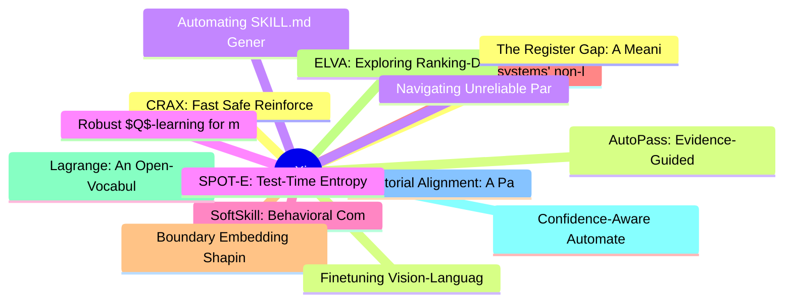

# arXiv 每日最新论文 (2026-06-19)

## 思维导图

## 列表（20 条）

### 1. CRAX: Fast Safe Reinforcement Learning Benchmarking
- **作者**: Tristan Tomilin
- **日期**: 2026-06-18
- **链接**: [http://arxiv.org/abs/2606.20376v1](http://arxiv.org/abs/2606.20376v1)
- **摘要**: Safety is a core concern for deploying reinforcement learning (RL) agents in real-world domains such as robotics and autonomous driving. While benchmarks have been central to progress in RL, existing safety benchmarks with high-fidelity 3D physics remain computationally slow, limiting large-scale ex...

### 2. AutoPass: Evidence-Guided LLM Agents for Compiler Performance Tuning
- **作者**: Zepeng Li
- **日期**: 2026-06-18
- **链接**: [http://arxiv.org/abs/2606.20373v1](http://arxiv.org/abs/2606.20373v1)
- **摘要**: Large Language Models (LLMs) show promise for code compilation tasks, but applying them to runtime performance tuning is difficult due to complex microarchitectural effects and noisy runtime measurements. We present AutoPass, a multi-agent framework for compiler performance tuning that uses compiler...

### 3. Automating SKILL.md Generation for Computer-Using Agents via Interaction Trajectory Mining
- **作者**: Yuexing Hao
- **日期**: 2026-06-18
- **链接**: [http://arxiv.org/abs/2606.20363v1](http://arxiv.org/abs/2606.20363v1)
- **摘要**: Explicit skill libraries make computer-using agents easier to inspect, but it remains unclear whether such libraries can be mined from interaction data in a way that improves downstream policies. We study this question through a three-stage pipeline that segments GUI trajectories, clusters segments ...

### 4. Robust $Q$-learning for mean-field control under Wasserstein uncertainty in common noise
- **作者**: Mathieu Laurière
- **日期**: 2026-06-18
- **链接**: [http://arxiv.org/abs/2606.20356v1](http://arxiv.org/abs/2606.20356v1)
- **摘要**: In this article, we present a robust $Q$-learning algorithm for discrete-time mean-field control problems under Wasserstein uncertainty in the common noise law. The algorithm combines a quantization-and-projection scheme with a Wasserstein dual reformulation on the common-noise space. We establish i...

### 5. SoftSkill: Behavioral Compression for Contextual Adaptation
- **作者**: Xijia Tao
- **日期**: 2026-06-18
- **链接**: [http://arxiv.org/abs/2606.20333v1](http://arxiv.org/abs/2606.20333v1)
- **摘要**: Agent skills are commonly deployed as natural-language Markdown files that encode answer policies, evidence-use habits, and task procedures. These files are readable and portable, but they are consumed indirectly: for each task instance, a frozen language model must translate a long textual artifact...

### 6. Leveraging systems' non-linearity to tackle the scarcity of data in the design of Intelligent Fault Diagnosis Systems
- **作者**: Giancarlo Santamato
- **日期**: 2026-06-18
- **链接**: [http://arxiv.org/abs/2606.20323v1](http://arxiv.org/abs/2606.20323v1)
- **摘要**: Deep Transfer Learning (DTL) allows for the efficient building of Intelligent Fault Diagnosis Systems (IFDS). On the other hand, DTL methods still heavily rely on large amounts of labelled data. Obtaining such an amount of data can be challenging when dealing with machines or structures faults. This...

### 7. Boundary Embedding Shaping with Adaptive Contrastive Learning for Graph Structural Disentanglement
- **作者**: Jiaqing Chen
- **日期**: 2026-06-18
- **链接**: [http://arxiv.org/abs/2606.20283v1](http://arxiv.org/abs/2606.20283v1)
- **摘要**: Graph neural networks (GNNs) excel at aggregating neighbor information for classification, yet their performance is hindered by graph structural entanglement, where spurious correlations from semantically irrelevant neighbors contaminate node embeddings. This challenge is most acute for nodes near c...

### 8. ELVA: Exploring Ranking-Driven Universal Multimodal Retrieval
- **作者**: Yuhan Liu
- **日期**: 2026-06-18
- **链接**: [http://arxiv.org/abs/2606.20280v1](http://arxiv.org/abs/2606.20280v1)
- **摘要**: Leveraging Multimodal Large Language Models (MLLMs) via contrastive learning has become a mainstream paradigm for improving the performance of Universal Multimodal Retrieval (UMR). However, previous works have ignored the grain blindness when adapting the contrastive paradigm into retrieval tasks. G...

### 9. Lagrange: An Open-Vocabulary, Energy-Based Sparse Framework for Generalized End-to-End Driving
- **作者**: Shihao Ji
- **日期**: 2026-06-18
- **链接**: [http://arxiv.org/abs/2606.20274v1](http://arxiv.org/abs/2606.20274v1)
- **摘要**: Scaling end-to-end autonomous driving to complex, open-world environments requires perceptual models that generalize to anomalous scenarios and planners that produce kinematically valid trajectories. Existing paradigms face a distinct dichotomy between representational efficiency and generalization ...

### 10. Confidence-Aware Automated Assessment of Student-Drawn Scientific Models
- **作者**: Luyang Fang
- **日期**: 2026-06-18
- **链接**: [http://arxiv.org/abs/2606.20264v1](http://arxiv.org/abs/2606.20264v1)
- **摘要**: Student-generated drawings are widely used in science education to assess learners' conceptual understanding in modeling-based tasks aligned with the Next Generation Science Standards (NGSS). However, scoring such drawings requires expert human judgment to interpret complex visual representations, m...

### 11. Editorial Alignment: A Participatory Approach to Engaging Editorial Expertise in LLM-mediated Knowledge Dissemination
- **作者**: Simon Aagaard Enni
- **日期**: 2026-06-18
- **链接**: [http://arxiv.org/abs/2606.20258v1](http://arxiv.org/abs/2606.20258v1)
- **摘要**: The emergence of LLM-driven information services is reshaping the conditions under which public knowledge institutions operate, threatening to absorb the editorial function these institutions exist to exercise. While LLMs offer powerful new affordances for knowledge dissemination, editorial authorit...

### 12. The Register Gap: A Meaning Intelligence Framework for Nigerian Public Discourse
- **作者**: Celestine Achi
- **日期**: 2026-06-18
- **链接**: [http://arxiv.org/abs/2606.20255v1](http://arxiv.org/abs/2606.20255v1)
- **摘要**: We introduce the Meaning Intelligence Framework (MIF), a nine-dimension annotation and evaluation schema for Nigerian public discourse that separates surface sentiment from true communicative intent. Existing benchmarks for Nigerian languages, including NaijaSenti and AfriSenti, treat sentiment clas...

### 13. Finetuning Vision-Language-Action Models Requires Fewer Layers Than You Think
- **作者**: Gia-Binh Nguyen
- **日期**: 2026-06-18
- **链接**: [http://arxiv.org/abs/2606.20246v1](http://arxiv.org/abs/2606.20246v1)
- **摘要**: Vision-Language-Action (VLA) models pre-trained on massive video-robot datasets have revolutionized robotic manipulation, yet their multi-billion parameter architectures impose prohibitive computational burdens during downstream fine-tuning and real-time inference. In this work, we reveal a highly n...

### 14. Navigating Unreliable Parametric and Contextual Knowledge: Explicit Knowledge Conflict Resolution for LLM Inference
- **作者**: Huang Peng
- **日期**: 2026-06-18
- **链接**: [http://arxiv.org/abs/2606.20245v1](http://arxiv.org/abs/2606.20245v1)
- **摘要**: Large language models (LLMs) have achieved strong performance across a wide range of language-based tasks by leveraging both extensive parametric knowledge and in-context learning ability, enabling them to incorporate external information provided in the input prompt. However, the integration of ext...

### 15. SPOT-E: Test-Time Entropy Shaping with Visual Spotlights for Frozen VLMs
- **作者**: Bo Yin
- **日期**: 2026-06-18
- **链接**: [http://arxiv.org/abs/2606.20244v1](http://arxiv.org/abs/2606.20244v1)
- **摘要**: Vision-language models (VLMs) often underperform on evidence intensive tasks because decisive visual evidence are small, localized, and easy to overlook, leading to failures in evidence readout even when high-level reasoning is intact. Prior inference-time visual interventions can improve grounding ...

### 16. A Multi-Agent system for Multi-Objective constrained optimization
- **作者**: Federica Filippini
- **日期**: 2026-06-18
- **链接**: [http://arxiv.org/abs/2606.20236v1](http://arxiv.org/abs/2606.20236v1)
- **摘要**: Many decision-making problems in computing and networking systems can be naturally formulated as cost-minimization problems under performance constraints. In dynamic environments, reinforcement learning (RL) is often used to solve such problems at runtime by embedding both costs and constraint viola...

### 17. ScholarQuest: A Taxonomy-Guided Benchmark for Agentic Academic Paper Search in Open Literature Environments
- **作者**: Tingyue Pan
- **日期**: 2026-06-18
- **链接**: [http://arxiv.org/abs/2606.20235v1](http://arxiv.org/abs/2606.20235v1)
- **摘要**: Academic paper search is a core step in scientific research, and LLM-based search agents are emerging as a promising paradigm for iterative, intent-driven literature exploration. However, existing benchmarks are insufficient for systematically evaluating agentic academic search under realistic open ...

### 18. Thermodynamic Measure of Intelligence
- **作者**: Ishanu Chattopadhyay
- **日期**: 2026-06-18
- **链接**: [http://arxiv.org/abs/2606.20231v1](http://arxiv.org/abs/2606.20231v1)
- **摘要**: Can intelligence be measured? We propose that intelligence can be defined as the lawful amplification of rare but valid futures: a system increases the probability of outcomes that would be unlikely under passive dynamics but remain admissible under the constraints of the domain. We start with the p...

### 19. QMFOL: Benchmarking Large Language Model Reasoning via Quantifiable Monadic First-Order Logic Test Case Generation
- **作者**: Xinyi Zheng
- **日期**: 2026-06-18
- **链接**: [http://arxiv.org/abs/2606.20227v1](http://arxiv.org/abs/2606.20227v1)
- **摘要**: Large Language Models (LLMs) have made significant progress in reasoning, particularly in deductive reasoning, which is crucial for high-stakes decision-making. As models improve, evaluation benchmarks should evolve to keep pace. However, existing benchmarks lack fine-grained control over logical co...

### 20. Learner-based Concept Drift Detection: Analysis and Evaluation
- **作者**: Md Moman Ul Haque Khan
- **日期**: 2026-06-18
- **链接**: [http://arxiv.org/abs/2606.20216v1](http://arxiv.org/abs/2606.20216v1)
- **摘要**: Machine learning algorithms deployed for evolving streaming environments must handle the non-stationary data distributions, commonly referred to as concept drift. The presence of concept drift poses a major challenge for many real-world applications because it can severely degrade their predictive p...
