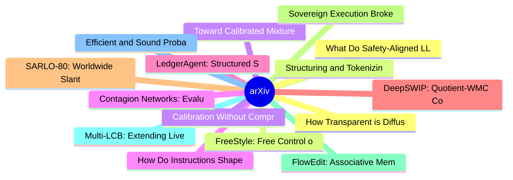

# arXiv 每日最新论文 (2026-06-20)

## 思维导图

## 列表（20 条）

### 1. How Transparent is DiffusionGemma?
- **作者**: Joshua Engels
- **日期**: 2026-06-18
- **链接**: [http://arxiv.org/abs/2606.20560v1](http://arxiv.org/abs/2606.20560v1)
- **摘要**: LLM reasoning transparency is a critical affordance for understanding model decisions, mitigating misuse and misalignment, and debugging surprising model behaviors. However, DiffusionGemma performs a larger fraction of its computation in a continuous latent space; does this make its reasoning less t...

### 2. Structuring and Tokenizing Distributed User Interest Context for Generative Recommendation
- **作者**: Ruizhong Qiu
- **日期**: 2026-06-18
- **链接**: [http://arxiv.org/abs/2606.20554v1](http://arxiv.org/abs/2606.20554v1)
- **摘要**: Generative recommendation is an emerging paradigm that has shown promise in industrial recommendation systems, aiming to predict users' next interactions from their historical behaviors. At the core of generative recommendation lies item tokenization, which bridges item semantics and recommendation ...

### 3. Toward Calibrated Mixture-of-Experts Under Distribution Shift
- **作者**: Gina Wong
- **日期**: 2026-06-18
- **链接**: [http://arxiv.org/abs/2606.20544v1](http://arxiv.org/abs/2606.20544v1)
- **摘要**: Calibration aligns a model's predictive uncertainty with the frequencies of its empirical outcomes and is important for understanding and trusting reported probabilities. Recent work shows that enforcing calibration at the level of individual predictors can improve ensemble accuracy and calibration,...

### 4. How Do Instructions Shape Speech? Cross-Attention Attribution for Style-Captioned Text-to-Speech
- **作者**: Nityanand Mathur
- **日期**: 2026-06-18
- **链接**: [http://arxiv.org/abs/2606.20532v1](http://arxiv.org/abs/2606.20532v1)
- **摘要**: Style-captioned text-to-speech systems use natural language to control voice characteristics, but how individual words influence acoustic output remains unclear. Understanding this is critical for diagnosing failure modes and improving controllability in expressive TTS. We propose cross-attention at...

### 5. LedgerAgent: Structured State for Policy-Adherent Tool-Calling Agents
- **作者**: Md Nayem Uddin
- **日期**: 2026-06-18
- **链接**: [http://arxiv.org/abs/2606.20529v1](http://arxiv.org/abs/2606.20529v1)
- **摘要**: Policy-adherent tool-calling agents in customer-service domains must maintain task states across turns while calling tools and obeying domain policies. Task states consist of relevant facts, identifiers, constraints, and conditions observed through user interaction and tool calls. In standard agents...

### 6. DeepSWIP: Quotient-WMC Counterfactuals for Neural Probabilistic Logic Programs
- **作者**: Saimun Habib
- **日期**: 2026-06-18
- **链接**: [http://arxiv.org/abs/2606.20526v1](http://arxiv.org/abs/2606.20526v1)
- **摘要**: Neurosymbolic systems such as DeepProbLog combine neural perception with probabilistic logic, but standard inference is associational. Counterfactual reasoning additionally requires a causal semantics for interventions and evidence. We introduce DeepSWIP, a single-world counterfactual semantics for ...

### 7. SARLO-80: Worldwide Slant SAR Language Optic Dataset 80cm
- **作者**: Solène Debuysère
- **日期**: 2026-06-18
- **链接**: [http://arxiv.org/abs/2606.20523v1](http://arxiv.org/abs/2606.20523v1)
- **摘要**: Multimodal foundation models have advanced rapidly thanks to large optical benchmarks, but comparable resources for synthetic aperture radar (SAR) remain limited. Existing SAR--optical datasets largely rely on low-resolution, intensity-only Ground Range Detected~(GRD) products and do not preserve co...

### 8. Sovereign Execution Brokers: Enforcing Certificate-Bound Authority in Agentic Control Planes
- **作者**: Jun He
- **日期**: 2026-06-18
- **链接**: [http://arxiv.org/abs/2606.20520v1](http://arxiv.org/abs/2606.20520v1)
- **摘要**: Autonomous agents are increasingly connected to cloud, deployment, and data-control workflows, but production mutation authority should not reside inside non-deterministic reasoning processes. Existing access-control mechanisms authorize identities, while assurance layers certify proposed actions; n...

### 9. FlowEdit: Associative Memory for Lifelong Pronunciation Adaptation in Flow-Matching TTS
- **作者**: Harshit Singh
- **日期**: 2026-06-18
- **链接**: [http://arxiv.org/abs/2606.20518v1](http://arxiv.org/abs/2606.20518v1)
- **摘要**: Flow-matching text-to-speech systems achieve remarkable zero-shot quality but remain static after deployment: pronunciation errors on out-of-vocabulary proper nouns persist unless the model is retrained. We introduce FlowEdit, a life-long adaptation framework for frozen flow-matching TTS that learns...

### 10. Multi-LCB: Extending LiveCodeBench to Multiple Programming Languages
- **作者**: Maria Ivanova
- **日期**: 2026-06-18
- **链接**: [http://arxiv.org/abs/2606.20517v1](http://arxiv.org/abs/2606.20517v1)
- **摘要**: LiveCodeBench (LCB) has recently become a widely adopted benchmark for evaluating large language models (LLMs) on code-generation tasks. By curating competitive programming problems, constantly adding fresh problems to the set, and filtering them by release dates, LCB provides contamination-aware ev...

### 11. Efficient and Sound Probabilistic Verification for AI Agents
- **作者**: Alaia Solko-Breslin
- **日期**: 2026-06-18
- **链接**: [http://arxiv.org/abs/2606.20510v1](http://arxiv.org/abs/2606.20510v1)
- **摘要**: Securing AI agents that operate in complex digital environments has become a critical need, and runtime monitoring approaches that formulate and enforce policies expressed in a formal language like Datalog offer a promising solution. However, existing approaches are restricted to deterministic polic...

### 12. What Do Safety-Aligned LLMs Learn From Mixed Compliance Demonstrations?
- **作者**: Sihui Dai
- **日期**: 2026-06-18
- **链接**: [http://arxiv.org/abs/2606.20508v1](http://arxiv.org/abs/2606.20508v1)
- **摘要**: Prior work has shown that in-context demonstrations can jailbreak language models, but it remains unclear how models interpret different types of compliance demonstrations. We study this by mixing benign compliance demonstrations (non-harmful request, helpful response) with harmful compliance demons...

### 13. FreeStyle: Free Control of Style-Content Dual-Reference Generation from Community LoRA Mining
- **作者**: Jinghong Lan
- **日期**: 2026-06-18
- **链接**: [http://arxiv.org/abs/2606.20506v1](http://arxiv.org/abs/2606.20506v1)
- **摘要**: Style-content dual-reference generation aims to synthesize an image that preserves the structure and semantics of a content reference while adopting the style of a separate style reference.Despite recent progress, this setting remains challenging because models must balance content fidelity, style a...

### 14. Calibration Without Comprehension: Diagnosing the Limits of Fine-Tuning LLMs for Vulnerability Detection in Systems Software
- **作者**: Arastoo Zibaeirad
- **日期**: 2026-06-18
- **链接**: [http://arxiv.org/abs/2606.20502v1](http://arxiv.org/abs/2606.20502v1)
- **摘要**: Whether LLMs scoring well on vulnerability benchmarks genuinely reason about security or merely pattern-match on contaminated data remains unresolved. We present CWE-Trace, a framework for LLM vulnerability detection built from 834 manually curated Linux kernel samples spanning 74 CWEs. The framewor...

### 15. Contagion Networks: Evaluator Bias Propagation in Multi-Agent LLM Systems
- **作者**: Zewen Liu
- **日期**: 2026-06-18
- **链接**: [http://arxiv.org/abs/2606.20493v1](http://arxiv.org/abs/2606.20493v1)
- **摘要**: When large language models serve as evaluators in multi-agent systems, their systematic evaluation biases propagate through the agent network. We introduce Contagion Networks, a formal framework for measuring how evaluator biases spread across interacting LLM agents. In a controlled 3-agent experime...

### 16. Optimal Order of Multi-Agent and General Many-Body Systems
- **作者**: Jake J. Xia
- **日期**: 2026-06-18
- **链接**: [http://arxiv.org/abs/2606.20485v1](http://arxiv.org/abs/2606.20485v1)
- **摘要**: This paper develops a general framework for analyzing multi-agent systems with feedback loops between agents actions and collective observations. The framework is built on two fundamental agent-level variables: power, which measures agent influence on collective outcomes, and response functions, whi...

### 17. UltraQuant: 4-bit KV Caching for Context-Heavy Agents
- **作者**: Inesh Chakrabarti
- **日期**: 2026-06-18
- **链接**: [http://arxiv.org/abs/2606.20474v1](http://arxiv.org/abs/2606.20474v1)
- **摘要**: Context-heavy agents place unusual pressure on the key-value (KV) cache: long prefixes are reused across many short turns, while concurrency determines whether the serving system can keep GPUs utilized. We study 4-bit KV-cache compression for this setting, using TurboQuant-style rotation and codeboo...

### 18. Analyzing Defensive Misdirection Against Model-Guided Automated Attacks on Agentic AI Systems
- **作者**: Reza Soosahabi
- **日期**: 2026-06-18
- **链接**: [http://arxiv.org/abs/2606.20470v1](http://arxiv.org/abs/2606.20470v1)
- **摘要**: Agentic AI systems increasingly rely on language-model components to interpret instructions, process external data, invoke tools, and coordinate with other agents. These capabilities make prompt-injection and jailbreak attacks more consequential, especially as attackers adopt model-guided automation...

### 19. Context-Aware Hierarchical Bayesian Modeling of IVF Laboratory Environmental Conditions
- **作者**: Zahra Asghari Varzaneh
- **日期**: 2026-06-18
- **链接**: [http://arxiv.org/abs/2606.20459v1](http://arxiv.org/abs/2606.20459v1)
- **摘要**: IVF pregnancy rates are routinely modeled using patient-level variables, while high-resolution laboratory environmental data remain underutilized. We show that this is a missed opportunity. Rather than relying on raw sensor averages, we engineer 55 context-aware temporal features, including rolling ...

### 20. Repurposing a Speech Classifier for Guided Diffusion-Based Speech Generation
- **作者**: Rostislav Makarov
- **日期**: 2026-06-18
- **链接**: [http://arxiv.org/abs/2606.20457v1](http://arxiv.org/abs/2606.20457v1)
- **摘要**: Classifier guidance is a way to control diffusion generation by using a noise-conditioned classifier to steer the sampling process toward a target class. One drawback of classifier guidance is that it requires two separately trained models: a classifier and a diffusion model. We therefore study a mo...
